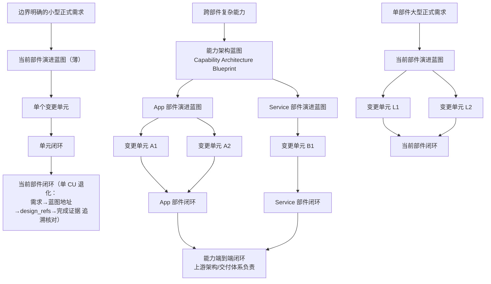

# 复杂能力建设总纲

> **定位**：这是 AgentMaison 下一阶段的体系建设目标与子 plan 上位约束，不是一次性实施清单。
> 后续单个 plan、OpenSpec change 和真实宿主建设批次都必须能说明自己推进了本纲的哪个目标、
> 为哪一层提供了什么能力，以及如何在真实宿主中证明有效。

## 0. 一句话目标

**定位句（2026-08-29 M7 裁决）：部件演进蓝图是每项正式需求在当前架构部件内的设计权威**
——它不是"复杂需求才启用的可选路线"，而是正式需求必经的部件内设计阶段（组织侧活动名
Story Design）。只有一种蓝图协议，内容深度由本次演进的真实影响面派生，不设档位、无升级
动作；不改变部件行为、外部契约、数据/NFR、运行语义或架构责任的纯文档与机械维护动作不
建蓝图。复杂多单元需求是该协议的完整形态，不是它的唯一入口。

把 AgentMaison 从“可靠完成一个边界明确的 Feature”，演进为：

> **对于每一项正式需求，能够在一个真实架构部件内部基于原始需求、当前事实和约束建立
> 部件演进蓝图；当需求来自跨部件能力时，再消费能力架构蓝图分配给当前部件的投影。随后
> 分解并连续完成一个或多个变更单元，最终以完整覆盖关系和真实宿主证据证明该部件已达到
> 目标形态，且没有需求、设计、实现或测试遗漏。无法由单个 Feature 高质量承载的真实需求
> 是这条链的完整形态：多个相互依赖的变更单元、共享部件级决策与组合验证义务同时出现。**

### 0.1 多版本建设目标

以下 G1–G8 是长期目标域，不是本文件中的待办状态；实际进度由引用它们的版本化子 plan、
OpenSpec change 和真实宿主证据共同证明。

| ID | 建设目标 | 核心边界 |
|---|---|---|
| `g1-meta-model-and-boundary` | 固化能力架构蓝图、部件演进蓝图、变更单元三类元模型、**统一正式需求入口与两种上游输入形态（跨部件投影 / 本部件直供）**、“部件而非仓库”的边界，以及稳定协议与 provider 接缝的边界（§11.2） | 不建立运行时第二权威；不为蓝图设档位或升级状态机 |
| `g2-upstream-capability-blueprint-handoff` | 在跨部件场景下建立上游蓝图到 Maison 的引用、能力分配、外部契约、不变量和 E2E 验收交接 | G2 是条件能力，不成为单部件大型需求的前置门槛 |
| `g3-component-discovery-and-design-lenses` | 建立证据驱动的公共发现内核与 App、Service 等设计透镜；以适配 4+1 视图及透镜必答题为强制根问题，经独立质询主动发现跨视图断链、变化轴、外部不稳定边界和缺失输入（§6.1/§6.5/§6.6/§11.3） | `project_profile`、视图骨架与 `design_lens` 分责；事实、设计决策与外部权责问题不得混同 |
| `g4-component-evolution-blueprint` | 建立部件演进蓝图的产出、适配 4+1 团队可评审设计视图、跨视图一致性、质询收敛、滚动调和和稳定知识归位；蓝图对每个实质候选变化轴作“直接实现或演进接缝”的显式裁决（§6.1/§6.5/§6.6/§11.3） | 视图是同一蓝图的观察面，不得成为平行文档或架构 SSOT |
| `g5-change-unit-graph-and-decomposition` | 建立 Change Unit 契约、蓝图视图节点/运行时流引用、类型化依赖、推进偏序、可执行集合、纵向拆分和安全中间态；演进接缝与新运行时主链均以带真实消费者的纵切单元落地（§6.1/§6.6/§11.3） | 图表达允许顺序与独立性，不成为通用图执行器 |
| `g6-change-unit-feature-pipeline-integration` | 让现有 Feature/Goal Mode 分别对设计已准入的有界 Change Unit 精确展开，由薄部件推进循环连续推进；施工契约和 review 必须消费相关蓝图视图节点，并检查跨视图一致性与“Consumer 不绕过接缝/状态 owner”（§6.1/§6.6/§8/§11.3） | 不新建跨单元运行状态权威或手工台账 |
| `g7-component-assembly-and-coverage-closure` | 建立“需求/目标→蓝图适配 4+1 视图→Change Unit→实现与证据”的部件级闭环，并覆盖跨视图一致性、初始化、写入、UI 刷新、恢复、风险、迁移、NFR、契约兼容与实现可替换（§6.1/§6.6/§9/§11.3） | 不越权宣称跨部件能力完成 |
| `g8-real-host-development-and-governance` | 以真实宿主复杂需求贯穿验证体系，并约束后续子 plan 对齐本目标 | framework fixture 不能替代语义验收 |

## 1. 为什么需要本纲

Maison 当前最强的能力是一条单 Feature 纵向流水线：

```text
spec → plan → coding → review → business UT → device/testing → completion
```

它已经能在一次 Feature 中设计数据模型、接口、控制/领域流程、状态管理、组件树、路由、
文件结构和测试契约。真正缺失的有两层：**每一项正式需求都没有一个部件内的设计权威**，
以及多个 Feature 之间没有一份共同、持续有效的内部目标模型。

**第一层（统一入口，2026-08-29 M7）**：spec 是单元施工契约，不是部件内设计权威。正式
需求若不先经过部件内设计阶段，产品行为、外部契约、数据/NFR、运行语义或架构责任的裁决
就只能挤进 spec 或事后从 spec 反向装配评审载体，形成平行设计真源。因此**每项正式需求
先进部件演进蓝图**；内容深度由真实影响面派生，小正式需求得到薄蓝图，不产生仪式化章节。

**第二层（复杂形态）**：

- 一项单部件大型需求，或跨部件能力分配到当前部件的建设内容过大，无法由一次 spec/plan
  安全承载；
- 拆成多个 Feature 后，各 Feature 容易各自局部最优，无法说明组合后是否得到同一个目标系统；
- `architecture.md` 当前只负责分层、模块集合、依赖边和出口约定，普通 Feature 内部的数据、
  接口、页面与状态设计又明确不进入它；
- module-catalog、code-graph、conventions、组件资产分别回答职责、符号、工程做法和 UI 复用，
  但没有任何一个资产负责“本次复杂能力在该部件内部最终长成什么样”；
- 单个 Feature 全绿，不等于多个 Feature 已正确组装，也不等于目标谓词与高风险全部覆盖。

因此需要在**正式需求**与单 Feature 施工之间补一层**部件演进蓝图**，并把 Feature 重释为
可验证的**变更单元**。跨部件场景可以从上游能力架构蓝图进入；本部件直供的正式需求（含
单部件大型需求）则直接从原始需求、当前事实和既有约束建立部件演进蓝图，不要求为了使用
Maison 先补造跨部件架构资料。两者是同一入口的两种上游输入形态，不是两条路线。

## 2. 已定术语与废止术语

### 2.1 正式术语

| English | 中文 | 定义 |
|---|---|---|
| Capability Architecture Blueprint | **能力架构蓝图** | 围绕一项完整业务或技术能力，描述一个或多个架构部件的当前态、目标态、协作关系、全局约束与端到端验收 |
| Component Evolution Blueprint | **部件演进蓝图** | 描述一个 App、微服务、独立部署单元、大型模块或数据子系统内部如何从当前态演进到目标态 |
| Change Unit | **变更单元** | 一次边界明确、可独立规划、实现、验证和安全合入的有界系统变换 |
| Design Lens | **设计透镜** | 针对某类部件规定必须发现的事实、必须回答的设计问题和最低验证证据 |
| Component Closure | **部件闭环** | 全部变更单元组装后，对部件目标、内部交互、迁移、NFR 和覆盖完整性的最终证明 |

### 2.2 词序与语义

- 使用“**能力架构蓝图**”，不使用“架构能力蓝图”。前者是“某项能力的架构”，后者容易被
  理解为组织开展架构治理的能力。
- `Component` 在本纲中指**架构部件**，不是狭义 UI 组件。App、微服务、网元、独立部署单元、
  大型业务模块都可以是部件。
- 部件边界不等于仓库边界：一个仓库可以包含多个部件，一个部件也可以在仓内跨多个模块/
  目录；仓库只是物理定位、版本控制和 Maison 运行的承载面。
- **正式需求（formal requirement）**：有明确交付或验收责任，且拟改变部件行为、外部契约、
  数据/NFR、运行语义或架构责任的事项，按正式需求处理；不改变这些语义的纯文档和机械维护
  除外。三条判定纪律：上游显式标为正式需求时该分类具有权威性；入口信息不足时由人确认、
  不猜测；当前不新增 track scoring 或机器 BLOCKER。
- **每项正式需求必经部件演进蓝图**（2026-08-29 M7 裁决，取代原"小需求可直接是一个 Change
  Unit"规则）。蓝图内容深度由本次演进的真实影响面派生：小正式需求得到薄蓝图并分解为
  一个 Change Unit。深度伸缩由**条件式设计义务**表达，只在对应事实出现时触发：
  - 发现多个 CU → 必须完成 CU 边界与关系分析（真实依赖、共享资源、可并行性、独立性）；
    只有事实要求时才生成 `requires` 与顺序约束，**不得为记录先后伪造依赖边**（对齐 §7.4）；
  - 发现共享部件级设计决策 → 只能在蓝图裁决一次，各 CU 经 `design_refs` 消费，不在多个
    Feature plan 各裁一次；
  - 发现"单独绿 ≠ 整体完成" → Component closure 追加真实组装与组合证据义务；
  - 安全中间态（`safe_intermediate_state`）是**单/多 CU 通用**义务，不挂在 ≥2 CU 条件下。

  **不设 compact/full 档位、升级信号或升级状态机**——只有一种蓝图协议。
- **非正式维护动作**（不改变上述语义的纯文档、机械重命名、依赖版本例行升级等）不建蓝图，
  继续走既有 L0/L1 轻量路径；存量平铺 Feature 原样有效，不迁移、不自动转 CU、不 credit，
  且在显式归属某份蓝图前不得进入 Component closure 聚合。
- 部件演进蓝图的**内容深度**由当前部件内的影响面、耦合度和整体闭环责任决定，与是否存在
  跨部件架构资料无关；能力架构蓝图只在跨部件场景下作为条件式上游输入。
- **术语对应**：组织侧把这个活动称为 **Story Design**；Maison 侧唯一 canonical 设计产物是
  **Component Evolution Blueprint**；宿主可从某个已准入 revision 派生人读/归档投影
  （**Story Document**），该投影零新设计事实、不成为第二真源（§11.2 三条接缝）。

### 2.3 在本议题中废止

- **Program**：此前既指单部件复杂建设，又一度被扩展为跨部件调度，概念发生漂移。本纲讨论
  的对象是架构知识资产，不是人员、预算、排期和里程碑管理对象，故不再使用 Program。
- **Element Blueprint / 架构元素蓝图**：Element 过于抽象，接口、表、服务、模块都可称
  element，不能表达有职责和生命周期边界的建设对象，改为 Component Evolution Blueprint。
- **Delivery Slice**：过度绑定敏捷交付语境，无法自然覆盖迁移、清理、基础能力和验证补强，
  改为 Change Unit。

将来若确实建设人员/预算/排期/跨团队状态治理，可另立 `Delivery Program`；它引用能力架构
蓝图，不得与蓝图重新合并成一个概念。

## 3. 从整体到局部的目标模型



> **图注（2026-08-29 M7）**：图上三个入口都是**正式需求**。小型正式需求经"薄蓝图"到单个
> 变更单元——它不再直连变更单元，蓝图不是复杂需求的专属路线；蓝图的薄厚由影响面派生，
> 不是两种协议。**非正式维护动作**（不改变部件行为、外部契约、数据/NFR、运行语义或架构
> 责任的纯文档与机械维护）不在本图内，继续走既有 L0/L1 轻量路径，也不进入任何部件闭环
> 聚合。单 CU 的部件闭环是既有算法在"跨单元组装边为空集"时的退化形态，不是第二套闭环。

### 3.1 能力架构蓝图：完整能力层

能力架构蓝图只在需求跨越多个部件、需要上游裁决部件分工和端到端责任时成为 Maison 的输入，
不是建立部件演进蓝图的统一前置条件。

能力架构蓝图回答：

- 为什么建设、能力边界和最终目标是什么；
- 当前涉及哪些部件，目标态需要哪些部件；
- 端云、服务、App、数据库、外部系统如何配合；
- 跨部件接口、事件、数据所有权和关键时序是什么；
- 哪些全局不变量、NFR 和风险不能被局部方案破坏；
- 每个部件被分配了哪些能力与验收责任；
- 端到端怎样证明完整能力成立。

适用时，短期由现有架构设计角色和既有组织流程创建、确认和维护。Maison 只消费被分配给当前
部件的投影，不重新裁决跨部件架构；不存在跨部件问题时，Maison 直接以真实原始需求和部件内
事实进入部件演进蓝图。

以接缝语义表述（§11.2）：SE/人工提供的契约投影是该上游输入接缝的**首个合法 provider**，
未来的自动交接只是同一接缝的后续 provider——接缝今天即存在，G2 建设的是替换或增强其
provider，而不是从零发明这种输入；这也不意味着云侧契约在自动交接建成之前不存在。

### 3.2 部件演进蓝图：Maison 的整体设计层

**正式定义（2026-08-29 M7）**：部件演进蓝图是**每项正式需求在当前部件内的设计权威**——
它把该需求的目标内部形态与共同决策裁决一次，并分解为**一个或多个** Change Unit。组织侧
把这个活动称为 Story Design；蓝图是 Maison 侧唯一 canonical 设计产物，宿主的 Story
Document 只能是某个已准入 revision 的派生投影（零新设计事实）。蓝图不承担 phase 运行裁决
权，也不冒充当前事实真源。

蓝图回答（回答的**深度**由本次演进的真实影响面派生，不适用维度按 §6.5 合法 disposition
表达，不以空章节凑齐形式）：

- 当前部件已经具备什么，依据是代码还是仅有文档宣称；
- 原始需求目标，以及适用时上游分配的能力，在部件内部由哪些职责、模块和接口实现；
- App 内的数据、状态、控制、交互怎样闭环；
- App 在冷启动、恢复前台、页面挂载、后台/系统事件和账号切换等时机加载什么数据，由谁持有、
  怎样发布和订阅、如何驱动 UI 自动刷新，以及进程死亡后如何恢复；
- 微服务内的领域模型、数据库、表、索引、接口、事件、事务、一致性和迁移怎样设计；
- 当前部件需要消费哪些外部接口、事件和数据语义，已有契约引用是什么；缺失时向对应 owner
  反馈什么消费需求、阻塞门槛和解除条件，而不是由 Maison 代替外部部件冻结契约；
- 哪些能力直接复用、配置、适配、演进、替换、新建或退役；
- 如何保持兼容、灰度、回滚和安全中间态；
- 应拆成哪一个或哪几个 Change Unit；出现多个单元时，哪些存在严格前置、哪些可以独立推进，
  以及实际执行如何选序；
- 哪些目标和风险只有组装后才能验证（单 CU 时该项为空集，是合法结论，不是缺项）。

为了同时服务 SE、开发、测试评审和下游机器消费，蓝图内部至少形成三组同源内容：

- **评审摘要**：范围、当前态与目标态、关键流程、主要决策、风险、待决项和 Change Unit 地图；
- **设计视图**：以 §6.1 的适配 4+1 为稳定组织骨架，再由 design lens 填充部件特有问题；至少
  区分逻辑、运行时、开发、条件式平台/部署和关键场景，并承载领域/数据模型、数据与控制流、
  UI/状态映射、外部契约、实现模块、运行拓扑、调用时序、失败恢复、迁移/NFR/可测试性等真实
  设计；满足 §6.6 触发条件的 App 必须在运行时视图内形成结构化数据闭环；
- **决策与缺口**：区分证据事实、已裁决设计、外部输入缺口和不适用项，记录来源、责任方、
  阻塞门槛和解除条件。

这三组内容是同一部件演进蓝图的组织结构或派生视图；适配 4+1 也只是其中“设计视图”一组的
观察面，不产生五份独立文档，不新增第四类对象、平行设计真源或手工状态台账。部件演进蓝图
既不是 `architecture.md` 的替代品，也不是多个 Feature plan 的粘贴汇总；
它负责团队共同设计，承载**本次演进**的目标内部形态和共同决策，Feature plan 仍只负责一个
Change Unit 的精确施工 delta。

**术语边界（2026-08-29 M7）**：

| 名称 | 定位 | 谁写 |
|---|---|---|
| Story Design | 用户/组织侧对"部件内设计阶段"这个活动的称呼 | — |
| Component Evolution Blueprint | 唯一 canonical 设计产物（Maison 侧机器 SSOT） | Maison |
| Story Document | 可选的人读/内网归档**投影**，严格派生自一个 admitted revision、零新设计事实 | 宿主装配 |
| story 类宿主扩展 | 输入获取（acquisition）与归档（publication）adapter，不承担设计语义 | 宿主 |

> 2026-08-21 裁决：蓝图是**一次演进的设计权威**，不是部件的常驻设计真源。三条身份定义：
>
> 1. 一份具体蓝图对应**一次**部件演进（一个 `blueprint_id`），不是一个部件的永久单例；
>    同一部件（同一 `component_id`）可以先后存在多个 `blueprint_id`，各自拥有独立的目标、
>    变更单元集合与闭环声明，工作树上互不覆盖；
> 2. 同一次演进内的认知更新使用 revision 递进（§4.2 的 `Bᵢ → Bᵢ₊₁`）；出现独立目标、独立
>    验收范围和独立闭环声明时，新建 `blueprint_id`，不在旧蓝图上原地续写；
> 3. 蓝图与其变更单元契约、Feature 施工产物同属**该次演进的工作区**，随需求归档；蓝图
>    realized 后整个工作区即为演进记录。具体工作区路径契约由 P1–P3 OpenSpec 锁定，本纲
>    不写死路径。
>
> 在建设窗口内，蓝图对本次演进的 Change Unit 与部件闭环是唯一设计权威，下游必须经
> `design_refs` 机器可校验地消费；窗口关闭（闭环+知识归位）后它降级为历史档案，长期
> 结论只活在归位后的既有真源中。

### 3.3 变更单元：Maison 的执行层

一个 Change Unit 必须同时满足：

1. 有清晰业务或工程目的，而不是“因为文件很多所以切一块”；
2. 输入契约已稳定，或存在可信 fake/simulator/contract test；
3. 修改范围和写集有清晰所有权；
4. 单独合入后系统处于安全、兼容、可恢复的中间态；
5. 有独立的完成谓词和验证证据；
6. 不需要未来单元完成后才能解释“当前为什么正确”；
7. 对所属蓝图提供明确 `provides`，并只消费显式 `requires`。

## 4. 图模型：分层关系、派生视图与循环语义

### 4.1 模型边界

本纲不建设一张统一的“总图”。下列模型服务不同问题，拥有不同节点、关系语义、生命周期和
事实来源：

| 模型 / 视图 | 回答的问题 | 权威边界 |
|---|---|---|
| 部件形态投影 | 当前部件是什么形态、目标形态是什么、一次变换改变什么 | 当前态来自代码/schema/接口/配置/测试等事实；目标态来自部件演进蓝图；投影本身不是新 SSOT |
| Change Unit 类型化关系 | 哪些单元可以独立推进、在哪个门槛互相阻塞、怎样组装 | 来自 Change Unit 契约、蓝图决策、迁移要求、验证责任和写集 |
| 现有 phase DAG | 一个 Feature 内各阶段怎样前置和推进 | `workflow.yaml` 及现有 phase 运行契约 |
| events/reducer 运行时转换系统 | 当前 run 发生了什么、下一步能做什么、怎样恢复 | `events.jsonl`、reducer 和统一裁决内核 |
| 能力降级保证格 | 能力缺失时可以诚实承诺到什么等级 | capability resolution 与保证等级契约 |
| Code Graph | 当前代码的符号、调用和影响关系 | 源码派生导航索引，保持非 SSOT |

这些模型可以相互引用或产生派生投影，但不得合并为同一个运行时 schema、节点/边注册表、图数据库
或执行权威。“某个投影可以画成图”不构成建设图执行器的理由。

### 4.2 部件形态投影与有界变换

每个 `Gᵢ` 是部件在某一时刻的目的性结构投影，不要求完整复制代码，也不默认持久化为新的事实源：

```text
部件形态：G₀ --T₁--> G₁ --T₂--> G₂ --...--> G*
                               └--compensate/recover--> Gsafe

蓝图认知：Bᵢ --new facts / reconcile--> Bᵢ₊₁
```

- `G₀`：由当前代码、schema、接口、配置、测试和可信知识资产共同观测；
- `G*`：部件演进蓝图定义的目标形态；
- `Tᵢ`：一个 Change Unit 带前置条件、影响范围、保持不变量、目标谓词和恢复边界的有界变换；
- 中间 `Gᵢ`：必须可构建、可验证、可兼容或受控隐藏，不能依赖“全部做完自然就好”；
- rollback/recovery 不承诺精确回到历史 `Gᵢ`，不可逆迁移或外部副作用可能只能补偿到新的
  `Gsafe`；
- reconcile 修改的是蓝图认知与后续工作，未必让真实部件形态倒退；retry 是对变换的再次尝试，
  也不自动成为一条新的结构关系。

因此，演进不预设为只能向前的线性故事，但也不得把调和、重试、补偿和运行时恢复混成同一种
反向边。

### 4.3 Change Unit 类型化关系与门槛投影

Change Unit 之间是**类型化关系模型**，不是一张只含普通有向依赖的图。它至少允许有向依赖、
对称冲突和组合验证关系；全部关系的并集不预设无环。

| 类型 | 关系形态与含义 | 默认影响的推进门槛 |
|---|---|---|
| contract | 有向；B 需要 A 提供稳定接口/模型 | 契约未冻结且无可信 fake/mock 时阻塞相应设计或开发 |
| runtime | 有向；B 的真实运行依赖 A 的实现 | 通常不阻塞并行开发，阻塞集成和部件闭环 |
| migration/order | 有向；schema、回填、双写、部署或启用有严格顺序 | 阻塞声明的合入、部署或启用门槛 |
| verification | 有向或组合关系；完成证据需要其它单元或组合环境 | 阻塞完成资格，不默认阻塞开发 |
| write-conflict | 对称；共享文件、模块、表或导出面 | 阻塞未经协调的并行写入或合入 |
| decision | 单元依赖尚未冻结的数据库、事务、接口等关键决策；另一端不必伪装成 Change Unit | 阻塞受该决策影响的设计或开发 |

`depends_on`、可执行队列和拓扑顺序只能是针对特定门槛的派生结果，不能成为唯一事实源。权威输入
仍是 `requires/provides`、迁移顺序、验证要求、写集冲突和决策状态。

严格前置关系在指定门槛上形成的是**偏序**，不是预先写死的完整施工序列。两个 Change Unit
之间没有严格前置边，只表示依赖语义未规定谁先谁后；是否具备真实并行条件，还必须同时检查
write-conflict、迁移/启用门槛、共享环境、契约稳定性和组合协调责任。实际执行把偏序线性化时，
不得为了记录“这次先做了 A”而补造 `A → B` 依赖边。

上表定义的是可按需采用的**关系语义词汇**，不是 G5 首版必须全部实现的 schema 清单。G5 首版只
实现真实宿主已经出现、且有明确消费点的最小关系集合；尚未出现的关系保留为概念边界，不提前
建设字段、存储、checker 或运行机制。对于实际实现的每种关系，schema 必须在类型级一次性定义
方向与参与端数量、默认 `blocks_at`、满足事实、权威来源和生命周期；实例只记录必要引用与条件，
不逐边复制整套类型规则。`cycle_protocol` 属于整个协调组或循环协议，不由环内每条边各写一份
互相可能矛盾的声明。

### 4.4 阻塞环与协调协议

SCC 只能分析具有一致方向和等待语义的**指定派生投影**，不得直接作用于全部类型化关系的并集：

- **execution-precedence 投影**：只包含当前门槛的严格前置关系；它必须无环。发现环时，应冻结
  稳定契约并提供 seed/fake，声明 barrier/协调组，或因无法形成安全中间态而合并为组合
  Change Unit；
- **gate-specific wait-for 投影**：只包含当前门槛尚未满足且真实阻塞的关系；在这里执行 SCC
  分析以发现等待闭环；
- **冲突、组合验证和描述性关系视图**：可以合法有环，不能仅凭成环推导执行死锁。

对于需要协议的阻塞 SCC，必须存在至少一种可检查的出路：可执行 seed、已冻结契约/mock、明确
barrier/协调者、可观测解除条件、恢复出口，或带退出条件与预算/指纹/下降度量的迭代协议。若同一
门槛上的所有节点相互等待，且没有 seed、当前可执行入口、解除条件或逃逸边，则判为设计缺陷。

SCC 折叠后的 condensation graph 只能作为该投影的宏观排序和解释视图，不持久化为第二权威，
也不能取代 SCC 内部的协调或收敛协议。

### 4.5 派生视图、进展判据与权威边界

- 未满足当前门槛阻塞关系的 Change Unit，不得取得对应设计、开发、合入、集成或完成资格；
- 当前门槛前置条件均已满足、且不存在对应门槛 blocker 的单元共同构成**可执行集合（ready set）**；ready set
  可以同时包含多个单元，但只表达“当前可选择”，不承诺运行时一定并发执行；
- 每个未完成目标必须二选一：存在当前可执行 Change Unit，或存在带责任方、阻塞门槛、解除条件
  和事实来源的结构化 blocker；
- 解除条件可机器观测的 blocker 必须带 probe；只有真正需要人类判断或授权的 blocker 才允许
  没有 probe，继续复用 e5 的同源裁决语义；
- 每个变换必须保持其声明的不变量；无法形成安全中间态的多个单元不得假装可以独立合入；
- 图、SCC、队列和状态都必须能由权威事实重建，不新增手改完成态、并行 ledger 或图执行权威；
- 本纲不承诺外部环境下必然最终完成，但必须保证系统不会静默卡死，也不会把阻塞或未完成伪装
  成完成。

图只能表达关系和循环，不能自动保证终止或正确。调和循环仍须依靠明确退出条件、有限预算、
空转指纹、严格下降度量或可观测 probe。

## 5. 知识资产如何进入体系

### 5.1 当前态事实优先级

| 资产 | 负责回答 | 不负责回答 |
|---|---|---|
| 代码、DDL、IDL/OpenAPI、配置、测试 | 当前真实实现和可执行行为 | 人类设计意图和未来目标 |
| `architecture` DSL / `architecture.md` | 分层、模块集合、依赖边、出口与架构级契约 | 本次复杂能力的内部完整设计 |
| `module-catalog.yaml` | 模块职责、边界、关键导出、易混点 | 深入的内部能力结构和目标演进 |
| `code-graph.yaml` | 符号、入口、引用和导航线索 | 正确用法、目标设计和完成证明 |
| `conventions.md`（e4） | 本仓横切工程惯例、正确使用姿势和 review 核对 | 为本次建设替代架构决策 |
| 组件 index/catalog/selection（b9） | 可复用 UI 组件事实、用途限制和本次选型 | 通用服务能力发现、完整适配证明 |
| 长期 feature spec/scenarios | 当前用户可见行为与全量业务场景 | 本次施工状态或蓝图执行进度 |
| ADR | 已裁定且值得长期保留的关键决策与理由 | 可变执行状态和详细任务清单 |

### 5.2 发现纪律

- 文档声明不能单独证明能力存在；关键复用结论须能追到代码、导出、schema、测试或运行证据。
- 代码中的多数写法不自动等于工程惯例；惯例须有人确认或由稳定门禁承载。
- 派生索引必须可重建、稳定、瘦，不保存高频漂移统计和手工状态。
- 策展知识只保存代码看不出的用途、限制、混淆和决策，不复制派生事实。
- 设计中的未知必须标为 unknown/open decision，禁止用貌似完整的目标结构掩盖证据缺口。

### 5.3 完成后的知识归位

部件演进完成后：

| 稳定结果 | 归位位置 |
|---|---|
| 分层、模块集合、依赖边变化 | architecture DSL + `architecture.md` |
| 模块职责与公开能力变化 | `module-catalog.yaml` |
| 可跨需求复用的工程做法 | `conventions.md` |
| 可复用 UI/公共资产 | 对应 index/catalog |
| 当前用户行为和规则 | 长期 feature spec |
| 全量业务验证场景 | scenarios / acceptance 资产 |
| 关键长期决策 | ADR |
| 一次施工细节和证据 | Change Unit 的既有 Feature 产物与 reports |

部件演进蓝图可保留为演进记录或标记 realized/superseded，但不得与上述当前态资产竞争真值。

跨演进依赖同理（2026-08-21 裁决）：下一次演进的蓝图从当前代码与归位后的长期真源重新发现
当前态，可以引用旧蓝图与 ADR 作为历史依据，但**不得把旧演进变更单元的 `provides` 当作新演进
的依赖满足来源**——`requires/provides` 的满足域与 carry-forward 均限定在同一 `blueprint_id`
之内。归位做得干净，是蓝图可以安心退役的前提：若某类长期结论（如变化轴 `keep_direct` 的
再提取条件）缺少归位出口，旧蓝图会被迫复活为第二真源，这属于归位规则要堵的缺口。

## 6. 适配 4+1 设计视图骨架与部件透镜

本纲借鉴 [Kruchten 4+1](https://doi.org/10.1109/52.469759) 的多视图思想，但不机械复制原模型，
也不宣称形成某项标准合规文档。
Maison 使用**关注点驱动的适配 4+1**：它是同一部件演进蓝图内部的稳定完整性骨架，具体内容由
App、Service 等 design lens 填充；视图可以由结构化节点、表格、图或文字表达，只有能降低歧义
的表达才要求生成，不以“画满五张图”作为完成标准。

术语上，§6.1 的稳定定义是可复用 **viewpoint contract**（规定关注点、适用性和检查规则），某份
具体部件蓝图中的内容才是 **view**；两者都是部件演进蓝图协议/内容的一部分，不新增顶层对象。

### 6.1 公共视图契约与跨视图一致性门

| 稳定视图 id | 主要回答 | 适用性 |
|---|---|---|
| `logical`（逻辑/领域、数据与契约） | 部件有哪些职责、领域对象、数据、接口/事件、不变量与所有权 | 所有部件必需 |
| `runtime`（运行时/Process） | 生命周期与场景触发后，各运行元素怎样交互、持有状态、并发、传播、失败和恢复 | 可执行部件必需；真正纯静态/构建期部件才可有证据地不适用 |
| `development`（开发/实现结构） | 目标设计怎样落到模块、包、源码、依赖、公开接缝、代码 owner 与测试点 | 所有部件必需 |
| `deployment`（平台/运行拓扑，原 Physical） | 软件元素映射到哪些进程、设备、后台任务、存储、容器或外部运行环境及其约束 | 条件式；不得因“单部件”自动删除 |
| `scenarios`（+1 关键场景） | 哪些正常、异常、生命周期和演进场景贯穿并校验前四个视图 | 所有复杂部件必需 |

每个适用视图及其中可被施工消费的节点必须具有稳定 id，并区分：

- **关注者与用途**：谁会消费该视图、它回答哪些 concern、用于评审/施工/分析/验收中的哪一步；
- **当前态证据**：来自代码、schema、接口、配置、测试或权威资料；
- **目标态设计**：本次演进要形成的元素、关系、行为与约束；
- **演进 delta**：哪些保留、修改、新增、迁移或退役，以及兼容和安全中间态；
- **决定与缺口**：provenance、unknown、合法 disposition、owner 与 needed-by；
- **验证义务**：本视图和跨视图关系要由什么层级证据证明。

迁移、兼容、灰度、回滚、NFR、安全、隐私、观测、可测试性、变化轴和演进接缝属于
**cross-view / beyond 信息**：必须关联到受影响的视图节点和场景，不强塞进某一个视图，也不
另建平行蓝图。

蓝图可送评审前必须检查以下跨视图一致性；不适用只能以 §6.5 的合法 disposition 明示：

1. 每个关键场景步骤都能追到相关 logical 元素、runtime 交互与 development owner；跨运行边界时
   还能追到 deployment 节点；
2. 每条 runtime 数据/调用边都引用其 logical 数据、契约或不变量，并有 development 实现责任；
3. 每个会变化的 logical 状态都有 runtime 写入/传播路径与至少一个场景；静态数据须显式说明；
4. 每个 development 模块都由业务/运行关注点或有证据的技术决策解释，不因分层习惯制造空模块；
5. 每个适用 deployment 节点都能追到实际运行的软件、数据和平台约束；外部节点只引用已知契约，
   不由当前部件替其设计；
6. 同一术语、契约、状态 owner 和失败语义在各视图中一致；冲突必须进入调和而非各说各话。

所有部件还必须回答当前/目标范围、原始需求和来源、复用/配置/适配/演进/替换/新建/退役、
Change Unit 类型关系、派生推进视图和覆盖闭环。

### 6.2 App 透镜

- **logical**：本地领域/数据模型、缓存与持久化语义、数据所有权、端云同步、外部接口/事件及
  UI 所需 projection；
- **runtime**：数据生产者/消费者、权威真源、共享状态 owner、冷启动/热恢复/前后台/页面挂载、
  后台或系统事件、账号切换、进程重建、初始化、发布订阅、并发、失效重查与失败恢复；满足
  §6.6 时必须形成结构化运行时数据闭环；
- **development**：页面/组件、ViewModel/Store、领域服务、Repository、适配器等真实模块和依赖，
  既有 UI/公共资产、代码 owner、演进接缝、测试接缝与 Change Unit 落点；
- **deployment**：App 进程、后台任务/系统扩展、设备与账号环境、本地存储、外部运行服务、权限
  和平台生命周期约束；若确实只有单一运行节点，也要检查进程死亡、持久化与外部边界后再裁决
  是否不适用；
- **scenarios**：关键用户路径、冷启动、页面恢复、后台写入、重复/乱序事件、失败重试、账号切换
  和进程重建，串联数据、状态、交互反馈、取消/超时与 UI 自动刷新；
- **cross-view**：大字体、无障碍、资源适配、性能、隐私、安全、迁移、兼容，以及 UT、组件/
  页面自动化、真机与人工专项的证据分配。

### 6.3 Service 透镜

- **logical**：领域边界、聚合/实体/值对象、数据所有权、API/IDL、事件、不变量与鉴权语义；
- **runtime**：请求/消息处理、事务边界、一致性、幂等、并发、重试、补偿、故障与恢复；
- **development**：服务内模块、端口/适配器、存储和消息实现、依赖方向、公开接缝与测试点；
- **deployment**：进程/容器、数据库、消息基础设施、外部服务、网络/区域拓扑和发布环境；
- **scenarios**：关键请求、事件、失败、超时、重放、迁移和降级路径，贯穿其它视图；
- **cross-view**：schema 迁移/回填、旧接口融合、双轨、灰度、回滚、下线、日志、Trace、指标、
  告警、容量、性能、故障注入及验证分配。

### 6.4 profile 与 lens 的边界

```text
view_skeleton   → 用哪些稳定观察面覆盖 stakeholder concern，并怎样检查跨视图一致性
design_lens     → 这种部件在各视图中必须发现什么、设计什么、证明什么
project_profile → 怎么编译、运行、测试；语言/模块格式/toolchain/设备能力
```

同一 view skeleton 支持多种 lens；一个 profile 可以支持多种 lens，同一种 lens 也可以有多个
语言/toolchain profile。禁止为了省一个字段，把 stakeholder concern、工程类型、设计语义和验证
能力重新塞成单一枚举。

### 6.5 证据驱动的设计质询与分层收敛

> 2026-08-18 裁决：蓝图不能只列“应该回答什么”，还必须主动发现材料中的静默缺口；但质询
> 不能把所有事实和决策重新甩给用户，也不能以“问完很多问题”冒充设计完成。

蓝图构建以每个适用视图、跨视图一致性门和 design lens 必答题为**强制根问题**，再由独立质询
provider 把当前草稿和证据包映射为设计树。不得只因某个视图标题存在就视为已回答，也不得用
一个场景图替代被它贯穿的逻辑、运行时和开发设计。每轮只展开前置已经具备的 frontier；质询方
可以新增需求特有的分支，但不得把编写方的自我总结当证据。事实调查由 Agent 读取 PRD、代码、
schema、契约、测试和既有资产完成；
只有产品语义、外部契约、风险接受或不可逆取舍等真实权责问题才升级给有权者，并按当前
frontier 批量给出选项、推荐答案、依据和影响。

质询 provider 可由独立 subagent 或等价隔离上下文实现；它借鉴 `grill-me` 的逐层追问方式，但
把“质询者问、蓝图编写者携证据回答”内化为 Agent 内部循环，不把重复对话原样转嫁给用户，也
不把同一上下文的自我同意视为独立审查。

每个必答问题必须得到一种明确 disposition；“已处置”不等于“全部已经解决”：

| 问题类型 | 合法 disposition | 最低要求 |
|---|---|---|
| 当前事实 | `answered_with_evidence`；无法查证时为 `open_decision` / `blocker` 并保留 `unknown` | 已回答时指向可复核的 PRD/代码/schema/契约/测试/资产证据；未回答时不得伪造事实 |
| 部件内设计决策 | `decided_with_authority` | 记录选项、取舍、决定和有权 owner；证据支持决策但不冒充唯一答案 |
| 外部输入或权责决策 | `open_decision` / `blocker` | 记录责任方、推荐答案、阻塞门槛、影响和解除条件；不得由 AI 补造 |
| 不适用 | `not_applicable` | 说明为何不适用及重新触发条件（若存在） |

`unknown` 是蓝图内容级的认知标记，回答“什么尚不确定”，不是第五种问题 disposition；disposition
回答“这个问题当前如何处置”。证据不足的内容必须保留 `unknown`，再按准入门选择
`open_decision`（当前门允许延期，带 owner/needed-by）或 `blocker`（阻断当前门）。
`decided_with_authority` 只能完成有权设计裁决，不能把未知事实变成已知；`not_applicable` 必须有
适用性依据，也不能用来隐藏 unknown。

质询按滚动细化而非一次性大设计收敛，设三层准入：

1. **蓝图可送评审**：所有强制根问题均已处置；需要人裁决的 frontier 已成包，文档中不存在
   静默假设。人评审本身可以完成 `decided_with_authority`，不得要求所有人类决策在评审前闭合；
2. **Change Unit 设计可施工**：当前单元引用的设计切片及其关键外部输入已经裁决，相关 blocker
   已解除；远期单元允许保留带 owner 和 needed-by 门槛的 open decision；
3. **部件可闭环**：所有影响目标完成声明的设计决策、外部输入和剩余风险均已关闭或被有权者
   显式接受，并能追到实现与验证证据。

首期只需稳定问题标识、frontier 集合和轮次/成本预算检测无进展；同一未解决 frontier 重复或预算
耗尽时形成结构化 blocker，不静默 PASS。不得为质询另建常驻调度器、跨轮次可变 ledger 或第二
恢复权威。问答轮次与质询报告只是过程证据；稳定事实、决策和 open decision 只归入蓝图及既有
ADR/契约真源。具体质询算法是可替换 provider，§11.2 的稳定协议与权威边界不随其变化。

### 6.6 App 运行时（Process）视图中的数据闭环与完整性门

> 2026-08-18 裁决：数据模型只回答“有什么数据”，运行时数据闭环必须继续回答“何时加载、谁
> 持有、怎样变化、怎样传播、谁消费、失败后怎样恢复”。仅列数据库、接口、Store 和页面，不
> 构成完整设计。

本节是 §6.1 `runtime` 视图在 App 数据状态领域的结构化子模型，不是 4+1 之外的第六个视图。
App 满足下列任一条件时，runtime 视图必须产出运行时数据闭环节点：

- 持久化或远端数据会被 UI 展示；
- 同一数据被多个页面、组件或聚合 projection 消费；
- 存在后台、系统、外部或定时写入；
- 冷启动、恢复前台、页面挂载或账号切换时需要加载、刷新或调和；
- 一处用户修改需要刷新其它消费者；
- 存在缓存、云同步、数据新鲜度、一致性或进程重建要求。

全部不满足时只允许该**数据闭环子模型** `not_applicable`，且必须给出证据和重新触发条件；
可执行 App 的 runtime 视图本身仍须覆盖其它运行交互。运行时数据闭环是 runtime 视图中的稳定
命名节点，不是第四类顶层对象或平行文档；首期语义最小形状如下，最终 schema 由 P1 OpenSpec
锁定：

蓝图构建必须按同一数据域做双向追踪与生命周期交叉检查，不能从模板或模型常识直接猜答案：

1. 从页面、组件、聚合 projection 和业务 consumer **反向**追到首次数据来源、状态 owner、订阅/
   查询入口与权威持久化；
2. 从 lifecycle、用户、系统、外部和 schedule producer **正向**追到幂等、写入、发布/失效、
   派生重算与所有受影响 consumer；
3. 对 cold start、warm resume、page attach/detach、account switch、process recreation 和
   background write 建立适用性矩阵，检查两条追踪链在每种状态下能否闭合；
4. 每条边绑定代码符号、schema、测试、权威契约、需求或有权裁决等 provenance；仅靠推断的内容
   必须标明推断及置信边界，证据冲突或缺失则进入 §6.5 的 unknown/open decision/blocker；
5. 反向找不到来源、正向找不到 consumer、或两边落到不同权威时，必须作为 frontier 交给独立
   质询，不得由蓝图编写者补成看似完整的链。

```yaml
design_views:
  runtime:
    runtime_data_flows:
      - id: <stable-id>
        data_domain_refs: []
        external_contract_refs: []
        source_of_truth:
          authority: <local-remote-or-reconciled>
          persistence: []
          projections_and_caches: []
          reconciliation: <rule-or-not-applicable>
        triggers:
          - kind: lifecycle | user | system | external | schedule
            timing: <cold-start-resume-page-attach-or-other>
            idempotency: <rule>
        initial_load:
          strategy: eager | lazy | snapshot_then_refresh | not_applicable
          owner: <responsibility-or-symbol>
          data_scope: <what-is-loaded>
          freshness: <rule>
        state_owner:
          ref: <store-view-model-repository-or-other>
          states: []
        mutations: []
        publications: []
        subscriptions: []
        consumers: []
        failure_recovery: []
        decisions_and_gaps: []
        evidence_refs: []
        verification_refs: []
```

每条运行时流必须满足以下完整性不变量；不满足时形成带证据的 open decision/blocker，不得以一段
“使用状态管理自动刷新”的概述通过：

1. 每个 UI/业务消费者读取的数据都有权威来源、首次加载路径和后续更新路径；
2. 每次 mutation 都有唯一或显式调和的提交 owner，并能追到持久化/外部副作用；
3. 每次成功写入都有 publication、invalidation 或重新查询路径，能覆盖所有受影响消费者；
4. 每个订阅都有 initial snapshot/replay、顺序/并发和 attach/detach/清理语义；
5. 后台写入在 UI 或原进程不存活时仍有持久化事实与恢复调和路径，不只依赖内存通知；
6. 每个 lifecycle/system trigger 都有重复触发幂等、失败、超时和恢复语义；
7. loading/empty/ready/stale/error/syncing 等实际需要的状态均有 UI/业务处理或合法不适用说明；
8. UI 对共享业务数据的正式修改不得绕过已裁决的 command/写入 owner；页面本地草稿可双向绑定，
   但提交后必须回到同一权威写入—发布—消费链。

准确性不由生成 Agent 自报 PASS：结构化不变量只能证明“链的形状没有明显空洞”，§6.1 的
跨视图一致性门检查它是否引用同一 logical 数据/契约和 development owner，独立质询负责反向找
反例；施工时再用 `design_refs` 将边落到真实符号，部件闭环最终以分层测试和可观察 UI/设备
结果证明真实行为。任何一层缺少证据，都只能保留 unknown、open decision 或 blocker，不能把
“设计合理”写成“实现准确”。

蓝图可送评审门允许上述缺口以有 owner/needed-by 的 open decision 明示；当前 Change Unit 涉及的
运行时边在进入施工前必须裁决并解除 blocker。独立质询 provider 必须检查此视图的静默断链，
不能由蓝图编写者仅凭自述宣称完整。

## 7. Change Unit 分解与推进原则

### 7.1 默认纵切，不默认按层切

优先拆成可以观察和验证的能力增量，例如：

```text
最小主链 → 持久化/恢复 → 真实外部适配 → 异常/补偿 → 适配/NFR/迁移收口
```

不默认拆成：

```text
数据层 Feature → 控制层 Feature → UI Feature
```

纯横向单元只有同时满足以下条件才成立：

- 产生稳定且被多个后续单元消费的契约/基础能力；
- 自身有真实消费者或可执行验证；
- 可独立合入且不制造不可用中间态；
- 后续单元不需要反向推翻其核心设计。

### 7.2 每个单元的最小契约

```yaml
change_unit_id: <stable-id>
component_blueprint_ref: <path-or-id>
design_refs: []
purpose: <本次改变什么能力或风险>
preconditions: []
requires: []
provides: []
touches: []
preserved_invariants: []
target_predicates: []
verification_refs: []
safe_intermediate_state: <为什么可以单独合入>
```

这只是语义目标，最终 schema 须由独立 OpenSpec change 锁定；在此之前不得把示例直接当运行时
协议实现。`design_refs` 表达当前单元消费的蓝图视图节点、决策或外部契约引用，不复制其正文，
也不把蓝图整体抬进单元施工契约。P1 必须锁定统一的稳定节点寻址语义，例如
`blueprint#view:runtime/<flow-id>`；logical、development、deployment 和 scenarios 也走同一字段，
不为每个视图另增一组平行 refs。

### 7.3 滚动细化

- 蓝图先锁定目标、边界、关键决策、依赖和整体闭环；
- 只把近期 Change Unit 的相关设计切片细化到“设计可施工”，远期单元保留目的、契约、风险及
  带 owner/needed-by 门槛的 open decision；
- 当前单元必须引用其实际改变的视图节点，以及证明该 delta 的关键场景；不要求机械引用全部
  4+1 视图，但不得漏掉因当前修改而变化的跨视图关系；
- 新建或重构一条共享运行时数据主链时，首次施工单元必须纵向包含权威来源/持久化、状态 owner、
  发布或失效语义、至少一个真实消费者和可执行验证，不允许只建无人消费的 Store/EventBus 空壳；
- 每个单元完成后用代码和证据刷新当前态，检查后继前提是否仍成立；
- 发现目标或关键决策变化时，先调和蓝图，再重排/修订后继单元；
- 已完成单元的真实结果不因重新规划被抹去；需要纠正时创建新的修正单元或 revision，并用
  `revises` / `supersedes` / `invalidates` 等历史关系显式承接，而不是把已完成状态改回 pending；
- 单 Feature 内的 retry/backtrack/recovery 继续由现有 events/reducer 表达；部件级补偿、迁移
  回退或恢复若形成独立建设内容，应进入蓝图或成为 Change Unit，不作为普通静态依赖边混入。

### 7.4 允许顺序与实际执行顺序

- Change Unit 关系模型先表达业务、技术、迁移和验证上的真实约束，由这些约束派生推进偏序和
  当前 ready set，不预先把所有单元排成一条链；
- 同一 ready set 中的多个单元若不存在严格前置关系，图上保持无序。优先级只用于选择，不得
  冒充依赖；实际串行执行产生的先后也只属于执行轨迹；
- “图上允许独立推进”不等于“可以无条件并行写入”。存在 write-conflict、共享环境互斥、未冻结
  契约或迁移 barrier 时，可以不规定先后方向，但必须禁止未经协调的并发；
- 首版执行策略默认单并发：从 ready set 中按显式优先级和稳定、可解释的 tie-break 规则选择一个
  Change Unit。这样保留未来并行空间，同时无需先引入多 writer、锁或分布式恢复。

## 8. Maison 流水线的目标接法

### 8.1 spec

- **时序（2026-08-29 M7）**：正式需求的 spec 一律位于蓝图与 Change Unit **之后**；spec 不再是
  任何正式需求的第一个设计产物。spec 阶段只是兜底复核点——发现事项符合正式需求判据却未经
  蓝图时，指出"应先经 /component-design"并给出回退入口，不加机器 BLOCKER（lite 轨的
  /change-lite 首次冻结施工意图处同样兜底，见 §13）；
- 继承 `component_blueprint_ref`、当前 Change Unit 目的、原始需求目标和目标谓词；跨部件场景再
  继承分配能力、外部契约与端到端验收引用；
- 仍做术语、范围、用户可见数据语义、业务规则、场景、异常、NFR 和验收澄清；蓝图不得替
  spec 偷偷裁决尚未明确的产品行为；
- 不重新发明部件目标结构，也不默默改变适用时的上游跨部件契约；
- 新发现足以推翻蓝图的事实，必须路由为蓝图调和，不带病进入 plan。

### 8.2 plan

- 继续负责当前 Change Unit 的数据模型、接口、控制/领域、展示、文件和测试可行性的精确设计；
- 必须消费该单元的 `design_refs` 与已准入设计切片，不得把 plan 作为第一次发明部件级数据模型、
  数据/UI 主链或外部契约语义的地方；缺失时回到 spec 澄清、蓝图调和或外部 owner，不以 TBD
  或无依据补全混入施工；
- 必须把当前 delta 涉及的 logical、runtime、development、适用时 deployment 节点和关键 scenario
  投影到同一份 Feature plan/既有施工契约中；只展开当前单元切片，不复制五份视图；
- 当前单元涉及 §6.6 运行时流时，必须把相关触发、初始化、状态 owner、mutation、发布订阅、
  consumer 和恢复语义精确投影到既有 `plan.md`、`contracts.yaml`、适用时的 `use-cases.yaml` 与
  测试契约；这些只是当前单元施工切片，不成为第二份部件蓝图；
- 每项设计必须能映射到 Change Unit 的 provides/target predicates；
- 模块和写集不得越过蓝图与 spec 批准范围；
- 计划发现新的稳定公共能力或重大架构决策时，走 scope/蓝图/ADR 的既有授权边界；
- `contracts.yaml` 是本单元施工契约，不升级为整个部件的第二份蓝图。

### 8.3 coding / review / UT / testing

- coding 实现已批准 delta，不在施工中即兴改蓝图；
- review 同时检查 spec/plan 合规、`design_refs` 可追溯、相关视图节点和场景的一致性、蓝图决策
  一致性、既有惯例和资产复用；
- 运行时流相关 review 必须逐边检查真实 owner/符号和调用方向，UT/module/contract/device 按风险
  分层证明初始化、状态传播、晚订阅 replay、后台写入恢复和 UI 刷新，不把 UI 订阅永久降为
  “仅文档化”占位；
- UT/测试按目标谓词和风险分配最合适层级，不把全部证明堆到 UI/E2E；
- 所有声明仍须经当前完整 evidence，不能以“其它单元以后会补”给本单元假 PASS。

### 8.4 状态与权威

- 现有 Feature events、phase evidence、receipt、completion 和 reports 继续证明执行事实；
- Change Unit 状态从这些事实派生，不新建手改 `status: done` 台账；
- 蓝图记录目标、关系和设计，不拥有正在运行的 phase 裁决权；
- 任何聚合索引、门户或图可作为投影，但不能成为新的执行/完成 SSOT。

### 8.5 Goal Mode 与多单元连续推进

现有 Goal Mode 的运行边界保持为一个 Feature，也就是一个 Change Unit；它负责在该单元内部连续
推进 spec、plan、coding、review、UT、testing 和 completion，不把一个 run 扩成整个部件的图执行。

多个 Change Unit 的首版连续推进采用一个薄的部件推进循环：

```text
从蓝图关系与既有完成事实派生 ready set
  → 按执行策略选择一个 Change Unit
  → 通过现有 Goal Mode 连续执行该单元
  → 取得可信完成资格并刷新当前态
  → 必要时调和蓝图，再重新派生 ready set
  → 直到进入部件闭环，或形成明确 blocker
```

- 首版每次只启动一个 Change Unit；ready set 中存在多个候选时，可以给出建议顺序，但不得把
  选择结果回写成虚假依赖；
- 部件推进循环只做“读取事实—选择—调用现有 Goal Mode—刷新”的派生协调，可先由主 Agent
  顺序完成，不新建常驻调度器、跨单元可变 ledger 或第二恢复权威；
- 每个单元仍使用现有 Feature 事件、恢复和完成校验；跨单元重新规划只修订尚未实施的工作，或
  新增 revision/修正单元，不篡改已完成单元的历史事实；
- 只有真实宿主证明并行收益成立，并且写集、迁移、共享环境、契约和失败恢复风险均可控制时，
  才增加实际并发；图上存在多个 ready 单元本身不构成并行执行依据。

## 9. 分层闭环与“应测尽测”

### 9.1 Change Unit closure

证明一次变更满足自身 spec、plan、代码、review、UT、testing 和完成声明；继续沿用 Maison 现有
阶段门、保证等级与证据纪律。

### 9.2 Component closure

必须检查：

- 所有目标谓词有且仅有明确 owner 或组合 owner；
- 所有全局/局部不变量在相关单元与组装层都有验证；
- 每项影响目标的蓝图设计决策都有 owner Change Unit 或组合 owner，并能追到 contracts、实现与
  适当层级的验证证据；不存在“蓝图写了、施工未消费”或 CU 绕过共同设计的静默断链；
- 所有适用的 logical/runtime/development/deployment 节点和关键 scenarios 已闭合；§6.1 的跨视图
  引用、一致性与 applicability 裁决能由蓝图、施工和真实证据重建；
- 每条运行时流的 trigger、initial load、state owner、mutation、publication/invalidation、
  subscription、consumer 和 recovery 边都有 Change Unit/组合 owner，并能追到真实实现与证据；
- 能机械发现“有消费者无首次加载”“写入成功无传播”“晚订阅无当前快照”“后台只发内存通知”
  “订阅无清理”“UI 绕过写入 owner”等断链；
- requires/provides 闭合，无悬空契约和未完成迁移；
- Change Unit 之间新增的调用、数据、状态和发布边被真实组装验证；
- 完整部件可构建、可运行、可恢复，NFR 达标；
- 旧路径、兼容层、feature flag、双写或临时资产有明确去留；
- 所有失败、跳过和降级有诚实分类，剩余风险有人接受；
- 稳定知识已经归位，蓝图与当前代码不互相冒充。

### 9.3 Capability E2E closure

本层只适用于跨部件复杂能力，由当前上游架构/交付体系负责跨 App、服务和外部系统的完整能力
验收。Maison 输出当前部件的闭环证据和 `end_to_end_acceptance_refs` 对应结果，但在其它部件未知
或未完成时不得宣称整个能力完成。单部件大型需求在 Component closure 已覆盖全部需求目标时，
不为形式完整性额外制造一份跨部件 E2E 资料。

### 9.4 覆盖关系

```text
需求语义 / 目标谓词 / 不变量 / 风险
      → 蓝图 logical / runtime / development / deployment / scenarios
      → 跨视图关系 / 设计决策 / 外部契约引用
      → owner Change Unit / 视图节点 owner / 组合 owner
      → plan / contracts / 实现
      → UT / module / contract / API / UI / device / manual
      → 所需 evidence
      → 实际结果与归因
```

“应测尽测”不是测试数量最大化，而是上述关系无未解释空洞：每项需求语义、设计决策、目标和
高风险都有明确 owner、实际落点、适当验证层级和可信证据。

## 10. 真实宿主驱动，而非独立试验

### 10.1 建设原则

- 不单独建设脱离宿主语义的概念验证工程；
- Maison 机制实现后立即进入真实宿主的真实复杂能力建设；
- 第一个真实宿主既是使用者，也是语义验收环境；
- 框架与宿主问题沿同一建设链修正，继续原蓝图和 Change Unit，不重开一个演示项目；
- 未走通真实宿主的蓝图建立、多单元执行、组装和测试，不得宣称体系完成；
- **单 CU 正式需求链同样属于宿主证据面（2026-08-29 M7）**：它证明统一入口对小正式需求
  可用且不产生仪式化成本；但它**不替代**多单元证据——多 CU 仍是首个复杂宿主的最低证据。

### 10.2 两类验收缺一不可

| 验收 | 证明什么 | 不能证明什么 |
|---|---|---|
| framework unit/fixtures | schema、确定性关系、失败分支、兼容性、门禁接线 | AI 是否真正理解宿主、复杂设计是否可用 |
| 真实宿主贯穿 | 发现、设计、拆分、连续实施、组装、测试和知识回写是否改变实际结果 | 所有边界分支的机械回归稳定性 |

### 10.3 首个真实宿主最低证据

- 一份真实原始需求，以及该部件当前事实和既有约束的可追溯来源；若需求跨部件，再提供真实
  能力架构蓝图的当前部件投影或等价架构资料引用；
- 至少一个真实部件演进蓝图，其适用 4+1 视图、cross-view 信息与不适用裁决可供 SE、开发、测试
  共同评审，关键场景能贯穿并校验其它视图；
- 多个存在真实依赖的 Change Unit，而非人为拆小的演示任务；
- **另有至少一条单 CU 正式需求链走通**（薄蓝图 admitted → 1 个 Change Unit → 退化部件
  闭环），证明统一入口对小正式需求成立；该条不能顶替上一条多单元证据；
- 至少一次蓝图基于实施新事实发生受控调和；
- 单元级和部件级闭环均通过；
- 真实构建、运行、测试以及适用时的真机/环境证据；
- 发现的框架缺口已回灌 Maison，并有回归防线；
- 稳定知识完成归位。

## 11. 与既有建设的关系

| 既有 plan / 能力 | 在本纲中的位置 | 关系 |
|---|---|---|
| 框架可靠性总纲 e5d8a2c4 | Change Unit 执行底座 | events、恢复、证据和真实发布件必须先可信；本纲不重建运行内核 |
| 完整性与授权加固 b8d3c6a5 | Change Unit 执行与部件闭环的可信基础 | 约束证据宣称和变更授权；不得成为运行生命周期的第二裁决权威 |
| conventions e4b9c2d6 | 当前态知识与设计/review 输入 | 回答本仓“怎么正确做”，未来增加部件蓝图消费点；不承担目标架构 |
| 组件资产 b9e2c7d4 | App 透镜的 UI 资产发现/选型 provider | 回答“有什么、怎么选”；不扩成通用能力架构系统 |
| 视觉证据链深化 c2e9f4d7 | 部件闭环和真实宿主验收的验证 provider | 补齐源码—构建—视觉证据与 TC 执行控制；不替代目标、风险和覆盖关系 |
| module-catalog / glossary | 部件内模块职责、边界和术语基线 | 支撑 scope 与能力定位，不替代深层蓝图 |
| code-graph | 当前代码导航和关系派生 | 支撑发现与影响分析，保持非 SSOT |
| spec/plan/contracts | 单 Change Unit 的需求、施工设计和机器契约 | 增加蓝图继承和一致性，不把单元产物抬成全局蓝图 |
| UT/测试/视觉/设备证据链 | 目标谓词的分层验证能力 | 进入覆盖矩阵和部件闭环，继续诚实保证等级 |

### 11.1 既有 plan 的接入裁决

- 本纲不维护某版本窗口的固定 plan 数量；版本归属仍由 plan 扫描器判定，目标映射以各子 plan
  的 `parent_goal` / `advances` / `relation` 声明为 SSOT；
- `advances` 表示该 plan 为目标域提供可消费贡献，不表示它独立完成对应 G 目标；未声明
  `parent_goal` 的 plan 不自动计入本纲进度；
- 既有 plan 保留原 scope，不把蓝图、Change Unit 或部件闭环职责强塞给局部 provider；新增
  消费点或核心机制应另开受限 change；
- knowledge / asset / verification provider 与 execution-trust foundation 都不是本纲核心链路
  的替代品，也不必全部成为蓝图元模型和交接协议的前置阻塞。

### 11.2 稳定内核与 provider 接缝语义

> 本节属于 G1 边界（2026-08-14 裁决，源自 DeepSeek Harness / Cordis 时空可组合性研究）；
> G3–G8 相关子 plan 一律引用本节，不各自重述。

**总原则：稳定语义内核，能力实现可进可退，建设产物可携带，权威事实唯一可信。**

三层区分：

- **协议与产物**（不是插件）：部件演进蓝图、Change Unit、Component closure 的格式、权威
  边界、unknown/provenance 纪律与闭环裁决规则——稳定内核，不随 provider 更换而变；
- **能力 provider**（可进可退）：产生、分析、验证上述产物的具体实现——发现内核、设计
  透镜、输入通道、拆分/关系/选序策略、各类验证能力；
- **完成事实权威**（唯一）：Goal Mode 的 events/receipt/evidence；任何 provider 不得直接
  修改完成事实。

**能力接缝（capability seam）三分**：一个完整接缝 = Service Definition（输入输出契约）+
Provider（实现）+ Consumer（消费方）；只有一个角色不构成接缝，新增能力必须三者同时设计。
每个接缝用一张 Seam Card 说明，卡片内容写进对应 OpenSpec capability spec——不新增独立
文件类型，不建全局 manifest：

```text
接缝名称 / Definition（输入输出契约） / Consumer / Provider
required|optional / 缺失行为 / 替换与退出行为 / 权威、来源与冲突规则
```

**生命周期规则**：

- required provider 缺失 → 形成带责任方与解除条件的结构化 blocker；
- optional provider 缺失 → 诚实降级或标 unknown，不得静默按存在处理；
- 权威型 provider 在同一接缝重复注册 → fail-closed 直接失败；允许多来源合并的接缝必须
  声明确定性调和规则，禁止 silent last-write-wins；
- provider 退出的四类行为：

| 变化 | 退出时行为 |
|---|---|
| provider 注册、临时监听、派生缓存 | 完全清理 |
| provider 生成的派生报告、ready set 等投影 | 失效并重新派生 |
| 蓝图、CU、决策、证据等正式产物 | 保留并标注来源，必要时标 stale/unknown，不静默删除 |
| 已合入代码、迁移、外部副作用 | 走 rollback/revert/补偿，不承诺精确复原 |

**稳定协议 vs 可替换 provider 对照**（G3–G7 归类一处成文，子 plan 引用勿重述）：

| 目标域 | 稳定协议（内核） | 可替换 provider |
|---|---|---|
| G3/G4 | 蓝图格式、适配 4+1 视图契约、稳定节点寻址、跨视图一致性、运行时数据流协议与完整性不变量、设计问题 disposition、分层准入、权威边界、unknown/provenance 纪律、评审与调和协议 | 发现内核实现、App/Service 设计透镜、视图表达/派生 provider、当前事实与人工契约输入通道、设计质询、蓝图生成与调和实现 |
| G5/G6 | CU 契约、蓝图视图节点/运行时流设计引用、设计可施工门、施工契约投影、ready/blocker 派生语义、Goal Mode 消费入口、完成事实与 evidence 权威 | 蓝图拆分策略、关系分析器、候选选序策略 |
| G7 | Closure 聚合规则、跨视图/运行时边覆盖规则与最终裁决 | UT、契约测试、视觉、真机、人工验收等验证 provider |

**验收分工（G8 口径）**：provider 缺失/替换/退出/冲突的机械行为由 framework fixture 演练；
真实宿主只记录**自然发生**的 provider 事件与真实代价（如条件不具备时的降级、人工契约被
自动交接替换），不为验收人为制造场景；某类事件未自然发生时，不阻塞宿主完成声明。

**三个命名空间不得混成一张图**：`goal_requires/goal_provides`（plan 对本纲的治理追溯）、
Change Unit 的 `requires/provides`（施工依赖）、capability seam 的依赖（provider 绑定与
消费）各自独立，不得合并为同一工作图、注册表或 schema。宿主演进接缝（§11.3）位于宿主
代码内部，是蓝图的设计内容——不进入上述任何命名空间，也不进入 Maison 的 provider
注册面；两层接缝永不合并。

**Story 类宿主接缝（2026-08-29 M7，三条独立静态接缝）**：正式需求统一入口后，Maison 与
宿主之间新增三条方向与 owner 各自独立的接缝，按上述 Seam Card 格式落 P1 OpenSpec capability
spec，并在**发布件内**点名机器契约 SSOT 与校验入口（不新增顶层 CLI）：

| 接缝 | 方向 | 语义 | required/optional |
|---|---|---|---|
| `requirement-source-materialization` | 宿主 → Maison | 宿主负责获取/脱敏/物化来源材料；Maison 只消费项目内可解析的 `source_ref`、原始字节 sha256、provenance 与 authority | 对正式需求 required；缺失=blocker，来源冲突 fail-closed |
| `blueprint-review-publication` | Maison → 宿主 | 输出指定 admitted blueprint revision 的评审投影，宿主据此装配 Story Document / 归档件；投影 `derived_from` 精确指向 revision、零新设计事实 | optional；缺失=诚实降级 |
| `blueprint-review-feedback` | 宿主 → Maison | 结构化评审反馈，必须区分**意见 / 事实补充 / 建议 / 授权裁决**四类；只有同时带 authority、source revision 与明确决策语义者才能进入 `decided_with_authority`，且必须经既有 reconciliation 生成**新** revision | optional；不足 authority 的反馈只能是意见/建议 |

publication 与 feedback **方向相反、owner 不同，不得合卡**，也不得让评审投影 renderer 兼任
feedback provider。Maison 不知道 AR 号、token、内网 URL 与具体归档 API；宿主适配的唯一
人读入口是发布件内的 `docs/operations/component-design-host-adaptation.md`。

**明确不做**：不建 plugin loader、注册表、插件包分发、动态发现、HMR 或插件市场；只有
出现第二个真实 provider 且静态接线成为实测瓶颈时，才评估动态机制。

### 11.3 宿主演进接缝：蓝图的架构产出责任

> 本节与 §11.2 是**两层不同的接缝**（2026-08-14 裁决）：§11.2 管 Maison 自身能力的
> 可进可退；本节管 Maison 通过蓝图让**宿主代码**长出可扩展、可替换、可验证的架构。
> 两层永不合并；宿主演进接缝位于宿主代码内部，不进 Maison 的任何依赖命名空间。

**定位——本纲的核心竞争力承诺**：普通 AI 完成当前需求；Maison 让当前需求成为宿主
下一次变化的稳定基础，并用证据证明它真的可扩展、可恢复、可验证。竞争力不在“用了
插件模式”（任何 AI 都能生成接口和工厂），而在：识别正确的变化轴、不多也不少地抽象、
把架构决策贯穿每个 Change Unit、防止施工绕过蓝图、用替换与故障证据证明扩展性，并把
实施新事实回灌蓝图。

**能力链（AI 提候选，人裁决，Maison 落实并证明）**：

1. 从原始需求、当前代码、外部契约与后续需求中发现**变化轴**；
2. 按门槛判断哪些变化轴值得接缝化；
3. 蓝图写明稳定契约、Provider、Consumer、绑定时机与失败行为；
4. 接缝建设拆进 Change Unit——**首次落地**为一个纵切单元（稳定契约 + 首个真实
   Provider + 真实 Consumer + 契约测试），后续 Provider 可各自成为独立单元；禁止空
   接口横向单元（§7.1）；
5. 施工遵守依赖方向与状态所有权，review 检查 Consumer 不绕过接缝；
6. 自动生成契约测试、替换测试、禁用/降级测试；
7. 部件闭环证明：新增或替换实现不侵入既有 Consumer；
8. 实施新事实回灌蓝图调和。

**变化轴决策卡**（蓝图固定组成部分，不新增文件类型）——只有**实质候选**才进卡：存在
可追溯的变化证据，且对边界、风险、测试、生命周期或后续成本有实质影响；普通实现差异
不逐项登记。门槛满足只是进入评审的必要条件，不是自动建缝：

```text
变化轴是什么 / 为什么会变化 / 当前实现与已知变体
稳定能力契约 / Provider 与 Consumer / 绑定时机（编译期|启动期|运行期）
状态与数据所有权 / 缺失、失败、重复语义 / 是否需要替换测试或故障注入
裁决：建立接缝 | 保持直接实现（必填：什么事实出现时再提取）
```

**接缝化门槛**（满足一项或多项才值得建缝，否则默认直接实现）：

- 已存在多个真实实现，或已知后续会增加实现；
- 对接外部系统、设备或操作系统能力；
- 策略变化频繁；
- 必须用 fake/mock 才能可靠测试；
- 需要故障隔离、降级或灰度；
- 有独立发布、生命周期或权限边界。

**关键验收语义**：新增或替换一个 Provider 时，稳定契约与既有 Consumer 保持不变；若
稳定契约或 Consumer 必须变化，即不再是同一接缝内的 Provider 替换——必须触发蓝图调和、
契约版本化或迁移裁决。Provider 缺失或失败的行为由蓝图明确裁决为降级、禁用、阻塞或
fail-closed 之一，不得静默成功或假 PASS。实现形态平台中立：普通源码模块、接口、依赖
注入、注册表、Strategy 均可满足首期要求，不预设动态加载或特定打包形态。

**防过度设计**：AI 只提候选、人裁决取舍；无门槛证据一律保持直接实现——Maison 不得
自动制造“插件地狱”。

## 12. 后续子 plan 的准入规则

任何声称服务于本纲的 plan，frontmatter 必须包含以下“父目标对齐声明”——这是机器声明的
唯一位置；正文可另行解释，但不替代、不触发机器校验（2026-08-13 随 P0 评审裁定）：

```yaml
parent_goal: complex-capability-construction-75411223
advances:
  - g3-component-discovery-and-design-lenses
relation: knowledge-provider | app-asset-provider | verification-provider | execution-trust-foundation | core
layer: knowledge | capability-handoff | component-blueprint | change-unit | closure | governance
goal_requires: []
goal_provides: []
real_host_validation: <宿主、场景和证据，或明确说明本 plan 只是何种前置能力>
parallel_authority_added: false
```

`goal_requires/goal_provides` 只描述子 plan 对本纲的输入和贡献，不得与 Change Unit 契约中的
`requires/provides` 合并为同一工作图或互相代替。

### 12.1 必答七问

1. 它推进本纲哪个目标 id？
2. 它解决的是哪一层、哪个 stakeholder concern/视图，为什么不应放到相邻层或另一视图？
3. 输入真源和输出消费者是谁？
4. 是否新增状态、索引、注册表、证据或裁决入口？为何现有资产不能承载？
5. 如何避免与 architecture/catalog/code-graph/conventions/contracts/events 形成双真值？
6. 在真实宿主中如何证明它改变了复杂能力建设结果，而非只让 fixture 变绿？
7. 如果没有找到新反例、不能减少遗漏或不能提高闭环可信度，退出条件是什么？

### 12.2 禁止的子 plan 形态

- 为“以后可能需要”先建通用 Program/图执行器/跨仓状态中心；
- 把所有知识资产复制进一张万能 YAML 或向量库；
- 只增加台账、状态和审核步骤，不改善发现、设计、施工或验证；
- 以仓库作为永恒业务边界，忽略仓内多部件和部件语义；
- 把能力蓝图、部件蓝图、Feature plan、contracts 和运行状态混成同一文件；
- 把适配 4+1 拆成五份独立真源、强制图或 per-view 完成台账；
- 用单 Feature 绿灯代替部件组装闭环；
- 用 framework fixture 代替真实宿主语义验收；
- 在子 plan 内重新定义本纲已经裁定的核心术语和职责。

## 13. 建议的子 plan 序列

这不是强制一次串行实施；共享协议须先定，互不依赖的 provider 可并行，真实宿主批次应尽早进入。

1. **元模型与统一正式需求入口语义**：先以 G1 锁定术语、边界、正式需求判定与**统一入口**，
   以及“本部件直供 / 跨部件蓝图投影”两种**上游输入形态**（它们是同一入口的两种输入，不是
   两条路线）；条件式设计义务、`/spec` 与 `/change-lite` 双兜底入口同批固化；G2 只在真实
   跨部件案例出现时从既有架构资料反推最小交接协议，不阻塞单部件试点；
2. **部件演进蓝图核心**：G3 公共内核 + G4，先建立适配 4+1 视图契约、稳定寻址、跨视图
   一致性、证据驱动设计与蓝图评审；
3. **App / Service 设计透镜**：G3 的首批具体 provider，向同一视图骨架填充部件特有问题，可分
   plan；
4. **Change Unit 关系与 Goal Mode 接入**：G5 + G6，先跑通依赖偏序、ready set、默认单并发选择
   和逐单元连续执行，复用现有流水线与事实状态；首个真实案例只实现它实际需要的关系类型，
   不以六类词汇已经存在为由一次性建设完整 schema 和 checker；
5. **部件组装与覆盖闭环**：G7，聚合目标、风险、证据和真实组装结果；
6. **真实宿主贯穿与回灌**：G8，与 2–5 的实现交错推进，不等所有框架机制“纸面完成”后才开始；
7. **知识归位与长期治理**：G4 + G8 收口，确认下一次复杂能力可以复用。

## 14. 本纲完成定义

只有同时满足以下条件，才可把本纲顶层目标标为完成：

- 三类术语、schema、职责、**统一正式需求入口与两种上游输入形态**和条件式上游交接已稳定，
  旧 Program/Element/Delivery Slice 语义无残留，且全文不残留"正式小需求可绕过蓝图"的规则；
- 至少 App 与 Service 两类部件有可执行设计透镜和证据驱动质询能力，且事实、设计决策、外部
  输入与不适用项可区分，未知/证据不足不会被伪装成已设计；
- 部件演进蓝图可从真实当前态建立，以适配 4+1 形成供 SE、开发、测试共同评审的 logical、
  runtime、development、条件式 deployment 和 scenarios；各视图区分当前态、目标态与演进 delta，
  经分层质询收敛、滚动调和并正确归位知识；
- §6.1 的跨视图一致性门可机械发现“场景无实现 owner、运行边无 logical 契约、模块无设计依据、
  运行节点无映射或同一状态在各视图语义冲突”，且 deployment 不适用必须有证据；
- 满足触发条件的 App 能在 runtime 视图内形成结构化数据闭环节点，机械发现首次加载、状态
  owner、写入传播、订阅 replay/清理、后台恢复和 UI 刷新中的静默断链；
- Change Unit 能从蓝图派生/登记并引用相关设计切片，类型化依赖、推进偏序、ready set、设计
  可施工条件、独立开发条件和安全中间态可检查；
- execution-precedence 与 gate-specific wait-for 投影可重建，阻塞 SCC 能发现无 seed/出口的
  等待缺陷，并路由到契约冻结、协调、合并或明确 blocker；
- 现有 Maison Goal Mode 能逐个执行 Change Unit，并以默认单并发策略完成跨单元连续推进；实际
  选序不污染依赖语义，且不新增第二运行状态权威；
- 部件闭环能机械发现需求、视图节点、跨视图关系、设计决策、目标、风险、依赖、迁移或组合
  验证之间的断链与遗漏；
- 至少一个真实 App 数据域完成“生命周期/外部触发→初始化→状态发布→消费者→用户/后台写入→
  传播刷新→失败恢复”的纵向闭环，且运行时流可经 `design_refs` 追到施工契约、代码和分层证据；
- 真实宿主完成至少一项真实复杂能力的多单元连续建设和部件组装；
- **单 CU 正式需求链（薄蓝图 → 单个 Change Unit → 退化部件闭环）至少机械走通一次**，且
  与多单元链共用同一套蓝图协议、`design_refs` 与闭环算法，不存在第二套协议或档位；
- 三条 Story 类宿主接缝（§11.2）的方向、owner、缺失/冲突行为可验证，评审投影零新设计
  事实、授权反馈只能经 reconciliation 生成新 revision；
- 至少一个由蓝图裁决的宿主演进接缝完成首次纵切落地，并有证据证明：新增或替换 Provider
  不侵入既有 Consumer，缺失/失败行为符合蓝图裁决（§11.3）；
- framework unit/fixtures、harness、发布件验证与真实宿主证据全部通过；
- e4/b9 等知识 provider 在真实建设中被实际消费，而非只完成机制接线；
- 后续 plan 已普遍使用父目标对齐声明，不再出现互不关联的局部优化。

## 15. 明确不做

- 不建设 Program、项目集、预算、排期和组织级进度管理；
- 不建设跨仓 agent 调度、分布式锁、全局事件日志或跨仓恢复；
- 不要求 Maison 取代现有架构设计角色或重新裁决跨部件架构；
- 不把能力架构蓝图复制到每个仓库形成多份可编辑真源；
- 不新建通用常驻 DAG/图数据库作为执行权威；
- 不因为关系图显示多个 ready 单元就默认启动多 Agent 并行施工；首版允许图上无序、执行时
  串行化，且不得把临时执行顺序回写成架构依赖；
- 只有真实宿主反复出现必须持久调度的 fan-out/fan-in、类型化路由和组合恢复，并且候选机制能够
  替换而非叠加现有执行权威时，才重新评估图执行器；工作关系可以画成图本身不构成立项依据；
- **非正式维护动作**（不改变部件行为、外部契约、数据/NFR、运行语义或架构责任的纯文档与
  机械维护）不要求创建部件演进蓝图；存量平铺 Feature 不迁移、不自动转 CU、不 credit；
- 不为蓝图设置 compact/full 档位、蓝图类型字段、升级信号或升级状态机——只有一种蓝图协议，
  深度由影响面派生；也不为正式性判定新增 track scoring 条目或机器 BLOCKER；
- 不一次性全工程盘点所有能力、组件或符号；
- 不把适配 4+1 变成五份必须分别维护的文档、五张强制图或新的架构真源；只生成能回答真实
  stakeholder concern、约束施工或支持验收的视图内容；
- 不以文档数量、蓝图章节完整或自动化率作为体系成功指标；
- 不用“未来 Program 可能需要”扩大当前 Maison scope。

## 16. 本纲的长期判据

下一阶段建设是否成功，最终只看四个问题：

1. 面对**每一项正式需求**——无论是一次 spec/plan 装得下的小需求，还是单次 spec/plan 无法
   承载的单部件大型需求，或跨部件能力分配给当前部件的建设目标——Maison 是否都能先以适配
   4+1 形成供 SE、开发、测试共同评审、跨视图一致的整体设计（深度随影响面伸缩，小需求得到
   薄蓝图而非仪式化章节），主动暴露缺失输入与静默假设，对持久化/共享数据进一步串起启动、
   状态传播、后台写入、UI 刷新与恢复，再在该部件内持续推进且每一步都知道自己服务于哪个
   目标态和哪些视图节点？
2. 一个或多个 Change Unit 全部完成后，Maison 是否能证明它们组装成了完整部件能力，而不是
   一组彼此独立的绿灯？（单 CU 时该证明退化为"需求 → 蓝图地址 → `design_refs` → 完成
   证据"的追溯核对，跨单元组装边为空集是合法结论，不产生第二次验收。）
3. 下一次能力建设时，Agent 是否能复用已经校准的当前事实、工程惯例、资产、测试能力和历史
   决策，而不是重新从零猜测？
4. 宿主出现下一个真实变体时（新增或替换一个 Provider），是否能在不侵入既有 Consumer 的
   前提下落地，并有证据证明（§11.3）？

只有四个答案都为“是”，本纲才真正完成。
