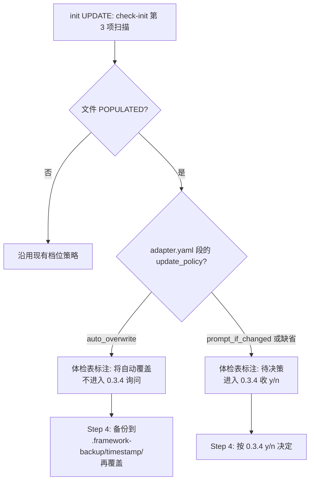

# adapter update_policy: 机制代码自动同步 + 用户入口仍需确认

## 1. 问题

`check-init` 第 3 项把所有 adapter `templates/` 下的文件**笼统**当成"adapter templates"，POPULATED 时一律走 diff + y/n。但这些文件实际上分两类：

- **机制代码**：`hooks/*.mjs`、`settings.json`、`agents/verifier.md` —— 用户改了就坏 hook / verifier 协议；framework 升级时**必须同步**
- **用户入口**：`commands/*.md`、`.cursor/skills/*/SKILL.md`、`rules/framework.mdc` —— 用户可能加过本地注释/路由

混在一起的后果：用户 vendor 新 `framework/` 后跑 UPDATE init，机制代码因为"上次 init 拷贝过、被算成 POPULATED"，AI 在 0.3.4 折叠/跳过，hooks 永远停在旧版，下次 `npm test` 报回归（典型如 `extensions` 全局豁免、`summary.next_action` 文案）。

## 2. 方案总览

引入 `update_policy` 协议，让 adapter.yaml 自己声明哪些段是机制代码：



三项已确认偏好：
- 备份策略：**单点备份** `.framework-backup/<timestamp>/`，并自动加进 `.gitignore`
- 体检表展示：体检表第 3 行**展开**为多行（每文件一行），加一列 `update_policy`
- 默认值：`prompt_if_changed`（保守，缺省时维持现状）

## 3. 具体改动

### 3.1 协议层

[framework/agents/adapter-schema.yaml](framework/agents/adapter-schema.yaml)：在 `commands` / `commands.subagents` / `skill_bridge` / `rules` / `hooks` / `settings_file` 五个段定义里各加可选字段：

```yaml
update_policy:
  type: string
  enum: [auto_overwrite, prompt_if_changed]
  default: prompt_if_changed
  description: |
    UPDATE 模式下检测到目标文件 POPULATED 时的处置策略。
    auto_overwrite 仅用于 framework 控制的"机制代码"（hooks 协议、verifier 协议等）；
    其余段若用户可能本地编辑（slash 跳板/cursor skill 跳板/rules），保持默认 prompt_if_changed。
```

### 3.2 各 adapter 声明

[framework/agents/claude/adapter.yaml](framework/agents/claude/adapter.yaml)：

| 段 | 新声明 | 理由 |
|----|--------|------|
| `hooks` | `update_policy: auto_overwrite` | Stop/SubagentStop hook 协议级，用户改了就坏 |
| `settings_file` | `update_policy: auto_overwrite` | 注册 hooks 的 Claude Code 配置 |
| `commands.subagents` | `update_policy: auto_overwrite` | verifier.md 是 framework 协议级 sub-agent 配置 |
| `commands` | 不声明（按默认 prompt_if_changed） | slash 跳板用户可能加注释 |

[framework/agents/cursor/adapter.yaml](framework/agents/cursor/adapter.yaml)：当前无机制代码段，全部按默认 prompt_if_changed，**不需要新声明**。

[framework/agents/generic/adapter.yaml](framework/agents/generic/adapter.yaml)：同上，无变更。

### 3.3 check-init 改造

[framework/harness/scripts/check-init.ts](framework/harness/scripts/check-init.ts)：

- 第 3 项扫描逻辑：原本笼统输出一行 `<adapter claude templates>`，改为**逐文件输出**——每个 POPULATED 文件占一行；EMPTY 文件继续合并（保持精简）
- 体检表多加一列 `update_policy`，从 adapter.yaml 解析；缺省时显示 `prompt_if_changed (default)`
- JSON 报告 `inspections[]` 每条多一个 `update_policy: 'auto_overwrite' | 'prompt_if_changed'` 字段

### 3.4 0.3.4 询问列表生成

`auto_overwrite` 类的 POPULATED **不进入** Q3.x 列表（不需要 y/n）；只 `prompt_if_changed` 类的 POPULATED 进入。

体检表展示时给 `auto_overwrite` 行加注释："将自动覆盖（备份至 .framework-backup/<timestamp>/）"。

### 3.5 Step 4 写入逻辑

主 agent 按体检结果执行：

- `auto_overwrite` POPULATED：先 `cp <target> .framework-backup/<timestamp>/<relative_path>` → 再用模板覆盖
- `prompt_if_changed` POPULATED：维持现有逻辑（按 0.3.4 的 y/n 决定）
- EMPTY / MISSING：现有逻辑不变

备份目录由本次 init 流程统一产出一个 `<timestamp>`，所有自动覆盖的文件备份到同一时间戳目录下，方便事后整体审计/恢复。

### 3.6 .gitignore 自动管理

[framework/skills/00-framework-init/SKILL.md](framework/skills/00-framework-init/SKILL.md) § 5.4.5.1 的 canonical patterns 加：

```gitignore
# Framework auto-overwrite backup (managed by /framework-init)
.framework-backup/
```

§ 5.4.5.2 等价覆盖规则表加一行：
| `.framework-backup/` | `.framework-backup`、`.framework-backup/`、`**/.framework-backup/` |

体检 #11（`.gitignore canonical ignores`）由 `check-init.ts` 自动检测；缺则 5.4.5 追加，无需用户 y/n（与现有规则同级）。

### 3.7 SKILL 00 文档更新

[framework/skills/00-framework-init/SKILL.md](framework/skills/00-framework-init/SKILL.md)：

- § 0.3.1 第 3 项档位说明加一段：扫描时同步解析每个文件所属段的 `update_policy`，展示在体检表
- § 0.3.2 策略矩阵第 3 项 POPULATED 列拆成两个分支说明：`auto_overwrite` → 自动覆盖（备份）；`prompt_if_changed` → diff + y/n
- § 0.3.4.1 适用范围表第 3 项加注释："仅 prompt_if_changed 类的 POPULATED 进入决策；auto_overwrite 类不询问"
- § 0.3.3 体检表头示例增加 `update_policy` 列
- § 5.4.5 canonical patterns 段同步加 `.framework-backup/`
- 新增 § 4.1.5 或类似小节描述 update_policy 协议（也可作为 § 4 顶部约定）

### 3.8 测试

[framework/harness/tests/unit/init-eol.unit.test.ts](framework/harness/tests/unit/init-eol.unit.test.ts) 旁边新增 `init-update-policy.unit.test.ts`，覆盖：

- adapter.yaml 解析：声明 / 缺省 / 非法值的 update_policy 行为
- 体检表第 3 项：mock 一个 hooks 文件 drift，验证返回 `update_policy: auto_overwrite` + 单独成行
- 0.3.4 询问列表：`auto_overwrite` POPULATED 不出现在 Q 列表

[framework/harness/tests/run-tests.ts](framework/harness/tests/run-tests.ts) 旁边新增 fixture（init/update_with_hook_drift_pass）：模拟用户 vendor 新 framework + 旧 `.claude/hooks/` 的场景，期望 check-init 给出 auto_overwrite 行 + 体检 PASS。

### 3.9 迁移说明

[framework/MIGRATION.md](framework/MIGRATION.md) 新增小节，说明本次 framework 升级后老实例如何受益：UPDATE 重跑 `/framework-init` 时，hooks/settings.json/agents 等机制代码会自动同步到新版，旧版备份到 `.framework-backup/<timestamp>/`，可用 git 或文件管理器审计。

## 4. 不在本次范围

- 不引入"机制代码必须 framework 控制不可改"的硬约束（用户仍可手工编辑实例落盘文件，只是 init 时会被覆盖 + 备份）
- 不改变体检 #3 对 EMPTY 档的处理逻辑（仅内容同 EOL 不同的合并显示保持现状）
- 不引入 `framework.config.json` 顶层新字段（`update_policy` 只在 adapter.yaml 声明）

## 5. 验收

1. 在本仓库跑 `cd framework/harness && npm test` 全绿（含新 unit + fixture）
2. 模拟"删 framework 重新覆盖" → `/framework-init`：
   - 体检表第 3 行展开多行；hooks 等行标 `auto_overwrite`
   - 0.3.4 不再问 hooks 相关 y/n
   - Step 4 完成后 `.claude/hooks/check-phase-completion.mjs` 与最新模板一致
   - `.framework-backup/<timestamp>/.claude/hooks/check-phase-completion.mjs` 存有旧版
   - `.gitignore` 含 `.framework-backup/` 条目
3. 重跑 `npm test`：202+ 全绿（hook 行为测试通过）
