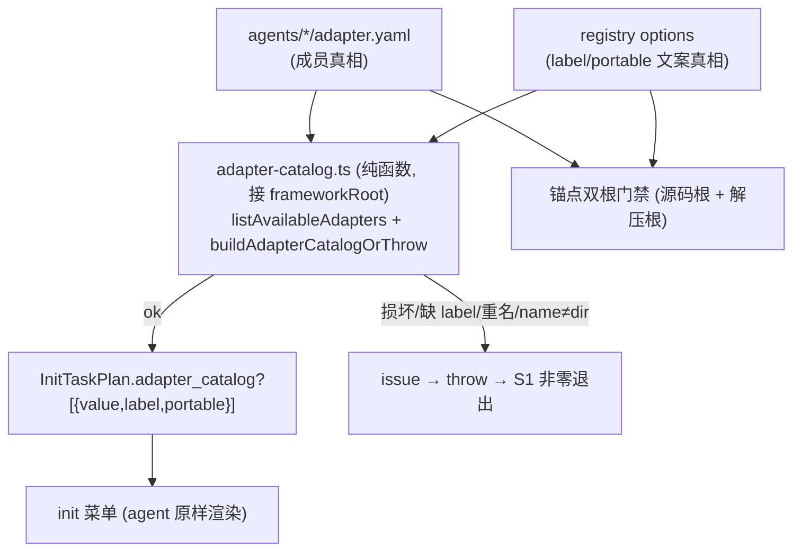

# adapter 候选自动化（方案 C：纯函数枚举 + harness join + fail-loud + 锚点双根门禁）

> 绑定版本窗口：`version: 2.4.0`（当前窗口）。
> 已过三轮外部 review：根因/锚点/架构全部验证通过，无遗留 BLOCKER。本版补齐 A(widget 上限 gate)、B(锚点替行号)、C(候选菜单 vs 参考表分离)、D(README 范围澄清)。

## 根因（6 处清单 + 0 门禁）

- 磁盘真相 `agents/*/adapter.yaml`（6 个）
- `confirmation-registry.yaml` `options`（文案 SSOT,本就列全）+ `portable_menu`（手工枚举 ✗）
- `user-confirmation-ux.md` line 106（手工枚举六项 ✗）
- `templates/adapter-widget-options.md`（写死 3 ✗,已 stale）
- `framework-init/SKILL.md` line 101（写死 3 ✗,已 stale）
- `check-skills-confirmation-ux.ts` `ADAPTER_NAMES`（静态数组 ✗）
- 运行时 `probeInitTaskPlan`（[init-task-planner.ts:473](harness/scripts/utils/init-task-planner.ts)）**不枚举** agents/，agent 无程序化候选源 → 落回写死 md（这是 Cursor init 菜单只显示 3 项的直接原因）。

## 终态数据流



设计原则（三轮 review 锁定）：成员 SSOT=磁盘；文案 SSOT=registry options；join 在 harness、agent 零拼接；fail-loud=OrThrow+非零退出；纯函数接 `frameworkRoot`（双根可跑）；候选副本去硬编码、`ADAPTER_NAMES` 动态化；门禁用锚点非行号、只扫菜单口径段。

## 实施前置（A · 硬 gate，必须最先）

**实施第一步**确认 Cursor `AskUserQuestion` 多选选项上限（reviewer 实测本环境多选约 **2-4 项**，6 项 adapter **很可能当前就超限**，且会随 adapter 增多更严重）：
- widget 能承载全部候选 → 6 项 checkbox 直接渲染。
- widget 上限 < 候选数（大概率）→ **先实现** portable 编号多选 fallback / 分页或分组（写入 SKILL + interaction-renderer），**再**做渲染改造。
- **gate 纪律**：未确认 widget 承载能力前，不动 §3 渲染改造；否则完成现实要求返工。

## 改造点

### 1. catalog SSOT lib（独立纯函数，接 frameworkRoot）
新建 [harness/scripts/utils/adapter-catalog.ts](harness/scripts/utils/adapter-catalog.ts)（不依赖 check-init 模块级 `FRAMEWORK_ROOT`[:147](harness/scripts/check-init.ts)）：
- `listAvailableAdapters(frameworkRoot)`：`readdirSync(path.join(frameworkRoot,'agents'))` + 读各 `adapter.yaml` 取 `adapter_name`。返回 `{ names, issues }`；**收集** issue（缺 yaml / 解析失败 / `adapter_name`≠目录名 / 重名），不静默跳过。
- `buildAdapterCatalogOrThrow(frameworkRoot)`：join 磁盘成员 + registry `options`（label/portable）；任一 issue（磁盘 issues / registry 缺该 value option / registry 多出磁盘没有的 value）→ **throw**（聚合全部问题）。成功返回 `{value,label,portable}[]`。
- `checkAdapterCatalogConsistency(frameworkRoot)`：非抛错版（返回 `CheckResult[]`），供门禁/lint；含锚点段硬编码扫描（见 §4）。
- 解析为本 lib 内纯函数；`loadAdapter` 改签名（`frameworkRoot = FRAMEWORK_ROOT`）列为可选后续，本 plan 不强制。

### 2. planner 输出 catalog（optional 字段 + project 必产出 + fail-loud）
[init-task-planner.ts](harness/scripts/utils/init-task-planner.ts)：
- `InitTaskPlan`（line 47-53）增 **可选** `adapter_catalog?: AdapterCatalogEntry[]`（type 可选避免破坏 30+ 手写 plan；运行时 project 必产出）。
- `probeInitTaskPlan`（line 473）`scope==='project'` 调 `buildAdapterCatalogOrThrow(frameworkRoot)`；**损坏直接抛错**（不 catch 成可用 plan）。personal 不填。
- [init-orchestrate.ts](harness/scripts/init-orchestrate.ts) S1 CLI：捕获 throw → **stderr 完整 issues + 非零退出**。

### 3. 去硬编码 + 锚点（菜单口径段）
菜单口径段删写死成员、改"选项=S1 `adapter_catalog` 原样渲染"，并插入**稳定锚点**包裹（供门禁定位，免行号漂移）：
```
<!-- adapter-candidates:start -->
（此段为候选菜单口径；成员来自 adapter_catalog，门禁守护，禁止硬编码 adapter 名）
<!-- adapter-candidates:end -->
```
落点：[SKILL.md](skills/project/framework-init/SKILL.md) line 101 区 / [adapter-selection.md](skills/project/framework-init/prompts/adapter-selection.md) / [adapter-widget-options.md](skills/project/framework-init/templates/adapter-widget-options.md) line 11-26 项目 init 正文 / [claude framework-init.md](agents/claude/templates/commands/framework-init.md) S2 / [user-confirmation-ux.md](skills/reference/user-confirmation-ux.md) line 106 菜单段。
- [confirmation-registry.yaml](skills/reference/confirmation-registry.yaml) `portable_menu`：去枚举具体名，改「候选见 adapter_catalog」；`options` **保留**（文案 SSOT，门禁排除区）。
- [check-skills-confirmation-ux.ts](harness/scripts/check-skills-confirmation-ux.ts)：删静态 `ADAPTER_NAMES`(line 34)；`lintAdapterInteractionRenderers`(@511) 改 `listAvailableAdapters(layout.frameworkRoot).names`。

### 4. 一致性门禁（锚点取区 + 候选/参考分离 + 双根 spawn）
- **B 锚点扫描（非行号）**：对 markdown 菜单口径段，按 `<!-- adapter-candidates:start/end -->` 取区间；区内出现 **≥2 个**动态发现的 adapter 名（`listAvailableAdapters`）枚举 → FAIL（写死 2/4/5 项同样抓）。
- **C 候选 vs 参考分离（显式排除）**：门禁**不扫** registry `options` 块、README 逐 adapter 产物表（`README:75-80,165-168`）、README materialized_adapters 多选建议表（`~95-103`）——它们是文案/参考 SSOT，本就列全。锚点机制天然只圈菜单口径段，结构化 yaml 按 key 处理（检测 `portable_menu` 值、排除 `options`）。
- docs phase：`lintConfirmationUx`(@89) 调 `checkAdapterCatalogConsistency(layout.frameworkRoot)`（随 `runConfirmationUxChecks`@733 生效）。
- 发布门禁：新建 CLI [check-adapter-catalog-consistency.ts](harness/scripts/check-adapter-catalog-consistency.ts)（`--framework-root`，issue→非零退出）。[verify-release-pack.mjs](scripts/verify-release-pack.mjs) `spawnSync` **`cwd=path.join(REPO_ROOT,'harness')`、本地 ts-node**（同 typecheck@193 模式），`--framework-root` 分别传 **源码根** 与 **解压 framework root**，两次须 PASS。

### 5. 测试（BLOCKER：cd harness && npm test 全 PASS）
- `listAvailableAdapters` == 磁盘动态集合（**不硬编码 6**）；负例 fixture（缺 yaml/name≠dir/重名）→ issues 非空。
- `buildAdapterCatalogOrThrow` 正例 join 正确；负例（registry 缺 label/磁盘多出/损坏）→ **throw**。
- `probeInitTaskPlan(project).adapter_catalog` == OrThrow 输出；损坏 fixture → probe 抛错。
- 门禁锚点双根正负例（新建 `adapter-catalog-consistency.unit.test.ts`）：正例 PASS；负例（registry 删项 / 锚点段写死 ≥2 名 / portable_menu 残留）→ FAIL 指明根因；**反向**断言 options 块 / README 参考表列全 **不** 误报。

### 6. 文档（D · 范围澄清）
[agents/README.md](agents/README.md)「新增 adapter 步骤」改为「新增 `agents/<name>/adapter.yaml` + registry options 补 label/portable → 候选自动经 `adapter_catalog` 进菜单，门禁拦遗漏」。并**一句话标注**：候选菜单口径段（去硬编码+锚点门禁）vs 参考表（逐 adapter 产物表、多选建议表——保留列全、非候选源），免后人误当候选源。

## 验收
- `cd harness && npm test` 全 PASS。
- **A gate**：widget 承载能力已在实施前确认；若超限，fallback/分页已落地，再做渲染——未确认前不改渲染。
- `probeInitTaskPlan(project).adapter_catalog` == OrThrow 动态输出（每项 label/portable）。
- **fail-loud**：损坏 adapter / registry 缺 label → S1 CLI 非零退出 + 完整 issues。
- 锚点段残留 ≥2 硬编码 adapter 名 → 门禁 FAIL；options 块 / README 参考表列全 **不** 误报。
- 发布门禁：源码根 + 解压根两次 catalog 检查均 PASS。
- 手动端到端：最新 zip 初始化临时宿主 → 实跑 Cursor `/framework-init` → 确认全部候选可多选（widget 策略已前置确定）。

## 非目标 / 已知取舍
- 不把 registry options 改纯 dynamic（保留为 label/portable 文案 SSOT）。
- 不重打发布件（打包时机用户自控）。
- 不 bump `InitTaskPlan.schema_version`（仅新增 optional 向后兼容字段）。
- 不强制重构 `loadAdapter`（catalog lib 自带纯函数解析；改签名列为可选后续）。
- **锚点门禁覆盖边界（有意取舍，精确换完整）**：门禁只保护带 `adapter-candidates` 锚点的菜单口径段；若将来有人在全新、无锚点的文档位置另写死一份 adapter 列表，门禁扫不到。可接受——菜单实际来自 `adapter_catalog`（程序化），盲区最多产生**过时散文**、不会产生**错误菜单**，风险低。新增菜单口径文档时须同时加锚点。
