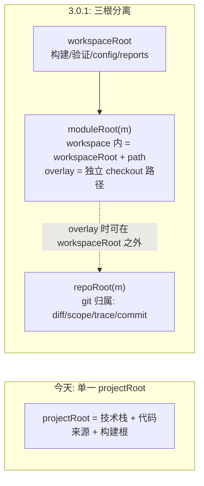
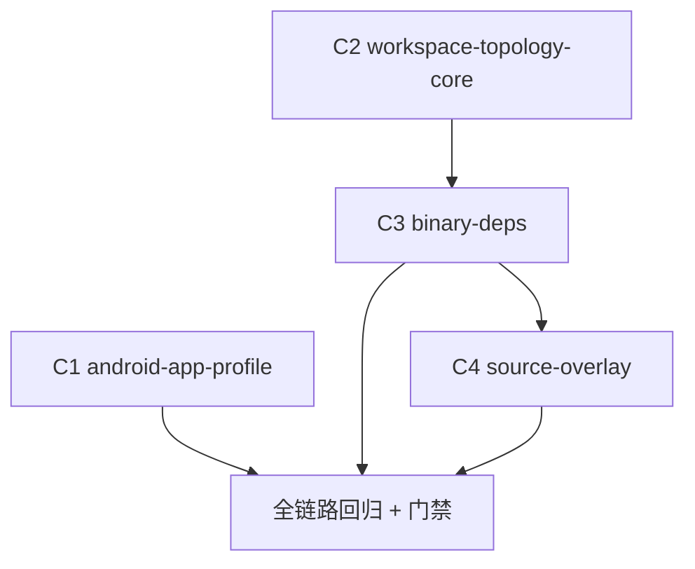

# Android 工程适配（maison 3.0.1）

## 版本绑定（BLOCKER 合规）

- **顺延至 3.0.1 窗口**（用户 2026-07-09 拍板）：原在 3.0.0 窗口（与轻量化重构同窗、重构先行），现 3.0.0 收口为「轻量化收尾 + b7e42d19 交互式视觉实测」后打发布件去宿主统一回归，android 适配基于回归后的稳定基线开工。frontmatter `version: 3.0.1` + `deferred_to: 3.0.1`。
- 实施顺序不变：轻量化重构（d4a7c1e8）+ b7e42d19 先行、打包宿主回归，本 plan 基于回归后契约开工；实施期脚手架出的 master .plan.md 沿用 `version: 3.0.1` / `deferred_to: 3.0.1`。
- `release:check-plans`：`version(3.0.1) > current(3.0.0)` 且 `deferred_to === version` → 放行，不阻 3.0.0 发版；3.0.1 发版前 todos 须全 completed。

## 前置依赖：轻量化重构先行（用户拍板 2026-07-06）

本 plan 依赖 **framework 轻量化重构**（[.cursor/plans/framework_轻量化重构_分档工作流与验证收敛_d4a7c1e8.plan.md](.cursor/plans/framework_轻量化重构_分档工作流与验证收敛_d4a7c1e8.plan.md)，3.0.0 窗口），**重构先行、本 plan（顺延 3.0.1）基于瘦身后契约开工**。两处衔接：

1. **profile 资产密度**：C1 的 profile-addendum / `skills/skill-assets.yaml` 等资产按重构 C3 瘦身后契约编写（主干 ≤150 行 + 条件加载 + 主干行数 lint 在场），hmos-app 资产树仅作**能力覆盖面**对照，不作行文密度范本。
2. **lite track 试点**：C1 验收在 single_tree 全链路 PASS 外，增加一条「虚拟单仓钱包单模块 feature 走 lite track（change→coding→exit）」试点——android 是轻量化路径的第一个真实用户。

## 核心理念：两个正交维度

maison 现在把「技术栈 / 代码来源 / 构建验证根」捆死在单一 `projectRoot`。本次解耦为两个独立声明、独立演进的轴：

```
maison 实例 = profile（轴A·技术栈：android-app）
            × workspace.topology（轴B·代码来源/装配：single_tree | binary_deps | source_overlay）
```

同一个 `android-app` profile 被不同工程以不同 topology 实例化，即可覆盖"混合"现实。三种拓扑本质上是一条谱：

- `single_tree`：1 仓全源码（今天的默认，零变化）；
- `binary_deps`：1 仓源码 + 其余 Maven 制品（source_overlay 的 N=0 特例，实现共享 provider）；
- `source_overlay`：binary_deps + N 个外部源码 checkout 以依赖替换方式叠加（跨多仓源码协同）。

### 三根模型（轴B 的基础）



`workspaceRoot` 顶替今天的 `projectRoot`（构建语义不变）；新增 `repoRoot` 映射层只服务 git 相关闸门。single_tree 下三者重合，现有行为零变化。**overlay 模块的 moduleRoot/repoRoot 常为 workspace 的兄弟目录（外部 checkout），不再假设嵌套于 workspaceRoot 之内。**

### 现实形态 → 拓扑映射

| 现实工程形态 | topology | workspaceRoot |
|---|---|---|
| 单仓完整 app（虚拟钱包、单仓工程） | single_tree | 该仓 |
| 壳工程 / 少仓工程，依赖走制品 | binary_deps | 壳仓或该仓 |
| "只改这一个库"（原 per_repo 场景） | binary_deps | 该库仓 |
| 跨多仓源码协同改动（真实钱包大特性） | source_overlay | 壳工程或任一集成层工程 |

### framework 分发不变式（贯穿所有拓扑）

framework 只以**离线发布件**（现有 RELEASE-MANIFEST.json + `framework_integrity` preflight 机制，见 [MIGRATION.md](MIGRATION.md)）——未来可能以应用市场插件形式——交付给宿主；**任何拓扑设计不得假设以 git submodule 引用 framework**。多仓拓扑下 framework 只驻留 workspaceRoot 一处；overlay 模块仓**零 framework 侵入**（harness 主动到 checkout 路径执行 git，模块仓内不落任何 framework 文件）。

---

## 交付文档集（1 master plan + 4 OpenSpec change）

OpenSpec 承载框架自身演进（[AGENTS.md](AGENTS.md) OpenSpec 节）。每个 change 含 `proposal.md` / `design.md` / `tasks.md` / `specs/<capability>/spec.md`，并须过 `npm run openspec:validate`。

- **master plan**: `.cursor/plans/android-工程适配_<hash>.plan.md`（伞形蓝本，version/deferred_to=3.0.1，引用 4 个 change 作为实施清单）
- **C1 `android-app-profile`**（P1，轴A）
- **C2 `workspace-topology-core`**（轴B 基础设施，C3/C4 共同依赖）
- **C3 `topology-binary-deps`**（P2a，>50% 工程 + 原 per_repo 场景）
- **C4 `topology-source-overlay`**（P2b，真实钱包跨仓协同）

依赖顺序：C1 与 C2 可并行起步 → C3 依赖 C2 → C4 依赖 C3（overlay provider 以 binary_deps 为 N=0 基座扩展）。

---

## C1 · android-app-profile（P1）

新建 `profiles/android-app/`，以 [profiles/hmos-app/profile.yaml](profiles/hmos-app/profile.yaml) 为范本。

### capabilities → provider 映射

- `coding.compile` → `gradle`（`assemble<Variant>`，variant 由 workspace 配置的 `build_variant` 决定，默认 `Debug`；成功哨兵 `BUILD SUCCESSFUL`）——真实壳工程会打多形态/多环境 apk，variant 必须可配置而非硬编码
- `coding.deps_install` → `gradle_resolve`（**决策1=A**：`--refresh-dependencies` / 离线缓存预热）；**复用** [harness/scripts/utils](harness/scripts/utils) 现有 failure-kind：制品/版本缺失→`project_dependency_missing|undeclared`（agent 自补声明），registry/鉴权/网络→`project_dependency_install_failed`（向用户求助）
- `coding.lint` → `android_lint`（`lint<Variant>`）+ 可选 detekt/ktlint
- `ut.compile` → `gradle`（`compile<Variant>UnitTestSources`）；`ut.run` → `gradle`（`test<Variant>UnitTest`，JVM 单测无需设备）
- `device_test.build|install|run` → `assemble<Variant>AndroidTest` / `adb install` / `connected<Variant>AndroidTest`
- `spec.visual_handoff` → script（技术栈无关，直接复用）

### personal_prerequisites

新增 `android_sdk_toolchain`（对标 `deveco_toolchain`）：JDK + `ANDROID_HOME`/SDK + Gradle（优先 wrapper）。

### architecture DSL 增量（决策2+4）

在 [harness/config.ts](harness/config.ts) 的 `ArchitectureDsl` 增加：

- `export_strategy: 'index_file' | 'gradle_api'`（默认 `index_file` 保鸿蒙兼容；android-app 用 `gradle_api`）——跨模块导出检查改为校验 `build.gradle(.kts)` 的 `api`/`implementation` 依赖图（+可选 `internal`/`@RestrictTo`），不再要求单一出口文件。
- `outer_layers[].can_depend_on` 允许 `artifact:<group-pattern>` 目标，用于声明哪些层可引哪些外部制品 group。

### 关键改造点

- [harness/capability-registry.ts](harness/capability-registry.ts) `PROVIDER_MODULE_BY_ID` 注册 gradle 系 provider；新增 `profiles/android-app/harness/providers/*`。
- [harness/scripts/check-coding.ts](harness/scripts/check-coding.ts) 的「模块导出」BLOCKER 按 `export_strategy` 分叉。
- `catalog_allowed_module_formats: [application, library, dynamic-feature, test-fixtures]`；`detect.signature_files: [settings.gradle(.kts), build.gradle(.kts)]`。
- profile 下 `skills/coding/profile-addendum.md`、`skills/skill-assets.yaml`、coding-standards / module-scaffold / kotlin/java pitfalls 等资产——按轻量化重构 C3 瘦身后契约编写（主干+条件加载），对标 hmos-app 资产树的**能力覆盖面**而非行文密度。
- 验收基线：虚拟单仓 Android 钱包跑通 coding/ut 全链路 PASS；另取一个单模块 feature 走 **lite track**（change→coding→exit）作轻量化试点验收。

---

## C2 · workspace-topology-core（轴B 基础设施）

新增能力 `workspace-topology`，把"三根模型"做成框架一等概念。

### Workspace Manifest（声明在 `framework.config.json`）

```jsonc
"workspace": {
  "topology": "source_overlay",          // single_tree(默认) | binary_deps | source_overlay
  "assembly": { "mechanism": "gradle_composite", "assume_assembled": true },
  "modules": [
    { "name": "app-shell",   "path": ".",                  "source": "workspace" },
    { "name": "wallet-core", "coordinates": "com.wallet:wallet-core",
      "source": "overlay",   "checkout_path": "../wallet-core",
      "repo": "git@.../wallet-core.git" }
  ]
}
```

- 缺省即 `single_tree`，`workspaceRoot==projectRoot==repoRoot`，**现有规则与 hmos-app 行为零变化**（向后兼容门禁）。
- `checkout_path` 允许 workspace 外路径（兄弟目录）；`coordinates` 用于依赖替换匹配。

### TopologyProvider 接口（与 capability provider 同构，可插拔）

```ts
interface TopologyProvider {
  ensureAssembled(workspaceRoot): Result;          // single_tree=no-op；overlay=校验各 checkout 就位（缺→BLOCKER 提示 clone，不代拉取）
  resolveModuleRepo(name): { repoRoot, relPath };  // 模块→仓（repoRoot 可在 workspace 外）
  diffScope(baseRef): ChangedFile[];               // 跨相关仓 diff，归一化为 module 前缀路径
  startCommit(): RepoCommitMap;                    // 各仓 HEAD（trace baseline）
  receiptBoundary(): string;                       // 恒 = workspaceRoot
}
```

### 安全守卫（本 change 必含）

- **topology 误配守卫**：`topology=single_tree`（或未声明）但工作树检测到 gitlink/`.gitmodules` 时直接 BLOCKER。背景：父仓 `git diff` 看不到 submodule 内部文件级改动，[check-coding.ts](harness/scripts/check-coding.ts) 对零变更文件判 PASS——误配下所有 diff 门禁会**静默全绿**而非报错，必须主动拦截。
- **manifest 一致性 lint**：`workspace.modules[]` 与实际装配声明互校（single/binary：`settings.gradle` include 清单；overlay：composite `includeBuild`/替换清单），防两处漂移。

### 关键改造点

- [harness/repo-layout.ts](harness/repo-layout.ts)：引入 `workspaceRoot` / `moduleRoot` / `repoRoot` 概念（`projectRoot` 作为 `workspaceRoot` 别名过渡）；`frameworkRoot` 维持独立根（framework 分发不变式）。
- [harness/config.ts](harness/config.ts)：`FrameworkConfig` 增 `workspace` 段 + 校验函数。
- [harness/harness-runner.ts](harness/harness-runner.ts) `recordStartCommit()`：从单 `git rev-parse HEAD` 改为委托 `TopologyProvider.startCommit()`（各仓 HEAD map）；trace.json 的 `start_commit` 演进为 map 时，[git-diff.ts](harness/scripts/utils/git-diff.ts) `readTraceStartCommit` 与 check-ut 读取端须兼容旧的单字符串格式（single_tree 保持字符串，hmos-app 零回归）。
- module-catalog 卡片（[profiles/hmos-app/doc-skeletons/module-catalog.skeleton.yaml](profiles/hmos-app/doc-skeletons/module-catalog.skeleton.yaml) 等）增可选 `repo` 字段。
- [skills/project/framework-init/SKILL.md](skills/project/framework-init/SKILL.md)：init 新增 topology 选择 + 模块↔仓映射问询，写入 `framework.config.json`。
- [profiles/profile-schema.yaml](profiles/profile-schema.yaml)：文档化 workspace 段与新字段。
- 修改能力 `harness-gates`：`diff_within_scope` / `HARNESS_DIFF_BASE_REF` 委托 `TopologyProvider.diffScope()`。

---

## C3 · topology-binary-deps（P2a，>50% 工程 + 原 per_repo 场景）

binary_deps 实例 = 单个 git 仓（含一个或多个**源码**模块），其余皆 Gradle Maven 制品。git 行为**等同 single_tree**（复用 C2 的 single 路径），新增仅"架构检查识别制品依赖"。

- catalog/architecture 只登记本仓源码模块；外部制品不作源码模块，仅由 `build.gradle` Maven 坐标声明。
- 跨模块检查：源码模块走 import 级；对制品依赖只做**声明级**校验（按 `artifact:<group>` 矩阵裁决），报告显式标注"该依赖为制品，未做源码级校验"。
- 复用 C1 的 `gradle_resolve`：制品解析失败正好命中既有 failure-kind 分类。
- **吸收原 per_repo 场景**："只改一个库"= 以该库仓为 workspaceRoot 的 binary_deps 实例（装一份离线 framework 包即可）。库仓（无 application 模块）下 device_test 等能力按 module format 降级并明确告知——这是 profile/能力维度的降级，不是独立拓扑。
- 验收：一个 binary_deps 样例工程 coding/ut PASS + 制品依赖声明级检查命中（可直接用真实钱包的某个单库仓，顺带验证库仓形态）。

---

## C4 · topology-source-overlay（P2b，真实钱包跨仓协同）

### 背景与原则（决策3'）

真实钱包生产构建 = **按仓库间依赖自下而上打 AAR、逐层集成、最终由空壳打包工程出多形态/多环境 apk**。因此**不新建 submodule 集成元仓、不做根 settings.gradle 统一 include 的源码树**——那是一套与生产不同构的平行构建体系（源码统一编译与 AAR 分层的依赖解析/资源合并行为不同，"元仓能编过"≠"流水线能编过"），且有长期 submodule pin 维护成本。

source_overlay 顺着生产形态叠加：**workspaceRoot = 壳工程（或本次特性覆盖的最上层集成工程）checkout，默认一切依赖走 Maven 制品（与生产一致），仅把本次要改的 1~N 个仓以源码替换叠加进来**——改哪个替哪个。

### 装配机制

- 首选 `assembly.mechanism: gradle_composite`：Gradle composite build（`includeBuild` + dependency substitution，按 `coordinates` 把制品坐标替换为源码工程）。
- **spike 先行**：AGP 下依赖替换存在边角（flavor/variant 匹配、插件工程、版本目录），C4 第一步用 2~3 个真实仓做替换可行性验证；不可行的仓回退 `mechanism: custom_script`（复用工程自带的源码替换开关，若有）。
- `assume_assembled: true`：maison 只校验各 `checkout_path` 就位且为 git 仓（缺→BLOCKER 提示 clone 命令），**不**代用户拉取（不动网络/凭证）。

### 关键改造点

- `TopologyProvider(source_overlay)` 以 binary_deps provider 为 N=0 基座扩展。
- `diffScope()`：workspace 仓 + 各 overlay 仓逐仓 `git diff` 后并集；overlay 仓路径归一化为 `<module.name>/<仓内相对路径>` 前缀形式（out-of-tree 路径无法表达为 workspace 相对路径），in_scope 判定先按模块归属、再按 layer 前缀。
- `startCommit()`：记录 workspace 仓 + 各 overlay 仓 HEAD map。
- overlay 仓全源码可见，跨模块走完整 import 级检查；未 overlay 的制品依赖沿用 C3 声明级校验。
- 验收：壳/集成工程 + 2~3 个真实模块仓 checkout，composite 替换构建成功 + repo-aware diff/scope/trace 正确。

---

## 实施顺序与验收



每个 change 完成即跑：`cd harness && npm test` 全绿 + `npm run openspec:validate` + `npm run release:verify`。最终验收：

- 虚拟单仓 Android 钱包：single_tree 全链路 PASS（C1 基线）+ 单模块 feature lite track（change→coding→exit）试点 PASS。
- 一个 binary_deps 样例工程（含库仓形态）：coding/ut PASS + 制品依赖声明级检查命中（C3）。
- 真实钱包壳/集成工程 + 2~3 个 overlay 仓：composite 替换构建成功，diff/scope/trace repo-aware 正确（C4）。
- 既有 hmos-app 全部回归零变化（向后兼容）。

## 已固化决策

1. `coding.deps_install` = Gradle 依赖解析预热（`--refresh-dependencies`）。
2. 跨模块导出走 `gradle_api` 策略（api/implementation 依赖图），放弃单一出口文件强约束。
3. 真实钱包装配现状 = 自下而上 AAR 分层集成至空壳打包工程 → **不新建 submodule 集成元仓**；跨仓源码协同改走 `source_overlay`（composite build 源码替换），与生产构建同构。（替代旧决策"新建 superproject"）
4. binary_deps 占比 >50% → P2a 一等公民，优先于 source_overlay 落地。
5. framework 只以离线发布件（未来可能应用市场插件）交付，**永不 git submodule**；多仓拓扑下 framework 只驻留 workspaceRoot，overlay 模块仓零侵入。
6. 原 per_repo 拓扑取消，场景并入 binary_deps（以单库仓为 workspace 的退化形态）；独立 change C5 撤销。
7. 与轻量化重构（plan d4a7c1e8）同窗顺序实施：重构先行，本 plan 基于瘦身后契约开工；profile 资产密度与 lite track 试点两处衔接见「前置依赖」节。（用户拍板 2026-07-06）

## 风险

- **composite 依赖替换的 AGP 边角**（flavor/variant 匹配、插件工程、版本目录）是最高风险项 → C4 以 2~3 个真实仓 spike 开局，替换不可行时回退 `custom_script` 机制；spike 结论决定 C4 深度。
- **out-of-tree 路径归一化**：overlay 仓的 diff 路径需以 module 前缀表达并贯穿 in_scope/受保护前缀判定，harness 夹具先行覆盖（2~3 仓小规模夹具）。
- `export_strategy` 分叉若处理不当可能回归影响 hmos-app 的 `index_file` 检查；需保证默认值与既有夹具全绿。
- 误配守卫（C2）是兜底：任何用户把 maison 指到 submodule 树而未声明拓扑时，宁可 BLOCKER 也不允许 diff 门禁静默全绿。
