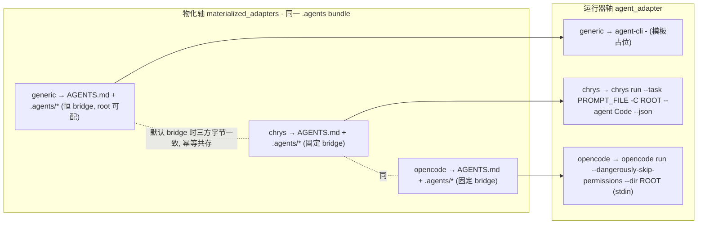

# chrys + opencode adapter 接入规划

> 绑定版本窗口：`version: 2.4.0`（`deferred_to: 2.4.0`，顺延到未来窗口，不阻塞 2.3.0 发版；不改 `package.json.version`）。

> **代码基线复核（6/21）**：本仓近期有较多改动，已重新核对全部锚点。结论——方案选型与核心机制**完全不受影响**（agent-invoke `KNOWN_STRUCTURED_ADAPTERS={claude,codex,cursor}`、`ADAPTER_NAMES=[claude,cursor,generic]`、`resolveBundleForInitInspect` 仅 `generic` 生效、`buildOwnedByTaskSet` 只收 per-file、goal-preflight 探测 `PROMPT_FILE:''`、knownDirs 仅 cursor-agent、adapter-schema 仍预留 chrys 均不变）。唯一**重大变化**：commit `609406d2` **彻底废弃 inline skill 模式**（generic 恒 bridge，新增 BLOCKER 规则 [agent-bundle-bridge.mdc](.cursor/rules/agent-bundle-bridge.mdc)），已据此简化"共存边界"与测试矩阵。`Hylyre`（0.2/0.3 vendor）是 hmos-app 真机测试工具，与本任务无关。

> **opencode 纳入 + 基线复核（6/22）**：本次把 opencode 一并接入。opencode 源码核实——根读 `AGENTS.md`（[instruction.ts:64-68](D:/1.code/opencode/packages/opencode/src/session/instruction.ts)），技能**原生扫 `.agents/skills/**/SKILL.md`**（向上遍历扫盘逻辑在 [skill/index.ts:185-203](D:/1.code/opencode/packages/opencode/src/skill/index.ts) `discoverSkills`，21-25 仅常量定义；与 `.claude/skills`、`.opencode/skill(s)` 并列），且 skill 自动注册为 slash 命令（[command/index.ts:142-153](D:/1.code/opencode/packages/opencode/src/command/index.ts)）；`.agents/rules` 同 chrys **不自动加载**（引用可达）。故 **opencode 与 chrys 是同构的 `.agents`-复用 external_runner**，唯一差异是 headless 命令。opencode headless = `opencode run`（yargs，npm `opencode-ai`，Bun 原生二进制；prompt 走 positional 或 **stdin 管道**，[run.ts:351-352](D:/1.code/opencode/packages/opencode/src/cli/cmd/run.ts) 确认读 stdin；自动批准 `--dangerously-skip-permissions`；`--dir <cwd>`；`--format json` 为 NDJSON，**注意 `-p` 是 --password 非 print**）。新 commit `2fee8077`（Windows 空格路径 spawn 修复）在 hmos-app ohpm provider，**未触及 headless 链路**。`.opencode/`（agents/commands 目录）maison bundle 不需要——技能即命令。

## 背景与设计判断

maison 的 adapter 是「目录即插件」：每个 `[agents/<name>/adapter.yaml](agents/adapter-schema.yaml)` 同时承载**物化形态**与 **headless 能力**（`goal_capability.external_runner.headless_invoke`）。goal-runner 用 `manifest.adapter`（来自 `--adapter` 或 `framework.local.json.agent_adapter`，见 `[goal-runner.ts:546](harness/scripts/goal-runner.ts)`）同时驱动两者。

关键事实（经 chrys + opencode + maison 源码三向核实）：

- **chrys 与 opencode 都原生消费 maison 的 `.agents` bundle**：二者根都读 `AGENTS.md`，技能都扫 `.agents/skills/**/SKILL.md`（chrys 自动加载 `<cwd>/.agents/skills`、`~/.agents/skills`、`~/.chrys/skills`；opencode 扫 `.agents/skills` 与 `.claude/skills`、`.opencode/skill(s)` 并列）。**opencode 的 slash 命令有两个独立来源**：①显式命令文件只读 `.opencode/commands/*.md` + `~/.config/opencode/commands/*.md`（[config/command.ts:13-35]，**不读 `.agents/commands/`**）；②`.agents/skills/` 里的技能（扫盘逻辑 [skill/index.ts:185-203] `discoverSkills`）经 [command/index.ts:142-153] 以 `source:"skill"` **自动注册为 `/<skill名>` 命令**（同名时显式命令优先）。maison bundle 是技能跳板 → 走来源②，**无需往 `.opencode/commands/` 写任何文件**（maison 也从不产出 `.agents/commands/`）。两者都**不自动加载 `.agents/rules`**——rules（含 interaction-renderer）是被 skill 文档引用后由 agent **主动去读**的被动文件（「引用可达」非「自动加载」）。chrys 的 `.agents/skills` 路径写死；opencode 项目配置目录是 `.opencode/`、全局是 `~/.config/opencode`（XDG），但**这些 maison bundle 都不需要**（技能即命令，rules 引用可达）。
- **【6/21 基线更新】inline 模式已彻底废弃**（commit `609406d2`，BLOCKER 规则 [.cursor/rules/agent-bundle-bridge.mdc](.cursor/rules/agent-bundle-bridge.mdc)）：`normalizeAgentBundleSkillMode` 恒返回 `bridge`（[agent-bundle-paths.ts:55](harness/scripts/utils/agent-bundle-paths.ts)），config/init 链路**永远产生不出 inline**（inline 仅测试直注 bundle 对象可达）。故 generic 经 init 恒为 bridge → **generic 与 chrys 的 `.agents` bundle 恒字节一致、恒可幂等共存**，原"inline 真冲突"边界在现实 config 下已消失。
- generic 唯一仍可变的是 `agent_bundle_root`（默认 `.agents`，仅 `agent_adapter==='generic'` 生效，见 [agent-bundle-paths.ts:84](harness/scripts/utils/agent-bundle-paths.ts)）；非默认根（如 `.codex`）时与 chrys/opencode 固定 `.agents` 落不同目录，是两套独立产物，不冲突（见「共存边界与约束」）。
- **唯一实质差异是 headless 命令**（goal-runner 每 phase 已把 prompt 落盘到 `phases/<phase>/prompt.md` 并以绝对路径放入 `vars.PROMPT_FILE`，[goal-runner.ts:754](harness/scripts/goal-runner.ts) 起）：
  - **chrys**：`chrys run`（Python console script，`--agent` 必填默认 `Code`，启动即 `ApprovalMode.BYPASS`、非交互、无流式、结束后一次性写 stdout）。原生支持 `-t/--task FILE` → 采用 `chrys run --task {{PROMPT_FILE}} -C {{PROJECT_ROOT}} --agent Code --json`，**文件传 prompt** 规避 Windows ~32K argv 上限。
  - **opencode**：`opencode run`（yargs，npm `opencode-ai`，Bun 原生二进制）。**无 `--task` 文件入口，但 run 读 stdin 管道**（[run.ts:351-352](D:/1.code/opencode/packages/opencode/src/cli/cmd/run.ts)），故采用 `opencode run --dangerously-skip-permissions --dir {{PROJECT_ROOT}}` + **stdin 灌 prompt**（同样规避 argv 上限）。自动批准用 `--dangerously-skip-permissions`（对应 unattended approval_mode=never）；模型靠 opencode 自身 config/auth 默认（不强制 `--model`）。**坑：`-p` 是 `--password` 非 print，勿用**。
- 共存安全：[buildOwnedByTaskSet](harness/scripts/utils/init-sync-telemetry.ts) 只跟踪 per-file 任务，不在 `materialize-adapter:` 任务间判重；默认 bridge 形态下 generic / chrys / opencode 写同一 `.agents` 文件因字节一致只判 `unchanged`，不报错（方案C成立，三方共存）。
- [agent-invoke.ts:33](harness/scripts/utils/agent-invoke.ts) 的 `KNOWN_STRUCTURED_ADAPTERS = {claude,codex,cursor}` 走硬编码 argv；把 chrys 与 opencode 也做成结构化 adapter（获得 Windows .exe/.cmd 解析 + cross-spawn + preflight 二进制校验）。

## 共存边界与约束（已按 6/21 inline 废弃基线更新）

- **inline 已废弃，不再是现实冲突项**：`agent_bundle_skill_mode` 经 `normalizeAgentBundleSkillMode` 恒归一 `bridge`，config/init 永不产生 inline。故 `agent_adapter=generic` 经 init 恒 bridge，与 chrys/opencode 固定 bridge 的 `.agents/skills`/`.agents/rules` **恒字节一致、generic+chrys+opencode 三方恒幂等共存**。（inline 仅测试直注 bundle 对象可达，不在用户路径内。）
- **唯一剩余非默认配置 = `agent_bundle_root`**：generic root=`.codex` + chrys/opencode 固定 `.agents`，skills/rules 落在**不同目录**、互不覆盖，是**各自独立的产物**（`AGENTS.md` 入口除外——各方仍写同一路径，由下条 ownership 规则控制）。文档说明它们并存但不共享、不互为幂等即可，无需阻断。
- `AGENTS.md` 的 `{{AGENT_ADAPTER}}` 渲染优先取 config `agent_adapter`，缺失才回落当前物化 adapter 名（[check-init.ts:891](harness/scripts/check-init.ts)）；故严格说 `.agents` bundle 与 generic bridge 一致，而 `AGENTS.md` 由既有 **entry-file ownership / primary adapter 规则**控制（cursor+generic 共存今天已是同样性质），非本次新引入。
- **新增 BLOCKER 约束**：本次所有文档/registry/notes/adapter.yaml 措辞**不得**再把 inline 写成 generic 的可选模式（违反 [.cursor/rules/agent-bundle-bridge.mdc](.cursor/rules/agent-bundle-bridge.mdc)）；只描述 bridge。
- **opencode + claude 同时物化 → 同名 skill 告警（无害）**：opencode 还会扫 `.claude/skills`、`~/.agents/skills` 并读 `~/.claude/CLAUDE.md`。若团队同列 `["claude","opencode"]`，opencode 运行时会从 `.claude/skills` 与 `.agents/skills` 扫到同名 skill（coding/spec/…），触发 [skill/index.ts:125-131] 的 `logWarning` 重名告警（**非报错**，后者覆盖前者，各跳板都指向真正的 SKILL.md，执行无害）。文档加一句说明即可，不阻断。
- **运行器选择天然支持两轴**（[personal-setup-gate.ts:385-408](harness/scripts/utils/personal-setup-gate.ts)）：只物化单个（chrys 或 opencode）时 setup 自动 ensure `agent_adapter`（`auto_single_adapter`）→ goal-runner 直接用之；多物化（如 generic+chrys+opencode）则返回 `needs_adapter_choice`，由 `setup.adapter` 让用户选运行器。这正印证「物化轴 + 运行器轴」解耦，chrys/opencode 加入后无需额外改 gate 逻辑。

## 改造点

### 1. 新建 adapter 目录 `agents/chrys/` 与 `agents/opencode/`

#### 1a. `agents/chrys/`

- `agents/chrys/adapter.yaml`：
  - `adapter_name: chrys`，`description`（一句话，面向 init 选择；注明「openCode 风格 .agents，headless = chrys run」）。
  - `agent_entry_file`: `template_path: templates/AGENTS.md.template`（复用 framework 共享模板，同 generic/cursor/codex），`target_path: AGENTS.md`。
  - `skill_bridge`: `target_dir: .agents/skills`，`template_dir: ../shared/agent-bundle/templates/skills-bridge`（codex 式显式声明，固定根；避开 generic 运行时重定根特判）。
  - `rules`: `target_dir: .agents/rules`，`template_dir: ../shared/agent-bundle/templates/rules`（rules 对 chrys 是「引用可达」非自动加载；与 skill 跳板配套物化）。
  - `user_confirmation`: `structured_widget: unsupported`、`portable_required: true`、`interaction_renderer_rule: templates/rules/interaction-renderer.md`（与 generic 一致）。
  - `goal_capability`: `mode: external_runner`，`external_runner.headless_invoke: 'chrys run --task {{PROMPT_FILE}} -C {{PROJECT_ROOT}} --agent Code --json'`（声明性；运行时以 `agent-invoke.ts` 硬化为准），`unattended: { write_mode: workspace-write, approval_mode: never, timeout_seconds: 3600 }`（chrys headless 恒为 BYPASS，对应 never）。
  - `notes`: 说明 chrys 是独立 adapter；generic 恒 bridge（inline 已废弃），故二者 `.agents` bundle 默认根下恒字节一致、恒可幂等共存；仅 generic 配**非默认 `agent_bundle_root`**（如 `.codex`）时落不同目录、是两套独立产物（不共享、不互为幂等）。**口径锚定 [adapter-schema.yaml:102-103](agents/adapter-schema.yaml)（bridge-only / inline 已废弃），不照抄 generic/adapter.yaml 的 notes**（后者仍残留过时 inline 文案，见 §5 相邻债务）。
- `agents/chrys/templates/rules/interaction-renderer.md`：复制 [agents/generic/templates/rules/interaction-renderer.md](agents/generic/templates/rules/interaction-renderer.md) 内容（rules 文件、不含 inline 文案，照复制安全），保证默认 bridge 形态下 `.agents/rules/interaction-renderer.md` 与 generic 字节一致（共存幂等）。

#### 1b. `agents/opencode/`

结构与 chrys 完全平行（同一 `.agents` bundle 显式声明），仅 `goal_capability` 不同：

- `agents/opencode/adapter.yaml`：
  - `adapter_name: opencode`，`description`（注明「opencode 原生读 AGENTS.md + .agents/skills，skill 即 slash 命令；headless = opencode run」）。
  - `agent_entry_file` / `skill_bridge`（`.agents/skills`）/ `rules`（`.agents/rules`）：与 chrys **逐字相同**（同一 shared bundle 模板）。
  - `user_confirmation`: `structured_widget: unsupported`、`portable_required: true`、`interaction_renderer_rule: templates/rules/interaction-renderer.md`。
  - `goal_capability`: `mode: external_runner`，`external_runner.headless_invoke: 'opencode run --dangerously-skip-permissions --dir {{PROJECT_ROOT}}'`（声明性；运行时 stdin 灌 prompt，以 `agent-invoke.ts` 硬化为准），`unattended: { write_mode: workspace-write, approval_mode: never, timeout_seconds: 3600 }`。
  - `notes`: opencode 是独立 adapter；与 generic/chrys 同 `.agents` bundle 默认根下字节一致、可幂等共存；slash 命令来源②（技能自动注册）覆盖本 bundle，**无需写 `.opencode/commands/`**（显式命令文件才需 `.opencode/`，`.agents/commands/` 不被读）；`~/.config/opencode` 与模型/凭据由 opencode 自身 config/auth 提供；rules 引用可达。口径锚定 [adapter-schema.yaml:102-103](agents/adapter-schema.yaml)（bridge-only）。
- `agents/opencode/templates/rules/interaction-renderer.md`：同样复制 generic 内容（保证 `.agents/rules/interaction-renderer.md` 三方字节一致）。

### 2. headless 运行时接入（结构化）—— [agent-invoke.ts](harness/scripts/utils/agent-invoke.ts)

- 新增 `CHRYS_HEADLESS_BINARY_CANDIDATES = ['chrys']`、`OPENCODE_HEADLESS_BINARY_CANDIDATES = ['opencode']`；均加入 `STRUCTURED_BINARY_CANDIDATES`。
- `KNOWN_STRUCTURED_ADAPTERS` 增加 `'chrys'`、`'opencode'`。
- 两个 argv 构造器（均在 `resolveHeadlessInvokePlan` 内构造，因需 `vars`）：
  - **chrys（文件 prompt）**：`chrysArgv(vars)` → `['chrys','run','--task', vars.PROMPT_FILE, '-C', vars.PROJECT_ROOT, '--agent','Code','--json']`（profile=Code 硬编码 v1；chrys 恒 BYPASS，argv 不随 `unattended` 变化）。
  - **opencode（stdin prompt）**：`opencodePlan(vars, promptContent)` —— **必须仿 `cursorHeadlessPlan` 手工组装 plan 对象，不能套 `attachResolvedBinary`**：`attachResolvedBinary`（[agent-invoke.ts:204-218]）只回 `{argv, resolvedBinary, useCrossSpawn, label}`，**会丢掉 `useStdin`/`stdin`**，导致 opencode 收到空 message 直接 `exit 1`（"You must provide a message"）。正确实现：先 `const resolved = resolveHeadlessBinary([...OPENCODE_HEADLESS_BINARY_CANDIDATES])`，再返回 `{ argv: [resolved?.path ?? 'opencode','run','--dangerously-skip-permissions','--dir', vars.PROJECT_ROOT], useStdin: true, stdin: promptContent, resolvedBinary: resolved, useCrossSpawn: shouldUseCrossSpawn(resolved), label }`（`spawnHeadlessChild` 的 `useStdin` 管道见现 `genericStdinPlan`；opencode 读 stdin 已核实 run.ts:351）。
  - **结构改动**：当前 `defaultHeadlessInvokePlan(adapterName, unattended, promptContent)` 拿不到 `PROMPT_FILE`/`PROJECT_ROOT`。故在 `resolveHeadlessInvokePlan`（已持有 `vars: InvokeTemplateVars`）中对 chrys、opencode 单独构造 plan。保持 claude/codex/cursor 现状不变。
  - **回退分支是 preflight 的常规路径，非极少见**：`[goal-preflight.ts:119-134](harness/scripts/utils/goal-preflight.ts)` 构造探测 vars 时硬编码 `PROMPT_FILE: ''`（@119）+ `PROMPT: 'preflight-probe'`（`PROJECT_ROOT` 仍有值），再调 `resolveHeadlessInvokePlan`（@127）→ `validateHeadlessBinaryForPlan`（@134）。即每次 goal-runner 启动都先走探测。要求：
    - chrys：`PROMPT_FILE` 为空时回退为 positional `prompt` argv，**且仍 `attachResolvedBinary(..., CHRYS_HEADLESS_BINARY_CANDIDATES)`**。
    - opencode：stdin plan 不依赖 `PROMPT_FILE`，但手工组装时须 `resolveHeadlessBinary([...OPENCODE_HEADLESS_BINARY_CANDIDATES])` 写入 `resolvedBinary`（**并保留 `useStdin`/`stdin`**），确保 `validateHeadlessBinaryForPlan('opencode', plan)` 能解析二进制、preflight 不失真。
  - `**defaultHeadlessInvokePlan(name, …)` 直调健壮性**：现有单测有直接调 `defaultHeadlessInvokePlan` 的先例（如 `goal-runner-policy.unit.test.ts:167`）。chrys/opencode 的 vars 分支放在 `resolveHeadlessInvokePlan`，但 `defaultHeadlessInvokePlan` 收到 `'chrys'`/`'opencode'` 时也须返回各自正确的回退（chrys positional + `attachResolvedBinary`；opencode 手工组装 stdin plan 含 `resolvedBinary`），**不可落到 generic 的 `agent-cli -` stdin 分支**——防止未来调用方拿到完全错误的 plan。
- `invokeAgentHeadless` 中 `adapterGuess`（693–697 行）补 chrys、opencode 分支，使二进制缺失报错指向各自候选。
- 不开 `silentWatchdogMs`（默认 0 关闭正合适，两者都不需要）；超时仍由 `timeoutMs` 兜底。输出形态有别但都无碍：**chrys** 运行中静默、结束后一次性写 stdout（`agent-output.log` phase 结束前为空）；**opencode** 默认 `--format default` 非 TTY 下逐 text part 流式写 stdout（[run.ts:683-694]，日志持续填充），不加 `--format json`（goal-runner 只记日志不解析）。

### 3. Windows 二进制解析 —— [headless-binary-resolve.ts](harness/scripts/utils/headless-binary-resolve.ts)

- `resolveViaKnownDirs` 的 `knownDirs`（约 100 行）追加 `path.join(localAppData, 'chrys', 'bin')`——chrys PyApp installer 固定装到 `%LOCALAPPDATA%\chrys\bin\chrys.exe` 并写用户 PATH（installer.py:337-339）；覆盖「装完未重启终端、PATH 未刷新」场景。
- **opencode 无固定安装目录**（npm `opencode-ai` 全局 bin，是 node 包装脚本 → Windows 为 `opencode`/`opencode.cmd`）：不加 knownDir，靠 PATH 解析；`attachResolvedBinary` 经 `shouldUseCrossSpawn` 对 `.cmd` 自动启用 cross-spawn。若后续发现常见安装目录再按需补。

### 4. 物化选择登记（让用户可见、可选）

- [skills/reference/confirmation-registry.yaml](skills/reference/confirmation-registry.yaml) `init.materialized_adapters`：新增 `chrys` **与 `opencode`** 选项（label/portable），更新 `portable_menu` 与 `notes`（说明 chrys/opencode 与 generic 产物等价、可幂等共存，差异仅在 headless 运行器；仅 generic 配**非默认 `agent_bundle_root`** 时属独立产物。**不得写 inline**——已统一 bridge，违反 agent-bundle-bridge.mdc）。
- [check-skills-confirmation-ux.ts:34](harness/scripts/check-skills-confirmation-ux.ts) `ADAPTER_NAMES` 增加 `'chrys'`、`'opencode'`。
- **codex 缺席**：registry 与 `ADAPTER_NAMES` 现仍为 claude/cursor/generic，codex 虽是 structured adapter 但不在 init 菜单——为既有存量裂缝。本次**加 chrys + opencode**，codex 是否进菜单记为后续待办（见文末）。

### 5. 文档 / 规格（含旧口径修正）

- [agents/README.md](agents/README.md)（旧口径不止 line95，须整体梳理，避免改完一处留下自相矛盾）：
  - adapters 表新增 chrys **与 opencode** 行；
  - line95「Chrys / 自定义 bundle → `["generic"]`」与 line107「使用 `.agents` / `.codex` bundle 加载 → personal `generic`」更新为「chrys 实例选 `chrys`、opencode 实例选 `opencode`（generic 仍用于其它自定义 bundle）」；
  - **整节 line118-124《内部 agent（Chrys / Codemate 等）》**：当前引导「实例使用 generic」——改写为「chrys、opencode 为独立 adapter（codemate 等仍可用 generic）」并补共存边界；说明 opencode 额外原生支持 `.opencode/` 与 `~/.config/opencode`，但 maison bundle 仅用 `AGENTS.md`+`.agents/skills`（技能即 slash 命令）。
- [skills/reference/user-confirmation-ux.md](skills/reference/user-confirmation-ux.md)：line106 表格行「claude / cursor / generic 多选」补 chrys、opencode；line130「chrys / codemate 等内部 agent：实例用 generic adapter，等同 unsupported」改为「chrys、opencode 为独立 adapter（structured_widget=unsupported）；codemate 等仍可用 generic」。
- [docs/operations/goal-mode-runbook.md](docs/operations/goal-mode-runbook.md)：补 chrys 与 opencode 无头示例（`--adapter chrys|opencode` 或 `agent_adapter=…`）+ 各自前置条件：
  - **chrys**：装到 PATH（或 `%LOCALAPPDATA%\chrys\bin`）、`chrys run --help` 可用；`bootstrap_runtime` 需 provider 凭据（`~/.chrys` 或 `.env`），先手跑 `chrys run "hi" --agent Code` 验证；无流式输出（`agent-output.log` phase 结束前为空）；退出码 0/1(stderr JSON)/124/130。
  - **opencode**：安装命令 `npm i -g opencode-ai`（发布包名 `opencode-ai`），可执行 **bin 名是 `opencode`**（`opencode --version` 可用）；模型/凭据由 opencode 自身 config/`opencode.json`/auth 提供，先手跑 `opencode run "hi"` 验证；自动批准靠 `--dangerously-skip-permissions`（必要时 `OPENCODE_PERMISSION='{"*":"allow"}'`）；prompt 经 stdin。
    - `**--dir` 须为 git worktree 根、`.agents` 在其内**：opencode 用 `fsys.up({start:--dir, stop:worktree})` 向上找 `.agents`；maison 正常用法（项目根=worktree 根）成立，但若 `--dir` 非 git 仓库或 `.agents` 在 worktree 之上则 skills 不加载。
    - **依赖默认开关全开**：集成依赖 opencode 的 `disableExternalSkills` / `disableClaudeCodeSkills` / `OPENCODE_DISABLE_PROJECT_CONFIG` / `disableClaudeCodePrompt` **均为默认关闭**（即默认加载 bundle）；若用户设了这些环境/flag 会关掉 `.agents` 加载，runbook 注记勿设。
    - 退出码：以 goal-runner summary verdict 为准；opencode 退出码已能反映多数错误（中途 session/prompt 错误经 `run.ts` finish() 置 `exitCode=1`）。**勿用 `-p`（=--password 非 print）**。
- **相邻债务（建议并入本次）**：[agents/generic/adapter.yaml](agents/generic/adapter.yaml) 自身的 `description`（line 4-5）与 `notes`（line 39、41）仍把 inline 当可选模式描述——废弃 commit `609406d2` 只更新了 schema，漏改了 generic adapter.yaml。这违反 [agent-bundle-bridge.mdc](.cursor/rules/agent-bundle-bridge.mdc)「勿在文档写 generic inline」，且会污染 chrys 对标。顺手清理为 bridge-only 口径（不并入则单开小 plan）。
- （可选增强）[agent-bundle-bridge.mdc](.cursor/rules/agent-bundle-bridge.mdc) 的 `globs` 当前只覆盖 `agents/generic/`** 等；实施时可顺手追加 `agents/chrys/`**、`agents/opencode/`**，让该 BLOCKER 规则自动守护新 adapter 文件的编辑。纯增强、非必须。
- （可选）[openspec/specs/agent-adapters/spec.md](openspec/specs/agent-adapters/spec.md)：把 chrys、opencode 写入场景；如走 OpenSpec 流程则另开 change 提案。

### 6. 测试（开发验收 BLOCKER：`cd harness && npm test` 全 PASS）

- agent-invoke 单测（两 adapter）：
  - chrys：`resolveHeadlessInvokePlan('chrys', …, vars)` 产出 argv = `chrys run --task <PROMPT_FILE> -C <PROJECT_ROOT> --agent Code --json`，走结构化分支。
  - opencode：`resolveHeadlessInvokePlan('opencode', …, vars)` 产出 argv = `opencode run --dangerously-skip-permissions --dir <PROJECT_ROOT>` 且 `useStdin=true`、`stdin=prompt`、`resolvedBinary` 已 attach。
- preflight 回退单测（按真实输入，两 adapter）：以空 `PROMPT_FILE` + `PROMPT:'preflight-probe'` 调 `resolveHeadlessInvokePlan`，chrys 断言回退 positional、opencode 断言仍 stdin plan，二者 `plan.resolvedBinary` 均已 attach，`validateHeadlessBinaryForPlan(name, plan)` 联动通过。
- `defaultHeadlessInvokePlan('chrys'|'opencode', …)` 直调单测：断言返回各自带 attachResolvedBinary 的回退，**不落到 generic `agent-cli -` stdin 分支**。
- `loadGoalCapability('chrys'|'opencode')` valid；`validateGoalCapabilityForRunner` 通过。
- 物化共存正例（三方）：generic + chrys + opencode 同列 `materialized_adapters`，依次 `materialize-adapter:`* 写盘，断言后续 adapter 阶段 `.agents` 文件 `unchanged`、无 owner 冲突。
- inline 归一守护（替代原 inline 负例）：即使 config 写 `agent_bundle_skill_mode: inline`，generic 经 init 仍恒 bridge，故与 chrys/opencode 共存仍 `unchanged`。复用既有 `generic-bundle.unit.test.ts` / `adapter-bridge.unit.test.ts` 归一断言，新增「+chrys/+opencode 共存」用例。
- 非默认 root 用例：generic `agent_bundle_root=.codex` + chrys/opencode 固定 `.agents`，断言落不同目录、各自独立、互不 own。
- personal-setup-gate：`materialized_adapters:['opencode']`（及 `['chrys']`）+ `AGENTS.md` 存在时入口判断走 `adapterEntryExists()`（personal-setup-gate.ts:212），单一物化自动 ensure 对应 `agent_adapter`（[personal-setup-gate.ts:385-408](harness/scripts/utils/personal-setup-gate.ts) `auto_single_adapter`）；多物化返回 `needs_adapter_choice` 走 `setup.adapter`——断言两条路径都正确。

## 验收

- `cd harness && npm test` 全 PASS。
- `materialized_adapters` 含 chrys / opencode 时，`/framework-init` 物化出 `AGENTS.md` + `.agents/skills` + `.agents/rules`；其中 `.agents` bundle 与 generic 默认 bridge 字节一致，`AGENTS.md` 由既有 entry-file ownership / primary adapter 规则控制。
- `agent_adapter=chrys` 时 `--dry-run` 显示 `chrys run --task … -C … --agent Code --json`；`agent_adapter=opencode` 时显示 `opencode run --dangerously-skip-permissions --dir …`（stdin prompt）。preflight 均通过；本机装有对应 CLI + 凭据时实跑成功。

## 待确认 / 后续待办

- chrys profile 名固定为 `Code`（如需可配置再扩 manifest/config 字段）。
- opencode 不强制 `--model`，依赖 opencode 自身 config/auth 默认模型；如需 maison 侧指定模型再扩字段。
- **codex 进 init 菜单**：本次未做；后续若要消除 adapter 可见性裂缝，可同步把 codex 补进 `confirmation-registry.yaml` 与 `ADAPTER_NAMES`。
- `{{AGENT_ADAPTER}}` 渲染对 config `agent_adapter` 的弱依赖（见「共存边界与约束」）维持现状，由 entry-file ownership 兜底。

