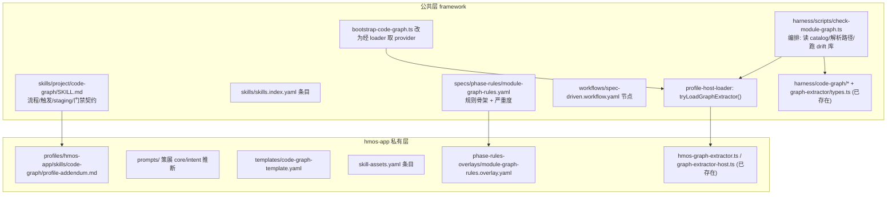

# Code Graph 用户入口 Skill + module-graph 门禁

## 背景与定位

`code-graph-ut-evolution_f8fa08ee.plan.md` 的 P0–P5 已落地（schema/extractor/drift/core 闭环），但其中两个后置 todo 被标 `cancelled`：

- `defer-code-graph-entrypoints`：Code Graph 维护入口（`0-code-graph` / `module-graph` phase / 手动刷新 / drift 检查）。
- `defer-skill-integration-repomap`：各 Skill 接入 + Repo Map（本计划**不**碰，继续后置）。

本计划只激活前者的「**用户主动生成/刷新 + drift 门禁**」一面，且按你的选择**新增 harness phase**、**单模块粒度**。Repo Map 与「Skill 1/2/3/6 把图谱当导航索引」仍后置。

现状基础设施（均已存在、可复用）：

- 库：[harness/code-graph/types.ts](harness/code-graph/types.ts)、[drift.ts](harness/code-graph/drift.ts)（`evaluateCodeGraphDrift` / `touchedCoreNodes` / `graphHasCoreNodes`）、[anchor-hash.ts](harness/code-graph/anchor-hash.ts)。
- 契约：[harness/graph-extractor/types.ts](harness/graph-extractor/types.ts)（`GraphExtractor`）。
- hmos provider：[profiles/hmos-app/harness/hmos-graph-extractor.ts](profiles/hmos-app/harness/hmos-graph-extractor.ts) + [graph-extractor-host.ts](profiles/hmos-app/harness/graph-extractor-host.ts)。
- 写盘脚本：[harness/scripts/bootstrap-code-graph.ts](harness/scripts/bootstrap-code-graph.ts)（单模块；**硬编码** `import { hmosGraphExtractor }` 并拒绝非 hmos）。
- 路径：[harness/config.ts](harness/config.ts) `moduleGraphPath()` / `DEFAULT_MODULE_GRAPHS_DIR = '<module>/code-graph.yaml'`。

缺口：无面向用户的 Skill、无 `--phase module-graph` 门禁、provider 解析方式与框架其它 phase（`profile-host-loader` 动态 require）不一致。

## 前置依赖与排序（rename 已落库 · blocker 已解除）

`rename-and-enrich-spec-plan-phases_b8e21149.plan.md`（prd→spec / design→plan 全仓改名）**已落库**：HEAD = `bbf0eee docs(framework): spec/plan terminology, MIGRATION, and rename plan`（含 `da1460e` 机械改名、`9cb3d1e` compat 兼容层）。`git status` 已无 rename 改动残留（仅剩本 plan 文件与本地 agent 产物如 `.claude/` 未跟踪），`npm test` 与 `check-plan-version` 此前已全绿。当前发布窗口 `package.json` = **2.3.0**（rename 落在 2.3.0 窗口内、未 bump）。

**排序决策**：rename 已落库，**排序 blocker 解除**，本计划可在确认「除本 plan 与本地 agent 产物（`.claude/` 等）外工作区 clean」后开工。计划**内容无需重写**——工作区已是改名后命名（spec/plan），本计划所有文件引用与最新代码核验一致。本计划改动应独立成 commit（不与已落库的 rename 混在一起）。

## 改名后已确认的新机制（探索核验）

- **集中 phase alias** = `harness/scripts/utils/phase-alias.ts`（`PHASE_ID_ALIASES` + `CHECK_ID_ALIASES` + `CANONICAL_FEATURE_PHASES`），**非** `compat-loader.ts`。`module-graph` 无 legacy id → **不需要**登记 alias；它是 **global phase**，故**不**进 `CANONICAL_FEATURE_PHASES` / `check-receipt.ts` 的 `VALID_PHASES`（与 catalog/glossary 一致，全局 phase 不走 feature 回执）。
- `**isGlobalPhase`**（`types.ts`，当前 5 项）仍须显式加 `module-graph`，但用途是**兼容兜底 + `compat-loader` 等工具路径**；harness-runner **主路径的 global/feature 判定实际取 workflow 节点的 `scope: global`**，不靠 `isGlobalPhase`。故 workflow 节点 `scope: global` 是 `--feature` 免除的主来源，`isGlobalPhase` 补齐是为工具路径一致性。
- **trace schema 边界**：`module-graph` 作为全局 phase **不产出 feature trace**，故**不**扩 `harness/trace/trace.schema.json` 的 `phase`/`kind` enum（该 enum 只含 6 个 feature phase）；其全局产出（如有）按 catalog/glossary 的全局 trace 做法走。SKILL.md 的「trace 约定」须按 catalog-bootstrap 全局写法，勿承诺写 feature trace 而被 schema 拒。
- **extension `provides.skill_assets`** 已落地（`specs/instance-extension-manifest.schema.yaml` + `harness/extension-loader.ts` → `validateProfileSkillAssetsForProject`）：实例 extension 可用 `provides.skill_assets.code-graph.<key>` 覆盖/增补 profile 占位资产。generic 占位资产仿照现有 `spec`/`plan` 块（含 legacy 别名 key）结构在 `profiles/generic/skills/skill-assets.yaml` 加 `code-graph:` bucket。**复用这条现有 extension/profile asset 合并链路，不新增第二套 asset 覆盖机制。**

## 命名约定

- Skill id：`code-graph`（project scope，`source_rel: project/code-graph`），对齐 `skill_层_scope_重构` 预留的 drop-in 槽。
- Harness phase：`module-graph`（对齐 [docs/concepts/code-graph.md](docs/concepts/code-graph.md) §6.1 与主蓝图措辞），check 脚本 `check-module-graph.ts`。
- OpenSpec change：`code-graph-entrypoints`（主蓝图 §10 已预留此名）。

## 公共层 vs hmos-app 私有层（核心）

**公共层（profile 中立）**：

- `skills/project/code-graph/SKILL.md` —— 流程 SSOT：触发条件、Step 划分（生成 derived → 引导策展 core/intent → drift 自查 → harness 门禁）、staging/确认契约、trace 约定。引用 profile 用 `profile-skill-asset:` 协议，不写死 .ets。
- `harness/scripts/check-module-graph.ts` —— 全局 phase（无 `--feature`）：读 catalog、按 `moduleGraphPath()` 定位各模块 `code-graph.yaml`、解析 schema、调 `evaluateCodeGraphDrift()` 并把 finding 映射成 `CheckResult`。**不**直接 import hmos。
- `specs/phase-rules/module-graph-rules.yaml` —— 规则骨架：`code_graph_schema_valid`(BLOCKER)、`anchor_file_present`/`anchor_symbol_present`(BLOCKER)、`core_anchor_drift`(BLOCKER)、`noncore_body_drift`(WARN)。
- `harness/scripts/utils/spec-loader.ts` —— **必改接线**：`PHASE_RULE_FILENAMES` 新增 `module-graph` 映射，否则 runner 在 `loadPhaseRule()` 直接 `Unknown phase`，phase 根本跑不起来；同步 `listAvailablePhaseRules` 单测。
- `harness/scripts/utils/types.ts` —— `KnownPhase` 与 `isGlobalPhase` 的硬编码兜底列表加 `module-graph`（该列表被 `compat-loader.ts` 实际使用）。
- `harness/profile-loader.ts` —— `normalizePhaseDisabled` 的硬编码 phase 白名单加入 `module-graph`，否则 profile 用 `phase_disabled` 禁用本 phase 会被静默忽略。
- `workflows/spec-driven.workflow.yaml` —— 新增 `module-graph` 节点（scope global，requires `[catalog]`，skill_doc 指向公共 SKILL）。它是**第一个带 `requires` 的 global phase**，顶部注释「Global phases have no deps」须同步修订（`requires` 仅影响拓扑排序，无 runtime 强制）。
- `profile-host-loader.ts` —— 新增 `tryLoadGraphExtractor(profileDir): GraphExtractor | null`（仿 `tryLoadUtHostImpl`）。`GraphExtractor` 定位为 **profile host impl**（走 `profile-host-loader` 动态 require），**不**纳入 `harness/providers` 的 capability registry，避免出现第二套 provider 语义。
- `bootstrap-code-graph.ts` —— 去掉硬编码 import，改为经 loader 取 provider；保留 CLI 行为。
- `skills/skills.index.yaml`、`agents/shared/agent-bundle/templates/skills-bridge/code-graph/SKILL.md`（跳板）、`agents/claude/templates/commands/code-graph.md`（Claude slash）、`skills/reference/confirmation-registry.yaml`（策展确认点）。
- `docs/concepts/code-graph.md` §6.1 —— 把「专用 Skill / module-graph phase 后置」改为「已落地」，Repo Map 仍后置。

**hmos-app 私有层（仅 hmos 知道的）**：

- `profiles/hmos-app/skills/code-graph/profile-addendum.md` —— `.ets` 信号、`ohosTest`/`test` 排除、签名只取 class methods 的事实、`package_path` 取自 catalog 的约定。
- `profiles/hmos-app/skills/code-graph/prompts/` —— 弱模型护栏：如何挑 3–5 个 `core: true`、怎么写 `intent`、seed 草稿如何收敛。
- `profiles/hmos-app/skills/code-graph/templates/code-graph-template.yaml` —— 样例 YAML（含三层语义注释）。
- `profiles/hmos-app/skills/skill-assets.yaml` —— 新增 `code-graph:` 资产键。
- `profiles/hmos-app/phase-rules-overlays/module-graph-rules.overlay.yaml` —— hmos 特有细则（如可选的 derived 新鲜度校验、`.ets` 锚定提示文案）；`hmos-graph-extractor.ts` / `graph-extractor-host.ts` 注册到 loader。

**generic 占位层（P1，避免 profile asset 校验翻车）**：

- `profiles/generic/skills/code-graph/profile-addendum.md` + `templates/`（占位）—— 声明「仅支持 drift 检查，不支持生成」。
- `profiles/generic/skills/skill-assets.yaml` —— 与 hmos-app 同名资产键（manifest 占位）。

## 门禁语义（v1）

`--phase module-graph`（全局，扫 catalog 中存在 `code-graph.yaml` 的模块）：

1. **零图谱 → PASS**：存量项目一个 `code-graph.yaml` 都没有时，phase 必须 PASS 并提示「可用 `/code-graph` 建图」，否则一加 phase 所有现有项目的全局门禁会无故变红。须有专门单测覆盖。
2. schema 合规（`schema_version`/`module`/`nodes[].anchor`）→ BLOCKER。
3. `evaluateCodeGraphDrift()` 映射：`anchor_file_missing`/`anchor_symbol_missing`/`core_anchor_changed` → BLOCKER；`body_hash_changed` → WARN。
4. derived 新鲜度（重抽对比）暂**不**强制，作为后续项（避免门禁噪声）。

生成/刷新仍由 `bootstrap:code-graph` 完成；Skill 负责编排「生成 → 人工策展 → 自查 → 过门禁」。与 business-ut Step 8.0 的关系：8.0 是需求收尾时的被动闭环，本 Skill 是主动建/维护入口，二者共用同一 `code-graph.yaml` 与 drift 库。

## 评审裁决（codex + claude 综合）

两份评审一致认可方向与分层，以下为需显式拍板的点（已并入上文与 todo）：

- **core 节点函数体变 = BLOCKER（与现有 `drift.ts` 对齐，不改代码）**：旧蓝图 §0.4「函数体 hash 变=提示 regenerate/review，不直接 FAIL」指的是**非 core** 节点；现有 `evaluateCodeGraphDrift()` 已实现 core 体变→`core_anchor_changed` BLOCKER、非 core 体变→`body_hash_changed` WARN，正是「守住 core」的设计。本计划沿用该实现，docs/OpenSpec 显式写明「core 体变即 core anchor changed = BLOCKER」，消除与旧蓝图措辞的歧义。
- **GraphExtractor 加载契约**：定位为 profile host impl，仅经 `profile-host-loader` 解析，不进 capability registry（见公共层条目）。
- **非 hmos profile 边界**：`module-graph` **门禁本身 profile 中立**（只读已有 `code-graph.yaml` 跑 drift，不需要 extractor），故对非 hmos 项目也能跑、零图谱 PASS；但**生成/刷新需要 profile 提供 `GraphExtractor`**，非 hmos 在 `bootstrap` 与 SKILL 入口给出清晰「当前 profile 不支持生成」提示而非 `no provider` 崩溃。此边界须在 SKILL.md 写清。
- **profile-skill-asset 资产覆盖（P1）**：公共 SKILL 用 `profile-skill-asset:` 引用模板/prompt 时，`profile-skill-assets.ts` 会用**当前 project_profile 的 manifest** 解析所有根 SKILL 引用、缺资产即 FAIL。因此 **hmos-app 与 generic 两个 profile 都须注册同名资产键**；generic 用占位 addendum + 模板并声明「仅 drift 检查、不支持生成」。
- **与 flow DAG 的边界（防过度承诺）**：`module-graph` **只验证 Code Graph 锚点与漂移**，不生成、不验证 flow DAG 连续性；中断流程的 `edge.kind` / `evidence` / `continuity_gaps` 归 business-ut 或后续 DAG change。须在 public-skill / docs-openspec 显式写明，防止 agent 把 Code Graph 当流程真源。
- **编号措辞（no-numbered prose）**：落到 `docs/` `skills/` `agents/` 的正文一律用语义名（spec/plan/coding/business-ut/device-testing），不照搬「Skill 1/2/3/5/6」（`.cursor/plans/` 被扫描排除，故本 plan 正文沿用编号无碍）。

## 验收基线

- `cd harness && npm test` 全 PASS（新增 `check-module-graph` 单测：**无图谱→PASS**、缺锚 BLOCKER、非 core 体变 WARN、core 体变 BLOCKER、schema 非法 BLOCKER；`spec-loader` 的 `listAvailablePhaseRules` 含 `module-graph`）。
- `npm run release:verify` 通过（新增发布件路径不破坏排除规则）。
- 端到端：对一个 hmos 模块走 Skill → bootstrap 生成 → 标 core → `--phase module-graph` 绿；改动 core 锚定函数体 → 门禁 BLOCKER；非 hmos profile 跑 `--phase module-graph` 不崩（零图谱 PASS）、`bootstrap` 给清晰不支持提示。
- profile asset 校验：hmos-app 与 generic 两个 manifest 都覆盖公共 SKILL 的 `profile-skill-asset:` 引用（`profile-skill-assets.ts` 不报缺资产 FAIL）。
- 文档/OpenSpec：`code-graph-entrypoints` change 通过 `npm run openspec:validate`；`node scripts/check-plan-version.mjs` 对本 plan 不再报缺 version。
- 排序前置：开工前 `git status` 确认 rename 改动已落库、工作区 clean（避免与 ~300 文件未提交 rename diff 缠绕）；本计划改动应能独立成 commit。

## 不在本计划范围

- Repo Map（全局聚合导航）、Skill 1/2/3/6 把图谱当导航索引接入（`defer-skill-integration-repomap` 继续后置）。
- 批量 `--all` 建图（本轮单模块）。
- 非 hmos profile 的 GraphExtractor provider。
- derived 新鲜度强制门禁。

