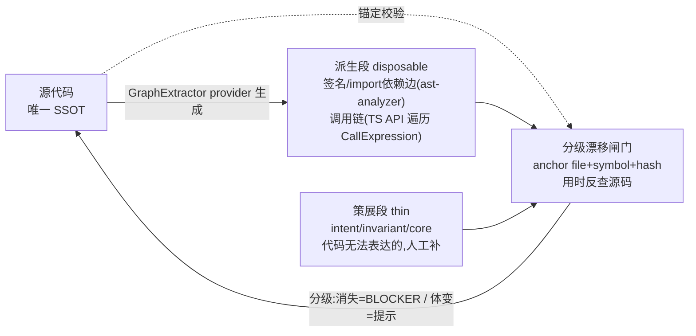

# Code Graph 与模块级 UT 能力演进（主蓝图 · v2,纳入 review）

## 0. 本次修订（采纳 review 的 6 点,均经代码核验）

1. **调用链本轮就做,但不走正则**：`AstAnalyzer`(纯正则/行扫描)只抽 import/class/方法签名,**无调用链**,继续用正则抽调用链不可靠。决策:hmos-app `GraphExtractor` provider **沿用** [ts-compile.ts](profiles/hmos-app/harness/ts-compile.ts) 的 `.ets`→`.ts` 虚拟 CompilerHost **思路**,但该文件本身是为 UT 文件编译检查服务且 `noResolve: true`(L198),**不能直接拿来做跨文件调用图**;故**另建独立 GraphExtractor host**,按需开启 import resolution + TypeChecker,遍历 AST `CallExpression` 拿调用边。ast-analyzer 继续负责 import/签名等轻量项;framework 侧仅定义 `GraphExtractor` contract。
2. **不重做 feature 级机制**：`Skill 5` 已有可测性预检/mock-plan/Lite/context-extraction,`ut-file-scope.ts` 已有 scoped/all。新增聚焦**模块级 seam/mock registry**,feature 级产物从中派生/引用。
3. **路径配置化**：Code Graph 走 `paths.module_graphs_dir`(对齐 `FrameworkPaths`),不写死 `doc/modules/<module>/code-graph.yaml`。
4. **drift 分级**：文件/符号消失=BLOCKER;签名/core anchor 变=BLOCKER或WARN;函数体 hash 变=提示 regenerate/review,不一变即 FAIL(避免维护噪声)。
5. **图谱只作索引**：Skill 接入定位为导航,**每次用图谱都反查源码 anchor**,绝不作 PRD/design/coding 事实来源;此接入风险最高,后置。
6. **归档去除要补机器可读追溯源**：`check-ut.ts > loadDagFiles` 只从 `mod.package_path/test/dag/*.dag.yaml` 读。flow DAG 不归档后,须定义**机器可读的覆盖证据**,否则门禁会"看起来没削弱、实际 SKIP"。落地:
  - **证据优先级**(高→低):归档 flow DAG > ephemeral flow DAG(reports/temp,结构同 dag schema) > `ac-coverage.json` 覆盖摘要 > UT `it()` 标签(`[AC-]`/`[BRANCH-]`/`[CHAR-]`)。
  - **落盘字段**:新增机器可读 `ut/reports/coverage-evidence.json`,登记 `evidence_source ∈ {dag_archived, dag_ephemeral, ac_coverage, ut_tags}` + 证据文件路径 + AC/branch→证据映射。
  - **loader 扩展**:`loadDagFiles`(或新 loader)同时扫 ephemeral 位置;`branch_coverage_full`/`ut_case_per_unit_ac` 等按证据优先级取最高可用源;in-scope unit/both 缺证据 → FAIL(BLOCKER)/INCOMPLETE;仅 allowlist(无 unit/both scope / profile 禁用 UT / 登记兼容降级)才 SKIP 并记原因。

## 1. 背景与核心矛盾

当前 [profiles/hmos-app/skills/5-business-ut/templates/dag-schema.md](profiles/hmos-app/skills/5-business-ut/templates/dag-schema.md) 的 "DAG" 是**单条业务流的执行脚本**,需求级、一次性。后果:几十行小需求也产出一个 DAG 文件归档,不合理。

且 "dag" 在框架里**三重含义**:Skill 5 的 UT 流程 DAG、[skills/3-coding/SKILL.md](skills/3-coding/SKILL.md) L293 的"模块依赖无环"、[skills/2-requirement-design/SKILL.md](skills/2-requirement-design/SKILL.md) 的 `intra_layer_deps: dag`。需引入清晰新术语。

用户核心担忧:把图谱扩到全局后 AI 会以图谱(文档)为准而非代码,违背"代码为准"。

## 2. 概念定型（业界对齐）

- **Code Graph / 功能图谱(模块级,新增)**:Code Knowledge Graph / Capability Map 范式(reponova / codemap / GraphRepo)。索引模块核心功能节点,可增删迭代。
- **flow DAG(需求级,保留)**:本质 scenario / test-flow graph,默认 ephemeral 不归档。
- **Repo Map(全局,后置,可选)**:tree-sitter/AST 派生的轻量跨模块导航索引。
- **CPG(不采用)**:Joern 式 AST+CFG+PDG,过重,仅作未来安全分析备选。

## 3. 守住"代码为准"的机制（命门 · 双层分离 + 分级漂移）

借鉴 codemap 的"双层分离":Code Graph 永远是代码的投影 + 一薄层意图,非平行真源。

三条铁律:

- 能静态分析出的**一律生成不手写**,经 framework `GraphExtractor` contract;hmos-app provider:import/签名复用 [ast-analyzer.ts](profiles/hmos-app/harness/ast-analyzer.ts),调用链**另建 GraphExtractor host**(沿用 [ts-compile.ts](profiles/hmos-app/harness/ts-compile.ts) 的 `.ets`→`.ts` CompilerHost 思路 + 按需 import resolution/TypeChecker,非直接复用其 `noResolve` 编译检查)。
- 节点强制**锚定** file+symbol+hash,配**分级** drift gate(见 §0.4)。
- 人工只补"代码无法表达的意图/不变量/core 标记"。

## 4. 双层模型与需求闭环闸门

- 模块级 Code Graph = 核心流程安全网(characterization / golden master)。
- 需求级 flow DAG = 增量需求测试,默认不归档(用户要求或触及 core 才归档)。
- 需求做完评估(Feathers "change point 是否穿过 inflection point"):本次是否触及 `core` 节点?触及→起可行性探测+更新图谱+同步 UT;否则 flow DAG 用完即弃。

## 5. UT 能力提升（解决"规划美好、AI 做不到"）

- **增量编排**:一次只覆盖一个 inflection point,限制 context(沿用现有 ≤300 行 context-extraction)。
- **模块级 seam/mock registry**:seam 台账 + 可复用 mock/fixture 随模块沉淀;feature 级 [testability-audit-template.md](profiles/hmos-app/skills/5-business-ut/templates/testability-audit-template.md) / mock-plan 从其派生/引用,不重造。
- **characterization path-c 落地**:按 [.cursor/plans/skill5_融合characterization路径.plan.md](.cursor/plans/skill5_融合characterization路径.plan.md) 实现。
- **混合路由**:`core`→characterization 看护;changed/高频→spec-driven;CHAR 长出 AC 升级 `[AC-*]`。

## 6. 落盘与分层

- Code Graph 落盘:`paths.module_graphs_dir`(新增配置,对齐 [harness/config.ts](harness/config.ts) `FrameworkPaths`),默认如 `doc/modules/<module>/code-graph.yaml`,但**经配置解析**而非写死。
- framework 层(主体):术语、`GraphExtractor` contract、Code Graph schema、分级 drift gate、归档膨胀治理、seam/mock registry 模型、characterization path-c、需求闭环闸门、harness 规则([specs/phase-rules/ut-rules.yaml](specs/phase-rules/ut-rules.yaml))。
- hmos-app profile(少数):`GraphExtractor` provider(import/签名走 ast-analyzer;调用链另建 GraphExtractor host,沿用 [ts-compile.ts](profiles/hmos-app/harness/ts-compile.ts) 的 `.ets`→`.ts` CompilerHost 思路 + import resolution/TypeChecker)、Hypium/MockKit 细节、`.ets` 装机链路。

## 7. 两条 change 轨道与推荐执行顺序

**Track A — Code Graph 图谱索引**(导航索引,绝不作真源):P0 术语 → P2 schema+extractor contract+provider+分级 drift → (后置) Skill 接入 + Repo Map。

**Track B — UT 可执行能力**:P1 归档膨胀快赢 → P3 模块级 seam/mock registry → P4 characterization path-c → P5 触及 core 的需求闭环闸门(依赖 A 的 core 标记)。

推荐串行顺序:`P0 → P1 → P2 → P3 → P4 → P5 →(后置接入/Repo Map)`。P1 是低风险快赢先落;重型图谱(P2)与 Skill 全量接入(后置)分开,避免一次铺太大。

## 8. 验收基线

- 每阶段:`cd harness && npm test` 全 PASS;改动发布内容须过 `npm run release:verify`。
- P1:小需求不再强制归档 DAG,且 `branch_coverage_full` 等覆盖门禁仍能从机器可读 `coverage-evidence.json`(按优先级取归档 DAG/ephemeral DAG/ac-coverage/UT 标签)取到证据源;in-scope unit/both 无证据 → FAIL(BLOCKER)/INCOMPLETE;仅 allowlist 才 SKIP 并记原因,不得静默通过。
- P2:drift gate 分级生效——符号消失 FAIL、函数体变仅提示。
- 端到端:一个 hmos-app 真实模块跑通——生成 Code Graph → 小需求 ephemeral flow DAG 不归档 → 触及 core 节点时正确触发图谱更新 + UT 同步。

## 9. 不在本蓝图范围（后续单独评估）

- CPG/数据流级静态分析。
- 历史 73 个 plan 回填。
- 非 hmos-app 新 profile 的 `GraphExtractor` provider(contract 已通用化,待有新 profile 落地)。

## 10. 后续策略落点（三层跟踪）

**策略放 plan,总体排期看 plan;实施放 OpenSpec change;最终规则沉到 OpenSpec specs + framework docs/skills/harness。**

1. **本 plan([.cursor/plans/code-graph-ut-evolution_f8fa08ee.plan.md](.cursor/plans/code-graph-ut-evolution_f8fa08ee.plan.md))** —— 路线图/策略/顺序的总控。后续只**更新 todo 状态 + 文末追加实施记录**,不改正文 scope(遵循 AGENTS.md「Plan 执行」)。
2. `**openspec/changes/<change>/`** —— 每个可实施阶段单独建一个 OpenSpec change,放真正落地的 proposal/design/tasks/spec delta。阶段→change 命名映射:
  - `p0-concepts` → `define-code-graph-concepts`
  - `b1-dag-archive-bloat` → `ut-flow-dag-evidence`
  - `a1-graph-schema-extractor-drift` → `code-graph-extractor-drift`
  - `b2-seam-mock-registry` → `module-seam-mock-registry`
  - `b3-characterization-path-c` → `skill5-characterization-path`
  - `b4-core-closure-gate` → `code-graph-core-closure-gate`
  - `defer-skill-integration-repomap` / `defer-code-graph-entrypoints` → 后置,稳定后再开 change(如 `code-graph-skill-integration` / `repo-map` / `code-graph-entrypoints`)
3. `**openspec/specs/**`（archive 后）—— 最终行为 SSOT。plan 不做运行时 SSOT;OpenSpec archive 后的 specs 才是长期规格,框架行为另沉到 `docs/` `skills/` `harness/`。

## 实施记录

### 2026-06-11 · defer-code-graph-entrypoints 由独立 plan 承接

- **承接方**：`.cursor/plans/code-graph-skill-entrypoints_a2caa5a3.plan.md`（窗口 `2.3.0`）；OpenSpec change `code-graph-entrypoints`。
- **范围**：用户入口 `code-graph` Skill、`--phase module-graph` 漂移门禁、`tryLoadGraphExtractor` 解耦 bootstrap；**不含** Repo Map 与各 Skill 图谱导航（`defer-skill-integration-repomap` 仍后置）。
- **验收**：`cd harness && npm test`、`npm run release:verify`、`npm run openspec:validate`。

