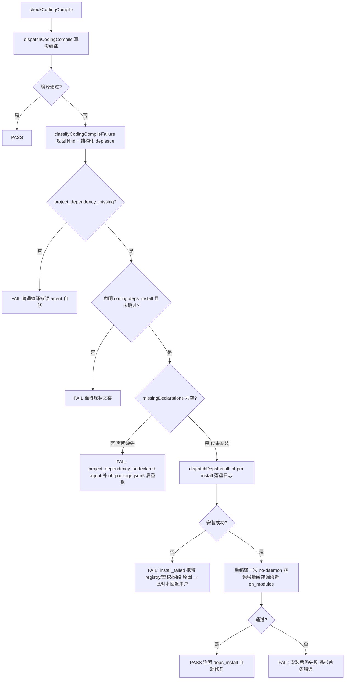

# Coding 阶段工程依赖自动安装重构

## 背景与根因（已定位）

真实工程跑 coding 阶段，hvigor 真实编译因 `@aspect/CommFunc`、`@aspect/WalletMain` 未安装失败，harness 归因 `project_dependency_missing`，AI 把它当"环境问题"上交、让用户手动 `ohpm install`。根因是**三层叠加的结构性缺口**，不是单点 bug：

1. **能力缺失（架构级）**：profile schema 的 `CapabilityKey`（`[harness/scripts/utils/types.ts](harness/scripts/utils/types.ts)` L468-476）只有 `coding.compile / coding.lint / ut.* / device_test.* / spec.visual_handoff`，**没有"安装工程依赖"这一能力**。框架"会编译、却不会让工程变得可编译"，存在结构性不对称。
2. **Skill 指向不存在的命令**：`[skills/feature/coding/SKILL.md](skills/feature/coding/SKILL.md)` L356 让 agent "执行 profile 声明的依赖安装命令"，但没有任何 profile 声明该命令 → agent 拿不到可执行指令，降级成"让用户自己装"。
3. **归因只产文字、措辞含糊**：`[profiles/hmos-app/harness/hvigor-runner.ts](profiles/hmos-app/harness/hvigor-runner.ts)` 的 `analyzeProjectDependencyIssue`（L264-326）只生成 `installHints` 文案、从不执行；`[coding-host-rules.ts](profiles/hmos-app/harness/coding-host-rules.ts)` L1014-1018 的建议"A) 确认后……安装"语义含糊，AI 顺势走了最省力的上交歧路（恰是 SKILL L361 明令禁止的"定性为环境问题"，但因无真实工具路径兜底，禁令落空）。

全仓唯一的自动安装是 `HARNESS_AUTO_NPM_INSTALL`（`[harness/harness-runner.ts](harness/harness-runner.ts)` L160-177），只管框架自身 `harness/node_modules`，与宿主 `oh_modules` 无关。

## 设计决策（已与用户确认）

- **全自动**：检测到 `project_dependency_missing` → harness 自动安装并重编译，无需用户确认；仅当**安装本身失败**（内网 registry 不可达 / 鉴权 / 网络）才回退给用户。
- **harness 内置自闭环**：编排放在 profile compile host（`checkCodingCompile`）内，在同一次 harness run 内完成"编译→装依赖→重编译"，不依赖 agent 自觉；harness-runner 保持 profile 中立。

## 目标架构（新流程）

闸门核心：用 `analyzeProjectDependencyIssue` 已算出的 `missingDeclarations` 区分三类场景——

- **声明齐全、仅 `oh_modules` 缺失** → 自动 `ohpm install` 重编译（本 case 正属此类）；
- **依赖未在 `oh-package.json5` 声明**（agent 漏写）→ 不空跑安装，FAIL 让 agent 自己补声明；
- **安装命令本身失败**（registry/鉴权/网络）→ 才回退用户。

单次 run 内最多一次自动安装（防递归 / 死循环）；提供 `HARNESS_SKIP_DEPS_INSTALL=1` 离线/CI 退出开关，默认开启。

## 改造点

### 1. 新增能力与声明（路径 B：只动 capabilities，不动 personal_prerequisites）

> ⚠️ 硬缺口规避（review 命中）：capability key 在代码里有**两道独立校验**。`capabilities:` 经 `normalizeCapabilitiesMap`（`[harness/scripts/utils/capability-alias.ts](harness/scripts/utils/capability-alias.ts)` L32-52，**无白名单**，加新 key 安全）；但 `personal_prerequisites:` 经 `normalizePersonalPrerequisitesMap`（`[harness/scripts/utils/personal-prerequisite-registry.ts](harness/scripts/utils/personal-prerequisite-registry.ts)` L50-54）对未登记于 `KNOWN_CAPABILITY_KEYS`（L15-24）的 key **直接 throw**。`loadResolvedProfile` 每次都调用它（`[harness/profile-loader.ts](harness/profile-loader.ts)` L209），所以若给 hmos-app 的 `personal_prerequisites` 写 `coding.deps_install` 而不同步白名单，几乎每次 harness 运行都会在加载 profile 阶段崩溃。

- `[harness/scripts/utils/types.ts](harness/scripts/utils/types.ts)` L468-483：`CapabilityKey` 增加 `'coding.deps_install'`；`ProfileCapabilitySpec` 结构不变。
- `[profiles/profile-schema.yaml](profiles/profile-schema.yaml)`：在 capabilities 枚举与说明中登记 `coding.deps_install`。
- `[profiles/hmos-app/profile.yaml](profiles/hmos-app/profile.yaml)` L17-33：仅在 `capabilities` 新增 `coding.deps_install: { provider: ohpm, severity: BLOCKER }`。**不写** `personal_prerequisites.coding.deps_install`——因为 `PHASE_CAPABILITY_MAP.coding` 只含 `['coding.compile']`（`[harness/scripts/utils/phase-personal-prerequisites.ts](harness/scripts/utils/phase-personal-prerequisites.ts)` L16），该 prerequisite 永不消费；且 ohpm 所需的 `deveco_toolchain` 已由 `coding.compile` 并入。既是死配置又触发上述崩溃，故不写。
- 因此 `KNOWN_CAPABILITY_KEYS` 与 `PHASE_CAPABILITY_MAP` **刻意不改**（不写 personal_prerequisites 就无需登记）。
- `[profiles/generic/profile.yaml](profiles/generic/profile.yaml)`：新增 `coding.deps_install: { provider: none, severity: SKIP }`，保证 generic 不触发安装。

### 2. 重构 classify 暴露结构化 depIssue（三路闸门的前置）

- `[coding-host-rules.ts](profiles/hmos-app/harness/coding-host-rules.ts)` `classifyCodingCompileFailure`（约 L1006-1020）当前只返回 `{ kind, explanation, suggestion }`，**丢弃**了内部 `analyzeCodingDependencyIssueViaProfile` 算出的 `depIssue`（`missingDeclarations` / `ohModulesExists` / installHints）。
- 改为额外返回 `depIssue`（或在 `project_dependency_missing` 分支附带），使 `checkCodingCompile` 能据 `missingDeclarations` 做三路分流、并把 registry/鉴权/网络分类透传用户。这是实现 #4 闸门的**必要小重构**。

### 3. 新增 provider（ohpm 安装实现）

- 新建 `profiles/hmos-app/harness/providers/deps-install.ts`：provider metadata（`id: ohpm`, `capability: coding.deps_install`, `exports: ['installProjectDeps']`）+ 转发实现。
- 新建 `profiles/hmos-app/harness/ohpm-runner.ts`：
  - `resolveOhpmSpawnPlan(projectRoot)`：**独立实现**，不照搬 `resolveCodingHvigorSpawnPlan`。ohpm 是 `<DevEco>/tools/ohpm/bin/ohpm`（Windows `ohpm.bat`）脚本，位置/调用方式/所需 env（`DEVECO_SDK_HOME` / `JAVA_HOME`）均与 `node + hvigorw.js` 不同；仅复用 DevEco 根目录定位逻辑，路径拼接与 env 注入单独验证。
  - `installProjectDeps(options)`：`spawnSync ohpm install`（cwd=projectRoot），日志落 `doc/features/<feature>/coding/reports/ohpm-install.log` 并写 meta；返回 `{ executed, exitCode, durationMs, ok, classification, logPath }`。
  - `classifyOhpmInstallFailure(log, exitCode)`：区分 `ok` / `registry_unreachable` / `auth_required` / `network` / `unknown`，供回退用户时给出**精确原因**。
  - **ohpm 不可执行 ≠ 安装失败**：DevEco 存在但 `ohpm(.bat)` 解析不到时，`installProjectDeps` 返回 `executed: false`，并显式归到独立的 `toolchain_unavailable` 原因（**不**混进 `unknown` / `install_failed`），让 #5 走"工具链不可用"汇报（对应 SKILL 6.5.3），回退文案才精准。
  - **重编译 daemon 策略**：装好依赖后重编译须确保识别新 `oh_modules` 软链——重编译用 `--no-daemon`（或先停 daemon）覆盖默认 `--daemon --parallel --incremental` 的增量/常驻缓存，避免漏读新装依赖。该策略在 ohpm-runner / 重编译入口处显式处理并单测。

### 4. capability 路由

- `[harness/capability-registry.ts](harness/capability-registry.ts)`：`PROVIDER_MODULE_BY_ID` 增 `ohpm: 'deps-install'`（L51-60）；新增 `dispatchDepsInstall(ctx, options)`（仿 `dispatchCodingCompile` L122-128）调用 `installProjectDeps`；如需可加 `isDepsInstallExecutable(profile)` 守卫。

### 5. compile host 自闭环编排（核心，基于 missingDeclarations 三路闸门）

- `[profiles/hmos-app/harness/coding-host-rules.ts](profiles/hmos-app/harness/coding-host-rules.ts)` `checkCodingCompile`（L1063-1184）：首次编译失败且 `failure.kind === 'project_dependency_missing'`、profile 声明 `coding.deps_install` 可执行、本 run 未安装过、未设 `HARNESS_SKIP_DEPS_INSTALL` 时，依 `depIssue.missingDeclarations` 分流：
  - **空（声明齐全、仅未安装）** → `dispatchDepsInstall` → 安装成功则重编译一次（no-daemon），用第二次结果裁定；details 注明"已自动 ohpm install 修复"。
  - **非空（依赖未在 oh-package.json5 声明）** → 不空跑安装；FAIL，`failure_kind: project_dependency_undeclared`，指引 agent 自己补声明后重跑（agent 可修，不上交用户）。
  - **ohpm 不可执行（`executed: false` / `toolchain_unavailable`）** → FAIL，按"工具链不可用"汇报（指引检查 `framework.config.json` 的 DevEco 路径），区别于安装真正跑过又失败。
  - **安装失败** → FAIL，`failure_kind: project_dependency_install_failed`，details 携带 ohpm 日志摘要 + `classification`（registry/鉴权/网络），此时才回退用户。
- 改写 `[coding-host-rules.ts](profiles/hmos-app/harness/coding-host-rules.ts)` L1014-1018 `classifyCodingCompileFailure` 的 `project_dependency_missing` 建议文案：由"向用户展示方案、确认后安装"改为"harness 将自动执行依赖安装并重编译；仅在安装失败时按 registry/鉴权/网络给出用户可操作项"。

### 6. next_action 与汇报

- `[harness/harness-runner.ts](harness/harness-runner.ts)` `decideNextAction`（L776-777）：新增分支——`project_dependency_install_failed` → 新 `next_action: resolve_dependency_install_blocker_then_rerun`（携带安装失败原因）；`project_dependency_undeclared` → `declare_dependencies_then_rerun`（agent 补声明）；纯 `project_dependency_missing`（自动安装关闭/不适用时）维持 `resolve_project_dependencies_then_rerun`。
- `toolchain_unavailable` **刻意不设专属 next_action**，沿用通用兜底 `fix_blockers_then_rerun`——与现有 hvigor `toolMissing`（无专属分支、归通用兜底）保持一致，避免实现时纠结。

### 7. Skill / 文档对齐

- `[skills/feature/coding/SKILL.md](skills/feature/coding/SKILL.md)` L356 / L399 / L361 / 7.1.1 模板（L402-422）：改为"harness 已自动安装依赖；agent 只在 `project_dependency_install_failed` 时按 ohpm 日志给出的 registry/鉴权/网络原因向用户求助；`project_dependency_undeclared` 时 agent 自己补 oh-package.json5 声明"，删除"执行 profile 声明的依赖安装命令"这处歧义（现在确有声明且由 harness 执行）。
- `[profiles/hmos-app/skills/framework-init/profile-addendum.md](profiles/hmos-app/skills/framework-init/profile-addendum.md)` L127-129：更新为"工程依赖由 coding harness 经 ohpm provider 自动安装"。
- `[harness/prompts/verify-coding.md](harness/prompts/verify-coding.md)`：verifier 识别新 `failure_kind`（`project_dependency_install_failed` / `project_dependency_undeclared`）与对应 `next_action`。

### 8. 测试（`cd harness && npm test` 必须全 PASS — AGENTS BLOCKER）

- 新增 `profiles/hmos-app/harness/tests/unit/ohpm-runner.unit.test.ts`：`classifyOhpmInstallFailure` 各分支 + provider metadata 校验 + ohpm 路径解析。
- 新增 deps-install 自闭环用例（mock dispatch）：三路闸门——`missingDeclarations` 空且安装成功→重编译 PASS；空但安装失败→`install_failed`；非空→`undeclared`（不调用安装）。
- 更新 `[harness/tests/unit/coding-failure-kinds.unit.test.ts](harness/tests/unit/coding-failure-kinds.unit.test.ts)`（L88-140）与 `[profiles/hmos-app/harness/tests/unit/hvigor-args.unit.test.ts](profiles/hmos-app/harness/tests/unit/hvigor-args.unit.test.ts)`（L358-377）中受影响的建议文案 / 分类断言。
- capability-registry 新 provider 路由用例。
- 复查会因 hmos-app `capabilities` 新增 key 而受影响的快照/集合断言（如 `profile-personal-prerequisites.unit.test.ts`、任何枚举 capability 全集的测试），按需更新。

## 版本与门禁约束

- 当前在研窗口 `package.json.version = 2.3.0`；本 plan frontmatter `version: 2.3.0`，**不擅自 bump**（版本演进 BLOCKER）。
- 不修改 `01-Product/Phone/src/main/ets/pages/index.ets` 中"does not meet UI component syntax"等报错——它们是 `@aspect/`* 未解析（@Builder 类型丢失）的下游表现，依赖装好后自然消失。
- **本 case 变绿预期（重要）**：当时那次 run 还有一个独立 BLOCKER `context_exploration_present`（缺 `doc/features/bc-openCard/coding/context-exploration.md`，见 `summary.json` blockers[0]）。即便依赖自动装好、编译通过，这条仍会 FAIL。本重构只负责消除"依赖未安装→上交用户"这条歧路，**不会让该 run 一键变绿**——agent 仍需补 `context-exploration.md` 才闭环。
- 验收：`cd harness && npm test` 全 PASS；在缺 `oh_modules` 的 hmos-app 实例上跑 coding，harness 自动 `ohpm install` 后重编译并给出正确 verdict。

## 不在本次范围

- ohpm 之外的包管理器（npm/pnpm 宿主）自动安装——本次只落地 hmos-app ohpm provider，schema 预留扩展位。
- framework-init 阶段的依赖预装（仍按现有约定，由 coding 阶段触发）。

