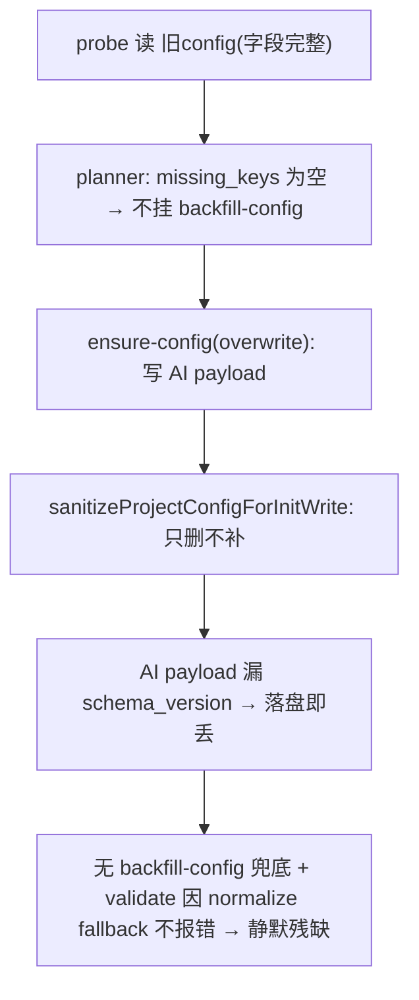
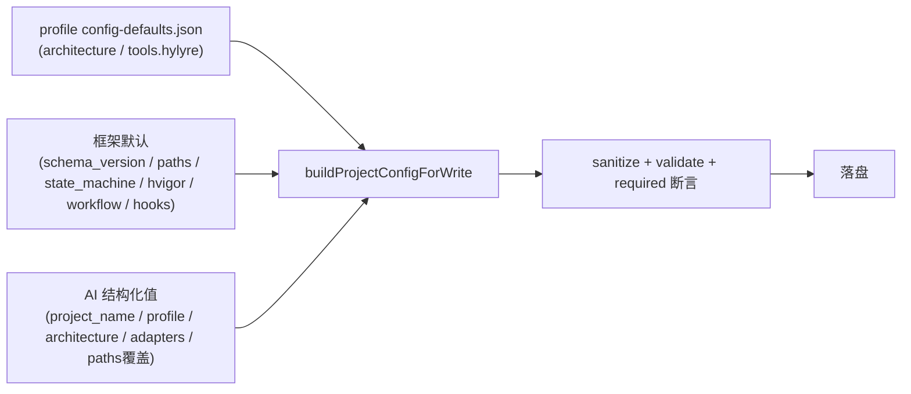

## framework.config.json 生成机制重构（方案 B：确定性 builder + profile-aware）

> 版本绑定：本 plan 属 `2.2.0` 窗口（根 `package.json.version`），frontmatter 已写 `version: 2.2.0`（见 `.cursor/rules/version-evolution.mdc`）。

### 根因（已确认）

UPDATE+overwrite（Q1=y）丢 `schema_version` 的精确链条：

机制性缺陷三连：(1) 最终内容 = AI 自由拼的 payload；(2) 落盘管线 `sanitizeProjectConfigForInitWrite` 只删不补（[config-field-merger.ts](harness/scripts/utils/config-field-merger.ts) L694-703）；(3) 补缺是「事前按旧 config 编排」的独立任务（[init-task-planner.ts](harness/scripts/utils/init-task-planner.ts) L79-92），感知不到 overwrite 引入的新缺失；CREATE 干脆不挂 backfill。

### 目标架构

新增单一权威确定性 builder，三层深合并后输出**字段完整**的 config，AI 不再提供结构性字段：

复用现有：[profile-loader.ts](harness/profile-loader.ts) `loadProfileConfigDefaults` / `applyDefaults`；常量 `DEFAULT_PATHS` / `DEFAULT_STATE_MACHINE`（[config.ts](harness/config.ts)）。

注意（review 修正）：**不直接复用私有函数 `buildDefaultConfig`**（[config.ts](harness/config.ts) L715-742）——它返回里**没有** `tools.hylyre`、**没有** `toolchain.hvigor`，且会写 `agent_adapter` / `project_type`（恰是 sanitize 要删的）。builder 必须独立组装一份明确的「framework write defaults」叶子字段表，不能假设它覆盖完整写盘字段。

### 核心设计决策

- `context.configWritePayload` 语义收窄为「结构化输入值」：`project_name`、`project_profile{name,sub_variant}`、`materialized_adapters[]`、`architecture`（preset 解析后的 DSL 或 keep_existing 旧值）、可选 `paths` 覆盖、可选 `prd`（opt-in 保持手工）。AI **不再写** `schema_version` / `state_machine` / `toolchain.hvigor` / `tools.hylyre` / 默认 `paths.*`。
- builder 以 framework write defaults + profile defaults + inputs 三层深合并补全所有结构性字段；inputs 优先（深合并，不覆盖已给值）。向后兼容旧 payload（多写的结构字段仍被接受）。
- **profile 解析优先级（写死）**：`inputs.project_profile.name` → `existingConfig.project_profile.name`（UPDATE 时）→ `hmos-app`。不单纯依赖 AI 每次提供 profile——否则旧 `generic` config 被 overwrite 且 payload 漏 `project_profile` 时会被错补成 hmos-app 并带出 hylyre。
- **单一 effective 字段表 SSOT**：`getEffectiveBackfillFields(profileName)` = 框架通用字段 + 从 `profiles/<name>/config-defaults.json` 派生的 profile 专属字段。builder、`check-init` 的 `missing_keys`、`merge-framework-config`（含 CLI 打印/dry-run/合并）、executor、单测**全部**用这一份表，杜绝多源漂移。generic 的 `config-defaults.json` 无 `tools` → 不补 hylyre。
  - **派生排除规则（关键）**：从 `config-defaults.json` 派生时**只取 profile-owned 结构默认字段**（如 `tools.hylyre.*`），**显式排除 `project_profile` 与 `architecture`**。否则递归 flatten 会把 `architecture.*` 也变成 backfill 叶子，导致「静默补用户架构」，违背原则并与下条 keep 范围冲突。
- 防御层 `assertRequiredForProfile`：落盘前断言 effective defaults 中**应写盘的叶子字段**齐备——`schema_version` / `project_name` / `architecture` / `paths.*`（除 `reports_dir_pattern`）/ `state_machine.*` / `active_workflow` / `lifecycle_hooks_enabled` / 通用 `toolchain.hvigor.*`；hmos-app 额外断言 `tools.hylyre.*`。**排除**：`prd` / `atomic_service` / `paths.reports_dir_pattern`（CONFIRM）/ personal DevEco（`toolchain.devEcoStudio.installPath`）。缺则 fail-fast，杜绝静默残缺。
- **UPDATE-keep 字段完整范围（收敛）**：keep 路径不 overwrite 整个 config，backfill **只补「框架结构默认字段」**（schema_version / paths.* / state_machine.* / active_workflow / lifecycle_hooks_enabled / toolchain.hvigor.* / profile-owned tools.*），**不**静默补用户必填字段 `project_name` / `architecture`。若旧 config 缺这两者，由 probe/preflight **明确阻断或提示**（走 Skill 交互修），而非 backfill 悄悄造一个。即「三路径字段完整」= 框架结构默认完整 + 用户必填经显式来源（inputs/旧 config/阻断），非静默造数。

### 实施步骤

1. effective 字段表 SSOT：在 [config-field-merger.ts](harness/scripts/utils/config-field-merger.ts) 新增 `getEffectiveBackfillFields(profileName)` —— 框架通用字段（schema_version/active_workflow/lifecycle_hooks_enabled/paths.*/state_machine.*/toolchain.hvigor.*）+ 从 `loadProfileConfigDefaults(profileName)` 的 `config-defaults.json` 派生 profile 专属字段（hmos-app→hylyre，generic→无）。派生时**只取 profile-owned 结构默认（如 `tools.*`），显式排除 `project_profile` / `architecture`**，避免把用户架构变成 backfill 叶子。`detectMissingBackfillFields` / `mergeBackfillFields` / `mergeFrameworkConfig` 增加 `profileName` 形参，内部改用该表（替换写死的 `BACKFILL_FIELDS`）。
2. builder（新 SSOT）：新增 `harness/scripts/utils/config-builder.ts`，导出 `buildProjectConfigForWrite(inputs, { existingConfig?, profileName? })`。流程：解析 effective profile（inputs→existingConfig→hmos-app）→ 用 `getEffectiveBackfillFields` 同源默认 + `DEFAULT_PATHS` / `DEFAULT_STATE_MACHINE` 组装 framework write defaults → 深合并 profile defaults + inputs（inputs 优先）→ `sanitizeProjectConfigForInitWrite`（剥 agent_adapter/project_type/devEco）→ `validateFrameworkConfigWriteCandidate` → `assertRequiredForProfile`。不复用私有 `buildDefaultConfig`。
3. 共享构建入口（保证 preflight↔executor 一致）：新增 helper `prepareConfigWriteForTask(ctx, action)`，**置于 `config-builder.ts`（或独立 util），不放进 `init-task-executor.ts`** —— 避免 `init-orchestrate.ts`（preflight）与 `init-task-executor.ts`（executor）为共用它而互相 import 形成难读的依赖绕线；二者都从中立 util 单向依赖。该 helper 统一从 ctx 解析 inputs + 读磁盘旧 config 作 existingConfig + 解析 profileName，再调 `buildProjectConfigForWrite`，返回最终落盘对象。preflight 与 executor **都调用它**，不各自拼 builder 参数。
4. 落盘接入口：[init-task-executor.ts](harness/scripts/utils/init-task-executor.ts) `ensure-config`（L276-300）改用 `prepareConfigWriteForTask`（UPDATE-overwrite 自动带 existingConfig=磁盘旧 config 以稳定 profile）；`backfill-config` / `migrate-config`（L301-325）解析旧 config profileName 后用同源 effective 字段表，仅补框架结构默认（不补 project_name/architecture）。[init-orchestrate.ts](harness/scripts/init-orchestrate.ts) `checkWriteTaskPayload`（L358-388）改用同一 `prepareConfigWriteForTask`，使 preflight 校验对象与 executor 落盘 **byte-for-byte** 一致。
5. probe / CLI 展示同步：[check-init.ts](harness/scripts/check-init.ts) 第 1 项 `missing_keys`（L1100-1135）按 profile 计算（只含框架结构默认，不含 project_name/architecture）；旧 config 缺用户必填 `project_name` / `architecture`（后者已有 `outer_layers===0`→EMPTY 判定，补 project_name 缺失判定）时走**阻断/提示**而非 backfill。[merge-framework-config.ts](harness/scripts/merge-framework-config.ts) 先从 config 读 profileName，CLI 打印（`BACKFILL_FIELDS.length`、缺失表、dry-run 预览，L183-213）与合并均改用 `getEffectiveBackfillFields(profileName)`，否则 generic dry-run 仍误报 hylyre 缺失。
6. 文档/交互契约：更新 [SKILL.md](skills/00-framework-init/SKILL.md) S2.1（L69-83，AI 提供结构化值、不写结构字段）、[staging-schema-example.md](skills/00-framework-init/templates/staging-schema-example.md)（精简 configWritePayload 示例）；[framework.config.template.json](templates/framework.config.template.json) 降为「人读 SSOT 文档 + builder 默认对照」，注明结构字段由 builder 注入。
7. 测试：扩展 [init-task-executor.unit.test.ts](harness/tests/unit/init-task-executor.unit.test.ts) / [init-orchestrate-smoke.unit.test.ts](harness/tests/unit/init-orchestrate-smoke.unit.test.ts)：
   - CREATE / UPDATE-overwrite / UPDATE-keep 三路径 × hmos-app/generic 双 profile，落盘后均含 `schema_version` 等完整字段；hmos-app 含 `tools.hylyre`、generic **不含**；AI payload 故意漏结构字段时仍被补齐。
   - 旧 `generic` config 被 overwrite 且 payload 漏 `project_profile` 时，落盘仍为 generic（不被误补 hylyre）——验证 profile 优先级。
   - `preflight` 输出与 `executor` 实际落盘 byte-for-byte 一致。
   - builder 输出仍剥离 `agent_adapter` / `project_type` / `toolchain.devEcoStudio.installPath`。
   - `merge-framework-config` CLI 在 generic/hmos 下 dry-run 与 apply 的字段集正确（generic dry-run 不出现 hylyre）。
   - UPDATE-keep 下旧 config 缺 `project_name` / `architecture` 时被阻断/提示，**不**被 backfill 静默造出；backfill 只补框架结构默认且不触碰 architecture。
   - effective 字段表派生不含 `architecture.*` / `project_profile`（防止架构被当 backfill 叶子）。
   - 回归 `cd harness && npm test` 全 PASS（[AGENTS.md](AGENTS.md) BLOCKER）。

### 验收

- 模拟 AI payload 缺 `schema_version` 时，CREATE 与 UPDATE-overwrite 落盘文件均含 `"schema_version": "1.1"`。
- generic profile 工程落盘 config 不含 `tools.hylyre`；hmos-app 含；旧 generic overwrite 漏 profile 时仍保持 generic。
- `preflight` 校验对象与 `executor` 落盘内容 byte-for-byte 一致。
- `merge-framework-config` 在 generic 下 dry-run 不再误报 hylyre 缺失。
- `node scripts/check-plan-version.mjs` 通过；`cd harness && npm test` 全 PASS。

### 不在本次范围

- architecture preset id → DSL 的解析仍在 AI 侧（读 profile-skill-asset sample）；builder 只在 AI 未给 architecture 时回退 profile 默认。
- `prd` / `atomic_service` opt-in 字段保持手工，不自动补。
- `paths.reports_dir_pattern`（CONFIRM_FIELDS 行为级）维持 S2 CONFIRM 流程，不并入 builder 默认补缺。