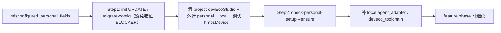
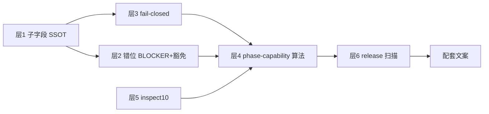

# 配置错位类问题的机制根因与源头修复

## 评审结论（外部意见对齐）

**方向认可**：字段归属 SSOT、错位 BLOCKER、读路径 fail-closed、capability readiness 四条是机制层解法，优于改文案/改 detect 路径的单点修补。

**第三轮评审**：闭环设计可开工；补 5–8 为开工前最后精度（见下）。绑定 [`package.json`](package.json) `version: 2.3.0`，不 bump。

### 第四轮评审：可实施；local 校验禁止「泛化静默吞键」

五句闭环（与 plan 一致）：project 禁 `devEcoStudio` · local 专管路径 · runtime fail-closed · readiness 按 capability · legacy 仅 migrate 清场。

**唯一收窄**：补 5 不能写「剥离所有未知顶层键」——否则 typo（如 `devEcoStuido`）会被静默忽略，配置不生效且无诊断，违背配置免疫机制。仅 `setup` 走 known-legacy 兼容；其它未知键 **fail-fast**。

**结论**：验收标准已机械化；本 plan 修的是配置系统免疫机制，非单点 DevEco。**可开工**。

### 第五轮评审：机制审查闭合；plan 元数据 BLOCKER 已修

- **闭合确认**：setup 仅 known-legacy、hvigorBin 纳入错位检测、错位修复两步串行、schema 分层对齐 — 「表面修字段、根因仍在」问题已解。
- **BLOCKER（已修）**：frontmatter 补 `version: 2.3.0`（`release:check-plans` / plan-version 门禁读 frontmatter，非正文）。
- **非阻断润色（已修）**：去掉 Markdown 链接外层反引号；修正 `toolchain.hmosDevice.*` 断行渲染。

**尚未可实施（已收敛）**：第二～五轮条目均已写入正文；实现时照单验收即可。

**硬约束强调**：层 3（fail-closed）是整套方案的「牙齿」——只要 `mergeLocalIntoToolchain` 仍 `local ?? project`，Agent 写 project config 就**继续有效**，层 2/4 只是事后提示。层 3 必须与层 2 同版本落地。

### 第二轮评审：可作为实施蓝本

核心闭环成立（机制而非提醒 Agent）：

```
字段归属 SSOT → project 错位入口 BLOCKER → runtime 不读错位字段
→ phase/goal 按 capability 要求 local readiness → init/migrate 唯一合法修复通道
```

含义：**写错也无效、下一步被机器拦住、只能走 migrate / record 写 local** — 这才是源头解。

### 实施精度补充（第二轮 · 四条必写进实现）

#### 补 1 — Schema / 契约同步（防「代码能读、契约未声明」）

层 1 除 `config.ts` / template / defaults 外，**同一 PR** 须同步：


| 文件                                                                         | 变更                                                                                                                         |
| -------------------------------------------------------------------------- | -------------------------------------------------------------------------------------------------------------------------- |
| [specs/framework.config.schema.json](specs/framework.config.schema.json) | 新增 `toolchain.hmosDevice` 属性定义；**禁止** project schema 再描述 `toolchain.devEcoStudio`（或标 deprecated + additionalProperties 收紧） |
| [specs/framework.local.schema.json](specs/framework.local.schema.json) | 收紧 `toolchain.devEcoStudio` 仅 `installPath`/`hvigorBin`；顶层 `additionalProperties: false`；**不**声明 `setup`（见第三轮补 1）          |
| [profiles/profile-schema.yaml](profiles/profile-schema.yaml) | **仅**可选 `personal_prerequisites` 文档块；**不**在此声明 `toolchain.hmosDevice`（第三轮补 4）                                              |
| [harness/scripts/utils/types.ts](harness/scripts/utils/types.ts) | `HmosDeviceConfig`、`ProfileYamlStub.personal_prerequisites`（或等价）                                                           |
| [HarnessResolvedProfile](harness/profile-loader.ts) | 解析 profile 声明的 prerequisites + capabilities                                                                                |


验收：`openspec:validate --strict` + config schema 单测。

#### 补 2 — goal readiness 用真实 auto chain（防 gate 与执行链分叉）

**禁止**静态 `FEATURE_PHASE_ORDER.slice(start, end)`。

goal / harness preflight 统一：

```typescript
const chain = resolveAutoChain(workflow, startPhase, endPhase, manifest.chain_override);
const prereqs = unionPhasePersonalPrerequisites(chain, resolvedProfile);
```

与 [goal-runner.ts](harness/scripts/goal-runner.ts) L615、`resolveAutoChain`（[phase-transition-policy.ts](harness/scripts/utils/phase-transition-policy.ts)）**同源**；workflow 或 `chain_override` 变更时 gate 自动跟随。

#### 补 3 — legacy migrate 顺序（防混写对象丢字段）

legacy `toolchain.devEcoStudio` 可能同时含 personal + 调优键。**固定顺序**（同一 `migrate-config` 事务内）：

1. personal 叶子（`installPath`/`hvigorBin`）→ `framework.local.json`（`extract_personal_to_local`）
2. 调优叶子（`killHdcServerOnFinish`/`aaTestTimeoutMs`/`testRunner`）→ `toolchain.hmosDevice.*（`deveco_tuning_to_hmos_device`）
3. 删除 project 内整个 `toolchain.devEcoStudio` 对象

**验收**：单测输入混合 legacy object → migrate 后 local + hmosDevice 字段齐全、project 无 `devEcoStudio`、无静默丢键。

#### 补 4 — readiness 尊重 capability severity（防 generic 误拦）

`resolvePhasePersonalPrerequisites(phase, resolvedProfile)` 内，对每个 capability key：

- 仅当 [isCapabilitySkipped(resolved, key)](harness/capability-registry.ts) **为 false**（即 severity ≠ `SKIP`）时，才将该 capability 绑定的 prerequisite（如 `deveco_toolchain`）纳入 phase 需求
- 例：generic profile 若 `coding.compile: SKIP`，则 coding phase **不要求** deveco，即使 profile 名不是 generic

deveco prerequisite 与 capability 绑定表（示意）：


| Capability key                            | Prerequisite       |
| ----------------------------------------- | ------------------ |
| `coding.compile`                          | `deveco_toolchain` |
| `ut.compile` / `ut.run`                   | `deveco_toolchain` |
| `device_test.build` / `.install` / `.run` | `deveco_toolchain` |


`coding.lint` 等不绑定 deveco。

### 实施精度补充（第三轮 · 开工前四条）

#### 补 5 — `framework.local.json.setup` 与 local 校验纪律

**现状**：宿主/历史 local 可能出现 `"setup": { "adapter": "generic" }`；schema 顶层 `additionalProperties: false`，不含 `setup`。

**定稿**：

- `setup`：**唯一** known-legacy 顶层键（非 canonical；SSOT 为 `agent_adapter`）
- 读盘 / migrate / `--ensure`：若 `setup.adapter` 存在且缺 `agent_adapter` → 一次性回填 → **仅删除 `setup`**
- **其它未知顶层键**：`validateLocalSchema` / `writeLocalConfig` **throw**（列出非法键名）；**禁止**泛化 strip-all-unknown
- nested：`toolchain.devEcoStudio` 仅 `installPath`/`hvigorBin`；拼写错误（如 `devEcoStuido`）schema 或 validate 报错
- schema **不**扩展允许 `setup`

单测：legacy `setup` 兼容剥离；未知顶层键 `foo` → throw；`devEcoStuido` typo → throw。

#### 补 6 — 错位检测须含 `hvigorBin`（与 personal SSOT 一致）

现状 [projectHasLegacyPersonalFields](harness/scripts/utils/config-field-merger.ts) L286–287 **只**判 `installPath`；plan 已把 `hvigorBin` 列为 personal，但检测漏网。

**定稿**：`config-field-ownership` / `projectHasMisplacedPersonalFields` / `projectHasLegacyPersonalFields` **统一**：

- project 存在 `toolchain.devEcoStudio` **整节** → 错位；或
- 存在 personal 叶子 `installPath` **或** `hvigorBin` → 错位

`buildLocalFromProjectLegacy` 已迁 `hvigorBin`（L305–312），检测层须对齐。

#### 补 7 — `misconfigured_personal_fields` 修复为**两步串行**（非二选一）

**禁止**：在 project 仍含错位 personal 字段时，`check-personal-setup --ensure` 直接写 local 并继续 feature phase（personal setup **不得**改 project 文件来「绕过」）。

**稳定修复通道**（BLOCKER 消息与 registry 须写死顺序）：




- `--ensure` 在 Step1 未完成前：返回 `misconfigured_personal_fields`（或 `needs_project_config_migration`），**不**写 local deveco
- Step1 仅 harness `migrate-config` / `extract_personal_to_local` + `deveco_tuning_to_hmos_device` 可动 project config

#### 补 8 — `hmosDevice` 与 `profile-schema` 分层（防契约放错层）


| 概念                          | 归属契约                                                                                                                       | 说明                           |
| --------------------------- | -------------------------------------------------------------------------------------------------------------------------- | ---------------------------- |
| toolchain.hmosDevice.* | [framework.config.schema.json](specs/framework.config.schema.json) + [config.ts](harness/config.ts) `HmosDeviceConfig` | **project** 工程调优 |
| personal_prerequisites | [profiles/profile-schema.yaml](profiles/profile-schema.yaml) + profile.yaml 实例 | readiness **声明**，非 config 字段 |
| toolchain.devEcoStudio 路径 | [framework.local.schema.json](specs/framework.local.schema.json) | **personal** 仅 local |


`profile-schema.yaml` **不**文档化 `hmosDevice` 键结构（避免与 project config schema 双 SSOT）。

## 机制根因（摘要）


| 断裂点           | 现状                             | 后果                       |
| ------------- | ------------------------------ | ------------------------ |
| A. 写盘守卫仅 init | sanitize 只覆盖 ensure-config     | init 后 Agent 可写回 project |
| B. merge 回退   | `local ?? project` installPath | 错位写入仍被 runtime 接受        |
| C. 门控维度       | 只验 adapter 身份                  | DevEco 缺失拖到 compile FAIL |
| D. ensure 分裂  | deveco 可 skip、无 stable code    | 失败后进入无编排自由修 JSON         |
| E. 陈旧指引       | 错误消息指向 project config          | 放大 D，非根因                 |


宿主 [dev环境.txt](D:/97.log/问题反馈/xuzhiqiang/dev环境.txt) 与 A–E 完全吻合。

---

## 已定稿决策：方案 A — 工程调优挂 toolchain.hmosDevice.*

**用户确认**：project `framework.config.json` **不再出现** `toolchain.devEcoStudio` 节（避免 Agent 误以为 installPath 仍写 project）；机器路径仅在 `framework.local.json > toolchain.devEcoStudio`；工程级设备/测试调优迁至新节 `toolchain.hmosDevice`。

**project config 目标形态（hmos-app）**：

```json
{
  "toolchain": {
    "hvigor": { "daemon": true, "parallel": true },
    "hmosDevice": {
      "killHdcServerOnFinish": false,
      "aaTestTimeoutMs": 60000,
      "testRunner": "/ets/testrunner/OpenHarmonyTestRunner"
    }
  }
}
```

**local 目标形态**：

```json
{
  "toolchain": {
    "devEcoStudio": {
      "installPath": "D:/Program Files/Huawei/DevEco Studio",
      "hvigorBin": ""
    }
  }
}
```

---

## 源头修复：四层机制 + 六点补强

### 层 1 — 字段归属 SSOT（方案 A · 子字段级）


| 字段                                                         | 归属文件                      | 配置路径                            |
| ---------------------------------------------------------- | ------------------------- | ------------------------------- |
| `installPath` / `hvigorBin`                                | **framework.local.json**  | `toolchain.devEcoStudio.*`      |
| `killHdcServerOnFinish` / `aaTestTimeoutMs` / `testRunner` | **framework.config.json** | `toolchain.hmosDevice.*`（**新**） |
| `toolchain.hvigor.*`                                       | project                   | 不变                              |


**错位判定（层 2）**：

- project 出现 **任意** `toolchain.devEcoStudio`（整节）→ `misconfigured_personal_fields`
- 或 project `devEcoStudio` 下存在 personal 叶子 `**installPath` 或 `hvigorBin`**（非空）→ 同上
- legacy 混写：migrate 顺序见补 3；检测与 [projectHasLegacyPersonalFields](harness/scripts/utils/config-field-merger.ts) 须含 `hvigorBin`（补 6）

**实现**：

- 新增 [config-field-ownership.ts](harness/scripts/utils/config-field-ownership.ts) + [config.ts](harness/config.ts) `HmosDeviceConfig` / `loadHmosDeviceConfig(projectRoot)`
- [sanitizeProjectConfigForInitWrite](harness/scripts/utils/config-field-merger.ts)：剥离 project 内整个 `toolchain.devEcoStudio`；不写 local 字段
- **新 MIGRATION_RULE** `deveco_tuning_to_hmos_device`：调优叶子 → `toolchain.hmosDevice.*`（**须在** `extract_personal_to_local` **之后**执行，见「补 3」）
- legacy 混写 object：migrate 事务顺序 personal → tuning → 删 `devEcoStudio` 整节
- [hdc-runner.ts](profiles/hmos-app/harness/hdc-runner.ts) / [loadOhosTestMetadata](profiles/hmos-app/harness/hdc-runner.ts)：改读 `loadHmosDeviceConfig`；错误文案指向 `toolchain.hmosDevice.*`
- [loadDevEcoConfig](harness/config.ts)：**仅**读 local（路径专用）；hvigor-runner 等同理，不再从 project 合并 installPath
- hmos-app [config-defaults.json](profiles/hmos-app/config-defaults.json) / [framework.config.template.json](templates/framework.config.template.json)：骨架加 `toolchain.hmosDevice` 默认值（generic profile 可无此节）

### 层 2 — 错位检测 BLOCKER + **迁移豁免**（防死锁）

**默认（feature / goal）**：

- `harness-runner` / `goal-preflight`：读 `projectRaw`，若 `projectHasMisplacedPersonalFields` → `misconfigured_personal_fields`，exit 1
- **修复路径（串行，见补 7）**：先 `migrate-config`（init UPDATE）清 project → 再 `check-personal-setup --ensure` 补 local
- **禁止**：`--ensure` 在 project 仍有错位字段时写 local 并放行 feature phase

**豁免（必须写死，否则迁移做不了）**：


| 入口                                                     | 是否过错位 BLOCKER                                      | 原因                         |
| ------------------------------------------------------ | -------------------------------------------------- | -------------------------- |
| `phase=init`                                           | **豁免**                                             | 需跑 migrate-config 清场       |
| `init-orchestrate --scope project` 且含 `migrate-config` | **豁免**                                             | 同上                         |
| `init-orchestrate --scope personal`                    | **豁免**                                             | record-deveco-path 写 local |
| `check-init` 体检                                        | **不阻断 exit**，仅报告 `pendingMigrations` + inspect10   | 体检用于发现，不替代 gate            |
| `spec` / `plan` / `catalog` / `glossary` / `docs`      | 过 BLOCKER（若错位应尽早暴露）但 **不过** deveco readiness（见层 4） | 避免过拦                       |


实现：[harness-runner.ts](harness/harness-runner.ts) 已有 `personalSetupExemptPhases`；扩展为 `evaluateConfigPlacementGate(projectRoot, { phase, scope, taskId })` 统一判定。

### 层 3 — 读路径 fail-closed（**硬约束**）

- 删除 [mergeLocalIntoToolchain](harness/scripts/utils/framework-local-config.ts) 对 `projectDeveco.installPath/hvigorBin` 的回退
- legacy project personal 叶子：**只**出现在 migrate 检测，**永不**进入 `loadFrameworkConfig()` effective 值
- 单测断言：project 有 installPath、local 无 → merged **无** installPath + phase BLOCKER（层 2）

更新 [openspec/specs/framework-local-config/spec.md](openspec/specs/framework-local-config/spec.md)：删除「project legacy 仍 merge」语义。

### 层 4 — Phase → Capability → Prerequisite 算法（防过拦 + 防 under-block）

**不再**用「profile 全局要求 deveco」；按**当前 phase 实际会触发的 BLOCKER capabilities** 推导 prerequisites。

**SSOT 映射**（实现于 `resolvePhasePersonalPrerequisites(phase, resolvedProfile)`）：

- 输入 phase → 查该 phase 关联的 capability keys（上表）
- 对每个 key：若 `!isCapabilitySkipped(resolved, key)` 且 key 绑定 `deveco_toolchain` → 纳入需求
- 输出 prerequisite 集合（去重）


| Phase                           | 候选 capability keys                        | 条件                    |
| ------------------------------- | ----------------------------------------- | --------------------- |
| `catalog` / `glossary` / `docs` | —                                         | 仅 `agent_adapter`     |
| `spec` / `plan`                 | overlay 若有 compile 类 capability           | 默认仅 adapter           |
| `coding`                        | `coding.compile`                          | SKIP 则不要 deveco       |
| `review`                        | —                                         | 仅 adapter             |
| `ut`                            | `ut.compile`, `ut.run`                    | 任一为 BLOCKER 则要 deveco |
| `testing`                       | `device_test.build`, `.install`, `.run`   | 同上                    |
| **goal-runner**                 | `resolveAutoChain(...)` 返回 chain 的 **并集** | 与真实执行链一致（补 2）         |


`**deveco_toolchain` 校验**：`detect-deveco` 结构校验（`status=ok`），禁止自由路径字符串。

**`--ensure` 扩展**（[personal-setup-gate.ts](harness/scripts/utils/personal-setup-gate.ts)）：

- stable codes：`ok` | `needs_adapter_choice` | `needs_deveco_setup` | `misconfigured_personal_fields` | …
- 单候选 ok → 机械 `record-deveco-path`（与 [init-task-executor.ts](harness/scripts/utils/init-task-executor.ts) 同路径）
- required prerequisite **不可 skip**（planner `detect-deveco` 对 hmos-app 改为 `skippable: false` 当 phase 需要时）

#### 4.1 goal-runner：**argv_adapter 不得绕过 deveco readiness**

现状：[goal-preflight.ts](harness/scripts/utils/goal-preflight.ts) L77–83 仅 `provenance === 'fallback'` 拦 personal setup；`argv_adapter` 可跳过 local，**也不检查** deveco。

**修正**：

- `argv_adapter` / `manifest_adapter`：仍可不建 local 的 `agent_adapter`（若 manifest 已带 adapter）
- 但若 goal chain（`resolveAutoChain`）经并集后需要 `deveco_toolchain` → **必须**满足（`argv_adapter` **不**豁免）
- preflight：`unionPhasePersonalPrerequisites(resolveAutoChain(...), resolvedProfile)`，与 harness-runner 同源

### 层 5 — 硬替换 check-init 第 10 项（体检与策略自洽）

**现状矛盾**（评审指出的精确 bug）：

- [inspect10](harness/scripts/check-init.ts) L1789：`target_path = 'framework.config.json:toolchain.devEcoStudio.installPath'`，读 **project raw** `env.cfg.toolchainInstallPath`
- [strategyText(10, POPULATED)](harness/scripts/check-init.ts) L1018：文案却是「`framework.local.json` 已配置，跳过」

外迁后 project 无 installPath → inspect10 **永远 MISSING**，与 POPULATED 文案矛盾，且 init 体检仍暗示「看 project config」。

**替换为**：

- `target_path`: `framework.local.json:toolchain.devEcoStudio.installPath`
- 读取 [loadLocalConfig](harness/scripts/utils/framework-local-config.ts) + `detect-deveco --path` 结构校验
- `POPULATED`：local 有 installPath 且文件系统 ok
- `MISSING`：策略仍为「阶段 `--ensure` / personal orchestrate」
- 另增 inspection（或扩 pendingMigrations）：project raw 含 personal 叶子 → `misplaced_personal_in_project_config`（引导 migrate，**不**与第 10 项混读）

### 层 6 — release 扫描 allowlist（防误报）

[release:verify](scripts/verify-release-pack.mjs) 新增扫描：发布内容中**禁止**出现「指示写入 project config 的 personal 字段」的执行指引。

**命中（FAIL）**：`skills/`**、`profiles/**/profile-addendum.md`、`hvigor-runner` 错误消息、`coding-host-rules` suggestion 等运行时可消费文本。

**Allowlist（不 FAIL）**：

- `MIGRATION.md`、`RELEASE-NOTES-v*.md` 中的历史/迁移叙述（须带「legacy」「已废弃」语境）
- `openspec/changes/archive/`** 归档提案
- 明确写「勿写入」「仅 migrate」的否定句（扫描规则需上下文感知或白名单路径）

---

## 症状层修复（配套，非主方案）

- hvigor-runner / coding-host-rules：错误消息 → local + `framework/harness/scripts/detect-deveco.ts`
- device-testing addendum：PATH 推导来源改为 merged local 路径
- personal-setup-gate / MIGRATION：与 `--ensure` stable codes 对齐

---

## 验收标准（机制级）

1. project 写入 `installPath` 或 `hvigorBin` → merged 读不到 + `misconfigured_personal_fields`（compile 前 FAIL）
2. BLOCKER 修复须两步：未 migrate 时 `--ensure` 不放行；migrate 清 project 后 `--ensure` 可写 local
3. local 无 deveco：spec/plan 可跑；coding/ut/testing（非 SKIP capability）不可跑
4. goal chain 来自 `resolveAutoChain`；`argv_adapter` 不绕过 deveco readiness
5. legacy 混写 migrate：无丢字段；legacy `setup` 兼容剥离；**未知 local 键 fail-fast**（非 setup 不静默吞）
6. project 无 `devEcoStudio`；调优在 `hmosDevice.*`；profile-schema 不含 hmosDevice 结构
7. inspect10 读 local；schema 契约 + release:verify + 单测全覆盖

---

## 实施顺序




1. 层 1 子字段 SSOT（阻塞层 3，防误删调优键）
2. 层 3 + 层 2 同 PR（fail-closed 与 BLOCKER 语义一致）
3. 层 4 + 层 5（readiness 算法 + init 体检自洽）
4. goal-preflight 接入层 4
5. 层 6 + 配套文案 + OpenSpec 更新

---

## 宿主工程即时止血（运维）

- 删除 project config 中 `installPath`/`hvigorBin`（保留 project 调优键若存在）
- `npx ts-node framework/harness/scripts/detect-deveco.ts --json`
- 写入 `framework.local.json`（框架修复后走 `--ensure` / `record-deveco-path`）

---

## 实施记录

- **日期**：2026-06-16
- **验收**：`cd harness && npm test`（856 passed）；`npm run release:verify`（ALL PASS）
- **偏离**：`--ensure` 修复链由线性 if-else 改为循环，单次可完成 `auto_single_adapter_and_deveco`；P2 profile 契约顺延至 [`deveco_p2_profile契约_7c4e2a91.plan.md`](deveco_p2_profile契约_7c4e2a91.plan.md)（2.4.0）
