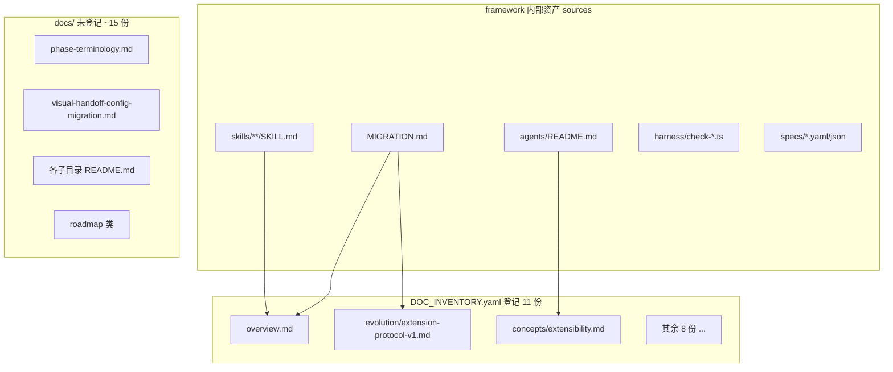

# docs 新鲜度整改计划

## 文档体系全景




**机制**（`[docs/DOC_INVENTORY.yaml](docs/DOC_INVENTORY.yaml)` + `[harness/scripts/utils/doc-freshness.ts](harness/scripts/utils/doc-freshness.ts)`）：

- 每份登记 doc 的 `sources[]` 取 git **最近 commit 时间** `src_ts`
- doc 自身 commit 时间 `doc_ts`
- 任一 `src_ts > doc_ts` → `doc_freshness` **MAJOR**（整体 Verdict 仍可为 PASS，exit 0）
- **清零 MAJOR 的唯一可靠方式**：补内容后 **commit doc 文件**（touch-only 也可，但语义变更应写正文）

**维护纪律**（`[docs/README.md](docs/README.md)` §维护规则）：source 语义变了 → 改 doc；纯重构 → 可 touch+commit；source 路径失效 → 改 inventory。

---

## 当前状态（commit `5c6fb64` 之后）


| 登记文档                                                                                 | 本轮触发的 source                                                                 | 状态                      |
| ------------------------------------------------------------------------------------ | ---------------------------------------------------------------------------- | ----------------------- |
| `[docs/overview.md](docs/overview.md)`                                               | `framework-init/SKILL.md`、`MIGRATION.md`                                     | **fresh**（同 commit 已同步） |
| `[docs/concepts/extensibility.md](docs/concepts/extensibility.md)`                   | `[agents/README.md](agents/README.md)` L52「遗留 skill 跳板 / cleanup-deprecated」 | **stale MAJOR**         |
| `[docs/evolution/extension-protocol-v1.md](docs/evolution/extension-protocol-v1.md)` | `[MIGRATION.md](MIGRATION.md)` L721 实例根 adapter 跳板段落                         | **stale MAJOR**         |
| 其余 8 份 inventory doc                                                                 | 本轮未改其 sources                                                                | **fresh**（推断）           |


**根因（两份 doc 性质不同）**：


| doc                        | stale 触发                                                         | 整改性质                                                              |
| -------------------------- | ---------------------------------------------------------------- | ----------------------------------------------------------------- |
| `extensibility.md`         | `[agents/README.md](agents/README.md)` adapter 跳板 / cleanup 段落已变 | **source 语义已变** → 维护同步须写实质内容                                      |
| `extension-protocol-v1.md` | `[MIGRATION.md](MIGRATION.md)` 新增实例根跳板段（与三套 schema **无关**）       | **inventory 时间戳连带** → 以 **扩展 skill 安全性澄清** 落笔，勿写成「协议 schema 语义变更」 |


审查已核对：inventory 11 条、`DOC_INVENTORY.yaml` L115/L133 溯源、`overview.md` 同 commit `5c6fb64` 已 fresh、`check:docs` 机制与 2 MAJOR 完全吻合。

---

## P0：清零 doc_freshness MAJOR（本轮必做）

### 1. 同步 `[docs/concepts/extensibility.md](docs/concepts/extensibility.md)`（adapter 层 · 语义同步）

在现有 **「维护同步（2026-06-12 · 2.3.0）」** 小节（L107–113）追加 **adapter 实例根清理** bullet：

- UPDATE `framework-init` 的 `cleanup-deprecated` 会 `backup_delete` 遗留 skill 跳板
- 范围：编号（`3-coding`）+ 语义旧名（`prd-design` / `requirement-design` / `1-prd-design` / `2-requirement-design`）
- 保留现行扁平跳板（`spec` / `plan` / `coding`）
- 交叉引用：`[agents/README.md](../../agents/README.md)`「v2.3+ 扁平 skill-id」、`[MIGRATION.md](../../MIGRATION.md)` §v2.3

**不改** adapter 职责表（L69–75）主体。

**措辞安全**：文中 `prd-design` 等不会触发 numbered-skill 扫描（regex 为 `Skill\s*[0-6]` + `skills/` 路径；`agents/README.md` / `MIGRATION.md` 已有同类字面量且 gate 通过）。

### 2. 同步 `[docs/evolution/extension-protocol-v1.md](docs/evolution/extension-protocol-v1.md)`（扩展 skill 安全性 · 非 schema 同步）

本文 SSOT 是 workflow / manifest / lifecycle-hooks **三套 schema**；本轮 MIGRATION 改动是 skill-id 跳板清理，**不改变**协议字段或 `schema_version`。

在 **「维护同步（2026-06-12 · 2.3.0）」**（L27–33）追加 bullet，**从扩展 skill 安全性写**：

- UPDATE `cleanup-deprecated` 仅删除框架历史 phase 约定名（含 `prd-design` 等），**不会**误删实例 extension skill（如 `wallet-sdk-onboarding`）
- 实例升级操作备忘：详见 `[MIGRATION.md](../../MIGRATION.md)` §v2.3 实例根 adapter 跳板；勿跳过 `cleanup-deprecated`

**不要**写「因 MIGRATION 语义变更必须同步协议正文」。可选在「相关资产」表加一行链到 MIGRATION §v2.3（操作备忘，非 schema SSOT）。

### 结构性备注（非本轮缺陷）

`MIGRATION.md` 同时是 `overview.md` 与 `extension-protocol-v1.md` 的 source（`[DOC_INVENTORY.yaml](docs/DOC_INVENTORY.yaml)` L54 / L133）。此后**每次** MIGRATION 补丁都可能再次拖 stale `extension-protocol-v1.md`——属时间戳粒度带来的例行 toil；若改动与三套 schema 无关，可 **touch + commit** 或补一句维护同步勘误，**勿**从 inventory 删 MIGRATION source。

### 3. 提交与复验（顺序 BLOCKER）

**必须先 commit 两份 doc**，再跑 `check:docs`（`doc_ts` 取自 git commit 时间，工作区未提交无效）。

```powershell
# 仓根：stage + commit docs
cd harness
npm test
npm run check:docs
```

目标：`doc_freshness` **0 FAIL**。

---

## P1：inventory 覆盖与交叉引用（可选，本窗口可不做）

### 未登记但有消费者价值的 doc


| 文件                                                                                   | 建议                                                                           |
| ------------------------------------------------------------------------------------ | ---------------------------------------------------------------------------- |
| `[docs/concepts/phase-terminology.md](docs/concepts/phase-terminology.md)`           | 已有 spec/plan 对照；**可选**登记 inventory（sources: `MIGRATION.md`、`phase-alias.ts`） |
| `[docs/visual-handoff-config-migration.md](docs/visual-handoff-config-migration.md)` | MIGRATION 已链入；dev 向专文，暂不必登记                                                  |
| `[docs/skills/rename-tail-allowlist.md](docs/skills/rename-tail-allowlist.md)`       | 维护者 SSOT，dev-only，不登记                                                        |
| 各 `README.md` / roadmap                                                              | 地图/路线图，不触发 freshness                                                         |


### 长期缺口（`[docs/README.md](docs/README.md)` 已标注「待写」）

`docs/skills/spec.md`、`plan.md`、`coding.md`、`code-review.md`、`device-testing.md` — 不影响当前 `check:docs`，属产品文档 backlog。

### inventory 调优原则（勿在本轮乱改）

- **不要**为消 MAJOR 而从 `sources[]` 删除 `agents/README.md` 或 `MIGRATION.md`——会丢失合理提醒
- **不要**把 `MIGRATION.md` 加进 `extensibility.md` sources（任何迁移改动都会拖累该 doc）；用正文交叉引用即可

---

## P2：可选增强（非门禁）

- `[docs/operations/harness-runbook.md](docs/operations/harness-runbook.md)` §7：`init` phase 旁注 UPDATE cleanup（sources 含 `check-init.ts`，改 runbook 不会自动触发 freshness，除非改 source）
- `[docs/evolution/extension-e2e-acceptance.md](docs/evolution/extension-e2e-acceptance.md)` §3：物化后确认无 `prd-design` 残留目录（手验清单）

---

## 发布门禁耦合（`version: 2.3.0`）

本 plan 绑定当前窗口 **2.3.0**。frontmatter todo 仍为 `pending` 时，`npm run release:verify` 的 `check-plan-version --release` 会 **FAIL**（与 `init_清旧跳板` plan 已 completed 同理）。

| 路径 | 做法 |
|------|------|
| **推荐（本窗口收口）** | 执行 P0：改 2 份 doc → commit → `check:docs` 清零 → 将本 plan 3 个 todo 标 `completed` → `release:verify` 恢复 PASS |
| 顺延 | 将 `version` + `deferred_to` 同为 `2.4.0`（须用户明确选择；**默认不走**） |

改动量小且 `doc_freshness` 为 MAJOR 验收项，推荐在 **2.3.0** 内完成，不顺延。

---

## 验收标准


| 级别  | 命令                                 | 期望                           |
| --- | ---------------------------------- | ---------------------------- |
| 必达  | `cd harness && npm run check:docs` | `doc_freshness` 无 FAIL 行     |
| 必达  | `cd harness && npm test`           | 全 PASS                       |
| 发布前 | `npm run release:verify`           | ALL PASS（plan `version` 已具备） |


---

## 风险


| 风险                                       | 缓解                                             |
| ---------------------------------------- | ---------------------------------------------- |
| extensibility 只 touch 不写                 | agents/README 语义已变，须写 cleanup bullet           |
| extension-protocol 写成 schema 变更          | 只写 **扩展 skill 安全性** + MIGRATION 操作链；协议正文不动     |
| MIGRATION 日后再次拖 stale extension-protocol | 例行 toil：无关改动可 touch+commit；勿删 inventory source |
| 过度扩写                                     | 各 1–2 bullet，不重复 MIGRATION 全文                  |


