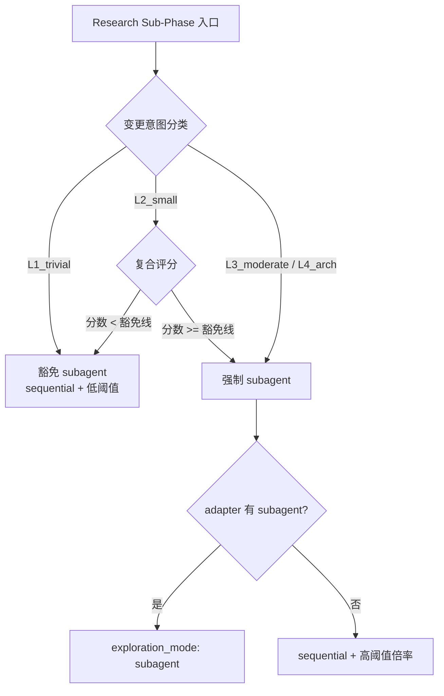

# Explore Subagent 触发策略升级方案

## 问题诊断

当前 `requiresSubagent()` 仅依赖单一维度计数：


| 阶段     | 当前触发条件              | 大型项目问题                        |
| ------ | ------------------- | ----------------------------- |
| design | scope >= 2 模块       | 单模块 10-20 万行，scope=1 也需深度探索   |
| coding | contracts files > 5 | 改 3 个文件但跨 3 层依赖，依然需要 subagent |
| review | contracts files > 8 | 改 2 个核心文件影响 30+ 下游，也需要        |
| prd    | scope >= 3          | 单模块大功能改版同样需要                  |
| ut     | use-cases > 2       | 2 个 use-case 但被测实现 5000 行     |


**根因**：用文件/模块的「数量」代替了变更的「复杂度」。大型工程中，数量少不代表简单。

---

## 业界研究支撑

1. **Navigation Paradox (2026)**：graph-structured 探索在 architecture-heavy 任务达 99.4% 准确率；关键瓶颈是「agent 是否启动工具」而非工具本身质量——**默认启动比条件触发更可靠**。
2. **Task Complexity Classification (L1-L4)**：L1 trivial / L2 small / L3 moderate / L4 architectural，用多维信号（ExpectedFileCount, MentionsRefactor, 关键词）分类，而非单一数字。
3. **Change Impact Analysis (FSE 2024-2025)**：coupling depth、fan-out、historical co-change 比 LOC 或文件数更能预测变更影响范围。
4. **CodeCortex**：pre-built dependency knowledge 将 tool calls 从 37 降到 15 且质量不降——说明「先探索再动手」的 ROI 极高。

---

## 架构设计：Default-On + Trivial Exemption + Sequential Fallback




### 核心变更点

**1. design / coding 阶段：Default-On（默认 subagent）**

反转逻辑：不再「越阈才 subagent」，而是「默认 subagent，检测到 trivial 才豁免」。

```yaml
# design-rules.yaml 新增
exploration_strategy:
  default_mode: subagent           # 默认行为
  trivial_exemption:
    enabled: true
    conditions_any:                 # 满足任一条 → 豁免
      - intent: [rename, extract_function, move_file, typo_fix]
      - prd_loc_delta_lt: 30       # PRD 声明的预期改动行数 < 30
      - single_function_scope: true # 仅改单个函数体内部
```

**2. prd / review / ut 阶段：复合评分**

取代单一 `require_subagent_when_`*，用多维度加权评分：

```yaml
# prd-rules.yaml 新增
exploration_strategy:
  default_mode: sequential
  scoring:
    threshold: 60                  # 分数 >= 60 → 须 subagent
    dimensions:
      - id: module_loc
        weight: 25
        tiers: [{gte: 50000, score: 25}, {gte: 20000, score: 15}, {gte: 5000, score: 8}]
      - id: scope_breadth
        weight: 20
        tiers: [{gte: 3, score: 20}, {gte: 2, score: 12}, {gte: 1, score: 5}]
      - id: cross_layer
        weight: 20
        signal: touches_multiple_outer_layers
        score_if_true: 20
      - id: new_api_surface
        weight: 15
        signal: adds_exports_or_public_api
        score_if_true: 15
      - id: dependency_fan_out
        weight: 20
        tiers: [{gte: 10, score: 20}, {gte: 5, score: 12}, {gte: 2, score: 5}]
```

**3. Sequential 等价路径（无 subagent 能力时）**

当 adapter 不支持 subagent（或用户显式选 sequential）：

```yaml
# phase-rules 新增
exploration_strategy:
  sequential_multiplier: 2.0       # 倍率：source_code_paths × 2, code_facts × 2
  sequential_min_files_inspected_add: 5  # 额外 +5
```

harness 检测到 `exploration_mode: sequential` 且评分达到 subagent 线时，自动将量化阈值乘以倍率。

---

## 变更意图分类器（Trivial Exemption）

新增轻量分类器，**由 agent 在 context-exploration.md frontmatter 声明**，harness 校验合理性：

```yaml
# context-exploration.md frontmatter 新增
change_intent: "feature"           # feature | bugfix | refactor | rename | docs | config
estimated_loc_delta: 150           # 预期新增+修改行数
touches_layers: ["presentation", "domain"]  # 涉及的架构层
adds_new_exports: true             # 是否新增跨模块出口
```

分类规则（`classifyExplorationComplexity()`）：


| 分类                   | 条件                                                                                             | 结果                                          |
| -------------------- | ---------------------------------------------------------------------------------------------- | ------------------------------------------- |
| **L1 trivial**       | `intent in [rename, typo_fix, docs, config]` 且 `loc_delta < 20` 且 `touches_layers.length <= 1` | 豁免 subagent                                 |
| **L2 small**         | `loc_delta < 50` 且 `touches_layers.length <= 1` 且 `!adds_new_exports`                          | 走评分，低分可豁免                                   |
| **L3 moderate**      | 其他                                                                                             | design/coding 强制 subagent；prd/review/ut 走评分 |
| **L4 architectural** | `touches_layers.length >= 3` 或 `adds_new_exports` 且 `loc_delta > 200`                          | 全阶段强制 subagent                              |


---

## 复合评分维度来源


| 维度                     | 数据来源                                                                                                          | 说明                 |
| ---------------------- | ------------------------------------------------------------------------------------------------------------- | ------------------ |
| **module_loc**         | `framework.config.json` → `architecture.outer_layers` + 磁盘文件扫描（或 `doc/module-catalog.yaml` 的 `estimated_loc`） | 大模块即使 scope=1 也高分  |
| **scope_breadth**      | PRD.md `in_scope_modules` 数组长度                                                                                | 保留原有维度但作为权重之一      |
| **cross_layer**        | `touches_layers` 是否跨越 >1 个 outer_layer                                                                        | 跨层变更关联性高           |
| **new_api_surface**    | `adds_new_exports`                                                                                            | 新增公共 API 需了解消费者    |
| **dependency_fan_out** | 静态计算：目标模块被多少其他模块 import                                                                                       | 高 fan-out = 改动影响面大 |


前 4 个由 agent 在 frontmatter 声明；`dependency_fan_out` 由 harness 脚本静态扫描 `index.ets` 导出被引用次数。

---

## 改动文件清单


| 文件                                                                                                                       | 改动                                                                                                                                                    |
| ------------------------------------------------------------------------------------------------------------------------ | ----------------------------------------------------------------------------------------------------------------------------------------------------- |
| `[framework/harness/scripts/utils/types.ts](framework/harness/scripts/utils/types.ts)`                                   | `ExplorationThresholds` 扩展 `exploration_strategy` 类型；新增 `ExplorationClassification` / `ScoringDimension` 类型                                           |
| `[framework/harness/scripts/utils/context-exploration.ts](framework/harness/scripts/utils/context-exploration.ts)`       | 重写 `requiresSubagent()` → `determineExplorationMode()`；新增 `classifyExplorationComplexity()`、`computeExplorationScore()`、`applySequentialMultiplier()` |
| `[framework/specs/phase-rules/design-rules.yaml](framework/specs/phase-rules/design-rules.yaml)`                         | 新增 `exploration_strategy` 段（default_mode: subagent + trivial_exemption）                                                                               |
| `[framework/specs/phase-rules/coding-rules.yaml](framework/specs/phase-rules/coding-rules.yaml)`                         | 同上                                                                                                                                                    |
| `[framework/specs/phase-rules/prd-rules.yaml](framework/specs/phase-rules/prd-rules.yaml)`                               | 新增 `exploration_strategy` 段（default_mode: sequential + scoring）                                                                                       |
| `[framework/specs/phase-rules/review-rules.yaml](framework/specs/phase-rules/review-rules.yaml)`                         | 同上                                                                                                                                                    |
| `[framework/specs/phase-rules/ut-rules.yaml](framework/specs/phase-rules/ut-rules.yaml)`                                 | 同上                                                                                                                                                    |
| `[framework/harness/templates/context-exploration.md](framework/harness/templates/context-exploration.md)`               | frontmatter 新增 `change_intent` / `estimated_loc_delta` / `touches_layers` / `adds_new_exports`                                                        |
| `[framework/skills/reference/agent-behavioral-principles.md](framework/skills/reference/agent-behavioral-principles.md)` | 原则 1 更新：Research Sub-Phase 默认 subagent（design/coding）；声明 trivial 豁免条件                                                                                 |
| Skills 1-5 SKILL.md (Research Sub-Phase)                                                                                 | 更新触发描述：design/coding 改为「默认 subagent，除非声明 trivial」                                                                                                     |
| `[framework/MIGRATION.md](framework/MIGRATION.md)`                                                                       | 新增 v2.10 节：exploration_strategy 迁移说明                                                                                                                  |
| `[framework/harness/scripts/utils/fan-out-scanner.ts](framework/harness/scripts/utils/fan-out-scanner.ts)`（新建）           | 静态扫描 `index.ets` 出口被引用次数，计算 dependency_fan_out                                                                                                        |


---

## 向后兼容

- **旧 `exploration_thresholds`** 仍有效：若 yaml 无 `exploration_strategy` 段，fallback 到现有 `requiresSubagent()` 逻辑
- **schema 1.1.0 不变**：新增 frontmatter 字段为 optional，缺失时 harness 按「非 trivial」处理（即 default-on 不被豁免）
- **sequential 路径**：无 subagent adapter 只要满足倍率后的量化阈值即 PASS

---

## 与当前 Karpathy plan 的关系

本方案是 v2.9（Karpathy 四原则）的**增量演进**，不改变三层架构（行为规约 + 量化门禁 + verifier），仅升级 Layer 2 中 `requiresSubagent()` 的决策模型。verify-*.md 的 `behavior_research_grounded` 无需改——它审查的是「产出是否有事实依据」，不关心探索是 subagent 还是 sequential。