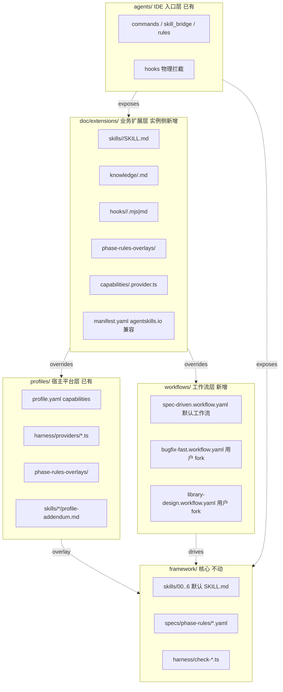

# Framework 可演进性重构

> **本 plan 面向其他大模型（包括弱模型）执行**。开工前请**完整阅读**第 0 节（术语表 / 风险登记 / 执行守则 / 全局停止条件）+ 第七节（详细执行手册），不要凭印象动手。
>
> Plan 章节结构：
>
> - 第 0 节：弱模型可执行性元信息（术语、风险、守则、停止条件）
> - 第一 ~ 六节：为什么要做、三层概念、文件清单、零回归、不做、演进保证
> - 第七节：**详细执行手册**——每个 todo 的「前置阅读 / 产物白名单 / 执行步骤 / 验收检查点」
> - 第八节：Milestone 验收边界
> - 第九节：测试矩阵
> - 第十节：协议 schema 演进规则（breaking vs 非 breaking）

---

## 〇、弱模型可执行性元信息（必读）

### 0.1 术语表（先对齐词汇，避免歧义）


| 术语             | 含义                                                                                   | 不要与之混淆                                                                    |
| -------------- | ------------------------------------------------------------------------------------ | ------------------------------------------------------------------------- |
| **phase**      | harness 跑一次的最小执行单元（如 `prd`、`coding`）；与 `--phase <name>` flag 一一对应                    | 不是"项目阶段"；不要把 catalog/glossary/docs/init 这类全局 phase 与 feature 维度 phase 概念混 |
| **workflow**   | 一组 phase 的 DAG 描述，存于 `framework/workflows/<name>.workflow.yaml`                      | 不是"业务工作流"；本 plan 里 workflow = phase DAG schema                            |
| **artifact**   | workflow.yaml 里一个 phase 节点对应的"产物"概念（借用 OpenSpec 术语）                                  | 不是"feature 产物"（PRD.md/design.md 等），那种叫 `feature artifact`，本 plan 不展开      |
| **profile**    | `framework/profiles/<name>/` 下的宿主平台插件（hmos-app / generic / cloud），承担"宿主语言/工具链"维度的可变性 | 不是 IDE adapter；不是 workflow；不是业务扩展                                         |
| **adapter**    | `framework/agents/<name>/` 下的 IDE 适配插件（claude / cursor / generic），承担"AI 客户端入口"维度的可变性 | 不是 profile；不承担 phase 规则                                                   |
| **extension**  | 实例工程根 `doc/extensions/` 下的业务侧扩展包，承担"业务知识/SOP/自定义检查"维度的可变性                            | 不是 plugin（避免与 Hermes plugin 混淆，统一叫 extension）                             |
| **hook**       | lifecycle 事件回调点（7 个事件名见层 C 表）；可由 framework/profile/extension 三层注册                    | 不是 Claude Code Stop hook（那是 adapter 层物理拦截，已存在，不动）                         |
| **manifest**   | `doc/extensions/manifest.yaml`，extension 的入口声明文件                                     | 不是 `framework.config.json`（实例配置）                                          |
| **capability** | profile.yaml / extension manifest.yaml 中声明的"能力 ID + provider 路径 + 严重级"三元组            | 不是工具调用本身                                                                  |


### 0.2 已知风险登记（开工前必须知道）


| 风险                                                                             | 影响面                                           | 处理                                                                                                                                                                                                              |
| ------------------------------------------------------------------------------ | --------------------------------------------- | --------------------------------------------------------------------------------------------------------------------------------------------------------------------------------------------------------------- |
| R1：`Phase` 联合类型改为运行时字符串后，TS 类型收紧丢失                                             | 全 harness                                     | 用 zod / 手写校验在 `workflow-loader.ts` 加运行时白名单兜底；`types.ts` 保留 `KnownPhase` 联合类型供 IDE 提示，但运行时不再 enum 校验                                                                                                             |
| R2：fixture 测试的 `CMD.json` 里硬编码 `--phase <name>`，可能因 workflow 不识别该 phase 而 FAIL | profile/hmos-app + profile/generic 的 fixtures | 默认 workflow `spec-driven.workflow.yaml` 必须**一比一**覆盖现有所有 phase 名（init / catalog / glossary / docs / prd / design / coding / review / ut / testing），不增不减                                                          |
| R3：`doc/extensions/` 在实例工程不存在时，`extension-loader.ts` 必须正常无副作用返回                | 所有未升级实例                                       | loader 返回空 ExtensionBundle；harness 跑全套测试时验证此分支                                                                                                                                                                  |
| R4：`manifest.yaml` 错误格式会让整条 harness 链路挂掉                                       | 业务侧                                           | `check-extensions.ts` 在 phase=extensions 报 BLOCKER，但其它 phase 跑时 loader 仅产生 MAJOR + skip 该 extension，不阻塞主链                                                                                                       |
| R5：lifecycle hook 脚本 `.mjs` 死循环或抛异常                                            | 实例侧                                           | hooks-dispatcher 加超时（默认 30s）+ try/catch 兜底；超时/异常按 hook 来源（framework/profile/extension）分别处理（framework BLOCKER / profile BLOCKER / extension MAJOR）                                                               |
| R6：Skill 00 模板里 800+ 处 `framework/...` 硬编码路径，若本次顺手改名会引发大面积破坏                   | 全局                                            | **本次只新增不改名**——`framework/workflows/` 新增、`framework/specs/` 新增子文件、`framework/hooks/` 不引入框架级目录（hook 协议在 specs 下，框架级 hook 用 `framework/harness/hooks/` 子目录，避免与已有 `framework/agents/<adapter>/templates/hooks/` 混淆） |
| R7：schema_version 跨阶段不一致                                                       | 协议层                                           | workflow.yaml / manifest.yaml / lifecycle-hooks-schema.yaml 三份各自独立 `schema_version` 字段，互不强绑定；compat 表写在 `framework/docs/evolution/extension-protocol-v1.md`                                                     |
| R8：cursor / claude adapter 模板里加业务 skill 跳板/slash 后，与现有 skill 跳板冲突              | adapter 渲染                                    | `render-agents-md.mjs` 必须用确定性顺序（framework skills → instance skills），且对同名 skill 走"前缀冲突告警"分支                                                                                                                      |


### 0.3 弱模型执行守则（每个 todo 都要遵守）

1. **协议先行**：所有 schema（workflow-schema.json / instance-extension-manifest.schema.yaml / lifecycle-hooks-schema.yaml）**必须在实现 loader / dispatcher 之前完成且锁版本**。Milestone 1 不通过，**禁止**开始 Milestone 2。
2. **逐文件闭环**：写完一个 TS 文件 → 立刻 `ReadLints` → 零 error 才能写下一个。**严禁**批量生成多文件再统一 lint。
3. **每次 StrReplace 后必须 Read 一次**校验改动落点正确。
4. **白名单外的文件一律不动**：每个 todo 在第七节都有"产物白名单"——出现需要改白名单外的文件，**停下来报告**，不要静默扩大范围。
5. **harness 回归是 milestone 间硬边界**：Milestone 切换前必须跑完 `cd framework/harness && npm test` 全 PASS。
6. **遇到任何"看起来不一致"的现象**：立即停止，把现象贴出来等用户确认。**不要**假设性自我设限或自行扩展（违反 CLAUDE.md §6.5 反假设条款）。
7. **不开新 feature**：本 plan 是 framework 自身重构，**不走** Skill 0..6 的 feature 维度阶段，**不产** PRD.md/design.md/contracts.yaml 等 feature 产物。
8. **不动 fixture INPUT/**：profile/hmos-app/harness/tests/fixtures/ 与 profile/generic/harness/tests/fixtures/ 下的 INPUT 目录是契约基线，本次重构**保持其 0 修改**；只允许新增 fixture，不允许改老 fixture（参见 R2）。

### 0.4 全局停止条件（满足任一立刻停下来求助用户）

- Stop1：`cd framework/harness && npm test` 在 Milestone 1 完成前出现新 FAIL（即 schema 文件本身导致解析失败）。
- Stop2：默认 workflow yaml 写出来后，跑 `harness-runner.ts --phase <任一>` 与重构前 verdict 不一致。
- Stop3：发现某个 phase 在现有 `harness-runner.ts` 里有特殊行为（如 `init` / `catalog` 的全局 phase 哨兵），无法用通用 workflow yaml 表达。
- Stop4：发现 fixture INPUT/ 必须修改才能跑通（违反 R6 / 守则 8）。
- Stop5：发现某条业界对齐（OpenSpec / Hermes / agentskills.io）与本 plan 已写的字段命名冲突，必须重新设计。
- Stop6：发现实例工程 `CLAUDE.md` / `.cursor/skills/` / `.claude/commands/` 等产物需要的修改面超过 5 个文件 / 50 行（说明 plan 低估了影响面，需重新评估）。
- Stop7：发现需要修改 `framework/profiles/hmos-app/` 或 `framework/profiles/generic/` 子目录下任何文件（说明边界没守住——本次只动 framework 顶层与 harness 主目录，profile 内部不动）。

遇到 Stop 条件，**用一句话描述触发条件 + 现场证据（命令 + 输出 + 文件路径）**，停在那里等用户决策，不要主动绕开。

---

## 一、为什么要做

现状盘点：

- `framework/profiles/<name>/`：**宿主平台插件**已具备（capability registry、provider 派发、phase rules overlay、profile-addendum）。
- `framework/agents/<adapter>/`：**IDE 适配**已具备（claude / cursor / generic + Layer 3 hook 物理拦截）。
- `framework/skills/0..6 + 00`：**8 个固定阶段、线性顺序**，由 `harness-runner.ts` 里 `Phase` 联合类型硬编码（[framework/harness/scripts/utils/types.ts](framework/harness/scripts/utils/types.ts) 与 [framework/harness/profile-loader.ts](framework/harness/profile-loader.ts) 的 `normalizePhaseDisabled` 的写死 allow list）。

未覆盖的演进诉求：

1. **业务 knowledge / SOP** 无处放（钱包 SDK 接入约定、内部埋点规范、命名禁忌等）。
2. **业务自有 skill / 检查** 无处挂（如调内部知识库 API 做语义校验）。
3. **skill 顺序不可裁剪 / 重排**（bugfix 想跳 catalog / glossary / prd，library 想加 api-design phase，都办不到）。
4. **framework 自身演进**只能靠 `MIGRATION.md` 一份份手写，没有协议化的"扩展点版本约束"。

业界参考：

- **OpenSpec OPSX**（[docs/opsx.md](https://github.com/Fission-AI/OpenSpec/blob/main/docs/opsx.md)）：`schema.yaml` 描述 artifact DAG，dependencies 是 enabler 不是 gate，templates 外置 Markdown 编辑即生效。
- **Hermes v0.5.0**（[RELEASE_v0.5.0.md](https://github.com/NousResearch/hermes-agent/blob/main/RELEASE_v0.5.0.md)）：`pre_llm_call` / `post_llm_call` / `on_session_start` / `on_session_end` plugin lifecycle hooks 已上线；skills 兼容 [agentskills.io](https://agentskills.io) 开放标准。
- **Claude Code hooks**：`PreToolUse` / `Stop` / `SubagentStop` 在 `.claude/settings.json` 注册（我们已经用了这套做 Layer 3 拦截）。

截图里"core / platforms / agents"分层和当前 `framework/{skills,specs,harness} + profiles + agents` **同构**，**仅是把 profiles 改名为 platforms**，单独看并未解决以上 4 项问题；因此 plan 里**不做改名**，重点放到上面三层新概念。

**关于是否引入物理 `framework/core/` 目录**（决策已敲定，不做）：

- 量化结果：`framework/{skills,harness,specs,agents,templates,docs}/` 在 framework 内部出现于 130+ 文件、约 800+ 处字符串；外部产物（`CLAUDE.md` / `.cursor/skills/` / `.claude/commands/` / `doc/features/` / `.gitignore` / `.gitattributes`）再涉及 30+ 文件。物理重组等于纯字符串替换工程，0 功能收益、风险大。
- 业界没有强共识："必须 core/" —— Babel 走 monorepo 多包不是单包内 core 子目录，VS Code 核心目录叫 `vs/` 而非 `core/`；图中的 core/ + platforms/ 是从 0 起新设计才用的显式分层。
- 当前结构其实**已经是 core + plug-in 模型**，只是没显式声明：`profiles/` 与 `agents/` 是插件，其余顶层目录默认是 core。
- 替代方案：在 `framework/README.md` 顶部 + `framework/docs/concepts/extensibility.md` 加一张「逻辑分层图」明确每个顶层目录的角色——拿到概念清晰度、避开迁移代价、未来若做 monorepo 分包发布再单独评估物理拆分。

---

## 二、三层新概念（核心架构）




合并顺序（最后写的最大）：

```
framework default  →  profile overlay  →  workflow schema  →  instance extensions
```

### 层 A：Workflow Schema（对齐 OpenSpec opsx）

- 新增 `framework/workflows/` 目录。
- 默认 workflow：`framework/workflows/spec-driven.workflow.yaml`，把现有 init / catalog / glossary / prd / design / coding / review / ut / testing / docs 都映射成 artifact 节点，含 `requires[]` / `optional_deps[]`。
- 用户可 fork：
  - `bugfix-fast.workflow.yaml`：只跑 design + coding + ut
  - `library-design.workflow.yaml`：catalog + glossary + 新自定义 `api-design` + coding + ut
- harness-runner 改为 **workflow-driven**：启动时读 `framework.config.json > active_workflow`，解析对应 yaml，得到这次实例工程的 phase 拓扑序，再分发到 `check-*.ts`。
- 关键：`Phase` 联合类型从硬编码改为运行时从 workflow yaml 派生（保持现状默认行为 100% 不变，作为零回归基线）。

示例 `spec-driven.workflow.yaml`：

```yaml
name: spec-driven
schema_version: "1.0"
artifacts:
  - id: catalog
    scope: global
    check: check-catalog.ts
    rule: phase-rules/catalog-rules.yaml
    requires: []
  - id: glossary
    scope: global
    check: check-glossary.ts
    requires: []
  - id: prd
    scope: feature
    requires: [catalog, glossary]
  - id: design
    scope: feature
    requires: [prd]
  - id: coding
    scope: feature
    requires: [design]
  # ...
```

### 层 B：Instance Extensions（业务侧插件）

实例工程根新增 `doc/extensions/`（沿用 framework 已把 `doc/` 当业务 SSOT 的传统，不引入 `.framework-ext/` 这种隐藏目录）。约定子目录：

```
doc/extensions/
├── manifest.yaml                    # 扩展包元数据，兼容 agentskills.io frontmatter
├── skills/<custom>/                 # 业务自有 SKILL（兼容 agentskills.io）
│   ├── SKILL.md
│   ├── prompts/
│   ├── templates/
│   └── reference/
├── knowledge/<topic>.md             # 静态 MD SOP，按 phase 引用
├── hooks/<phase>/<event>.mjs|.md    # 生命周期 hook
├── phase-rules-overlays/            # 业务侧再 overlay phase rule
│   └── coding-rules.overlay.yaml
└── capabilities/<key>.provider.ts   # 业务自有 capability provider
```

加载入口：[framework/harness/profile-loader.ts](framework/harness/profile-loader.ts) 现在的 `loadResolvedProfile` 后再叠一层 `applyInstanceExtensions(resolved, projectRoot)`，把 extension 合到 `HarnessResolvedProfile.capabilities` / `phasesDisabled` / `prompt fragments` 上。

`manifest.yaml` 字段（agentskills.io 兼容）：

```yaml
schema_version: "1.0"
name: wallet-business-ext
description: 钱包业务侧 framework 扩展包
provides:
  skills: [wallet-sdk-onboarding, wallet-event-tracking]
  knowledge: [wallet-rpc-conventions, naming-taboos]
  hooks:
    coding:
      pre_check: ["./hooks/coding/pre_check.mjs"]
    prd:
      on_context_load: ["./hooks/prd/on_context_load.md"]
  capabilities:
    business.api_check:
      provider: "./capabilities/internal-api.provider.ts"
      severity: MAJOR
framework_compat: ">=2.4 <3.0"
```

### 层 C：Lifecycle Hooks（对齐 Hermes v0.5.0）

新增 `framework/specs/lifecycle-hooks-schema.yaml`，定义 7 个 hook 事件：


| 事件                | 触发时机                 | 典型用途                                    |
| ----------------- | -------------------- | --------------------------------------- |
| `pre_phase`       | harness phase 开始前    | 注入业务前置知识到 prompt context                |
| `post_phase`      | harness phase 结束后    | 写业务侧审计日志                                |
| `pre_check`       | `check-*.ts` 开始前     | 跑业务自有 lint / 知识库查询                      |
| `post_check`      | `check-*.ts` 结束后     | 把业务规则与 framework 规则合并后写报告               |
| `pre_verifier`    | verifier 子 agent 启动前 | 给 verifier 注入业务侧 verify prompt 片段       |
| `post_verifier`   | verifier 完成后         | 合并业务 verdict                            |
| `on_context_load` | 组装 phase prompt 时    | 把 knowledge/ 下的 SOP MD 注入 system prompt |
| `on_violation`    | BLOCKER / MAJOR 触发时  | 推送业务 IM / 写埋点                           |


两种实现形态：

- **Markdown** (`*.md`)：纯文本注入到 prompt 上下文；由 harness-runner 在生成 ai-prompt.md 时拼接。
- **Script** (`*.mjs`)：在 harness-runner 节点回调，签名 `export default async function(ctx) { ... }`；与 [framework/agents/claude/templates/hooks/check-phase-completion.mjs](framework/agents/claude/templates/hooks/check-phase-completion.mjs) 同形态，stdin 拿 ctx 输出 stdout。

新增 [framework/harness/hooks-dispatcher.ts](framework/harness/hooks-dispatcher.ts)：扫描三层（framework/hooks/、profile/hooks/、doc/extensions/hooks/）按层级顺序触发，框架级失败 BLOCKER，业务级失败默认 MAJOR（可配）。

---

## 三、关键文件清单

新增（framework 侧）：

- `framework/workflows/spec-driven.workflow.yaml` — 默认工作流定义
- `framework/workflows/README.md` — workflows 目录定位与 fork 指引
- `framework/specs/workflow-schema.json` — workflow.yaml 的 JSON Schema 校验
- `framework/specs/instance-extension-manifest.schema.yaml` — `doc/extensions/manifest.yaml` 协议
- `framework/specs/lifecycle-hooks-schema.yaml` — hook 事件枚举与 ctx 接口
- `framework/specs/phase-rules/extensions-rules.yaml` — extensions 全局 phase 的规则
- `framework/harness/workflow-loader.ts` — 取代硬编码 phase 联合类型
- `framework/harness/extension-loader.ts` — 扫描并合并 `doc/extensions/`
- `framework/harness/hooks-dispatcher.ts` — 三层 hook 统一派发
- `framework/harness/scripts/check-extensions.ts` — 校验 `doc/extensions/manifest.yaml` 合法性，与 `--phase extensions` 联动
- `framework/harness/tests/unit/workflow-loader.unit.test.ts`
- `framework/harness/tests/unit/extension-loader.unit.test.ts`
- `framework/harness/tests/unit/hooks-dispatcher.unit.test.ts`
- `framework/harness/tests/unit/adapter-bridge.unit.test.ts`
- `framework/harness/tests/fixtures/ext_extensions_empty_pass/`（与契约基线 fixtures 隔离的新增 fixture）
- `framework/harness/tests/fixtures/ext_extensions_manifest_invalid_fail/`
- `framework/docs/concepts/extensibility.md` — 三层扩展概念图与设计原则
- `framework/docs/evolution/extension-protocol-v1.md` — 协议演进起点
- `framework/skills/00-framework-init/prompts/workflow-selection.md`
- `framework/skills/00-framework-init/templates/extension-skeleton/manifest.yaml.template`
- `framework/skills/00-framework-init/templates/extension-skeleton/README.md`

调整（framework 侧）：

- [framework/harness/harness-runner.ts](framework/harness/harness-runner.ts) — `VALID_PHASES` 改为运行时从 workflow 派生；新增 `--workflow <name>` flag
- [framework/harness/profile-loader.ts](framework/harness/profile-loader.ts) — `loadResolvedProfile` 增加 extension 合并层
- [framework/harness/scripts/utils/types.ts](framework/harness/scripts/utils/types.ts) — `Phase` 改为 `string` 别名 + 运行时校验
- [framework/specs/framework.config.schema.json](framework/specs/framework.config.schema.json) — 新增 `active_workflow` / `extension_dir` / `lifecycle_hooks_enabled` 字段
- [framework.config.json](framework.config.json) — 默认填 `active_workflow: spec-driven` / `extension_dir: doc/extensions`
- [framework/agents/adapter-schema.yaml](framework/agents/adapter-schema.yaml) — 新增 `instance_skill_bridge` 字段（让 cursor 跳板 / claude slash 自动暴露 `doc/extensions/skills/`）
- [framework/agents/cursor/templates/skills/](framework/agents/cursor/templates/skills/) + [framework/agents/claude/templates/commands/](framework/agents/claude/templates/commands/) — render-agents-md.mjs 增加业务 skill 探查与跳板生成
- [CLAUDE.md](CLAUDE.md) 模板 — 在 "二、SSOT" 表格里加 `doc/extensions/` 一行，并在 "四、工作流" 节说明三层 overlay 顺序
- [framework/MIGRATION.md](framework/MIGRATION.md) — 新增 v2.5 节说明本次重构升级路径

调整（实例侧产物）：

- 实例 `framework.config.json` 升级到 schema 1.1 时由 Skill 00 的 UPDATE 模式自动加 `active_workflow` / `extension_dir`
- Skill 00 Step 5 系列增加：若 `doc/extensions/` 不存在则自动生成空骨架（含一份 `manifest.yaml.template` 与 README 引导）

---

## 四、零回归保证

1. **默认 workflow 行为完全等价当前**：`spec-driven.workflow.yaml` 把现有 8 阶段 + 4 全局阶段一比一映射，依赖关系按现状写，harness 行为应一比一与重构前等价；fixture 测试全套不动用作回归基线。
2. **不删任何现有路径**：`profiles/` 保持原名，`framework/skills/` 保持原结构，`framework/specs/phase-rules/` 保持原文件。
3. **协议 schema_version 严格**：`workflow.yaml` / `manifest.yaml` / hook 接口都打 `schema_version` 字段，旧实例不升级仍能跑（自动回填 v1.0 默认值）。
4. **三层 overlay 失败优雅降级**：扩展层只产 MAJOR 默认，避免业务侧手抖搞挂 framework 主链路。
5. **harness `--phase extensions` 自检**：跑全实例扩展校验，扩展协议错误立刻暴露，不让坏扩展污染后续 phase。

---

## 五、明确不做（避免范围扩张）

- 不引入 OpenSpec 的 delta-spec / archive 概念（我们的 SSOT 已经是 `doc/features/`* 扁平归档，不需要 delta 合并模型）。
- 不把 framework 改成 CLI 二进制（OpenSpec/Hermes 是发包，我们是 git submodule + ts-node，不同形态）。
- 不重命名 `profiles/` 为 `platforms/`（截图建议但用户允许保留，业界 profile 命名通用）。
- 不动 `agent_adapter` 互斥模型（已工作良好）。
- 不打算实现 agent 自创 skill 的「写回到 doc/extensions/」能力（Hermes 那套 self-improving 涉及训练侧反馈循环，超出 framework 边界）。

---

## 六、演进保证（framework 升级如何不破坏宿主）

- **framework core 升级**：只动 `framework/skills/` 与 `check-*.ts`，实例侧 overlay/extension 永远胜出。
- **profile 升级**：若业务 overlay 了同字段，instance overlay 优先，profile 字段变化通过 schema_version 兼容性广播。
- **workflow 升级**：用户可在 `framework.config.json` 锁 `active_workflow_version`，新版 workflow 通过新文件名（如 `spec-driven-v2.workflow.yaml`）引入而非强改默认。
- **hook 协议升级**：`lifecycle-hooks-schema.yaml` 打 `schema_version`，新增事件不强制旧 hook 实现；废弃事件给 deprecation warning N 个版本后才移除。
- **agentskills.io 兼容**：`doc/extensions/skills/<custom>/SKILL.md` 的 frontmatter 与社区标准对齐，未来能直接拉社区 skill 而不改 framework。

---

## 七、详细执行手册（每个 todo 的四段式说明）

> **顺序**：本节顺序就是 todos 执行顺序，**禁止跳步**。每条 todo 完成后**必须**勾掉对应 todo（status: completed）再开始下一条。

> 通用约定（四段式都默认带）：
>
> - 「前置阅读」：列出**必读**的文件路径与行段；不读不许动手。
> - 「产物白名单」：本步骤**允许**新增 / 修改的文件清单；不在清单内的文件**不许**碰，要碰先停下来求助用户。
> - 「执行步骤」：具体到工具调用顺序，不允许"大致这样做"。
> - 「验收检查点」：可机械执行的 PASS 判据，必须**显式跑命令 + 贴输出**。

### 7.1 todo: `concept-doc`

**Milestone**: M1 协议层奠基。

**前置阅读**：

- `framework/README.md`（整篇，理解当前分层定位）
- `framework/profile-loader.ts`（理解现有 profile 合并逻辑）
- `framework/agents/README.md`（理解 adapter 边界）
- 本 plan 第二节"三层新概念"

**产物白名单**（新增）：

- `framework/docs/concepts/extensibility.md`
- `framework/docs/evolution/extension-protocol-v1.md`（占位，本步骤只写一句话「本协议 v1 起点，详见 specs/*」）

**执行步骤**：

1. 用 Write 工具新建 `framework/docs/concepts/extensibility.md`，正文必须包含：
  - 一张 mermaid 三层架构图（直接复用本 plan 第二节 mermaid 块）
  - "framework default → profile overlay → workflow schema → instance extensions" 合并顺序图
  - 每层职责 + "不做"边界（防止后续误读）
  - 指向 `framework/specs/workflow-schema.json` / `framework/specs/instance-extension-manifest.schema.yaml` / `framework/specs/lifecycle-hooks-schema.yaml` 的链接（占位，本步骤后这些 schema 还不存在，但路径要先写好以备 M1 后续 todo 填充）
2. 用 Write 工具新建 `framework/docs/evolution/extension-protocol-v1.md`，只写一段引子+版本号约定（schema_version 1.0 / breaking 规则见第十节链接）。
3. 同步更新 `framework/docs/DOC_INVENTORY.yaml`：加入这两份新 doc 的 sources[]（让 `--phase docs` 能检测新鲜度）。

**验收检查点**：

- 命令：`cd framework/harness && npx ts-node harness-runner.ts --phase docs`
- 期望：verdict=PASS（或仅显示与本次新增 doc 无关的既有 MAJOR）。本次新增 doc 不应触发 `doc_freshness` MAJOR。
- 命令：`ReadLints framework/docs/concepts/extensibility.md framework/docs/evolution/extension-protocol-v1.md`
- 期望：无 markdown lint error。

### 7.2 todo: `logical-layering`

**Milestone**: M1。

**前置阅读**：

- `framework/README.md`（顶部 50 行）
- 本 plan 第一节"为什么要做"末尾关于"不加物理 core/"的决策记录

**产物白名单**（修改）：

- `framework/README.md`
- `framework/docs/concepts/extensibility.md`（在 7.1 已新建的文件里追加一节）

**执行步骤**：

1. 用 Read 工具读 `framework/README.md` 当前内容，确定在哪里插入"逻辑分层表"（建议放在"能做什么"段后）。
2. 用 StrReplace 在该位置插入「逻辑分层表」（参考本 plan 第一节决策记录的表格内容），表格列：目录、角色（core / profile-plugin / agent-plugin / workflow / instance-extension）、是否可被用户 fork。
3. 在 `framework/docs/concepts/extensibility.md` 追加同表的扩展版本（含每个目录的"你能在这里做什么 / 你不该在这里做什么"）。

**验收检查点**：

- 命令：`Read framework/README.md`
- 期望：肉眼确认表格在「能做什么」段后正确渲染，无缩进错乱。
- 命令：`npx ts-node harness-runner.ts --phase docs`
- 期望：依然 PASS。

### 7.3 todo: `specs-three`

**Milestone**: M1（最关键一步，schema 锁死后 M2 才能开工）。

**前置阅读**：

- `framework/specs/framework.config.schema.json`（学当前 JSON Schema 写法）
- `framework/agents/adapter-schema.yaml`（学 YAML schema 写法）
- `framework/profiles/profile-schema.yaml`（学 profile 字段约定）
- OpenSpec 的 schema.yaml 示例（本 plan §138-173 已贴）

**产物白名单**（新增）：

- `framework/specs/workflow-schema.json` — JSON Schema (Draft 2020-12)
- `framework/specs/instance-extension-manifest.schema.yaml` — YAML 描述协议
- `framework/specs/lifecycle-hooks-schema.yaml` — YAML 描述协议

**执行步骤**（顺序严格）：

1. 先写 `framework/specs/workflow-schema.json`，定义字段：
  - `schema_version` (string, semver-ish, required)
  - `name` (string, required, 与文件名 stem 一致)
  - `description` (string)
  - `artifacts[]`，每项含 `id` / `scope` (enum: global|feature) / `check` (string, 指向 `framework/harness/scripts/check-*.ts`) / `rule` (string, 指向 `framework/specs/phase-rules/*.yaml`) / `requires[]` (string[]) / `optional_deps[]` / `verifier_prompt` / `skill_doc`
2. 再写 `framework/specs/instance-extension-manifest.schema.yaml`，定义：
  - 顶部字段：`schema_version` / `name` / `description` / `framework_compat`
  - `provides`：`skills[]` / `knowledge[]` / `hooks{phase:{event:[path]}}` / `capabilities{key:{provider,severity}}` / `phase_rules_overlays{phase:path}`
  - frontmatter 与 agentskills.io 对齐（至少 `name` / `description` / `version` 三个字段同名）
3. 再写 `framework/specs/lifecycle-hooks-schema.yaml`，定义 8 个事件（7 个业务 + 1 个 `on_violation`）的 `ctx` 接口：
  - 每个事件含 `payload` 字段 schema 描述
  - 含 `timeout_ms`（默认 30000）/ `failure_severity_by_source`（framework=BLOCKER / profile=BLOCKER / extension=MAJOR）
4. **三份 schema 写完后**，跑 7.3 验收检查点，确保它们彼此自洽且能被 ajv / yaml 解析。

**验收检查点**：

- 命令（验证 JSON Schema 自身合法性，无需新增 npm 包，用现有 ajv 链路）：
  ```
  cd framework/harness && npx ts-node -e "const a=require('ajv'); const A=new a.default({strict:false}); A.compile(require('../specs/workflow-schema.json')); console.log('workflow-schema OK');"
  ```
- 期望：stdout = `workflow-schema OK`，exit 0。
- 命令（验证两份 yaml schema 能被 yaml 库解析无错）：
  ```
  cd framework/harness && npx ts-node -e "const y=require('yaml'); const fs=require('fs'); y.parse(fs.readFileSync('../specs/instance-extension-manifest.schema.yaml','utf-8')); y.parse(fs.readFileSync('../specs/lifecycle-hooks-schema.yaml','utf-8')); console.log('yaml schemas OK');"
  ```
- 期望：stdout = `yaml schemas OK`，exit 0。
- 命令：`npm test`（在 framework/harness 下）
- 期望：与重构前 0 增 0 减，全 PASS（schema 仅是新文件，不应影响现有测试）。

### 7.4 todo: `default-workflow`

**Milestone**: M2 默认 workflow 提取。

**前置阅读**：

- `framework/harness/harness-runner.ts`（找 `VALID_PHASES` / `Phase` 联合类型）
- `framework/harness/scripts/utils/types.ts`（看 Phase 联合类型定义）
- `framework/specs/phase-rules/*.yaml` 全部 10 份（确认每个 phase 现在挂哪个 rule 文件 + 哪个 check-*.ts）
- 上一步刚写好的 `framework/specs/workflow-schema.json`

**产物白名单**（新增）：

- `framework/workflows/spec-driven.workflow.yaml`
- `framework/workflows/README.md`（说明 workflows 目录定位 + 如何 fork）

**执行步骤**：

1. 用 Read 工具读 `framework/harness/harness-runner.ts` 找到 `VALID_PHASES` 数组（或等价的 `isGlobalPhase` / `Phase` 类型定义），抄出**所有现有 phase 名**（预期：init / catalog / glossary / docs / prd / design / coding / review / ut / testing 共 10 个；若实际数量不同立即触发 Stop3）。
2. 对每个 phase 名，逐一在 `framework/specs/phase-rules/` 找到对应 `<phase>-rules.yaml`，在 `framework/harness/scripts/` 找到对应 `check-<phase>.ts`，记下绝对路径。
3. Write `framework/workflows/spec-driven.workflow.yaml`，每个 phase 一个 artifact 节点，**严格按现状映射**：
  - `scope: global` for {init, catalog, glossary, docs}；`scope: feature` for {prd, design, coding, review, ut, testing}
  - `requires[]`：feature scope 内按现状（prd 依赖 catalog/glossary；design 依赖 prd；coding 依赖 design；review/ut 并行依赖 coding；testing 依赖 ut）
  - global phase 间无 requires
4. Write `framework/workflows/README.md`，含三段：定位 / 默认 workflow 字段说明 / 如何 fork 一个自定义 workflow。

**验收检查点**：

- 命令：用 7.3 同款 ajv 验证 spec-driven.workflow.yaml 是否符合 schema：
  ```
  cd framework/harness && npx ts-node -e "
  const a=require('ajv'); const y=require('yaml'); const fs=require('fs');
  const schema=JSON.parse(fs.readFileSync('../specs/workflow-schema.json','utf-8'));
  const wf=y.parse(fs.readFileSync('../workflows/spec-driven.workflow.yaml','utf-8'));
  const A=new a.default({strict:false}); const v=A.compile(schema);
  if(!v(wf)){console.error(v.errors); process.exit(1);}
  console.log('spec-driven workflow valid');"
  ```
- 期望：stdout = `spec-driven workflow valid`。
- 命令：`grep -c "^  - id:" framework/workflows/spec-driven.workflow.yaml`（或 ripgrep 等价）
- 期望：返回与 `VALID_PHASES.length` 完全相等的数（10）。
- **关键回归**：本步骤**不动** harness-runner.ts，因此 `npm test` 应仍全 PASS。

### 7.5 todo: `workflow-loader`

**Milestone**: M2。

**前置阅读**：

- `framework/harness/harness-runner.ts` 全文（关注 `VALID_PHASES` 处理 / `--phase` 参数解析 / phase dispatch）
- `framework/harness/profile-loader.ts`（学 yaml 加载与 fallback 模式）
- `framework/harness/scripts/utils/types.ts`（看 Phase / KnownPhase 当前定义）

**产物白名单**：

- 新增：`framework/harness/workflow-loader.ts`
- 新增：`framework/harness/tests/unit/workflow-loader.unit.test.ts`
- 修改：`framework/harness/harness-runner.ts`（仅替换 `VALID_PHASES` 来源与 phase 校验逻辑）
- 修改：`framework/harness/scripts/utils/types.ts`（`Phase` 类型放宽为 `string`，新增 `KnownPhase` 联合类型保留 IDE 提示）
- 修改：`framework/harness/tests/run-unit.ts`（接入新 unit suite）

**执行步骤**：

1. 用 Read 读 `framework/harness/harness-runner.ts` 与 `types.ts` 锁定改动点。
2. Write `framework/harness/workflow-loader.ts`：
  - 导出 `loadWorkflow(name: string): WorkflowSpec`
  - 导出 `getActiveWorkflow(cfg: FrameworkConfig): WorkflowSpec`（读 `cfg.active_workflow`，缺省回 `spec-driven`）
  - 导出 `listPhases(wf: WorkflowSpec): string[]`（保留拓扑序）
  - 导出 `isGlobalPhase(wf: WorkflowSpec, phase: string): boolean`
  - 加载时跑 ajv 校验，校验失败抛带文件路径的明确错误
3. Write `framework/harness/tests/unit/workflow-loader.unit.test.ts`，至少覆盖 6 个 case：
  - 默认 workflow 加载成功
  - 不存在的 workflow 抛错
  - listPhases 顺序与 spec-driven.workflow.yaml 一致
  - isGlobalPhase 对 init/catalog/glossary/docs 返回 true
  - isGlobalPhase 对 prd/design/coding 返回 false
  - schema_version 不兼容时抛错
4. 改 `framework/harness/scripts/utils/types.ts`：
  - 把 `export type Phase = 'prd' | ...` 改为 `export type Phase = string`
  - 新增 `export type KnownPhase = 'prd' | 'design' | ...`（保留 IDE 提示用）
5. 改 `framework/harness/harness-runner.ts`：
  - 把 `VALID_PHASES` 来源从硬编码数组改为 `listPhases(getActiveWorkflow(cfg))`
  - `--phase` 校验改用 workflow 派生的 phase 集合
  - 不动 phase dispatch 逻辑（每个 phase 调用哪个 check 仍按现状）
6. 改 `framework/harness/tests/run-unit.ts`，把新 suite 加入 SUITES。
7. 每改一个文件，立刻 `ReadLints`。

**验收检查点**：

- 命令：`cd framework/harness && npm test`
- 期望：unit 全 PASS（含新 workflow-loader 6 个 case）+ fixture 全 PASS（**0 增 0 减**——这是 M2 零回归基线）。
- 命令：`cd framework/harness && npx ts-node harness-runner.ts --list-phases`（若现有不支持此 flag，跑 `--phase nosuchphase` 看错误消息里能否列出当前合法 phase）
- 期望：列出的 phase 集合与重构前完全一致（10 个）。

### 7.6 todo: `harness-regression`（移到 M2 末尾，作为 M2 收口）

**Milestone**: M2 收口（位置从原 plan 末尾前移）。

**前置阅读**：

- `framework/harness/tests/README.md`
- `framework/MIGRATION.md` 看 v2.4 节末尾的"回归方法"

**产物白名单**：本步骤**不写任何文件**，只跑命令并贴输出。

**执行步骤**：

1. `cd framework/harness && npm install`（若 node_modules 不在）
2. `npm test` — 跑完整套件
3. 跑端到端：
  - `npx ts-node harness-runner.ts --phase catalog`
  - `npx ts-node harness-runner.ts --phase glossary`
  - `npx ts-node harness-runner.ts --phase docs`
4. 跑 feature 维度（如果实例有 feature；当前实例有 home-page）：
  - `npx ts-node harness-runner.ts --phase prd --feature home-page`（如果 phase 状态允许跑就跑，否则跳过）

**验收检查点**：

- 期望：上述命令的 verdict 全部与"M1 结束时跑一次"的 verdict 完全一致（包括 PASS/FAIL/SKIP 计数）。若有任一不一致→Stop2。
- 把对比表贴回 plan 第八节 Milestone 2 收口处（在 ai-prompt.md 输出里）。

### 7.7 todo: `extension-loader`

**Milestone**: M3 extension + hooks 机制。

**前置阅读**：

- 7.3 写的 `instance-extension-manifest.schema.yaml`
- `framework/harness/profile-loader.ts`（看 `loadResolvedProfile` 与 `applyDefaults`）
- 本 plan 层 B 部分

**产物白名单**：

- 新增：`framework/harness/extension-loader.ts`
- 新增：`framework/harness/tests/unit/extension-loader.unit.test.ts`
- 修改：`framework/harness/profile-loader.ts`（在 `loadResolvedProfile` 末尾调用 `applyInstanceExtensions`）
- 修改：`framework/harness/scripts/utils/types.ts`（新增 `ExtensionBundle` 类型与 `HarnessResolvedProfile.extensions` 字段）
- 修改：`framework/harness/tests/run-unit.ts`（接入新 suite）

**执行步骤**：

1. Write `framework/harness/extension-loader.ts`：
  - 导出 `loadInstanceExtensions(projectRoot: string, cfg: FrameworkConfig): ExtensionBundle`
  - 默认从 `cfg.paths.extension_dir`（缺省 `doc/extensions`）扫描 `manifest.yaml`
  - manifest.yaml 不存在 → 返回空 bundle，无 warn
  - manifest.yaml 存在但格式错 → 返回空 bundle + 抛 MAJOR 级 ValidationError（在 ExtensionBundle.errors 上）
  - 解析 provides.{skills,knowledge,hooks,capabilities,phase_rules_overlays}，分别 resolve 到绝对路径
2. 改 `framework/harness/profile-loader.ts`：在 `loadResolvedProfile` 返回前调用 `applyInstanceExtensions(resolved, projectRoot, cfg)`，把 extension 合到 `resolved.capabilities` / `resolved.extensions`（新增字段）。
3. Write 单元测试，覆盖 ≥ 8 case：
  - 实例无 doc/extensions/ → 空 bundle
  - 有目录但无 manifest.yaml → 空 bundle
  - manifest.yaml schema 错 → bundle.errors 非空
  - 正常 manifest → skills / knowledge / hooks / capabilities 都被 resolve
  - capability 与 profile capability 同 key → instance 胜出
  - phase_rules_overlay path 不存在 → bundle.errors 含明确路径
4. 每改一个文件立刻 ReadLints。

**验收检查点**：

- 命令：`cd framework/harness && npm test`
- 期望：全 PASS + 新 8 个 case PASS。
- 命令：`npx ts-node harness-runner.ts --phase catalog`
- 期望：实例当前没有 doc/extensions/，因此 verdict 与 7.6 完全一致（0 影响）。

### 7.8 todo: `hooks-dispatcher`

**Milestone**: M3。

**前置阅读**：

- 7.3 写的 `lifecycle-hooks-schema.yaml`
- `framework/agents/claude/templates/hooks/check-phase-completion.mjs`（学 mjs hook 形态）
- `framework/harness/harness-runner.ts`（找 phase 主循环里的事件点）

**产物白名单**：

- 新增：`framework/harness/hooks-dispatcher.ts`
- 新增：`framework/harness/tests/unit/hooks-dispatcher.unit.test.ts`
- 修改：`framework/harness/harness-runner.ts`（在 8 个事件点插入 `await dispatchHook('xxx', ctx)`）
- 修改：`framework/harness/tests/run-unit.ts`

**执行步骤**：

1. Write `framework/harness/hooks-dispatcher.ts`：
  - 导出 `dispatchHook(event: HookEvent, ctx: HookCtx, sources: HookSource[]): Promise<HookResult[]>`
  - sources 按"framework → profile → extension"顺序触发
  - `.md` hook：把文件内容作为字符串拼到 ctx.promptFragments[]
  - `.mjs` hook：spawn 子进程 + stdin 喂 JSON ctx + stdout 读 JSON result，30s 超时
  - 超时/异常按事件来源决定 severity（framework=BLOCKER / profile=BLOCKER / extension=MAJOR）
2. 改 `framework/harness/harness-runner.ts`，在以下 8 个事件点插入 `await dispatchHook(...)`：
  - phase 开始（`pre_phase`）
  - phase 结束（`post_phase`）
  - check-*.ts 调用前（`pre_check`）
  - check-*.ts 调用后（`post_check`）
  - verifier 子 agent 启动前（`pre_verifier`，仅在 verifier 路径，可后续完善）
  - verifier 结束后（`post_verifier`）
  - 生成 ai-prompt.md 时（`on_context_load`）
  - BLOCKER/MAJOR 触发时（`on_violation`）
3. Write 单元测试 ≥ 10 case：md hook / mjs hook / 多 source 顺序 / 超时 / 异常 / 失败 severity 派发 / 空 source / event 不识别 等。
4. 每改一个文件立刻 ReadLints。

**验收检查点**：

- 命令：`npm test` — 全 PASS。
- 命令：`npx ts-node harness-runner.ts --phase catalog` — 实例无 hook 注册，行为与 7.6 完全一致。
- 命令：人工创建一个 mock hook：`mkdir -p doc/extensions/hooks/catalog && echo "export default async (ctx) => { console.error('hook-fired'); return {}; }" > doc/extensions/hooks/catalog/pre_phase.mjs`（**临时**，验收完删除），再跑 `--phase catalog`，确认 stderr 出现 `hook-fired`。验收完**必须删掉**此 mock。

### 7.9 todo: `check-extensions`

**Milestone**: M3。

**前置阅读**：

- 其它 `check-*.ts`（任选 `check-catalog.ts` 或 `check-docs.ts` 作模板）
- 7.7 / 7.8 已实现的 extension-loader / hooks-dispatcher

**产物白名单**：

- 新增：`framework/harness/scripts/check-extensions.ts`
- 新增：`framework/specs/phase-rules/extensions-rules.yaml`
- 修改：`framework/workflows/spec-driven.workflow.yaml`（追加 `extensions` 全局 phase）
- 修改：`framework/harness/harness-runner.ts`（注册 extensions phase 派发）
- 修改：`framework/harness/scripts/utils/types.ts`（`Phase` 已是 string，但 `KnownPhase` 联合加 `'extensions'`）

**执行步骤**：

1. Write `framework/specs/phase-rules/extensions-rules.yaml`：定义 BLOCKER 级规则（manifest schema 合法 / capability provider 存在 / hook path 存在 / phase_rules_overlay path 存在）。
2. Write `framework/harness/scripts/check-extensions.ts`：调用 `loadInstanceExtensions`，把 ExtensionBundle.errors 转成 CheckResult。
3. 改 `framework/workflows/spec-driven.workflow.yaml`：追加 `extensions` 全局 phase，`requires: []`。
4. 改 `framework/harness/harness-runner.ts`：把 `extensions` 加入 phase dispatch（指向 `check-extensions.ts`）。
5. 改 `framework/harness/scripts/utils/types.ts` 的 KnownPhase 列表加 `'extensions'`。

**验收检查点**：

- 命令：`npx ts-node harness-runner.ts --phase extensions`
- 期望：实例当前无 doc/extensions/，verdict=PASS（loader 返回空 bundle）。
- 命令：临时新建一个错误格式的 `doc/extensions/manifest.yaml`（如 `name: 123`），再跑同命令；期望 verdict=BLOCKER，错误消息含字段名和文件路径；验收完**必须删除**临时文件。

### 7.10 todo: `config-schema-update`

**Milestone**: M3。

**前置阅读**：

- `framework/specs/framework.config.schema.json`
- `framework.config.json`
- `framework/harness/config.ts`

**产物白名单**：

- 修改：`framework/specs/framework.config.schema.json`
- 修改：`framework/harness/config.ts`（新增 `active_workflow` / `extension_dir` / `lifecycle_hooks_enabled` 字段类型）
- 修改：`framework.config.json`（实例侧，加默认值）

**执行步骤**：

1. 改 `framework/specs/framework.config.schema.json`：
  - 顶层加 `active_workflow` (string, default `spec-driven`)
  - `paths.extension_dir` (string, default `doc/extensions`)
  - 顶层加 `lifecycle_hooks_enabled` (boolean, default true)
  - `schema_version` 改 `"1.1"`
2. 改 `framework/harness/config.ts`：
  - 类型 `FrameworkConfig` 加上述字段（带 optional + default）
  - 读配置时若旧实例无字段则按 default 填回
3. 改实例 `framework.config.json`：
  - 加 `active_workflow: spec-driven`、`paths.extension_dir: doc/extensions`、`lifecycle_hooks_enabled: true`
  - `schema_version` 改 `"1.1"`

**验收检查点**：

- 命令：`npx ts-node harness-runner.ts --phase docs`（或任一 phase）
- 期望：verdict 不变，启动 stderr 不出现 schema 校验 warning。
- 命令：`npm test`
- 期望：全 PASS。

### 7.11 todo: `adapter-bridge`

**Milestone**: M4 adapter + 文档 + demo。

**前置阅读**：

- `framework/agents/adapter-schema.yaml`
- `framework/agents/claude/adapter.yaml`
- `framework/agents/cursor/adapter.yaml`
- `framework/harness/scripts/render-agents-md.mjs`
- `framework/agents/cursor/templates/skills/3-coding/SKILL.md`（学跳板形态）

**产物白名单**：

- 修改：`framework/agents/adapter-schema.yaml`（新增 `instance_skill_bridge` 字段定义）
- 修改：`framework/agents/cursor/adapter.yaml`（声明 `instance_skill_bridge.target_dir = .cursor/skills`）
- 修改：`framework/agents/claude/adapter.yaml`（声明 `instance_skill_bridge.commands_dir = .claude/commands`）
- 修改：`framework/harness/scripts/render-agents-md.mjs`（增加扫描 `doc/extensions/skills/`，按 adapter 渲染跳板 / slash）
- 新增：`framework/harness/tests/unit/adapter-bridge.unit.test.ts`

**执行步骤**：

1. 改 `adapter-schema.yaml`：新增 `instance_skill_bridge` 字段（target_dir / naming_pattern）。
2. 改两个 adapter.yaml 声明该字段。
3. 改 `render-agents-md.mjs`：
  - 扫 `doc/extensions/skills/<custom>/SKILL.md`
  - 对 cursor：生成 `.cursor/skills/<custom>/SKILL.md` 跳板，指向 `doc/extensions/skills/<custom>/SKILL.md`
  - 对 claude：生成 `.claude/commands/<custom>.md` slash 模板，指向同 SKILL.md
  - 业务 skill 与 framework skill 同名 → 用前缀 `ext-` 区分 + 给警告
4. Write 单元测试覆盖正常 / 同名冲突 / 空业务 skill 集合 三个分支。

**验收检查点**：

- 命令：`npm test` 全 PASS。
- 命令：人工临时 `mkdir -p doc/extensions/skills/wallet-test/ && echo "# Wallet Test Skill" > doc/extensions/skills/wallet-test/SKILL.md` 再跑 `render-agents-md.mjs`，确认：
  - `.cursor/skills/wallet-test/SKILL.md` 被生成（跳板指向源）
  - `.claude/commands/wallet-test.md` 被生成
- 验收完**删除**这些临时产物。

### 7.12 todo: `skill00-update`

**Milestone**: M4。

**前置阅读**：

- `framework/skills/00-framework-init/SKILL.md`（关注 Step 5 系列）
- 已实现的 7.10（config schema 升 1.1）

**产物白名单**：

- 修改：`framework/skills/00-framework-init/SKILL.md`
- 修改：`framework/templates/framework.config.template.json`（增加 active_workflow / extension_dir / lifecycle_hooks_enabled 默认字段）
- 新增：`framework/skills/00-framework-init/prompts/workflow-selection.md`（选 workflow 的交互引导）
- 新增：`framework/skills/00-framework-init/templates/extension-skeleton/manifest.yaml.template`
- 新增：`framework/skills/00-framework-init/templates/extension-skeleton/README.md`

**执行步骤**：

1. 改 SKILL.md Step 5 系列：
  - 5.x：交互式问 active_workflow（默认 spec-driven）
  - 5.y：若实例无 doc/extensions/ 则生成空骨架（含 manifest.yaml.template + README）
  - UPDATE 模式：检测 schema_version 1.0 → 1.1 升级路径，diff 后写回
2. 改 framework.config.template.json 加新字段默认值。
3. Write 两份模板。

**验收检查点**：

- 命令：`npx ts-node harness-runner.ts --phase init` （Skill 00 自身的 harness check）
- 期望：PASS。
- 阅读：`Read framework/skills/00-framework-init/SKILL.md` 确认新增 Step 编号连续、不破坏现有 Step 流程。

### 7.13 todo: `demo-extension`

**Milestone**: M4。

**前置阅读**：

- 7.7-7.11 的所有产物（loader / dispatcher / check-extensions / adapter-bridge）
- agentskills.io 的 SKILL.md frontmatter 形态（本 plan 已引参考）

**产物白名单**：

- 新增：`doc/extensions/manifest.yaml`
- 新增：`doc/extensions/README.md`
- 新增：`doc/extensions/skills/wallet-sdk-onboarding/SKILL.md`（含 agentskills.io 兼容 frontmatter）
- 新增：`doc/extensions/skills/wallet-sdk-onboarding/reference/wallet-rpc-conventions.md`
- 新增：`doc/extensions/knowledge/naming-taboos.md`
- 新增：`doc/extensions/hooks/coding/pre_check.mjs`（示例：往 stderr 打一行 `[wallet-ext] pre_check fired`）
- 新增：`doc/extensions/hooks/prd/on_context_load.md`（示例：注入一段 prompt 提示）

**执行步骤**：

1. Write manifest.yaml，声明 1 个 skill + 1 个 knowledge + 2 个 hook。
2. Write 上述产物，内容贴近真实业务（钱包 SDK 接入 SOP 是 plan 全程举的例子）。
3. 跑 `--phase extensions` 验证。

**验收检查点**：

- 命令：`npx ts-node harness-runner.ts --phase extensions`
- 期望：verdict=PASS，summary 报告显示加载了 1 skill / 1 knowledge / 2 hooks。
- 命令：`npx ts-node harness-runner.ts --phase coding --feature home-page`（feature 不必走完，能跑就行）
- 期望：stderr 含 `[wallet-ext] pre_check fired`，主链 verdict 不被业务 hook 影响（依然按 framework 规则判定）。

### 7.14 todo: `docs-claude-md`

**Milestone**: M4。

**前置阅读**：

- `CLAUDE.md`（实例侧总规则）
- `framework/agents/cursor/templates/rules/framework.mdc`
- `framework/README.md`
- `framework/MIGRATION.md`

**产物白名单**：

- 修改：`CLAUDE.md`（在"二、SSOT"表格加 `doc/extensions/` 一行，"四、工作流"节加三层 overlay 顺序说明）
- 修改：`framework/agents/cursor/templates/rules/framework.mdc`（与 CLAUDE.md 同步）
- 修改：`framework/templates/AGENTS.md.template`（同步）
- 修改：`framework/README.md`（确认 7.2 的逻辑分层表已 in place）
- 修改：`framework/MIGRATION.md`（新增 v2.5 节，列出升级路径与影响面）
- 修改：`framework/docs/DOC_INVENTORY.yaml`（让 v2.5 涉及的文件被 docs phase 跟踪）

**执行步骤**：每改一份立即 ReadLints。

**验收检查点**：

- 命令：`npx ts-node harness-runner.ts --phase docs`
- 期望：仅显示与本次新增 doc 相关的 MAJOR（即"提醒维护者"性质），verdict 仍 PASS。
- 命令：`grep -n "doc/extensions" CLAUDE.md framework/agents/cursor/templates/rules/framework.mdc framework/templates/AGENTS.md.template`（用 ripgrep）
- 期望：三个文件都命中。

### 7.15 todo: `extension-doc-feature`

**Milestone**: M4 收口（端到端手动验收）。

**前置阅读**：本 plan 第 0.4 节全局停止条件 + 第八节 Milestone 4 验收边界。

**产物白名单**：本步骤**不写任何文件**，只跑命令并把输出回贴到 plan。

**执行步骤**：

1. 跑 `--phase extensions` 一遍，确认 demo extension 全加载。
2. 跑 `--phase prd --feature <一个能跑的 feature>` 一遍，确认 on_context_load hook 注入到 ai-prompt.md。
3. 跑 `--phase coding --feature <同上>` 一遍，确认 pre_check 与 post_check hook 都 fire 但不阻塞主链。
4. 临时改 demo manifest.yaml 引入一个故意的语法错误，再跑 `--phase extensions`，确认 BLOCKER 报错路径精确；改回。
5. 临时把 active_workflow 改为不存在的名字（`active_workflow: not-exist`），跑任一 phase，确认错误消息友好；改回。

**验收检查点**：把上述 5 个步骤的命令与输出贴到 plan 第八节"Milestone 4 验收记录"段下，作为最终交付凭证。

---

## 八、Milestone 验收边界

> Milestone 之间是**硬边界**——前一个 milestone 未全 PASS，**禁止**开下一个的任何 todo。

### Milestone 1：协议层奠基（M1）

**包含 todo**：`concept-doc` / `logical-layering` / `specs-three`

**验收命令**：

```bash
cd framework/harness && npm test
npx ts-node harness-runner.ts --phase docs
```

**验收标准**：

- `npm test`：与重构前 0 增 0 减全 PASS
- `--phase docs`：verdict PASS（或仅 framework 自己更新带来的 MAJOR）
- 三份 schema 文件可被 ajv / yaml 解析无错
- `framework/docs/concepts/extensibility.md` 与 `framework/README.md` 包含逻辑分层表

**M1 收口动作**：把"M1 验收记录"贴到 plan 第八节本段下（人工填）。

### Milestone 2：默认 workflow 提取（M2）

**包含 todo**：`default-workflow` / `workflow-loader` / `harness-regression`

**验收命令**：

```bash
cd framework/harness && npm test
npx ts-node harness-runner.ts --phase catalog
npx ts-node harness-runner.ts --phase glossary
npx ts-node harness-runner.ts --phase docs
```

**验收标准（零回归基线）**：

- `npm test`：全 PASS + workflow-loader 新增 ≥ 6 case 全 PASS
- 上述 3 个全局 phase 的 verdict / PASS-FAIL-SKIP 计数 / 报告文件路径，**与 M1 收口时记录的完全一致**
- `harness-runner.ts` 启动时打印的 `active_workflow=spec-driven`（或等价信息）

**M2 收口动作**：贴出 7.6 验收记录。

### Milestone 3：extension + hooks 机制（M3）

**包含 todo**：`extension-loader` / `hooks-dispatcher` / `check-extensions` / `config-schema-update`

**验收命令**：

```bash
cd framework/harness && npm test
npx ts-node harness-runner.ts --phase extensions
# 人工：临时 mock 一个 hook，跑一个业务 phase 验证 hook 触发；验收完删除
```

**验收标准**：

- `npm test`：含 extension-loader ≥ 8 case + hooks-dispatcher ≥ 10 case 全 PASS
- `--phase extensions`：实例无 doc/extensions/ 时 verdict=PASS；手动注入错误 manifest 时 verdict=BLOCKER
- 实例 `framework.config.json` schema_version=1.1，含 active_workflow / extension_dir / lifecycle_hooks_enabled

**M3 收口动作**：贴出验收命令输出。

### Milestone 4：adapter 桥接 + demo + 文档（M4）

**包含 todo**：`adapter-bridge` / `skill00-update` / `demo-extension` / `docs-claude-md` / `extension-doc-feature`

**验收命令**：见 7.15。

**验收标准**：见 7.15 验收检查点。

**M4 收口动作**：贴出 7.15 所有 5 个端到端步骤的输出 → plan 进入 completed。

---

## 九、测试矩阵


| 场景                           | 单元测试                            | fixture 测试                                    | 端到端手动            |
| ---------------------------- | ------------------------------- | --------------------------------------------- | ---------------- |
| 默认 workflow 加载               | `workflow-loader.unit.test.ts`  | 复用现有 fixtures                                 | M2 收口            |
| listPhases 拓扑序               | `workflow-loader.unit.test.ts`  | —                                             | —                |
| 实例无 doc/extensions/          | `extension-loader.unit.test.ts` | —                                             | M3               |
| manifest.yaml 错误格式           | `extension-loader.unit.test.ts` | —                                             | M3 + 7.15 step 4 |
| capability 冲突合并优先级           | `extension-loader.unit.test.ts` | —                                             | —                |
| md hook 注入 prompt            | `hooks-dispatcher.unit.test.ts` | —                                             | 7.13 demo        |
| mjs hook 调用 + 超时             | `hooks-dispatcher.unit.test.ts` | —                                             | 7.13 demo        |
| hook 失败 severity 派发          | `hooks-dispatcher.unit.test.ts` | —                                             | —                |
| `--phase extensions` BLOCKER | —                               | 新增 fixture：`extensions_manifest_invalid_fail` | M3               |
| `--phase extensions` PASS    | —                               | 新增 fixture：`extensions_empty_pass`            | M3               |
| adapter render 业务 skill 跳板   | `adapter-bridge.unit.test.ts`   | —                                             | 7.11 手动          |
| adapter render 同名冲突告警        | `adapter-bridge.unit.test.ts`   | —                                             | —                |
| schema_version 1.0 → 1.1 升级  | —                               | 新增 init fixture                               | 7.12 手动          |


**新增 fixture 必须放在 `framework/harness/tests/fixtures/`（与现有契约基线 fixtures 隔离），命名前缀 `ext_`**。

---

## 十、协议 schema 演进规则

> 本节是 framework 自身未来演进的"宪法"——任何修改这三份 schema 的 PR 都要先对照本节。

### 10.1 三份 schema 各自独立版本


| schema                      | 文件                                                        | 版本字段                         | 当前版本  |
| --------------------------- | --------------------------------------------------------- | ---------------------------- | ----- |
| Workflow Schema             | `framework/specs/workflow-schema.json`                    | `$id` + 文件内 `schema_version` | `1.0` |
| Instance Extension Manifest | `framework/specs/instance-extension-manifest.schema.yaml` | `schema_version`             | `1.0` |
| Lifecycle Hooks Schema      | `framework/specs/lifecycle-hooks-schema.yaml`             | `schema_version`             | `1.0` |


三份独立演进，互不强绑定。

### 10.2 breaking vs 非 breaking


| 改动类型                    | 是否 breaking         | 版本动作                |
| ----------------------- | ------------------- | ------------------- |
| 新增可选字段（默认值兼容旧实例）        | 非 breaking          | minor +1（1.0 → 1.1） |
| 新增 hook 事件              | 非 breaking          | minor +1            |
| 修改字段类型（如 string → enum） | breaking            | major +1（1.0 → 2.0） |
| 删除字段                    | breaking            | major +1            |
| 改变默认行为（如默认 severity）    | breaking            | major +1            |
| 修复字段语义但保持类型             | 非 breaking + 写入演进笔记 | minor +1            |


### 10.3 兼容性窗口

- minor 升级：旧实例**自动**兼容，loader 用默认值填补缺失字段。
- major 升级：旧实例**必须**显式 bump version；loader 检测到 v1 schema 但 framework 已是 v2 → 报 BLOCKER + 在 stderr 输出迁移指南链接。
- 至少**保留 2 个 minor 版本**的 deprecation warning，再做 major 升级。

### 10.4 演进笔记位置

- 每次 schema 版本变化 → 追加一段到 `framework/docs/evolution/extension-protocol-v1.md`（或 v2 的接续文件）
- 同步在 `framework/MIGRATION.md` 写"实例侧需要做什么"
- DOC_INVENTORY.yaml 把这两个文件 sources 互引，保证 `--phase docs` 自动检测过期

---

## 十一、对话用户的硬规则

> 写给执行 plan 的弱模型：以下情况**必须**通过 AskQuestion 工具问用户，不要自己拍：

1. workflow yaml 写完后跑 ajv 校验 FAIL，且自检 1-2 次仍 FAIL → 问用户
2. fixture 跑出现新 FAIL，且不能定位到具体改动 → 问用户
3. Stop1-Stop7 任一条件被触发 → 问用户
4. 发现 plan 第七节某一 todo 的"产物白名单"实际不够用 → 问用户（不要静默扩大）
5. 实例侧产物（CLAUDE.md / .cursor/ / .claude/）的改动行数预计超过 50 行 → 问用户
6. 涉及修改 `framework/profiles/<host>/` 子目录任意文件 → 问用户（违反守则 8）
7. 涉及修改 fixture INPUT/ → 问用户（违反守则 8）

每次问用户**只问 1-2 个关键问题**，附上现场证据（命令 + 输出 + 文件路径）。

---

## 十二、Onboarding 指令（复制贴给下一个大模型）

```text
你将执行一个 framework 重构 plan，文件路径：
c:/Users/shengqsq/.cursor/plans/framework-extensibility-refactor_5ec9b7fe.plan.md
（或工作区 .cursor/plans/ 下同名文件）

请严格按以下顺序：
1. 完整读一遍 plan 的「〇、弱模型可执行性元信息」全节（术语 / 风险 / 守则 / 停止条件）。
2. 完整读「七、详细执行手册」全节，理解每个 todo 的「前置阅读 / 产物白名单 / 执行步骤 / 验收检查点」四段式。
3. 完整读「八、Milestone 验收边界」与「十、协议 schema 演进规则」。
4. 然后按 Milestone 顺序推进：M1 → M2 → M3 → M4。每个 Milestone 内按 todo 列表顺序逐条做，做完一条立即把对应 todo 标 completed，并把验收命令输出贴回到 plan §八 对应 Milestone 收口段。
5. 任何 Stop1-Stop7 触发，立即停下来通过 AskQuestion 找用户；任何"白名单外文件需要改"也立即问用户。
6. 不开 feature 阶段流程，不动 fixture INPUT/，不改 framework/profiles/<host>/ 子文件，不引入物理 core/ 目录。

工作时遵守 CLAUDE.md 的 §6.5 反假设条款：声称某规则禁止某动作时必须 quote 原文 + 路径 + 行号；quote 不出 = 该规则不存在 = 必须执行该动作。

开工第一步：读 plan §0 全节，给我一份「我理解到的 9 项术语 + 8 条风险 + 8 条守则 + 7 个停止条件」自检摘要，确认无误后开始 M1 §7.1（concept-doc）。
```

把这段贴给执行模型即可。