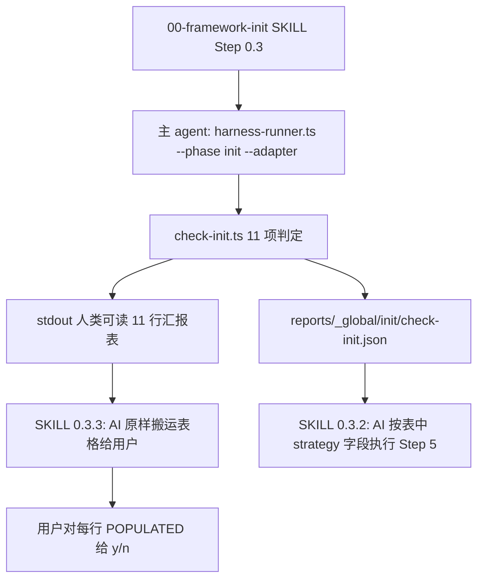

## 背景

内网用 Claude Code CLI + MX 2.5 跑 `framework init` UPDATE 时，弱模型在 `[CLAUDE.md](CLAUDE.md)` 这一项编造了"已与模板渲染结果一致，diff 无实质变更"，绕过了 [framework/skills/00-framework-init/SKILL.md](framework/skills/00-framework-init/SKILL.md) Step 0.3 体检 + Step 4.1 diff + 用户 `y` 的整套流程。根因是 **Step 0.3 体检表的"判定 EMPTY/POPULATED"和"渲染 0.3.3 汇报表"两步全靠 AI 自觉**，没有任何机器层守门——和其他六阶段都接入 `harness-runner.ts` 的设计哲学不一致，是 framework 当前唯一未受双 Harness 守门的元阶段盲区。

本次按 **L2+** 加固：脚本计算 + 接入 harness-runner（与 `catalog`/`glossary`/`docs` 三个全局阶段同型），但**不**接 `verify-init.md`、**不**给 init 接 Stop hook、**不**写 init 完成回执——这三件套在元阶段上语义不对称（hook 拦自己 / verifier 跑题 / 回执模板不匹配），强行套等于过度对称。

## 设计原则

1. **结构同型**：与 [framework/specs/phase-rules/docs-rules.yaml](framework/specs/phase-rules/docs-rules.yaml) + [framework/harness/scripts/check-docs.ts](framework/harness/scripts/check-docs.ts) 完全对称，用最熟的模式 land。
2. **判定确定性**：所有 MISSING/EMPTY/POPULATED 一律 hash 比对或确定性规则，AI 完全无自由度。
3. **双输出（用户选项 B）**：脚本同时产 JSON 报告（机器读）+ stdout 人类可读体检表格（直接是 SKILL 0.3.3 的 11 行汇报表），AI 只搬运不渲染。
4. **覆盖全 11 项（用户选项 B）**：不仅事故现场第 2/3 项，整张体检表都从脚本来。
5. **最小改动 SKILL.md**：surgical 改 Step 0.3 三节 + 第 6 节禁忌段加一条，不重构。

## 整体闭环



## 改造点清单

### A. 类型与 runner 注册

- [framework/harness/scripts/utils/types.ts](framework/harness/scripts/utils/types.ts)：`Phase` 加 `'init'`；`isGlobalPhase()` 加 init 判定。
- [framework/harness/harness-runner.ts](framework/harness/harness-runner.ts)：`VALID_PHASES` 第 73 行加 `'init'`；help 文案 87/88 行加 init；`collectContextFiles()` 给 init 一个最小上下文段（`framework.config.json` + 选定 adapter 的 `adapter.yaml`）。

### B. init-rules.yaml（与 docs-rules 同型）

新建 `framework/specs/phase-rules/init-rules.yaml`，参考 [docs-rules.yaml](framework/specs/phase-rules/docs-rules.yaml) 结构：

```yaml
phase: init
version: "1.0"
applies_to: "framework-init Skill 0.3 体检表 11 项产物"

structure_checks:
  adapter_yaml_resolvable: { severity: BLOCKER, ... }   # 选定 adapter 的 adapter.yaml 必须可解析
  template_files_resolvable: { severity: BLOCKER, ... } # adapter.yaml 声明的所有 template_path/template_dir 必须真实存在

inspection_checks:
  inspection_table_complete: { severity: BLOCKER, ... } # 11 行全部能给出 MISSING/EMPTY/POPULATED 判定
  diff_for_populated_provided: { severity: BLOCKER, ... } # 每行 POPULATED 必须附带 hash 对比 + diff 摘要
```

### C. check-init.ts 主脚本（核心，约 600 行）

新建 `framework/harness/scripts/check-init.ts`，分四块：

1. **入口**：解析 `--adapter <claude|cursor|generic>`（CREATE 模式必传，UPDATE 模式可从 `framework.config.json.agent_adapter` 读，二选一）+ `--mode <create|update>`（默认按 `framework.config.json` 是否存在自动判）。
2. **11 项 checker**（每项一个独立函数，便于单测）：

| # | 路径 | 判定逻辑 | 工具 |
|---|---|---|---|
| 1 | `framework.config.json` | 解析 + `architecture.outer_layers.length` | YAML/JSON |
| 2 | adapter `agent_entry_file.target_path` | 渲染 [framework/templates/AGENTS.md.template](framework/templates/AGENTS.md.template) 后 sha256 比对 | hash |
| 3 | adapter `templates/` 下逐文件（含 `commands/**` / `agents/**` / `settings_file` / `hooks/**`） | 逐文件 sha256 + 对 POPULATED 项跑 unified diff | hash + diff |
| 4 | `doc/architecture.md` | 渲染 [framework/templates/architecture.md.skeleton.md](framework/templates/architecture.md.skeleton.md) 后比对 | hash |
| 5 | `doc/module-catalog.yaml` | 解析 + `modules.length` | YAML |
| 6 | `doc/glossary.yaml` | 解析 + `terms.length` | YAML |
| 7 | `doc/glossary-seed.txt` | 字节比对 | hash |
| 8 | `doc/features/` | 目录扫描非空判定 | fs |
| 9 | `framework/harness/node_modules/ts-node/package.json` | `fs.existsSync`（**严格用 fs，避免 .gitignore 假阴**，对应上次 81d454c 的修） | fs |
| 10 | `framework.config.json.toolchain.devEcoStudio.installPath` | JSON 字段 + 路径 `fs.existsSync` | fs |
| 11 | `.gitignore` framework ignore patterns | 按 SKILL 5.4.5.1 的 canonical patterns 列表，逐条检查是否被显式列出或被更宽规则等价覆盖 | 文本解析 |

3. **双输出**：
   - JSON：`framework/harness/reports/_global/init/<timestamp>/check-init.json`，schema 详见下文。
   - stdout：直接打印 SKILL 0.3.3 的 11 行体检表（列：路径 / 状态 / 计划动作 / 简短诊断），AI 在 SKILL Step 0.3.3 原样搬运给用户。
4. **退出码**：BLOCKER 失败 → 1（如 adapter.yaml 解析失败、模板文件缺失）；其余 → 0（POPULATED 行的 y/n 决策由用户在 Skill 中给）。

JSON schema：

```typescript
interface CheckInitReport {
  schema_version: '1.0';
  mode: 'create' | 'update';
  adapter: 'claude' | 'cursor' | 'generic';
  inspections: Array<{
    index: number;                       // 1..11
    target_path: string;
    template_source: string | null;      // 第 2/3/4/7 项有值
    status: 'MISSING' | 'EMPTY' | 'POPULATED';
    hash_template: string | null;
    hash_target: string | null;
    diff_summary: string | null;         // POPULATED 项给前 50 行 unified diff
    planned_strategy: string;            // 命中 SKILL 0.3.2 哪一行的策略
  }>;
  blockers: string[];
  verdict: 'PASS' | 'FAIL';
}
```

### D. SKILL.md 改写（surgical，三处）

[framework/skills/00-framework-init/SKILL.md](framework/skills/00-framework-init/SKILL.md)：

1. **新增 Step 0.3.0「先决条件——必须先跑 check-init」**：

   > 进入 0.3.1 之前**必须**先在终端执行：
   >
   > `cd framework/harness && npx ts-node harness-runner.ts --phase init --adapter <已选定 adapter>`
   >
   > 拿到 stdout 的体检表 + JSON 报告路径后，才能进入 0.3.1。**严禁**跳过此步直接由 AI 描述判定结果。

2. **改写 Step 0.3.1**：表头加一句"本表 11 行的 `状态` 列必须从 `check-init.json` 的 `inspections[].status` 字段直接搬运"；不再保留 AI 自行描述判定逻辑的措辞。

3. **改写 Step 0.3.3**：去掉"AI 渲染表格"的措辞，改为"原样搬运 `check-init` 脚本 stdout 输出的表格给用户，**不得**增删行、不得改写诊断措辞"。

4. **第 6 节禁忌段加新条款**：

   > **init-diff Hallucination Ban（BLOCKER）**：framework-init Skill 中 Step 0.3 体检的 `MISSING/EMPTY/POPULATED` 判定与 `POPULATED` 项的 diff 摘要，**必须**来自 `check-init.ts` 的真实输出。AI 自行描述"已与模板一致"、"差异主要是项目特定内容"、"基于 DSL 已渲染" 等占位措辞 → 视为本次 init 失败，必须立即重跑脚本并以脚本输出为准。

### E. 端到端验证

1. 在当前实例工程跑：`cd framework/harness && npx ts-node harness-runner.ts --phase init --adapter claude`，预期得到 11 行表 + JSON 报告。
2. 把脚本输出的判定与上次 `a234ca7` commit 当时人工跑出的体检结果对照，验证一致（**正向**：第 9/11 项 POPULATED；第 1/2 项 POPULATED 但 hash 一致；第 8 项 POPULATED 等）。
3. 跑 `npm test` 全套回归，要求与上次 81d454c 的 42/42 PASS 持平或更高。

### F. 单测（最小 fixture）

新建 `framework/harness/tests/check-init.test.ts`，用 [framework/harness/tests/utils/fixture-runner.ts](framework/harness/tests/utils/fixture-runner.ts) 的 fixture 模式，**仅覆盖最关键的两条事故路径**：

- fixture 1：`adapter_entry_with_drift`——`CLAUDE.md` 与渲染后模板有真实 diff，期望 status=`POPULATED` + diff_summary 非空。
- fixture 2：`commands_dir_byte_equal`——`.claude/commands/coding.md` 与模板字节一致，期望 status=`EMPTY`。

不做 11 项全 fixture 组合爆炸，单测只守事故现场，其他项通过 E 步端到端验证兜底。

## 不在本 plan 范围

- **不**新增 `verify-init.md` 与 verifier 子 agent（init 阶段 AI 语义审无可审）。
- **不**给 init 接 Stop hook（避免 hook 拦自己安装的循环依赖）。
- **不**写 init 完成回执模板（init 无 feature 维度，回执模板不匹配）。
- **不**改造 Step 5（写入步骤）的内部逻辑——本 plan 只硬化 Step 0.3 体检阶段。
- **不**做 cursor / generic adapter 的 hooks 实现（与本 plan 正交）。

## 风险与开放点

- **第 11 项 .gitignore 等价覆盖**：SKILL 5.4.5.1 列了一组 canonical pattern，但用户的 `.gitignore` 可能用 `framework/harness/state/` 或 `framework/harness/state/**` 等等价宽规则覆盖了 `framework/harness/state/*`。脚本要做"被宽规则等价覆盖"判定，不能简单字符串匹配。**初版可只检查"是否存在某条规则文本完全匹配"**，等价覆盖判定列为 v2，这种情况脚本报 MISSING 但用户在 SKILL Step 5.4.5 可手工判断为已覆盖跳过——风险可接受。
- **第 2 项渲染**：`AGENTS.md.template` 含 `{{PROJECT_NAME}}` / `{{ARCHITECTURE_SUMMARY}}` 等占位符，渲染逻辑要从 `framework.config.json` 取值。CREATE 模式下 `framework.config.json` 还没有，渲染不出来——此时第 2 项一律按 MISSING 处理（与 SKILL 0.3.2 第 2 行 MISSING 动作一致），不强求渲染。
- **CREATE 模式 adapter 来源**：CREATE 模式 `framework.config.json` 还没有，必须由 `--adapter` 命令行参数显式传入；SKILL Step 0.2.5 已经强制要求 adapter 选定后才能进 0.3，所以这个前提天然成立。在 SKILL 0.3.0 文案里要明示"`<已选定 adapter>` 必须填具体值"。
