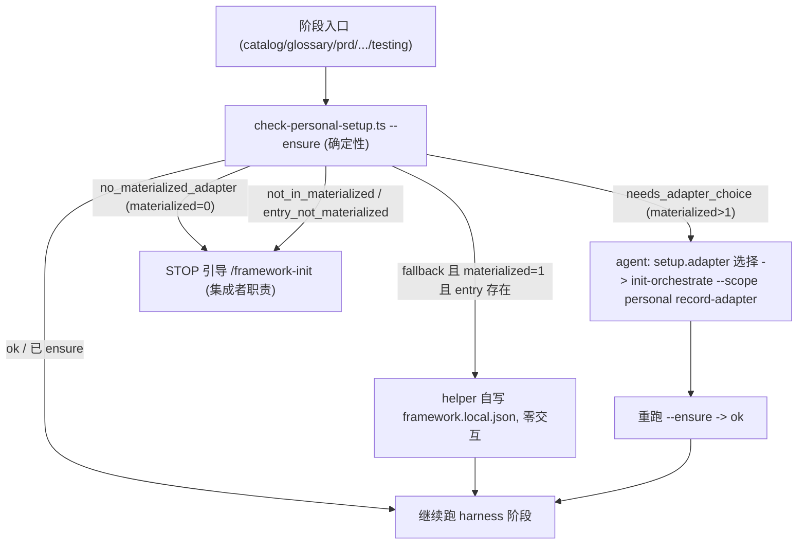

# Framework Setup 收敛为统一前置环境检查

## 背景与目标

上一轮编排化重构产出了独立的 `framework-setup` 入口（Claude slash 命令 + Cursor/Generic 的 `00b-framework-setup` skills-bridge 跳板）。问题：它对普通用户单独呈现易造成误解。核心诉求——除少数做 framework-init 的同事外，绝大部分人使用尽可能简单。

决策（已确认）：

- 保留 `skills/00b-framework-setup/SKILL.md` 作为**内部过程文档**，但下线其所有"命令/技能"对外暴露面（Claude slash + skills-bridge 跳板）。
- 个人 setup 行为收敛为**所有阶段（含 catalog/glossary）统一的前置环境检查**：检测缺失时由阶段入口**内联**完成，而非引导用户去跑独立命令。
- harness-runner 硬门控 `personalSetupExemptPhases` 仅豁免 `init` / `docs`（catalog/glossary 纳入）。

## 关键流程（内联前置门控）

确定性优先：阶段入口先跑 `check-personal-setup.ts --ensure`（确定性 helper，能在单一 adapter 时自写 local），只有"多 adapter 需选择"这一种情况才回落给 agent 做 `setup.adapter` 交互。

分支语义：

- `fallback` + 单一物化 adapter + 入口已物化 → helper **确定性自写** local（绝大部分人零交互）。
- `fallback` + 多 adapter → helper 返回 `needs_adapter_choice`，仅此情况 agent 走 `setup.adapter` 交互，选择再交确定性 `record-adapter` 写盘（agent 不手写 JSON）。
- `no_materialized_adapter`（`materialized_adapters` 为空）→ 项目尚未物化任何 adapter，停下引导 `/framework-init` 先物化。
- `not_in_materialized` / `entry_not_materialized` → 项目级 init 缺口，停下引导 `/framework-init`。

## 工作项

### 1. OpenSpec 变更提案（先行）

- 在 `openspec/changes/framework-setup-prephase-gate/` 建 `proposal.md` / `design.md` / `tasks.md` 与 specs 增量：
  - `harness-gates`：门控覆盖 catalog/glossary，仅豁免 init/docs；`init-orchestrate` 内部 `run-global-phases` 可通过 `HARNESS_INIT_INTERNAL_GLOBAL_RUN=1` 豁免 personal gate，且该豁免不得用于普通阶段入口。
  - `agent-adapters`：移除 framework-setup slash 与 `00b-framework-setup` 跳板；个人 setup 不再有独立入口。
  - `framework-local-config`（或新 capability）：个人 setup 改为阶段入口内联，单一物化 adapter 时自动记录。
- `npm run openspec:validate` strict PASS。

### 2. 下线对外暴露面

- 删除 `[agents/claude/templates/commands/framework-setup.md](agents/claude/templates/commands/framework-setup.md)`。
- `[check-skills-confirmation-ux.ts](harness/scripts/check-skills-confirmation-ux.ts)` 第 30 行 `CLAUDE_SLASH_COMMANDS` 移除 `commands/framework-setup.md`（否则 `claude_slash_missing` BLOCKER）。
- 删除 `agents/shared/agent-bundle/templates/skills-bridge/00b-framework-setup/` 整个目录（Cursor/Generic 不再物化该跳板）。
- `[agent-bundle-paths.ts](harness/scripts/utils/agent-bundle-paths.ts)` 第 32-33 行从 `BUILTIN_SKILL_BRIDGE_DESCRIPTIONS` 移除 `00b-framework-setup`。
- 更新 adapter.yaml notes：`[claude/adapter.yaml](agents/claude/adapter.yaml)` 第 64-65 行（10→9 份模板，去掉 00b）；`[cursor/adapter.yaml](agents/cursor/adapter.yaml)` 第 34-36 行；`[generic/adapter.yaml](agents/generic/adapter.yaml)` 第 32-33 行。
- 更新 `[generic-bundle.unit.test.ts](harness/tests/unit/generic-bundle.unit.test.ts)`：去掉 00b 断言（行 69、90-92、177），inline/材化计数 `>= 9` → `>= 8`，`loadReservedBridgeIds` 不再含 00b。

### 3. 内部过程文档（保留 00b 但去命令语义）

- `[skills/00b-framework-setup/SKILL.md](skills/00b-framework-setup/SKILL.md)`：删除"触发条件"中的 Slash `/framework-setup`，改述为"由阶段前置门控内联调用"；保留 S1-S3 探测/批准/摘要与硬约束（仍只写 `framework.local.json`）。
- `[skills/reference/personal-setup-gate.md](skills/reference/personal-setup-gate.md)` 升级为 SSOT 前置门控过程：阶段入口先跑 `check-personal-setup.ts --ensure`；按返回信号分支（`ok`/自动 ensured 直接继续；`needs_adapter_choice` 走 `setup.adapter` 交互；`not_in_materialized`/`entry_not_materialized` 引导 `/framework-init`）。明确"写盘只由确定性 helper/`record-adapter` 完成，agent 不手写 local"。

### 4. 阶段入口统一引用门控

- 6 个 feature 阶段：`[skills/1-prd-design/SKILL.md](skills/1-prd-design/SKILL.md)` ~ `[skills/6-device-testing/SKILL.md](skills/6-device-testing/SKILL.md)`、对应 Claude commands（prd-design/requirement-design/coding/code-review/business-ut/device-testing）、对应 `agents/shared/agent-bundle/templates/skills-bridge/{1..6}/SKILL.md`：将"exit 1 → 引导 `/framework-setup`"改为"按 personal-setup-gate 内联完成个人 setup 后继续"。
- 新增 catalog/glossary 门控引用：`[agents/claude/templates/commands/catalog-bootstrap.md](agents/claude/templates/commands/catalog-bootstrap.md)`、`glossary-bootstrap.md`、`skills/0-catalog-bootstrap/SKILL.md`、`skills-bridge/0-catalog-bootstrap/SKILL.md` 增加前置门控段（这两阶段此前无个人 setup 引用）。

### 5. 确定性门控 helper（核心：避免弱模型手写 local）

- 扩展 `[check-personal-setup.ts](harness/scripts/check-personal-setup.ts)` 增加 `--ensure` 模式（或新增 `scripts/personal-setup-ensure.ts`，复用 `evaluatePersonalSetupGate` + executor 的 `writeLocalConfig`/`mergeLocal`）：
  - `ok` → exit 0。
  - `fallback` 且 `materialized_adapters.length === 1` 且该 adapter 入口已物化 → **确定性自写** `framework.local.json`（`agent_adapter = 该项`），exit 0；stdout 标注 `ensured=auto_single_adapter`。
  - `fallback` 且 `materialized_adapters.length > 1` → 不写盘，输出机器可读信号 `needs_adapter_choice`（含候选列表）+ exit 非 0；agent 据此走 `setup.adapter`，选择交 `init-orchestrate.ts --scope personal`（`record-adapter` 确定性写盘）。
  - `fallback` 且 `materialized_adapters.length === 0` → 不写盘，输出 `code=no_materialized_adapter`，exit 非 0，引导 `/framework-init` 先物化 adapter。
  - `not_in_materialized` / `entry_not_materialized` → 现有引导 `/framework-init`。
- `--json --ensure` 输出稳定 JSON：`{ ok, code, status, activeAdapter, materializedAdapters, ensured, candidates, message }`；阶段入口与测试只解析该 JSON，不依赖人读 stdout。
- 复用而非另起逻辑：写盘统一走 executor `record-adapter` 同款 `writeLocalConfig` + `clearFrameworkConfigCache`，保证与 init 路径一致。

### 6. harness 硬门控对齐 + init 内部路径豁免

- `[harness-runner.ts](harness/harness-runner.ts)` 第 276 行 `personalSetupExemptPhases` 由 `['init','docs','catalog','glossary']` 改为 `['init','docs']`；门控失败提示（278-285 行）去掉"执行 framework-setup 命令"措辞，改指 personal-setup-gate 过程。
- **init 内部 run-global-phases 豁免**：`[init-task-executor.ts](harness/scripts/utils/init-task-executor.ts)` 第 199-214 行 `runGlobalPhases` 的 `spawnSync` 注入环境变量（如 `HARNESS_INIT_INTERNAL_GLOBAL_RUN=1`）；`harness-runner.ts` 门控段在该变量置位时跳过 personal gate（这是集成者 init 自验，非团队成员 feature 流）。否则 catalog/glossary 退出豁免后，刚 init 完（local 仍 fallback）会被自身门控拦死。
- `[personal-setup-gate.ts](harness/scripts/utils/personal-setup-gate.ts)` `formatPersonalSetupGateStderr`（119-125 行）措辞同步：fallback 由阶段入口内联完成，非 fallback 引导 `/framework-init`。

### 7. 残留 /framework-setup 引用清理（init 场景重点）

- `[check-init.ts](harness/scripts/check-init.ts)` 第 1014 行体检策略矩阵 `personal /framework-setup（setup.deveco_path）` → 改为"阶段前置门控内联完成 / 单一 adapter 自动记录"。这是 init 场景最易再次暴露给用户处。
- `[agents/claude/templates/commands/framework-init.md](agents/claude/templates/commands/framework-init.md)` 第 13 行将"个人 active adapter 与 DevEco 走 `/framework-setup`"改为"由阶段前置门控内联完成"。
- 三个 adapter 的 interaction-renderer：`[claude/.../interaction-renderer.md](agents/claude/templates/rules/interaction-renderer.md)` 第 53 行、`cursor/templates/rules/interaction-renderer.mdc`、`generic/templates/rules/interaction-renderer.md` 的"与 slash 的关系"段去掉 `/framework-setup`。
- 排查并改写 `skills/00-framework-init/SKILL.md`、`skills/00-framework-init/prompts/adapter-selection.md`、`skills/00-framework-init/templates/adapter-widget-options.md` 中的 `/framework-setup` 字样。

### 8. 文档与回归（含补测）

- 同步措辞：`MIGRATION.md`、`agents/README.md`、`docs/operations/release-checklist.md`、`skills/README.md`、`profiles/**/00-framework-init/profile-addendum.md` 中对 `/framework-setup` 的引用。
- **补测**（不止改断言；统一解析 `--json --ensure` 稳定 JSON）：在 `[personal-setup-gate.unit.test.ts](harness/tests/unit/personal-setup-gate.unit.test.ts)`（或新增 ensure 专测）补：
  - `fallback` + 单一 materialized + 入口存在 → `--ensure` 自写 `framework.local.json`（`ensured=auto_single_adapter`）且二次 gate 通过；
  - `fallback` + 多 adapter → `code=needs_adapter_choice`、**不写盘**、`candidates` 含全部已物化项；
  - `fallback` + `materialized_adapters.length === 0` → `code=no_materialized_adapter`、**不写盘**、引导 `/framework-init`；
  - init-internal 豁免：`HARNESS_INIT_INTERNAL_GLOBAL_RUN=1` 时 catalog/glossary 跳过 gate。
- 在 `[run-unit.ts](harness/tests/run-unit.ts)` 注册新测套件（若新建文件）。
- `cd harness && npm test` 全 PASS；`npm run openspec:validate` strict PASS。

## 风险与对策

- **init 自验被自身门控拦截**：run-global-phases 是 init 内部跑 catalog/glossary；必须用 `HARNESS_INIT_INTERNAL_GLOBAL_RUN` 豁免，否则集成者 init 直接失败（review 硬点 1）。
- **自动记录落回弱模型手写**：单一 adapter 自动记录必须是确定性 CLI（`--ensure`），不能只写在 Skill 文档（review 硬点 2）。多 adapter 选择也只把 enum 交给确定性 `record-adapter`，agent 不拼 JSON。
- **残留引用再暴露**：check-init 策略矩阵 / framework-init 命令 / interaction-renderer 仍写 `/framework-setup`，是 init 场景再暴露点，须一并清（review 硬点 3）。
- **lint/测试与暴露面强耦合**：CLAUDE_SLASH_COMMANDS 与 generic-bundle 断言必须与删除同批改，否则 docs/harness 阶段 BLOCKER。
- **registry `setup.*` 仍被引用**：保留 `setup.adapter`/`setup.deveco_path`（内联交互仍用），仅去掉命令/跳板暴露；`registry_skill_path` 因 00b skill 目录保留而不报错。

