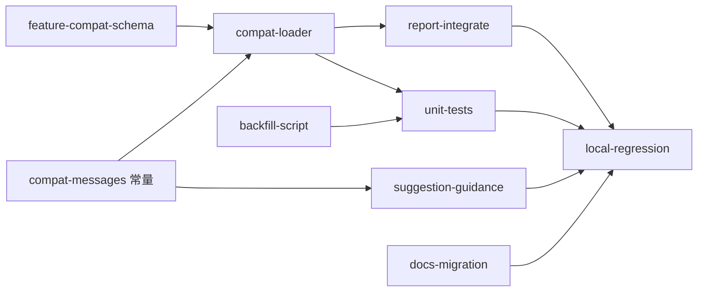

# 框架升级兼容协议（compat）+ context-exploration 回填

## 关键设计原则（与上轮讨论的收敛）

1. **永久态 vs 过程态分层**：`framework.config.json` 是**框架级永久档案**（项目装上即用、版本对齐用），不承载任何**具体 feature 的过程态信息**（包括 feature 名、状态、豁免）。
2. **feature 状态归 feature 目录**：feature 的全部产物（PRD.md、design.md、acceptance.yaml、contracts.yaml、…）已经统一归档在 `doc/features/<feature>/`；compat 状态作为该 feature 的过程态，**自然属于该目录**（`doc/features/<feature>/compat.yaml`），跟随 feature 改名/删除/归档一起走。
3. **决策延后到撞墙时**：用户在 Skill 00 init/UPDATE 阶段不需要也不应该决定「哪些 feature 走 compat」——init 阶段不读 features 下任何内容。只有当用户**主动**重启某个 feature × phase 跑 harness 撞 BLOCKER 时，报告里才出现双路径引导。
4. **Skill 00 完全零接触**：不出 schema diff、不出公告、不出建议、不修改 framework.config.json。

## 背景与触发场景

- [framework/harness/scripts/utils/context-exploration.ts](framework/harness/scripts/utils/context-exploration.ts) 当前**无任何逃生阀**：缺文件即返回 `severity: BLOCKER, status: FAIL`。
- 5 个 checker 均直接调用 `checkContextExplorationArtifact(...)`：`check-prd / check-design / check-coding / check-review / check-ut`。
- [framework/MIGRATION.md](framework/MIGRATION.md) 的 v2.5 仅写「framework 自身升级」，没有「在途/已完成 feature 怎么过渡」的协议。
- 本次方案为**通用 compat 协议**：所有 feature × phase 的 BLOCKER 都可走同一套兼容协议，而非只解 context-exploration 一处。

## 一、配置层：feature 局部 `compat.yaml`（**framework.config.json 完全不动**）

### 1.1 文件位置与约定文件名

- 路径：`**doc/features/<feature>/compat.yaml`**（与 `PRD.md` / `acceptance.yaml` / `design.md` 同级；feature 目录本就是该 feature 全部档案）。
- 文件名 `compat.yaml` 为**框架级约定**（参照 PRD.md、acceptance.yaml 也是约定名），不再开放可配置——保持简单、避免又多一个 paths 项被改。
- 不存在视为「未启用 compat」（默认行为）；存在则按本协议解析。

### 1.2 文件内容（feature 局部 schema）

```yaml
# doc/features/<feature>/compat.yaml
schema_version: "1.0"
feature: home-page            # 必须与所在目录名一致（防笔误 / 防误拷）
since_framework_version: "<= 2.4"   # 可选：审计用，表明 feature 在哪个 framework 版本之前完成 / 在途
exempt_checks:                # 允许豁免的 check id；支持完整 id 与通配符前缀（context_exploration_*）
  - context_exploration_*
reason: "feature 在 Context Exploration Gate 引入前已完成 design，回填进行中"
scheduled_backfill_by: "2026-08-01"  # ISO date；超期协议自动失效，恢复原 BLOCKER
phases:                        # 可选；缺省 = 该 feature 全部 phase
  - prd
  - design
```

### 1.3 新增 [framework/specs/feature-compat.schema.yaml](framework/specs/feature-compat.schema.yaml)

- 与 `framework.config.schema.json` 平级、独立的 schema 文件。
- 校验 `doc/features/<feature>/compat.yaml` 的结构（必填字段、类型、`scheduled_backfill_by` 格式）。
- 这是 **framework 协议的演进**，但**与 framework.config.json 解耦**：
  - 不需要升 `framework.config.schema.json` 的 `schema_version`
  - 不需要改 [framework/templates/framework.config.template.json](framework/templates/framework.config.template.json)
  - 不需要改 [framework/harness/config.ts](framework/harness/config.ts) 中的 framework.config 解析逻辑
  - Skill 00 完全感知不到本协议存在

### 1.4 [framework/harness/config.ts](framework/harness/config.ts) 只加一个 helper

仅追加一个无副作用的纯计算 helper（不动现有 loader）：

```ts
export function featureCompatPath(projectRoot: string, feature: string): string {
  return path.join(projectRoot, paths(projectRoot).features_dir, feature, 'compat.yaml');
}
```

> 设计意图：framework 文件保持装上即用的常量；feature 过程态跟随 feature 走，删 feature 时 compat 自动消失。

## 二、Harness 层：`compat-loader.ts` + 统一降级点

### 2.1 新文件 [framework/harness/compat-loader.ts](framework/harness/compat-loader.ts)

导出：

- `loadFeatureCompat(projectRoot, feature)`：
  - 调用 `featureCompatPath` 拼路径；
  - 不存在 → 返回 `{ enabled: false }`（默认严格态）；
  - 存在 → YAML 解析 + 按 `feature-compat.schema.yaml` 校验 + 检查 `scheduled_backfill_by` 是否过期；
  - 校验失败 → advisory 不阻塞，返回 `{ enabled: false, parseError }`。
- `applyCompatDowngrade(results: CheckResult[], ctx: { feature, phase, projectRoot })`：
  - 内部按需懒加载 `loadFeatureCompat`；
  - 仅对 `severity === 'BLOCKER' && status === 'FAIL'` 的项判定；
  - id 命中 `exempt_checks`（含通配符）且 phase 未限定或匹配 → 降级为 `severity: 'ADVISORY', status: 'WARN'`，`details` 追加 `[compat_downgraded by doc/features/<feature>/compat.yaml]` 标记；
  - 命中但 `scheduled_backfill_by` 已过 → 不降级，**额外**插入一条 `compat_expired` BLOCKER 告知协议过期，提示要么回填要么更新期限。

### 2.2 统一接入点

不修改 5 个 checker，**在 [framework/harness/scripts/utils/report-generator.ts](framework/harness/scripts/utils/report-generator.ts) 的 `generateScriptReport` 装配阶段**集中应用 `applyCompatDowngrade`：

- 在合并各 PhaseChecker 输出后、计算 verdict 前过一遍；
- 在最终报告里增加 `compat_applied` 与 `compat_expired` 两个聚合段（数量、命中 check id 列表、对应 feature/phase），便于审计与未来 CI 抓取；
- 全局阶段（init/catalog/glossary/docs/extensions，feature=_global）不应用降级。

> 这样未来任何新增 BLOCKER 都自动享受 compat 协议，无需逐个 checker 改。

## 三、回填脚本：`backfill-context-exploration.ts`

新文件 [framework/harness/scripts/backfill-context-exploration.ts](framework/harness/scripts/backfill-context-exploration.ts)：

- CLI：`--feature <name> --phases prd,design,coding,review,ut [--dry-run] [--overwrite]`
- 行为：
  1. 解析 `paths.features_dir`、`receipt_dir_pattern` → 目标 `doc/features/<feature>/<phase>/context-exploration.md`。
  2. 若已存在且无 `--overwrite` → 跳过并提示。
  3. 自动扫描该 feature 下已有的 `PRD.md / design.md / contracts.yaml / acceptance.yaml / review-report.md / ut/mock-plan.yaml / ut/testability-audit.md` 等，按存在情况填 `key_inputs_read`。
  4. 自动追加项目级 SSOT（`paths.glossary` / `paths.module_catalog` / `paths.architecture_md`、`framework.config.json`）以满足 `PHASE_INPUT_SUBSTRINGS[phase]` 的子串匹配。
  5. frontmatter：`schema_version: "1.0.0"`、`feature`、`phase`、`ready_to_produce: true`、`has_blocker_coverage_risk: false`、`subagents_used: not_available`、额外 `legacy_backfill: true` + `legacy_backfill_at: <ISO>`（不影响 checker，仅留痕）。
  6. body 部分用 [framework/harness/templates/context-exploration.md](framework/harness/templates/context-exploration.md) 的最小骨架。
  7. 回填成功后**提示用户**：若该 feature 之前用 `compat.yaml` 临时豁免，请考虑删除 `doc/features/<feature>/compat.yaml`（脚本不替用户删）。
- npm script（仅在 [framework/harness/package.json](framework/harness/package.json) 加一条）：
  - `"backfill:context": "ts-node scripts/backfill-context-exploration.ts"`

## 四、撞墙时引导（feature × phase harness 报告承担）

**所有 feature 级感知集中在「跑 feature × phase harness 撞 BLOCKER」那一刻。Skill 00 完全零接触。**

- 在 [framework/harness/scripts/utils/context-exploration.ts](framework/harness/scripts/utils/context-exploration.ts) 的「缺文件」分支 `suggestion` 字段里补一段双路径引导文案（统一字符串常量，便于维护）：
  - **路径 A（推荐）**：跑回填脚本一键生成 stub —— 给出完整命令：
    ```
    cd framework/harness && npm run backfill:context -- --feature <name> --phases <phase>
    ```
  - **路径 B（临时）**：在 **feature 自己的目录**写 `compat.yaml` —— 给出最小 YAML 片段示例（**明确指向 `doc/features/<name>/compat.yaml`，不是 framework.config.json**）与 `scheduled_backfill_by` 期限要求。
- 在 `applyCompatDowngrade` 输出 `compat_applied` 时，于该聚合段附加同一份引导文案的「回填后请记得删除 `doc/features/<name>/compat.yaml`」版本；输出 `compat_expired` 时也附加「协议已过期，必须立即回填或更新期限」的版本。

> 设计意图：用户上下文清晰时（已知 feature 名、phase 名）才出现指引；与 Skill 00 完全解耦；framework.config.json 始终不被牵涉。

## 五、单元测试

新增 `framework/harness/tests/unit/`：

- `compat-loader.unit.test.ts`：
  - 合法 feature compat 解析；
  - 通配符 `context_exploration_`* 匹配；
  - `scheduled_backfill_by` 过期 → 不降级 + 注入 `compat_expired`；
  - feature 目录无 `compat.yaml` → 输入原样返回；
  - YAML 解析失败 → advisory，不阻塞，输入原样返回；
  - phase 限定生效；
  - feature_mismatch（compat.yaml 中 feature 字段 ≠ 所在目录）→ 不降级 + advisory。
- 在 `tests/unit/run-unit.ts` 注册。
- 复用现有 fixture 风格再加 1 个：`ext_compat_legacy_pass`（feature 目录带合规 `compat.yaml`、缺 `context-exploration.md`，但 compat 命中后降级，verdict=PASS），保证集成层也有覆盖。

## 六、文档

- [framework/MIGRATION.md](framework/MIGRATION.md) 新增 `v2.6：框架升级兼容协议（compat）+ context-exploration 回填` 节：
  - 强调「**framework.config.json 不承载任何 feature 名**」原则；
  - 给出 `doc/features/<feature>/compat.yaml` 示例与 `scheduled_backfill_by` 期限要求；
  - 给出回填脚本命令；
  - 说明 framework.config.json **没有任何升级动作**（这一点对升级者很关键，免得他去找 schema diff）。
- [framework/README.md](framework/README.md) 在「阶段化工作流」附近加一段「框架升级兼容协议」入口链接。
- 新增 [framework/docs/evolution/compat-protocol-v1.md](framework/docs/evolution/compat-protocol-v1.md)：协议设计、降级与过期算法、为什么落在 feature 目录而非 framework.config.json、与 lifecycle/extension 体系的边界。
- [framework/docs/DOC_INVENTORY.yaml](framework/docs/DOC_INVENTORY.yaml) 登记新增文档。

## 七、本地回归（plan 执行后，不动 git）

按之前确认的顺序执行：

- `cd framework/harness && npm test`（新增单元 + 1 个 fixture）。
- `npx tsc --noEmit -p tsconfig.json`。
- **正向路径**：在 `doc/features/home-page/` 下手写一份 `compat.yaml`（exempt_checks: `context_exploration_`*、scheduled_backfill_by: 2026-08-01），跑 `npx ts-node harness-runner.ts --phase prd --feature home-page` 期望 verdict=PASS，报告含 `compat_applied`。
- **回填路径**：跑 `npm run backfill:context -- --feature home-page --phases prd,design,coding,review,ut`，删除 `doc/features/home-page/compat.yaml`，再跑 prd/design 等 phase 期望直接 PASS。
- **零接触验证**：
  - `git status` 验证 `framework.config.json` **未被修改**；
  - `--phase init --adapter claude` 复跑：体检表里**不**应出现任何 compat 相关条目；
  - `framework.config.json` 的 `schema_version` 仍为 `1.1`，不变。

## 八、与现有体系的边界

- 仅作用于 **BLOCKER 降级**，不改业务规则、不改 phase-rules.yaml；本质是「在校验链尾过一次过滤器」。
- 与 lifecycle hooks / extensions 协议正交：hooks 仍按原样派发；compat 只影响最终 CheckResult。
- 与 catalog/glossary 等全局 phase 无关（它们不属于 feature 维度，本协议作用域是 feature × phase）。
- 与 `framework.config.json` 解耦：不读、不写、不升 schema、不动模板。

## 风险与回退

- 风险：用户把 compat 当作长期豁免，永不回填。对策：`scheduled_backfill_by` 强制日期 + 过期自动失效 + 报告里始终列出 `compat_applied` 列表 + 回填脚本主动提示删除 compat.yaml。
- 风险：弱模型撞墙时把 compat 写到 framework.config.json（违反第 1 节原则）。对策：suggestion 文案显式指出文件路径 `doc/features/<name>/compat.yaml` 且**不**给 framework.config.json 的示例；`compat-loader` **不**读 framework.config.json，写错位置的内容**根本不会生效**——自我纠错。
- 回退：删除 feature 目录下 `compat.yaml` 即可，所有逻辑无副作用；framework 维度本就没有任何改动可回退。

---

# 附录 A：接口契约（不允许偏离）

## A.1 `framework/specs/feature-compat.schema.yaml` 字段约束


| 字段                        | 类型       | 必填  | 约束                                                                                                 |
| ------------------------- | -------- | --- | -------------------------------------------------------------------------------------------------- |
| `schema_version`          | string   | 是   | 固定 `"1.0"`；其他值 → `compat_invalid_schema_version` advisory，视为 disabled                              |
| `feature`                 | string   | 是   | 必须与 `path.basename(dirname(compat.yaml))` 完全相等；不等 → `compat_feature_mismatch` advisory，视为 disabled |
| `since_framework_version` | string   | 否   | 自由字符串，仅审计用，不参与匹配                                                                                   |
| `exempt_checks`           | string[] | 是   | 至少 1 项；每项为完整 check id 或以 `*` 结尾的前缀通配（仅后缀通配）                                                        |
| `reason`                  | string   | 是   | 非空，trim 后长度 > 0                                                                                    |
| `scheduled_backfill_by`   | string   | 是   | ISO date（YYYY-MM-DD 或 ISO 8601）；`Date.parse` 解析失败 → `compat_invalid_date` advisory，视为 disabled     |
| `phases`                  | string[] | 否   | 缺省 = 全部 feature phase；非缺省时每项须 ∈ `{prd, design, coding, review, ut}`，否则 advisory                    |


任何 advisory 触发 → **视为 compat disabled**，即不降级、原 BLOCKER 保留；但 advisory 本身**不阻塞** harness 主链（不增加新 BLOCKER），它只是一条 WARN 级 CheckResult，提示用户修 compat.yaml。

## A.2 `framework/harness/compat-loader.ts` 导出签名（TypeScript）

```ts
import { CheckResult, Phase } from './scripts/utils/types';

export interface FeatureCompat {
  schema_version: '1.0';
  feature: string;
  since_framework_version?: string;
  exempt_checks: string[];
  reason: string;
  scheduled_backfill_by: string; // ISO date
  phases?: Phase[];
}

export interface LoadedCompat {
  enabled: boolean;
  data?: FeatureCompat;
  expired?: boolean;        // scheduled_backfill_by < now (UTC)
  parseAdvisory?: CheckResult; // 校验失败时填入；调用方应附加到结果里
}

export function loadFeatureCompat(
  projectRoot: string,
  feature: string,
): LoadedCompat;

export interface CompatDowngradeCtx {
  feature: string;
  phase: Phase;
  projectRoot: string;
}

export interface CompatDowngradeStats {
  appliedIds: string[];   // 被降级的原 check id 列表
  expiredFired: boolean;  // 是否触发 compat_expired
}

export function applyCompatDowngrade(
  results: CheckResult[],
  ctx: CompatDowngradeCtx,
): { results: CheckResult[]; stats: CompatDowngradeStats };
```

**约束**：

- `applyCompatDowngrade` 对**全局阶段**（feature === '_global' 或 phase ∈ {init, catalog, glossary, docs, extensions}）必须**短路**：直接返回原 results，stats 全空。
- 降级后的 CheckResult 必须保留原 id、原 description、原 affected_files；只改 `severity: 'ADVISORY'` + `status: 'WARN'`，并在 `details` 末尾追加常量 `\n[compat_downgraded by doc/features/<feature>/compat.yaml]`。
- 过期分支：**不**降级；额外向 results 数组**追加**一条新 CheckResult：

```ts
{
  id: 'compat_expired',
  category: 'structure',
  description: 'compat.yaml 已过 scheduled_backfill_by，协议自动失效',
  severity: 'BLOCKER',
  status: 'FAIL',
  details: `doc/features/${feature}/compat.yaml: scheduled_backfill_by=${date} 已过期`,
  suggestion: SUGGESTION_COMPAT_EXPIRED, // 见附录 B
  affected_files: [`doc/features/${feature}/compat.yaml`],
}
```

## A.3 `backfill-context-exploration.ts` CLI 契约

- 必填：`--feature <name>` 与 `--phases <逗号分隔列表>`
- 可选：`--dry-run`（不写文件，仅打印将写入的内容） / `--overwrite`（覆盖已存在的 context-exploration.md）
- 退出码：
  - `0`：所有 phase 成功写入（或 dry-run 完成）
  - `2`：参数错误（feature 不存在、phases 非法、paths 无法解析）
  - `3`：至少一个目标文件已存在且未给 `--overwrite`（部分跳过；其余仍写入并最终 exit 3，stdout 列出跳过项）
- 必须产出：每个 phase 一份 frontmatter 合规的 `context-exploration.md`，且该文件单独跑 `checkContextExplorationArtifact(projectRoot, feature, phase)` 必须返回 **0 个 FAIL**（这是验收硬性条件，见附录 C.5）。

---

# 附录 B：错误文案与 suggestion 模板字符串（固化）

子 AI 实现时**必须使用以下常量字符串**（可放在 `framework/harness/compat-messages.ts` 集中导出），不许自行改写措辞、加 emoji、加营销话术。模板里 `{feature}` / `{phase}` 用 `String.replace` 替换。

```ts
// framework/harness/compat-messages.ts
export const SUGGESTION_CONTEXT_EXPLORATION_MISSING = [
  '两种解决路径任选其一：',
  '',
  '路径 A（推荐，正规化）：自动回填生成合规 context-exploration.md。',
  '  cd framework/harness && npm run backfill:context -- --feature {feature} --phases {phase}',
  '',
  '路径 B（临时，仅供过渡）：在 feature 自身目录写 compat.yaml 临时豁免。',
  '  路径：doc/features/{feature}/compat.yaml',
  '  最小示例：',
  '    schema_version: "1.0"',
  '    feature: {feature}',
  '    exempt_checks: ["context_exploration_*"]',
  '    reason: "<填写过渡原因>"',
  '    scheduled_backfill_by: "<YYYY-MM-DD，建议不超过 30 天>"',
  '  注意：',
  '    - compat.yaml 是 feature 过程态数据，请勿写入 framework.config.json。',
  '    - 过期后协议自动失效，请按期回填或更新期限。',
].join('\n');

export const SUGGESTION_COMPAT_APPLIED = [
  '本次 BLOCKER 已被 doc/features/{feature}/compat.yaml 降级为 WARN。',
  '回填完成后，请手动删除该 compat.yaml 文件以恢复严格门禁。',
  '回填命令：cd framework/harness && npm run backfill:context -- --feature {feature} --phases {phase}',
].join('\n');

export const SUGGESTION_COMPAT_EXPIRED = [
  'doc/features/{feature}/compat.yaml 的 scheduled_backfill_by 已过期，协议自动失效。',
  '必须立即二选一：',
  '  1. 跑回填脚本：cd framework/harness && npm run backfill:context -- --feature {feature} --phases {phase}',
  '  2. 更新 compat.yaml 的 scheduled_backfill_by（如延期，需补充 reason）。',
].join('\n');
```

`context-exploration.ts` 的「缺文件」分支 `suggestion` 字段，**必须**用 `SUGGESTION_CONTEXT_EXPLORATION_MISSING.replace('{feature}', feature).replace('{phase}', phase)` 等价替换，不许另起炉灶。

---

# 附录 C：每个 todo 的完成定义（DoD）与验证命令

> 子 AI 完成每个 todo 后，必须按下列方式自行验证。**未通过验证不得标记 done。**

## C.1 `feature-compat-schema`

**完成定义**：

- 新文件 `framework/specs/feature-compat.schema.yaml` 存在，包含附录 A.1 的全部字段定义（YAML 注释里抄录附录 A.1 的约束表）。
- `framework/harness/config.ts` 新增 `featureCompatPath(projectRoot, feature)` 函数并被 export。
- `**framework/templates/framework.config.template.json` 未被修改**（diff 必须为空）。
- `**framework/specs/framework.config.schema.json` 未被修改**（diff 必须为空）。

**验证**：

```bash
cd framework/harness
npx tsc --noEmit -p tsconfig.json    # 必须 exit 0
node -e "const c=require('./config'); console.log(c.featureCompatPath('/tmp/proj','foo'))"
# stdout 必须以 doc/features/foo/compat.yaml 结尾
git diff --name-only framework/templates/framework.config.template.json framework/specs/framework.config.schema.json
# 必须输出为空
```

## C.2 `compat-loader`

**完成定义**：

- 新文件 `framework/harness/compat-loader.ts` 存在，导出附录 A.2 列出的全部符号且签名一致。
- 新文件 `framework/harness/compat-messages.ts` 存在，导出附录 B 的三个常量。
- 加载逻辑严格按附录 A.1 字段约束 + A.2 行为约定实现。
- 全局阶段短路成立。

**验证**：在 `compat-loader.unit.test.ts` 中（见 C.6）以小型 in-memory tmp dir 复现完整路径。`npm run test:unit` 必须 PASS。

## C.3 `report-integrate`

**完成定义**：

- `framework/harness/scripts/utils/report-generator.ts` 的 `generateScriptReport` 在装配阶段调用 `applyCompatDowngrade`，且仅对 feature 阶段（非 `_global`）调用。
- 装配结果里若 `stats.appliedIds.length > 0`，最终 `ScriptReport` 增加 `compat_applied: { count, ids, suggestion }` 段；若 `stats.expiredFired === true`，增加 `compat_expired: { feature, suggestion }` 段。
- 计算 verdict 时使用降级后的 results。

**验证**：

```bash
cd framework/harness && npm run test:fixtures
# fixture ext_compat_legacy_pass 必须 PASS，且 EXPECTED.json 验证报告含 compat_applied
```

## C.4 `suggestion-guidance`

**完成定义**：

- `framework/harness/scripts/utils/context-exploration.ts` 的「缺文件」分支 `suggestion` 字段必须**完全等于** `SUGGESTION_CONTEXT_EXPLORATION_MISSING` 经 `{feature}` / `{phase}` 替换后的结果。
- 严禁出现 emoji / 营销文案 / 自创措辞。

**验证**：

```bash
rg -n "SUGGESTION_CONTEXT_EXPLORATION_MISSING" framework/harness/scripts/utils/context-exploration.ts
# 必须命中且为引用使用，而非自行构造字符串
```

## C.5 `backfill-script`

**完成定义**：

- 新文件 `framework/harness/scripts/backfill-context-exploration.ts` 存在，CLI 符合附录 A.3。
- `framework/harness/package.json` 的 `scripts` 段新增 `"backfill:context": "ts-node scripts/backfill-context-exploration.ts"`，其他字段不动。
- 对样例 feature 跑回填后，生成的 `context-exploration.md` 必须使 `checkContextExplorationArtifact` 返回 **0 FAIL**（这是底线）。

**验证**：在 fixture 中构造一个最小 feature（仅含 PRD.md、acceptance.yaml），跑：

```bash
cd framework/harness
npx ts-node scripts/backfill-context-exploration.ts --feature sample --phases prd
npx ts-node -e "
  const {checkContextExplorationArtifact} = require('./scripts/utils/context-exploration');
  const r = checkContextExplorationArtifact('<tmp_dir>','sample','prd');
  if (r.some(x=>x.status==='FAIL')) { console.error(JSON.stringify(r,null,2)); process.exit(1); }
"
# 必须 exit 0
```

## C.6 `unit-tests`

**完成定义**：

- 新文件 `framework/harness/tests/unit/compat-loader.unit.test.ts` 存在，至少覆盖以下用例（每条独立 it）：
  1. 合法 compat → 降级、stats.appliedIds 非空、verdict 仍 PASS
  2. 通配符 `context_exploration_`* 匹配多条
  3. `scheduled_backfill_by` 过期 → 不降级 + `compat_expired` 入列 + verdict FAIL
  4. feature 目录无 `compat.yaml` → 输入原样返回
  5. YAML 解析失败 → 不降级 + parseAdvisory（severity ADVISORY/WARN）
  6. phase 限定生效（写 `phases: [design]` 但当前 phase=prd → 不降级）
  7. `feature` 字段与目录名不一致 → 视为 disabled + advisory
  8. 全局阶段（phase=catalog）→ 短路，不读 compat.yaml
- 在 `framework/harness/tests/run-unit.ts` 注册新 suite。
- 新增 fixture `framework/harness/tests/fixtures/ext_compat_legacy_pass/`，含 INPUT 工程结构、CMD.json、EXPECTED.json，验证集成层「compat 命中 → verdict=PASS、reports 含 compat_applied」。

**验证**：

```bash
cd framework/harness && npm test
# unit 套件 +8 条、fixture 套件 +1 条，全部 PASS
```

## C.7 `docs-migration`

**完成定义**：

- `framework/MIGRATION.md` 在 v2.5 节之后新增 `### v2.6：框架升级兼容协议（compat）+ context-exploration 回填` 段，内容覆盖：协议设计要点、`compat.yaml` 完整字段表（引用附录 A.1）、回填脚本命令、**显式声明 framework.config.json 不变**。
- 新文件 `framework/docs/evolution/compat-protocol-v1.md` 存在，2000–4000 字（含示例 YAML），覆盖：设计原则、降级与过期算法、为什么落在 feature 目录、与 lifecycle/extension 体系的边界。
- `framework/docs/DOC_INVENTORY.yaml` 登记新文档及其 `sources` 列（指向 `compat-loader.ts` / `feature-compat.schema.yaml` / `context-exploration.ts`）。
- `framework/README.md` 「阶段化工作流」附近增加一句话 + 链接。

**验证**：

```bash
cd framework/harness && npx ts-node harness-runner.ts --phase docs
# verdict PASS；reports 里 doc_freshness 不应将本次新文档列为 stale
```

## C.8 `local-regression`

**完成定义**：plan 七.全部命令通过；附录 D 全部条目验证通过。

---

# 附录 D：禁止动作清单（红线，违反即整 todo 不通过）


| 序   | 禁止动作                                                    | 检查方式                                                                                                              |
| --- | ------------------------------------------------------- | ----------------------------------------------------------------------------------------------------------------- |
| 1   | 修改 `framework.config.json`                              | `git diff --stat framework.config.json` 必须为空                                                                      |
| 2   | 修改 `framework/specs/framework.config.schema.json`       | 同上                                                                                                                |
| 3   | 修改 `framework/templates/framework.config.template.json` | 同上                                                                                                                |
| 4   | 修改 `framework/skills/00-framework-init/SKILL.md`        | 同上                                                                                                                |
| 5   | 引入新 npm 依赖                                              | `git diff framework/harness/package.json` 仅允许新增 `scripts.backfill:context`，`dependencies` / `devDependencies` 不可变 |
| 6   | suggestion 文案自由发挥                                       | rg 检查 `context-exploration.ts` 必须引用 `SUGGESTION_CONTEXT_EXPLORATION_MISSING` 而非内联字符串                              |
| 7   | compat-loader 读取 framework.config.json                  | rg 检查 `compat-loader.ts` 不出现 `framework.config.json` 字面值或 `loadFrameworkConfig` 调用                                |
| 8   | 在全局阶段调用 compat 降级                                       | unit-tests C.6 第 8 条用例锁定                                                                                          |
| 9   | 通配符支持中缀/正则                                              | unit-tests 显式校验 `*pat`* / `^...$` 等不匹配                                                                            |
| 10  | 过期判定使用本地时区                                              | unit-tests 用 `Date.UTC(...)` 构造日期断言                                                                               |


---

# 附录 E：依赖关系与并行/串行顺序




- **必须串行**：A → B → C；B → F；C → G。
- **可并行**：D、E、H 可与 B/C 并行（不依赖 loader 内部实现，只依赖契约与文案常量）。
- 建议执行顺序：A → 并行(B, E, H) → 并行(C, D, F) → G。

---

# 附录 F：交接清单（开始执行前自检）

- 已完整读 plan 与全部附录
- 确认所有 `framework.config.json` 相关文件**不动**
- 确认 `compat-messages.ts` 文案常量必须照抄附录 B
- 确认 compat-loader 不引入新 npm 依赖
- 确认全局阶段短路成立
- 确认每个 todo 完成后立刻跑对应 C.x 验证命令

