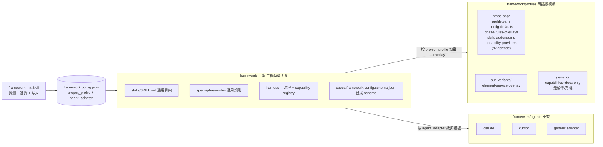
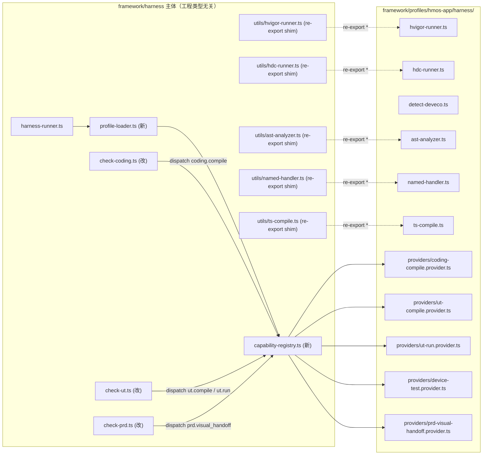
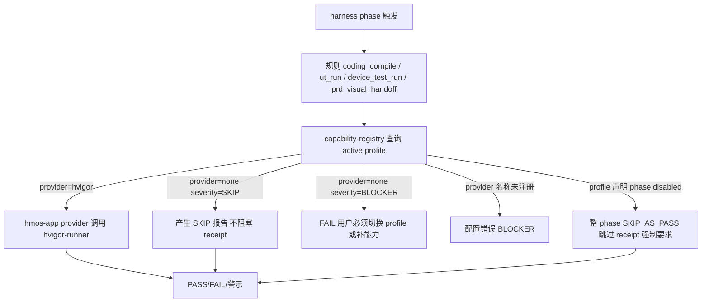

## framework profile 模板化重构

> **Cursor 侧边栏空心/勾选**：取自本文件 YAML 顶部的 `todos[].status`（非自动扫仓库）。某项若已在代码里做完但仍显示未完成，多半是忘记把对应 `status` 改成 `completed`；反过来若标成 `completed` 但库里未落地，请以 git/实现为准做一次校对。

> **收尾校准（profile 改进收尾）**：`harness-profile-loader` 现由 active profile 的 `config-defaults.json` 填补配置缺省，缺 `project_profile` 会 advisory 回退 `hmos-app`；`capability-providers` 现要求 provider metadata 并由 registry 校验 id/capability/exports；`skills-strip-rebuild` 已把主要 hmos-app 专属说明迁入 profile addendum，通用 Skill 主体以 profile/capability 术语描述；`templates-and-docs` 已补充 active profile defaults、capability provider、verify overlay 的加载顺序说明。

### 一、目标与边界

- **抽离不动逻辑**：`framework/skills` 主体 SKILL.md 描述的「阶段流程骨架」、`framework/harness` 的 trace / receipt / state-machine / report-generator / spec-loader / scope-parser / catalog-parser / glossary-parser 等通用模块，**不动核心 API**。
- **抽离鸿蒙特化**：所有 ArkTS / hvigor / DevEco / `.ets` / `Index.ets` / HAP/HAR / Hypium / `oh-package.json5` 相关内容，全部下沉到新建的 `framework/profiles/hmos-app/`。
- **正交概念**：`agent_adapter`（IDE 集成）保持原样；`project_profile`（工程类型）是新增维度，二者**并列**——profile **不进入** [framework/agents/](framework/agents/)。
- **第一阶段交付范围**：仅 `hmos-app`（含 `element-service` sub-variant）+ `generic`（文档型 / 无编译）两个 profile，不预先占位 android/h5/backend-*。
- **兼容策略**：现有实例 [framework.config.json](framework.config.json) 缺 `project_profile` 时，运行时**保守默认** `hmos-app`（保持现有 BLOCKER 链路完全等价），同时在 stderr advisory 提示用户跑 `framework-init` UPDATE 补齐。

### 二、目标架构（重构后）



### 三、关键文件改动地图

#### A. 新增 `framework/profiles/` 体系

- [framework/profiles/profile-schema.yaml](framework/profiles/profile-schema.yaml)：定义 `profile.yaml` 协议（仿 [framework/agents/adapter-schema.yaml](framework/agents/adapter-schema.yaml)）。字段含 `name` / `display_name` / `parent` / `sub_variants` / `detect` / `capabilities` / `defaults` / `phase_rules_overlays` / `skills_addendum_dir` / `harness_extensions`。
- [framework/profiles/README.md](framework/profiles/README.md)：profile 注册表 + 扩展指南。
- [framework/profiles/hmos-app/profile.yaml](framework/profiles/hmos-app/profile.yaml)：声明 capabilities：

```yaml
capabilities:
  coding.compile: { provider: hvigor, severity: BLOCKER }
  coding.lint:    { provider: arkts_lint, severity: BLOCKER }
  ut.compile:     { provider: hvigor_ohostest, severity: BLOCKER }
  ut.run:         { provider: hvigor_hypium, severity: BLOCKER }
  device_test.run:{ provider: hdc, severity: BLOCKER }
detect:
  signature_files: ["oh-package.json5", "build-profile.json5"]
sub_variants:
  - name: element-service
    overrides_dir: sub-variants/element-service
defaults:
  architecture:
    cross_module_exports_file: "Index.ets"
    module_inner_layers: [shared, data, domain, presentation]
  toolchain:
    devEcoStudio: { required: true }
    hvigor: { coding: { driver: assemble_app_project } }
```

- [framework/profiles/hmos-app/config-defaults.json](framework/profiles/hmos-app/config-defaults.json)：`framework-init` 写入 [framework.config.json](framework.config.json) 时合并的默认片段。
- [framework/profiles/hmos-app/phase-rules-overlays/](framework/profiles/hmos-app/phase-rules-overlays/)：从 [framework/specs/phase-rules/](framework/specs/phase-rules/) 抽出鸿蒙特化条款：
  - `coding-rules.overlay.yaml`：`applies_to: **/src/main/ets/**/*.ets`、ArkTS 类型禁 `any`、`coding_hvigor_build` 等
  - `ut-rules.overlay.yaml`：`ohosTest`、`*.test.ets`、Hypium、`ut_hvigor_*`
  - `catalog-rules.overlay.yaml`：HAP/HAR/AtomicService、`Index.ets`、`EntryAbility.ets`
  - `design-rules.overlay.yaml`：`.ets` 路径、ArkTS 数据模型类型
- [framework/profiles/hmos-app/skills/](framework/profiles/hmos-app/skills/)：每个 skill 一个 `profile-addendum.md` + 该 skill 鸿蒙特化的 `templates/` 与 `reference/`。从 [framework/skills/3-coding/reference/arkts-pitfalls.md](framework/skills/3-coding/reference/arkts-pitfalls.md) / [arkui-patterns.md](framework/skills/3-coding/reference/arkui-patterns.md) / [harmony-api-guide.md](framework/skills/3-coding/reference/harmony-api-guide.md) / [module-scaffold.md](framework/skills/3-coding/templates/module-scaffold.md)、[framework/skills/5-business-ut/templates/](framework/skills/5-business-ut/templates/)、[framework/skills/5-business-ut/examples/card-opening/](framework/skills/5-business-ut/examples/card-opening/) 等整体 `git mv` 过来。
- [framework/profiles/hmos-app/harness/](framework/profiles/hmos-app/harness/)：把 [framework/harness/scripts/utils/hvigor-runner.ts](framework/harness/scripts/utils/hvigor-runner.ts)、[framework/harness/scripts/utils/hdc-runner.ts](framework/harness/scripts/utils/hdc-runner.ts)、[framework/harness/scripts/detect-deveco.ts](framework/harness/scripts/detect-deveco.ts) 迁移到此（保留 import 兼容 shim 在原路径 1～2 个版本）。
- [framework/profiles/hmos-app/sub-variants/element-service/](framework/profiles/hmos-app/sub-variants/element-service/)：仅放 `variant.yaml` + 与 app 差异的 overlay 文件（参考现有 `atomic-service-roadmap.md` 描述的差异点）。
- [framework/profiles/generic/](framework/profiles/generic/)：最小骨架。`profile.yaml` 中 `capabilities.coding.compile = { provider: none, severity: SKIP }`、`device_test.run = { provider: none, severity: SKIP }`；只保留 `coding.lint = { provider: noop_or_external, severity: WARN }` 和文档型 prd/design/review 流程。

#### B. `framework/specs/` 调整

- 新建 [framework/specs/framework.config.schema.json](framework/specs/framework.config.schema.json)：把 `framework/templates/framework.config.template.json` 的 `$schema_docs` 段固化为可机器校验的 JSON Schema，新增 `project_profile` 段：

```json
"project_profile": {
  "type": "object",
  "required": ["name"],
  "properties": {
    "name":        { "type": "string" },
    "sub_variant": { "type": "string" },
    "capabilities": { "type": "object" }
  }
}
```

- [framework/specs/phase-rules/](framework/specs/phase-rules/) 中 `coding-rules.yaml` / `ut-rules.yaml` / `catalog-rules.yaml` / `design-rules.yaml`：删除鸿蒙特化条款（已迁到 hmos-app overlay），仅保留 scope 守门、术语映射、severity 结构、receipt 校验等通用规则；其余 6 份 yaml 保持现状。

#### C. `framework/harness/` 重构（最小破坏）

- 新增 [framework/harness/profile-loader.ts](framework/harness/profile-loader.ts)：解析 `framework.config.json.project_profile.name` → 加载 `framework/profiles/<name>/profile.yaml` → 合并 sub-variant overlay → 返回 `ResolvedProfile`（含 capabilities map / overlay 路径 / harness extensions 路径）。**缺字段时默认 `hmos-app`** + stderr advisory。
- 新增 [framework/harness/capability-registry.ts](framework/harness/capability-registry.ts)：定义 `CapabilityKey`（`coding.compile` / `ut.compile` / `ut.run` / `device_test.run` / `coding.lint`），按 active profile 路由到 provider；provider 实现位于 `framework/profiles/<x>/harness/`。capability 不可用时按 `severity` 决定 SKIP / WARN / FAIL。
- [framework/harness/harness-runner.ts](framework/harness/harness-runner.ts)：在 `loadFrameworkConfig` 后调用 `loadProfile`，把 `ResolvedProfile` 注入 `CheckContext`；执行前先合并 phase-rules overlay。
- [framework/harness/scripts/check-coding.ts](framework/harness/scripts/check-coding.ts)：把硬编码 `coding_hvigor_build` 拆为 `coding_compile`（capability 路由）+ rule meta 由 overlay 补充描述。`HARNESS_SKIP_HVIGOR=1` 不再统一翻译为 FAIL，而是按 profile severity 决定。
- [framework/harness/scripts/check-ut.ts](framework/harness/scripts/check-ut.ts)：`ut_hvigor_build` → `ut_compile`、`ut_hvigor_test` → `ut_run`，路由到 capability provider。
- [framework/harness/scripts/check-init.ts](framework/harness/scripts/check-init.ts)：仿 `loadAdapter` 增加 `loadProfile`；体检阶段把 profile 模板文件状态（POPULATED / EMPTY）一并报告。
- [framework/harness/prompts/verify-*.md](framework/harness/prompts/)：删除 ArkTS / hvigor / `.ets` 字面措辞；新增「按 active profile 读取 `framework/profiles/<x>/harness/verify-overlay.md`」段。
- [framework/harness/config.ts](framework/harness/config.ts)：`LEGACY_DEFAULT_DSL` 拆为 `getProfileDefaults('hmos-app')`，避免硬编码鸿蒙 4 层模型。

#### D. `framework/skills/` 主体去鸿蒙化（顶层骨架不变）

每个 [framework/skills/<n>/SKILL.md](framework/skills/) 加 Step 0：

```markdown
## Step 0：加载 profile addendum（必读）

读取 `framework.config.json` → `project_profile.name`（缺失时按 `hmos-app` 兜底，但要 stderr 警示）。
加载 `framework/profiles/<name>/skills/<this-skill>/profile-addendum.md`（必读）。
若 `project_profile.sub_variant` 非空，叠加 `framework/profiles/<name>/sub-variants/<variant>/skills/<this-skill>/profile-addendum.md`。
```

- 主体改写：人设从「HarmonyOS XX 专家」改为「按当前 profile 自我适配的 XX 专家」；删除 `.ets` / `oh-package.json5` / `Index.ets` / `arkts-pitfalls.md` 等具体术语，改为「profile addendum 中声明的语言/工具链」。
- [framework/skills/3-coding/reference/arkts-pitfalls.md](framework/skills/3-coding/reference/arkts-pitfalls.md) / [arkui-patterns.md](framework/skills/3-coding/reference/arkui-patterns.md) / [harmony-api-guide.md](framework/skills/3-coding/reference/harmony-api-guide.md) / [coding-standards.md](framework/skills/3-coding/templates/coding-standards.md) / [module-scaffold.md](framework/skills/3-coding/templates/module-scaffold.md)：整体 `git mv` 到 hmos-app profile 下；主路径只保留通用 `coding-process.md`。
- [framework/skills/5-business-ut/templates/](framework/skills/5-business-ut/templates/) 与 [framework/skills/5-business-ut/examples/](framework/skills/5-business-ut/examples/)：整体迁出，只保留通用 `use-cases-schema.md` 通用部分。
- [framework/skills/00-framework-init/SKILL.md](framework/skills/00-framework-init/SKILL.md) 增加新步骤：
  - **Step 1.5**：跑 `framework/profiles/*/detect` 启发式 → 推荐 profile（命中 `oh-package.json5` → `hmos-app`；否则 `generic`）
  - **Step 1.6**：用户确认 profile + sub_variant
  - **Step 1.7**：合并 `profile.config-defaults.json` 为 architecture / cross_module_exports_file / module_inner_layers / toolchain 默认值；后续 Step 2/3/5/5.6 在此基础上调整

#### E. 顶层文档与模板

- [framework/templates/framework.config.template.json](framework/templates/framework.config.template.json)：增加 `project_profile` 段；`$schema_docs` 与新 schema 文件保持同步。
- [framework/templates/AGENTS.md.template](framework/templates/AGENTS.md.template)：新增「Active Profile」描述位（占位符 `{{PROJECT_PROFILE_NAME}}` / `{{PROJECT_PROFILE_SUB_VARIANT}}`）；[framework/harness/scripts/render-agents-md.mjs](framework/harness/scripts/render-agents-md.mjs) 增加替换逻辑。
- [CLAUDE.md](CLAUDE.md)（实例化产物）：更新「全局约束」段说明 profile 路由路径；架构守门段表述去具体「Index.ets」化，改用 `cross_module_exports_file` 抽象描述。
- [framework/agents/cursor/templates/rules/framework.mdc](framework/agents/cursor/templates/rules/framework.mdc)：同步描述。
- [framework/README.md](framework/README.md) / [framework/skills/README.md](framework/skills/README.md)：增加 profile 章节与扩展指南。

### 四、运行策略与物理边界（capability dispatch 实际跑法）



#### 4.1 物理迁移清单（utils 层全集）

调研确认鸿蒙耦合 utils **共 6 个**（不只 hvigor / hdc / detect-deveco）：

- [framework/harness/scripts/utils/hvigor-runner.ts](framework/harness/scripts/utils/hvigor-runner.ts)（1500+ 行，hvigor 调用核心）
- [framework/harness/scripts/utils/hdc-runner.ts](framework/harness/scripts/utils/hdc-runner.ts)（hdc 真机 / Hypium test result 类型源头）
- [framework/harness/scripts/detect-deveco.ts](framework/harness/scripts/detect-deveco.ts)（DevEco 路径探测）
- [framework/harness/scripts/utils/ast-analyzer.ts](framework/harness/scripts/utils/ast-analyzer.ts)（6 处 ArkTS 命中，AST 分析专属）
- [framework/harness/scripts/utils/named-handler.ts](framework/harness/scripts/utils/named-handler.ts)（4 处 ArkUI 命中，命名 handler 模式专属）
- [framework/harness/scripts/utils/ts-compile.ts](framework/harness/scripts/utils/ts-compile.ts)（26 处 .ets/ArkTS 命中，假设输入 .ets 当 .ts）

**全部 `git mv` 到 `framework/profiles/hmos-app/harness/`**，原路径留 1 行 re-export shim：

```typescript
export * from '../../../profiles/hmos-app/harness/hvigor-runner';
```

→ 现有 3 份单测 ([hvigor-args.unit.test.ts](framework/harness/tests/unit/hvigor-args.unit.test.ts) / [hdc-runner.unit.test.ts](framework/harness/tests/unit/hdc-runner.unit.test.ts) / [detect-product.unit.test.ts](framework/harness/tests/unit/detect-product.unit.test.ts)) **0 改动** 继续跑；下个版本随测试整体迁到 `framework/profiles/hmos-app/harness/tests/`。

#### 4.2 capability dispatch 调用链

`check-coding.ts` / `check-ut.ts` / `check-prd.ts` 不再直接 import 任何 hvigor / hdc / visual-handoff 实现：

```typescript
const result = await capabilityRegistry.dispatch('coding.compile', {
  ctx,
  ruleId: 'coding_compile',
  legacyAlias: 'coding_hvigor_build',
  modules: contractModules,
});
```

registry 查 active profile 的 `capabilities`，按 manifest 声明的 `provider` 字段动态 `require()` `framework/profiles/hmos-app/harness/providers/coding-compile.provider.ts`；provider 内部调原 `runHvigorAssembleApp`。返回结果由 registry 套上 `legacy_rule_id` + 规则描述回到 check 主流程。

#### 4.3 四种典型场景

- **A. 当前 SimulatedWalletForHmos**：profile=hmos-app + DevEco 已配 → dispatch → provider → runHvigorAssembleApp，与现状**比特级等价**（fixture 0 diff 是验收硬指标）。
- **B. hmos-app 但缺 DevEco**：provider 内部 `toolMissing=true` → 按 `severity: BLOCKER` 翻译为 BLOCKER FAIL（与现状等价；`HARNESS_SKIP_HVIGOR=1` 逃生阀语义保留）。
- **C. profile=generic**：profile.yaml 声明 `coding.compile: { provider: none, severity: SKIP }` → registry 直接产 SKIP，不进 BLOCKER 列表；[check-receipt.ts](framework/harness/scripts/check-receipt.ts) 已支持 SKIP 合法终态。
- **D. 未来 android-app**：新建 `framework/profiles/android-app/harness/providers/coding-compile.provider.ts`（gradle 实现），profile.yaml 声明 provider 名 → `check-coding.ts` 一行不改、`harness-runner.ts` 一行不改。

#### 4.4 tsconfig 与构建

profile 下的 `framework/profiles/<name>/harness/` **纳入主 harness 同一个 tsconfig**（不做独立打包），动态加载用 `require(absPath)` 即可。第 1 步 `design-protocol` 输出包含 tsconfig include 调整方案。

#### 4.5 降级语义对照

- 现状硬编码 `coding_hvigor_build` → 重构后通用 `coding_compile` + hmos-app overlay 的 `legacy_rule_id` 兼容
- 现状 `HARNESS_SKIP_HVIGOR=1` 强制 FAIL → 由 active profile severity 决定（hmos-app 仍 FAIL）
- 现状缺 DevEco → BLOCKER FAIL → hmos-app 严格保留；其它 profile 该规则不暴露
- 现状无"工具不存在 → SKIP"路径 → profile 声明 `provider: none / severity: SKIP` 即降级
- 现状 `check-coding.ts` import 实现细节 → 仅 import `capability-registry` 接口

### 五、能力降级语义（capability registry）



### 六、横切遗漏重构点（须纳入 todos）

调研中发现的额外鸿蒙耦合点（除三、四节列出之外）：

#### 6.1 trace.schema.json 含鸿蒙残留

[framework/harness/trace/trace.schema.json](framework/harness/trace/trace.schema.json) 中：

- `$id` 写 `https://harmonyos-framework/harness/trace.schema.json`
- `human_pain_points.category` enum 含鸿蒙特化 `arkts_correctness`
- `retries.trigger` 描述含示例 `'arkts_pitfall'`
- `phase` enum 仅 `prd/design/coding/review/ut/testing`（未来跨 profile 增减时需复核）

**方案**：`category` 拆为「core 基础类别（scope_creep / context_loss / instruction_miss / tool_misuse / contracts_mismatch / architecture_violation / other）+ profile 扩展类别（hmos-app 追加 arkts_correctness）」；`$id` 改为不含 harmonyos 字面；示例文案中性化。

#### 6.2 PRD Visual Handoff 也是 capability

[framework/harness/scripts/check-prd.ts](framework/harness/scripts/check-prd.ts) 中 `visual_handoff` 命中 34 处。UI 类工程才有此能力——backend-go / backend-java / 文档型 generic profile 应禁用。

**方案**：抽为 `prd.visual_handoff` capability；hmos-app 默认启用、generic 默认禁用；profile 声明启停后，`check-prd.ts` 中 visual handoff 段按 capability gate 跳过。`framework/harness/tests/fixtures/prd/visual_*` 系列 fixture 仍归 hmos-app。

#### 6.3 catalog / module-card schema profile 化

[framework/skills/0-catalog-bootstrap/templates/module-card-template.yaml](framework/skills/0-catalog-bootstrap/templates/module-card-template.yaml) 含 `format: HAP/HAR/AtomicService`、`key_exports` 来自 `Index.ets` 等鸿蒙绑定。[framework/harness/scripts/utils/catalog-parser.ts](framework/harness/scripts/utils/catalog-parser.ts) 的 `format` 字段是开放 string（没硬编码取值），合法取值校验在 `catalog-rules.yaml` 中。

**方案**：

- module-card schema 字段保留通用形态，`format` 合法取值由 profile 提供清单；
- [framework/skills/0-catalog-bootstrap/prompts/infer-module-card.md](framework/skills/0-catalog-bootstrap/prompts/infer-module-card.md) 与 [infer-glossary-term.md](framework/skills/0-catalog-bootstrap/prompts/infer-glossary-term.md) 整体迁到 hmos-app profile-addendum；
- 主 prompt 仅留通用「读文件签名 → 推断职责」骨架。

#### 6.4 现有 `project_type: app | atomic_service` 字段迁移

当前 [framework.config.json](framework.config.json) 已有 `project_type` 字段，实际语义就是 hmos-app 内部子分类。

**方案**：改名为 `project_profile.sub_variant`；旧字段保留 alias 1 个版本周期，loader 自动重写并在 stderr 提示用户跑 framework-init UPDATE 完成迁移；v3 deprecate。

#### 6.5 doc/ 骨架与架构文档 profile 化

[framework-init Step 5](framework/skills/00-framework-init/SKILL.md) 写入的 [doc/architecture.md](doc/architecture.md) 骨架、[doc/module-catalog.yaml](doc/module-catalog.yaml) skeleton、PRD/design 模板在 profile 间应有差异。

**方案**：每个 profile 在 `framework/profiles/<x>/doc-skeletons/` 下提供 `architecture.md.template`、`module-catalog.skeleton.yaml`；framework-init Step 5 按 active profile 读取对应骨架。

#### 6.6 CLAUDE.md / AGENTS.md.template 守门段 profile-aware

当前 [CLAUDE.md](CLAUDE.md) 第 6 行 SSOT 表「ArkTS 易错点」、3.1 节 `cross_module_exports_file（默认 index.ets）` 字面、3.4 节整段「ArkTS 正确性守门」、3.5 节 `.ets` lint 描述均为 hmos-app 专属。

**方案**：

- AGENTS.md.template 拆为「通用主体 + profile-block 占位（`{{PROFILE_GUARDRAILS_BLOCK}}` / `{{PROFILE_SSOT_TABLE_BLOCK}}`）」；
- profile 在 `framework/profiles/<x>/templates/agents-md/` 下提供 `guardrails.partial.md` 与 `ssot-table.partial.md`；
- [render-agents-md.mjs](framework/harness/scripts/render-agents-md.mjs) 增加 partial 拼装能力（最小实现：字符串替换 + 文件读入）。

#### 6.7 fixtures 物理重组

[framework/harness/tests/fixtures/v2_2/](framework/harness/tests/fixtures/v2_2/) 中含 `02-Feature/Demo/src/main/ets/...` 路径的 fixture 是 hmos-app 专属。

**方案**：

- 含 `.ets` 文件结构 / hvigor expected report 的 fixture → 迁到 `framework/profiles/hmos-app/harness/tests/fixtures/`
- 主 harness 仅保留通用 fixture（prd 文档型 / glossary / catalog）
- generic profile 配最小 fixture 验证 SKIP 路径

#### 6.8 phase 级 profile gate

generic profile 整体不需要 `device-testing` phase（无真机）。harness-runner 的 `VALID_PHASES` 列表保持稳定，但 profile 可声明 `phases.disabled: [device-testing]`，命中时阶段直接 SKIP_AS_PASS（带说明），不写 receipt 强制要求。Stop hook 状态机判定也据此放行。

#### 6.9 toolchain 字段所有权迁移

[framework/harness/config.ts](framework/harness/config.ts) 第 82-189 行整段 `DevEcoStudioConfig` / `HvigorOptionsConfig` / `HvigorCodingConfig` 是 hmos-app 专属。

**短期保留**在主 config.ts（避免跨包循环依赖），但加注释标"该字段族归属 hmos-app profile"；**长期**每个 profile 应通过 `profile.yaml.config_extensions` 声明自己要的扩展字段，loader 动态校验——这条作为 plan 落地后的下一步演进，**不在第一阶段交付**。

### 七、迁移与回滚保障

- **快照测试**：在重构前用现有 hmos-app 的 [framework/harness/tests/fixtures/](framework/harness/tests/fixtures/) 跑一次完整 harness，记录所有规则 verdict 作为基线；重构后所有 fixture **必须 0 diff**（rule id 改名通过 alias 回填）。
- **rule id 兼容**：`coding_hvigor_build` / `ut_hvigor_build` / `ut_hvigor_test` 在 hmos-app overlay 中声明为 `coding_compile` / `ut_compile` / `ut_run` 的 **legacy alias**，旧 receipt / 旧报告解析仍然能命中。
- **逐 PR 切分**：建议按「先骨架后内容」顺序提交多个 commit/PR：
  1. profile 协议 + framework.config.schema.json + 空骨架（`design-protocol` / `scaffold-profiles-dir`）
  2. utils 层 6 文件迁移 + shim（`migrate-utils-files`，必须保单测 0 改动）
  3. capability-registry + provider 封装（`harness-profile-loader` / `capability-providers`）
  4. check-coding/check-ut/check-prd 重构 + phase-rules overlay 抽离（`harness-checks-refactor` / `extract-hmos-rules` / `harness-overlay-merger` / `visual-handoff-capability`）
  5. SKILL 主体改写 + 鸿蒙资产迁移（`extract-hmos-skill-assets` / `skills-strip-rebuild` / `catalog-prompts-profilize` / `verify-prompts-update`）
  6. trace schema / project_type 迁移 / doc skeleton / AGENTS partials（`trace-schema-genericize` / `project-type-rename` / `doc-skeleton-profilize` / `agents-md-partials`）
  7. framework-init 流程更新 + element-service sub-variant + generic profile + phase-gate（`init-skill-detect` / `element-service-variant` / `generic-profile` / `phase-gate-by-profile`）
  8. fixtures 重组与基线对账（`fixtures-relocate` / `fixtures-baseline`）

  每步都跑全量 fixture。

### 八、风险与开放点

- `framework/skills/3-coding/reference/arkts-pitfalls.md` 等文件被多处 SKILL 主体引用，迁移后需全局搜替路径（约 20+ 处引用，已扫到）。
- [framework/harness/scripts/utils/hvigor-runner.ts](framework/harness/scripts/utils/hvigor-runner.ts) 1500+ 行，迁到 profile 目录后路径变更，单测路径与 `import` 都靠 shim 兼容；shim 移除时间点暂定 v3.x。
- generic profile 的 `coding.lint` provider 第一版可设为 `noop`（仅产生 INFO 级提醒），避免引入复杂 lint 选型；正式 lint 集成留给后续 PR。
- 兼容性兜底（缺 `project_profile` 默认 hmos-app）属过渡策略，未来 v3.x 可移除——这条建议在 plan 落地后用户决定何时收紧。
- [framework/harness/config.ts](framework/harness/config.ts) 中 hmos-app 专属字段（DevEcoStudioConfig 等）短期不外迁，避免循环依赖；长期通过 `profile.yaml.config_extensions` 声明完成所有权迁移。
- trace.schema.json 的 `human_pain_points.category` 一旦改为「core + profile 扩展」，下游已有 trace 文件可能含 `arkts_correctness` 旧值——loader 端需做兼容映射（hmos-app profile 自动接收旧值）。