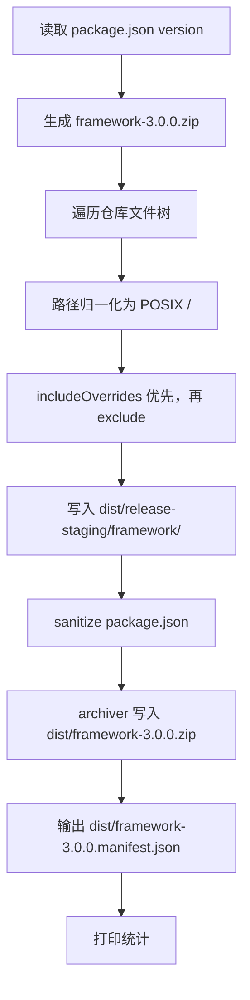

# Framework 发布打包流程

## 背景与目标

- **消费者路径不变**：解压后得到 `<工程根>/framework/`，与当前 [SimulatedWalletForHmos/framework](D:/1.code/SimulatedWalletForHmos/framework) 用法一致。
- **命名规则**：读取根 [`package.json`](package.json) 的 `version` 字段，**完整 semver** → `framework-3.0.0.zip`。
- **裁剪原则**：以 [`AGENTS.md`](AGENTS.md) 中「发布内容 vs 开发工具」分层为 SSOT，补齐现有 [`.npmignore`](.npmignore) 未覆盖的条目。
- **裁剪策略**：**默认纳入整棵发布目录树，再按 exclude 裁剪**（黑名单优于白名单枚举子目录），避免漏掉 `harness/schemas/`、`harness/templates/` 等运行时依赖。

## 发布包结构

解压到工程根后：

```text
<工程根>/
├── .gitignore          ← framework-init 写入（含 framework/harness/node_modules/ 等）
└── framework/          ← zip 内唯一顶层目录
    ├── README.md
    ├── MIGRATION.md
    ├── package.json
    ├── skills/
    ├── specs/
    ├── harness/        ← 整目录纳入，再裁 tests/reports/state/dist/trace 产物
    ├── profiles/       ← 整目录纳入，再裁 */harness/tests/
    ├── agents/
    ├── workflows/
    ├── templates/
    └── docs/
```

## 包含 / 排除清单（SSOT）

### 默认纳入（整目录）

| 目录 | 说明 |
|------|------|
| `skills/` `specs/` `agents/` `workflows/` `templates/` `docs/` | 核心资产 |
| `harness/` | 运行时全量（含 `schemas/` `templates/` `prompts/` `scripts/` `*.ts` `tsconfig.json` `package.json`） |
| `profiles/` | profile 全量（含 `harness/providers/`、`vendor/hylyre/` 等） |
| 根文件 | `README.md` `MIGRATION.md` `package.json` |

### 必须排除

| 类别 | 路径 / 模式 | 原因 |
|------|-------------|------|
| 开发工具 | `<repoRoot>/.cursor/` `.claude/` `.codex/` `openspec/` `scripts/` | maison 根级开发目录；**不含** `harness/scripts/`（见 excludeRootDirs） |
| Maison 开发指令 | `AGENTS.md` | 仅 maison 开发者使用 |
| 版本说明 | `RELEASE-NOTES-v*.md` | 不进发布件 |
| 仓库/开发元数据 | `.gitignore` `.npmignore` `.git/` `dist/` | maison 开发仓专用；消费者 ignore 由 framework-init 写入**实例工程根** |
| Framework 回归测试 | `harness/tests/` | 仅 maison 开发验收 |
| Profile 回归测试 | `profiles/*/harness/tests/` | fixture + unit |
| npm 依赖 | `**/node_modules/` `**/package-lock.json` | 消费者本地 `npm install` 生成 |
| Harness 运行时产物 | `harness/reports/**` `harness/state/**` `harness/dist/**` `harness/trace/**` | 实例工程运行时产生（见 includeOverrides） |
| 宿主运行时产物 | `**/.hylyre/` `**/tmp_hypium/` `**/oh_modules/` | Hylyre/Hypium/ohpm 本地缓存 |

### includeOverrides（强制保留，优先级最高）

以下路径**即使命中 exclude**，也必须纳入发布包：

- `harness/reports/.gitkeep`
- `harness/state/.gitkeep`
- `harness/trace/trace.schema.json`
- `harness/trace/gap-notes.template.md`

> **匹配规则（BLOCKER）**：
> 1. 遍历前先统一路径为 POSIX `/`（Windows `\` 归一化），相对 maison **仓库根**。
> 2. 判定顺序：`includeOverrides` → `excludeRootDirs` → `excludeGlobs`。
> 3. `includeOverrides` **始终赢** exclude。
> 4. **`excludeRootDirs` 仅匹配仓库根下一级目录**（如 `scripts/` → 只排除 `<repoRoot>/scripts/**`，**不会**误伤 `harness/scripts/`）。
> 5. **`excludeGlobs` 相对仓库根**匹配（不以 `**/` 开头的模式视为 rooted，如 `harness/tests/**`）。
> 6. 实现须单测覆盖：`harness/scripts/check-init.ts` 保留、`scripts/pack-release.mjs` 排除。

## 实现方案

### 1. 新增发布排除清单 SSOT

新建 [`scripts/release-excludes.json`](scripts/release-excludes.json)。zip 打包以该文件为准（`.npmignore` 仅保留 npm publish 预留）。

```json
{
  "excludeRootDirs": [".cursor", ".claude", ".codex", "openspec", ".git", "dist", "scripts"],
  "excludeGlobs": [
    "AGENTS.md",
    "RELEASE-NOTES-v*.md",
    ".gitignore",
    ".npmignore",
    "harness/tests/**",
    "profiles/*/harness/tests/**",
    "harness/reports/**",
    "harness/state/**",
    "harness/dist/**",
    "harness/trace/**",
    "**/node_modules/**",
    "**/package-lock.json",
    "**/.hylyre/**",
    "**/tmp_hypium/**",
    "**/oh_modules/**"
  ],
  "includeOverrides": [
    "harness/reports/.gitkeep",
    "harness/state/.gitkeep",
    "harness/trace/trace.schema.json",
    "harness/trace/gap-notes.template.md"
  ]
}
```

> **`excludeRootDirs` vs 旧 `excludeDirs`**：仅当路径第一段等于目录名时排除（`<repoRoot>/scripts/**` ✓，`harness/scripts/**` ✗）。

### 2. 新增打包脚本（采纳审查：不用根 ts-node，不用零依赖 zip）

新建 [`scripts/pack-release.mjs`](scripts/pack-release.mjs) — **Node 原生 ESM**，不依赖 harness 的 `ts-node`：

| 决策 | 理由 |
|------|------|
| `.mjs` 而非 `.ts` | 根 `package.json` 无 `ts-node`；避免 `npm --prefix harness exec` 的 cwd/路径耦合 |
| 使用 `archiver` | 写 zip；Node 无稳定内置 zip 写入 API |
| 使用 `extract-zip` | verify 解压 zip 到临时目录；与 archiver 对称，跨平台 |
| 二者放根 `devDependencies` | 仅 maison 发版用；**staging 时从 zip 内 package.json 剥离**（见下） |
| `archiver` 仅 `pack-release.mjs` 静态 import | 写 zip 必需 |
| `extract-zip` 仅 `verify-release-pack.mjs` **动态 import** | verify 专用；`pack-release` / `--dry-run` 不依赖它 |

**`package.json` staging sanitize（P1，BLOCKER 级消费者体验）**：

根 [`package.json`](package.json) 会打进 zip，但 maison 仓内的 `release:*` scripts 与发版 `devDependencies` 对消费者无意义且会误导（指向已排除的 `scripts/`，或在 `framework/` 下误装 archiver/extract-zip）。

staging 写入 `framework/package.json` 前做 **release sanitize**（不修改源文件，仅改 staging 副本）：

```json
// 消费者 zip 内 package.json 保留：
{
  "name": "agent-maison",
  "version": "3.0.0",
  "private": true,
  "description": "...",
  "scripts": {
    "test": "npm --prefix harness test",
    "harness:install": "npm --prefix harness install"
  }
}
```

**移除项（sanitize 剥离）**：

- `scripts.release:pack` / `scripts.release:verify`
- 根级 `devDependencies` 整段（`archiver`、`extract-zip`）

**消费者执行入口**：仍在 `framework/harness/`（`npm install` + `harness-runner`）；根 `package.json` 仅保留 workspace 级 `test` / `harness:install` 转发。

verify 须断言：zip 内 `package.json` **不含** `release:` 前缀 script 与 `archiver`/`extract-zip` dependency。



**manifest 规范**（sidecar，**不进 zip**）：

输出路径：`dist/framework-<version>.manifest.json`

```json
{
  "version": "3.0.0",
  "zipName": "framework-3.0.0.zip",
  "zipPath": "dist/framework-3.0.0.zip",
  "sha256": "<hex>",
  "createdAt": "<ISO8601>",
  "includedFileCount": 1234,
  "excludedFileCount": 567,
  "excludedCountsByRule": {
    "excludeRootDirs:scripts": 4,
    "excludeRootDirs:.cursor": 58,
    "excludeGlobs:harness/tests/**": 120
  },
  "includedFiles": ["README.md", "harness/scripts/check-init.ts", "..."],
  "excludedSample": ["AGENTS.md", "scripts/pack-release.mjs", "harness/tests/run-tests.ts"]
}
```

**manifest 列表策略（固定，无歧义）**：

| 字段 | 策略 |
|------|------|
| `includedFiles` | **全量**列出所有纳入路径（相对 `framework/` 内路径，不含外层 zip 目录前缀） |
| `excludedFileCount` | 被排除文件总数 |
| `excludedSample` | 最多 **50** 条代表性 excluded 路径 + 已含 `excludedFileCount` 供对照 |
| sidecar 位置 | 与 zip 同目录；**不进 zip** |

CLI：

```bash
npm run release:pack              # 默认输出到 dist/
npm run release:pack -- --dry-run # 只打印 include/exclude 统计，不写 zip
npm run release:pack -- --out D:/releases
```

### 3. 根 package.json 变更

```json
{
  "scripts": {
    "release:pack": "node scripts/pack-release.mjs",
    "release:verify": "node scripts/verify-release-pack.mjs"
  },
  "devDependencies": {
    "archiver": "^7.0.0",
    "extract-zip": "^2.0.1"
  }
}
```

发版前在 maison 根执行一次 `npm install`（拉取 `archiver`、`extract-zip`）。二者为 maison-only，经 sanitize **不进 zip 内 package.json**；`archiver` 也不作为消费者依赖分发。

### 4. 自动化验收脚本（采纳审查：不绑死 SimulatedWallet）

新建 [`scripts/verify-release-pack.mjs`](scripts/verify-release-pack.mjs)：

1. 调用 `pack-release.mjs` 产出 zip（verify 专用临时 `--out`）
2. 用 **`extract-zip`** 解压到 `os.tmpdir()` 下临时目录
3. 断言：
   - 唯一顶层目录为 `framework/`
   - **不存在**：`AGENTS.md`、`.gitignore`、`.cursor/`、`openspec/`、`scripts/`（maison 根 scripts）、`harness/tests/`、`RELEASE-NOTES-v*.md`
   - **不存在（通配扫描）**：`profiles/*/harness/tests/**` 下不得有任何 entry（至少覆盖 `profiles/hmos-app/harness/tests/` 与 `profiles/generic/harness/tests/`）
   - **存在**：`README.md`、`harness/scripts/check-init.ts`（验证未误伤 harness/scripts）、`harness/schemas/`、`harness/templates/`、`harness/reports/.gitkeep`、`harness/state/.gitkeep`、`harness/trace/trace.schema.json`、`templates/AGENTS.md.template`
   - **package.json sanitize**：zip 内 `package.json` 无 `release:*` scripts；无 `devDependencies.archiver` / `extract-zip`
4. **规则单测**（不依赖真实 zip）：用 synthetic 路径列表验证 `excludeRootDirs` 不误伤 `harness/scripts/`；sanitize 函数单测覆盖 strip 逻辑
5. **`extract-zip` 动态 import**：仅在 `verify-release-pack.mjs` 内 `await import('extract-zip')`，`pack-release.mjs` 不引用
6. Windows 路径：用 `\` 构造测试路径，验证归一化后规则仍正确
7. 退出码非 0 即 FAIL

可挂入 `npm run release:verify`；后续可选接入 `harness/tests` 或根级 CI。

### 5. 发版前自检清单

新建 [`docs/operations/release-checklist.md`](docs/operations/release-checklist.md)：

**自动（BLOCKER）**：

1. `cd harness && npm test` 全 PASS
2. `npm run release:verify` 全 PASS
3. `npm run release:pack`，检查 `dist/framework-<version>.zip` + sidecar manifest

**人工（可选）**：

4. 在 SimulatedWalletForHmos（或任意消费者工程）解压覆盖 `framework/`
5. `cd framework/harness && npm install && npx ts-node harness-runner.ts --phase catalog`

### 6. 同步 AGENTS.md

更新 [`AGENTS.md`](AGENTS.md)：
- 发布命令：`npm run release:pack` / `npm run release:verify`
- 排除清单 SSOT：`scripts/release-excludes.json`
- `.gitignore` / `RELEASE-NOTES-v*.md` 不进发布件

## 审查报告采纳对照

| 审查项 | 采纳 | 处理 |
|--------|------|------|
| 根 ts-node 不可用 | 是 | 改 `pack-release.mjs` + `node scripts/...` |
| 零依赖 zip 不现实 | 是 | 根 `devDependencies` 引入 `archiver` + `extract-zip` |
| includeOverrides 优先级 | 是 | 明确判定顺序 + verify 单测 |
| 路径 POSIX 归一化 | 是 | 遍历前统一 `/`，verify 含 Windows 用例 |
| harness 运行时范围窄 | 是 | 整目录 `harness/` 纳入再裁剪 |
| smoke 绑死 SimulatedWallet | 是 | 自动 verify 用临时目录；SimulatedWallet 降为可选人工项 |
| manifest 规范不清 | 是 | 定义 sidecar JSON 字段；不进 zip |
| 补充验收脚本 | 是 | 新增 `verify-release-pack.mjs` + `release:verify` |

## 第二轮审查采纳（实施前最后修订）

| 审查项 | 级别 | 采纳 | 处理 |
|--------|------|------|------|
| `excludeDirs: scripts` 误伤 `harness/scripts/` | BLOCKER | 是 | 改为 `excludeRootDirs`，仅匹配仓库根一级 |
| verify 缺 zip 解压能力 | P1 | 是 | 根 `devDependencies` 增加 `extract-zip` |
| verify 只点名 hmos-app tests | P2 | 是 | glob 断言 `profiles/*/harness/tests/**` 为空 |
| manifest 列表截断策略歧义 | P2 | 是 | `includedFiles` 全量；`excludedSample` ≤50；`excludedFileCount` 总数 |

## 第三轮审查采纳

| 审查项 | 级别 | 采纳 | 处理 |
|--------|------|------|------|
| zip 内 package.json 含 maison-only scripts/deps | P1 | 是 | staging sanitize：剥离 `release:*` 与根 `devDependencies` |
| extract-zip 勿被 pack-release 静态 import | P3 | 是 | 仅 verify 动态 import；pack 只用 archiver |

## 与现有 SimulatedWallet 部署的差异

当前 SimulatedWallet 的 `framework/` 仍含 `AGENTS.md`、`harness/tests/`、`RELEASE-NOTES-v*.md`、`.gitignore` 等。新流程会主动裁剪。

## 验收标准

- `npm run release:verify` PASS
- `npm run release:pack` 产出 `dist/framework-3.0.0.zip` + `dist/framework-3.0.0.manifest.json`
- 解压后仅见 `framework/` 顶层
- zip 内**不存在**：`AGENTS.md`、`.gitignore`、`openspec/`、`.cursor/`、`scripts/`（maison 根）、`harness/tests/`、**任意** `profiles/*/harness/tests/`、`RELEASE-NOTES-v*.md`、`node_modules/`、`package-lock.json`
- zip 内**存在**：`README.md`、`MIGRATION.md`、`harness/scripts/`、`harness/schemas/`、`harness/templates/`、`templates/AGENTS.md.template`、`profiles/hmos-app/vendor/hylyre/`
- zip 内 `package.json` **仅含** `test` / `harness:install` scripts，**不含** `release:*` 与发版 devDependencies
