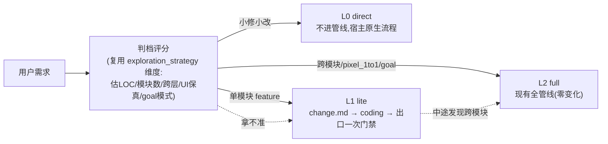
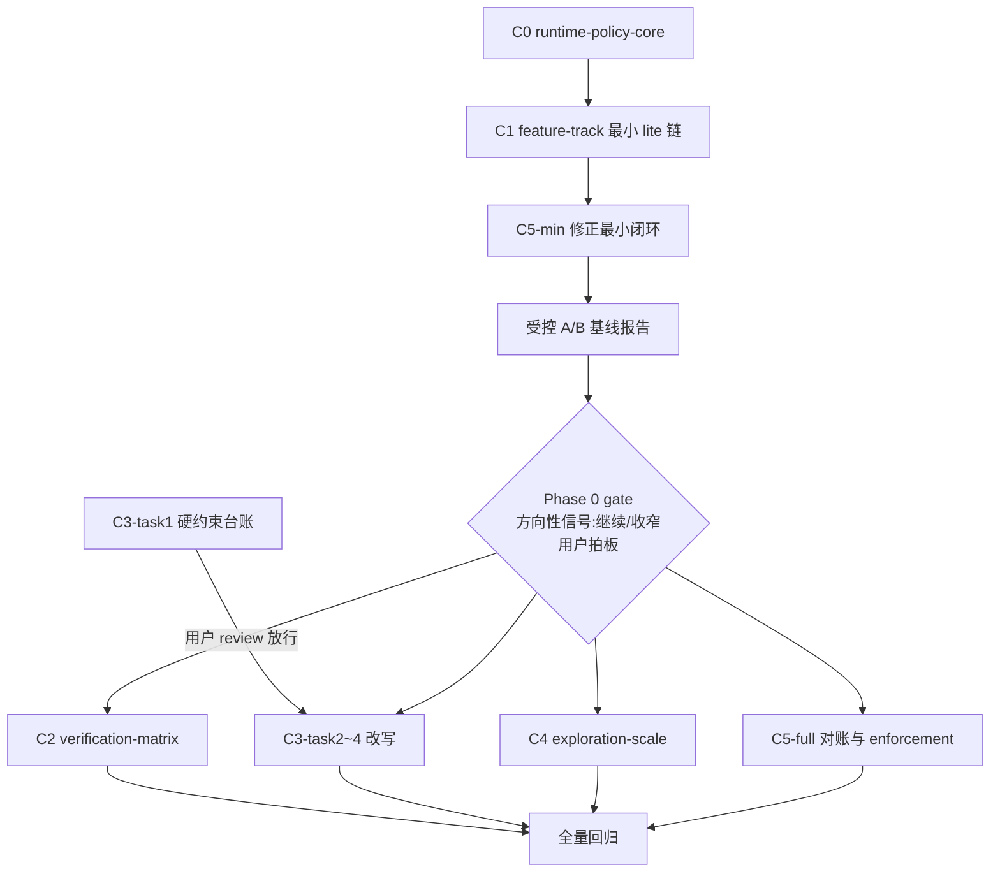

# framework 轻量化重构 — 分档工作流与验证收敛（maison 3.0.0）

## 版本绑定（BLOCKER 合规）

- **3.0.0 窗口已于 2026-07-07 由用户打开**（`package.json.version` = 3.0.0，用户自行 bump 并摘除本 plan 与 android plan 的 `deferred_to`）；本 plan 为**在窗 plan**，按 [AGENTS.md](AGENTS.md) semver 表属 **major**（超大型框架重构），与窗口级别相符。
- **与 android 工程适配（plan 5e3400c3，同窗 3.0.0）按先后序实施**：本重构先行，android 基于瘦身后契约开工（用户已定顺序 2026-07-06）。Phase 0 构成可独立发布的最小增量，若窗口体量超限可拆小版本先出（由用户拍板）。
- 版本号变更仍由用户控制；`release:check-plans` 自窗口打开起对本 plan 生效——3.0.0 发版前本 plan todos 须全 completed 或显式顺延。

## 背景与量化基线（为什么重；2026-07-06 复测口径）

| 项 | 实测（含口径） | 病灶 |
|---|---|---|
| harness | 272 个 TS 文件 / 83,217 行；剔除 `harness/tests/` 后 157 文件 / 52,605 行 | 治理系统 ≈ 被治理工程体量（目标工程几万~10 万行） |
| skill 正文 | 10 个 SKILL.md 共 **4,939** 行（business-ut 843 / plan 772 / catalog-bootstrap 654 / coding 600 均超 Anthropic 建议的 <500 行）；含 reference/prompts/templates 的 skills/ 全树 md **7,012** 行 | 真病灶不止行数，而是"进阶段前完整阅读正文+addendum+N 个 reference（BLOCKER）"的**强制全读门禁**，直接违背 progressive disclosure 的条件加载 |
| 硬约束 | 6 个 feature skill 426 行含 BLOCKER/禁止/必须（按行计；逐次出现宽口径 ~630）；入口模板 [templates/AGENTS.md.template](templates/AGENTS.md.template) 278 行 48 处（注意区分仓根 AGENTS.md 140 行——评审曾混淆两文件） | 多轮 fake-pass 军备竞赛单调累加，规则只增不减，边际遵守率递减 |
| 闭环凭证 | 每阶段 4 重：trace.json + 脚本零 BLOCKER + verifier PASS + receipt（[check-receipt.ts](harness/scripts/check-receipt.ts) :333 verifier 必 PASS、:365 trace 必在、:402 context_exploration 必有——全部硬编码必需） | 按"内网弱模型会说谎"设防，对交互态强模型是固定税；verifier 子 agent 每阶段重读全上下文 |
| 探索 | spec Research Sub-Phase / plan 探索 / coding 架构认知各自落盘 per-phase context-exploration.md，且 receipt 对**每个** feature phase 都要求该文件 | 同一批工程事实（glossary/catalog/architecture）读 3~6 遍 |
| 强制 DAG | catalog+glossary → spec → … → testing | 1~3 模块小工程里 catalog/glossary/code-graph 信息量趋近零，仍是硬前置 |
| 运行时枚举 | feature phase 集合 `spec|plan|coding|review|ut|testing` 硬编码于 8+ 处（见 C0 收编清单） | 任何新档位/新 phase 都会"入口认、运行时不认"——分档的第一性障碍 |

业界对照（引述已一手核实，来源：[Fowler/Böckeler：Understanding SDD](https://martinfowler.com/articles/exploring-gen-ai/sdd-3-tools.html)、[Anthropic Agent Skills](https://www.anthropic.com/engineering/equipping-agents-for-the-real-world-with-agent-skills)、[OpenSpec](https://github.com/Fission-AI/OpenSpec/)、[superpowers](https://github.com/obra/superpowers)）：Kiro 对小 bug 生成 4 用户故事+16 验收标准 = "sledgehammer to crack a nut"；spec-kit 的 markdown 审阅时间超过直接结对编码；**"有效的 SDD 工具必须为不同规模/类型的变更提供不同核心工作流"**；Anthropic 三层渐进披露 + 互斥场景拆文件 + 确定性工作交脚本；OpenSpec 无阶段门禁、产物随时可改；superpowers 零 harness、测试红绿即门禁。

**诊断**：maison 把「开发方法论」与「弱模型防作弊」焊死，且重量是静态的而变更风险是动态的。**重构主张：过程自由 + 出口严格——方法论层按档位伸缩，防作弊层收敛为出口门禁且永不降档。**

## 核心理念：重量 = f(track, evidence_profile, headless)

目标运行形态（codex review 的管线表述，采纳为北极星）：

```
request → 判档(risk classifier) → direct | lite | full
        → context assembler(facts 复用) → implementation
        → deterministic gates(恒开红线) → evidence summary(按档叠加)
```



三个不变式：

1. **默认零变化**：未声明 track = `full`、未声明 `evidence_profile` = `strict` → 现有 hmos-app 全部行为与夹具零回归。
2. **headless 恒 strict**：`evidence_profile` 降档只作用于交互态；goal-mode / headless 运行时强制 resolve 为 strict（无人值守下自报无效是多轮视觉实测的硬学习；lite track 两模式都可跑，但 headless 下 exit 门禁证据强制保留）。
3. **防作弊红线不随任何档位降级**；判档拿不准时**保守缺省进 lite**（L0 无 gate 兜底，误降风险不对称，路由文本必须写死这个缺省）。

**两个自由度轴（用户使用反馈增补，2026-07-07）**：纵向 = 新需求入口选多重的流程（track，C1）；横向 = 进行中 feature 的修正从哪层重入（correction routing，C5）。横向轴的两个核心认知：**修正不是阶段，是横切操作**——正确设问不是"重走哪些 phase"而是"根因在哪层产物"；**重验 ≠ 重做**——门禁是便宜的跨产物校验器，修正 = 改根因层 SSOT + 级联重跑下游门禁，不重新生产上游产物。

## 交付文档集（本文件即 master plan + 7 OpenSpec change）

OpenSpec 承载框架自身演进（[AGENTS.md](AGENTS.md) OpenSpec 节）。每个 change 须过 `npm run openspec:validate`。

| change | 阶段 | 内容 | 依赖 |
|---|---|---|---|
| **C0 `runtime-policy-core`** | Phase 0 | track / evidence / phase-chain 三判定单点化 + 枚举收编 | — |
| **C1 `feature-track`** | Phase 0 | 分档基座 + lite 最小可执行链 | C0 |
| **C3-task1（`skill-slim` 前半）** | Phase 0 | 硬约束台账（无行为变更），停等 review | — |
| **ab-eval**（OpenSpec change，九轮补位 owner） | Phase 0 gate | usage schema + usage_capture + model_identity + 受控 A/B 报告 | C1 + C5-min |
| **C2 `verification-matrix`** | Phase 1 | 证据档位收敛 | C0/C1 + gate |
| **C3-task2~4（后半）** | Phase 1 | 主干化改写 + 入口瘦身 + 防再膨胀 lint | 台账放行 + C1 |
| **C4 `exploration-scale`** | Phase 1 | 探索共享 + 小工程裁剪 | C0 + gate |
| **C5 `correction-routing`** | **C5-min = Phase 0** / C5-full = Phase 1 | 修正路由：根因分层 + 级联重验 + enforcement matrix | C5-min: C0/C1（default strict）；C5-full: +C2 |

---

## C0 · runtime-policy-core（新增，其余 change 的共同地基）

**动机（codex review P0，已逐处坐实）**：feature phase 集合与闭环判定散落多处硬编码——新增 lite 阶段链或条件化凭证时，会出现"runner 放行、Stop hook / check-receipt 继续阻断"的 split-brain。

**三个判定（纯函数，新模块 `harness/scripts/utils/runtime-policy.ts` 或同级）**：

1. **路由与判档分层（codex 三轮 P1 采纳）**：入口 `classifyRequestRoute()` → `direct|feature`——L0 direct 是**入口路由决策**（无 featureDir、不建 feature、不进管线），不做成假 track；进入 feature 后 `resolveFeatureTrack(featureDir, config)` → `lite|full`（读 feature.yaml，缺省 full）；
2. `resolveEvidencePolicy(track, runtimeContext, config)` → 各凭证（verifier/receipt/trace/exploration）的 **policy 档** `required|optional|off|not_applicable`（**纯函数不读文件**——`provided` 是校验后事实、属校验层，见 C2 两层分离；headless/goal 强制 strict）。**`runtimeContext` 显式类型契约（codex 二轮 P2 采纳，列入 C0 验收）**：`mode: interactive|headless|goal`、`adapter`、`phase`、`workflow`、`can_prompt_user`、`can_collect_usage`——避免"headless 恒 strict"散落 runner / goal-runner / adapter 各自实现；
3. `resolvePhaseChain(workflow, track)` → 该 track 的合法 phase 集与 requires DAG（含 auto_chain 投影）。

**枚举收编清单（迁移为消费 workflow 合法集/C0 输出；逐处已 grep/逐行核实）**：

| 位置 | 现状 |
|---|---|
| [check-receipt.ts:57-59](harness/scripts/check-receipt.ts) | `type Phase` + `VALID_PHASES` 硬编码 6 phase |
| [phase-transition-policy.ts:11/:27](harness/scripts/utils/phase-transition-policy.ts) | `FeaturePhase` + `FEATURE_PHASE_ORDER`（goal-runner 批量授权解析消费） |
| [trace.schema.json:34](harness/trace/trace.schema.json) | `phase.enum` 硬编码 → 改 pattern + runner 侧按 workflow 合法集校验 |
| harness/compat-loader.ts、scripts/backfill-context-exploration.ts、scripts/utils/context-exploration.ts、exploration-strategy.ts、goal-progress.ts、phase-alias.ts | 同型枚举（grep 坐实 8 文件） |
| [agents/claude/templates/hooks/check-phase-completion.mjs](agents/claude/templates/hooks/check-phase-completion.mjs)、record-verifier-report.mjs | Stop hook 下发件内嵌闭环判定，改为读 state/config 内 policy 快照（下发件不 import harness 模块，快照由 runner 写入 `.current-phase.json`）。**快照带 `schema_version`；hook 读不到快照/版本不符/runner 未写成功时 fail-safe 回 strict 全凭证**（宁可多设防不可静默放行——cursor 二轮采纳；降级路径入夹具） |
| [goal-runner.ts / goal-monitor.ts / goal-status.ts](harness/scripts/goal-runner.ts) | phase chain / halt 分类消费 |

**验收**：收编为纯重构——C0 合入后全 fixture 零变化（default full+strict 下三判定输出与现状逐一等值，用契约单测锁死）。

---

## C1 · feature-track（分档基座）

### 设计决策：feature 级 track，单 workflow 内过滤

- [specs/workflow-schema.json](specs/workflow-schema.json) 增 `artifacts[].tracks`；**缺省语义（codex 一轮 P1 采纳）**：`scope: feature` 的 phase 缺省 `tracks: ["full"]`——**lite 成员资格必须显式标注**，防 fork workflow 的新 phase 静默漏入 lite；`scope: global` 的 phase 缺省对全 track 适用。
- **依赖表达（codex 二轮 P1 采纳，弃用"被过滤即降空"的隐式语义）**：增可选 `artifacts[].requires_by_track`——同一 phase 在不同 track 下依赖不同（现状硬点：coding `requires: [plan]`([spec-driven.workflow.yaml:71](workflows/spec-driven.workflow.yaml))，lite 下须 `requires_by_track.lite: [change]`）；未声明该字段的 track 沿用 `requires` 并对被过滤 phase 降空，**仅限无 lite-only 上游的简单情形**，否则 schema 校验 FAIL 要求显式声明。
- [workflows/spec-driven.workflow.yaml](workflows/spec-driven.workflow.yaml) 增 lite 链：`change`（产 change.md，标 `tracks: ["lite"]`）→ `coding`（标 `["full","lite"]`，`requires_by_track.lite: [change]`）→ `exit`（标 `["lite"]`）；新 phase id 经 C0 注册进全部运行时（trace/receipt/Stop hook/goal-runner 不再各持枚举）。
- **auto_chain 分轨（codex 二轮 P1 采纳）**：`auto_chain`(:12) 升级为 `auto_chain_by_track`——`full` 沿用现有序列，`lite: [change, coding, exit]` **必须显式声明**（存在 lite-only phase 的 workflow 缺该键即 schema FAIL）；C0 `resolvePhaseChain` 只做一致性校验（链与 DAG/tracks 互洽），**不做隐式推导**，防 runner / goal-runner / goal-status 各自猜链；schema + fixture 锁死。
- **schema 版本策略（codex 三轮 P2 采纳，坐实）**：[workflow-loader.ts](harness/workflow-loader.ts) 现硬拒非 `"1.0"`(:119)——tracks / requires_by_track / auto_chain_by_track 随 **`schema_version: "1.1"`** 落地，loader 兼容读 1.0（旧 workflow 全量视作 full 单轨）与 1.1，防实施第一刀被版本门禁卡住。
- **feature 级声明**：`doc/features/<feature>/feature.yaml`（先例：per-feature `compat.yaml`）承载 `track`、判档评分快照、确认记录；[harness/config.ts](harness/config.ts) 增 `loadFeatureTrack()`（实现委托 C0）。**路径约束（round7 path-governance 后的新前置，2026-07-07 复核）**：feature.yaml / change.md / facts.md / `.current-correction.json` 的 feature 侧路径一律经 `paths.features_dir` 解析（featureArtifactPath 三通道，commit 1f875c24/b4aa7290），**禁止硬编码 `doc/features/`**——勿把 round7 刚消灭的问题带回来。

### 三档产物与管线契约

| | L0 direct | L1 lite | L2 full（现状） |
|---|---|---|---|
| 触发 | 小修小改/文案/单文件 bug | 单模块 feature、无 pixel_1to1 | 跨模块 / pixel_1to1 / goal-mode 默认 |
| 叙述产物 | 无 | `change.md` 单文档（意图/scope/术语快查/验收清单/关键契约/任务 checkbox） | spec.md + plan.md + contracts + acceptance + … |
| 管线 | 不进管线 | `change` → `coding` → `exit`（一次门禁） | 6 阶段全链 |
| 门禁 | 无（可选宿主编译/测试） | exit 一次跑：编译 + lint + `diff_within_scope` + 验收 checkbox 全勾 +（acceptance 有 unit 条目时）UT | 每阶段 4 重闭环 |
| 凭证 | 无 | change.md checkbox + exit 报告（headless 下即硬证据） | trace + receipt + verifier |

- **判档**：[spec-rules.yaml](specs/phase-rules/spec-rules.yaml) `exploration_strategy`（:555）维度上抬为通用 track 评分，增"UI 保真意图"与"goal 模式"一票升 full 项；agent 提议 + `feature.track` gate 确认（登记 [confirmation-registry.yaml](skills/reference/confirmation-registry.yaml)，过 `check-skills-confirmation-ux`）。
- **中途升档**：lite 实施中 scope 越界/跨模块信号 → 停下走升档确认，feature.yaml 记录事件，change.md 作 spec/plan 种子输入。
- **L0 路由**：只改 [templates/AGENTS.md.template](templates/AGENTS.md.template) 入口路由文本，**写死保守缺省"拿不准就进 lite"**（cursor review 采纳：L0 无 gate 兜底，误降不对称）。**L0 最小纪律（codex 二轮采纳）**：不进管线 ≠ 不验证——仍须遵守用户显式要求与项目**原生**校验（相关 test/lint/build），路由文本一并写明。
- **新检查**：`harness/scripts/check-change-lite.ts`（change.md 章节存在性 + scope 模块名合法 + checkbox 语法）；`exit` 复用现有 coding 检查子集 + UT 条件项。
- **skills 索引**：[skills.index.yaml](skills/skills.index.yaml) 增 `feature/change-lite` 入口 skill（正文按 C3 新规 ≤150 行）。
- **fixtures**：lite 契约基线（PASS + 坏态：checkbox 未勾/scope 越界/UT 缺失）。

---

## C2 · verification-matrix（证据档位收敛）

### evidence_profile 旋钮（codex P1 采纳：弃用 agent_trust 命名——可信的不是模型，是运行上下文+可审计出口）

[templates/framework.config.template.json](templates/framework.config.template.json) + [specs/framework.config.schema.json](specs/framework.config.schema.json) 增顶层可选段：

```jsonc
"evidence_profile": "strict"   // strict(缺省,=现状) | balanced(交互态强模型)
```

- 缺省 `strict` → 现有行为零变化；`balanced` 仅用户显式声明。**`minimal` 是 lite track 的 resolved 结果，不可全局声明**（防滥用）。
- **headless/goal-runner 运行时强制 resolve 为 strict**（即便 config 写 balanced）——实现在 C0 `resolveEvidencePolicy`，不靠 skill 文本自觉。

### 证据矩阵（SSOT 落 C2 spec，唯一消费入口 = C0）

| track × profile | 脚本门禁 | LLM verifier | receipt + trace |
|---|---|---|---|
| full × strict | 必跑（现状） | 必跑（现状） | 必跑（现状） |
| full × balanced（交互态） | 必跑 | 仅 {spec, coding} 保留（已拍板），其余跳过（可 config 覆写） | receipt 保留（跨会话 resume 语义），trace 降 opt-in |
| lite ×（任意，resolved=minimal） | exit 一次必跑 | 不跑 | 无 per-phase receipt；闭环态 = change.md checkbox + exit 报告 |

### 关键改造点（收编清单已逐行核实）

- [check-receipt.ts](harness/scripts/check-receipt.ts)：`:333` verifier 必 PASS、`:341` invoked_via、`:365` trace_json、`:402` context_exploration、`:551` self_check.q1 五个硬必需块改为按 policy 分派；lite feature 返回显式 `not_applicable`（exit 0 + 机读标注），跨会话 Resume Gate 不误判。
- **机读契约（codex 二轮 P1 + 三轮 P1 分层修订）**：**policy 与校验两层分离**——policy 层（C0 纯函数输出）`required|optional|off|not_applicable`；校验层（receipt/state 落盘）`validation_status: provided|missing|skipped_by_policy|not_applicable`。receipt frontmatter 与 `.current-phase.json` 的 `evidence_policy_snapshot` 记两栏——"receipt 保留但 trace opt-in 关闭"等组合有稳定校验判据，不靠散文 N/A；快照契约与 C0 的 fail-safe 语义（读不到/版本不符→strict）共用 schema。
- [phase-completion-receipt.md](harness/templates/phase-completion-receipt.md)：模板字段按 policy 分节（strict 全填；balanced 省 verifier 节的 phase 标注 N/A 语义）。
- [harness-runner.ts](harness/harness-runner.ts)：closure 计算（:664，现状硬等 `receiptValidation?.status === 'passed'`）、next_step `run_verifier_then_receipt`（:776）改查 C0 输出。**闭环状态映射（codex 三轮 P2 采纳）**：closure 来源按 policy 分派——full = receipt `passed`；lite = exit 报告 PASS + checkbox 全勾（check-receipt 返回 `not_applicable`，exit 0 但**不映射为 receipt-passed**）；Resume Gate 对 `not_applicable` 走 lite 闭环判据，绝不误当普通 PASS；`check-receipt exit 0 / skipped_by_policy / closed-by-exit-report` 三态在 state 快照显式区分。
- **Stop hook**：`.current-phase.json` 增 track + evidence policy 快照字段（缺省按 full+strict 解释旧 state，沿用 grace/ttl 治理，无 schema 破坏）；下发 hook 读快照判放行。
- **fixtures**：矩阵各象限契约夹具（full×balanced 的 verifier 保留集、headless 强制 strict、lite not_applicable、旧 state 兼容）。

### 不降档红线（机器可查清单，单测锁死）

1. `framework_integrity` 防漂移；2. 伪签/验真链（视觉判定 build 指纹绑定、`asset_crop_validation` 独立辨认、`signed_by` 自签拦截、进程注入自净）；3. `diff_within_scope`（lite 在 exit 跑）；4. goal-mode halt-confirm 与凭证链。

---

## C3 · skill-slim（瘦身 + 规则收敛）

### task 1 —— 硬约束普查台账（Phase 0 先行，停等用户 review）

**范围（cursor review 采纳修订）：全部 10 个 SKILL.md**——含 project 级 [catalog-bootstrap（654 行，全仓第 3 重）](skills/project/catalog-bootstrap/SKILL.md)、framework-init、code-graph、goal-mode（对齐用户"前置也笨重"的原始抱怨）——**+ [templates/AGENTS.md.template](templates/AGENTS.md.template) 48 处**。四分类同前（A 脚本已执行→缩为一句+报错自解释 / B 纯文本纪律→合并 / C 事故补丁→原则化 / D 过时重复→删），逐条旧文→新落点映射。**未获用户放行不得进 task 2。** **防漂移锚定（2026-07-07 复核增补）**：台账条目以「skill id + 约束语义指纹」锚定而非行号——3.0.0 窗口内 skill 文本仍会被其它批次改动（round7 一次性重排全部 6 个 feature SKILL ±950 行即先例）；C3-task2 开工前对台账跑一次 refresh diff。

### task 2 —— SKILL.md 主干化（Phase 1）

每个 SKILL.md 重构为 **≤150 行主干**（触发/输入/流程骨架/门禁清单表/产物契约）+ reference 条件加载："完整阅读 X（BLOCKER）"→"当 <场景> 时读 X"。主干开头即 track 路由（lite 走 change-lite，不载入 full 正文）。

> 口径说明：Anthropic 官方建议 body <500 行，现有 4 个 SKILL.md 超标；≤150 是**比业界更激进**的主干+条件加载架构（不是"回到业界标准"）。150 为已拍板值；Phase 0 A/B 报告会给出实际 token 影响数据供复核，**改动阈值须用户再拍板**。
>
> **分级预算提案（cursor 二轮，随台账交拍板）**：一刀切平值对 10 个差异极大的 skill 可能过于均质（business-ut 843→150 = -82%）；task 1 台账将按 skill 复杂度评估是否分级（150 基准；business-ut / plan 等复杂 skill 是否放宽 ≤250），提案随台账一并提交用户拍板——**未获批前 150 为唯一基准**。

### task 3 —— 入口模板瘦身（Phase 1）

[templates/AGENTS.md.template](templates/AGENTS.md.template) 278 行 → **≤120 行**：路由表（含 L0/L1/L2 分流 + "拿不准进 lite"缺省）+ 红线清单 + SSOT 链接；细则移 framework 内 reference。各 adapter 跳板核对"只跳转不扩写"。

### task 4 —— 防再膨胀 lint（Phase 1）

[check-docs.ts](harness/scripts/check-docs.ts) 增源仓门禁：`skill_body_max_lines` + "强制全文阅读"句式黑名单（新增须进 allowlist 说明理由）。**规则库从"只增不减"转向"增必有出口"的结构性保证。**

---

## C4 · exploration-scale（探索共享 + 小工程裁剪）

### per-feature 探索共享（codex P2 采纳修订：覆盖全部 feature phase）

- 新契约：`doc/features/<feature>/context/facts.md` —— 由**该 track 的首个 feature phase 建立**（codex 四轮采纳：full=spec、lite=change；Code Facts + key_inputs_read），**后续所有 active feature phase（full 含 review/ut/testing、lite 含 coding/exit）以 `phase_delta` 增量节追加**，不重做全量探索；lite 下 facts 的必需档位由 evidence policy 决定。依据：receipt 对每个 phase 都硬要求 context_exploration（[check-receipt.ts:402](harness/scripts/check-receipt.ts)），只改 spec/plan/coding 会留下 review/ut/testing 的断层。
- receipt 的 `context_exploration` 凭证经 C2 policy 指向 `facts.md#phase_delta`；exploration 相关 phase-rules 改为"facts 存在 + 本阶段增量节"校验；`exploration_strategy` 评分只在 spec 首建全额执行。
- 兼容：旧 per-phase context-exploration.md 可读；[backfill-context-exploration.ts](harness/scripts/backfill-context-exploration.ts) 扩展为可归并旧布局（对齐 compat protocol v1）。

### 小工程裁剪（scale 档位）

- config 增可选 `project_scale: small | standard`（缺省 standard = 现状）；framework-init 按 catalog 模块数（阈值 ≤3，已拍板）与代码量建议档位，用户确认写入。
- `small` 档：术语消歧降为一次性对照 architecture.md 确认（映射表仍产出、免逐行 gate，glossary 允许最小种子）；`module-graph` 默认禁用——`config.phases_disabled ∪ profile.phases_disabled` 取并集，经 [profile-loader.ts](harness/profile-loader.ts) `normalizePhaseDisabled`(:223) / `isPhaseDisabledByProfile`(:231) 与 C0 `resolvePhaseChain` 统一裁剪 phase set（codex 二轮 P2 采纳，落点已核实）；catalog 卡片精简字段集。
- scope 声明与 `diff_within_scope` 在 small 档不变（红线）。

---

## C5 · correction-routing（修正路由——第二自由度轴）

**动机（用户使用反馈坐实，2026-07-07）**：正常推进走 skill 管线，中途出问题改用自然语言修正——该回合往往**不加载任何 SKILL.md**：per-skill 的 9 处"会话内硬边界/前置闸门"（spec 2 / plan 3 / coding 3 / code-review 1）全是单向防御且此时不在场；入口 §4 路由表只覆盖正向意图；harness 无 correction 概念（均已核实）。强模型隐式做根因分层尚可，弱模型无决策程序即脱缰；用户自己也无法回答"该重走 spec→plan 还是直接 coding"——因为这是错误设问。

### 修正三问（Phase 0 随 C1 落入口路由表，纯文本 ≤15 行）

| 问 | 是 → 落点层 |
|---|---|
| Q1 需求/验收本身变了？ | spec（spec.md / acceptance.yaml） |
| Q2 需求没变，接口/契约/设计要变？ | plan（plan.md / contracts.yaml） |
| Q3 上游都没错——要改产品代码？ | 是 → coding；否（纯补验证）→ ut / testing |

输出 `{落点层, 最小重验集}`；模糊请求（"这里不对帮我看看"）**先诊断根因再分类**；**禁止未分层直接动产物**。修正三问是唯一保证"规则在场"的位置——常驻入口，对强模型是几十 token 开销，对弱模型是缰绳。

### C5-min（Phase 0 —— 最小机器闭环，codex 七轮 P1 采纳前移）

> 只有三问文本不足以解决痛点（弱模型可能不读入口路由表），且 A/B 需要"old flow vs C5 flow"的修正样本对照——故最小机器件随 Phase 0 落地。**依赖钉实（codex 八轮 P1）：C5-min 只依赖 C0/C1，Phase 0 按 default strict 全凭证运行；C5-full 才消费 C2 的 evidence matrix。**

1. **前置归属解析（不允许"先编辑后归属"，codex 七轮 P1）**：`resolveCorrectionTarget(request, activeState, proposed_files?)` → feature(s)——在**任何编辑发生前**解析归属；无法确定时先向用户确认，或显式进入 no-feature correction 模式（执行载体见第 8 条 `--adhoc-correction`；案例：半模态修复同时动两入口并删平行实现文件即属跨 feature）。"按 diff 经 catalog 反查"降级为**收尾对账**手段（核对 declared ↔ 实际），不作为首次归属来源。
2. **runtime-policy 模块增 correction resolvers**（`resolveCorrectionTarget` / `classifyCorrection` / `resolveEnforcementTier`，扩展 C0 判定集合、同守纯函数与等值不变式）：`classifyCorrection(request, featureState)` → `{root_layer, touched_layers[], revalidate[]}`。
3. **级联重验规则（重验 ≠ 重做）**：落点 L → L 及下游**已闭环** phase 的**脚本门禁**重跑（秒级；术语↔scope、contracts↔代码、acceptance↔UT 不一致自会红）；receipt 走既有 stale 指纹刷新、lite 天然只有 exit。**Phase 0 按 default strict 全凭证重验；"verifier 按 evidence policy（balanced 可省）"的减免语义随 C5-full 接入 C2 后生效**——"脚本门禁为主"到实施不得变形（cursor 七轮 watch-point）。
4. **修正确认 gate**（登记 confirmation-registry）：agent 报"root_layer + touched_layers + 重验集 + 理由"，`1=同意 / 2=改层`；strict 必确认，headless 低置信 halt-confirm（与 goal halt 同构）；balanced 高置信免确认为 C5-full 语义。
5. **完成前自检命令**：`--correction-check`（或并入 `--sync-closure`）——读 `.current-correction.json`（第 7 条），对照 revalidate 清单核查各门禁已重跑且绿；无物理 hook 的 adapter 靠它 + 入口 completion checklist 收口。
6. **验证转嫁禁令**：revalidate 指向 testing 而宿主无真机/hylyre 能力、或 feature 无 device 层验收可派生时，须显式声明 evidence 缺口并 halt-confirm（"需要人工验证：<具体清单>"）——**"请在真机上试一下"不得作为正常收尾**；转嫁验证是 evidence 缺口，不是完成。
7. **最小持久化状态（codex 八轮 P1）**：`harness/state/.current-correction.json`——`{feature?, root_layer, touched_layers[], revalidate[], status}`（no-feature 时 feature 为空）；为 `--correction-check` 提供跨回合 / soft 档下的稳定输入。feature.yaml 修正历史 append 与完整对账扩展留 C5-full。
8. **no-feature 执行载体（codex 八轮 P1，坐实：[harness-runner.ts:287](harness/harness-runner.ts) 非全局 phase 无 `--feature` 即 exit 1）**：新增 **`--adhoc-correction`** 专用入口——读 `.current-correction.json`，跑 coding 出口门禁子集（编译/lint/diff 检查）+ testing 即席派生；**不建临时假 feature 目录**。
9. **最小 enforcement 分档判定（codex 八轮 P2）**：读 adapter capability 判档并按档声明行为——Phase 0 即生效，release notes 的分档声明有真实依据；hook 深度集成留 C5-full：

| 档 | adapter | 修正闭环保证 |
|---|---|---|
| `hard_hook` | claude 系（Stop/SubagentStop hook） | 物理拦截：未重验即宣布完成 → hook 拦 |
| `headless_runner` | goal-runner | runner 内置对账 + halt-confirm |
| `soft_rule_only` | cursor / generic | 软约束：三问 + 完成前 checklist + `--correction-check` 自检；**文档与剧本不得宣称"Stop hook 一定拦"**（[agents/README.md:185](agents/README.md) 坐实无物理层） |

### C5-full（Phase 1，依赖 C2）

10. **对账兜底（touched_layers 语义，codex 七轮 P1 修订）**：correction 状态并入 C2 `evidence_policy_snapshot` 机制做完整对账——**只拦"未声明的 touched layer"**：声明仅改 spec/plan 却出现 code diff → 拦；声明含 coding 的组合修正（改 spec 同轮把代码修到新契约）→ 放行但必须重验 coding 及下游。
11. **hard_hook 档深度集成 + 修正历史**：Stop/SubagentStop hook 与 `.current-correction.json` 联动拦截；修正记录 append 进 feature.yaml，不造新文件；balanced 减免语义（verifier 可省、高置信免确认）随 C2 接入生效。
12. 坏态 fixtures 全套：分类错误 / 声明 spec 却改代码 / 组合修正漏重验 / 无归属直改 / soft 档 checklist 缺项 / correction 状态缺失或过期。

**界限（诚实声明）**：不追求 100% 路由正确，追求"错了被便宜地拦住"——确认闸 + 对账兜底两道保险；坏态 fixtures 覆盖分类错误路径。

---

## 实施顺序与验收



- **Phase 0 = 最小可发布增量**（cursor review 采纳）：C0 + C1（lite 链可跑）+ **C5-min（修正最小闭环）** + C3-task1 台账 + A/B 基线。此时消费者已可用 lite track 与修正路由主链，且"token 有没有正收益"有了第一份数据——**不在"假设笨重有害"的前提下做完全部重构再回头验证**。Phase 0 的 release notes 须声明修正路由的 enforcement 分档（cursor/generic 为软约束档）与 C5-full 补齐计划（cursor 七轮 watch-point）。
- **Phase 0 gate（定位=方向性信号，二轮双评审采纳）**：A/B 报告 + 台账经用户 review，决定**继续 / 收窄**（C2 verifier 保留集、C3 主干预算、C4 是否全量）；n≤3 样本不承担"最终阈值证明"，阈值微调在 Phase 1 内随夹具滚动、由用户拍板。
- 每 change 完成即跑：`cd harness && npm test` 全绿 + `npm run openspec:validate` + `npm run release:verify`。
- **最终验收**：hmos-app 默认路径零回归（现有全部 fixture 不改而绿）；lite 全链 PASS + 坏态逐一拦截；矩阵各象限夹具绿；C3 行数 lint 生效且台账映射齐；A/B 对照报告产出。

### 受控 A/B 收益验证（ab-eval，Phase 0）

- **前置任务（codex P1 采纳）**：[trace.schema.json](harness/trace/trace.schema.json) 现仅 model_backend 元信息（:37）无 usage——增可选 `usage` 段（`input_tokens/output_tokens/tool_tokens/requests/cost_estimate`）+ 分 adapter 采集策略按 `usage_capture` 声明（api/sidecar 优先）；交互 adapter best-effort 自报 + wall-time/tool_calls 代理指标（采不到 token 时对照仍可基于代理指标，报告须标注口径）。**model_identity_capture（codex 四轮采纳）**：A/B 报告须机器固化 resolved provider/model（manifest/report 记录，非 agent 自报）；拿不到 usage 或 model 身份时，只能以代理指标表述，**不得声称"同模型 token 对照"**。
- 样本 **4 类必含、各 ≥1**（简单 bugfix / 单模块 feature / 跨文件中等 feature / **进行中 feature 的 NL 修正**——第 4 类对照臂为 old flow vs C5 flow 而非 lite vs full，观测 token、重验命中、验证是否转嫁）；某类确不可复现时报告显式标注缺失，**gate 不得声称覆盖该类收益**（修正路由类缺失即不得下修正路由结论——十轮 codex 采纳）。× 同模型**分开独立跑**（不得全量顺序跑计时——缓存/warm 假象已被证伪过），记录 token/轮次/门禁命中/缺陷数。
- **token 保真（cursor 二轮采纳，四轮措辞收口）**：A/B 双臂均以 headless goal-runner 执行，按 adapter `usage_capture` 声明采集真实 usage（api/sidecar 优先）；交互态体验单独另验，不承载"token 正收益"这一核心结论。
- **采集能力契约（codex 三轮 P1 采纳，坐实：`AgentInvokeResult`([agent-invoke.ts:558](harness/scripts/utils/agent-invoke.ts)) 无 usage 字段、adapter schema 无 usage 声明位）**：adapter goal capability 增 `usage_capture: none|stdout_json|stderr_regex|sidecar|api` 声明，采集按声明实现；`none` / 采集失败时**只能出代理指标报告**（wall-time/tool_calls），一律不得承载 token 正收益结论。

### 与 android plan（5e3400c3）的衔接

- android C1 的 profile-addendum / skill-assets 按 **C3 瘦身后契约**编写；android 验收含 lite track 试点（单模块 feature 走 change→coding→exit）。
- 上述两点已经用户同意（2026-07-06）直接写入 android plan 正文（「前置依赖」节 + C1 资产/验收表述 + c1 todo 同步），android 开工时无需再确认。

## 已固化决策

1. 档位是 **feature 级**（`feature.yaml`），单 workflow 内按 `phase.tracks` 过滤；不搞工程级双 workflow。
2. 默认值全部等于现状（track 缺省 full、evidence_profile 缺省 strict、scale 缺省 standard）→ 消费者升级零迁移动作。
3. 证据降档只作用于交互态；headless/goal 运行时强制 strict——无人值守自报无效是已证伪多轮的硬学习。
4. 防作弊红线不进矩阵、恒开启，清单机器可查。
5. L0 不造新机制：入口路由文本 + 不进管线；**判档拿不准保守缺省进 lite**。
6. 规则收敛"先台账、后动笔"，台账停等用户 review；删改逐条留旧文→新落点映射。
7. track/evidence/scale 全部由 config / workflow / feature.yaml 声明驱动，消费者不改 framework 文件。

## 已拍板决策（用户确认 2026-07-06，续前节编号）

8. **窗口**：3.0.0 与 android 共享，本重构先行。
9. **lite exit 的 UT 定位**：acceptance 有 unit 层条目时必跑，否则不强制。
10. **small 档 catalog 模块数阈值**：≤3。
11. **skill 主干行数上限**：150（入口模板 120）；A/B 数据仅供复核，改动须用户再拍板。
12. **full×balanced 保留 verifier 的阶段集**：{spec, coding}（原表述 full×high；codex 建议旋钮改名 `evidence_profile`，语义与拍板内容不变）。

## 评审修订固化（codex/cursor review 采纳，2026-07-06）

13. 新增 **C0 runtime-policy-core**：track/evidence/phase-chain 三判定单点化，收编 8+ 处运行时枚举；C1/C2/C4 只消费不自判。
14. `tracks` 缺省语义：feature phase 缺省 `["full"]`、lite 显式标注；global phase 缺省全 track 适用。
15. 旋钮命名 `agent_trust` → **`evidence_profile: strict|balanced`**（minimal 为 lite resolved 档，不可全局声明）。
16. **A/B eval 前移为 Phase 0 gate**；前置补 trace usage schema 与分 adapter 采集策略。
17. C3 台账范围扩至全部 10 个 SKILL.md（含 project 级）+ 入口模板。
18. C4 facts.md 覆盖全部 feature phase（phase_delta 增量），与 receipt context_exploration 凭证联动。

## 二轮评审修订固化（codex/cursor re-review 采纳，2026-07-06）

19. workflow schema 增 **`requires_by_track`** 与 **`auto_chain_by_track`**：lite 含 lite-only phase 时链与依赖**必须显式声明**，C0 只校验一致性、不做隐式推导。
20. **`evidence_policy_snapshot` 机读契约**：receipt frontmatter 与 `.current-phase.json` 记录每凭证项（枚举后经三轮 27 修订为 policy + validation_status 两层，以 27 为准）。
21. C0 `runtimeContext` 显式类型契约（mode/adapter/phase/workflow/can_prompt_user/can_collect_usage）列入验收；policy 快照带 `schema_version`，hook 侧读取失败/版本不符 **fail-safe 回 strict**。
22. A/B 样本扩为 **2~3 个不同性质**、**双臂均 headless goal-runner** 直采 usage；gate 定位方向性信号（继续/收窄），不由单样本定最终阈值。
23. **L0 最小纪律**：不进管线仍须守项目原生 test/lint/build 与用户显式要求。
24. `config.phases_disabled ∪ profile.phases_disabled`，经 profile-loader + C0 统一裁剪。
25. 主干预算**分级提案**（150 基准 / 复杂 skill ≤250）随 C3 台账提交用户拍板；未获批前 150 为唯一基准（决策 11 不变）。

## 三轮评审修订固化（codex/cursor 终轮采纳，2026-07-06）

26. **路由与判档分层**：`classifyRequestRoute()` → `direct|feature`（入口层）；`resolveFeatureTrack()` → `lite|full`（C0）——L0 不是 workflow track。
27. **policy / 校验两层枚举分离**：policy 档 `required|optional|off|not_applicable`（纯函数）；`validation_status: provided|missing|skipped_by_policy|not_applicable`（receipt/state 落盘）。
28. adapter goal capability 增 **`usage_capture`** 声明位；采不到 usage 只出代理指标报告，不得承载 token 正收益结论。
29. workflow **`schema_version` 升 "1.1"**，loader 兼容 1.0（旧 workflow 视作 full 单轨）。
30. **lite 闭环 ≠ receipt passed**：closure 来源按 policy 分派，`not_applicable` 三态显式映射，Resume Gate 不误读。
31. （四轮）facts.md 由 **track 首个 feature phase** 建立（full=spec、lite=change），后续 active phase 追加 phase_delta。
32. （四轮）**model_identity_capture**：A/B 须机器固化 resolved provider/model；拿不到 usage/model 身份不得声称"同模型 token 对照"。

## 用户增补固化（使用反馈，2026-07-07）

33. **修正是横切操作，不是阶段**：进行中 feature 的修正按根因分层（修正三问）定落点，禁止未分层直接动产物；"重走哪些 phase"是错误设问。
34. **重验 ≠ 重做**：修正后级联重跑"落点层及下游已闭环 phase 的脚本门禁"，不重新生产上游产物；重验集由机器算出（classifyCorrection），不再靠人判断。
35. 修正三问文本随 **Phase 0** 入口路由先行落地（规则必须在常驻入口才"在场"——NL 修正回合不加载 skill）；机器件拆分口径后经七/八轮修订：C5-min（含 classifyCorrection）已前移 Phase 0，Phase 1 仅余对账/hook 集成——**以 40、44~46 为准**。
36. 修正路由不追求全对，追求**错误被便宜拦住**：修正确认 gate（strict 必确认）+ 回合收尾对账（declared layer ↔ 实际 diff / 重验完成度）两道保险。
37. **归属 fallback**：修正 diff 无 feature 归属或跨 feature 时，按触及模块经 catalog 反查归属（多命中各自纳入重验集）；零命中至少跑 coding 出口门禁 + testing 即席验证并显式声明。
38. **验证转嫁禁令**：所需验证能力缺位时显式 halt-confirm 声明 evidence 缺口；"请用户在真机上试一下"不得作为正常收尾。
39. （七轮）**adapter enforcement matrix**：修正闭环保证分三档——hard_hook（claude）/ headless_runner（goal）/ soft_rule_only（cursor/generic：三问 + checklist + `--correction-check` 自检）；任何文档/剧本不得把"Stop hook 拦"写成通用保证。
40. （七轮）**C5-min 前移 Phase 0**：前置归属解析、classifyCorrection、重验清单、自检命令、转嫁禁令随 Phase 0 落地；touched_layers 对账与 hook 集成为 C5-full（Phase 1）。
41. （七轮）**归属解析前置**：resolveCorrectionTarget 在任何编辑前解析 feature 归属，禁止"先编辑后归属"；diff 反查仅作收尾对账。
42. （七轮）**touched_layers 语义**：对账只拦"未声明的 touched layer"；声明含 coding 的组合修正放行但必须重验 coding 及下游。
43. （七轮）A/B 增"进行中 feature 的 NL 修正"样本（对照臂 = old flow vs C5 flow）。
44. （八轮）**C5-min 最小持久化**：`harness/state/.current-correction.json`（{feature?, root_layer, touched_layers[], revalidate[], status}）为 `--correction-check` 的稳定输入；feature.yaml 修正历史与完整对账留 C5-full。
45. （八轮）**no-feature 执行载体** = `--adhoc-correction` 专用入口（coding 出口门禁子集 + testing 即席），不建临时假 feature 目录（harness-runner 非全局 phase 强制 `--feature`，:287 坐实）。
46. （八轮）**依赖钉实**：C5-min 只依赖 C0/C1、Phase 0 按 default strict；balanced 减免与完整对账随 C5-full 接入 C2；最小 enforcement 分档判定随 C5-min（release notes 分档声明的依据），hook 深度集成随 C5-full。
47. （九轮）**ab-eval 为独立 OpenSpec change**——Phase 0 gate 数据管线（usage schema / usage_capture / model_identity / 受控协议 / gate 报告）的唯一 owner。
48. （九轮）**--adhoc-correction 可执行契约**：输入=含 base_commit 的 correction state；changed-files=git diff base_commit ∪ 工作区；检查=compile+lint+架构规则+受保护前缀（替代 diff_within_scope，越界防护不豁免）；报告落 reports/_adhoc；testing evidence=device 即席或 manual_confirm。
49. （九轮）**correction state 防串会话**：增 created_at/session_id/base_commit/request_fingerprint/enforcement_tier/expires_at；session 不符或过期视 stale 拒绝（复用 phase-state session 治理）。
50. （九轮）**enforcement 判档 = 派生纯函数** `resolveEnforcementTier`（源=adapter 既有 settings_file/hooks 声明 + runtimeContext.mode）；不新增 adapter schema 字段、不按 adapter 名字硬编码。
51. （九轮）**C0 判定集合可扩展**：C5 的 correction resolvers 在同一 runtime-policy 模块扩展，同守纯函数与 default 等值不变式。
52. （十轮）**enforcement 判档优先级 mode 先行**：goal/headless 下即便 manifest 有 hooks 也判 headless_runner——Claude hook 在 MAISON_GOAL_HEADLESS=1 时旁路（check-phase-completion.mjs :631 坐实），误判 hard_hook 会夸大保证。
53. （十轮）**A/B 4 类样本必含**（各 ≥1）；某类不可复现须标注缺失且 gate 不得声称覆盖该类收益；proxy 态 usage 的 token 字段可空、代理指标复用顶层 tool_calls/时间戳推导（schema 不分叉）。

## 外部评审采纳记录（2026-07-06，动手前，逐条 ground-truth 核实）

- **codex P0-1（采纳，坐实）**：lite 链非可执行 workflow——[check-receipt.ts:57-59](harness/scripts/check-receipt.ts) `VALID_PHASES`、[phase-transition-policy.ts:11/:27](harness/scripts/utils/phase-transition-policy.ts)、[trace.schema.json:34](harness/trace/trace.schema.json) 硬编码逐处核实为真，另 grep 出 compat-loader 等 8 文件同型枚举 → 新增 C0 收编。
- **codex P0-2（采纳，坐实）**：check-receipt `:333/:341/:365/:402` 四硬必需块 + receipt 模板 verifier 节核实为真 → evidence policy 抽 SSOT，runner/check-receipt/Stop hook/trace/goal-runner 同源消费。
- **codex P1-3（采纳）**：tracks 缺省歧义 → feature phase 缺省 `["full"]`、lite 显式。
- **codex P1-4（采纳，坐实）**：trace.schema 无 usage 字段核实为真 → ab-eval 前置补 schema + 采集策略。
- **codex P1-5（采纳）**：`agent_trust` 改名 `evidence_profile`。
- **codex P2-6（采纳，坐实）**：receipt 对全部 phase 要求 context_exploration（:402）→ C4 facts 覆盖全 feature phase。
- **codex P2-7（不采纳弱化，改为补源）**：Fowler/Kiro 引述系本人 2026-07-06 一手 fetch 原文所得，cursor 亦独立核实"原文属实"；处置 = 背景节补可点击来源 URL，引述保留。
- **cursor 基线核验（部分采纳）**：✅ 采纳修正 "skill 正文 7,000 行"（该数为 skills/ 全树 md，10 个 SKILL.md 实为 4,939——原表述口径错误）；✅ 采纳 426 的宽/窄口径标注。❌ 驳回其 "入口模板 141 行/从未 278"（复测 [templates/AGENTS.md.template](templates/AGENTS.md.template) = 278 行；根因经 cursor 二轮自证为其 PowerShell `Measure-Object -Line` 在 UTF-8+中文+LF 下系统性少计 ~40%，文件指向无误、计数方法不可信）；❌ 驳回其 "10 个 SKILL.md 共 2,733 行/最长 482/全部达标 Anthropic <500"（复测总 4,939、business-ut 843，4 个超 500）；⚠️ harness 行数以本仓复测为准：83,217 全量 / 52,605 剔 tests（其 75,830 口径不明，量级结论一致）。
- **cursor 建议（采纳）**：A/B 前移 Phase 0 gate；C3 范围补 project skill；L0 保守缺省"拿不准进 lite"；C3 诊断措辞聚焦"强制全读门禁"而非行数（原表格病灶列本已如此表述，行数口径已修正）。
- **cursor 建议（认可，无需改动）**：full×balanced 滥用风险——既有缓解（仅交互态、headless 强制 strict、保留 {spec,coding}）被评审认可为足够，保持监控。

### 第二轮（2026-07-06，re-review）

- **cursor 二轮**：撤回一轮全部基线质疑（其以 node LF 权威口径复测，与本 plan 修订值全数吻合；根因=PowerShell 计数法少计 ~40%，基线计量此后统一 node/wc/Read 口径）。4 条执行建议采纳：快照 `schema_version` + fail-safe strict（入 C0/C2）、主干预算分级提案随台账拍板（入 C3）、A/B 多样本（并入 codex 同项）、A/B 双臂 headless 直采 usage（入 ab-eval）。
- **codex 二轮 P1×3（全采纳，逐处坐实）**：requires_by_track——coding `requires: [plan]`（workflow yaml :71）坐实单字段无法表达双轨依赖；auto_chain_by_track——auto_chain 单链（:12）坐实；evidence_policy_snapshot——self_check.q1 硬必需（check-receipt.ts:551）补核实。
- **codex 二轮 P2×4（全采纳）**：runtimeContext 显式契约（入 C0 验收）；`config.phases_disabled` 并集语义（落点 profile-loader.ts:223/:231 已核实）；A/B 多样本 + gate 措辞改"方向性信号"；L0 最小验收纪律。
- **codex 二轮确认**：Fowler 引述其已核到原文，一轮 P2-7 分歧闭环。

### 第三轮（2026-07-06，终轮，双评审 GO）

- **cursor 三轮**：结论 GO——事实层（基线数字与全部行号引用独立核到 ground-truth）、设计层、流程层均确认站稳；一处小订正记录：profile-loader `:223` 为 `normalizePhaseDisabled` 调用点（定义 :120），引用语义无误。**元提醒（采纳为行动）**：plan 已两轮双 AI 评审，边际收益趋零，继续打磨会让"减重的准备工作"自身变成 sledgehammer——剩余不确定性交 Phase 0 A/B 实测回答，评审就此收口。
- **codex 三轮 P1×3（全采纳，坐实）**：L0 从 resolveTrack 拆出（direct 无 featureDir，不做假 track）；policy/validation 两层枚举分离（provided 是校验事实非 policy）；usage_capture 能力契约（`AgentInvokeResult`(agent-invoke.ts:558) 无 usage、adapter schema 无声明位——均复测坐实）。
- **codex 三轮 P2×2（全采纳，坐实）**：workflow schema_version 升 1.1 + loader 双兼容（:119 硬拒非 1.0 坐实）；`not_applicable` 与阶段闭环显式映射（closure 现状硬等 receipt passed，:664 坐实）。
- **codex 三轮结论**：无 P0，"这版可以作为 OpenSpec 拆 change 的基线"。

### 第四轮（2026-07-06，收口补丁，无 P0/P1）

- **codex 四轮 P2×2（采纳）**：facts.md 建立锚点分轨（lite 无 spec 阶段，改由 change 建立——与 C1 lite 链的一致性缺口，属实）；A/B "同模型"声称须 model_identity_capture 机器固化（AgentInvokeResult 无 model 身份字段，前轮已坐实）。
- **codex 四轮 P3×2（采纳）**：固化 20 旧枚举注记指向 27 两层分离；"直采 API usage"措辞统一为"按 usage_capture 声明采集（api/sidecar 优先）"。
- 评审至此收口（cursor 三轮元提醒生效）；openspec list 尚无新 change 属预期——scaffold 待用户开工令。

### 第五轮（2026-07-07，用户使用反馈增补）

- **用户实测痛点**：正常推进走 skill、中途修正用 NL 直改——用户与 agent 都无法判断"该重走 spec→plan 还是直接 coding 还是只补 UT/真机测试"；强模型尚能自路由，弱模型经常脱缰。
- **空白核实**：per-skill 单向闸门 9 处（spec 2 / plan 3 / coding 3 / code-review 1）均为防御性、且 NL 修正回合不加载 skill 故不在场；入口 §4 路由表仅正向意图；harness 无 correction/回流概念——修正路由确为空白，plan 此前只覆盖纵向分档轴。
- **处置**：新增 **C5 correction-routing**（修正三问文本随 C1 在 Phase 0 先行 + classifyCorrection / 级联重验 / 确认 gate / 对账兜底于 Phase 1）；固化决策 33~36；change 总数 5→6。

### 第六轮（2026-07-07，宿主实测案例回灌）

- **案例**：宿主工程 NL 报 UI 缺陷（两入口半模态/全屏不一致），cursor 53 秒直改（改 2 文件 + 删平行实现文件 + 装机）后宣布"问题已修复"，并以"请在真机上试一下"收尾——不知该用什么 skill 回归、验证转嫁给用户。
- **对照 C5 剧本**：三问定落点 coding；重验清单机器算出（coding 门禁 + testing 即席）；宣布修复但未重验 → 按 adapter enforcement 拦（**七轮修订**：cursor 属 soft_rule_only，靠 checklist + 自检命令而非 Stop hook，本条原表述过度承诺）；删平行实现属跨 feature 改动 → `diff_within_scope` 触发升档确认。三个失败点逐一被点名接住。
- **案例暴露的缺口（已补 C5 机器件 + 固化 37/38）**：修正 diff 跨 feature / 无归属时的 catalog 反查 fallback；验证能力缺位时的显式 halt-confirm——**验证转嫁禁令**。

### 第七轮（2026-07-07，C5 评审收口）

- **codex P1×4（全采纳）**：①"Stop hook 拦"非通用保证——[agents/README.md:185](agents/README.md)"cursor/generic adapter 暂无等价物理层"坐实 → 增 adapter enforcement matrix（hard_hook / headless_runner / soft_rule_only），cursor 档降级为软约束 + checklist + 自检命令；②机器件全放 Phase 1 太晚 → **C5-min 前移 Phase 0**（前置归属解析 / classifyCorrection / 重验清单 / 自检命令 / 转嫁禁令），C5-full（touched_layers 对账 / hook 集成 / 全套坏态）留 Phase 1；③归属解析必须**前置**——resolveCorrectionTarget 在任何编辑前解析，禁止"先编辑后归属"，diff 反查降级为收尾对账；④"声明 spec/plan 却有 code diff → 拦"过硬 → 改 `root_layer + touched_layers[]` 语义，只拦未声明层，组合修正放行但必须重验。
- **codex P2（采纳）**：A/B 增第 4 类样本——进行中 feature 的 NL 修正（对照臂 = old flow vs C5 flow：token / 重验命中 / 验证是否转嫁）。
- **cursor（GO + 三个 watch-point，均落位）**：弱模型可能连入口路由表都不读 → 真保险是对账/自检而非文本（enforcement matrix 显式承认各档保证强度）；重验以脚本门禁为主、verifier 按 policy 到实施不得变形（C5-min 3 重申）；Phase 0 半成品窗口 → release notes 义务写入实施顺序节。

### 第八轮（2026-07-07，C5-min 可执行性钉实，双评审维持 GO）

- **cursor**：维持 GO，watch-point 三条确认落位；保留意见记录在案——**soft_rule_only 档（cursor 交互态）是保证最弱的一环且恰是用户日常主场景**，C5 能保证的是"错了有更大概率被便宜拦住"而非"不会错"；A/B 脱缰率数据决定是否投 cursor hooks 适配（治本项，3.0.0 之后议题）。
- **codex P1×3（全采纳，坐实）**：①C5-min 缺持久化 → 增 `harness/state/.current-correction.json` 最小状态（`--correction-check` 稳定输入，跨回合/soft 档可用）；②no-feature correction 不可执行——harness-runner 非全局 phase 无 `--feature` 即 exit 1（:287 坐实）→ 新增 `--adhoc-correction` 专用入口，不建假 feature 目录；③依赖冲突 → C5-min 只依赖 C0/C1、Phase 0 按 default strict，balanced 减免语义随 C5-full 接入 C2。
- **codex P2/P3（采纳）**：最小 enforcement 分档判定前移 C5-min（Phase 0 release notes 的分档声明才有真实依据）；固化 35 旧口径注记"以 40、44~46 为准"。

### 第九轮（2026-07-07，scaffold review，codex 5 条全采纳）

- **P1-1（结构疏漏坐实）**：ab-eval 无 OpenSpec owner → 补第 7 个 change `ab-eval`（usage schema / usage_capture / model_identity / 受控协议 / gate 报告），交付表与 todos 同步标注 owner。
- **P1-2（坐实：runner :287 强制 --feature、feature artifact 解析依赖正式目录）**：`--adhoc-correction` 契约逐项写死（见固化 48），不再是"随手入口"。
- **P2-3（坐实：.current-phase.json 有 session 治理先例）**：correction state 补防串会话字段并 stale 拒绝（固化 49）；tasks 与 spec 字段清单对齐。
- **P2-4（坐实：adapter-schema 无对应字段）**：enforcement 判档定为派生纯函数（固化 50），避免双源与 adapter 名硬编码。
- **P2-5（自查属实）**：C0"四判定"与 C5"第 4 判定"编号打架 → C0 spec 改"核心判定集合可扩展"、C5 改"correction resolvers 扩展 C0 判定集合"（固化 51）。

### 第十轮（2026-07-07，scaffold 收口，codex 3 条全采纳）

- **P1（坐实：check-phase-completion.mjs :631 MAISON_GOAL_HEADLESS=1 直接旁路）**：resolveEnforcementTier 优先级写死 mode 先行——goal/headless 下即便有 hooks 也判 headless_runner，防报告夸大为物理拦截（固化 52）。
- **P2×2（采纳）**：A/B 样本口径统一为"4 类必含、缺失须标注、gate 不得声称覆盖缺失类收益"（proposal/tasks/spec/plan 四处对齐）；proxy usage 形态写硬——token 字段可空、代理指标复用顶层 tool_calls/时间戳推导，schema 不因 proxy 分叉（固化 53）。

## 风险

- **新增最大风险：C0 枚举收编本身的回归面**（8+ 文件 + Stop hook 下发件 + goal-runner）→ 定位为纯重构 change，default full+strict 下三判定输出与现状逐一等值的契约单测先行；Stop hook 走 state 快照而非 import，避免下发件与 harness 版本耦合；**跨进程快照契约是头号风险点**（runner 写、hook 独立进程读）——快照缺失/过期/版本不符一律 fail-safe 回 strict 全凭证，降级路径专项夹具覆盖。
- **C3 规则收敛误删弱模型防线** → 台账先行 + 逐条映射 + 全 fixture 回归；拿不准的条目默认保留进 reference 而非删除。
- **lite 档被滥用于该走 full 的需求** → 一票升 full 维度 + coding 期 scope 越界升档确认 + A/B 校准；L0 误降由"拿不准进 lite"缺省兜底。
- **矩阵条件化引入 closure 判定回归** → not_applicable 显式语义 + 各象限夹具先行 + 旧 state 缺省按 full+strict 解释。
- **C5 分类错误风险**（修正落点判错）→ 设计上不追求全对：确认 gate（strict 必确认）+ 回合收尾对账（declared touched_layers ↔ 实际 diff、重验完成度）两道保险；模糊请求先诊断后分类；坏态 fixtures 覆盖"声明 spec 却改代码"、"组合修正漏重验"等路径。**soft_rule_only 档（cursor/generic）残余风险最高**——无物理拦截，靠 checklist + 自检命令；该档脱缰率列入 A/B 修正样本观测项，若不可接受则触发 cursor hooks 适配评估（[agents/README.md](agents/README.md) 已预留 settings_file/hooks 扩展位）。
- **窗口体量**：6 change + android 同窗 3.0.0 偏大 → Phase 0 为可独立发布最小增量，C2/C3b/C4/C5 任一可按 gate 结果单独顺延。
