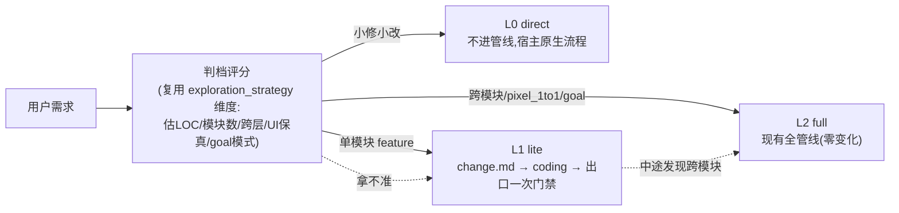
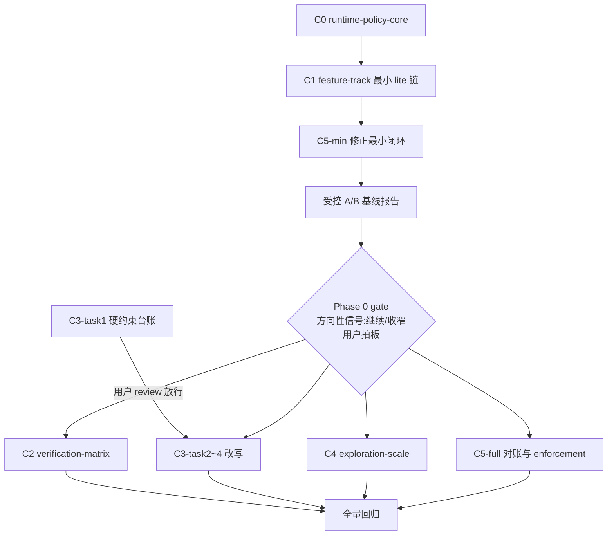

# framework 轻量化重构 — 分档工作流与验证收敛（maison 3.0.0）

## 版本绑定（BLOCKER 合规）

- **3.0.0 窗口已于 2026-07-07 由用户打开**（`package.json.version` = 3.0.0，用户自行 bump 并摘除本 plan 与 android plan 的 `deferred_to`）；本 plan 为**在窗 plan**，按 [AGENTS.md](AGENTS.md) semver 表属 **major**（超大型框架重构），与窗口级别相符。
- **与 android 工程适配（plan 5e3400c3，同窗 3.0.0）按先后序实施**：本重构先行，android 基于瘦身后契约开工（用户已定顺序 2026-07-06）。Phase 0 构成可独立发布的最小增量，若窗口体量超限可拆小版本先出（由用户拍板）。
- 版本号变更仍由用户控制；`release:check-plans` 自窗口打开起对本 plan 生效——3.0.0 发版前本 plan todos 须全 completed 或显式顺延。

## 背景与量化基线（为什么重；2026-07-06 复测口径）

| 项 | 实测（含口径） | 病灶 |
|---|---|---|
| harness | 272 个 TS 文件 / 83,217 行；剔除 `harness/tests/` 后 157 文件 / 52,605 行 | 治理系统 ≈ 被治理工程体量（目标工程几万~10 万行） |
| skill 正文 | 10 个 SKILL.md 共 **4,939** 行（business-ut 843 / plan 772 / catalog-bootstrap 654 / coding 600 均超 Anthropic 建议的 <500 行）；含 reference/prompts/templates 的 skills/ 全树 md **7,012** 行 | 真病灶不止行数，而是"进阶段前完整阅读正文+addendum+N 个 reference（BLOCKER）"的**强制全读门禁**，直接违背 progressive disclosure 的条件加载 |
| 硬约束 | 6 个 feature skill 426 行含 BLOCKER/禁止/必须（按行计；逐次出现宽口径 ~630）；入口模板 [templates/AGENTS.md.template](templates/AGENTS.md.template) 278 行 48 处（注意区分仓根 AGENTS.md 140 行——评审曾混淆两文件） | 多轮 fake-pass 军备竞赛单调累加，规则只增不减，边际遵守率递减 |
| 闭环凭证 | 每阶段 4 重：trace.json + 脚本零 BLOCKER + verifier PASS + receipt（[check-receipt.ts](harness/scripts/check-receipt.ts) :333 verifier 必 PASS、:365 trace 必在、:402 context_exploration 必有——全部硬编码必需） | 按"内网弱模型会说谎"设防，对交互态强模型是固定税；verifier 子 agent 每阶段重读全上下文 |
| 探索 | spec Research Sub-Phase / plan 探索 / coding 架构认知各自落盘 per-phase context-exploration.md，且 receipt 对**每个** feature phase 都要求该文件 | 同一批工程事实（glossary/catalog/architecture）读 3~6 遍 |
| 强制 DAG | catalog+glossary → spec → … → testing | 1~3 模块小工程里 catalog/glossary/code-graph 信息量趋近零，仍是硬前置 |
| 运行时枚举 | feature phase 集合 `spec|plan|coding|review|ut|testing` 硬编码于 8+ 处（见 C0 收编清单） | 任何新档位/新 phase 都会"入口认、运行时不认"——分档的第一性障碍 |

业界对照（引述已一手核实，来源：[Fowler/Böckeler：Understanding SDD](https://martinfowler.com/articles/exploring-gen-ai/sdd-3-tools.html)、[Anthropic Agent Skills](https://www.anthropic.com/engineering/equipping-agents-for-the-real-world-with-agent-skills)、[OpenSpec](https://github.com/Fission-AI/OpenSpec/)、[superpowers](https://github.com/obra/superpowers)）：Kiro 对小 bug 生成 4 用户故事+16 验收标准 = "sledgehammer to crack a nut"；spec-kit 的 markdown 审阅时间超过直接结对编码；**"有效的 SDD 工具必须为不同规模/类型的变更提供不同核心工作流"**；Anthropic 三层渐进披露 + 互斥场景拆文件 + 确定性工作交脚本；OpenSpec 无阶段门禁、产物随时可改；superpowers 零 harness、测试红绿即门禁。

**诊断**：maison 把「开发方法论」与「弱模型防作弊」焊死，且重量是静态的而变更风险是动态的。**重构主张：过程自由 + 出口严格——方法论层按档位伸缩，防作弊层收敛为出口门禁且永不降档。**

## 核心理念：重量 = f(track, evidence_profile, headless)

目标运行形态（codex review 的管线表述，采纳为北极星）：

```
request → 判档(risk classifier) → direct | lite | full
        → context assembler(facts 复用) → implementation
        → deterministic gates(恒开红线) → evidence summary(按档叠加)
```



三个不变式：

1. **默认零变化**：未声明 track = `full`、未声明 `evidence_profile` = `strict` → 现有 hmos-app 全部行为与夹具零回归。
2. **headless 恒 strict**：`evidence_profile` 降档只作用于交互态；goal-mode / headless 运行时强制 resolve 为 strict（无人值守下自报无效是多轮视觉实测的硬学习；lite track 两模式都可跑，但 headless 下 exit 门禁证据强制保留）。
3. **防作弊红线不随任何档位降级**；判档拿不准时**保守缺省进 lite**（L0 无 gate 兜底，误降风险不对称，路由文本必须写死这个缺省）。

**两个自由度轴（用户使用反馈增补，2026-07-07）**：纵向 = 新需求入口选多重的流程（track，C1）；横向 = 进行中 feature 的修正从哪层重入（correction routing，C5）。横向轴的两个核心认知：**修正不是阶段，是横切操作**——正确设问不是"重走哪些 phase"而是"根因在哪层产物"；**重验 ≠ 重做**——门禁是便宜的跨产物校验器，修正 = 改根因层 SSOT + 级联重跑下游门禁，不重新生产上游产物。

## 交付文档集（本文件即 master plan + 7 OpenSpec change）

OpenSpec 承载框架自身演进（[AGENTS.md](AGENTS.md) OpenSpec 节）。每个 change 须过 `npm run openspec:validate`。

| change | 阶段 | 内容 | 依赖 |
|---|---|---|---|
| **C0 `runtime-policy-core`** | Phase 0 | track / evidence / phase-chain 三判定单点化 + 枚举收编 | — |
| **C1 `feature-track`** | Phase 0 | 分档基座 + lite 最小可执行链 | C0 |
| **C3-task1（`skill-slim` 前半）** | Phase 0 | 硬约束台账（无行为变更），停等 review | — |
| **ab-eval**（OpenSpec change，九轮补位 owner） | Phase 0 gate | usage schema + usage_capture + model_identity + 受控 A/B 报告 | C1 + C5-min |
| **C2 `verification-matrix`** | Phase 1 | 证据档位收敛 | C0/C1 + gate |
| **C3-task2~4（后半）** | Phase 1 | 主干化改写 + 入口瘦身 + 防再膨胀 lint | 台账放行 + C1 |
| **C4 `exploration-scale`** | Phase 1 | 探索共享 + 小工程裁剪 | C0 + gate |
| **C5 `correction-routing`** | **C5-min = Phase 0** / C5-full = Phase 1 | 修正路由：根因分层 + 级联重验 + enforcement matrix | C5-min: C0/C1（default strict）；C5-full: +C2 |

---

## C0 · runtime-policy-core（新增，其余 change 的共同地基）

**动机（codex review P0，已逐处坐实）**：feature phase 集合与闭环判定散落多处硬编码——新增 lite 阶段链或条件化凭证时，会出现"runner 放行、Stop hook / check-receipt 继续阻断"的 split-brain。

**三个判定（纯函数，新模块 `harness/scripts/utils/runtime-policy.ts` 或同级）**：

1. **路由与判档分层（codex 三轮 P1 采纳）**：入口 `classifyRequestRoute()` → `direct|feature`——L0 direct 是**入口路由决策**（无 featureDir、不建 feature、不进管线），不做成假 track；进入 feature 后 `resolveFeatureTrack(featureDir, config)` → `lite|full`（读 feature.yaml，缺省 full）；
2. `resolveEvidencePolicy(track, runtimeContext, config)` → 各凭证（verifier/receipt/trace/exploration）的 **policy 档** `required|optional|off|not_applicable`（**纯函数不读文件**——`provided` 是校验后事实、属校验层，见 C2 两层分离；headless/goal 强制 strict）。**`runtimeContext` 显式类型契约（codex 二轮 P2 采纳，列入 C0 验收）**：`mode: interactive|headless|goal`、`adapter`、`phase`、`workflow`、`can_prompt_user`、`can_collect_usage`——避免"headless 恒 strict"散落 runner / goal-runner / adapter 各自实现；
3. `resolvePhaseChain(workflow, track)` → 该 track 的合法 phase 集与 requires DAG（含 auto_chain 投影）。

**枚举收编清单（迁移为消费 workflow 合法集/C0 输出；逐处已 grep/逐行核实）**：

| 位置 | 现状 |
|---|---|
| [check-receipt.ts:57-59](harness/scripts/check-receipt.ts) | `type Phase` + `VALID_PHASES` 硬编码 6 phase |
| [phase-transition-policy.ts:11/:27](harness/scripts/utils/phase-transition-policy.ts) | `FeaturePhase` + `FEATURE_PHASE_ORDER`（goal-runner 批量授权解析消费） |
| [trace.schema.json:34](harness/trace/trace.schema.json) | `phase.enum` 硬编码 → 改 pattern + runner 侧按 workflow 合法集校验 |
| harness/compat-loader.ts、scripts/backfill-context-exploration.ts、scripts/utils/context-exploration.ts、exploration-strategy.ts、goal-progress.ts、phase-alias.ts | 同型枚举（grep 坐实 8 文件） |
| [agents/claude/templates/hooks/check-phase-completion.mjs](agents/claude/templates/hooks/check-phase-completion.mjs)、record-verifier-report.mjs | Stop hook 下发件内嵌闭环判定，改为读 state/config 内 policy 快照（下发件不 import harness 模块，快照由 runner 写入 `.current-phase.json`）。**快照带 `schema_version`；hook 读不到快照/版本不符/runner 未写成功时 fail-safe 回 strict 全凭证**（宁可多设防不可静默放行——cursor 二轮采纳；降级路径入夹具） |
| [goal-runner.ts / goal-monitor.ts / goal-status.ts](harness/scripts/goal-runner.ts) | phase chain / halt 分类消费 |

**验收**：收编为纯重构——C0 合入后全 fixture 零变化（default full+strict 下三判定输出与现状逐一等值，用契约单测锁死）。

---

## C1 · feature-track（分档基座）

### 设计决策：feature 级 track，单 workflow 内过滤

- [specs/workflow-schema.json](specs/workflow-schema.json) 增 `artifacts[].tracks`；**缺省语义（codex 一轮 P1 采纳）**：`scope: feature` 的 phase 缺省 `tracks: ["full"]`——**lite 成员资格必须显式标注**，防 fork workflow 的新 phase 静默漏入 lite；`scope: global` 的 phase 缺省对全 track 适用。
- **依赖表达（codex 二轮 P1 采纳，弃用"被过滤即降空"的隐式语义）**：增可选 `artifacts[].requires_by_track`——同一 phase 在不同 track 下依赖不同（现状硬点：coding `requires: [plan]`([spec-driven.workflow.yaml:71](workflows/spec-driven.workflow.yaml))，lite 下须 `requires_by_track.lite: [change]`）；未声明该字段的 track 沿用 `requires` 并对被过滤 phase 降空，**仅限无 lite-only 上游的简单情形**，否则 schema 校验 FAIL 要求显式声明。
- [workflows/spec-driven.workflow.yaml](workflows/spec-driven.workflow.yaml) 增 lite 链：`change`（产 change.md，标 `tracks: ["lite"]`）→ `coding`（标 `["full","lite"]`，`requires_by_track.lite: [change]`）→ `exit`（标 `["lite"]`）；新 phase id 经 C0 注册进全部运行时（trace/receipt/Stop hook/goal-runner 不再各持枚举）。
- **auto_chain 分轨（codex 二轮 P1 采纳）**：`auto_chain`(:12) 升级为 `auto_chain_by_track`——`full` 沿用现有序列，`lite: [change, coding, exit]` **必须显式声明**（存在 lite-only phase 的 workflow 缺该键即 schema FAIL）；C0 `resolvePhaseChain` 只做一致性校验（链与 DAG/tracks 互洽），**不做隐式推导**，防 runner / goal-runner / goal-status 各自猜链；schema + fixture 锁死。
- **schema 版本策略（codex 三轮 P2 采纳，坐实）**：[workflow-loader.ts](harness/workflow-loader.ts) 现硬拒非 `"1.0"`(:119)——tracks / requires_by_track / auto_chain_by_track 随 **`schema_version: "1.1"`** 落地，loader 兼容读 1.0（旧 workflow 全量视作 full 单轨）与 1.1，防实施第一刀被版本门禁卡住。
- **feature 级声明**：`doc/features/<feature>/feature.yaml`（先例：per-feature `compat.yaml`）承载 `track`、判档评分快照、确认记录；[harness/config.ts](harness/config.ts) 增 `loadFeatureTrack()`（实现委托 C0）。**路径约束（round7 path-governance 后的新前置，2026-07-07 复核）**：feature.yaml / change.md / facts.md / `.current-correction.json` 的 feature 侧路径一律经 `paths.features_dir` 解析（featureArtifactPath 三通道，commit 1f875c24/b4aa7290），**禁止硬编码 `doc/features/`**——勿把 round7 刚消灭的问题带回来。

### 三档产物与管线契约

| | L0 direct | L1 lite | L2 full（现状） |
|---|---|---|---|
| 触发 | 小修小改/文案/单文件 bug | 单模块 feature、无 pixel_1to1 | 跨模块 / pixel_1to1 / goal-mode 默认 |
| 叙述产物 | 无 | `change.md` 单文档（意图/scope/术语快查/验收清单/关键契约/任务 checkbox） | spec.md + plan.md + contracts + acceptance + … |
| 管线 | 不进管线 | `change` → `coding` → `exit`（一次门禁） | 6 阶段全链 |
| 门禁 | 无（可选宿主编译/测试） | exit 一次跑：编译 + lint + `diff_within_scope` + 验收 checkbox 全勾 +（acceptance 有 unit 条目时）UT | 每阶段 4 重闭环 |
| 凭证 | 无 | change.md checkbox + exit 报告（headless 下即硬证据） | trace + receipt + verifier |

- **判档**：[spec-rules.yaml](specs/phase-rules/spec-rules.yaml) `exploration_strategy`（:555）维度上抬为通用 track 评分，增"UI 保真意图"与"goal 模式"一票升 full 项；agent 提议 + `feature.track` gate 确认（登记 [confirmation-registry.yaml](skills/reference/confirmation-registry.yaml)，过 `check-skills-confirmation-ux`）。
- **中途升档**：lite 实施中 scope 越界/跨模块信号 → 停下走升档确认，feature.yaml 记录事件，change.md 作 spec/plan 种子输入。
- **L0 路由**：只改 [templates/AGENTS.md.template](templates/AGENTS.md.template) 入口路由文本，**写死保守缺省"拿不准就进 lite"**（cursor review 采纳：L0 无 gate 兜底，误降不对称）。**L0 最小纪律（codex 二轮采纳）**：不进管线 ≠ 不验证——仍须遵守用户显式要求与项目**原生**校验（相关 test/lint/build），路由文本一并写明。
- **新检查**：`harness/scripts/check-change-lite.ts`（change.md 章节存在性 + scope 模块名合法 + checkbox 语法）；`exit` 复用现有 coding 检查子集 + UT 条件项。
- **skills 索引**：[skills.index.yaml](skills/skills.index.yaml) 增 `feature/change-lite` 入口 skill（正文按 C3 新规 ≤150 行）。
- **fixtures**：lite 契约基线（PASS + 坏态：checkbox 未勾/scope 越界/UT 缺失）。

---

## C2 · verification-matrix（证据档位收敛）

### evidence_profile 旋钮（codex P1 采纳：弃用 agent_trust 命名——可信的不是模型，是运行上下文+可审计出口）

[templates/framework.config.template.json](templates/framework.config.template.json) + [specs/framework.config.schema.json](specs/framework.config.schema.json) 增顶层可选段：

```jsonc
"evidence_profile": "strict"   // strict(缺省,=现状) | balanced(交互态强模型)
```

- 缺省 `strict` → 现有行为零变化；`balanced` 仅用户显式声明。**`minimal` 是 lite track 的 resolved 结果，不可全局声明**（防滥用）。
- **headless/goal-runner 运行时强制 resolve 为 strict**（即便 config 写 balanced）——实现在 C0 `resolveEvidencePolicy`，不靠 skill 文本自觉。

### 证据矩阵（SSOT 落 C2 spec，唯一消费入口 = C0）

| track × profile | 脚本门禁 | LLM verifier | receipt + trace |
|---|---|---|---|
| full × strict | 必跑（现状） | 必跑（现状） | 必跑（现状） |
| full × balanced（交互态） | 必跑 | 仅 {spec, coding} 保留（已拍板），其余跳过（可 config 覆写） | receipt 保留（跨会话 resume 语义），trace 降 opt-in |
| lite ×（任意，resolved=minimal） | exit 一次必跑 | 不跑 | 无 per-phase receipt；闭环态 = change.md checkbox + exit 报告 |

### 关键改造点（收编清单已逐行核实）

- [check-receipt.ts](harness/scripts/check-receipt.ts)：`:333` verifier 必 PASS、`:341` invoked_via、`:365` trace_json、`:402` context_exploration、`:551` self_check.q1 五个硬必需块改为按 policy 分派；lite feature 返回显式 `not_applicable`（exit 0 + 机读标注），跨会话 Resume Gate 不误判。
- **机读契约（codex 二轮 P1 + 三轮 P1 分层修订）**：**policy 与校验两层分离**——policy 层（C0 纯函数输出）`required|optional|off|not_applicable`；校验层（receipt/state 落盘）`validation_status: provided|missing|skipped_by_policy|not_applicable`。receipt frontmatter 与 `.current-phase.json` 的 `evidence_policy_snapshot` 记两栏——"receipt 保留但 trace opt-in 关闭"等组合有稳定校验判据，不靠散文 N/A；快照契约与 C0 的 fail-safe 语义（读不到/版本不符→strict）共用 schema。
- [phase-completion-receipt.md](harness/templates/phase-completion-receipt.md)：模板字段按 policy 分节（strict 全填；balanced 省 verifier 节的 phase 标注 N/A 语义）。
- [harness-runner.ts](harness/harness-runner.ts)：closure 计算（:664，现状硬等 `receiptValidation?.status === 'passed'`）、next_step `run_verifier_then_receipt`（:776）改查 C0 输出。**闭环状态映射（codex 三轮 P2 采纳）**：closure 来源按 policy 分派——full = receipt `passed`；lite = exit 报告 PASS + checkbox 全勾（check-receipt 返回 `not_applicable`，exit 0 但**不映射为 receipt-passed**）；Resume Gate 对 `not_applicable` 走 lite 闭环判据，绝不误当普通 PASS；`check-receipt exit 0 / skipped_by_policy / closed-by-exit-report` 三态在 state 快照显式区分。
- **Stop hook**：`.current-phase.json` 增 track + evidence policy 快照字段（缺省按 full+strict 解释旧 state，沿用 grace/ttl 治理，无 schema 破坏）；下发 hook 读快照判放行。
- **fixtures**：矩阵各象限契约夹具（full×balanced 的 verifier 保留集、headless 强制 strict、lite not_applicable、旧 state 兼容）。

### 不降档红线（机器可查清单，单测锁死）

1. `framework_integrity` 防漂移；2. 伪签/验真链（视觉判定 build 指纹绑定、`asset_crop_validation` 独立辨认、`signed_by` 自签拦截、进程注入自净）；3. `diff_within_scope`（lite 在 exit 跑）；4. goal-mode halt-confirm 与凭证链。

---

## C3 · skill-slim（瘦身 + 规则收敛）

### task 1 —— 硬约束普查台账（Phase 0 先行，停等用户 review）

**范围（cursor review 采纳修订）：全部 10 个 SKILL.md**——含 project 级 [catalog-bootstrap（654 行，全仓第 3 重）](skills/project/catalog-bootstrap/SKILL.md)、framework-init、code-graph、goal-mode（对齐用户"前置也笨重"的原始抱怨）——**+ [templates/AGENTS.md.template](templates/AGENTS.md.template) 48 处**。四分类同前（A 脚本已执行→缩为一句+报错自解释 / B 纯文本纪律→合并 / C 事故补丁→原则化 / D 过时重复→删），逐条旧文→新落点映射。**未获用户放行不得进 task 2。** **防漂移锚定（2026-07-07 复核增补）**：台账条目以「skill id + 约束语义指纹」锚定而非行号——3.0.0 窗口内 skill 文本仍会被其它批次改动（round7 一次性重排全部 6 个 feature SKILL ±950 行即先例）；C3-task2 开工前对台账跑一次 refresh diff。

### task 2 —— SKILL.md 主干化（Phase 1）

每个 SKILL.md 重构为 **≤150 行主干**（触发/输入/流程骨架/门禁清单表/产物契约）+ reference 条件加载："完整阅读 X（BLOCKER）"→"当 <场景> 时读 X"。主干开头即 track 路由（lite 走 change-lite，不载入 full 正文）。

> 口径说明：Anthropic 官方建议 body <500 行，现有 4 个 SKILL.md 超标；≤150 是**比业界更激进**的主干+条件加载架构（不是"回到业界标准"）。150 为已拍板值；Phase 0 A/B 报告会给出实际 token 影响数据供复核，**改动阈值须用户再拍板**。
>
> **分级预算提案（cursor 二轮，随台账交拍板）**：一刀切平值对 10 个差异极大的 skill 可能过于均质（business-ut 843→150 = -82%）；task 1 台账将按 skill 复杂度评估是否分级（150 基准；business-ut / plan 等复杂 skill 是否放宽 ≤250），提案随台账一并提交用户拍板——**未获批前 150 为唯一基准**。

### task 3 —— 入口模板瘦身（Phase 1）

[templates/AGENTS.md.template](templates/AGENTS.md.template) 278 行 → **≤120 行**：路由表（含 L0/L1/L2 分流 + "拿不准进 lite"缺省）+ 红线清单 + SSOT 链接；细则移 framework 内 reference。各 adapter 跳板核对"只跳转不扩写"。

### task 4 —— 防再膨胀 lint（Phase 1）

[check-docs.ts](harness/scripts/check-docs.ts) 增源仓门禁：`skill_body_max_lines` + "强制全文阅读"句式黑名单（新增须进 allowlist 说明理由）。**规则库从"只增不减"转向"增必有出口"的结构性保证。**

---

## C4 · exploration-scale（探索共享 + 小工程裁剪）

### per-feature 探索共享（codex P2 采纳修订：覆盖全部 feature phase）

- 新契约：`doc/features/<feature>/context/facts.md` —— 由**该 track 的首个 feature phase 建立**（codex 四轮采纳：full=spec、lite=change；Code Facts + key_inputs_read），**后续所有 active feature phase（full 含 review/ut/testing、lite 含 coding/exit）以 `phase_delta` 增量节追加**，不重做全量探索；lite 下 facts 的必需档位由 evidence policy 决定。依据：receipt 对每个 phase 都硬要求 context_exploration（[check-receipt.ts:402](harness/scripts/check-receipt.ts)），只改 spec/plan/coding 会留下 review/ut/testing 的断层。
- receipt 的 `context_exploration` 凭证经 C2 policy 指向 `facts.md#phase_delta`；exploration 相关 phase-rules 改为"facts 存在 + 本阶段增量节"校验；`exploration_strategy` 评分只在 spec 首建全额执行。
- 兼容：旧 per-phase context-exploration.md 可读；[backfill-context-exploration.ts](harness/scripts/backfill-context-exploration.ts) 扩展为可归并旧布局（对齐 compat protocol v1）。

### 小工程裁剪（scale 档位）

- config 增可选 `project_scale: small | standard`（缺省 standard = 现状）；framework-init 按 catalog 模块数（阈值 ≤3，已拍板）与代码量建议档位，用户确认写入。
- `small` 档：术语消歧降为一次性对照 architecture.md 确认（映射表仍产出、免逐行 gate，glossary 允许最小种子）；`module-graph` 默认禁用——`config.phases_disabled ∪ profile.phases_disabled` 取并集，经 [profile-loader.ts](harness/profile-loader.ts) `normalizePhaseDisabled`(:223) / `isPhaseDisabledByProfile`(:231) 与 C0 `resolvePhaseChain` 统一裁剪 phase set（codex 二轮 P2 采纳，落点已核实）；catalog 卡片精简字段集。
- scope 声明与 `diff_within_scope` 在 small 档不变（红线）。

---

## C5 · correction-routing（修正路由——第二自由度轴）

**动机（用户使用反馈坐实，2026-07-07）**：正常推进走 skill 管线，中途出问题改用自然语言修正——该回合往往**不加载任何 SKILL.md**：per-skill 的 9 处"会话内硬边界/前置闸门"（spec 2 / plan 3 / coding 3 / code-review 1）全是单向防御且此时不在场；入口 §4 路由表只覆盖正向意图；harness 无 correction 概念（均已核实）。强模型隐式做根因分层尚可，弱模型无决策程序即脱缰；用户自己也无法回答"该重走 spec→plan 还是直接 coding"——因为这是错误设问。

### 修正三问（Phase 0 随 C1 落入口路由表，纯文本 ≤15 行）

| 问 | 是 → 落点层 |
|---|---|
| Q1 需求/验收本身变了？ | spec（spec.md / acceptance.yaml） |
| Q2 需求没变，接口/契约/设计要变？ | plan（plan.md / contracts.yaml） |
| Q3 上游都没错——要改产品代码？ | 是 → coding；否（纯补验证）→ ut / testing |

输出 `{落点层, 最小重验集}`；模糊请求（"这里不对帮我看看"）**先诊断根因再分类**；**禁止未分层直接动产物**。修正三问是唯一保证"规则在场"的位置——常驻入口，对强模型是几十 token 开销，对弱模型是缰绳。

### C5-min（Phase 0 —— 最小机器闭环，codex 七轮 P1 采纳前移）

> 只有三问文本不足以解决痛点（弱模型可能不读入口路由表），且 A/B 需要"old flow vs C5 flow"的修正样本对照——故最小机器件随 Phase 0 落地。**依赖钉实（codex 八轮 P1）：C5-min 只依赖 C0/C1，Phase 0 按 default strict 全凭证运行；C5-full 才消费 C2 的 evidence matrix。**

1. **前置归属解析（不允许"先编辑后归属"，codex 七轮 P1）**：`resolveCorrectionTarget(request, activeState, proposed_files?)` → feature(s)——在**任何编辑发生前**解析归属；无法确定时先向用户确认，或显式进入 no-feature correction 模式（执行载体见第 8 条 `--adhoc-correction`；案例：半模态修复同时动两入口并删平行实现文件即属跨 feature）。"按 diff 经 catalog 反查"降级为**收尾对账**手段（核对 declared ↔ 实际），不作为首次归属来源。
2. **runtime-policy 模块增 correction resolvers**（`resolveCorrectionTarget` / `classifyCorrection` / `resolveEnforcementTier`，扩展 C0 判定集合、同守纯函数与等值不变式）：`classifyCorrection(request, featureState)` → `{root_layer, touched_layers[], revalidate[]}`。
3. **级联重验规则（重验 ≠ 重做）**：落点 L → L 及下游**已闭环** phase 的**脚本门禁**重跑（秒级；术语↔scope、contracts↔代码、acceptance↔UT 不一致自会红）；receipt 走既有 stale 指纹刷新、lite 天然只有 exit。**Phase 0 按 default strict 全凭证重验；"verifier 按 evidence policy（balanced 可省）"的减免语义随 C5-full 接入 C2 后生效**——"脚本门禁为主"到实施不得变形（cursor 七轮 watch-point）。
4. **修正确认 gate**（登记 confirmation-registry）：agent 报"root_layer + touched_layers + 重验集 + 理由"，`1=同意 / 2=改层`；strict 必确认，headless 低置信 halt-confirm（与 goal halt 同构）；balanced 高置信免确认为 C5-full 语义。
5. **完成前自检命令**：`--correction-check`（或并入 `--sync-closure`）——读 `.current-correction.json`（第 7 条），对照 revalidate 清单核查各门禁已重跑且绿；无物理 hook 的 adapter 靠它 + 入口 completion checklist 收口。
6. **验证转嫁禁令**：revalidate 指向 testing 而宿主无真机/hylyre 能力、或 feature 无 device 层验收可派生时，须显式声明 evidence 缺口并 halt-confirm（"需要人工验证：<具体清单>"）——**"请在真机上试一下"不得作为正常收尾**；转嫁验证是 evidence 缺口，不是完成。
7. **最小持久化状态（codex 八轮 P1）**：`harness/state/.current-correction.json`——`{feature?, root_layer, touched_layers[], revalidate[], status}`（no-feature 时 feature 为空）；为 `--correction-check` 提供跨回合 / soft 档下的稳定输入。feature.yaml 修正历史 append 与完整对账扩展留 C5-full。
8. **no-feature 执行载体（codex 八轮 P1，坐实：[harness-runner.ts:287](harness/harness-runner.ts) 非全局 phase 无 `--feature` 即 exit 1）**：新增 **`--adhoc-correction`** 专用入口——读 `.current-correction.json`，跑 coding 出口门禁子集（编译/lint/diff 检查）+ testing 即席派生；**不建临时假 feature 目录**。
9. **最小 enforcement 分档判定（codex 八轮 P2）**：读 adapter capability 判档并按档声明行为——Phase 0 即生效，release notes 的分档声明有真实依据；hook 深度集成留 C5-full：

| 档 | adapter | 修正闭环保证 |
|---|---|---|
| `hard_hook` | claude 系（Stop/SubagentStop hook） | 物理拦截：未重验即宣布完成 → hook 拦 |
| `headless_runner` | goal-runner | runner 内置对账 + halt-confirm |
| `soft_rule_only` | cursor / generic | 软约束：三问 + 完成前 checklist + `--correction-check` 自检；**文档与剧本不得宣称"Stop hook 一定拦"**（[agents/README.md:185](agents/README.md) 坐实无物理层） |

### C5-full（Phase 1，依赖 C2）

10. **对账兜底（touched_layers 语义，codex 七轮 P1 修订）**：correction 状态并入 C2 `evidence_policy_snapshot` 机制做完整对账——**只拦"未声明的 touched layer"**：声明仅改 spec/plan 却出现 code diff → 拦；声明含 coding 的组合修正（改 spec 同轮把代码修到新契约）→ 放行但必须重验 coding 及下游。
11. **hard_hook 档深度集成 + 修正历史**：Stop/SubagentStop hook 与 `.current-correction.json` 联动拦截；修正记录 append 进 feature.yaml，不造新文件；balanced 减免语义（verifier 可省、高置信免确认）随 C2 接入生效。
12. 坏态 fixtures 全套：分类错误 / 声明 spec 却改代码 / 组合修正漏重验 / 无归属直改 / soft 档 checklist 缺项 / correction 状态缺失或过期。

**界限（诚实声明）**：不追求 100% 路由正确，追求"错了被便宜地拦住"——确认闸 + 对账兜底两道保险；坏态 fixtures 覆盖分类错误路径。

---

## 实施顺序与验收



- **Phase 0 = 最小可发布增量**（cursor review 采纳）：C0 + C1（lite 链可跑）+ **C5-min（修正最小闭环）** + C3-task1 台账 + A/B 基线。此时消费者已可用 lite track 与修正路由主链，且"token 有没有正收益"有了第一份数据——**不在"假设笨重有害"的前提下做完全部重构再回头验证**。Phase 0 的 release notes 须声明修正路由的 enforcement 分档（cursor/generic 为软约束档）与 C5-full 补齐计划（cursor 七轮 watch-point）。
- **Phase 0 gate（定位=方向性信号，二轮双评审采纳）**：A/B 报告 + 台账经用户 review，决定**继续 / 收窄**（C2 verifier 保留集、C3 主干预算、C4 是否全量）；n≤3 样本不承担"最终阈值证明"，阈值微调在 Phase 1 内随夹具滚动、由用户拍板。
- 每 change 完成即跑：`cd harness && npm test` 全绿 + `npm run openspec:validate` + `npm run release:verify`。
- **最终验收**：hmos-app 默认路径零回归（现有全部 fixture 不改而绿）；lite 全链 PASS + 坏态逐一拦截；矩阵各象限夹具绿；C3 行数 lint 生效且台账映射齐；A/B 对照报告产出。

### 受控 A/B 收益验证（ab-eval，Phase 0）

- **前置任务（codex P1 采纳）**：[trace.schema.json](harness/trace/trace.schema.json) 现仅 model_backend 元信息（:37）无 usage——增可选 `usage` 段（`input_tokens/output_tokens/tool_tokens/requests/cost_estimate`）+ 分 adapter 采集策略按 `usage_capture` 声明（api/sidecar 优先）；交互 adapter best-effort 自报 + wall-time/tool_calls 代理指标（采不到 token 时对照仍可基于代理指标，报告须标注口径）。**model_identity_capture（codex 四轮采纳）**：A/B 报告须机器固化 resolved provider/model（manifest/report 记录，非 agent 自报）；拿不到 usage 或 model 身份时，只能以代理指标表述，**不得声称"同模型 token 对照"**。
- 样本 **4 类必含、各 ≥1**（简单 bugfix / 单模块 feature / 跨文件中等 feature / **进行中 feature 的 NL 修正**——第 4 类对照臂为 old flow vs C5 flow 而非 lite vs full，观测 token、重验命中、验证是否转嫁）；某类确不可复现时报告显式标注缺失，**gate 不得声称覆盖该类收益**（修正路由类缺失即不得下修正路由结论——十轮 codex 采纳）。× 同模型**分开独立跑**（不得全量顺序跑计时——缓存/warm 假象已被证伪过），记录 token/轮次/门禁命中/缺陷数。
- **token 保真（cursor 二轮采纳，四轮措辞收口）**：A/B 双臂均以 headless goal-runner 执行，按 adapter `usage_capture` 声明采集真实 usage（api/sidecar 优先）；交互态体验单独另验，不承载"token 正收益"这一核心结论。
- **采集能力契约（codex 三轮 P1 采纳，坐实：`AgentInvokeResult`([agent-invoke.ts:558](harness/scripts/utils/agent-invoke.ts)) 无 usage 字段、adapter schema 无 usage 声明位）**：adapter goal capability 增 `usage_capture: none|stdout_json|stderr_regex|sidecar|api` 声明，采集按声明实现；`none` / 采集失败时**只能出代理指标报告**（wall-time/tool_calls），一律不得承载 token 正收益结论。

### 与 android plan（5e3400c3）的衔接

- android C1 的 profile-addendum / skill-assets 按 **C3 瘦身后契约**编写；android 验收含 lite track 试点（单模块 feature 走 change→coding→exit）。
- 上述两点已经用户同意（2026-07-06）直接写入 android plan 正文（「前置依赖」节 + C1 资产/验收表述 + c1 todo 同步），android 开工时无需再确认。

## 已固化决策

1. 档位是 **feature 级**（`feature.yaml`），单 workflow 内按 `phase.tracks` 过滤；不搞工程级双 workflow。
2. 默认值全部等于现状（track 缺省 full、evidence_profile 缺省 strict、scale 缺省 standard）→ 消费者升级零迁移动作。
3. 证据降档只作用于交互态；headless/goal 运行时强制 strict——无人值守自报无效是已证伪多轮的硬学习。
4. 防作弊红线不进矩阵、恒开启，清单机器可查。
5. L0 不造新机制：入口路由文本 + 不进管线；**判档拿不准保守缺省进 lite**。
6. 规则收敛"先台账、后动笔"，台账停等用户 review；删改逐条留旧文→新落点映射。
7. track/evidence/scale 全部由 config / workflow / feature.yaml 声明驱动，消费者不改 framework 文件。

## 已拍板决策（用户确认 2026-07-06，续前节编号）

8. **窗口**：3.0.0 与 android 共享，本重构先行。
9. **lite exit 的 UT 定位**：acceptance 有 unit 层条目时必跑，否则不强制。
10. **small 档 catalog 模块数阈值**：≤3。
11. **skill 主干行数上限**：150（入口模板 120）；A/B 数据仅供复核，改动须用户再拍板。
12. **full×balanced 保留 verifier 的阶段集**：{spec, coding}（原表述 full×high；codex 建议旋钮改名 `evidence_profile`，语义与拍板内容不变）。

## 评审修订固化（codex/cursor review 采纳，2026-07-06）

13. 新增 **C0 runtime-policy-core**：track/evidence/phase-chain 三判定单点化，收编 8+ 处运行时枚举；C1/C2/C4 只消费不自判。
14. `tracks` 缺省语义：feature phase 缺省 `["full"]`、lite 显式标注；global phase 缺省全 track 适用。
15. 旋钮命名 `agent_trust` → **`evidence_profile: strict|balanced`**（minimal 为 lite resolved 档，不可全局声明）。
16. **A/B eval 前移为 Phase 0 gate**；前置补 trace usage schema 与分 adapter 采集策略。
17. C3 台账范围扩至全部 10 个 SKILL.md（含 project 级）+ 入口模板。
18. C4 facts.md 覆盖全部 feature phase（phase_delta 增量），与 receipt context_exploration 凭证联动。

## 二轮评审修订固化（codex/cursor re-review 采纳，2026-07-06）

19. workflow schema 增 **`requires_by_track`** 与 **`auto_chain_by_track`**：lite 含 lite-only phase 时链与依赖**必须显式声明**，C0 只校验一致性、不做隐式推导。
20. **`evidence_policy_snapshot` 机读契约**：receipt frontmatter 与 `.current-phase.json` 记录每凭证项（枚举后经三轮 27 修订为 policy + validation_status 两层，以 27 为准）。
21. C0 `runtimeContext` 显式类型契约（mode/adapter/phase/workflow/can_prompt_user/can_collect_usage）列入验收；policy 快照带 `schema_version`，hook 侧读取失败/版本不符 **fail-safe 回 strict**。
22. A/B 样本扩为 **2~3 个不同性质**、**双臂均 headless goal-runner** 直采 usage；gate 定位方向性信号（继续/收窄），不由单样本定最终阈值。
23. **L0 最小纪律**：不进管线仍须守项目原生 test/lint/build 与用户显式要求。
24. `config.phases_disabled ∪ profile.phases_disabled`，经 profile-loader + C0 统一裁剪。
25. 主干预算**分级提案**（150 基准 / 复杂 skill ≤250）随 C3 台账提交用户拍板；未获批前 150 为唯一基准（决策 11 不变）。

## 三轮评审修订固化（codex/cursor 终轮采纳，2026-07-06）

26. **路由与判档分层**：`classifyRequestRoute()` → `direct|feature`（入口层）；`resolveFeatureTrack()` → `lite|full`（C0）——L0 不是 workflow track。
27. **policy / 校验两层枚举分离**：policy 档 `required|optional|off|not_applicable`（纯函数）；`validation_status: provided|missing|skipped_by_policy|not_applicable`（receipt/state 落盘）。
28. adapter goal capability 增 **`usage_capture`** 声明位；采不到 usage 只出代理指标报告，不得承载 token 正收益结论。
29. workflow **`schema_version` 升 "1.1"**，loader 兼容 1.0（旧 workflow 视作 full 单轨）。
30. **lite 闭环 ≠ receipt passed**：closure 来源按 policy 分派，`not_applicable` 三态显式映射，Resume Gate 不误读。
31. （四轮）facts.md 由 **track 首个 feature phase** 建立（full=spec、lite=change），后续 active phase 追加 phase_delta。
32. （四轮）**model_identity_capture**：A/B 须机器固化 resolved provider/model；拿不到 usage/model 身份不得声称"同模型 token 对照"。

## 用户增补固化（使用反馈，2026-07-07）

33. **修正是横切操作，不是阶段**：进行中 feature 的修正按根因分层（修正三问）定落点，禁止未分层直接动产物；"重走哪些 phase"是错误设问。
34. **重验 ≠ 重做**：修正后级联重跑"落点层及下游已闭环 phase 的脚本门禁"，不重新生产上游产物；重验集由机器算出（classifyCorrection），不再靠人判断。
35. 修正三问文本随 **Phase 0** 入口路由先行落地（规则必须在常驻入口才"在场"——NL 修正回合不加载 skill）；机器件拆分口径后经七/八轮修订：C5-min（含 classifyCorrection）已前移 Phase 0，Phase 1 仅余对账/hook 集成——**以 40、44~46 为准**。
36. 修正路由不追求全对，追求**错误被便宜拦住**：修正确认 gate（strict 必确认）+ 回合收尾对账（declared layer ↔ 实际 diff / 重验完成度）两道保险。
37. **归属 fallback**：修正 diff 无 feature 归属或跨 feature 时，按触及模块经 catalog 反查归属（多命中各自纳入重验集）；零命中至少跑 coding 出口门禁 + testing 即席验证并显式声明。
38. **验证转嫁禁令**：所需验证能力缺位时显式 halt-confirm 声明 evidence 缺口；"请用户在真机上试一下"不得作为正常收尾。
39. （七轮）**adapter enforcement matrix**：修正闭环保证分三档——hard_hook（claude）/ headless_runner（goal）/ soft_rule_only（cursor/generic：三问 + checklist + `--correction-check` 自检）；任何文档/剧本不得把"Stop hook 拦"写成通用保证。
40. （七轮）**C5-min 前移 Phase 0**：前置归属解析、classifyCorrection、重验清单、自检命令、转嫁禁令随 Phase 0 落地；touched_layers 对账与 hook 集成为 C5-full（Phase 1）。
41. （七轮）**归属解析前置**：resolveCorrectionTarget 在任何编辑前解析 feature 归属，禁止"先编辑后归属"；diff 反查仅作收尾对账。
42. （七轮）**touched_layers 语义**：对账只拦"未声明的 touched layer"；声明含 coding 的组合修正放行但必须重验 coding 及下游。
43. （七轮）A/B 增"进行中 feature 的 NL 修正"样本（对照臂 = old flow vs C5 flow）。
44. （八轮）**C5-min 最小持久化**：`harness/state/.current-correction.json`（{feature?, root_layer, touched_layers[], revalidate[], status}）为 `--correction-check` 的稳定输入；feature.yaml 修正历史与完整对账留 C5-full。
45. （八轮）**no-feature 执行载体** = `--adhoc-correction` 专用入口（coding 出口门禁子集 + testing 即席），不建临时假 feature 目录（harness-runner 非全局 phase 强制 `--feature`，:287 坐实）。
46. （八轮）**依赖钉实**：C5-min 只依赖 C0/C1、Phase 0 按 default strict；balanced 减免与完整对账随 C5-full 接入 C2；最小 enforcement 分档判定随 C5-min（release notes 分档声明的依据），hook 深度集成随 C5-full。
47. （九轮）**ab-eval 为独立 OpenSpec change**——Phase 0 gate 数据管线（usage schema / usage_capture / model_identity / 受控协议 / gate 报告）的唯一 owner。
48. （九轮）**--adhoc-correction 可执行契约**：输入=含 base_commit 的 correction state；changed-files=git diff base_commit ∪ 工作区；检查=compile+lint+架构规则+受保护前缀（替代 diff_within_scope，越界防护不豁免）；报告落 reports/_adhoc；testing evidence=device 即席或 manual_confirm。
49. （九轮）**correction state 防串会话**：增 created_at/session_id/base_commit/request_fingerprint/enforcement_tier/expires_at；session 不符或过期视 stale 拒绝（复用 phase-state session 治理）。
50. （九轮）**enforcement 判档 = 派生纯函数** `resolveEnforcementTier`（源=adapter 既有 settings_file/hooks 声明 + runtimeContext.mode）；不新增 adapter schema 字段、不按 adapter 名字硬编码。
51. （九轮）**C0 判定集合可扩展**：C5 的 correction resolvers 在同一 runtime-policy 模块扩展，同守纯函数与 default 等值不变式。
52. （十轮）**enforcement 判档优先级 mode 先行**：goal/headless 下即便 manifest 有 hooks 也判 headless_runner——Claude hook 在 MAISON_GOAL_HEADLESS=1 时旁路（check-phase-completion.mjs :631 坐实），误判 hard_hook 会夸大保证。
53. （十轮）**A/B 4 类样本必含**（各 ≥1）；某类不可复现须标注缺失且 gate 不得声称覆盖该类收益；proxy 态 usage 的 token 字段可空、代理指标复用顶层 tool_calls/时间戳推导（schema 不分叉）。

## 外部评审采纳记录（2026-07-06，动手前，逐条 ground-truth 核实）

- **codex P0-1（采纳，坐实）**：lite 链非可执行 workflow——[check-receipt.ts:57-59](harness/scripts/check-receipt.ts) `VALID_PHASES`、[phase-transition-policy.ts:11/:27](harness/scripts/utils/phase-transition-policy.ts)、[trace.schema.json:34](harness/trace/trace.schema.json) 硬编码逐处核实为真，另 grep 出 compat-loader 等 8 文件同型枚举 → 新增 C0 收编。
- **codex P0-2（采纳，坐实）**：check-receipt `:333/:341/:365/:402` 四硬必需块 + receipt 模板 verifier 节核实为真 → evidence policy 抽 SSOT，runner/check-receipt/Stop hook/trace/goal-runner 同源消费。
- **codex P1-3（采纳）**：tracks 缺省歧义 → feature phase 缺省 `["full"]`、lite 显式。
- **codex P1-4（采纳，坐实）**：trace.schema 无 usage 字段核实为真 → ab-eval 前置补 schema + 采集策略。
- **codex P1-5（采纳）**：`agent_trust` 改名 `evidence_profile`。
- **codex P2-6（采纳，坐实）**：receipt 对全部 phase 要求 context_exploration（:402）→ C4 facts 覆盖全 feature phase。
- **codex P2-7（不采纳弱化，改为补源）**：Fowler/Kiro 引述系本人 2026-07-06 一手 fetch 原文所得，cursor 亦独立核实"原文属实"；处置 = 背景节补可点击来源 URL，引述保留。
- **cursor 基线核验（部分采纳）**：✅ 采纳修正 "skill 正文 7,000 行"（该数为 skills/ 全树 md，10 个 SKILL.md 实为 4,939——原表述口径错误）；✅ 采纳 426 的宽/窄口径标注。❌ 驳回其 "入口模板 141 行/从未 278"（复测 [templates/AGENTS.md.template](templates/AGENTS.md.template) = 278 行；根因经 cursor 二轮自证为其 PowerShell `Measure-Object -Line` 在 UTF-8+中文+LF 下系统性少计 ~40%，文件指向无误、计数方法不可信）；❌ 驳回其 "10 个 SKILL.md 共 2,733 行/最长 482/全部达标 Anthropic <500"（复测总 4,939、business-ut 843，4 个超 500）；⚠️ harness 行数以本仓复测为准：83,217 全量 / 52,605 剔 tests（其 75,830 口径不明，量级结论一致）。
- **cursor 建议（采纳）**：A/B 前移 Phase 0 gate；C3 范围补 project skill；L0 保守缺省"拿不准进 lite"；C3 诊断措辞聚焦"强制全读门禁"而非行数（原表格病灶列本已如此表述，行数口径已修正）。
- **cursor 建议（认可，无需改动）**：full×balanced 滥用风险——既有缓解（仅交互态、headless 强制 strict、保留 {spec,coding}）被评审认可为足够，保持监控。

### 第二轮（2026-07-06，re-review）

- **cursor 二轮**：撤回一轮全部基线质疑（其以 node LF 权威口径复测，与本 plan 修订值全数吻合；根因=PowerShell 计数法少计 ~40%，基线计量此后统一 node/wc/Read 口径）。4 条执行建议采纳：快照 `schema_version` + fail-safe strict（入 C0/C2）、主干预算分级提案随台账拍板（入 C3）、A/B 多样本（并入 codex 同项）、A/B 双臂 headless 直采 usage（入 ab-eval）。
- **codex 二轮 P1×3（全采纳，逐处坐实）**：requires_by_track——coding `requires: [plan]`（workflow yaml :71）坐实单字段无法表达双轨依赖；auto_chain_by_track——auto_chain 单链（:12）坐实；evidence_policy_snapshot——self_check.q1 硬必需（check-receipt.ts:551）补核实。
- **codex 二轮 P2×4（全采纳）**：runtimeContext 显式契约（入 C0 验收）；`config.phases_disabled` 并集语义（落点 profile-loader.ts:223/:231 已核实）；A/B 多样本 + gate 措辞改"方向性信号"；L0 最小验收纪律。
- **codex 二轮确认**：Fowler 引述其已核到原文，一轮 P2-7 分歧闭环。

### 第三轮（2026-07-06，终轮，双评审 GO）

- **cursor 三轮**：结论 GO——事实层（基线数字与全部行号引用独立核到 ground-truth）、设计层、流程层均确认站稳；一处小订正记录：profile-loader `:223` 为 `normalizePhaseDisabled` 调用点（定义 :120），引用语义无误。**元提醒（采纳为行动）**：plan 已两轮双 AI 评审，边际收益趋零，继续打磨会让"减重的准备工作"自身变成 sledgehammer——剩余不确定性交 Phase 0 A/B 实测回答，评审就此收口。
- **codex 三轮 P1×3（全采纳，坐实）**：L0 从 resolveTrack 拆出（direct 无 featureDir，不做假 track）；policy/validation 两层枚举分离（provided 是校验事实非 policy）；usage_capture 能力契约（`AgentInvokeResult`(agent-invoke.ts:558) 无 usage、adapter schema 无声明位——均复测坐实）。
- **codex 三轮 P2×2（全采纳，坐实）**：workflow schema_version 升 1.1 + loader 双兼容（:119 硬拒非 1.0 坐实）；`not_applicable` 与阶段闭环显式映射（closure 现状硬等 receipt passed，:664 坐实）。
- **codex 三轮结论**：无 P0，"这版可以作为 OpenSpec 拆 change 的基线"。

### 第四轮（2026-07-06，收口补丁，无 P0/P1）

- **codex 四轮 P2×2（采纳）**：facts.md 建立锚点分轨（lite 无 spec 阶段，改由 change 建立——与 C1 lite 链的一致性缺口，属实）；A/B "同模型"声称须 model_identity_capture 机器固化（AgentInvokeResult 无 model 身份字段，前轮已坐实）。
- **codex 四轮 P3×2（采纳）**：固化 20 旧枚举注记指向 27 两层分离；"直采 API usage"措辞统一为"按 usage_capture 声明采集（api/sidecar 优先）"。
- 评审至此收口（cursor 三轮元提醒生效）；openspec list 尚无新 change 属预期——scaffold 待用户开工令。

### 第五轮（2026-07-07，用户使用反馈增补）

- **用户实测痛点**：正常推进走 skill、中途修正用 NL 直改——用户与 agent 都无法判断"该重走 spec→plan 还是直接 coding 还是只补 UT/真机测试"；强模型尚能自路由，弱模型经常脱缰。
- **空白核实**：per-skill 单向闸门 9 处（spec 2 / plan 3 / coding 3 / code-review 1）均为防御性、且 NL 修正回合不加载 skill 故不在场；入口 §4 路由表仅正向意图；harness 无 correction/回流概念——修正路由确为空白，plan 此前只覆盖纵向分档轴。
- **处置**：新增 **C5 correction-routing**（修正三问文本随 C1 在 Phase 0 先行 + classifyCorrection / 级联重验 / 确认 gate / 对账兜底于 Phase 1）；固化决策 33~36；change 总数 5→6。

### 第六轮（2026-07-07，宿主实测案例回灌）

- **案例**：宿主工程 NL 报 UI 缺陷（两入口半模态/全屏不一致），cursor 53 秒直改（改 2 文件 + 删平行实现文件 + 装机）后宣布"问题已修复"，并以"请在真机上试一下"收尾——不知该用什么 skill 回归、验证转嫁给用户。
- **对照 C5 剧本**：三问定落点 coding；重验清单机器算出（coding 门禁 + testing 即席）；宣布修复但未重验 → 按 adapter enforcement 拦（**七轮修订**：cursor 属 soft_rule_only，靠 checklist + 自检命令而非 Stop hook，本条原表述过度承诺）；删平行实现属跨 feature 改动 → `diff_within_scope` 触发升档确认。三个失败点逐一被点名接住。
- **案例暴露的缺口（已补 C5 机器件 + 固化 37/38）**：修正 diff 跨 feature / 无归属时的 catalog 反查 fallback；验证能力缺位时的显式 halt-confirm——**验证转嫁禁令**。

### 第七轮（2026-07-07，C5 评审收口）

- **codex P1×4（全采纳）**：①"Stop hook 拦"非通用保证——[agents/README.md:185](agents/README.md)"cursor/generic adapter 暂无等价物理层"坐实 → 增 adapter enforcement matrix（hard_hook / headless_runner / soft_rule_only），cursor 档降级为软约束 + checklist + 自检命令；②机器件全放 Phase 1 太晚 → **C5-min 前移 Phase 0**（前置归属解析 / classifyCorrection / 重验清单 / 自检命令 / 转嫁禁令），C5-full（touched_layers 对账 / hook 集成 / 全套坏态）留 Phase 1；③归属解析必须**前置**——resolveCorrectionTarget 在任何编辑前解析，禁止"先编辑后归属"，diff 反查降级为收尾对账；④"声明 spec/plan 却有 code diff → 拦"过硬 → 改 `root_layer + touched_layers[]` 语义，只拦未声明层，组合修正放行但必须重验。
- **codex P2（采纳）**：A/B 增第 4 类样本——进行中 feature 的 NL 修正（对照臂 = old flow vs C5 flow：token / 重验命中 / 验证是否转嫁）。
- **cursor（GO + 三个 watch-point，均落位）**：弱模型可能连入口路由表都不读 → 真保险是对账/自检而非文本（enforcement matrix 显式承认各档保证强度）；重验以脚本门禁为主、verifier 按 policy 到实施不得变形（C5-min 3 重申）；Phase 0 半成品窗口 → release notes 义务写入实施顺序节。

### 第八轮（2026-07-07，C5-min 可执行性钉实，双评审维持 GO）

- **cursor**：维持 GO，watch-point 三条确认落位；保留意见记录在案——**soft_rule_only 档（cursor 交互态）是保证最弱的一环且恰是用户日常主场景**，C5 能保证的是"错了有更大概率被便宜拦住"而非"不会错"；A/B 脱缰率数据决定是否投 cursor hooks 适配（治本项，3.0.0 之后议题）。
- **codex P1×3（全采纳，坐实）**：①C5-min 缺持久化 → 增 `harness/state/.current-correction.json` 最小状态（`--correction-check` 稳定输入，跨回合/soft 档可用）；②no-feature correction 不可执行——harness-runner 非全局 phase 无 `--feature` 即 exit 1（:287 坐实）→ 新增 `--adhoc-correction` 专用入口，不建假 feature 目录；③依赖冲突 → C5-min 只依赖 C0/C1、Phase 0 按 default strict，balanced 减免语义随 C5-full 接入 C2。
- **codex P2/P3（采纳）**：最小 enforcement 分档判定前移 C5-min（Phase 0 release notes 的分档声明才有真实依据）；固化 35 旧口径注记"以 40、44~46 为准"。

### 第九轮（2026-07-07，scaffold review，codex 5 条全采纳）

- **P1-1（结构疏漏坐实）**：ab-eval 无 OpenSpec owner → 补第 7 个 change `ab-eval`（usage schema / usage_capture / model_identity / 受控协议 / gate 报告），交付表与 todos 同步标注 owner。
- **P1-2（坐实：runner :287 强制 --feature、feature artifact 解析依赖正式目录）**：`--adhoc-correction` 契约逐项写死（见固化 48），不再是"随手入口"。
- **P2-3（坐实：.current-phase.json 有 session 治理先例）**：correction state 补防串会话字段并 stale 拒绝（固化 49）；tasks 与 spec 字段清单对齐。
- **P2-4（坐实：adapter-schema 无对应字段）**：enforcement 判档定为派生纯函数（固化 50），避免双源与 adapter 名硬编码。
- **P2-5（自查属实）**：C0"四判定"与 C5"第 4 判定"编号打架 → C0 spec 改"核心判定集合可扩展"、C5 改"correction resolvers 扩展 C0 判定集合"（固化 51）。

### 第十轮（2026-07-07，scaffold 收口，codex 3 条全采纳）

- **P1（坐实：check-phase-completion.mjs :631 MAISON_GOAL_HEADLESS=1 直接旁路）**：resolveEnforcementTier 优先级写死 mode 先行——goal/headless 下即便有 hooks 也判 headless_runner，防报告夸大为物理拦截（固化 52）。
- **P2×2（采纳）**：A/B 样本口径统一为"4 类必含、缺失须标注、gate 不得声称覆盖缺失类收益"（proposal/tasks/spec/plan 四处对齐）；proxy usage 形态写硬——token 字段可空、代理指标复用顶层 tool_calls/时间戳推导，schema 不因 proxy 分叉（固化 53）。

## 风险

- **新增最大风险：C0 枚举收编本身的回归面**（8+ 文件 + Stop hook 下发件 + goal-runner）→ 定位为纯重构 change，default full+strict 下三判定输出与现状逐一等值的契约单测先行；Stop hook 走 state 快照而非 import，避免下发件与 harness 版本耦合；**跨进程快照契约是头号风险点**（runner 写、hook 独立进程读）——快照缺失/过期/版本不符一律 fail-safe 回 strict 全凭证，降级路径专项夹具覆盖。
- **C3 规则收敛误删弱模型防线** → 台账先行 + 逐条映射 + 全 fixture 回归；拿不准的条目默认保留进 reference 而非删除。
- **lite 档被滥用于该走 full 的需求** → 一票升 full 维度 + coding 期 scope 越界升档确认 + A/B 校准；L0 误降由"拿不准进 lite"缺省兜底。
- **矩阵条件化引入 closure 判定回归** → not_applicable 显式语义 + 各象限夹具先行 + 旧 state 缺省按 full+strict 解释。
- **C5 分类错误风险**（修正落点判错）→ 设计上不追求全对：确认 gate（strict 必确认）+ 回合收尾对账（declared touched_layers ↔ 实际 diff、重验完成度）两道保险；模糊请求先诊断后分类；坏态 fixtures 覆盖"声明 spec 却改代码"、"组合修正漏重验"等路径。**soft_rule_only 档（cursor/generic）残余风险最高**——无物理拦截，靠 checklist + 自检命令；该档脱缰率列入 A/B 修正样本观测项，若不可接受则触发 cursor hooks 适配评估（[agents/README.md](agents/README.md) 已预留 settings_file/hooks 扩展位）。
- **窗口体量**：6 change + android 同窗 3.0.0 偏大 → Phase 0 为可独立发布最小增量，C2/C3b/C4/C5 任一可按 gate 结果单独顺延。

## 实施记录

### 2026-07-07 · 开工批次 1（scaffold + C0 全量 + C1 机器件核心）——全绿收口

**已提交**：670d1989（plan 定稿 + 7 change scaffold）；版本窗口 3.0.0 由用户自行提交（30ee7ccd）。**以下开发内容均在工作区未提交，等用户 review。**

**C0 runtime-policy-core：完成（todo 已勾）**
- 新模块 `harness/scripts/utils/runtime-policy.ts`：四判定纯函数 + RuntimeContext/EvidencePolicy/PolicySnapshot 契约 + legacy 回退常量（SSOT=phase-alias CANONICAL_FEATURE_PHASES）+ buildPolicySnapshot/parsePolicySnapshot。
- 枚举收编落位：check-receipt（VALID_PHASES→workflow 合法集，main 内 assertWorkflowFeaturePhase）、phase-transition-policy（FeaturePhase→string，validateFeatureChainDag/resolveAutoChain 全改 workflow 派生序）、phase-state（FeaturePhase→string + policy_snapshot 落盘）、trace.schema（enum→pattern）、compat-loader、goal-progress、context-exploration 运行时集、backfill、phase-alias（normalizePhaseId 放宽 string 透传）。
- Stop hook：check-phase-completion.mjs 增 readPolicySnapshot/policyRequires，receipt 判定经 policy 分派；缺快照/版本不符 fail-safe strict（既有 T1~T13 hook 测试即降级回归）。
- 契约单测 `runtime-policy.unit.test.ts` 11 case（含合成 lite workflow 新 phase 一等公民）。

**C1 feature-track：机器件核心完成（todo in_progress）**
- schema 1.1（workflow-schema.json + workflow-loader validateTrackDeclarations：1.0 拒分轨字段；lite 显式成员/链/依赖三违规 FAIL）；spec-driven.workflow.yaml 升 1.1 + lite 链 change→coding→exit（coding requires_by_track.lite=[change]）。
- runtime-policy 分轨解析：artifactInTrack/effectiveRequires/trackOrderedPhases/resolvePhaseChain(track)+autoChain 投影。
- runner track 过滤（lite feature 误跑 full-only phase 明确报错）；`scripts/utils/feature-track.ts` 读 feature.yaml（经 featureArtifactPath）。
- 门禁：`check-change.ts` + change-rules.yaml（**命名偏离**：runner 按 `check-<phase>.ts` 约定派发，故弃 OpenSpec 原名 check-change-lite.ts）；`check-exit.ts` v1 + exit-rules.yaml（checkbox 全勾 BLOCKER + scope 声明 BLOCKER + 编译复用 profile coding host）。
- 消费点修正：init-next-steps findFirstLaunchableFeatureArtifact 改 full 轨过滤（防 change 被建议为默认首步）。
- 契约单测 `workflow-tracks.unit.test.ts`（初版 8 case，review 修复批增至 9——含 lite auto-chain）；workflow-loader 旧断言更新（12→14 artifacts，schema 1.1）。

**验收**：`cd harness && npm test` 全绿（typecheck + 1464 单测 + 35 fixtures；**注**：该数当时未含新 suite——registration 疏漏见 review 修复记录，终值 **1485 + 35**）。

**C1 未完成（下批续跑清单）**：exit 的 diff_within_scope 真实接线（当前 **fail-closed BLOCKER 占位**——review 修复，接线前 lite exit 不可闭环）与 lint 接线（WARN 占位）+ 条件 UT；track 判档评分（exploration_strategy 上抬）+ feature.track/correction gate 登记 confirmation-registry；change-lite SKILL + skills.index + adapter 跳板；入口模板 L0/L1/L2 分流 + 修正三问文本；lite 端到端目录夹具。

**未启动**：C5-min（修正闭环机器件）、ab-eval（usage schema/采集）、C3-task1 台账（无行为变更，产出后停等用户 review）。C2/C3b/C4/C5-full 按 plan 属 Phase 1（gate 后）。

**下批入口**：按本记录"C1 未完成"清单续跑 → C5-min → ab-eval 基建 → C3a 台账；每步 `cd harness && npm test` 全绿再前进。

### 2026-07-07 · 批次 1 review 修复（codex/cursor 代码评审，双 GO）

- **【我方验证疏漏，如实记录】** codex 坐实：新增两个单测 suite 未注册进 `run-unit.ts` CORE_SUITES，批次 1 宣称的"11+8 case 已验收"当时不成立（`--filter` 实测 0 case）。已注册并重跑：**1484 passed（含 20 个新 case 真实计入）+ 35 fixtures 全绿**。教训：新增 suite 后必须用 `--filter <id>` 确认非零计数，不能只看总数不变的全量绿。
- **codex P1-2（采纳）**：exit 的 diff_within_scope 从 WARN 改 **BLOCKER FAIL（fail-closed）**——报告裁决只看 BLOCKER FAIL，WARN 会让 exit 在越界防护未接线时整体 PASS，违反红线（决策 4）。接线完成前 lite exit 不可闭环。
- **codex/cursor P2（采纳）**：policy_snapshot 写入真实 track（phase-state 接 loadFeatureTrackDecl+resolveFeatureTrack），OpenSpec 快照契约对齐。
- **cursor P1-2（采纳）**：resolveAutoChain/validateFeatureChainDag 增 track 参数，消费 auto_chain_by_track 与 effectiveRequires——lite feature 走 goal 批量授权的链解析前置打通（新增单测：spec-driven lite change→exit == 显式链，full 零变化）。
- **cursor P3（采纳）**：check-change 的 require('path') 改统一 import。
- cursor P3-2/P3-3（check-receipt 不区分 track 属边缘态待 C2 not_applicable 收口；isPhaseWithinBatchRange 保持 legacy 序=「lite 不走 batch 全链路」预期）：记录在案，不动。

### 2026-07-07 · 批次 1 三轮 review 收尾（双评审确认前两轮修复到位）

- **cursor「库层已通、调用层未接」（采纳）**：goal-runner（:1108）与 goal-progress 的 resolveAutoChain 补传 feature track；resolveChainFromEvents 事件链过滤放宽为 workflow 全部 feature phase（full∪lite）——lite+goal 的链解析全链打通。
- **codex P2 回归钉（采纳）**：phase-state.unit.test 增「policy_snapshot 写入真实 track」case（feature.yaml lite→lite / 缺省→full）——该点刚发生过真实回归，钉死。
- **codex P3 记录清账（采纳）**：tasks 与本记录中 8→9 case、1464 注记终值 1485、diff WARN→fail-closed BLOCKER 占位等过期表述全部更正。
- **终态**：`npm test` 全绿（typecheck + **1485 单测 + 35 fixtures**）；openspec:validate 31/31；plan 门禁 PASS。

### 2026-07-08 · 开工批次 2（C1 收口 + C5-min + ab-eval 基建 + C3a 台账）——全绿收口，待 review

**C1 feature-track：完成（todo 已勾）**

- exit 三项真实接线：`diff_within_scope` 分类核心抽 `utils/diff-scope.ts` 与 full 轨共用（check-coding 改消费、消息不变），lite 侧 scope 来自 change.md、模块→路径映射 contracts→catalog entry_file→layer 目录存在性三级回退，一切不可判状态 fail-closed FAIL；lint 派发 ProfileCodingHost 可选 `checkCodingLint`（无 provider = MAJOR WARN 终态语义）；条件 UT 由验收清单 **`[unit]` 标记**触发（新约定：镜像 full 轨 ut_layer∈{unit,both}，宽匹配偏 fail-closed），经 ut-host-impl 合成 contracts 视图执行。
- **夹具逮到真 bug**：spec-loader `PHASE_RULE_FILENAMES` 硬编码枚举漏收编（C0 盲区）——真实 runner 跑 `--phase change/exit` 会在 loadPhaseRule 崩 "Unknown phase"。已改 `<phase>-rules.yaml` 约定派生（约定文件不存在才判未知）。
- 判档评分上抬为 `change-rules.yaml > track_scoring`（维度与 exploration_strategy 同源，spec-rules 侧加防双改漂移注记）+ veto_full 三项；`feature.track`（change-lite）与 `correction.layer`（_cross_phase）登记 confirmation-registry，实跑 lint 0 FAIL。
- change-lite SKILL（109 行 ≤150）+ skills.index（11 skills，resolve-skill-path 单测同步）+ 三端跳板（claude/cursor commands + shared skills-bridge + BUILTIN 描述表 + CLAUDE_SLASH_COMMANDS lint 白名单）；AGENTS.md.template 新增 §4.0 L0/L1/L2 分流表 + 拿不准进 lite + L0 最小纪律 + 修正三问（重验≠重做）。
- lite 端到端夹具 5 个（generic 4 + hmos exit_unit_missing_fail）+ diff-scope suite 8 case（含 resolveChainFromEvents lite 专项）。

**C5-min correction-routing：机器件完成（todo → in_progress，C5-full 属 Phase 1）**

- 纯函数层 `utils/correction-routing.ts`（三问短路序 + track 投影：lite 的 spec/plan→change、verification→exit；revalidate=根因+下游已闭环 phase，closedPhases 注入）+ `utils/correction-state.ts`（.current-correction.json 全字段、TTL 24h、过期/串会话 stale 拒绝）。
- runner 三命令：`--correction-init`（**plan 未列、实施补充**：归属+三问答案显式 y|n+state 写入的确定性入口，避免 agent 手写 JSON）/`--correction-check`（revalidate 逐项对照 script-report/adhoc 报告新鲜度与 verdict）/`--adhoc-correction`（no-feature：git diff base_commit∪工作区 + compile/lint + 架构规则 + catalog 反查 touched modules 记录回 state，层内不可归属 BLOCKER；报告 reports/_adhoc/<ts>/）。
- `resolveEnforcementTier` 归口 runtime-policy.ts（mode 先行）；验证转嫁禁令：无 device 能力时 BLOCKER halt-confirm，goal 侧新增 FailureKind `verification_evidence_gap`（await_human 同构、不入 no_progress），halt_reason=await_human_verification_evidence。
- correction-routing suite 9 case + CLI 冒烟（init→check 拒绝路径，state 文件已清理）。

**ab-eval：采集基建完成（todo → in_progress，受控跑批与 gate 报告待真实样本）**

- `utils/usage-capture.ts` 单点：stdout_json（claude 式信封）/stderr_regex 已实现，**sidecar/api 为声明位、无实现按采集失败降 proxy 且 capture_method 保真**（偏离说明：design 写"api/sidecar 优先"，真实 API 计量需宿主侧对接，本批不冒充）；trace.schema.json usage 段 + adapter-schema usage_capture 枚举 + AgentInvokeResult.usage + goal-runner 事件与 trace best-effort 合并；对照报告模板 `harness/templates/ab-eval-report.template.md`；usage-capture suite 7 case。

**C3a 台账：产出完毕（todo 已勾），停等用户 review**

- `openspec/changes/skill-slim/ledger/`：hard-constraints.yaml（**56 条**四分类：A 35/B 11/C 8/D 2；跨 skill 公共 10 条约占瘦身空间近半）+ README.md（行数基线 wc 口径 / 预算分级提案：150 基准 + framework-init/business-ut/catalog-bootstrap ≤250 / review 关注点清单）。**【我方验证疏漏，如实记录】**初版 README 汇总数字（38 条/A24/B8/C4）系凭印象手写、未对 YAML 机器复核，用户追问时 grep 坐实更正——台账类产物的汇总统计必须机器计数，不得手写。**C3-task2 未获放行不动笔。**

**验收**：`npm test` 全绿（typecheck + **1509 单测 + 40 fixtures**）；openspec:validate 31/31；release:verify 技术项全 PASS（plan-version 发布门禁按设计 FAIL——3.0.0 窗口尚有 in_progress todo，属预期语义）。

**下批入口**：① 用户 review 本批 + C3a 台账拍板；② ab-eval 受控跑批（需真实样本工程与 headless 环境，4 类样本按 tasks 执行）→ Phase 0 gate 报告；③ gate 放行后 Phase 1（C2 → C3-task2~4 → C4 → C5-full）。

### 2026-07-08 · C3a 台账拍板（用户决策，写入 task2 执行依据）

- **预算 150/250 分档：批准**——150 基准；framework-init / business-ut / catalog-bootstrap ≤250（task4 的 `skill_body_max_lines` per-skill 覆写按此配置）。
- **C 类处置：折中**——8 条事故补丁叙事**不删**，task2 移 framework/skills/reference/（建档，正文规则本体一句 + 链接）；瘦身收益与事故可追溯双保。
- 决策已落 ledger（YAML `decisions:` 块 + README 拍板标注 + 涉"删叙事"条目 disposition 更正）与 c3b todo 文案。**台账放行 ≠ task2 开工**：C3-task2 属 Phase 1，仍等 Phase 0 gate（ab-eval 对照报告）。
- 附拍板过程中的更正：初版 README 汇总统计（38 条/A24/B8/C4）系手写未复核，grep 机器实数为 **56 条/A35/B11/C8/D2**，三处记录已更正并留痕（教训：台账类汇总必须机器计数）。

### 2026-07-08 · 批次 2 review 修复（cursor/codex 双评审，机器件 GO）

逐条 ground-truth 核实后处置：

- **codex P1（采纳，最重要）**：`--correction-init` 未传 session_id → state 恒 null → `session_mismatch` 永不触发，只剩 TTL，违反 OpenSpec "session 不符 → stale 拒绝"契约。修复：新增 `resolveCurrentSessionSignal(projectRoot)` 复用 `.current-phase.json` 既有 session 治理（last_seen_session_id 优先、session_id 次选；换会话接管后 last_seen 变化即 mismatch），init 写入 + check/adhoc 校验双侧接线；无信号 → null 走 TTL 兜底。回归钉单测。
- **codex P2（采纳）**：`--adhoc-correction` 在 coding.compile SKIP 分支会连带跳过 lint 与架构规则，违反"no-feature 必跑三项"契约。修复：host 加载上提，compile/lint/架构规则三段各自按 capability/provider 判定；host 缺失时架构规则 MINOR SKIP（代码工程的 fail-closed 已由 adhoc_compile BLOCKER FAIL 承担，纯文档工程合法）。
- **codex P3（采纳）**：`listAvailablePhaseRules()` 仍只遍历硬编码映射，`--list` 发现面漏 change/exit。修复：目录扫描 `<phase>-rules.yaml` 约定派生补集，与 loadPhaseRule 加载面对齐。回归钉单测。
- **cursor P1（采纳，实现优于其建议）**：`closedPhasesFor` 只认 receipt 而 lite 无 receipt 机器件 → lite 修正的 revalidate 可能漏 exit，且与 --correction-check 的 script-report 证据口径不对称。cursor 建议留到 C2 + 文本提示；实际直接做了 track-aware：lite 轨 receipt ∨ script-report verdict=PASS 即闭环（与 check 侧证据同源），C2 统一 policy 后收敛。回归钉单测。
- **cursor P3 计数（采纳）**：两处 tasks 单测计数统一注记终值。
- **cursor P3 头注释（驳回，有据）**：check-exit.ts 头注释现场已是终态表述（":12-13 无 provider → MAJOR WARN 可见缺项（终态语义）"），无"接线待 C1 子批"旧文——评审看的应是旧视图。
- 另注：cursor 总评引用的台账分布 A24/B8/C4/D2 为更正前旧值（机器实数 56 条 A35/B11/C8/D2，见上节）。
- **终态**：`npm test` 全绿（typecheck + **1512 单测 + 40 fixtures**，新增 3 枚回归钉均 `--filter` 实测计入）。

### 2026-07-08 · 用户决策：跳过 A/B 跑批门禁，直接开 Phase 1

**决策原文**："跳过A/B，直接开phase 1，全部开发完成后，我会一起去宿主工程跑任务来对比。即便到时候发现做的有问题，回来再改就是了。"

- **偏离点**：plan 原定 Phase 0 gate = 受控 A/B 对照报告（4 类样本，owner=ab-eval change）经用户 review 后才开 Phase 1；用户作为 gate 拍板人直接决策跳过该前提。
- **范围**：跳过的是"受控跑批本体"（真实样本工程 + headless 环境的实测数据收集与对照报告）。**采集基建不受影响**——trace usage schema / usage_capture 声明 / agent-invoke 采集 / goal-runner 落盘 / 报告模板已在批次 2 完成，留作 Phase 1 完成后用户在宿主工程实测时可直接用。
- **风险知情**：Phase 1（C2 证据矩阵改写、C3 skill 主干化、C4 探索裁剪、C5-full）将在没有 A/B 数据背书的情况下推进；用户已明确接受"做完再去宿主工程验证，发现问题回来改"的顺序倒置。
- **plan todos 更新**：`ab-eval-phase0` 标记 completed（基建完成，跑批本体按决策不再是 blocking 前提）；`gates` todo 的"Phase 0 gate 报告"前提划除，注明本决策。
- **下一步**：Phase 1 顺序执行 C2 → C3-task2~4 → C4 → C5-full；每 change 完成后 `cd harness && npm test` 全绿 + `openspec:validate` + `release:verify`。

### 2026-07-08 · Phase 1 批次 3（C2 verification-matrix 全量）——全绿收口

**C2：完成（todo 已勾）**。实现顺序：矩阵求解 → check-receipt 接线 → closure/Stop hook 消费 → 红线锁+象限 fixture。

- **矩阵求解**：`specs/framework.config.schema.json` + `harness/config.ts` 增 `evidence_profile: strict|balanced`（schema enum 硬拒 minimal）；`runtime-policy.ts` 重写 `resolveEvidencePolicy`——lite 恒返回 `{verifier:off, receipt:not_applicable, trace:optional, exploration:not_applicable}` 且**优先于 mode 判定**（架构性不适用，非"降档"，headless/goal 的 lite 依旧 not_applicable）；full track 下 headless/goal 强制 STRICT，interactive 下按 config.evidence_profile 求解，balanced 档 verifier 只在保留集 phase（缺省 {spec,coding}，config 可覆写）required，trace 降 optional，exploration 维持 required（矩阵表未降）。新增 `resolveProfileLabel`（人读档位）+ `buildEvidencePolicySnapshot`（两层契约组装：off/not_applicable 恒钉 validation_status，required/optional 项取调用方探测值）+ `resolvePhaseClosureSource`（closure 三态纯函数）。**default 等值不变式**：`buildPolicySnapshot(track)` 沿用单参签名（未破坏 C0/C1 调用方），内部改用安全 ctx 调 `resolveEvidencePolicy`——full track 下无论传何种 mode 恒 STRICT（receipt 项在 strict/balanced 两档皆 required，headless 强制 strict 也 required，三路径巧合收敛为同一常量），故快照简化不牺牲正确性。
- **check-receipt.ts policy 化**：verifier/trace/exploration 三块按 policy 分派；trace 的"optional+缺失"降 WARN（新 warnings 数组，不进 issues 不影响 exit code），"optional+提供但损坏"仍 BLOCKER（豁免"不提供"不豁免"提供假的"）；script_harness/commit_sha/self_check/反假设条款四项恒 required（不参与矩阵，同属不可降档的诚实性校验但不在 design 红线清单内，单独澄清避免与红线概念混淆）。lite track 双重短路：`tryValidateReceipt`（phase-state.ts）在 spawn 子进程前先查 track，是 → 直接返回 `not_applicable` 零 subprocess（3 个真实调用点全覆盖：harness-runner/goal-runner/runSyncClosure）；check-receipt.ts 主流程也短路（防直接 CLI 误用的兜底）。
- **closure 三态**：`ReceiptValidation.status` 新增 `'not_applicable'`；`runSyncClosure` 新增该分支——不写 state、不patch summary 为 open（避免"receipt 检查失败待补"的误导文案），改引导查 exit 阶段自身 script-report；`harness-runner.ts writeRunSummary` 的 `closed` 判定改用 `resolvePhaseClosureSource(track, verdict, receiptStatus)`，lite 看 script verdict、full 看 receipt 状态——**修复了一个真实的既有缺陷**：此前 lite 的 `exit` phase 每次跑都会因 `tryValidateReceipt` 找不到 receipt 文件而把 `closure_status` 误判为 `open`（即便 exit 脚本门禁全绿）。
- **Stop hook**：C1 已备好 `policyRequires(snapshot,'receipt')` 机制但因 `buildPolicySnapshot` 恒返回 STRICT 而从未真正命中（注释明写"C2 接入前不会命中"）；C2 起 `buildPolicySnapshot('lite')` 真实返回 `not_applicable`，该分支首次激活——更新陈旧注释，补 T21（lite+receipt=null 仍 exit 0）/T22（full 无 snapshot+receipt=null 仍 exit 2，防豁免逻辑误用回归钉）两条端到端 case（真实 spawn hook 进程）。
- **验证方式**：没有停在纯函数单测——`check-receipt-policy.unit.test.ts`（7 case）用 `tryValidateReceipt` 真 spawn `check-receipt.ts` 子进程跑通 5 个矩阵象限（含一条直接 spawn 断言 WARN 文本真的出现在 stdout，不只是"没 FAIL"）；过程中夹具首次用 `project_profile: generic` 撞见 `phases_disabled: [coding,ut,testing]` 导致门禁被短路在到达矩阵逻辑之前——换用 `spec`（保留集内）/`review`（保留集外，未禁用）两个 phase 后测通，这是本批唯一的调试弯路，如实记录。
- **红线单测锁死**：两条新 case——① 6 种 track/mode/config 组合下 `resolveEvidencePolicy` 输出的 key 集合恒为 `{verifier,receipt,trace,exploration}` 四项（结构上不可能夹带红线开关）；② 源码扫描锁死 `framework-integrity.ts`/`process-integrity.ts`/`fidelity-shared.ts`/`diff-scope.ts`/`goal-failure-classifier.ts` 五个红线实现文件零引用 `evidence_profile`/`resolveEvidencePolicy` 等符号（当前即零耦合，锁死防未来漂移）。
- **终态**：`npm test` 全绿（typecheck + **1530 单测 + 40 fixtures**）；`openspec:validate` 31/31；`release:verify` 技术项全 PASS（plan-version FAIL 为预期语义——3.0.0 窗口内 C3b/C4/C5-full/android 仍 pending）。

**下批入口**：C3-task2~4（skill 主干化改写，台账已放行、预算分档已批准）→ C4 exploration-scale → C5-full。

### 2026-07-08 · C4 exploration-scale 批次 1（facts.md 核心门禁全量接线）——收口

按 design.md 落地 `<features_dir>/<feature>/context/facts.md` 契约：新增 `harness/scripts/utils/context-facts.ts`，接入全部 7 个 feature phase（spec/plan/coding/review/ut/testing/change/exit）。

- **建立阶段 vs 增量阶段的判定简化**：design.md 原文承诺"lite 含 coding/exit 参与 delta"，实测发现 `coding` 脚本在 full/lite 两轨间是**同一份 check-coding.ts**（`workflows/spec-driven.workflow.yaml` 的 `coding` artifact `tracks:["full","lite"]`），且 `coding` 在两轨的拓扑序里都不可能是第一个 feature phase——由此推出一个比"按 track 分支"更简单的静态规则：只需两个全局常量 `FACTS_ESTABLISHING_PHASES = {spec, change}`，其余全部 phase（plan/coding/review/ut/testing/exit）统一按"轻量 delta 检查"处理，**完全不需要把 track 参数穿透进 CheckContext 或 8 个调用点**——这比原计划设想的改造面小得多。
- **量化阈值只在建立阶段生效**：复用既有 `runQuantitativeChecks`（spec/plan/coding/review/ut 原有的量化门槛函数，未改动其内部逻辑，只是 export 出来给 facts.md 场景复用），委托给 `spec`/`change` 两个建立阶段；`change` 阶段新增一档比 spec 略轻的阈值（3 files/1 path/2 searches/1 fact，且不触发 subagent 强制——`legacyRequiresSubagent` 的 phase 分支未特判 `change`，刻意维持 lite 轻量化本意）。其余 delta 阶段只要求 `## phase_delta: <phase>` 小节存在且非空（允许显式写 "none"，禁止留空——留空无法区分"忘写"与"确实没有"）。
- **向后兼容**：facts.md 不存在但旧版 per-phase `<phase>/context-exploration.md` 存在时，回落旧校验逻辑 + 追加一条 MINOR WARN 建议 backfill；两者都不存在才 FAIL。`ContextExplorationPhase` 类型（`context-exploration.ts` 与 `exploration-strategy.ts` 两处重复定义，非循环依赖各自维护）均加了 `'change'` 成员以让 `change` 阶段安全复用既有量化检查管线。
- **一处真实的兼容性 bug（如实记录，已修复）**：初版把新增检查项 id 命名为 `context_facts_*`（如 `context_facts_present`），实测 3 个既有 spec fixture（`ext_compat_legacy_pass`/`legacy_duplicate_prd_warn`/`phase_alias_prd_pass`）全部由 PASS 变 FAIL——根因是仓库已有的 `compat.yaml` 豁免机制（`compat-loader.ts > exemptMatches`）用**前缀通配**匹配 `exempt_checks: [context_exploration_*]`，只有以 `context_exploration_` 开头的 check id 才会被该豁免命中；改名 id 后旧的豁免声明形同虚设，新查项以 BLOCKER 硬 FAIL 而非按声明降级 WARN。这个兼容面在 design.md 里完全没提到——如果没跑 fixture 大概率会漏掉，是这批唯一的真实设计盲点。**修复**：全部新增 id 统一改前缀 `context_exploration_facts_*`（如 `context_exploration_facts_present`），使已有消费者工程手上现存的 `compat.yaml`（`exempt_checks: [context_exploration_*]`）豁免声明无需改动即可继续对新契约生效——这是必须保持的向后兼容面，不是可选优化。3 个 fixture 的 `EXPECTED.json` 同步更新断言的具体 id 字面量（功能语义不变，只是 id 改名）。
- **lite 端到端 fixture 补数据**：`lite/change_pass` 与 `lite/exit_pass` 两个 PASS 态 fixture 原本没有 facts.md（这两个 phase 此前从未有过探索门禁），新建门禁后从 PASS 变 FAIL；补齐两份 `INPUT/doc/features/lite-demo/context/facts.md`（`change_pass` 建立阶段全量，`exit_pass` 额外带 `phase_delta: exit` 节模拟"change 已建立、exit 消费"）后复绿。其余 3 个既有 lite FAIL 态 fixture（`exit_checkbox_unchecked_fail` 等）未受影响——fixture 断言只校验列出的具体 rule id，不做全量匹配，新增 BLOCKER 不会误伤已预期 FAIL 的用例。
- **终态**：`cd harness && npm test` 全绿（**1541 单测 + 40 fixtures**，零净新增/回归，纯粹是替换+新增门禁后修复到原有绿态）；`npx tsc --noEmit` 全绿。

### 2026-07-08 · C4 exploration-scale 批次 2（goal-checkpoint + backfill --to-facts）——收口

- **goal-checkpoint.ts**：P2 断点续跑改为 facts.md 优先——新增 `readFactsOrLegacyInspection`，建立阶段（spec/change）存在 facts.md 时直接从其 frontmatter 派生 `ContextExplorationInspection`（字段形态与旧 per-phase 文件兼容，逻辑零改动地复用）；facts.md 不存在则原样回落 `readContextExplorationInspection`（legacy 契约零变化）。delta 阶段不产出 skip-list（该阶段本不做全量探索，断点续跑价值有限，直接走 legacy 判断更保守安全）。这是 goal-mode 无人值守恢复链路的一环，改动前后跑了该模块专属的 12 条既有单测（`Suite [goal-checkpoint]`）确认零回归。
- **`backfill-context-exploration.ts --to-facts`**：新增归并模式——按 `spec→plan→coding→review→ut→testing` 序，取 `--phases` 里最早存在的 legacy per-phase context-exploration.md 作 `established_by` 全量来源（Code Facts 表逐字复制），其余各自的 Code Facts 表转成对应 `## phase_delta: <phase>` 节；量化计数（`files_inspected_count`/`searches_performed_estimate`）取全部归并 phase 的**最大值**而非仅建立阶段自身值（多个 legacy 文件各自独立做过全量探索，取 max 更贴近"这批工作量确实发生过"，避免 established_by 恰好落在探索最浅的 phase 上时把 facts.md 判过严）；幂等（facts.md 已存在且未 `--overwrite` 时 SKIP，exit 3）。手工 smoke 测试验证归并后的 facts.md 分别过 `checkFactsArtifact` 的建立阶段全量检查与 delta 阶段轻量检查（无既有单测覆盖 backfill 脚本本身，这是历史遗留缺口，未在本批新增，如实记录）。
- **终态**：`npx tsc --noEmit` 全绿；`cd harness && npm test` 全绿（**1541 单测 + 40 fixtures**，无回归）。

**剩余 C4 工作**（下批）：`project_scale` 全链路（config schema/template、profile-loader 并集、framework-init 建议写入、spec Step 1.5 small 档降级分支）+ 6 个 SKILL.md（spec/plan/coding/code-review/business-ut/change-lite）Research Sub-Phase 步骤文档同步指向 facts.md + 对应新 fixture。

### 2026-07-08 · C4 exploration-scale 批次 3（project_scale 全链路 + 全部 SKILL.md 文档同步）——C4 收口

- **config schema/template**：`specs/framework.config.schema.json` 新增 `project_scale: small|standard`（缺省 standard）+ `phases_disabled: string[]`（实例级，与 profile 声明并集）；`harness/config.ts` 的 `FrameworkConfig` 接口与 `normalizeConfig()` 同步。**未改** `templates/framework.config.template.json`——遵循 `evidence_profile` 先例，opt-in 字段不预置默认值，只由 framework-init 在用户确认 small 档后显式写入。
- **profile-loader.ts 并集**：`loadResolvedProfile` 里 `phasesDisabled` 从"只读 profile yaml 声明"改为"`yaml.phases_disabled ∪ cfg.phases_disabled` 合并后再 `normalizePhaseDisabled`"，任一侧禁用即禁用（`isPhaseDisabledByProfile` 消费方零改动）。
- **framework-init SKILL.md**：S2.1 表新增 `project_scale` 行（catalog 模块数 ≤3 建议 small）；`confirmation-registry.yaml` 新增 `init.project_scale` enum gate（`1=small 2=standard`）。**预算刚好卡满 250 行**（既有台账批准的 ≤250 档三个 skill 之一），本次改动只挤进 1 行表格 row，未触碰任何既有段落。
- **spec 小档降级——含实际门禁松绑，非纯文档**：`check-spec.ts` 的 `terminology_mapping_table` 检查原先无条件要求映射表**每一行**「用户确认」列 `[x]`；新增分支——`project_scale=small` 时，映射表节末若有一行 `- [x] 已对照 architecture.md 模块清单一次性确认全部术语映射`，整体放行、不再挨行校验（`loadFrameworkConfig` 读取 `project_scale`）。`specs/phase-rules/spec-rules.yaml` 描述文本与 `spec/SKILL.md` Step 2 同步该分支；用正则单元验证过匹配/不匹配三种输入（勾选+关键词/未勾选/勾选但文案不对），红线（`scope_matches_catalog`/`diff_within_scope`）逻辑完全未碰，不受 small 档影响。
- **6+1 个 SKILL.md 文档同步 facts.md**：spec（Step 4，标注"建立阶段"）、plan/coding/code-review/business-ut（Step 3 或等价步骤，标注"delta 阶段·追加 `## phase_delta: <phase>` 节"）、device-testing（Step 1 新增 testing 的 delta 节说明，此前 testing 从未有探索门禁）、change-lite（Step 2 标注"lite 建立阶段" + Step 4 新增 exit 的 delta 节说明）。全部替换旧表述"落盘 `<phase>/context-exploration.md`"为 facts.md 建立/追加语义，无一遗漏。
- **未完成、留作后续**（如实记录，非阻塞项）：design.md 提到的"catalog 卡片 `NOT_responsible_for`/`easily_confused_with` 降为可选"字段精简未实现——涉及 catalog-bootstrap schema 改动，评估为低风险低优先级的补充打磨，本批未做。
- **终态**：`npx tsc --noEmit` 全绿；`cd harness && npm test` 全绿（**1541 单测 + 40 fixtures**，零回归）；confirmation-UX lint 零 FAIL；`docs` phase harness 对本仓真实状态 verdict=PASS（`skill_body_max_lines` 含 framework-init 卡边界 250 行仍 PASS）。

**C4 exploration-scale 批次 1-3 全部完成**（facts.md 核心门禁 + goal-checkpoint + backfill --to-facts + project_scale 全链路 + 全部 SKILL.md 文档同步）。`openspec/changes/exploration-scale/tasks.md` 尚未逐项勾选（下次进入前先同步）。

**下批入口**：C4 收尾（补 `openspec/changes/exploration-scale/tasks.md` 勾选 + 可选的 catalog 卡片字段精简）→ C5-full（touched_layers 对账并入 evidence_policy_snapshot + hard_hook 深度集成 + balanced 减免语义 + feature.yaml 修正历史 + 全套坏态 fixtures）。

### 2026-07-08 · C5-full（touched_layers 对账 + hard_hook 深度集成 + feature.yaml 历史）——Phase 1 全部收口

C4 收尾先行：`openspec/changes/exploration-scale/tasks.md` 补齐逐项勾选（此前如实标注"尚未同步"，本次一并处理，未新增行为）。随后直接推进 correction-routing 的 C5-full 四项。

- **touched_layers 对账**：新增 `harness/scripts/utils/correction-layer-reconcile.ts`——启发式文件→层分类器（feature 产物目录内确定性映射 spec.md→spec / plan.md+contracts.yaml→plan / change.md→change / review、ut、testing 子目录同名映射；目录外源码按测试路径特征粗判 ut/coding；framework/doc/openspec 等基础设施路径中性豁免不计入任何层），接入 `runCorrectionCheck`（`--correction-check` 每次都 diff `base_commit..HEAD` 做对账，未声明层被真实改动命中则计入 pending 阻塞收口；声明覆盖的组合修正正常放行——精确对应 design.md「只拦未声明层」）。**一处对设计原文的实现层修正**：design.md 写"并入 C2 evidence_policy_snapshot"，但 C2 收口时特意用红线测试把该结构锁死为恒定 4 键（`{verifier,receipt,trace,exploration}`），塞入第 5 键会打破那条防漂移锁——改为把对账做成 `--correction-check` 自身的独立阻塞项，语义等价（"未声明层觉察即阻塞收口"）但不改动 C2 的锁定结构，如实记录这处偏离及理由。
- **hard_hook 深度集成**：`check-phase-completion.mjs`（Stop hook）新增 `evaluateCorrectionGate`——**独立于**阶段闭环判定，只要 `.current-correction.json` 存在、`status=pending`、属当前会话（或双方缺 `session_id` 时按 `created_at`+24h TTL 兜底）、未过期，就拦截 stop，**即便当前阶段本身已闭环甚至根本没有活跃阶段**（覆盖"改完已交付 feature 却没收口"的场景）。这是本批唯一直接改动 Stop hook 的部分——按最高谨慎度处理：不改动任何既有判定分支，只在 `main()` 入口新增一段独立短路逻辑；`--clear-state` 同步扩展为一并清理 correction state（复用既有"明确放弃"逃生阀语义，不新增命令）。落地前后跑了该 hook 专属的端到端子进程 spawn 测试（新增 T23-T27 共 5 条，覆盖同会话拦截/跨会话放行/已闭环放行/已过期放行/阶段闭环但 correction 未收口仍拦截），叠加既有 23 条零回归。
- **feature.yaml 修正历史**：`feature-track.ts` 新增 `appendFeatureCorrectionHistory`（复用既有 `history[]` 数组，与 C1 track 升档事件同源同构，文件缺失静默跳过不阻断闭环），接入 `runCorrectionCheck` 状态转 `closed` 的那一刻自动写入。
- **balanced 减免语义——复核后判定"部分已满足、部分留白"**：`probePhaseEvidence`（revalidate 证据探测）自 C5-min 落地起就只读 `script-report.json` 的 verdict、从未独立校验 verifier 报告，故"verifier 可省"这半句在 correction-check 层面已是既有行为，无需新代码（补充说明性代码注释即可）；"高置信免确认"这半句因**设计文档未给出评分公式或阈值定义**，评估为需要用户拍板的开放设计问题（不是可自主推断的实现细节），本批未实现，如实记录。
- **未做（同样如实记录）**：exploration-scale 的 catalog 卡片字段精简（低风险低优先级，非阻塞）；balanced 高置信免确认的评分机制（需用户输入）。
- **终态**：`npx tsc --noEmit` 全绿；`cd harness && npm test` 全绿（**1553 单测 + 40 fixtures**，较 C5-min 收口时净增 41，零回归）；`openspec:validate` 31/31（含 correction-routing、exploration-scale 两个 change 均 `--strict` 单独复核通过）。

## Phase 1 全部完成（C2 + C3 + C4 + C5-full）

按用户 2026-07-08 决策（跳过 A/B 受控跑批，Phase 1 全量开发完成后统一去宿主工程实测），C2 verification-matrix、C3 skill-slim、C4 exploration-scale、C5-full correction-routing 四个 openspec change 全部实现完成，`cd harness && npm test` 全绿（1553 单测 + 40 fixtures），`openspec:validate` 31/31。全程零 A/B 对照数据支撑，如实记录以下**已知需要宿主工程实测验证的点**（非阻塞性完成，但风险未经真实数据消解）：
- C4 facts.md 契约的 established_by/phase_delta 机制未经真实多阶段连续 feature 走查（仅 fixture + 手工 smoke 验证）；
- C5-full 的 touched_layers 文件分类器是启发式实现，未在真实宿主代码结构上验证过误判率；
- hard_hook Stop hook 联动虽有端到端子进程测试，但未在真实 Claude Code CLI 环境下实测过 correction 场景的实际拦截体验。

**下一步**：用户前往宿主工程（android/hmos）实测整条 Phase 1 链路，发现问题回来修。

### 2026-07-08 · Phase 1 双 AI 审查（cursor + codex）response——3 处真实问题全修复

用户拿 Phase 1 完整 diff 分别给 cursor 和 codex 做独立复核。逐条核实（不盲信不盲拒）后：cursor 的问题多为已知留白的确认性复述（可直接采信其结论）+ 2 处文档漂移；codex 额外抓到 1 个真实 fail-open bug + 1 处测试覆盖缺口。全部核实为真后修复，无一条是"旧视图"或"早熟建议"误报。

**codex P1（真实 bug，correction-commands.ts 不是 fail-closed）**：`runCorrectionCheck`/`runAdhocCorrection` 的 touched_layers 对账原先只在 `diff.executed=true` 时才生效，git diff 失败或 base_commit 不可达时只打 WARN、仍可正常收口。核实过程中挖到一个更深的根因：`git-diff.ts` 判定 `baseIsFallback` 用的裸 `git rev-parse --verify <sha>` 对 40 位十六进制字符串**只校验格式不校验对象是否真实存在**（`git rev-parse --verify <随手编的sha>` 照样 exit 0，实测坐实）——意味着 base_commit 因 rebase/gc 失联这个 codex 担心的场景，原有代码根本探测不到。两处一起修：`git-diff.ts` 的 verify 调用加 `^{commit}` 后缀强制要求对象真实存在（对合法分支名/SHA/HEAD~N 均验证不受影响）；两个 correction 命令改为 `!diff.executed || diff.baseIsFallback` 时 fail-closed。新增 `correction-check-fail-closed.unit.test.ts`（真实 git 仓库端到端）钉死。

**cursor P2 + codex P2（文档漂移，AGENTS.md.template 与 agents-entry-detail.md）**：①红线清单 #6「Context Exploration Gate」仍写 per-phase `context-exploration.md`，未跟上 C4 的 facts.md 契约——两处一并改。②入口"执行规则"原文「含引用的 template/reference/checklist 也是强制阅读」与 C3 条件加载设计正面冲突（codex 指出：这句话等于把移出去的深层细则用一句话拉回来）——改写为"仅在条件加载索引命中时读"。两处都是 C3/C4 各自改写时遗留的入口文档未同步，本身不是新代码回归，但会误导 agent 找错文件/重新养成全读习惯。

**codex 补强（forced_full_read_blacklist lint 盲区）**：原 lint 只认「完整阅读 X（BLOCKER）」窄句式，抓不住上面第②处那种「引用材料也是强制阅读」的语义等价回退表述——这正是该文档漂移能悄悄存在的原因（就算未来有人试图改回去，旧 lint 也拦不住）。`forced-full-read-scan.ts` 新增第二条正则 `REFERENCE_MANDATORY_READ_RE`，补 2 个测试 case。

**codex P3（context-facts.ts 缺直接单测）**：C4 核心入口此前只靠"7 个 check-<phase>.ts 接线 + fixture 通过"这种集成路径间接验证——证明"没炸"不等于"语义没被悄悄改错"。新增 `context-facts.unit.test.ts`（14 case，直接覆盖建立阶段量化 PASS/FAIL、delta 三态、legacy 回落、testing 无回落直接 FAIL、5 项 frontmatter 校验、lite 建立阶段阈值）。

**cursor 其余意见**：核实为已知留白的准确复述（small 档缺独立 e2e fixture、balanced 高置信免确认未实现、行数统计口径差异），均已在此前记录中如实标注，无需重复处理；「Phase 1 机器件 GO」的整体结论予以采信。

**终态**：`npx tsc --noEmit` 全绿；`cd harness && npm test` 全绿（**1571 单测 + 40 fixtures**，较 review 前净增 30 case，零回归）；`docs` phase harness 实测 verdict=PASS；`openspec:validate` 31/31。correction-routing / skill-slim / exploration-scale 三个 change 的 tasks.md 同步补记本轮修复。

**下一步不变**：用户前往宿主工程实测；本轮修复的都是机器可验证层面的问题，真实使用体验仍需宿主工程走一遍才能确认。

### 2026-07-08 · 双 AI 审查第二轮（cursor 确认 + codex 追加 2 处真实 bug）——同样全修复

cursor 复查上一轮修复全部确认闭环（逐项核对 5 项均 ✅，含"P3 小瑕疵"命名不一致的顺手指出，未处理——评估为纯命名一致性问题不影响行为，如实记录不作为已完成项）。codex 在此基础上又抓到 2 个新的真实 bug，均在 `context-facts.ts`/`context-exploration.ts` 核心校验逻辑里，且都属于"防绕过"红线级别，逐条核实为真后修复：

**codex 发现 4（source_code_paths 可被重复路径凑数绕过）**：`runQuantitativeChecks` 判 `min_source_code_paths` 阈值时直接用数组长度，不去重——同一文件写 5 遍也能过 `>=5`。最讽刺的是 codex 直接指出我自己刚补的 `context-facts.unit.test.ts` 里那条 legacy-fallback 测试就无意间用了这个反模式（`framework.config.json` 连写 5 次充数）：测试当时是绿的，但绿得没有意义——它验证的不是"阈值逻辑正确"，而是"5 个重复项也能通过"，两者表面同分实则南辕北辙。这是本轮审查里最值得记的一课：**新写的测试本身也要反过来审视"它绿的原因是不是巧合掩盖了漏洞"，不能因为是自己刚写的就默认它验证的是对的东西**。修复：新增 `dedupeNormalizedPaths`（路径分隔符归一去重）；阈值改用去重后数量；改正原测试 fixture 为 5 个真实不同文件；新增专项回归钉死"重复路径去重后仍 FAIL"。

**codex 发现 5（established_by 未与 feature 实际 track 交叉核对）**：`checkFactsFile` 原先只校验 `established_by ∈ {spec, change}`，不检查这个值是否与该 feature 实际声明的 track 一致。真实风险场景：一个 feature 从 lite 升档到 full 后，若沿用了升档前 change 阶段建立的 facts.md（`established_by: change`），后续 plan/coding 等 delta 阶段只查 `## phase_delta: <phase>` 节存在与否，永远不会发现"这份事实基线其实是按 lite 更轻的门槛建立的"——full track 的探索深度要求就这样被悄悄稀释了。修复：新增按 `feature.yaml` 声明 track（缺省 full）推导期望值（full→spec，lite→change）的交叉校验，不一致即新 BLOCKER `established_by_track_mismatch`；因为该校验在 `checkFactsFile` 里位于 establishing/delta 分支判断**之前**，delta 阶段（plan/coding/exit 等）现在也会被这条红线覆盖，不只是建立阶段——这正是修复 codex 担心的场景的关键。补 2 条回归。

**终态**：`npx tsc --noEmit` 全绿；`cd harness && npm test` 全绿（**1574 单测 + 40 fixtures**，较上一轮 review 后净增 3 case，零回归）；`openspec:validate` 31/31；`docs` phase harness verdict=PASS。exploration-scale 的 tasks.md 同步补记两处修复细节。

**下一步仍不变**：机器层面的正确性问题已经过两轮独立 AI 审查 + 逐条核实修复收敛，下一步是宿主工程的真实使用体验验证，这一步无法用更多审查替代。

### 2026-07-08 · 双 AI 审查第三轮（cursor 复查通过 + codex 无新增 blocker）——GO

两份审查都复核了第二轮修复：cursor 逐项核对 5 个点（含此前批次 2 的 `listAvailablePhaseRules` 漏 change/exit 修复）全部 ✅；codex 明确"未发现新的 blocker/major 问题"，并验证了 `context-facts` 17/17、`lite` fixtures 5/5、全量 1574 单测+40 fixtures 全绿。

两处收尾：

1. **cursor 指出的 P3 命名不一致（顺手修，非阻塞）**：`agents-entry-detail.md:49` 的 `` `enforced_by`：context-exploration `` 与 AGENTS.md.template 红线表 #6 已改的 `context-facts` 不一致——上一轮改了正文段落但漏了紧跟着的这一行标签。一行改正为 `context-facts`。
2. **codex 的可选加固（原话"不影响本轮验收"，仍顺手做了）**：`dedupeNormalizedPaths` 此前只做反斜杠归一+去空白，`a/../a/b.ts`、`a//b.ts`、`./a/b.ts` 这类路径变体理论上仍可绕过字符串级去重；改用 `path.posix.normalize` 折叠后再去重，补 1 条三种变体归一后仍 FAIL 的回归。

**终态**：`npx tsc --noEmit` 全绿；`cd harness && npm test` 全绿（**1575 单测 + 40 fixtures**，零回归）；`openspec:validate` 31/31；`docs` phase harness verdict=PASS。

**三轮双 AI 审查到此收敛**：两份独立审查从"发现真实 fail-open bug + 文档 split-brain"到"复核确认闭环"到"无新增 blocker、只剩一个已顺手做掉的可选加固"，机器可验证层面没有更多能挖的了。下一步仍是用户去宿主工程做真实体验验证——这是唯一剩下的、审查替代不了的验证手段。

### 2026-07-08 · 用户决策：全部开发完成后再去宿主工程实测对比

**决策原文**："接着开发"（延续上条跳过 A/B 决策，授权持续无中断推进 Phase 1 剩余批次）。

### 2026-07-08 · C3-task2 全 10 个 SKILL.md 主干化改写——收口

按台账拍板预算（150 基准，framework-init/business-ut/catalog-bootstrap ≤250）逐个改写，统一模式：深度流程/事故派生判裁规则抽到 `skills/reference/<name>-workflow-detail.md`（"完整读 X（条件加载）"替代"完整阅读…（BLOCKER）"），主文档留骨架+门禁表+闭环判定+约束摘要；C 类事故叙事（视觉保真/verdict 弃判/HARD STOP 源码保护等事故补丁）逐字迁移不精简、不删除。

**10/10 完成**（旧行数 → 新主干行数，均含新建 reference）：

| Skill | 旧行数 | 新主干行数 | reference |
|---|---|---|---|
| code-graph | 142 | 141 | 沿用既有 |
| goal-mode | 186 | 105 | 新增 69 行 |
| framework-init | 257 | 249 | 微调 |
| catalog-bootstrap | 654 | 101 | 新增 + templates 新文件（修复一处误引用未注册 profile-skill-asset） |
| spec | 517 | 106 | 新增 83 行 |
| plan | 772 | 139 | 新增 101 行（最大单次降幅） |
| coding | 609 | 118 | 新增 70 行 |
| code-review | 420 | 125 | 新增 30 行 |
| business-ut | 843 | 176 | 新增 122 行 |
| device-testing | 576 | 138 | 新增 90 行 |

- **business-ut**（最复杂、843 行全仓最大）：reference 承载 Lite Mode 判定、Step 1.0 摘取协议、Step 1.5/1.6 两处 HARD STOP 完整机制、Step 2 DAG 字段、Step 3 两条路径全部代码示例+打桩三形式、Step 7.5/7.6 编译与装机运行闭环+设备失败分类决策树、Step 8.0 Core 节点闸门、约束#12 禁止擅自改业务源码完整协议；主干保留 6 个必需字面 token（`ut.plan_confirm`/`ut.mock_plan`/`ut.src_mutation`/`ut.dag_confirm`/`ut.ok_to_testing`/`phase.next_step`）与既有"v2.1 检查覆盖项"门禁表（原表本身即目标形态，直接复用未改写）。
- **device-testing**（视觉保真治理最密集）：reference 逐字保留 Step 4.6 视觉 diff 回环全部确定性判裁规则——T1/T2/T4/T5/P1-C 多项 BLOCKER 信号、T2 真人确认协议五步、禁止弃判条款、判定持久化绑定 hash+build 指纹、结构声明验真分工——这些均是历史事故（[[visual-fidelity-vl-selfreport-rootcause]]、[[verdict-extraction-substring-bug-class]]）派生的根治条款，一字未改仅搬运位置。另承载 Step 4.5 Hylyre 派生计划全套 + Step 4.B 即席模式全套（含误导性报错对照表）。
- **验证协议**（每个 skill 改写后执行，7/7 skill 一致跑过）：①`wc -l` 核对预算；②grep 核对该 skill 的 `PHASE_CLOSURE_LINT` 必需字面 token 全部存在；③grep 核对正文引用的 `profile-skill-asset:` key 均在 `profiles/{generic,hmos-app}/skills/skill-assets.yaml` 注册；④跑 `lintConfirmationUx({projectRoot})` 零 FAIL/WARN；⑤跑 `cd harness && npm test` 全绿。
- **过程问题与修复**（如实记录，均已修复）：spec 改写初版把原版真实 Markdown 超链接（`doc/glossary.yaml`/`doc/module-catalog.yaml`）誊写成纯文本，被 `generic-bundle.unit.test.ts` 的链接深度改写测试捕获，恢复原链接后过；catalog-bootstrap 初版写了一个未注册的 `profile-skill-asset:catalog-bootstrap/glossary_seed_template` 幻觉引用（grep 核实原文本是内联内容非 profile 资产），改为落一个真实 templates 文件直接链接；plan 版 reference 文件的相对路径深度沿用了主文档的 3 级路径未按 reference 目录少一级调整，人工复算修正；business-ut 首次 Read 因文件 843 行触达单次 25000-token 截断，分两次 offset 读取补全。
- **终态**：`npm test` 全绿（**1530 单测 + 40 fixtures**，与 C2 收口时数字一致，无新增/回归）；confirmation-UX lint 零 FAIL。

**下批入口**：C3-task3（AGENTS.md.template →≤120 行）→ C3-task4（check-docs.ts 防再膨胀 lint）→ C4 exploration-scale → C5-full。

### 2026-07-08 · C3-task3 AGENTS.md.template 入口瘦身——收口

307 行 → **105 行**（≤120 行预算内），新增 [skills/reference/agents-entry-detail.md](../../skills/reference/agents-entry-detail.md)（144 行）承载展开文本。改写前先派 Explore agent 摸底四类硬约束（**未直接动手改**，先摸清依赖再落笔，避免像 spec/catalog-bootstrap 那样返工）：①渲染管线唯一 SSOT 是 `harness/scripts/utils/template-renderer.ts` 的 `buildAgentsTemplateVars()`，`check-init.ts`/`render-agents-md.ts` 均不对正文做字符串锚定；②14 个 `{{PLACEHOLDER}}` 全部有消费方，不可新增未注册 token；③`lintSharedLayerNoToolNames` 对 `templates/` 全树 BLOCKER 拦 `AskUserQuestion`/`AskQuestion` 字面量；④`template-renderer.unit.test.ts` 断言渲染结果不含字面量"激活的 agent adapter"且两种 adapter 取值渲染结果字节级相同。

**拆分依据**：直接沿用 openspec `skill-authoring` spec 的「Entry template budget」需求（MUST ≤120 行、MUST 含 L0/L1/L2 分流路由表+修正三问+红线清单）与 `hard-constraints.yaml` 台账条目 `agents-guard-sections-01`/`agents-behavior-07-02`/`agents-41-authorization-03`/`agents-closure-trace-04`/`agents-interaction-rules-05` 已谈定的处置：§3.1-3.8 五大守门压成「红线清单」表（每条一行判据+`enforced_by`）；§4.1 主/verifier 职责切分反误读全文、§4.2 扩展生命周期、§5.1/5.1.1/5.2 闭环判定/会话边界/跨会话恢复、§六交互硬规则完整表述全部移 reference，正文各留一到两行入口+短链；反假设条款按台账"高杠杆防幻觉文本"要求保留两行原则不精简。

**验证**：14 个 placeholder 齐全无遗漏、无新增未注册 token；反假设条款禁用短语与 `AskUserQuestion`/`AskQuestion` 均未引入；`cd harness && npm test` 全绿（**1530 单测 + 40 fixtures**，含 `template-renderer.unit.test.ts` 的字节级渲染一致性断言）；confirmation-UX lint 零 FAIL。

**下批入口**：C3-task4（check-docs.ts 新增 `skill_body_max_lines`/`forced_full_read_blacklist`/entry-template-budget 三项防再膨胀 lint，10 个 SKILL.md + AGENTS.md.template 均已合规可安全上闸）→ C4 exploration-scale → C5-full。

### 2026-07-08 · C3-task4 防再膨胀 lint 三连——C3 全量收口

新增 `harness/scripts/utils/skill-body-budget.ts`（per-skill 预算，overrides 只认 docs-rules.yaml 显式声明，不读代码硬编码表）+ `forced-full-read-scan.ts`（收紧正则：动词+单一文件引用紧跟 BLOCKER 括注才命中，避免"BLOCKER 门禁清单描述文字"共现误报）+ `entry-template-budget.ts`（行数+骨架标记双检），三者接入 `check-docs.ts` 并在 `specs/phase-rules/docs-rules.yaml` 的 `structure_checks` 段声明阈值（`skill_body_max_lines` 含 framework-init/business-ut/catalog-bootstrap 三条 250 档理由；`entry_template_budget` 要求含 L0/L1/L2/修正三问/红线清单五个骨架标记）。

- **一处真实调试弯路（如实记录）**：首次实测 `harness-runner --phase docs` 报 2 个 BLOCKER（business-ut/framework-init 都判超预算 150，实际应吃 250 档 override），排查发现是 YAML 编辑失误——新增的三个 check 块被插入到了 `traceability_checks:` 段而非 `structure_checks:` 段（用 `profile_skill_assets_resolvable:` 做插入锚点时未注意到它实际归属哪个顶层段），导致 `ctx.phaseRule.structure_checks` 读不到这三条声明、`rule` 全部回落空对象。移动到正确段落后复测：3 项检查全部 PASS，`docs` phase harness verdict=PASS（另有 1 条 `doc_freshness` MAJOR 属预置的既有陈旧提醒，与本批无关，不属本批范围未处理）。
- **lint 自身验证**：新增 `harness/tests/unit/docs-authoring-lint.unit.test.ts`（12 case，覆盖 resolveSkillId/override 优先级/超预算命中/override 放行/本仓 11 个 SKILL.md 真实回归/forced-full-read 正例反例/allowlist 生效/本仓 skills+templates 树零命中回归/entry-template 超限+缺标记/本仓真实模板回归）；跑通中又抓到一处**自己测试脚本写的 bug**：allowlist 断言用的 file 路径少拼了 consumer 布局的 `framework/` 前缀，与实现产出的路径对不上导致误报——这是测试脚本的错不是实现的错，修正后过。
- **终态**：`cd harness && npm test` 全绿（**1541 单测 + 40 fixtures**，较 C3-task2/3 收口时的 1530/1540 各 +1，即本批新增的 lint 自测套件）；`openspec:validate` 仍 31/31；`docs` phase 脚本 harness 对本仓真实状态 verdict=PASS，三项新 BLOCKER 检查全绿。

**C3 skill-slim change 全量收口**：task1（台账，Phase 0）→ task2（10 个 SKILL.md 主干化，4939→1507 行）→ task3（AGENTS.md.template 307→105 行）→ task4（防再膨胀 lint 三连）全部完成；`openspec/changes/skill-slim/tasks.md` 全部勾选。

**下批入口**：C4 exploration-scale（per-feature facts.md 覆盖全部 feature phase + backfill 兼容扩展 + 小工程裁剪）→ C5-full（touched_layers 对账并入 evidence_policy_snapshot + hard_hook 深度集成 + balanced 减免语义 + feature.yaml 修正历史 + 全套坏态 fixtures）。
