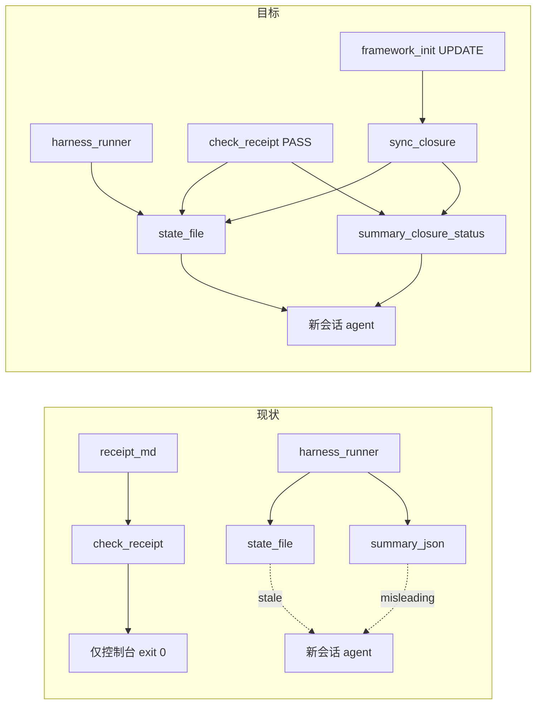

# Framework 升级后自动恢复闭环 — 能力评估与补全方案

## 直接回答你的三个问题

### 1. 是非问题还是中间过程 bug？

**是 framework 产品缺口，不是「review 没做完」也不是纯 agent 粗心。**

- 你已确认 `phase-completion-receipt.md` **存在**，上一会话 `check-receipt` **曾 PASS** → review **业务上已闭环**。
- 新会话报「receipt MISSING / verifier null」→ **运行时态过期**，不是产物丢失。
- 但若 framework 设计目标是「别人更新 framework 后自动按新场景走」，则 **当前做不到** —— 这属于 **应修复的 framework 行为**，不能归类为「预期内的中间态」。

### 2. 当前 framework 能做到自动按新场景走吗？

**不能完整做到。** 分项如下：


| 能力                                        | 更新 framework 后                            | 新会话恢复 feature                 | 现状                      |
| ----------------------------------------- | ----------------------------------------- | ----------------------------- | ----------------------- |
| Config modernize（`reports_dir_pattern` 等） | init UPDATE + Q1.C 可自动                    | 不依赖会话                         | **已具备**（v3.3）           |
| Legacy 报告搬迁                               | init **不自动搬**；MIGRATION 给手动脚本             | —                             | **半自动**（文档 + 脚本，非 init） |
| 闭环判定 SSOT                                 | `check-receipt.ts` 读 receipt 磁盘           | 同上                            | **已具备**                 |
| 运行时态同步                                    | **不更新**                                   | 读 stale `.current-phase.json` | **缺失**                  |
| summary 下一步提示                             | 仍 `next_action=run_verifier_then_receipt` | 误导 agent                      | **缺失**                  |
| 新会话 Resume 协议                             | 无强制代码路径                                   | agent 常跳过 check-receipt       | **缺失**                  |
| receipt 内 legacy 路径自愈                     | 无                                         | 迁移后 check-receipt 可能 FAIL     | **缺失**                  |


结论：**config 层能 modernize，闭环恢复层不能 auto。**

### 3. 做不到的话需要补充什么？

最小补全分 **三层**（由易到难，建议至少做 Layer 1+2）：

---

## Layer 1 — 闭环态同步（BLOCKER，改 harness）

**问题**：`[check-receipt.ts](framework/harness/scripts/check-receipt.ts)` PASS 后**不写** `[.current-phase.json](framework/harness/state/.current-phase.json)`；只有 `[harness-runner.ts](framework/harness/harness-runner.ts)` 结束时 `tryValidateReceipt()` 才写 state。

**补什么**：

1. `**check-receipt.ts` exit 0 时回写 state**
  - 合并现有 state（保留 `session_id` 等 hook 字段）
  - 设置 `status=harness_finished`、`verdict=PASS`、`receipt.status=passed`、`receipt.receipt_path`、`receipt.exit_code=0`
  - 复用 `[statefilePath()](framework/harness/config.ts)` + harness-runner 的 `ReceiptValidation` 结构（抽公共 util，避免双 SSOT）
2. **新增 `harness-runner.ts --sync-closure`（或独立脚本 `sync-phase-closure.ts`）**
  - 不跑完整 check-*，仅：若 receipt 存在 → 跑 check-receipt → 更新 state + 可选刷新 `summary.json` 的 `receipt_status` / `closure_status`
  - **用途**：framework 升级后、新会话开始前，维护者或 agent **一条命令**对齐态，无需重跑 review harness
3. `**summary.json` 增加字段**（`[harness-runner.ts` writeRunSummary](framework/harness/harness-runner.ts)）
  - `closure_status: "open" | "closed"` — closed 当且仅当 check-receipt 会 PASS
  - `next_action` 在 closed 时改为 `phase_closed_wait_user`（对齐 phase transition §8），**不再**写 `run_verifier_then_receipt`

**验收**：receipt 已 PASS 的工程，跑 `--sync-closure` 后 state.receipt=passed、summary.closure_status=closed；新 agent 读 state 不再报 MISSING。

---

## Layer 2 — 新会话 Resume 协议（BLOCKER，改 Skill + AGENTS）

**问题**：Skill 正文写「不依赖 `.current-phase.json`」，但新 agent 实际仍先读 state/summary；无强制「Resume 子流程」。

**补什么**：

1. `**[AGENTS.md.template](framework/templates/AGENTS.md.template)` 新增 §5.2「跨会话恢复」**
  - 进入 feature 任意阶段前：**必须先**执行其一：
    - `check-receipt.ts --feature X --phase Y`（receipt 可能存在时）
    - 或 `harness-runner --sync-closure`
  - **禁止**仅凭 `.current-phase.json` / `summary.json` 宣告「未闭环」
  - check-receipt exit 0 → 直接认定闭环，进入 **phase.next_step 停等**，不重跑该阶段
2. **各 Skill 1–6 开头增加 3 行 Resume Gate**（与 Skill 6 已有「不依赖 state」并列，改为「Resume 时以 check-receipt 为准」）
3. `**[framework-agent-execution.mdc](framework/agents/shared/agent-bundle/templates/rules/framework-agent-execution.mdc)`** 补充：用户说「继续 `<feature>`」= 先 sync-closure，再决策下一阶段

**验收**：弱模型新会话对 hwp-channel/review 先跑 check-receipt，exit 0 则汇报「已闭环，停等 UT 授权」，不重触发 verifier。

---

## Layer 3 — Init / 迁移后 Reconcile（MAJOR，改 Skill 00 + harness）

**问题**：v3.3 init 只写 config，不 reconcile 已有 receipt 与 reports 路径；MIGRATION 要求人工改 receipt 内 `trace_json.path`。

**补什么**：

1. **Skill 00 Step 7.x「Post-UPDATE closure reconcile（advisory）」**
  - init UPDATE 完成后扫描 `doc/features/*/*/phase-completion-receipt.md`
  - 若 frontmatter 中 `trace_json.path` / `verifier_subagent.report_path` 仍指 legacy `framework/harness/reports/...` 且新路径文件已存在 → 提示或 offer 自动 patch frontmatter（**须用户确认**，遵守 confirmation UX）
2. **可选：`framework-init` 结束后自动跑 `--sync-closure`（仅当存在 receipt）**
  - 把「升级 framework 后自动按新场景走」落为 init 收尾动作
3. **单测**：fixture 含 legacy receipt path + 新路径 reports → reconcile 后 check-receipt PASS

**验收**：Wallet 类工程 init UPDATE 后，无需人工改 receipt 路径即可 check-receipt PASS（在 reports 已迁前提下）。

---

## 架构关系（现状 vs 目标）




---

## 与你预期的对齐


| 你的预期                          | 当前                 | Layer 1+2 后                                  | Layer 3 后                  |
| ----------------------------- | ------------------ | -------------------------------------------- | -------------------------- |
| 他人 pull/update framework 后能继续 | 部分（config 可，闭环态不行） | **可以**（sync-closure + check-receipt 写 state） | **更好**（init 后自动 reconcile） |
| 新会话不误判未闭环                     | **不行**             | **可以**（Resume 协议 + closed summary）           | 同左                         |
| 不重做 review/verifier           | 靠 agent 自觉         | **强制**（check-receipt exit 0 即停）              | 同左                         |


---

## 建议实施顺序（framework 仓库）

1. **P0**：`check-receipt` PASS → 写 state；`--sync-closure` CLI；单测
2. **P0**：AGENTS §5.2 + Skill Resume Gate + agent-execution 规则
3. **P1**：summary `closure_status` + next_action 修正
4. **P2**：init post-UPDATE receipt path reconcile（带用户确认）

**不在范围内**：Stop hook 物理拦截逻辑大改（Layer 1 已足够让 hook 读到 passed）；review 业务重做。

---

## Wallet 工程当下可做（实例侧，不等 framework PR）

在 WalletForHarmonyOS 根目录：

```powershell
cd framework/harness
npx ts-node scripts/check-receipt.ts --feature hwp-channel --phase review
# exit 0 → review 已闭环；告诉 agent 停等 UT，勿重跑 review
# 若 framework 已合入 sync-closure，再跑：
# npx ts-node harness-runner.ts --sync-closure --feature hwp-channel --phase review
```

这是 **workaround**；要达到「更新 framework 自动按新场景走」，必须合入上述 Layer 1–2（至少）。