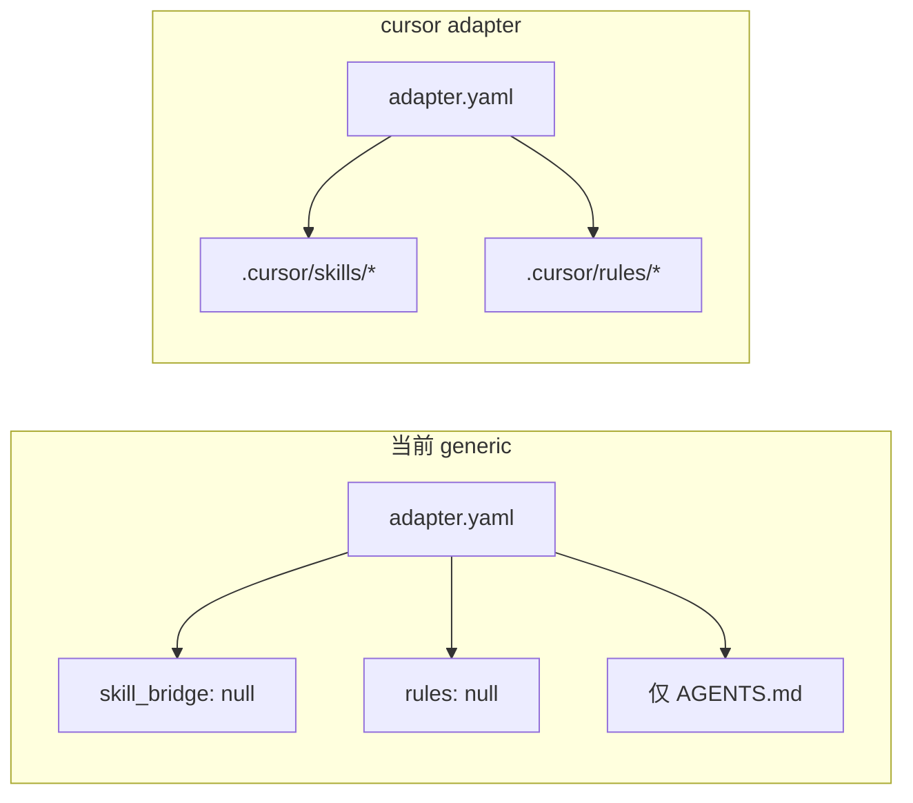
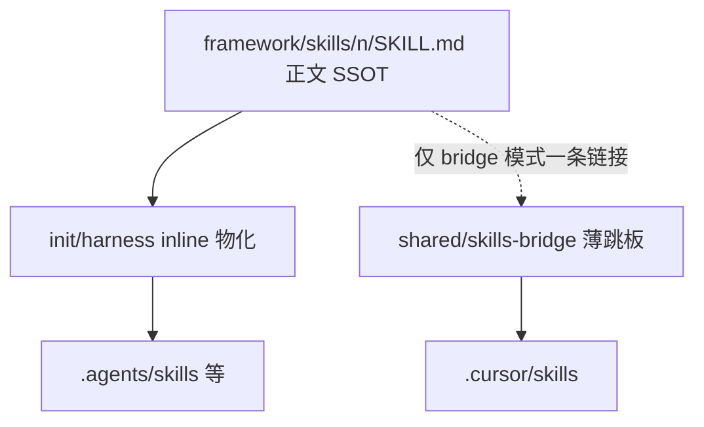
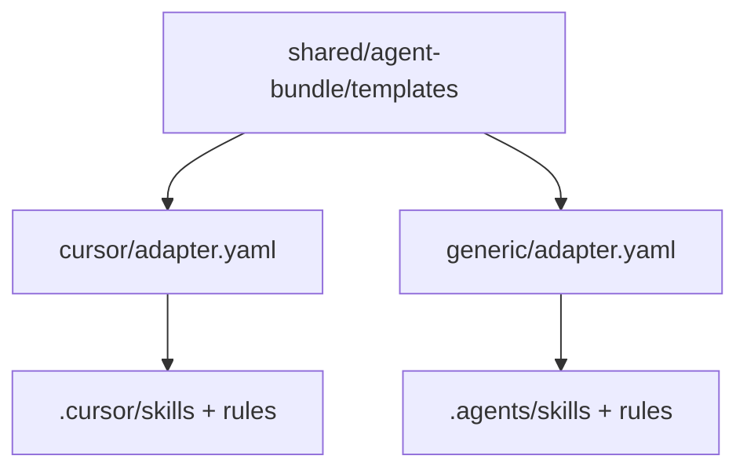
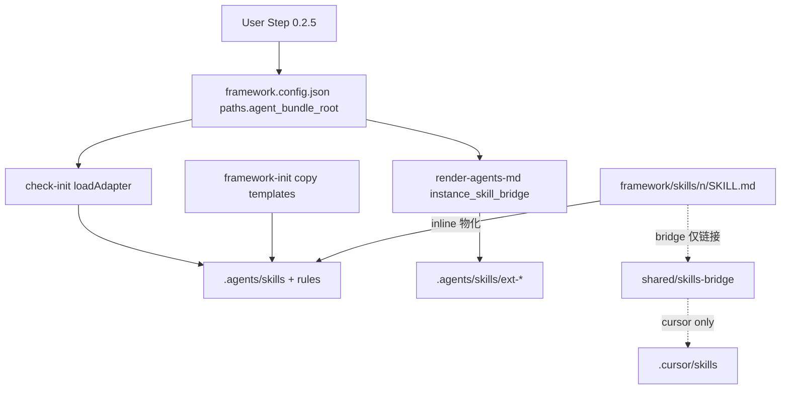

# Generic adapter 可配置 agent bundle 目录

## 现状与根因




- [framework/agents/generic/adapter.yaml](framework/agents/generic/adapter.yaml) 明确 `skill_bridge: null` / `rules: null`，故 init 体检第 3 项无跳板可拷贝。
- [framework/harness/scripts/check-init.ts](framework/harness/scripts/check-init.ts) 的 `loadAdapter()` **已支持**任意 `target_dir` 递归展开模板；缺口是 generic 未声明目标路径，且路径未与用户自定义根目录挂钩。
- [framework/harness/scripts/utils/instance-skill-bridge.ts](framework/harness/scripts/utils/instance-skill-bridge.ts) 的扩展 skill 跳板仅读 `adapter.yaml → instance_skill_bridge`；generic 为 `null` 时不会写入实例扩展跳板。

你已确认：**选 generic 必须指定 bundle 根目录**；**v1 只做 `skills/` + `rules/`**，不做 `mcp/`。

## 加载器差异与「一套 shared 是否有害」（计划修正）

检视结论：**有害的不是「shared 目录」本身，而是把「Cursor 薄跳板」当成所有 agent 的通用产物。**


| 维度                                | Cursor（宽松）                                                   | Chrys / MS agent-framework 等（严格）                                    |
| --------------------------------- | ------------------------------------------------------------ | ------------------------------------------------------------------- |
| 扫描路径                              | `.cursor/skills/`                                            | 默认 `.agents/skills/`、`~/.agents/skills/` 等，**不扫** `.cursor/skills/` |
| `name` vs 目录名                     | 文档要求一致，实践可分离（如目录 `00-framework-init`，`name: framework-init`） | **强制相等**，不等则拒绝加载                                                    |
| 薄跳板 + 链接到 `framework/skills/`     | 可用（Agent 会跟链接读正文）                                            | **不可用**（不跟进链接；bundle 内须是可独立加载的完整 SKILL）                             |
| `framework/skills/` 无 frontmatter | 可以（不作为 Cursor skill 注册）                                      | 不会被当 skill 加载                                                       |


因此本计划调整为 **两套物化策略、一个正文 SSOT**：




1. **目录命名（两种模式统一）**：bundle 下 skill 目录名与 `framework/skills/` 对齐，**保留 `00-` / `0-` / `1-`… 数字前缀**（如 `00-framework-init`、`0-catalog-bootstrap`），不再使用无前缀的 `framework-init` 作为目录或 `name`。
2. **frontmatter `name`（BLOCKER）**：**必须等于所在目录名**（含数字前缀）。修正现有 `.cursor/skills` 与 shared 模板，不再为 Cursor 单独保留「短 name」。
3. `**cursor` adapter**：继续 **bridge** 模式——拷贝 `shared/agent-bundle/templates/skills-bridge/`（薄正文 + 链到 `framework/skills/...`）；Cursor 仍能跟链接。
4. `**generic` adapter**：默认 `**inline`** 模式——init/harness **从 `framework/skills/<dir>/SKILL.md` 生成** bundle 内完整文件，并**注入**合规 frontmatter（`name: <dir>`、`description: ...`）；供 Chrys / `.agents` 类工具直接加载。可选 `**bridge`**（与 cursor 相同薄跳板）仅当用户明确使用「会跟链接的」agent。
5. `**shared` 不再承担「一份正文走天下」**：shared 只存 **bridge 薄模板 + 中性 rules**；**完整 skill 正文永不复制进 shared**，始终由 `framework/skills/` 供给 inline 物化。

**对「shared 替换 cursor/templates」的结论**：可以、且应该——但 shared 里是 **bridge 专用** 模板；generic 的 strict 路径走 **inline 生成**，不与 cursor 共用同一份「一行链接」文件。

## 目标行为


| 场景                             | 行为                                                                                                               |
| ------------------------------ | ---------------------------------------------------------------------------------------------------------------- |
| `agent_adapter: generic`       | Step 0.2.5 **必须**收集 `paths.agent_bundle_root`；**默认** `paths.agent_bundle_skill_mode: inline`（strict）；可改 `bridge` |
| init / UPDATE（inline）          | 物化 `{root}/skills/<dir>/SKILL.md` = frontmatter + `framework/skills/<dir>/SKILL.md` 全文；`name` === `<dir>`        |
| init / UPDATE（bridge）          | 拷贝 shared/skills-bridge（与 cursor 同）；仅适用于会跟进链接的 agent                                                             |
| init / UPDATE（rules）           | 拷贝 shared 中性 `rules/framework.mdc` → `{root}/rules/`                                                             |
| `render-agents-md`             | 扩展 skill：inline 时物化完整正文；bridge 时写薄跳板（`name` === `bridgeId`）                                                      |
| `check-init --adapter generic` | 第 3 项按 config 列出真实路径；可选校验 bundle 内 `name` 与目录名一致                                                                 |


内部布局（固定，仅根目录名可配）：

```
<agent_bundle_root>/
  skills/<skill-id>/SKILL.md
  rules/framework.mdc
```

## 配置契约（SSOT）

在 [framework/templates/framework.config.template.json](framework/templates/framework.config.template.json) 与 [framework/specs/framework.config.schema.json](framework/specs/framework.config.schema.json) 增加：

```json
"paths": {
  "agent_bundle_root": ".agents",
  "agent_bundle_skill_mode": "inline"
}
```

- **当 `agent_adapter === "generic"` 时**：`agent_bundle_root` 必填；`agent_bundle_skill_mode` 枚举 `bridge` | `inline`，**默认 `inline`**。
- **当 `agent_adapter === "cursor"` 时**：忽略 `agent_bundle_`*（固定 `.cursor/skills` + bridge）；可在 init 时把既有 `.cursor/skills` **重渲染**为 `name` 与目录一致。
- 校验规则（与 [instance-skill-bridge.ts](framework/harness/scripts/utils/instance-skill-bridge.ts) `SAFE_TOKEN` 对齐）：
  - 相对实例根、POSIX 路径
  - 禁止 `..`、禁止绝对路径（不以 `/`、盘符开头）
  - 建议以 `.` 开头（非强制，但 init 提示推荐 `.agents`）
  - 单段或多段均可（如 `tools/my-agent`），但不得指向 `framework/`、`doc/features` 等保留前缀（可选 WARN）

`agent_adapter` 仍为 `generic`（不新增第四个 adapter 目录名），避免与 `loadReservedBridgeIds`、文档、现有 workflow 分叉。

## Framework 源码改动（优先改 `framework/`）

### 1. 共享模板 + cursor / generic 分工（计划迭代）

#### `cursor` 目录还要不要？

**要保留 `framework/agents/cursor/` 本身，但可以去掉其中的 `templates/` 副本。**


| 层级                                     | 是否 Cursor 专有  | 说明                                                                                                                                                                    |
| -------------------------------------- | ------------- | --------------------------------------------------------------------------------------------------------------------------------------------------------------------- |
| `cursor/adapter.yaml`                  | **是**         | 插件身份：`adapter_name: cursor`、固定 `target_dir: .cursor/skills` 与 `.cursor/rules`、`instance_skill_bridge` 指向 `.cursor/skills`、面向用户的 description（「Cursor 会自动加载 AGENTS.md」） |
| `shared/.../skills-bridge/`            | **bridge 专用** | 薄跳板；`name` **必须**与目录名一致（含 `00-`/`0-` 前缀）；仅 cursor 与 generic+bridge 使用                                                                                                 |
| `framework/skills/` + inline 物化        | **inline 专用** | generic 默认；bundle 内为**完整** SKILL 正文 + frontmatter，不依赖链接跟进                                                                                                             |
| `cursor/templates/rules/framework.mdc` | **部分**        | 业务约束与 generic 相同；**当前文件**含 Cursor 标题、硬编码 `.cursor/skills`、维护指引写「改 cursor/templates」——应改为 **一份 agent 中性** 的 shared 规则，cursor/generic 共用                                |


结论：

- `**templates/` 不应双份维护**：以 `framework/agents/shared/agent-bundle/templates/` 为**唯一 SSOT**。
- `**cursor` adapter 改为薄壳**：仅 `adapter.yaml`，`skill_bridge` / `rules` 的 `template_dir` 指向 `../shared/agent-bundle/templates/skills` 与 `.../rules`；`target_dir` 仍为 `.cursor/skills`、`.cursor/rules`。
- **实施时删除** `framework/agents/cursor/templates/`**（迁移后），避免与 shared 漂移；`loadReservedBridgeIds` 改为只扫 **shared**（不再扫 cursor/templates）。
- **文档与 rules 正文**：维护指引统一写「改 `framework/agents/shared/agent-bundle/templates/`**」，实例 `.cursor/` 或 `{agent_bundle_root}/` 仅衍生物。




**不合并进 shared 的（仍各 adapter 独立）**：`claude` 的 `commands/`、`hooks/`、`settings_file`——与 skills/rules bundle 形态不同，本计划不涉及。

#### 具体文件动作

- 新增 `framework/agents/shared/agent-bundle/templates/`：
  - `**skills-bridge/<dir>/SKILL.md`**（8 个，目录名与 `framework/skills/` 一致）：
    - `name: <dir>`（例：`name: 00-framework-init`，**禁止** `name: framework-init`）
    - 正文仍为一条链到 `../../../framework/skills/<dir>/SKILL.md`
  - `**rules/framework.mdc`**：agent 中性；Skill 路由区分 bridge（跳板目录）与 inline（bundle 内即完整 SSOT 副本）
- 新增 harness 脚本（如 `materialize-agent-bundle-skills.ts`）：
  - 输入：`projectRoot`、`agent_bundle_root`、`mode: inline`
  - 扫描 `framework/skills/*/SKILL.md`，为每个目录生成 `{root}/skills/<dir>/SKILL.md`
  - frontmatter：`name` = 目录名；`description` 从固定映射表或 SKILL 首段摘要（与 bridge 模板 description 对齐即可）
  - 正文：原样拼接 `framework/skills/<dir>/SKILL.md`（无 frontmatter 的源文件）
- 更新 [framework/agents/cursor/adapter.yaml](framework/agents/cursor/adapter.yaml)：`template_dir: ../shared/agent-bundle/templates/skills-bridge`；删除 `cursor/templates/`
- 更新 [framework/agents/generic/adapter.yaml](framework/agents/generic/adapter.yaml)：
  - `rules.template_dir` → shared rules
  - `skill_bridge`：仅在 `agent_bundle_skill_mode: bridge` 时使用 shared/skills-bridge；`inline` 时由物化脚本写入，`check-init` 第 3 项列物化产物路径
  - `target_dir` / `instance_skill_bridge` 仍由 `paths.agent_bundle_root` 运行时解析
- **实例 `.cursor/skills` 同步修正**（init UPDATE）：8 个 bridge 文件 `name` 改为与目录一致（Cursor 兼容，且与 Chrys 规范对齐）

### 2. Harness：运行时解析 generic 路径

扩展 [check-init.ts](framework/harness/scripts/check-init.ts)：

```ts
// 伪代码
function resolveGenericBundlePaths(config): { skillsDir, rulesDir } | null
function loadAdapter(adapter, projectRoot, config?): AdapterDescriptor
```

- `loadAdapter('generic', projectRoot, config)` 读取 `paths.agent_bundle_root`，合成：
  - `skill_bridge.target_dir` → `${root}/skills`
  - `rules.target_dir` → `${root}/rules`
  - `instance_skill_bridge` 等效字段供其它模块复用
- `runInit` / `resolveAdapterName`：generic 且缺 `agent_bundle_root` → **FATAL**（明确提示回到 Step 0.2.5）
- 导出 `resolveAgentBundlePaths(config)` 供单测与其它脚本复用

扩展 [instance-skill-bridge.ts](framework/harness/scripts/utils/instance-skill-bridge.ts)：

- `emitInstanceSkillBridge`：当 `agentAdapter === 'generic'` 时，从 config 读取 `paths.agent_bundle_root` 作为 `skill_stub_target_dir`（不再仅依赖 adapter.yaml 静态值）
- `**posixRelativeFromCursorSkillStubTo`**：按 stub 相对实例根的**路径段数**动态计算 `../` 重复次数（支持 `.agents/skills/...` 及未来多段 root，如 `tools/codex/skills/...`）

### 3. Init Skill 交互（Step 0.2.5）

更新 [framework/skills/00-framework-init/SKILL.md](framework/skills/00-framework-init/SKILL.md) 与 [framework/agents/README.md](framework/agents/README.md)：

- 选定 `generic` 后 **BLOCKER 追问**：
  1. `paths.agent_bundle_root`（示例：`.agents`、`.codex`）
  2. `paths.agent_bundle_skill_mode`：默认推荐 `**inline`**（Chrys / strict）；若用户仅用 Cursor 式链接跟进可选 `bridge`
- 选定 `cursor` 时：说明将刷新 `.cursor/skills` 为 **name === 目录名** 的 bridge 模板
- 切换 adapter 时：若从 `cursor`/`claude` 切到 `generic`，列出旧目录（`.cursor/`、`.claude/`）为「建议手工清理」，新目录将写入体检表第 3 项
- Step 3.5 写 config 时一并写入 `agent_bundle_root`（与 `agent_adapter` 同批，不可拖到 5.1 白名单补缺——属用户显式选定字段）

### 4. 文档与 schema

- [framework/agents/adapter-schema.yaml](framework/agents/adapter-schema.yaml)：说明 generic 的 `target_dir` 由 `paths.agent_bundle_root` 派生；`instance_skill_bridge` 在 generic 下亦从 config 解析
- [framework/agents/README.md](framework/agents/README.md)：更新 generic 行（「无」→「`{agent_bundle_root}/skills` + `rules`」）
- [framework/templates/AGENTS.md.template](framework/templates/AGENTS.md.template) / Skill 路由段：generic 时指向 `paths.agent_bundle_root`，避免写死 `.cursor`

### 5. 测试

- [framework/harness/tests/unit/adapter-bridge.unit.test.ts](framework/harness/tests/unit/adapter-bridge.unit.test.ts) 或新 `generic-bundle.unit.test.ts`：
  - `loadAdapter('generic', root, { paths: { agent_bundle_root: '.codex' } })` → templateFiles 含 `.codex/skills/...`、`.codex/rules/...`
  - 缺 root → 校验失败
  - `posixRelativeFromCursorSkillStubTo` 深度用例
  - inline 物化：`00-framework-init` 输出含 frontmatter 且 `name` 与目录一致
- `loadReservedBridgeIds` 扫描 `shared/.../skills-bridge` 目录名（与 `framework/skills` 对齐）
- 可选 `check-init` 规则：bundle 下每个 `SKILL.md` 的 `name` 必须等于父目录名（WARN/BLOCKER 可配置）

## 实例侧（本仓库验证，非 framework 源头）

确认计划后，在实例根：

1. 重跑 framework-init（UPDATE），选 `generic` + `.agents` + `inline`
2. 验证 `.agents/skills/00-framework-init/SKILL.md` 为**完整正文**且 `name: 00-framework-init`
3. Chrys 扫 `.agents/skills/` 应能加载（不再依赖 `.cursor/skills/`）
4. cursor adapter：验证 `.cursor/skills` bridge 的 `name` 已与目录一致

**不自动 commit**（遵守仓库 git 规则）。

## 非目标（v1 明确不做）

- `mcp/` 目录与模板
- 让 Chrys 自动扫描 `.cursor/skills/`（需用户配置 Chrys 或改用 generic+`.agents`）
- 在 shared 中维护两份完整 SKILL 正文（inline 始终从 `framework/skills` 生成）
- 自动删除旧 `.cursor/` / `.claude/` 目录
- 多 bundle 根并存（仍保持 `agent_adapter` 单槽互斥）

## 架构示意（落盘后）




