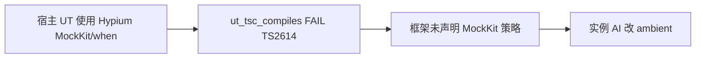

# GLM 5.1 修改 framework 源码 — 根因与正确修复方向

## 本地代码探查（2026-05-28，轻量重跑）

**工作区** `d:\1.code\agent-maison`：

| 项 | 结果 |
|----|------|
| `git status` | 仅 **未跟踪** [本 plan 文件](.cursor/plans/glm改framework根因_e00864d1.plan.md)；**无**已修改/已暂存的发布内容 |
| `ts-compile.ts` ambient | **仍无** `MockKit` / `when`（与 plan 假设一致） |
| `package.json` 根 | **仍无** `dependencies.yaml` |
| `check-ut.ts` / mock-plan schema | **无** `strategy: mockkit` 或 MockKit 门禁实现 |
| 最近提交 `cf79bb2` | **Hylyre cwd + 根目录污染检测**（`hylyre-spawn.ts`、`hylyre-root-pollution.ts` 等），属 [根目录_reports_污染 plan](.cursor/plans/根目录_reports_污染根因_5879653f.plan.md)，**不覆盖**本 plan 的 Test Double / MockKit 待办 |

**对 plan 的影响**：

- **结论与待办不变**：MockKit Policy 整套实现仍为 **未开始**；P0（Wallet 回滚 submodule、`framework/harness` npm install）若在消费者仓有脏改，**仍必须做**。
- **已落地且相关的其它 work**：`cf79bb2` 减少 Skill 6 因 Hylyre cwd 在工程根落盘而诱发的「乱改 framework/根目录」；与 plan §7 消费者边界**同向**，但**不能替代** `framework-test-double-policy` / `support-hypium-mockkit`。
- **若「其他 AI 改代码」在 Wallet 的 `framework/` submodule**：本仓探查**看不到**；需在实例仓执行 `git -C framework status` / `git diff`。

---

## 讨论结论校验（图 1 + 图 2）


| 结论                                                                        | 是否正确         | 核验说明                                                                                                                                                                                                                 |
| ------------------------------------------------------------------------- | ------------ | -------------------------------------------------------------------------------------------------------------------------------------------------------------------------------------------------------------------- |
| 错层修复：yaml 应在 `framework/harness`，不应改 framework 根 `package.json`           | **正确**       | 与 [host-harness-readiness.md](skills/reference/host-harness-readiness.md)、[AGENTS.md](AGENTS.md) Tier_1 一致；[sanitizePackageJson](scripts/release-pack-rules.mjs) 只删 `devDependencies`，根目录 `dependencies` 会污染 release |
| TS2614（非 TS2305）+ 2614 不在 `MODULE_RESOLUTION_ERROR_CODES` 内 → 门禁真实 FAIL   | **正确**       | [ts-compile.ts](profiles/hmos-app/harness/ts-compile.ts) L83–85 不含 2614                                                                                                                                              |
| 根因不是「UT 用 MockKit 错了」，而是 **Spy 单一路径 + mock-plan 未覆盖 MockKit** 的策略缺口       | **正确**       | v2.3 已有 [mock-plan.yaml](profiles/hmos-app/skills/5-business-ut/templates/mock-plan-schema.md) + `dag_spy_preset_resolvable`，但 schema/门禁 **仅围绕 `spies[]` / `spy_preset`**，无 `strategy: mockkit`                      |
| 应 **正式支持 MockKit**，用 mock-plan + harness + verifier **约束滥用**，而非禁止或强制改 Spy | **正确（产品方向）** | 与 Fowler/Google Test Double 分层一致；避免「为可测性改生产代码」在单例/工厂/内部 `new` 场景被 Spy 路径放大                                                                                                                                           |
| 仅补 ambient 两行是 **治标**，真正根治是 **Test Double Policy 重构**                     | **正确**       | GLM 在实例改 ambient = 重复同一类捷径；应在 **agent-maison** 合入并版本化                                                                                                                                                                |
| Spy 降级为 **推荐选项**（可注入 + 要 callLog 时），非唯一合法路径                               | **正确**       | 与现有 `base_strategy: subclass                                                                                                                                                                                         |
| 消费者实例 **禁止** 为过关改 submodule                                               | **正确**       | [README.md](README.md) init 不写 framework/；与 maison 维护者改源头的边界需写清                                                                                                                                                      |


**需保留的边界（避免过度泛化）：**

- **ambient / `ut_tsc_compiles` 只保证静态语法**，不保证 MockKit 在 hvigor/Hypium 真机链路的运行时语义；`ut_hvigor_build` / `ut_hvigor_test` 仍是必要出口。
- **命名冲突**：Spy 的 `whenXxx` 属性 vs Hypium 全局 `when()` — 文档必须显式区分（当前 [ut-template.md](profiles/hmos-app/skills/5-business-ut/templates/ut-template.md) 已用 `whenValidateRequest` 等命名，MockKit 模板须单独成章）。
- **schema 演进**：现有 `mock-plan` 顶层 `spies[]` 宜演进为 `doubles[]`（或兼容层），`schema_version` 需 bump；`check-ut.ts` 中 `ut_mock_plan`_* / `dag_spy_preset_resolvable` 需扩展 mockkit preset 追溯规则（当前 **无** MockKit 校验实现）。

---

## 结论（一句话）

- `**package.json` + yaml**：明确 **装错层** + **发布污染** — 实例回滚，`cd framework/harness && npm install`。
- `**ts-compile.ts` + MockKit/when**：GLM 在 **消费者 submodule** 改 ambient 仍属错层；但 **正确产品响应** 不是「一律改回 Spy」，而是在 **agent-maison** 将 MockKit 纳入 **与 mock-plan 绑定的正式策略**，再发版给消费者。

---

## 改动 1：`ts-compile.ts` 增加 `MockKit` / `when`

### 触发链




1. UT：`import { MockKit, when } from '@ohos/hypium'`（或同类写法）。
2. 门禁：**TS2614**；不会被 [MODULE_RESOLUTION_ERROR_CODES](profiles/hmos-app/harness/ts-compile.ts) 过滤。
3. 框架现状：文档/模板 **主推 Spy + `whenXxx`**；harness **未禁止** MockKit import；ambient **未声明** → 灰区。
4. GLM 捷径：在消费者 submodule 改 `HYPIUM_AMBIENT_DTS` — **错在修复位置**，但暴露的 **策略缺口是真实的**。

### 与「强制 Spy」旧判断的差异

原 plan「MockKit 应改 Spy」**过窄**。Spy 适合：依赖可注入、需要 `callLog` 与 DAG `spy_preset` 对齐的场景。真实工程常见 **不可注入边界**（单例、静态工厂、框架托管对象）→ MockKit 合理。

**正确表述**：不是 UT 用错了 API，而是 **framework 未提供 MockKit 的机器契约**（mock-plan strategy、门禁、verifier、ambient 一体化）。

### 实例侧（策略落地前）

- **回滚** submodule 对 `ts-compile.ts` 的本地修改。
- **不要**在实例靠改 ambient 静态过关。
- 若 UT 确需 MockKit：在业务 ohosTest 走 hvigor 验证，并把需求回流 agent-maison（本 plan 框架侧任务）；临时可 Spy 仅作 **过渡**，非长期 SSOT。

---

## 改动 2：`framework/package.json` 增加 `yaml`

（机制不变，评审已确认。）


| 位置                                                     | yaml                     |
| ------------------------------------------------------ | ------------------------ |
| [framework/harness/package.json](harness/package.json) | 有                        |
| [framework/package.json](package.json) 根               | 不应有 runtime dependencies |


实例：回滚根 `package.json` 的 `dependencies` → `cd framework/harness && npm install`。

---

## 框架侧必做：Test Double Policy（图 1 六点）

### 1. 不禁止 MockKit；纳入 Hypium 一等能力

### 2. 升级 mock-plan：每个 double 声明 `strategy`

建议 `mock-plan.yaml`（`schema_version` bump）：

```yaml
doubles:   # 或兼容期保留 spies: 别名
  - target_class: RemoteTaskGateway
    strategy: mockkit   # mockkit | spy | fake | prototype_patch
    methods:
      - name: validateRequest
        presets:
          - id: ok_token
            returns: { ts_expr: "..." }
```

与现有 `[mock-plan-schema.md](profiles/hmos-app/skills/5-business-ut/templates/mock-plan-schema.md)`、`[dag-schema.md](profiles/hmos-app/skills/5-business-ut/templates/dag-schema.md)` 的 `spy_preset` 对齐；可增 `mockkit_preset` 或统一 `preset_id`。

### 3. MockKit 约束（harness BLOCKER 候选）

- 仅 mock `contracts.yaml` / `use-cases.yaml` **data_boundaries** 登记的外部边界类。
- **禁止** mock 被测 Flow / Coordinator / Page handler / 被测导出函数。
- 每个 `when(...)` 须可追溯到 `mock-plan` 的 `presets[].id`（类似现有 `dag_spy_preset_resolvable`）。
- 若 feature 以 **调用序** 为质量要点：MockKit 路线须补充 verify 证据，或选用 Spy/Fake。

### 4. `ts-compile` ambient + `ut-rules` `ambient_symbols`

增加 `MockKit` / `when`，并注明：**仅当 mock-plan 存在 `strategy: mockkit` 时允许 UT import**（门禁需读 plan，避免无 plan 滥用）。

### 5. Verifier 增强

`[verify-ut.md](harness/prompts/verify-ut.md)` / overlay：查 MockKit 是否 mock 业务逻辑、是否绕过 branch/state 断言、preset 是否与 mock-plan 一致（不只「能编译」）。

### 6. Spy 模板定位调整

`[ut-template.md](profiles/hmos-app/skills/5-business-ut/templates/ut-template.md)` 保留为 **可注入场景推荐**；新增 **MockKit 模板**（从 mock-plan preset 翻译 `when`）。

### 7. 消费者边界（与 MockKit 正交）

- 除 framework 版本升级外，**禁止**改消费者 `framework/` submodule。
- `Cannot find module 'yaml'` → 仅 Tier_1；禁止改根 `package.json`。

---

## Wallet 实例核对清单

1. `git -C framework diff` → 回滚两处脏改。
2. `framework/harness/node_modules/ts-node/package.json` 存在。
3. 宿主 UT 含 MockKit：在 framework 新版本发布前 **勿** 改 submodule ambient；记录对 `framework-test-double-policy` 的需求。
4. `cd framework/harness && npx ts-node harness-runner.ts --phase ut --feature <feature>`。

---

## 实施优先级


| 优先级 | 内容                                                              |
| --- | --------------------------------------------------------------- |
| P0  | 实例回滚 submodule + harness `npm install`                          |
| P1  | agent-maison：mock-plan schema + check-ut 规则 + ambient（**成套发布**） |
| P2  | Skill 5 / ut-template / verifier / fixture                      |
| P3  | 弱化消费者误读的 `framework.mdc`「优先改 framework」                         |


