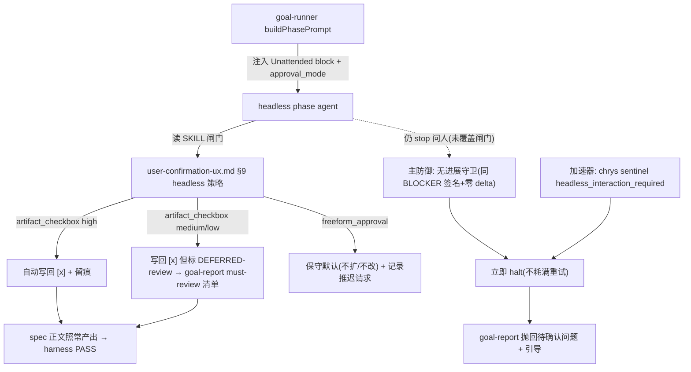

## 背景与根因（实证；3 层 + 1 个 parity 矛盾）

证据来自 run `20260624T081122Z` 实物日志（`agent-output.log` / `events.jsonl` / `detach.log`，非截断的 `goal模式bug.txt`）。

**Layer A — 行为闸门（真正主因）**
spec 阶段 agent 按对话化 SKILL 老实执行，写了中间产物 `context-exploration.md` + `terminology-mapping.md`，到要写 `spec.md` 时卡在「术语表逐行确认」闸门，直接抛 sentinel 收场，`**spec.md` 从未落盘**。chrys 在 phase 结束一次性写出结构化错误信封（`agent-output.log` 整个文件就这一行）：

```json
{"error": "Agent requested user input in headless mode: 请确认上述术语映射表，所有行确认后我才进入 spec 正文撰写。", "code": "headless_interaction_required"}
```

→ 真正的 harness BLOCKER 是 [check-spec.ts](harness/scripts/check-spec.ts) 的 `**spec_file_exists**`（`detach.log:27/84` 两次都报 spec.md 不存在）；`terminology_mapping_table` 检查**根本没机会执行**（它在 spec.md 存在之后才跑）。这道闸门**双重强制**且无 headless 出口：

- [skills/feature/spec/SKILL.md](skills/feature/spec/SKILL.md) Step 1.5.5：「停下来等人工确认……即使 high 也必须人工确认（不启用 auto-approve）」「所有行 `[x]` 才允许生成 spec 正文（BLOCKER）」。

→ **spec 阶段在 goal-mode 下结构性必然过不去**：根因是 agent 压根没走到写 spec.md，而非术语表没打 `[x]`。故 **#1+#3（让 agent 在 headless 下继续写完 spec.md，含 section 0 带 `[x]`）才是关键路径；#4（check-spec 术语留痕 WARN）是锦上添花**。同类闸门遍布全流程（[confirmation-registry.yaml](skills/reference/confirmation-registry.yaml)：`spec.terminology` / `plan.scope_expansion` / `ut.plan_confirm` / `ut.src_mutation` 等）。框架已预留开关 `manifest.unattended.approval_mode`（[goal-manifest.ts:21-27](harness/scripts/utils/goal-manifest.ts)，[manifest.json:24](D:/97.log) 实写 `never`），但**从未传进 phase prompt、也没接到任何闸门上**——phase agent 根本不知道自己在 headless 里跑。

> 注：你给我的 `bc-openCard/spec/spec.md`（只有 section 0）**不是这次 run 的产物**——本 run 的 harness 三次都报 spec.md 不存在；该文件应为旁路/历史残留，不作为本 run 行为依据。

**Layer B — 编排盲目重试（放大器，有界非死循环）**
[phase-transition-policy.ts:216](harness/scripts/utils/phase-transition-policy.ts) `FAIL → retries < max_retries_per_phase`（默认 2，共 3 次 attempt）就 retry。闸门是确定性的，3 次重演同样 `spec_file_exists`（每次重跑 5–8 分钟 context 探索、零进展）。实证：`events.jsonl:36` 第 3 次 `retries_used=2 >= max=2` → **halt 是重试耗尽自停**（即便无人干预也会在第 3 次停），run_start 08:11:24 → run_end 08:28:14 约 **17 分钟**零产出。`detach.log:118` 的 `^C` 是并发打在第 3 次 harness 子进程上的（用户等不及/宿主关窗，`harness_exit=3221225786`=STATUS_CONTROL_C_EXIT），**非 halt 成因**。

**Layer B'（新增）— 重试上下文帮倒忙**
[goal-runner.ts:350-365](harness/scripts/goal-runner.ts) `buildPhasePrompt` 的 "Prior attempt failure" 块（`prompt.md:13-27`）指引 agent「上轮可能改坏了东西，先 revert 再修」——这是给**编码失败**设计的话术。spec 卡在确认闸门、根本没有「改坏的东西要 revert」，这段误导指引喂给第 2/3 次 agent 纯属噪声。retry context 须区分「卡在确认闸门 / 产物缺失」vs「代码改坏」；前者重试无意义，应直接 halt（由 §5 覆盖）。

**Layer C — chrys 的 invoke 不对称（parity 漏掉的隐性 bug）**
[agent-invoke.ts:285](harness/scripts/utils/agent-invoke.ts) `chrysArgv` 连 `unattended` 都不收，只拼 `chrys run --task <file> -C <root> --agent Code --json`；其它 adapter 全传了非交互 flag（claude `--permission-mode dontAsk` / cursor `--force --trust` / codex `--ask-for-approval never` / opencode `--dangerously-skip-permissions`）。[chrys/adapter.yaml](agents/chrys/adapter.yaml) 自称「headless = chrys run（--agent Code, BYPASS 非交互）」与实现不符。注意：**即便 chrys 有 bypass flag，它一般只压「工具执行审批」，压不住「agent 按 SKILL 主动停下来问澄清」**——故 Layer C 单独不能修本 bug，但属 parity 隐性 bug，声明/实现背离须纠正。

**设计矛盾（产品层）**
用户首条指令是「有不确定的停下来问我」，但 foreground agent 用 `--detach` 起了 headless goal-run，「停下来问我」与「无人值守 headless」本质冲突。本计划用机制（自动放行+留痕，high vs medium/low 分级）化解，并在进入 headless goal-mode 前明确告知用户「中途无法问你，闸门会自动解决并在最后统一抛回复核」。

## 目标行为（用户已拍板）

- goal-mode（headless）下：所有**阶段内**人工确认闸门**自动放行 + 留痕**，不 stop 问人；medium/low 映射按语义判定并标注，最终 goal-report 高亮「待人工复核的假设」。
- 危险类（`freeform_approval`：scope 扩展 / 改受保护源码）**不自动放行**，取保守默认（不扩 scope / 不改源码）并记录被推迟请求。
- 阶段**间**推进（`*.ok_to`_* / `phase.next_step` / `spec.freeze`）已由 `goal_mode` transition policy 裁决，不在本次改动范围。




## 改造点

### 1. 向 phase agent 注入 headless 上下文（[harness/scripts/goal-runner.ts](harness/scripts/goal-runner.ts) `buildPhasePrompt` L321）

- 新增 `## Unattended execution (headless goal-mode)` 块（goal-runner 恒 headless，始终注入），内容：本轮无交互用户、不得 stop 问人、所有阶段内确认闸门按 `user-confirmation-ux.md §9` 自动解析并把每条决策写入 `doc/features/<feature>/<phase>/headless-assumptions.md`、`approval_mode=<manifest.unattended.approval_mode>`、危险类取保守默认。
- 把 `manifest.unattended.approval_mode` / `feature` / `phase` thread 进（均已在 manifest 内）。
- **措辞强度（关键）**：该块用语必须与 spec SKILL 里「必须停下来 / 不启用 auto-approve」**同等强硬**（BLOCKER 级、命令式），否则 agent 会听 SKILL 里更响的那句而继续停。明确写：「headless 下若 stop 问人 = 任务失败；本块**覆盖**各 SKILL 内一切『停下来等用户确认』的措辞」。

### 2. 新 SSOT：[skills/reference/user-confirmation-ux.md](skills/reference/user-confirmation-ux.md) 新增「§9 Goal/headless 无人值守闸门解析」

- 按 `class` 定义 headless 默认解析（避免逐条注解 40+ registry 项）：
  - `gate`/`enum`/`matrix` → 取「确认/继续」默认 + 留痕；
  - `artifact_checkbox`（`spec.terminology` 等）→ 自动写回 `[x]` + 留痕，正文照常产出；**置信度分级 + 防绕过（收口 review 点 2）**：
    - **glossary 命中的术语**：headless 下**逐字采用** glossary 的 `canonical_module`，**不许自行改判** → `high`、不入 must-review。否则 agent 自己挑个模块就和 check-spec 的 glossary 矛盾子检查打架（手机号 WalletMain vs AccountManager 即此类）。
    - **新术语（非 glossary 命中）**：强制 `medium`/`low` → **必入 must-review**；标 `high` 必须有 glossary 背书。**防止 agent 把新术语全标 high 整体跳过 must-review**（SKILL §1.5.4 反模式，headless 下没人盯）。
    - `medium`/`low` → 仍自动放行（不 halt），但标 `DEFERRED-review`，goal-report **顶部** must-review 清单逐条列出（术语、归属模块、置信度、agent 自标易混项）。
    - check-spec 加一条规则：**标 `high` 却不在 glossary → 降级 + WARN**（坐实「假 high 绕过 must-review」无效）；低置信 + glossary 矛盾仍由 glossary 矛盾子检查兜成真 BLOCKER。
  - `freeform_approval`（`plan.scope_expansion` / `ut.src_mutation`）→ 保守默认（reject/narrow，不扩 scope / 不改源码），记录被推迟请求，必要时升级 DEFERRED；
  - 阶段间闸门 → 由 goal_mode policy 裁决，本节不重复。
- 留痕契约：`headless-assumptions.md` 结构（class / registry_id / 自动选择 / provenance / 是否 must-review）+ provenance 文案 `auto-approved (goal-mode), pending human review` + goal-report 顶部 must-review 高亮。
- §6 反模式补一条：headless 下仍 stop 问人（触发 `headless_interaction_required`）属 BLOCKER 行为。

### 3. SKILL 硬闸门 headless 例外（就地中和，非"见 §9"了事）

- [skills/feature/spec/SKILL.md](skills/feature/spec/SKILL.md) **L136-138**「所有行 `[x]` 才允许生成 spec 正文 / 不启用 auto-approve」**那句旁边就地**插入 headless 例外，**直接中和**它（而非只在别处写"见 §9"）：「**headless / goal-mode 下例外**：无交互用户，按 §9 自动写回 `[x]`（high 直确认；medium/low 标 DEFERRED-review）并**继续写完 spec 正文**，禁止停下问人」。同理就地处理 Step 2 ui-spec `verified`（L174）。
- 理由：弱模型读到「必须停下来」与「见 §9」分处两地时会听更近/更强的那句；例外必须与被中和的硬约束**同处一段**才可靠。
- [skills/feature/plan/SKILL.md] `plan.scope_expansion` 与 [skills/feature/business-ut/SKILL.md] `ut.src_mutation` 处就地补「headless = 保守默认（不扩 scope / 不改源码）+ 记录推迟」一行（保守默认非显然，需点明）。

### 4. check-spec 留痕感知（次要，锦上添花）

> 实证降级：真实卡点是 spec.md 未产出（`spec_file_exists`），不是术语表没 `[x]`；`terminology_mapping_table` 在本 run 根本没机会跑。故本项**优先级低于 #1/#3**，仅在 agent 已能写完 spec.md 后才有意义。

- `[x]` 通过逻辑**不变**（agent 在 goal-mode 写真 `[x]` → 通过）；glossary 矛盾子检查（[check-spec.ts](harness/scripts/check-spec.ts) L451+）保留为真实护栏。
- 新增规则（防假 high 绕过，呼应 §2）：**某行标 `high` 却不在 glossary（含 aliases）→ 降级并 WARN**「new term 不得自标 high；应 medium/low 入 must-review」。
  - **作用域（实现期注记）**：此为 check-spec **全局规则**，交互态跑 spec 也会触发——因属 WARN（不 BLOCK）且本身是合理收紧，**保留全局**（不限 headless）。单测须覆盖「交互态同样只 WARN 不 BLOCK」，避免后人误以为只在 headless 生效。
- 新增：若存在 `headless-assumptions.md` 列出自动确认项 → 出**信息级 WARN**「N 条术语为 goal-mode 自动确认，待人工复核」，让 merged-report / goal-report 标注；同时软化 BLOCKER 文案，承认 goal-mode 例外。

### 5. 防御纵深：单一失败分类器 → 守卫（主）+ sentinel（加速器）+ 重试鉴别（配套）

> 收口（review 点 1）：守卫与重试鉴别**共用一套失败分类**，避免两套发散启发式；守卫**不无差别**套所有 FAIL（代码修复类跨 attempt 即使 blocker id 相同也常在真实进展，过早 halt 会误杀）。

**单一 SSOT：失败 class 分类器** `classifyFailureKind(summary) → 'deterministic_gate_or_artifact_missing' | 'code_regression' | 'external_block'`（新 util，输入 summary.json 的 blocker id 集合 + meta）：

- `deterministic_gate_or_artifact_missing`：产物缺失 / 确认闸门类（如 `spec_file_exists`、`terminology_mapping_table` 未确认）——重试无意义。
- `code_regression`：代码改坏 / 校验回退类——重试有意义，保留现有行为。
- `external_block`：外部阻塞——沿用 `dependency_policy` DEFERRED 路径。
- **未识别 blocker id 的默认（实现期决定 C）**：默认归 `code_regression`（保留重试=现状），宁可少 halt 不误杀——新增 check 不会因未归类就被一击 halt。

**主防御 = 无进展守卫（仅作用于第一类）**（[goal-runner.ts](harness/scripts/goal-runner.ts) `while(!phaseDone)` + [phase-transition-policy.ts:216](harness/scripts/utils/phase-transition-policy.ts) `classifyPhaseVerdict`）：

- 仅当 `failure_kind === 'deterministic_gate_or_artifact_missing'` **且**连续 attempt 相同 BLOCKER 签名集合 + 关键产物 **delta 为零** → **立即 halt，不耗满 `max_retries_per_phase`**。`code_regression` **保留**现有重试（不误杀真实进展）。
- 跨 attempt 状态：`classifyPhaseVerdict` 加入参 `prior_blocker_signature` + `artifact_progressed`（runner 每轮已读 `priorSummaryRead.summary.blockers`，在 while 循环里比对后传入）。signature 取自 `extractBlockingMeta` 的 blocker id 集合。
- **delta 判定（修纰漏 B，不用 mtime）**：mtime 不可用——任何重跑都会刷新产物 mtime → 「有进展」恒真 → 守卫永不触发。改用：**文件存在性变化**（缺→缺=零进展，正中 `spec_file_exists`）**或内容 hash 变化**（present-but-unchanged 用 size/hash）；**不含 mtime**。
- **盯哪个产物（实现期决定 D，不按 phase 硬编码）**：直接取该 deterministic blocker 的 `affected_files`（`spec_file_exists` 的 `affected_files` 即 spec.md）。数据现成（`SummaryJson.blockers[].affected_files`，detach.log 里的 `Files:` 行），天然适配所有 phase。
- 比 chrys 专属 sentinel 通用：覆盖所有确定性闸门、所有 adapter，不依赖外部 JSON schema。

**加速器 = chrys sentinel 检测**（实证已确认格式，可写死、不用模糊匹配）：

- agent invoke 后读 `agent-output.log`，**逐行**找 `JSON.parse` 成功且 `obj.code === 'headless_interaction_required'` 的那行（仅有「失败=单行」一个样本，chrys `--json` 其它场景可能多行，故扫全部行而非只取末行；成本几乎为零），命中即把 `obj.error` 当待确认问题抛回（chrys 末尾一次性写 stdout，heartbeat `agent_output_bytes:0` 已印证，须 invoke 结束后读）。
- 记 `agent_interaction_required` 事件（含 `obj.error` 文本）；goal-report.md / progress 顶部抛回待确认问题 + 引导（「该闸门未被 §9 覆盖，请补 §9 或人工介入续跑」）。
- 任一行未命中（schema 变化 / 其它 adapter）→ **自动回退**到无进展守卫，不致漏网。

**配套 = 重试上下文鉴别（同用上面的 failure class）**（修 Layer B'，[goal-runner.ts:350-365](harness/scripts/goal-runner.ts) `buildPhasePrompt` priorFailure 块）：

- `failure_kind === 'deterministic_gate_or_artifact_missing'` → 已被守卫直接 halt 不进重试；即便进了，priorFailure 块**不注入** revert 话术。
- `failure_kind === 'code_regression'` → 保留现有 revert-first 指引。
- 一处定义（`classifyFailureKind`），两处消费（守卫 + 重试鉴别）。

### 6. Layer C — chrys invoke parity（[agent-invoke.ts:285](harness/scripts/utils/agent-invoke.ts) + [agents/chrys/adapter.yaml](agents/chrys/adapter.yaml)）

- 核对 chrys CLI 是否有非交互/bypass flag。**本机无 chrys**，`chrys run --help` 须宿主侧跑（或查 chrys 文档）；交付时把待确认的 flag 名连同冒烟步骤一并给宿主：
  - **有** → `chrysArgv` 收 `unattended` 入参并按 parity 透传（对齐其它 4 个 adapter），消除声明/实现背离。
  - **无** → 改 `chrys/adapter.yaml` 的「BYPASS 非交互」描述，使声明与实现一致，避免误导。
- 注意定性：此项是 parity/正确性修复，**不是** Layer A 主因（bypass 压不住 SKILL 层「主动问澄清」）；与 §1–§5 解耦，可独立验证。
- 落地保守策略：在宿主确认 flag 名之前，**不臆造** flag 透传；优先保证 §1–§5（与 chrys flag 无关）先闭环，Layer C 待宿主确认 flag 后再定「透传」或「改声明」。

### 7. 验收

- 单测：`buildPhasePrompt` 含 Unattended 块（措辞强度 + 覆盖 SKILL 停步语义）与 approval_mode；**无进展守卫**——同 BLOCKER 签名 + 零 delta 连续 attempt 断言**不**走满 3 次重试而提前 halt；sentinel **逐行扫描**（多行 stdout 中命中 `JSON.parse` 成功且 `code===headless_interaction_required` 的那行）→ 立即 halt + `agent_interaction_required` 事件（含 `.error`）；全行未命中回退无进展守卫；**delta 用文件存在性/内容 hash（非 mtime）**断言 mtime 刷新不误判有进展；**重试上下文鉴别**——`spec_file_exists` 类失败的 priorFailure 块不含 revert 话术、代码改坏类仍含；check-spec 留痕 WARN + glossary 矛盾子检查仍 BLOCKER；`check-skills-confirmation-ux.ts` lint 仍 PASS（§9 与 registry 一致）。
- [docs/operations/goal-mode-runbook.md](docs/operations/goal-mode-runbook.md)：记录 headless 闸门策略（high vs medium/low）+ 无进展守卫 + spec 自动推进+留痕语义。
- `cd harness && npm test` 全 PASS（AGENTS.md BLOCKER）。
- **实机冒烟（跨机器，宿主侧回归门，单测不可替代）**：本机**无 chrys**，无法本地验真，必须在宿主机（`x60125359` 等真 chrys 环境）执行。交付时附一份可照搬的冒烟步骤（对一个 feature 跑 `--start spec --end spec`），宿主侧确认：agent **不再** `headless_interaction_required`、自动写回 `[x]` + 产出 spec 正文 + harness PASS + `headless-assumptions.md` 含 must-review 清单。结果回填本计划「实施记录」。
  - 本地（无 chrys）能给的最强保证仅到：单测 + 静态核对（buildPhasePrompt 产物含 Unattended 块、§9 与 registry 一致、无进展守卫单测、chrys argv parity 断言）。chrys 真实 `--json` 信封 schema 与 agent 真实写盘行为只能宿主侧验证。

## 不做

- 不 bump 版本（在研 2.4.0 窗口）；**主循环仅新增跨 attempt 签名比对（向 `classifyPhaseVerdict` 传 `prior_blocker_signature` + `artifact_progressed`），不改 phase 推进 DAG / 不改裁决语义**（措辞对齐 review 点 3：守卫确需读跨 attempt 状态）。
- 不在 goal 流程内写项目级产物；assumptions 写入 feature 归档目录（与现有 reports/gap-notes 同级）。
- 不放宽 `freeform_approval`（scope 扩展 / 改源码）的人工授权边界——headless 下取保守默认而非自动放行。
- 不靠 chrys sentinel 单点；它只是加速器，主防御是 adapter 无关的无进展守卫。

