# Goal 模式 hooks 串台修复

## 问题综述（四方分析共识）

综合 Cursor / Codex / Claude 四方（含两轮 review）独立分析，确认 goal 模式在 Claude Code CLI 下存在三层交互串台。

> **确定性排序修正**（Claude review 指出）：Layer 2 比 Layer 1 更确定——Layer 2 用的是主窗口自己的 Stop hook（必然触发），Layer 1 依赖 headless `claude -p` 是否也触发 Stop hook（极大概率成立但需实测验证）。即使 headless 不触发 Stop hook，Layer 2 仍独立成立。

## 三层串台模型

```mermaid
flowchart TB
    subgraph layer2 ["Layer 2（最确定）：父窗口被 goal 残留 state 抢注"]
        direction LR
        L2A["goal-runner 补跑<br/>runHarnessPhase"]
        L2B["harness 写 state<br/>(session_id=null)"]
        L2C["goal 完成<br/>父 agent 汇报"]
        L2D["父窗口 Stop hook<br/>(S_main)"]
        L2E["grace 内 fresh-unstamped<br/>→ 盖章 S_main → 闭环判定"]
        L2F["receipt missing<br/>→ exit 2 阻断父窗口"]
        L2A --> L2B --> L2C --> L2D --> L2E --> L2F
    end

    subgraph layer1 ["Layer 1（极大概率）：子进程自拦"]
        direction LR
        L1A["goal-runner spawn<br/>claude -p (S_headless)"]
        L1B["子 claude 按 prompt<br/>自跑 harness"]
        L1C["harness 写 state<br/>(session_id=null)"]
        L1D["子 claude 尝试 stop<br/>→ Stop hook 触发"]
        L1E["grace 内 fresh-unstamped<br/>→ 盖章 → 闭环判定"]
        L1F["receipt missing<br/>→ exit 2 阻断"]
        L1A --> L1B --> L1C --> L1D --> L1E --> L1F
    end

    subgraph layer3 ["Layer 3（低频放大器）：state 单文件无锁竞争"]
        direction LR
        L3A["goal-runner harness<br/>read→parse→write"]
        L3B["子 claude harness<br/>read→parse→write"]
        L3C["Stop hook stamp<br/>read→parse→write"]
        L3D["无锁互覆盖"]
        L3A --> L3D
        L3B --> L3D
        L3C --> L3D
    end
```




### Layer 2（最确定）：父窗口被 goal 残留 state 抢注

- **数据流**：两条 state 写入路径**都**能触发——
  - 路径 A：goal-runner 的 `runHarnessPhase()` spawn `harness-runner`（Node 子进程，非 Claude 会话），写 state 时 session_id=null
  - 路径 B：子 Claude 按 prompt 指示自跑 harness（通过 Bash 工具），写 state 时 session_id=null
  - → goal 完成 → 父 agent 汇报结果 → 结束消息 → **父窗口 Stop hook 触发 (S_main)**
  - → 若最后写的 state 在 5 分钟 grace 内 → fresh-unstamped → 盖章 S_main → 闭环判定 → receipt missing → **exit 2 阻断父窗口**
- **触发条件几乎恒成立**（Claude review 补充）：[SKILL.md:32](skills/project/goal-mode/SKILL.md) 要求"主 agent 通过 Shell 自跑 goal-runner，读报告后立即汇报"，全程远在 5 分钟 grace 内
- **确定性最高**：不依赖 headless 是否触发 hooks，用的是父窗口自己的交互式 Stop hook

### Layer 1（极大概率）：子 Claude 被自己的 Stop hook 阻断

- **数据流**：goal-runner spawn `claude -p` (S_headless) → 按 prompt 自跑 harness → 写 state (session_id=null) → 子 claude 尝试 stop → Stop hook 触发 → grace 内 fresh-unstamped → 盖章 S_headless → 闭环四条件不满足（缺 receipt）→ exit 2 阻断
- **后果**：子 agent 被注入"去跑 harness/verifier/填回执"指令，与 goal-runner 的外部裁决**语义冲突**（双重控制打架）
- **边界**：`stop_hook_active=true` 保护第二次直接放行（[check-phase-completion.mjs:505](agents/claude/templates/hooks/check-phase-completion.mjs)），所以每 phase **最多多拦一轮**——但额外轮次的 token + 指令污染是实质干扰
- **前提假设**（Claude review 指出）：`claude -p` 无头模式会加载工程级 `.claude/settings.json` 并触发 Stop hook。hooks 是工程级配置，`--permission-mode dontAsk` 只控制工具审批不影响 hooks（见 [claudeArgv:89](harness/scripts/utils/agent-invoke.ts)），极大概率成立但**值得 5 分钟实测确认**

### Layer 3（低频放大器）：state 单文件无锁竞争

- `.current-phase.json` 只有一份，`spawnSync` 串行执行时竞争概率低
- 但 goal-runner harness、子 Claude harness、Stop hook stamp 三方 read→parse→modify→write 确实无文件锁
- 当前评级合理：低频放大器，不是主因

## 修复方案（四项 + 前置验证）

### Pre-step：验证 headless `claude -p` 是否触发 Stop hook

在实施 Fix A 前花 5 分钟实测确认 Layer 1 地基。方法：在已物化 claude adapter 的实例工程内，手工运行 `claude -p "echo hello"` 并观察 Stop hook 是否被调用（可在 hook 脚本开头临时加探针，Windows 下用 `os.tmpdir()` 或仓内相对路径，如 `fs.appendFileSync(path.join(process.env.TEMP || os.tmpdir(), 'hook-probe.log'), 'triggered\n')`，避免 Unix `/tmp/` 路径在 Windows 下写入失败导致误判"hook 未触发"）。

- 若**触发**：Fix A 必做（Layer 1 + Layer 2 双解）
- 若**不触发**：Fix A 仍建议做（防御性），但 Fix B 的优先级更高（Layer 2 单独成立）

### Fix A（必做）：无头子进程 Stop hook 旁路（解决 Layer 1）

**改动点**：

1. `[harness/scripts/utils/agent-invoke.ts](harness/scripts/utils/agent-invoke.ts)` 的 `spawnHeadless()` 注入环境变量：

```typescript
const opts = {
  cwd,
  encoding: 'utf-8' as const,
  env: { ...process.env, MAISON_GOAL_HEADLESS: '1' },
  input: plan.useStdin ? plan.stdin : undefined,
  timeout: timeoutMs,
  maxBuffer: 10 * 1024 * 1024,
};
```

注意：`spawnSync` 不传 `env` 时默认继承 `process.env`；显式传 env 必须 `{ ...process.env, ... }` 合并，否则子进程丢失 PATH 等基础变量。env 传播链：goal-runner(Node) → `spawnSync` claude -p(带 env) → claude 拉起 hook node 子进程(继承 env)。

1. `[agents/claude/templates/hooks/check-phase-completion.mjs](agents/claude/templates/hooks/check-phase-completion.mjs)` 的 `main()` 入口（`stop_hook_active` 检查之后）加旁路：

```javascript
// goal-runner 拉起的无头进程：闭环裁决由 goal-runner 外部管理，hook 不干预
if (process.env.MAISON_GOAL_HEADLESS === '1') {
  process.exit(0);
  return;
}
```

**风险**：极低。env 只在 goal-runner spawn 的子进程树内可见（`spawnSync` 不会反传给父进程）。与现有 `HARNESS_INIT_INTERNAL_GLOBAL_RUN` env 旁路风格一致（[harness-runner.ts:279](harness/harness-runner.ts)）。且"goal 启动前已存在的旧 state"也鲁棒——子 Claude 旁路 hook 后不会误触这些旧 state。

### Fix B（必做）：从源头堵住 goal 编排链的全局 state 写入（解决 Layer 2）

**根因**：goal 编排链有**两条** state 写入路径（Codex 发现路径 A，Claude review 发现路径 B 被遗漏）：

- 路径 A：goal-runner 的 `runHarnessPhase()` spawn harness-runner → 继承 `MAISON_GOAL_RUNNER`
- 路径 B：子 Claude 按 prompt 通过 Bash 自跑 harness-runner → 继承 `MAISON_GOAL_HEADLESS`（**非** MAISON_GOAL_RUNNER）

**原 plan 缺口**（Claude review 指出）：只在 `mergeAndWritePhaseState` 判 `MAISON_GOAL_RUNNER`，遗漏了路径 B。Fix 如下：

**改动点**：

1. `[harness/scripts/goal-runner.ts](harness/scripts/goal-runner.ts)` 的 `runHarnessPhase()` spawn 时传 env：

```typescript
function runHarnessPhase(...): number {
  if (dryRun) return 0;
  const harnessDir = path.join(frameworkRoot, 'harness');
  const result = spawnSync(
    process.platform === 'win32' ? 'npx.cmd' : 'npx',
    ['ts-node', 'harness-runner.ts', '--phase', phase, '--feature', feature, '--summary'],
    {
      cwd: harnessDir,
      encoding: 'utf-8',
      shell: process.platform === 'win32',
      env: { ...process.env, MAISON_GOAL_RUNNER: '1' },
    },
  );
  // ...
}
```

1. `[harness/scripts/utils/phase-state.ts](harness/scripts/utils/phase-state.ts)` 的 `mergeAndWritePhaseState()` 开头**同判两个 env**：

```typescript
export function mergeAndWritePhaseState(...): void {
  // goal 编排链下不写全局 state：
  //   MAISON_GOAL_RUNNER  — goal-runner 自己的 runHarnessPhase 路径
  //   MAISON_GOAL_HEADLESS — 子 Claude 按 prompt 通过 Bash 自跑 harness 路径
  if (process.env.MAISON_GOAL_RUNNER === '1' || process.env.MAISON_GOAL_HEADLESS === '1') return;
  if (isPhaseGlobalInWorkflow(workflowSpec, partial.phase)) return;
  // ...
}
```

这样 goal-runner 的 harness **和** 子 Claude 的 harness **都不写** state。Layer 2 从源头消除，Fix C 真正退化为可选纵深。

**风险**：低。goal-runner 裁决只看 `summary.json`（`resolvePhaseHarnessVerdict` 比对 mtime + verdict，见 [goal-runner-phase.ts:48](harness/scripts/utils/goal-runner-phase.ts)），主循环从不读 `.current-phase.json`。

### Fix C（可选纵深）：goal-runner 完成后有条件清理 state

**原 plan 缺口**（Codex + Claude 共识）：

- 无条件 `unlink` 有副作用：并行/嵌套场景下可能误删主窗口正在做 feature X 的合法 state（边界：用户一边在主窗口做 feature X，一边对 feature Y 跑 goal）
- SSOT 漂移：plan 手写 `cfg.paths?.state_file ?? '...'` 默认路径，但仓内已有 `[statefilePath(projectRoot)](harness/config.ts)`（:1671）和 `--clear-state` 命令（[harness-runner.ts:215](harness/harness-runner.ts)，内部即 `unlinkSync(statefilePath(...))`）

**修正后改动**：

1. import 路径（Codex + Claude 共同发现的 bug）：`goal-runner.ts` 在 `harness/scripts/`，到 `harness/config.ts` 是 `../config`（一层）。**不要写** `'../../config'`（那是 `phase-state.ts` 在 `harness/scripts/utils/` 深一层才用的）。直接把 `statefilePath` 加到 [goal-runner.ts:15](harness/scripts/goal-runner.ts) 已有的 `from '../config'` import 中：

```typescript
import {
  loadFrameworkConfig,
  loadFrameworkConfigWithSources,
  featurePhaseReportsDir,
  statefilePath,          // ← 加在这里
} from '../config';
```

1. 归属判断加强（Codex 指出仅判 feature 不够）：同 feature 不同 phase、或已被主窗口盖章的 state 仍可能误删。放置位置：`writeGoalReport`（:456）之后、`process.exit`（:466）之前，覆盖所有退出路径（COMPLETED/HALTED/DEFERRED）：

```typescript
try {
  const stateAbs = statefilePath(projectRoot);
  if (fs.existsSync(stateAbs)) {
    const state = JSON.parse(fs.readFileSync(stateAbs, 'utf-8'));
    const isGoalOwned =
      state?.feature === manifest.feature &&
      chain.includes(state?.phase) &&
      !state?.session_id;
    if (isGoalOwned) {
      fs.unlinkSync(stateAbs);
    }
  }
} catch { /* best-effort */ }
```

归属三条件：feature 匹配 + phase 在本次 goal chain 内 + `!state?.session_id`（`null` 是 falsy，无需额外判 `=== null`；goal 编排链写的 state 不带 session_id；主窗口盖章过的 state 有 session_id，不会被误删；时序上 goal-runner 清理发生在主窗口 Stop hook 盖章之前——主窗口要等 goal-runner 返回才结束消息）。HALTED 也应清理（resume 只读 events.jsonl / goal-report.json，不读 `.current-phase.json`）。

**进一步加固（Codex 建议）**：若实施 Fix C，可额外加 `state.updated_at >= runStartedAt` 时间归属——在 `main()` 开头记录 `const runStartedAt = new Date().toISOString()`，清理时要求 state 的 `updated_at` 不早于 goal 启动时间。这能排除"同 feature 同 phase 并发、且恰好都未盖章"的极端边界。

**优先级**：Fix B 到位后（两路 state 写入都被抑制），Fix C 只防极端竞态残留。宁可先不做也不要误删。

### Fix D（低优先级，建议本轮暂缓）：record-verifier-report.mjs 无头模式下限制 state 回写

**原始设计**：保留报告落盘，只跳过 state 回写部分。

**Codex 发现的路径隐患**：`record-verifier-report.mjs` 依赖 `.current-phase.json` 的 `feature/phase` 来决定报告写入目录。Fix B 生效后 headless harness 不写 state——如果 goal 启动前存在旧 state，verifier 报告会写到旧 feature/phase 的报告目录（写串）。

**暂缓的残余风险（已知、已接受）**：

Fix B 生效后通常无 state，verifier hook 读不到 feature/phase 会走兜底路径（[record-verifier-report.mjs:281-282](agents/claude/templates/hooks/record-verifier-report.mjs)），一般不会写串。但有一个**跨 feature 污染**的常见场景：用户在主窗口正做 feature X（`.current-phase.json` 残留 feature=X），同时对 feature Y 跑 goal，Y 的子 Claude 若 spawn verifier 子 agent，SubagentStop 会读到 X 的 state，把 Y 的 verifier 报告写进 X 的报告目录。它不影响 goal-runner 裁决（只读 summary.json），但会污染 X 的审计链。暂缓 OK，但值得标记为"已知、本轮接受"。

**三个选项**：

- **选项 1（本轮采纳）：暂缓**，接受上述低频残余风险。
- **选项 2（低成本替代，如果本轮有余力）**：`MAISON_GOAL_HEADLESS=1` 时让 `record-verifier-report.mjs` 忽略 state、强制走兜底路径、跳过 state 回写。无需引入 `MAISON_GOAL_FEATURE/PHASE` env，比原选项 2 简单得多。
- **选项 3（未来加固）**：额外传 `MAISON_GOAL_FEATURE` / `MAISON_GOAL_PHASE` env，让 verifier hook 优先用 env 定位报告目录。复杂度最高，留后续版本。

## 改动文件汇总


| 文件                                                                                                                              | 改动                                                             | 解决层       | 优先级    |
| ------------------------------------------------------------------------------------------------------------------------------- | -------------------------------------------------------------- | --------- | ------ |
| `[harness/scripts/utils/agent-invoke.ts](harness/scripts/utils/agent-invoke.ts)` `spawnHeadless()`                              | 注入 `MAISON_GOAL_HEADLESS=1` env                                | Layer 1   | **必做** |
| `[agents/claude/templates/hooks/check-phase-completion.mjs](agents/claude/templates/hooks/check-phase-completion.mjs)` `main()` | 检测 env → exit 0 旁路                                             | Layer 1   | **必做** |
| `[harness/scripts/goal-runner.ts](harness/scripts/goal-runner.ts)` `runHarnessPhase()`                                          | 注入 `MAISON_GOAL_RUNNER=1` env                                  | Layer 2   | **必做** |
| `[harness/scripts/utils/phase-state.ts](harness/scripts/utils/phase-state.ts)` `mergeAndWritePhaseState()`                      | 同判 `GOAL_RUNNER` 或 `GOAL_HEADLESS` → 跳过写入                      | Layer 1+2 | **必做** |
| `[harness/scripts/goal-runner.ts](harness/scripts/goal-runner.ts)` 收尾（:456 后 :466 前）                                            | 有条件清理 state（归属三条件 + `statefilePath`）；import 加到现有 `'../config'` | 纵深        | 可选     |
| `[agents/claude/templates/hooks/record-verifier-report.mjs](agents/claude/templates/hooks/record-verifier-report.mjs)`          | 本轮暂缓（兜底路径足够）                                                   | 加固        | 暂缓     |


## 本轮实施范围

- **必做**：Fix A + Fix B（4 个文件改动）
- **可选**：Fix C（goal-runner.ts 收尾清理，如果归属判断能做精确则加上）
- **暂缓**：Fix D（verifier hook 路径隐患待下轮解决）

## 验收标准

1. `cd harness && npm test` 全 PASS
2. `goal-runner --dry-run` 能正常输出（不因 env 改动报错）
3. 现有 `hook-stale-state.unit.test.ts` 全 PASS（Stop hook 对非 goal 场景行为不变）
4. 新增单测：
  - `MAISON_GOAL_HEADLESS=1` 时 Stop hook exit 0
  - `MAISON_GOAL_RUNNER=1` 或 `MAISON_GOAL_HEADLESS=1` 时 `mergeAndWritePhaseState` 跳过写入
  - （若实施 Fix C）归属三条件匹配时清理、不匹配时保留

