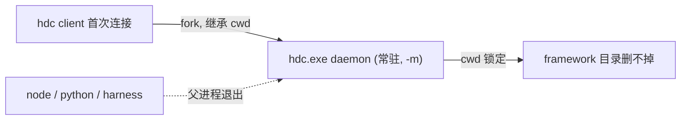

# hdc 进程治理（咽喉点隔离 + 单一 wrapper + 可选 daemon 回收 + harness 子树 tree-kill）

## 背景与根因

- 代码无显式 `hdc start`；`hdc.exe` 孤儿是 hdc client **首次连接时自动 fork 的常驻 server daemon**（残留命令行形如 `dummy -l 3 -s ::ffff:127.0.0.1:8710 -m`，`-m` 即 server 模式），它**脱离父进程树独立存活**并**继承首次拉起它的 client 的 cwd**。
- 现有 hdc 调用 `spawnSync` **均未设 cwd**，daemon 把 `framework/harness` 当工作目录锁住 → 删不掉目录；2.3.0 的 `taskkill /T` 只杀进程树，**抓不到已脱钩的 daemon**。
- `runHarnessPhase()`（[goal-runner.ts](harness/scripts/goal-runner.ts) L186）用 `spawnSync` 跑 harness-runner，**无 tree-kill**；`setupSignalHandlers()` 只回收 `activeAgentKill`（agent 子树），不回收 harness 子树。



## 设计原则（吸收两轮 review）

- **修复 vs 策略分离**：cwd 隔离是 *修复*（让残留 daemon 变良性，和 adb server 同型，不锁要删的目录）；`hdc kill` 是 *环境策略*（CI 该杀、开发机杀了断 DevEco）→ 加开关，不硬编码。
- **咽喉点 > 枚举**：不靠"逐 spawnSync 加 cwd + probeDevices 抢先"这种易漏、靠时序巧合的方式；改为在 daemon **唯一出生路径**上保证隔离 cwd 不变量。`buildHdcSpawnOptions` 注入 cwd 仅作 *防御层*。
- **单一 wrapper + 护栏**：所有 hdc 调用收敛到一个 spawn 入口，加测试/扫描禁止绕过，避免以后再长回来。

## 改造点

### 1. 咽喉点 + 单一 hdc spawn wrapper（治根）

- [hdc-runner.ts](profiles/hmos-app/harness/hdc-runner.ts)：
  - 新增隔离目录 `HDC_ISOLATED_CWD = path.join(os.tmpdir(), 'maison-hdc')`（首次 `mkdirSync` 确保存在）与纯函数 `buildHdcSpawnOptions()`（统一注入 `cwd` / `encoding` / `shell` / `maxBuffer`，便于单测）。
  - 抽出**唯一底层入口** `runHdcRaw(exe, args, opts)`，`runHdc`/`probeDevices`/`hdcListTargetsProbe` 全部走它。
  - **关键咽喉点**：`resolveHdcExecutableSync()`(L73) 内部的 `hdcListTargetsProbe()`(L56) 正是 daemon 首次出生的触发点，且在所有 hdc 使用的必经之路上。让它用 `HDC_ISOLATED_CWD` → **daemon 出生即隔离 cwd** 这一不变量天然成立，不依赖调用方时序。
  - 新增 `ensureHdcServerWarm()`：以隔离 cwd 显式跑一次 `list targets`（必要时 `hdc start`），幂等；保证「daemon 已以隔离 cwd 在跑」可被显式断言（应对 daemon 被外部杀/中途退出/PATH 命中不同 hdc）。

### 2. 消除 UT 链路第二份 probe（堵枚举遗漏）

- [hvigor-runner.ts](profiles/hmos-app/harness/hvigor-runner.ts) L1723 有**第二份 `probeDevices()`**，无 `hdcTargetPrefix()`、无 cwd，经 [ut-host-impl.ts](profiles/hmos-app/harness/ut-host-impl.ts) L600 `probeUtRunDevices` 进入 `ut_hvigor_test` 门禁——plan 第一版漏了它。
- 删除该重复实现，UT 链路改 `import { probeDevices } from './hdc-runner'`（统一带 prefix + 隔离 cwd + wrapper）。同步核对 `device-test.ts` / `ut-run.ts` / `device-install-diag.ts` 的 `probeDevices` 来源一致。
- 其余直接 spawn hdc 的点（[hdc-foreground-probe.ts](profiles/hmos-app/harness/hdc-foreground-probe.ts) L28/77/81/89、[device-test-run.ts](profiles/hmos-app/harness/providers/device-test-run.ts) L433/454、[app-snapshot-warmup.ts](profiles/hmos-app/harness/app-snapshot-warmup.ts) L186）一律改走 `runHdcRaw`。
- `spawnHylyre()`（[hylyre-spawn.ts](profiles/hmos-app/harness/hylyre-spawn.ts)）保持 `cwd=hypiumWorkDir`（python 依赖），但**每次调用前先 `ensureHdcServerWarm()`**，并保证本次 hylyre 返回前不执行 `hdc kill`；日志/meta 记录 hdc exe、isolated cwd、是否 prewarmed。

### 3. daemon 回收：策略化 + 责任边界（小修订）

- [hdc-runner.ts](profiles/hmos-app/harness/hdc-runner.ts) 新增 `killHdcServer()`（`hdc kill`，cwd 隔离，best-effort 吞错写日志）。
- **开关（字段位置 SSOT，避免"代码读 env 但配置写了不生效"）**：复用既有 `toolchain.devEcoStudio` 节——在 [harness/config.ts](harness/config.ts) L114 `DevEcoStudioConfig` interface 新增可选字段 `killHdcServerOnFinish?: boolean`（hdc 本就源自 `devEcoStudio.installPath`，语义贴合），由 profile 侧 `loadDevEcoConfig()` 读取；**不新增 root `device` 段**（否则要同步 `FrameworkConfig` / normalize / template / backfill 迁移）。env override（如 `MAISON_KILL_HDC_ON_FINISH`）优先级最高。默认自适应：检测到 CI 默认杀、开发机默认不杀（cwd 隔离后残留良性）。
- **责任边界**：模块级 `usedHdc` 标志，凡走过 hdc 的 provider 置位；在 **phase/check 顶层 finally** 统一 `killHdcServerIfUsed()`，覆盖 `device-test-install` / `device-test-run` / `runOnDeviceUt`([hvigor-runner.ts](profiles/hmos-app/harness/hvigor-runner.ts) L848) / `check-testing` / `check-ut` 的**异常与早退路径**（不放在某个末端 provider）。
- **cleanup 信号边界（明示，避免验收误判）**：phase/check 顶层 finally 覆盖正常返回 / 异常 / 大部分早退；但若 goal-runner 用 tree-kill 强杀 harness 子进程，子进程**可能来不及执行 finally**。这是可接受的——**强杀路径不承诺 kill daemon，只承诺 daemon cwd 不锁 framework**（cwd 隔离已让残留良性）。验收标准**不把"任何中断后都无 daemon"当硬要求**，只要求"残留 daemon 不锁 framework"。
- **已知限制（文档声明）**：feature 锁是 per-feature；两 feature 并发跑设备 phase 时，A 收尾 kill 会打断 B 的用例。常见场景不会跨 feature 并发，暂不做跨 feature daemon 协调。

### 4. runHarnessPhase 进程树回收（通用层，两位 reviewer 均同意）

- [goal-runner.ts](harness/scripts/goal-runner.ts) `runHarnessPhase()`(L186) 由 `spawnSync` 改异步 `spawn` + Promise 等待；保留 `MAISON_GOAL_RUNNER_ENV`、stdout/stderr 透传、退出码语义。
- 复用 [agent-invoke.ts](harness/scripts/utils/agent-invoke.ts) 已导出的 `killProcessTree(pid)`；新增 `activeHarnessKill`，与 `activeAgentKill` 对称；在 `setupSignalHandlers()`(L117) / `main()` `finally`(L701) / `process.on('exit')`(L706) 一并回收 harness 子树。

### 5. 单测与护栏

- 纯函数断言：`buildHdcSpawnOptions()` 的 `cwd` 在 framework 之外（= `HDC_ISOLATED_CWD`）。
- **wrapper 护栏**：单测或仓内扫描，禁止 `profiles/hmos-app/harness` 下新增绕过 wrapper 的 hdc 调用——匹配面覆盖 `spawnSync` **以及** `spawn` / `exec` / `execFile`（异步/exec 方式同样会绕过 wrapper），白名单仅 `runHdcRaw`。
- 断言 UT 链路 `probeDevices` 与 device-test 同源（不再有第二份实现）。
- 扩展 [goal-runner-hardening.unit.test.ts](harness/tests/unit/goal-runner-hardening.unit.test.ts)：`runHarnessPhase` 在异常/信号路径注册 harness tree-kill。

## 实施注意（非阻塞）

- **咽喉点要覆盖所有解析分支**：`resolveHdcExecutableSync()` 的每条返回分支都必须经过隔离 cwd 的 probe——尤其 `HARNESS_HDC_EXE`/`HDC_EXE`/`framework.local.json` 显式给定路径、以及 DevEco 候选"存在但 probe 失败仍返回"的分支（[hdc-runner.ts](profiles/hmos-app/harness/hdc-runner.ts) L99-102）会跳过 `hdcListTargetsProbe`。实现时确保这些分支也走 `ensureHdcServerWarm()`，否则该入口拉起的 daemon 不受隔离 cwd 约束。
- **kill 决策可观测**：把"本次是否执行 `killHdcServer`、开关来源（config / env / CI 默认）"写进 phase 的 meta/日志，便于日后排查"DevEco 连接为什么断了"，不靠猜。
- **hylyre 残余窗口（注释记一笔）**：hylyre 内部 hdc client 是唯一不受 wrapper 管控的调用方；`ensureHdcServerWarm()` 在 `spawnHylyre` 前预热已把风险压到"warm 与 hylyre 连接之间 daemon 恰被外部杀掉"这一极小窗口，配合"本进程 hylyre 返回前不 kill"的约束已足够，不必为它加锁。

## 版本

- frontmatter `version: 2.3.0`（用户自控版本，不 bump package.json）。

## 验收

```bash
cd harness && npm test
npm run release:check-plans
npm run release:verify
```

- 手动（**专门回归枚举遗漏点**）：跑一次 `ut_hvigor_test` 链路（即 plan 第一版漏掉的 `hvigor-runner.probeDevices` 入口），结束后检查无 `hdc.exe` 以 `framework/harness` 为 cwd 残留、`framework` 目录可删除；开关开启时确认 daemon 被回收。
