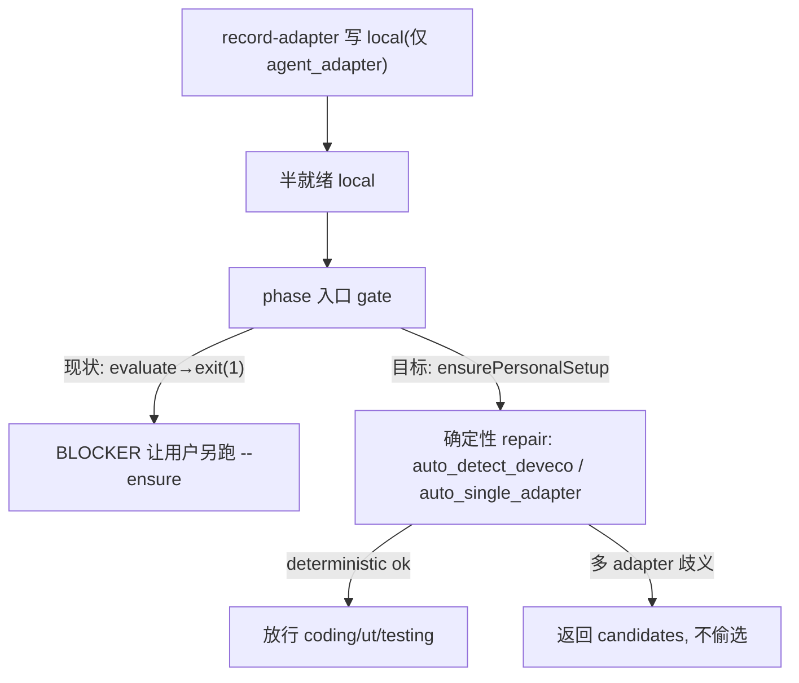

# personal setup 原子性 + Hylyre 0.3.0 vendor 接入

> scope 经评审升级：原「F3 局部修」不足以根治，故扩为 personal setup 原子性 + 0.3 vendor 接入。版本仍在研 2.3.0，**不改版本号**。

## 背景与审查结论（已逐条核实）

- Hylyre 0.3.0 发布件已就位：`profiles/hmos-app/vendor/hylyre/hylyre-0.3.0-py3-none-any.whl` + `release.manifest.json`（0.3.0）；`hylyre-0.2.0-py3-none-any.whl` 已从工作区删除（待 stage）。wheel 可信（manifest sha256/size 与文件一致）。
- F1（`input` 支持 `by_type`/富选择器/`into`）、F2（`scroll_to` 滚前先匹配）属 hylyre-core 运行时改动，maison 侧只需**消费侧文档**固化用法，无运行时代码改动。
- `#3`（positional `aa force-stop`）、`#6`（`app page save`）在 0.2.0 已落地（[device-test-run.ts](profiles/hmos-app/harness/providers/device-test-run.ts) `runAaForceStop`）。
- **真正根因（非 record-adapter 单点）**：阶段入口 [harness-runner.ts](harness/harness-runner.ts):303 只 `evaluatePersonalSetupGate`，失败即 `exit(1)` 让用户另跑 `--ensure`；但 [check-init.ts](harness/scripts/check-init.ts):991、[personal-setup-gate.ts](harness/scripts/utils/personal-setup-gate.ts):524 文档声称「阶段入口 --ensure 内联」。行为与文档不一致 → coding/ut/testing 的「半就绪 local」（如只记 `agent_adapter`、缺 DevEco）会卡 BLOCKER。可复用的 `ensurePersonalSetup`（[personal-setup-gate.ts](harness/scripts/utils/personal-setup-gate.ts):478）+ `attemptPersonalSetupRepair`（:502，含 `auto_single_adapter` / `auto_detect_deveco`）**已存在**，只是入口没用它。
- **发布泄漏**：[release-pack-rules.mjs](scripts/release-pack-rules.mjs):199 `collectReleaseFiles` 用 `fs.readdirSync` 扫文件系统、与 git 索引无关；[release-excludes.json](scripts/release-excludes.json) 无规则排除 vendor 移交 md → 两份 md 无论是否 tracked 都会进 zip。
- **manifest 悬挂引用**：[release.manifest.json](profiles/hmos-app/vendor/hylyre/release.manifest.json):16 `integration_docs` + `note` 引用 `downstream-harness-requests.md`；不发布 md 则指向不存在文件。

## 改造点

### 1. plan 自身合规（评审#1）

- 本 plan frontmatter 已补 `version: 2.3.0`，使开发期 `node scripts/check-plan-version.mjs` PASS；不改 `package.json.version`。
- 注意：`npm run release:check-plans`（发布门禁）在本 plan 仍有 pending todo 时会失败，这是**正常发布门禁行为**（非 frontmatter 问题）；待本 plan todos 全部 completed 后再过该门禁。

### 2. vendor 发布件对齐 0.3.0（评审依据）

- `git add` 新增 `hylyre-0.3.0-py3-none-any.whl` 与已改的 `release.manifest.json`；stage 删除 `hylyre-0.2.0-py3-none-any.whl`。
- 两份移交 md（`hylyre-optimization-requests-v2.md`、`downstream-harness-requests.md`）留在磁盘**不入库**；其「不进发布件」由下条 release 规则强保证（不再依赖 untracked）。

### 3. 修 release 边界（评审#2/#3，manifest 选 sanitize）

[release-excludes.json](scripts/release-excludes.json)：

- 新增 `excludeGlobs`: `profiles/*/vendor/**/*.md`（排除 vendor 下所有 md）。
- 新增 `includeOverrides`: `profiles/hmos-app/vendor/hylyre/README.md`（仅放行 README；`classifyPath` 先查 includeOverrides，故 README 不被误杀）。
  - 注意 `includeOverrides` 为精确路径匹配，本次仅声明放行该 README；未来若新增其它 vendor README，需扩展 override（或引入 glob 版 override）——不挡当前实施。

[release-pack-rules.mjs](scripts/release-pack-rules.mjs)：

- 新增 `sanitizeVendorManifest(manifest)`（与 `sanitizePackageJson` 同构）：删除 `integration_docs`，并把 `note` 中对 `downstream-harness-requests.md` 的指引替换为「见 README.md」。
- `runSyntheticRuleTests` 补断言：vendor 移交 md 被 `excludeGlobs` 排除、README 被 includeOverride 放行、`sanitizeVendorManifest` 移除 `integration_docs`。

[pack-release.mjs](scripts/pack-release.mjs) `writeStaging`（:53-82）：

- 仿 `package.json` 特判：若 staging 含 `profiles/hmos-app/vendor/hylyre/release.manifest.json`，读原始 → `sanitizeVendorManifest` → 覆写 staging 副本（源文件不动，符合「不手改 manifest」——只在发布产物里清理）。

[verify-release-pack.mjs](scripts/verify-release-pack.mjs)：dry-run/zip 断言中加「vendor 目录不含 `*-requests*.md`、manifest 无 `integration_docs`」。

### 4. 刷新 vendor README（消费侧）

[README.md](profiles/hmos-app/vendor/hylyre/README.md)：

- 标题「Framework 集成要点（vendor 0.2.0）」→ `0.3.0`；「Hylyre 0.2.0 CLI / 步骤能力」→ `0.3.0` 并补 F1（`input` 支持 `by_type`/富选择器/`into` 一步式）/F2（`scroll_to` 先匹配再滚）。
- commit 示例 → `chore(vendor): hylyre 0.2.0 -> 0.3.0`。
- 新增一句：F3「半就绪 local」已由阶段入口内联 repair 解决（见下），无需手动 `--ensure`。

### 5. personal setup 根因修复（评审#5，scope A 核心）

[harness-runner.ts](harness/harness-runner.ts):302-313：

- 将 `evaluatePersonalSetupGate(projectRoot, { requiredPrerequisites })` 改为 `ensurePersonalSetup(projectRoot, { requiredPrerequisites })`（import 自 personal-setup-gate）。`ensurePersonalSetup` 内部循环 `evaluate + attemptPersonalSetupRepair`，确定性场景（单 adapter / DevEco 探测）自动补写 local 后放行。
- 仍 `!ok` 时（如多 adapter 歧义返回 candidates）保留现有 `console.error + exit(1)`，**不偷偷选 adapter**。
- `personalSetupExemptPhases`（init/docs）与 `placement` 前置校验逻辑不变。
- 影响面审计：跑全量 [harness 单测/fixture](harness/tests)（评审注当前 869 unit + 33 fixture 全绿），修正任何「期望 evaluate 直接失败」却应被确定性 repair 放行的用例；docs 与行为对齐后这些用例语义需更新。

### 6. F3 record-adapter 原子性 + 测试注入点（评审#4）

[init-task-executor.ts](harness/scripts/utils/init-task-executor.ts) `case 'record-adapter'`（:481）：

- 写 `agent_adapter` 后**复用共享 repair**：调 `ensurePersonalSetup`，而非直接 `detectScan()`——使「记 adapter」后 local 尽量原子完整。
- **phase 来源（本轮评审#1）**：`InitExecutionContext`（[init-task-executor.ts](harness/scripts/utils/init-task-executor.ts):57）**无 `phase` 字段**，record-adapter 也不归属单一 phase。故**不走** `resolveEnsurePrerequisites(_, phase)`，改新增「跨 phase 并集」helper `resolveAllPersonalPrerequisites(projectRoot)`（在 [phase-personal-prerequisites.ts](harness/scripts/utils/phase-personal-prerequisites.ts) 对 resolved profile 的 `personalPrerequisites` map 求并集），把 profile 声明过的 `deveco_toolchain` 等纳入；避免拿不到 phase 退回默认 `{agent_adapter}`（[personal-setup-gate.ts](harness/scripts/utils/personal-setup-gate.ts):285）。
  - 该 helper 返回值**显式包含 `agent_adapter`**（即 `agent_adapter` + profile prerequisites 并集），使其作为通用 API 不易埋坑，而非仅返回 profile 声明项。
- **非致命 advisory（本轮评审#2）**：`ensureDevecoToolchain`（[personal-setup-gate.ts](harness/scripts/utils/personal-setup-gate.ts):116）探测不到 DevEco 返回 `ok:false`。record-adapter 先写 `agent_adapter`（已持久化），再 best-effort 调 ensure 补 DevEco；**无候选时记 advisory、不让任务失败**（返回成功 message 并注明未补 DevEco），真正 BLOCKER 仍由 phase 入口（第 5 节）把关。这与测试「探测无果 → local 仅 `agent_adapter`、任务成功」一致。
- 测试**复用现有注入点** `__testing_setDetectScanForEnsure`（[personal-setup-gate.ts](harness/scripts/utils/personal-setup-gate.ts):41）注入 deveco 探测桩，**不另造一套**（上轮评审#3）。

### 7. 固化 0.3 step 语法到消费侧文档（评审建议）

- [hylyre-planned-step-fields.md](profiles/hmos-app/skills/device-testing/reference/hylyre-planned-step-fields.md)：补 `input` 的 `by_type`/富选择器/`into` 一步式定位输入；`scroll_to` 先匹配语义。
- [device-testing profile-addendum.md](profiles/hmos-app/skills/device-testing/profile-addendum.md) 及 adhoc input 示例：把「先 touch 再 input」绕过更新为单条 `input` 用法。

### 8. 测试

- [init-task-executor.unit.test.ts](harness/tests/unit/init-task-executor.unit.test.ts)：现有「record-adapter writes local」用例 + 新增「注入 deveco 探测命中 → local 含 installPath」「探测无果 → 仅 agent_adapter」。
- personal-setup-gate / harness-runner 相关单测：覆盖入口确定性 repair 放行 + 多 adapter 仍返回 choice。
- release：补 `release-pack-rules` 的 vendor md 排除与 manifest sanitize 用例。

## 验收

- `cd harness && npm test` 全 PASS（AGENTS.md BLOCKER）。
- 开发期 `node scripts/check-plan-version.mjs` PASS；`npm run release:check-plans` 待本 plan todos 全 completed 后再过（pending todo 时失败属正常发布门禁，非 frontmatter 问题）。
- `npm run release:verify`：dry-run 收集中 vendor 目录**不含** `*-requests*.md`，staging manifest **无** `integration_docs` 悬挂引用。
- `git status`：vendor 仅 0.3.0 wheel + manifest 入库，0.2.0 wheel 删除，两份 md 保持 untracked 但不进发布件。
- 阶段验证：只记 `agent_adapter` 的半就绪 local，本机已装 DevEco 时直接跑 testing/coding/ut 不再 BLOCKER（入口内联补写），无需手动 `check-personal-setup --ensure --phase`。

## 不做

- 不改 hylyre wheel / 源 manifest 文件内容（manifest 仅在**发布产物**里 sanitize，源覆盖拷贝照旧）。
- 不改版本号（在研 2.3.0，版本演进 BLOCKER）。
- 不把两份移交 md 合入仓库，也不正式将其纳入发布内容。
- 多 adapter 场景不自动选择，仍返回 candidates 由上层决策。
