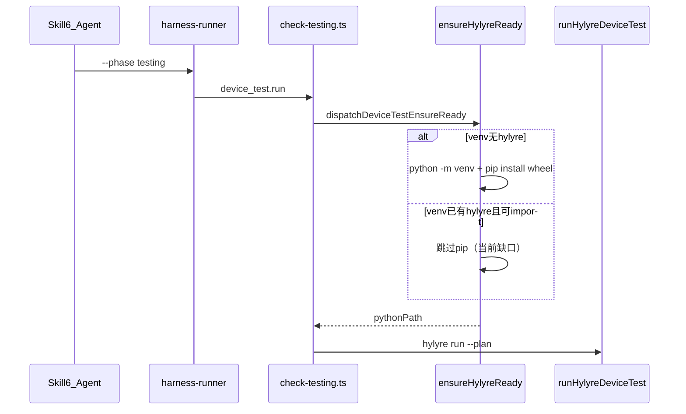
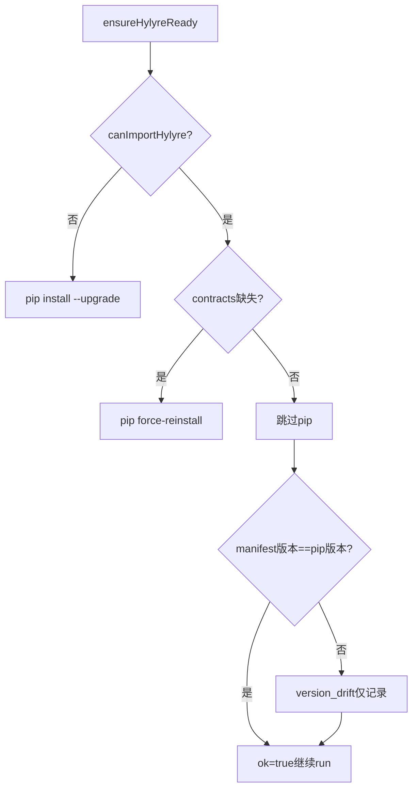

# Hylyre 安装/升级机制调研与改进计划

## 结论（直接回答你的问题）

**触发 Skill 6 文档流程本身不会安装 Hylyre**；真正触发安装的是 **跑 `testing` 阶段 harness** 时：

```bash
cd framework/harness && npx ts-node harness-runner.ts --phase testing --feature <feature>
```

调用链：



**不需要单独命令**——只要跑 testing harness（Skill 6 Step 7 的常规闭环），就会走 `ensureHylyreReady`。

**但**：你已更新 vendor 发布件后，**当前实现大概率不会自动装新版**，除非：
- 首次（`.hylyre/venv` 不存在 / 无法 `import hylyre`），或
- 旧 wheel 缺 `hylyre/contracts/*`（会走 `force-reinstall` 修复路径），或
- 你**手动删除** [`.hylyre/venv`](.hylyre/venv)（[vendor README](framework/profiles/hmos-app/vendor/hylyre/README.md) 故障排查建议）

这与你的预期不符；需要改 framework 源头。

---

## 当前实现要点（代码证据）

核心逻辑在 [`framework/profiles/hmos-app/harness/providers/device-test-run.ts`](framework/profiles/hmos-app/harness/providers/device-test-run.ts) 的 `ensureHylyreReady()`：

| 场景 | 行为 |
|------|------|
| 无 venv / 无法 `import hylyre` | 创建 [`.hylyre/venv`](framework.config.json) → `pip install --upgrade <vendor-wheel> hylyre[device,mcp]` |
| 已能 `import hylyre` | **直接进入后续检查，不跑 pip**（L400-402） |
| 缺 contracts 文件 | `pip --force-reinstall` vendor wheel |
| `pip show` 版本 ≠ `release.manifest.json` 的 `hylyre_version` | 记 `version_drift` 错误，但 **仍返回 `ok: true`**（L686-693, L743：`version_drift` 不计入失败） |
| `release.manifest.json` 的 `wheel.sha256` | **读取 manifest 但未用于升级判定** |
| `HYLYRE_PYTHON` / `HYLYRE_HOME` | 跳过默认 venv 管理，不自动升级（用户自备环境） |

配置 SSOT：[`framework.config.json` → `tools.hylyre`](framework.config.json)（`auto_install: true` 默认开启）。

Vendor 同步流程：[`framework/profiles/hmos-app/vendor/hylyre/README.md`](framework/profiles/hmos-app/vendor/hylyre/README.md)（从 Hylyre `dist/release` 覆盖拷贝 wheel + manifest；**应先删旧 wheel**）。

`findVendorWheel()` 仅取 `readdirSync` 第一个 `hylyre-*.whl`（L200-205）——若误留多个 wheel，选择不确定。

---

## 缺口根因



**问题**：vendor 升级（版本号或 sha256 变化）但旧包仍可 import 时，走 F→H→I，**不会重装**。

---

## 改进方案（你已选：自动 pip 升级/重装）

### 1. 在 `ensureHylyreReady` 增加「vendor 对齐」分支

**修改文件**：[`device-test-run.ts`](framework/profiles/hmos-app/harness/providers/device-test-run.ts)

在 `canImportHylyre === true` 且 contracts 完整之后、版本比对之前，新增：

- 读取 [`release.manifest.json`](framework/profiles/hmos-app/vendor/hylyre/release.manifest.json)（已有 `readVendorManifest`）
- 读取 venv 内 `pip show hylyre` 版本（已有 `pipShowVersion`）
- 读取 vendor wheel 文件 sha256，与 manifest 声明比对（manifest 已有 `wheel.sha256` 字段，目前未用）
- 可选：在 [`hylyre-ready.meta.json`](doc/features/home-page/testing/reports/hylyre-ready.meta.json) 缓存上次安装的 `manifest_version + wheel_sha256`

**触发重装条件**（任一满足且 `auto_install=true`、非 `HYLYRE_PYTHON` 覆盖）：
- `pipVersion !== manifest.hylyre_version`
- vendor wheel 的 sha256 ≠ manifest.wheel.sha256（wheel 文件被替换但版本号未 bump 的补丁场景）
- vendor wheel 的 sha256 ≠ meta 中上次安装记录的 sha256

**动作**：
- 调用已有 `runHylyrePipInstall({ mode: 'upgrade' })`；若 upgrade 后版本仍不一致则 fallback `force-reinstall`
- 重装成功后更新 `hylyre-ready.meta.json` 指纹
- 若 `doctor_first_run` 为 true，在「本次发生升级」时也跑 `python -m hylyre doctor`（不仅限于 `installedNow` 首次安装）

**`version_drift` 语义调整**：
- 自动升级成功 → 清除 drift，`versionConsistent=true`
- 自动升级失败 → `ok=false`（harness BLOCKER），明细指向 `hylyre-doctor.log`

### 2. 修正 `findVendorWheel` 选型

**同文件** L200-205：

- 优先使用 `manifest.wheel.filename` 指定文件
- 否则在多个 `hylyre-*.whl` 中按文件名版本排序取最新
- 避免 README 要求删旧 wheel 但用户遗漏时装错包

### 3. 文档同步（framework 源头）

| 文件 | 更新内容 |
|------|----------|
| [`profile-addendum.md`](framework/profiles/hmos-app/skills/6-device-testing/profile-addendum.md) | 明确：跑 testing harness 会自动 ensure；vendor 更新后**无需手删 venv**（除非 `HYLYRE_PYTHON` 或 `auto_install=false`） |
| [`vendor/hylyre/README.md`](framework/profiles/hmos-app/vendor/hylyre/README.md) | 升级后只需覆盖 vendor + 重跑 testing；手删 venv 降为兜底 |
| [`SKILL.md` Step 1.5/7](framework/skills/6-device-testing/SKILL.md) | 一行说明 ensure 在 harness 内自动执行，非 Skill 入口独立步骤 |

**不改**实例侧 [`.cursor/skills/6-device-testing/SKILL.md`](.cursor/skills/6-device-testing/SKILL.md) 跳板（framework 优先原则）。

### 4. 单元测试

在 [`framework/harness/tests/unit/`](framework/harness/tests/unit/) 新增 `hylyre-ensure-upgrade.unit.test.ts`（或扩展现有 harness 测试）：

- mock/spy `pipShowVersion` + manifest 版本不一致 → 应调用 `runHylyrePipInstall`
- sha256 变化、版本相同 → 应触发重装
- `HYLYRE_PYTHON` 覆盖 → 不自动改环境，仅报明确错误
- 升级成功后 `versionConsistent=true`

### 5. 你本地验证步骤（改进落地后）

1. 覆盖 vendor wheel + `release.manifest.json`（你已完成）
2. **直接**跑：`cd framework/harness && npx ts-node harness-runner.ts --phase testing --feature home-page`
3. 检查：
   - [`doc/features/home-page/testing/reports/hylyre-doctor.log`](doc/features/home-page/testing/reports/hylyre-doctor.log) 含 `pip install`
   - [`hylyre-ready.meta.json`](doc/features/home-page/testing/reports/hylyre-ready.meta.json) 中 `hylyreVersion` 与 manifest 一致
   - `.hylyre/venv` 内 `pip show hylyre` 版本已更新

**无需**单独 `pip install` 命令；也**无需**先删 venv（改进后）。

---

## 与 Skill 6 的关系（操作层面）

| 动作 | 是否触发 Hylyre ensure |
|------|------------------------|
| 仅读 Skill 6 / 写 test-plan | 否 |
| `harness-runner --phase testing` | **是**（build → install → ensure → run） |
| Skill 6 即席 `_adhoc` 模式 | 是（直接调 `dispatchDeviceTestEnsureReady`） |
| `framework-init` / 其它 phase harness | 否（仅 gitignore 提及 `.hylyre/`） |
| 设置 `HYLYRE_PYTHON` 指向外部 Python | 跳过 venv 管理，**不自动升级** |

---

## 风险与边界

- **传递依赖**：hylyre 本体从 vendor wheel 装，hypium 等仍走 PyPI；升级 hylyre 不会重装全部传递依赖，除非 pip 解析需要（与现行为一致）。
- **离线/内网**：pip 失败时 harness 仍 BLOCKER；需配置 `pypi_extra_index_url` 或 `~/.pip/pip.conf`（已有文档）。
- **同版本 sha256 变**：靠 sha256 指纹检测，覆盖 vendor 即可触发重装，不依赖 bump 版本号。
