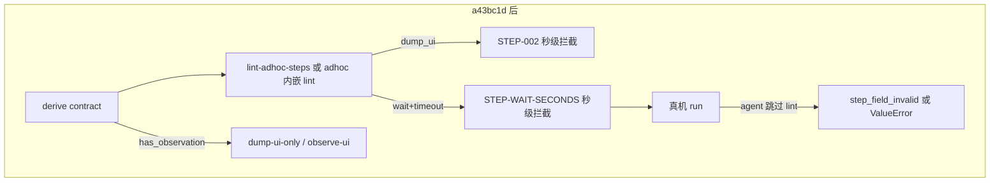

# Hylyre 步骤错误根因分析（dump_ui / wait·seconds）

> **勘校基准**：`main` @ `a43bc1d`（`6dcf0ba` 即席体验 + `a43bc1d` wait.seconds/plan 对齐）

## 结论先行（2026-05-20）

| 问题 | 当前状态 | 覆盖路径 |
|------|----------|----------|
| **1. dump_ui 禁止写进步骤** | **已缓解**（derive 分流 + STEP-002 + `--dump-ui-only`/`--observe-ui`） | 即席 `--steps-file`、plan Markdown、写前 lint |
| **2. wait 要用 seconds 不是 timeout** | **已解决写前拦截**（STEP-WAIT-SECONDS + catalog + SSOT 文档） | `lint-adhoc-steps`、`adhoc --steps-file`、`adhoc --plan`（复用共享 lint） |
| **3. 真机仍报 wait requires seconds** | **仅 lint 被跳过时**；trace 可归类 `step_field_invalid` | `classifyRunFailure` @ `device-test-run.ts` L167-168 |

**仍未解决（另见 [即席重跑页面状态分析_e23c91af.plan.md](即席重跑页面状态分析_e23c91af.plan.md)）**：失败后重跑停在子页、把子页当首页 —— 与步骤 JSON 语法无关，需 `--cold-restart`。

---

## 已实现机制（代码 SSOT）

### dump_ui

| 机制 | 文件 | 状态 |
|------|------|------|
| STEP-002 禁 `dump_ui`/`dump-ui` | [`hylyre-planned-step-lint.ts`](framework/harness/scripts/utils/hylyre-planned-step-lint.ts) | ✅ |
| `observation_steps` 分流 | [`adhoc-derive-helpers.ts`](framework/harness/scripts/utils/adhoc-derive-helpers.ts) | ✅ |
| `forbidden_in_steps` in derive | [`adhoc-derive-payload.ts`](framework/harness/scripts/utils/adhoc-derive-payload.ts) schema 4 | ✅ |
| 写前 lint CLI | [`lint-adhoc-steps.ts`](framework/harness/scripts/lint-adhoc-steps.ts) | ✅ |
| `--dump-ui-only` / `--observe-ui` | [`adhoc-device-test.ts`](framework/harness/scripts/adhoc-device-test.ts) | ✅ |
| Skill 观察决策树 | [`SKILL.md`](framework/skills/6-device-testing/SKILL.md) Step 4.B | ✅ |

### wait.seconds

| 机制 | 文件 | 状态 |
|------|------|------|
| **STEP-WAIT-SECONDS**（必填 `seconds`，禁 `timeout`/`duration`） | [`hylyre-planned-step-lint.ts`](framework/harness/scripts/utils/hylyre-planned-step-lint.ts) L33-71 | ✅ |
| **STEP-WAIT**（`wait_for` 须 selector/by_text/by_id） | 同上 L73-91 | ✅ |
| `WAIT_FIELD_TIMING_REF` + `STEP_SHAPE_CATALOG` | [`adhoc-derive-helpers.ts`](framework/harness/scripts/utils/adhoc-derive-helpers.ts) | ✅ |
| derive `wait_field_timing_ref` / `canonical_format` | [`adhoc-derive-payload.ts`](framework/harness/scripts/utils/adhoc-derive-payload.ts) | ✅ |
| Vendored 字段 SSOT | [`hylyre-planned-step-fields.md`](framework/profiles/hmos-app/skills/6-device-testing/reference/hylyre-planned-step-fields.md) | ✅ |
| Plan Markdown 复用共享 lint | [`derived-hylyre-plan.ts`](framework/harness/scripts/utils/derived-hylyre-plan.ts) `lintHylyrePlanStepRules` | ✅ |
| 运行时 `step_field_invalid` | [`device-test-run.ts`](framework/profiles/hmos-app/harness/providers/device-test-run.ts) | ✅ |
| 单测 | `hylyre-planned-step-lint.unit.test.ts`、`derived-hylyre-plan.unit.test.ts`、`run-failure-classify.unit.test.ts` | ✅ |

---

## 错误发生在哪一层（当前）

---

## Lint 路径差异（文档易混点）

| 入口 | STEP-001~002 / WAIT* | STEP-003~006 | NAV-001~003 | 失败是否阻断 run |
|------|---------------------|--------------|-------------|------------------|
| `npm run lint-adhoc-steps` | ✅ | ❌ | ❌ | CLI exit 1 |
| `adhoc --steps-file` | ✅ | ❌ | ❌ | exit 2 + trace |
| `adhoc --plan` | ✅ STEP + 共享 WAIT* | ✅ STEP-003~006 | ⚠️ **仅写入 plan-lint.json** | **仅** `lint.violations` 中 BLOCKER；**NAV 不阻断**（[`adhoc-device-test.ts`](framework/harness/scripts/adhoc-device-test.ts) L389-402） |
| 标准 `check-testing` | ❌ | ❌ | ✅ NAV only | harness FAIL |

**contract vs lint 不一致**：derive `forbidden_in_steps` 含 `start_app`，但 `validatePlannedStepsArray` **仍允许** `start_app` 根键（STEP-003 仅在 plan Markdown lint）。→ todo `lint-start-app-json`。

---

## 证据链：Hylyre 0.1.0（不变）

- Planned step 根键 **不含** `dump_ui`；`dump-ui` 为 CLI 探索命令（[`app-snapshot-warmup.ts`](framework/profiles/hmos-app/harness/app-snapshot-warmup.ts)）。
- `wait` → **`seconds`**；`wait_for`/`wait_gone`/`wait_idle`/`assert_toast` → **`timeout`**（wheel `hylyre/api/agent.py`）。
- wheel 内无 `agent-plan-a.md`；framework 以 [`hylyre-planned-step-fields.md`](framework/profiles/hmos-app/skills/6-device-testing/reference/hylyre-planned-step-fields.md) 为消费侧 SSOT。

---

## 剩余 gap（Phase 2，非本 plan 原 todo）

1. **`lint-start-app-json`** — JSON steps-file 与 derive contract 对齐禁止 `start_app`。
2. **`adhoc-plan-nav-blocker`** — 即席 `--plan` 是否在 NAV 违规时 exit 2（与 profile「Plan lint 门禁」文案对齐）。
3. **`lint-wait-gone-idle-toast`** — 扩展字段 lint（低优先级；运行时 Hylyre 会报错）。
4. **`test-plan-hylyre-template.md`** — 可选补 `wait` 示例一行（模板仍无 wait 形态，derive catalog 已覆盖）。

**不在本 plan 范围**：UI 重跑污染 → [`即席重跑页面状态分析_e23c91af.plan.md`](即席重跑页面状态分析_e23c91af.plan.md)。

---

## 真实工程落地检查清单

- [x] `npm run lint-adhoc-steps` 存在（`framework/harness/package.json`）
- [x] derive 含 `observation_steps`、`forbidden_in_steps`、`step_shape_catalog`、`wait_field_timing_ref`
- [x] 含「查看/汇总」NL 可走 `--observe-ui` 或 touch run + `--dump-ui-only`
- [x] `wait.seconds` 写前校验（STEP-WAIT-SECONDS）；plan Markdown 同规则
- [x] SKILL / profile / agent-execution 误导性报错表含 `wait requires seconds`
- [ ] JSON lint 禁止 `start_app`（contract 已禁，lint 未禁）
- [ ] 即席 `--plan` NAV 是否硬阻断（待产品决策）
- [ ] 失败后重跑 UI 复位（cold-restart plan）

---

## Commits

| Commit | 内容 |
|--------|------|
| `6dcf0ba` | 即席体验：derive contract、lint-adhoc-steps、normalize、observe-ui、dump-ui-only |
| `a43bc1d` | wait.seconds lint、catalog、reference doc、plan lint 复用、step_field_invalid |
