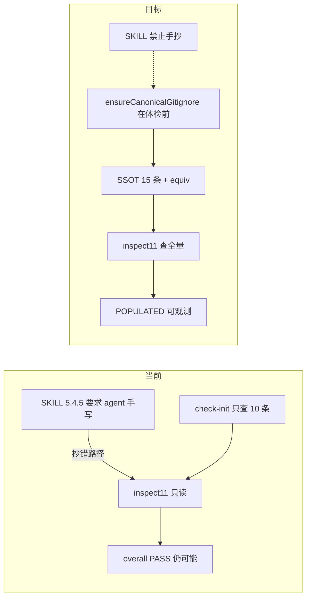

# Framework Init：`.gitignore` 自动同步修改计划（已对照最新代码修订）

## 当前代码基线（2026-05-19 探索结论）

### 与本 plan 直接相关：尚未实现


| 项                                                                                  | 状态                                                                                                                                                                              |
| ---------------------------------------------------------------------------------- | ------------------------------------------------------------------------------------------------------------------------------------------------------------------------------- |
| `[canonical-gitignore.ts](framework/harness/scripts/utils/canonical-gitignore.ts)` | **不存在**（`ensureCanonicalGitignore` / `CHECK_INIT_SKIP_GITIGNORE_SYNC` 全库无匹配）                                                                                                    |
| `[check-init.ts](framework/harness/scripts/check-init.ts)` L112–168                | 仍内联 **10 条** `CANONICAL_IGNORE_PATTERNS`；`inspect11` **只读**；`strategyText(11,'MISSING')` 仍为「Step 5.4.5 创建/追加」L899                                                               |
| init 体检 #11 与 BLOCKER                                                              | `inspect11` 为 **MISSING/POPULATED 三态之一**，**不**进入 `blockers[]`；聚合结果里 MISSING 仅标 **WARN**（L2160）。即：**缺 gitignore 规则时 init 仍可 overall PASS**——问题在「体检表误导 + agent 手抄」，而非 harness 硬失败 |
| SKILL 5.4.5 vs 脚本                                                                  | [SKILL 概述第 6 条](framework/skills/00-framework-init/SKILL.md) 已写「自动补齐」，但 §0.3.2 #11、§5.4.5.3 仍要求 **agent 在 Step 5.4.5 手写**——文档自相矛盾                                               |


### 本实例 `[.gitignore](.gitignore)`（SimulatedWalletForHmos）

- **已具备** SKILL 5.4.5.1 全部 framework canonical（含 `doc/features/*/*/reports/`*、`/.hylyre/`、`/doc/app-snapshot-cache/`、`/doc/features/_adhoc/`）。
- **另有实例级扩展**（不在 framework canonical SSOT 内，ensure **不得删除**）：
  - L49–50：`/reports/`（注释：Hylyre/Hypium 以工程根 cwd 落盘的 task 日志）
  - L52–53：`/build-profile.json5`（本机 build-profile 差异）
- 对当前仓库跑 ensure 的预期：`added=[]`，`inspect11` 在 **补齐 check-init 校验范围后** 应为 POPULATED（今日 inspect11 仅查 10 条，因 `**/node_modules` 等等价规则已可 POPULATED）。

### 关联 plan「快照缓存与真机耗时」：已落地（本 plan 不重复实现）

以下在代码中 **已存在**，勿在 gitignore plan 里当作待办：


| 能力                                 | 代码锚点                                                                                                                                                                                                                                                                                                      |
| ---------------------------------- | --------------------------------------------------------------------------------------------------------------------------------------------------------------------------------------------------------------------------------------------------------------------------------------------------------- |
| `app page save` CLI（BUNDLE + NAME） | `[device-test-page-save.ts](framework/profiles/hmos-app/harness/device-test-page-save.ts)`                                                                                                                                                                                                                |
| build/install 复用                   | `[device-test-build-reuse.ts](framework/profiles/hmos-app/harness/device-test-build-reuse.ts)`、`HARNESS_DEVICE_TEST_FORCE_BUILD`                                                                                                                                                                          |
| `device-test-timing.json`          | `[device-test-timings.ts](framework/profiles/hmos-app/harness/device-test-timings.ts)`、`[check-testing.ts](framework/harness/scripts/check-testing.ts)` 接入                                                                                                                                                |
| hypium `tmp_hypium` 隔离             | `[device-test-hypium-workdir.ts](framework/profiles/hmos-app/harness/device-test-hypium-workdir.ts)`、`[device-test-run.ts](framework/profiles/hmos-app/harness/providers/device-test-run.ts)` cwd → `reports/.hypium-workdir`；**无需**在工程根 `.gitignore` 单独加 `tmp_hypium`（落在 `doc/features/*/*/reports/`* 内） |
| home-page 验收 / test-report v1.5    | `doc/features/home-page/` 产物（对话中已多轮 PASS）                                                                                                                                                                                                                                                                 |


仍属 **快照 plan 可选、未做**：`derive-hint` 的 `snapshot_cache_empty`、层 3「只改 test-plan 不重编」E2E——**不在本 plan 范围**。

### 工作区其它未提交改动（实施时隔离）

`git status` 中尚有 `**framework/agents/`***、`.cursor/rules` 副本、`check-testing`/`verify-testing` 等 diff——**本 plan 提交边界仅 framework init/gitignore 相关文件**，勿与 agents/bundle 改动混 commit。

### check-init 其它近期能力（与 gitignore 无关）

- `generic` adapter：`resolveBundleForInitInspect` + PASS 后 `applyAgentBundleInlineSync`（L2094–2099）。
- 与 mechanism sync（`applyInitMechanismSync`）同样：**PASS 之后**执行，**不能**替代「体检前写 gitignore」。

---

## 背景与根因（修订）


| 现象                                                                               | 根因                                                       |
| -------------------------------------------------------------------------------- | -------------------------------------------------------- |
| Wallet 等实例出现 `/harness/reports/`*（缺 `framework/`、行首空格）                           | agent 按 SKILL §5.4.5 **手抄**；framework **无**该错误模板         |
| init 显示 #11 MISSING 或 agent 跳过 Step 5.4.5 仍「完成」                                  | `inspect11` **不阻断** PASS；MISSING 在 stdout 中为 WARN 级叙事    |
| 仅依赖 `**/node_modules` 时 inspect11 可 POPULATED，但 **缺** feature reports / hylyre 等 | `check-init` 只校验 **10 条**，未校验 SKILL 中另外 **5 条**（见下）      |
| SKILL 与脚本双源                                                                      | SKILL 5.4.5.1 共 **15 条** pattern；`check-init` 仅 **10 条** |





---

## 目标行为

1. 每次 `harness-runner --phase init` → `check-init` 在 **L1999「跑 11 项体检」之前** 调用 `ensureCanonicalGitignore(projectRoot)`。
2. ensure **只追加**缺失 canonical + 分段注释；不删、不重排、不因 EOL 重写整文件。
3. **SSOT 单文件** `canonical-gitignore.ts` 与 SKILL 5.4.5.1/5.4.5.2 对齐（15 条）；`check-init` 仅 import。
4. agent **禁止**手抄 block；Step 5.4.5 改为核对 `gitignore_sync` / stderr。
5. **不**把 `reports/`* 改为 `reports/`**（实例与 SKILL 已统一用 `*`；`[MIGRATION.md](framework/MIGRATION.md)` 可选 `*`* 仅作宽泛等价说明，非强制迁移）。

---

## Canonical 列表（15 条，非 17 条）

**check-init 现有 10 条**（L112–125）保留。

**需新增进 SSOT / inspect11 / ensure 的 5 条**（SKILL L705–712，check-init 当前缺失）：

1. `doc/features/*/*/reports/`*
2. `/.hylyre/`
3. `/doc/app-snapshot-cache/`
4. `/doc/features/_adhoc/`

（上表 4 条 + 原 10 条中已含 `.framework-backup/` 等 = **15 条**；勿再误写「17 条」。）

**等价表**：按 SKILL 5.4.5.2 表格迁入 `IGNORE_EQUIV_PATTERNS`（含上表 4 条的等价行）。

**不纳入 framework canonical（可选文档）**：

- 本实例的 `/reports/`、`/build-profile.json5` → 可写在 [hmos-app `00-framework-init` profile-addendum](framework/profiles/hmos-app/skills/00-framework-init/profile-addendum.md) 的「实例建议追加」段，**不**写入全局 canonical（避免所有 profile 被 HarmonyOS 特例绑架）。

---

## 实现方案

### 1. 新建 `[framework/harness/scripts/utils/canonical-gitignore.ts](framework/harness/scripts/utils/canonical-gitignore.ts)`


| 导出                                         | 职责                      |
| ------------------------------------------ | ----------------------- |
| `CANONICAL_IGNORE_PATTERNS`                | 15 条，与 SKILL 5.4.5.1 一致 |
| `IGNORE_EQUIV_PATTERNS`                    | 与 SKILL 5.4.5.2 一致      |
| `parseGitignoreLines` / `patternIsCovered` | 自 check-init 迁出         |
| `ensureCanonicalGitignore(projectRoot)`    | 幂等写入                    |


```ts
interface GitignoreEnsureResult {
  path: '.gitignore';
  created: boolean;
  added: string[];   // 本次新追加的 pattern 行
  skipped: boolean;  // 已全部覆盖或 SKIP env
}
```

分段注释头与 SKILL 5.4.5.1 示例一致（Framework runtime / state / Skill 0 staging / backup / feature reports / Skill 6）。

**刻意不做**：

- 不自动删除 `/harness/reports/`*、`/reports/` 等错行。
- `inspect11` **advisory**（不 FAIL）：行匹配 `^\s*/?harness/reports` 且非 `framework/harness/reports`；可选提示根目录 `/reports/` 与 `framework/harness/reports/` 区别。

### 2. 修改 `[check-init.ts](framework/harness/scripts/check-init.ts)`

**插入点**：L1999 之前（`inspectorEnv` 已含 `projectRoot` 即可）。

```ts
let gitignoreEnsure: GitignoreEnsureResult | null = null;
if (process.env.CHECK_INIT_SKIP_GITIGNORE_SYNC !== '1') {
  gitignoreEnsure = ensureCanonicalGitignore(ctx.projectRoot);
  // stderr 摘要…
}
```

**同步修改**（原 plan 遗漏）：

- 删除 L112–168 内联常量，改为 import utils。
- `**strategyText` 第 11 行**（L899）：MISSING/EMPTY →「`check-init` 体检前已 `ensureCanonicalGitignore`（见 stderr / check-init.json）」；POPULATED 不变。
- `inspect11`：改用 utils；missing 时 diagnosis 注明「ensure 已执行，若仍缺请查写权限」。
- `CheckInitReport` 可选字段：`gitignore_sync?: { created: boolean; added: string[] } | null`（schema 仍为 `1.1`）。
- `__testing`：导出 ensure + patterns + parse/cover。

**环境变量**：`CHECK_INIT_SKIP_GITIGNORE_SYNC=1`（单测用，对齐 `CHECK_INIT_SKIP_MECHANISM_SYNC`）。

### 3. 文档


| 文件                                                             | 修改                                                                       |
| -------------------------------------------------------------- | ------------------------------------------------------------------------ |
| [SKILL 00](framework/skills/00-framework-init/SKILL.md)        | §0.3.2 #11、§0.3.0 #11、§5.4.5.3：脚本 ensure 为准，**禁止 agent 手抄**；消除与概述第 6 条矛盾 |
| [MIGRATION.md](framework/MIGRATION.md)                         | 升级 framework 后重跑 `--phase init`；纠正 `/harness/reports/`*；旧错行可手删           |
| [init-rules.yaml](framework/specs/phase-rules/init-rules.yaml) | 注释：gitignore canonical 以 `canonical-gitignore.ts` 为准                     |


**不修改**：本实例 `[.gitignore](.gitignore)`（已完备，仅作验收参照）。

### 4. 单测

新建 `[canonical-gitignore.unit.test.ts](framework/harness/tests/unit/canonical-gitignore.unit.test.ts)`：


| 用例                                     | 断言                                                                |
| -------------------------------------- | ----------------------------------------------------------------- |
| 空目录                                    | `created=true`；`added.length === 15`                              |
| 仅有 `**/node_modules`                   | 不重复追加 `framework/harness/node_modules/`                           |
| 有错行 `/harness/reports/`*、无 framework 行 | ensure 追加 `framework/harness/reports/`*；`patternIsCovered` 为 true |
| 已全部覆盖                                  | `added=[]`；内容 hash 不变                                             |
| `CHECK_INIT_SKIP_GITIGNORE_SYNC=1`     | 不创建/不改文件                                                          |
| ensure → inspect11                     | 临时工程 → `POPULATED`                                                |


回归：`cd framework/harness && npm test`（`test:unit` + `test:fixtures`）；profile 侧另有 10 个 `device-test-*.unit.test.ts` 等，改 harness 后建议一并跑通。

---

## 验收清单（实现后）

1. **夹具工程**：删一条 canonical → init → 自动补回；`gitignore_sync.added` 非空。
2. **本仓库**：ensure `added=[]`；inspect11 **POPULATED**（15 条均覆盖或等价）。
3. **模拟 Wallet 错行**：仅   `/harness/reports/`* → 末尾出现正确 `framework/harness/reports/`*；advisory 提示；init PASS。
4. 提交范围不含 `framework/agents/`* 等无关 diff。

---

## 文件变更一览


| 操作  | 路径                                                                                           |
| --- | -------------------------------------------------------------------------------------------- |
| 新建  | `framework/harness/scripts/utils/canonical-gitignore.ts`                                     |
| 修改  | `framework/harness/scripts/check-init.ts`                                                    |
| 修改  | `framework/skills/00-framework-init/SKILL.md`                                                |
| 修改  | `framework/MIGRATION.md`                                                                     |
| 新建  | `framework/harness/tests/unit/canonical-gitignore.unit.test.ts`                              |
| 可选  | `framework/profiles/hmos-app/skills/00-framework-init/profile-addendum.md`（`/reports/` 实例建议） |
| 可选  | `framework/specs/phase-rules/init-rules.yaml`（注释）                                            |


---

## 风险与边界

- 只追加不删除：错行与实例扩展（`/build-profile.json5`）保留。
- `inspect11` MISSING **仍不**单独导致 init FAIL（保持现语义）；价值在于 **可观测 POPULATED** + **自动补齐**。
- Windows CRLF：追加 `\n`；不转换已有行。

---

## 不在本 plan 范围

- 快照 plan 可选尾项（`snapshot_cache_empty`、层 3 只改 test-plan）。
- `framework/agents/`*、`.cursor/rules` 未审改动。
- Wallet 远端 PR（子模块升级 + init 即可）。

