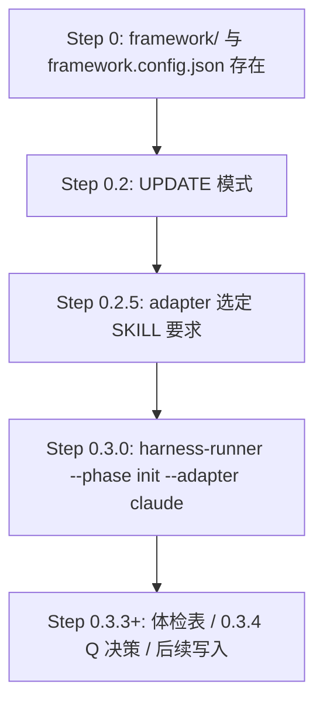
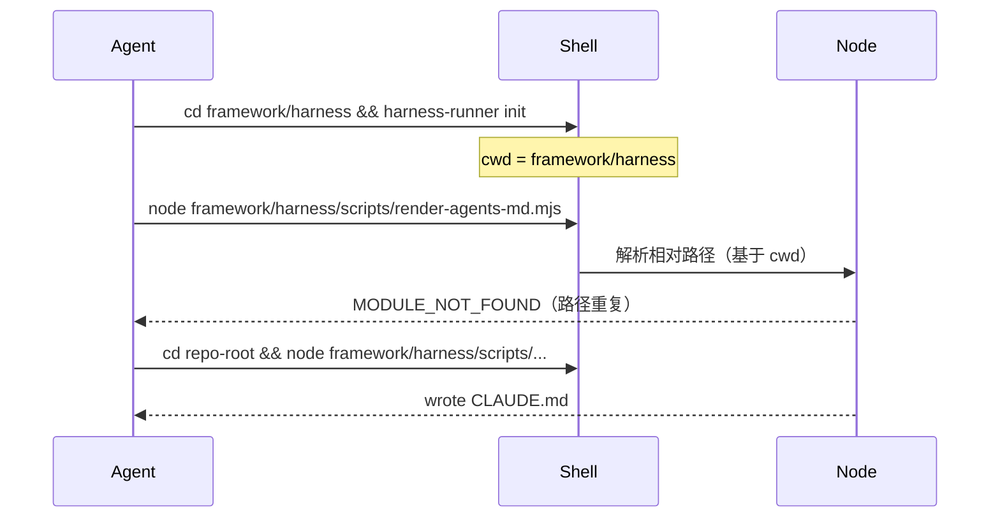

# 执行清单（按 Todo）

> 下文「分析」章节保留根因说明；**落地时只按本清单改**。Todo A 与 B 可分开 PR，建议 **先 A（cwd）再 B（adapter）**。

---

## 代码库现状快照（二次核对 · `main` 工作区干净）

**核对时间**：2026-05-20；`git status` 与 `origin/main` 一致，无未提交 framework 改动。

### 近期已合入（其它 AI · **不替代本 plan**）


| 提交        | 内容                                                                                                        | 与本 plan 关系                                                       |
| --------- | --------------------------------------------------------------------------------------------------------- | ---------------------------------------------------------------- |
| `198f306` | 废弃 `device-testing-todo`；`acceptance-layering.md` + `check-acceptance.ts` + prd/design/ut/testing harness | **无关**：不改 shell cwd / adapter 0.2.5；**不增 Todo**                  |
| `389dfd5` | `check-init` 体检 #11 前 `ensureCanonicalGitignore`；`canonical-gitignore.ts` + 单测                            | **部分相关**：减轻 init 手抄 `.gitignore`，**不解决** `render-agents-md` 路径重复 |
| `b53a561` | `tools.hylyre` 写入 `config-defaults` + `BACKFILL_FIELDS`                                                   | **无关**：config 补缺，与 CLI cwd 无关                                    |


### 仍与事故一致（**本 plan 仍须做**）


| 检查项                                                  | 当前 main 状态                                                               |
| ---------------------------------------------------- | ------------------------------------------------------------------------ |
| `harness-cli-cwd.md` / host-harness-readiness cwd 专节 | **无**                                                                    |
| Skill 00 §4.1.1 `render-agents-md` 示例                | 仍为 `node framework/harness/scripts/...`，**无** `cd <repo-root> &&`        |
| Skill 00 §0.3.0 后 cwd 提醒                             | **无**                                                                    |
| Skill 1～6 闭环 `check-receipt`                         | 仍为 `npx ts-node framework/harness/scripts/check-receipt.ts`（harness 后易炸） |
| `render-agents-md.mjs` 等 shim cwd 自检                 | **无**                                                                    |
| Skill 00 §0.2.5 UPDATE 每轮 opt-in                     | **无**专段；§0.2.5 原文未改                                                      |
| `agents/README.md` UPDATE adapter 规则                 | **无**                                                                    |


### 可复用的既有模式（执行 Todo B 时参考）

`[profile-addendum.md` §5.6.3](framework/profiles/hmos-app/skills/00-framework-init/profile-addendum.md) 已对 **DevEco `installPath`** 写明「与 Step 0.2.5 同等纪律、严禁未确认落盘」——Todo B 可 **对齐同一话术结构**，把 adapter 的 UPDATE 每轮确认写进根 SKILL §0.2.5，而非另造一套交互范式。

### Plan 结论

- **根因分析（问题一 adapter、问题二 cwd）无需推翻。**
- **执行清单 Todo A1～A5、B、C 全部仍为 pending**；仅下列微调见各 Todo 小节「相对 main 的调整」。

---

## Todo A1 — Shell cwd 契约 SSOT（`fix-cwd-ssot`）

**目标**：一处定义「类型 A / B」与高危序列，供所有 Skill 引用，避免双源。


| 动作    | 文件                                                                                                                                                                      | 修改内容                                                                                                                                                                                                                                         |
| ----- | ----------------------------------------------------------------------------------------------------------------------------------------------------------------------- | -------------------------------------------------------------------------------------------------------------------------------------------------------------------------------------------------------------------------------------------- |
| 增节或新文 | `[framework/skills/reference/host-harness-readiness.md](framework/skills/reference/host-harness-readiness.md)` **或** 新建 `framework/skills/reference/harness-cli-cwd.md` | 写入 §3.1 三类契约表；**BLOCKER**：刚执行 `cd framework/harness && harness-runner` 后，禁止在同一 shell 用 `framework/harness/scripts/...`；两种合法写法：`cd <repo-root> && node framework/harness/scripts/...` **或** `cd framework/harness && npx ts-node scripts/...` |
| 交叉引用  | `[framework/skills/README.md](framework/skills/README.md)`                                                                                                              | Host harness readiness 段增加指向 cwd 契约的链接（若新建独立 md）                                                                                                                                                                                             |
| 交叉引用  | `[framework/skills/00-framework-init/SKILL.md](framework/skills/00-framework-init/SKILL.md)` Step 0 环境检查 / §4.1.1 开头                                                    | 一行「cwd 契约见 `reference/...`」                                                                                                                                                                                                                  |
| 交叉引用  | `[framework/skills/reference/host-harness-readiness.md](framework/skills/reference/host-harness-readiness.md)` Tier_1 段末                                                | 链到 cwd 契约（避免只写 npm install 的 cwd 而漏 scripts 路径）                                                                                                                                                                                              |


**相对 main 的调整**：无删减；389dfd5 已强化 Tier_1 探测表述，cwd 契约作为 **新增专节** 与之并列即可。

**不修改**：`harness-runner.ts` 内部逻辑、`hook-runner.mjs`、`canonical-gitignore.ts`（已机器化）。

---

## Todo A2 — Skill 00 framework-init（`fix-cwd-skill00`）


| 动作            | 文件                                                                                                                                                                | 修改内容                                                                                                                                                                                             |
| ------------- | ----------------------------------------------------------------------------------------------------------------------------------------------------------------- | ------------------------------------------------------------------------------------------------------------------------------------------------------------------------------------------------ |
| 改命令 + BLOCKER | `[framework/skills/00-framework-init/SKILL.md](framework/skills/00-framework-init/SKILL.md)` **§0.3.0**（约 77–81 行）                                                | 在 `cd framework/harness && harness-runner ...` 后增加提醒：**下一命令若走类型 A，须先 `cd` 回实例工程根**（或在本节末尾列「0.3 之后允许的两种接续写法」）                                                                                     |
| 改命令 + BLOCKER | 同上 **§4.1.1**（约 466–477 行）                                                                                                                                        | 示例改为 `cd <repo-root> && node framework/harness/scripts/render-agents-md.mjs ...`；并写 harness 内等价：`cd framework/harness && node scripts/render-agents-md.mjs ...`；禁止 opt-out 式跳过等待（与 B 无关，仅保留 cwd） |
| 改命令           | 同上 **Step 1**（约 297–300 行）                                                                                                                                        | `show-last-committed-framework-config.mjs` 前加 `cd <repo-root> &&`                                                                                                                                |
| 改命令           | 同上 **§5.1 / 5.1.B**（约 566–593 行）                                                                                                                                  | `merge-framework-config.mjs` 前加 `cd <repo-root> &&`                                                                                                                                              |
| 改引用           | `[framework/profiles/hmos-app/skills/00-framework-init/profile-addendum.md](framework/profiles/hmos-app/skills/00-framework-init/profile-addendum.md)`（约 47、77 行） | `detect-deveco.ts` 改为根相对 + `cd` 前缀，或 `cd framework/harness && npx ts-node scripts/detect-deveco.ts`（shim 在 `harness/scripts/detect-deveco.ts`）                                                   |
| 可选文案          | `[framework/harness/scripts/check-init.ts](framework/harness/scripts/check-init.ts)`（约 80 行 merge 推荐文案）                                                           | 与 SKILL 一致的 `cd <repo-root> && node .../merge-framework-config.mjs`                                                                                                                              |


**相对 main 的调整**：Skill 00 §5.4.5 已改为「**禁止 agent 手抄** gitignore、由 check-init 同步」——本 Todo **不要**再让 agent 粘贴 canonical 列表；只改 **类型 A 脚本调用路径** 与 §0.3.0→§4.1 的 cwd 提醒。

---

## Todo A3 — Skill 1～6 阶段闭环（`fix-cwd-skills-1-6`）

**模式**（每个 Skill 两处：§7.x harness-runner + 闭环第 4 条 check-receipt）：

- **推荐**（与 harness 同 shell 接续）：  
`cd framework/harness && npx ts-node scripts/check-receipt.ts --feature <feature> --phase <phase>`
- **或**（显式回根）：  
`cd <repo-root> && npx ts-node framework/harness/scripts/check-receipt.ts ...`


| Skill     | 文件                                                                                                 | 需改位置（关键词）                                                                             |
| --------- | -------------------------------------------------------------------------------------------------- | ------------------------------------------------------------------------------------- |
| 1 PRD     | `[framework/skills/1-prd-design/SKILL.md](framework/skills/1-prd-design/SKILL.md)`                 | §7.1 `harness-runner --phase prd`；§7.3 第 4 条 `check-receipt --phase prd`（约 315、355 行） |
| 2 Design  | `[framework/skills/2-requirement-design/SKILL.md](framework/skills/2-requirement-design/SKILL.md)` | harness `--phase design`；`check-receipt --phase design`（约 548、590 行）                  |
| 3 Coding  | `[framework/skills/3-coding/SKILL.md](framework/skills/3-coding/SKILL.md)`                         | harness `--phase coding`；`check-receipt --phase coding`（约 332/381、444 行）              |
| 4 Review  | `[framework/skills/4-code-review/SKILL.md](framework/skills/4-code-review/SKILL.md)`               | harness `--phase review`；`check-receipt --phase review`（约 247、295 行）                  |
| 5 UT      | `[framework/skills/5-business-ut/SKILL.md](framework/skills/5-business-ut/SKILL.md)`               | harness `--phase ut`；`check-receipt --phase ut`（约 457/507/543、631 行）                  |
| 6 Testing | `[framework/skills/6-device-testing/SKILL.md](framework/skills/6-device-testing/SKILL.md)`         | harness `--phase testing`；`check-receipt --phase testing`（约 344、403 行）                |


**不改**：Skill 0 catalog/glossary（无 feature `check-receipt`）。

---

## Todo A4 — 其它文档与 MIGRATION（`fix-cwd-docs`）


| 文件                                                                                                               | 修改内容                                                                                                                                                                                                                  |
| ---------------------------------------------------------------------------------------------------------------- | --------------------------------------------------------------------------------------------------------------------------------------------------------------------------------------------------------------------- |
| `[framework/MIGRATION.md](framework/MIGRATION.md)`                                                               | 凡 `node framework/harness/scripts/merge-framework-config.mjs` / `render-agents-md.mjs` / `detect-deveco` 与上文 `cd framework/harness` 同页的，统一加 `cd <repo-root> &&` 或改用 harness 内 `scripts/` 路径（约 263、297、322–325、364 行等） |
| `[framework/docs/evolution/extension-e2e-acceptance.md](framework/docs/evolution/extension-e2e-acceptance.md)`   | `render-agents-md.mjs` 示例加 `cd <repo-root> &&`                                                                                                                                                                        |
| `[framework/docs/profiles/hmos-app-harness-toolchain.md](framework/docs/profiles/hmos-app-harness-toolchain.md)` | `detect-deveco.ts` 一行改为带 cwd 说明                                                                                                                                                                                       |
| `[framework/docs/overview.md](framework/docs/overview.md)`                                                       | 若存在 init/render 手操示例，与 A1 契约对齐（可选，grep 命中再改）                                                                                                                                                                          |


**实例侧**（本仓库若由 framework-init render 下发）：`AGENTS.md` / `CLAUDE.md` 中 Skill 0 harness 命令来自模板，**源头改** `[framework/templates/AGENTS.md.template](framework/templates/AGENTS.md.template)` 即可；实例文件需用户重跑 init 或 `render-agents-md` 刷新。

---

## Todo A5（可选）— mjs shim 入口加固（`fix-cwd-mjs-shim`）


| 文件                                                                                                                                         | 修改内容                                                                                                                                                           |
| ------------------------------------------------------------------------------------------------------------------------------------------ | -------------------------------------------------------------------------------------------------------------------------------------------------------------- |
| `[framework/harness/scripts/render-agents-md.mjs](framework/harness/scripts/render-agents-md.mjs)`                                         | 启动前：若 `!fs.existsSync(__filename)` 的误用不适用；改为检测 argv 无非法路径 / 或检测 `process.cwd()` 下是否存在 `scripts/render-agents-md.mjs` 而当前命令用了双 harness 路径 → stderr 友好提示后 exit 1 |
| `[framework/harness/scripts/merge-framework-config.mjs](framework/harness/scripts/merge-framework-config.mjs)`                             | 同上模式                                                                                                                                                           |
| `[framework/harness/scripts/show-last-committed-framework-config.mjs](framework/harness/scripts/show-last-committed-framework-config.mjs)` | 同上模式                                                                                                                                                           |
| **不改**                                                                                                                                     | `hook-runner.mjs`（绝对路径参数）                                                                                                                                      |


可抽公共 `assert-cli-invocation-cwd.mjs` 避免三份复制（仅当三文件逻辑一致时）。

---

## Todo B — adapter 每轮显式确认（`fix-adapter-gap`）

**目标**：消除「UPDATE + config 已有 adapter → agent 不等待即进 0.3」。


| 动作                  | 文件                                                                                                                 | 修改内容                                                                                                                                                                                                            |
| ------------------- | ------------------------------------------------------------------------------------------------------------------ | --------------------------------------------------------------------------------------------------------------------------------------------------------------------------------------------------------------- |
| UPDATE 专段 + BLOCKER | `[framework/skills/00-framework-init/SKILL.md](framework/skills/00-framework-init/SKILL.md)` **§0.2.5**（约 50–67 行） | 增补：**即使** `framework.config.json.agent_adapter` 已存在，**每轮** `/framework-init`（含 UPDATE、跨会话）仍须在本对话收到 `claude` / `cursor` / `generic` 或 `保持 <name>`；禁止「否则保持」通知后直接跑 0.3.0；禁止把 harness `resolveAdapterName` 回落当成用户选定 |
| 执行方式                | 同上 §0.2.5 或 Step 0 总则                                                                                              | 写明推荐用 **AskQuestion**（选项为各 `adapter_name` +「保持当前 config 中的 X」需映射为具体字符串）                                                                                                                                         |
| 可选对齐                | `[framework/agents/README.md](framework/agents/README.md)` §Adapter 选定建议                                           | 一句指向 Step 0.2.5 UPDATE 规则                                                                                                                                                                                       |
| 话术对齐（已存在）           | `[profile-addendum.md` §5.6.3](framework/profiles/hmos-app/skills/00-framework-init/profile-addendum.md)           | installPath 已用「与 0.2.5 同等纪律」；adapter 专段可照抄交互粒度（推荐 / y / 自定义 / 跳过）                                                                                                                                               |
| **不改（除非你要机器门禁）**    | `[framework/harness/scripts/check-init.ts](framework/harness/scripts/check-init.ts)`                               | 默认**不**加 `--confirm-adapter`（成本高、破坏无人值守 UPDATE）；若以后要机器化，另开 todo                                                                                                                                                 |


**相对 main 的调整**：无代码已修 adapter 缝隙；Todo B **仍为必做**。

---

## Todo C — 回归验证（`verify-regression`）


| 步骤         | 命令 / 动作                                                                                                                                                                 |
| ---------- | ----------------------------------------------------------------------------------------------------------------------------------------------------------------------- |
| 单测         | `cd framework/harness && npm test`（main 已含 `canonical-gitignore.unit.test.ts`、`config-field-merger` hylyre 等；改 cwd 后须仍全绿）                                               |
| 手验 cwd     | 在 `framework/harness` 下执行 `node scripts/render-agents-md.mjs --help`（或 dry 参数）应成功；在 harness 下执行 `node framework/harness/scripts/render-agents-md.mjs` 应失败并（若做了 A5）有明确提示 |
| 手验 init 序列 | 模拟：`cd framework/harness && harness-runner --phase init --adapter claude` 后，按新 SKILL 从根跑 `render-agents-md` 或 `node scripts/...`                                        |
| 手验闭环       | 任选 feature，按 Skill 1 新文案跑 `check-receipt`（不必跑完整 PRD）                                                                                                                    |


---

## 已完成 Todo（无需改代码）


| Todo                     | 结论                                                                    |
| ------------------------ | --------------------------------------------------------------------- |
| `confirm-session`        | 两次不同会话；均无 CREATE→UPDATE y/N；直接 UPDATE                                 |
| `audit-cwd-complete`     | 首遍全库 cwd 审计；见「问题三」                                                    |
| `audit-codebase-refresh` | main 已合入 acceptance/gitignore/hylyre；**cwd + adapter plan 仍 pending** |


---

# framework-init 第二次未询问 adapter 的原因分析

## 结论（一句话）

**Framework 没有「第一次问、第二次不问」的代码开关**。两次均为 **UPDATE**、**不同对话**，且第一次**没有** CREATE→UPDATE 的 `继续？(y/N)`——因此差异**不能**用会话记忆或体检降级解释，只能归因于 **同一 SKILL 下 agent 执行不一致**（第一次 opt-in 等待，第二次 opt-out 自动继续）+ **harness 不校验本轮是否已确认 adapter**。

### 已确认事实（用户补充）


| 项                          | 结论                                           |
| -------------------------- | -------------------------------------------- |
| 两次 init 是否同一会话             | **否**（独立对话）                                  |
| 第一次是否 CREATE→UPDATE 降级 y/N | **否**（`framework.config.json` 已存在，直接 UPDATE） |
| 两次模式                       | 均为 UPDATE + `agent_adapter: claude`          |


---

## 两次运行实际走的路径（相同）




- 实例 `[framework.config.json](framework.config.json)` 已有 `"agent_adapter": "claude"`。
- Slash 跳板 `[.claude/commands/framework-init.md](.claude/commands/framework-init.md)` 只指向完整 `[framework/skills/00-framework-init/SKILL.md](framework/skills/00-framework-init/SKILL.md)`，**不含**「第二次跳过询问」的分支逻辑。

---

## 规范层：SKILL 要求**每次**都要用户显式选定

`[SKILL.md` Step 0.2.5](framework/skills/00-framework-init/SKILL.md)（约 50–61 行）写明：

- **CREATE / UPDATE 共用**：必须先完成 adapter 选定，才能进 Step 0.3。
- **BLOCKER**：必须收到用户给出的**具体 `adapter_name` 字符串**；仅回复「好 / 继续 / ok」**不算**选定。
- 即便能从 `framework.config.json`、IDE 或目录痕迹推断出 claude，也只能作为**推荐**，**不得**直接当成用户决定。

因此，截图里 agent 说完「当前 adapter 已选定: claude … 否则保持 claude」后**不等用户回复就执行** `harness-runner.ts --phase init --adapter claude`，按 SKILL 属于**未满足 Step 0.2.5** 的软违规（规范要求停，实际未停）。

---

## 执行层：harness **不校验**「用户是否在本轮对话里确认过」

`[check-init.ts` 的 `resolveAdapterName](framework/harness/scripts/check-init.ts)`（约 1736–1744 行）：

```typescript
// 优先 CLI --adapter；UPDATE 模式回落到 framework.config.json.agent_adapter
const cli = (ctx.adapter ?? '').trim();
if (cli) return { name: cli, source: 'cli_flag:--adapter' };
if (cfg.agentAdapter) return { name: cfg.agentAdapter, source: 'framework.config.json:agent_adapter' };
```

含义：


| 来源                                | 行为                                                 |
| --------------------------------- | -------------------------------------------------- |
| 命令行 `--adapter claude`            | 直接使用（第二次截图即此路径）                                    |
| UPDATE 且 config 有 `agent_adapter` | **即使 CLI 未传**，也可从 config 解析，**不会**因「本轮用户未确认」而 FAIL |


所以：**机器侧只关心「adapter 字符串是否可解析」**，不关心「本轮 Skill 0.2.5 是否已收用户确认」。第二次 agent 从 config 读出 claude 并传 `--adapter claude`，脚本会正常进入体检（截图中的 deprecation 与 `Harness 验证开始: phase=init` 即此）。

---

## 为何第一次会「问」，第二次不会？

仓库内**没有**固定文案「当前 adapter 已选定…否则保持 claude」——该句为 **agent 生成**，不是模板或脚本输出。

在**已排除**「同会话记忆」与「CREATE→UPDATE 降级 y/N」之后，剩余解释只有一条：

### 根因：同一 SKILL、两次 agent 合规度不同（非确定性）


| 轮次       | agent 行为                                                   | 相对 Step 0.2.5                       |
| -------- | ---------------------------------------------------------- | ----------------------------------- |
| 第一次（新会话） | 列出推荐 adapter，**阻塞等待**你回复「保持 claude」等显式字符串后再进 0.3           | **合规**（opt-in）                      |
| 第二次（新会话） | 读出 config 中 `claude`，用「否则保持」式**通知**后**不等待**即跑 `check-init` | **不合规**（把 config + opt-out 通知当成已选定） |


第二次 agent 常把 harness 能力与 SKILL 义务混为一谈：

- harness：`UPDATE` 时 `framework.config.json.agent_adapter` 可解析 adapter（`[resolveAdapterName](framework/harness/scripts/check-init.ts)`）
- SKILL：每轮 init **仍须**用户在本对话给出具体 `adapter_name`（[Step 0.2.5](framework/skills/00-framework-init/SKILL.md)）

混读后得到错误规则：**「config 里已是 claude → 本轮回合视为已选定，只通知可切换」**——这与第一次的 opt-in 等待是**同一规范下的两种执行**，不是 framework 设计了两种模式。

**CREATE→UPDATE 强制降级**（Step 0.3.3，约 171–179 行）仅当 **无** `framework.config.json` 且体检出现 POPULATED 时触发；你的两次场景均**不适用**，可忽略。

---

## 与截图的对应关系


| 日志现象                                              | 解释                                               |
| ------------------------------------------------- | ------------------------------------------------ |
| 检测到 UPDATE、`agent_adapter` 为 claude               | Step 0.2 正常                                      |
| 打印「已选定 claude…否则保持」后立即跑 `check-init`              | agent 自判 0.2.5 已完成，**未阻塞等待**                     |
| `harness-runner.ts --phase init --adapter claude` | 符合 0.3.0 命令格式；adapter 来源为 config/推断，**非**用户本轮新回复 |
| 2m 超时                                             | 与 adapter 询问无关，是 init harness 本身耗时（npm/体检项多）     |


---

## 这是否算 framework bug？

- **不是**「init 流程有两套官方分支代码」。
- **是**已知的 **规范–执行缝隙**：
  - **规范（SKILL）**：每轮必须人类显式选定 adapter；
  - **执行（check-init）**：UPDATE 下 config 即可解析 adapter，且无「本轮对话确认」字段。

不同会话、不同轮次的 agent 会在该缝隙处**非确定性地**表现不一致：你遇到的是第一次合规询问、第二次跳过询问；换模型/重跑 init 仍可能再次颠倒。

---

## 若希望行为稳定（可选后续，本次仅分析）

不在你确认前改代码；若以后要「第二次也必须问」，可考虑（择一或组合）：

1. **SKILL 增补 UPDATE 专段**：写明「即使 `framework.config.json.agent_adapter` 已存在，每轮 `/framework-init` 仍须用户回复具体 `adapter_name` 或固定句式 `保持 <name>`；禁止仅用『否则保持』后自动继续」。
2. **harness 门禁**：例如要求 `--adapter` 与 config 一致时额外 `--confirm-adapter` 或环境变量，否则 BLOCKER（把 0.2.5 机器化）。
3. **agent 侧**：init 在 Step 0.2.5 强制使用 `AskQuestion` / 单轮阻塞，直到收到 `claude`/`cursor`/`generic` 之一。

---

## 最终定论（结合已确认事实）

**根因 = SKILL 要求每轮 opt-in 显式选定 adapter + harness/check-init 在 UPDATE 下不校验「本轮对话是否确认」+ 第二次 agent 误用 config 回落语义并 opt-out 自动继续。**

与用户观察一致：**不是** framework 在第二次 init 故意省略询问，而是 **规范未机器化、agent 执行漂移**；要稳定「每次都问」，需计划中的 SKILL 增补 / harness 门禁 / 强制 AskQuestion 之一。

---

# 问题二：Step 4.1 `render-agents-md` MODULE_NOT_FOUND（第二次 init）

## 现象（用户日志）

第二次 init 在 Step 0.3.4 回复 `Q1=n Q2=y` 后进入 Step 4.1，首次 Bash 失败：

```
Error: Cannot find module '...\framework\harness\framework\harness\scripts\render-agents-md.mjs'
```

注意路径中 `**framework\harness` 重复了一次**。随后 agent 改为：

```bash
cd /d/1.code/WalletHarmony/WalletForHarmonyOS && node framework/harness/scripts/render-agents-md.mjs ...
```

第二次成功：`[render-agents-md] wrote ... CLAUDE.md`。

第一次 init 你回复 `all=y`（Q1、Q2 均覆盖），理论上也会走 Step 4.1；若当时未报错，多半是 **cwd 恰好在实例工程根**，而非 framework 逻辑在两次 init 间有分支差异。

## 根因：工作目录泄漏（cwd leak），不是脚本内部算错路径


| 步骤         | SKILL 规定的命令                                                              | 典型 shell cwd 之后                  |
| ---------- | ------------------------------------------------------------------------ | -------------------------------- |
| Step 0.3.0 | `cd framework/harness && npx ts-node harness-runner.ts --phase init ...` | `**framework/harness/`**         |
| Step 4.1.1 | `node framework/harness/scripts/render-agents-md.mjs ...`                | 文档**未写**必须先 `cd` 回 `<repo-root>` |


若 agent **未**在 4.1 前切回实例根，而在仍位于 `framework/harness/` 的 shell 里执行：

```bash
node framework/harness/scripts/render-agents-md.mjs
```

Node 会解析为：

`framework/harness/` + `framework/harness/scripts/render-agents-md.mjs`  
→ `framework/harness/framework/harness/scripts/render-agents-md.mjs`（与报错一致）

**脚本本体**（`[render-agents-md.ts](framework/harness/scripts/render-agents-md.ts)`）用 `__dirname` 推算 `REPO_ROOT`（`scripts` → 上三级到实例根），**只要 Node 能加载到 `.mjs` 文件**，与 cwd 无关；本次失败发生在 **Node 找不到入口文件**，shim/ts 逻辑尚未执行。




## 与 Q1/Q2 决策的关系


| 轮次  | 你的回复        | Q1 config     | Q2 CLAUDE.md | Step 4.1                   |
| --- | ----------- | ------------- | ------------ | -------------------------- |
| 第一次 | `all=y`     | 整文件替换         | 整文件替换        | 会跑 render                  |
| 第二次 | `Q1=n Q2=y` | 保留 + 5.1.A 补缺 | 整文件替换        | **必须**跑 render → 触发 cwd 问题 |


第二次报错 **不是因为** `Q1=n Q2=y` 组合本身有 bug，而是因为 **Q2=y 必然进入 §4.1.1**，而 agent 在错误 cwd 下调用了文档里的相对路径命令。第一次若未报错，属于 **agent 碰巧在实例根执行** 或用了等价正确路径。

体检 diff 中 CLAUDE.md 第 20 行架构摘要、第 104 行扩展段差异，属于 **POPULATED 正常 diff**；`Q2=y` 后由 `render-agents-md` 按当前 `framework.config.json` 与 `--summary` 重渲染，与路径错误无关。

## 是否算 framework bug？

- **脚本的 REPO_ROOT 逻辑**：合理，不依赖 cwd（加载成功后）。
- **SKILL 文档缝隙**：§4.1.1 示例命令路径相对 `**<repo-root>`**，但 §0.3.0 会把 shell 留在 `framework/harness/`，**缺少**「4.1 前必须 cd 回实例根」的 BLOCKER 或与 0.3.0 对称的 `cd` 前缀 → **文档/流程设计缺口**，易诱发 agent 失误。
- **agent 行为**：第一次失败后应用 SKILL §4.1.3「脚本失败反馈 + 重试」从根目录重跑，**符合**纪律；但理想情况不应依赖失败重试。

## 建议修复（执行计划时择一或组合）

1. **SKILL §4.1.1（推荐，低成本）**
  将示例改为**显式**从实例根执行，例如：
   并加 BLOCKER：**禁止**在 cwd 仍为 `framework/harness` 时使用 `framework/harness/scripts/...` 相对路径；若刚跑完 0.3.0，必须先 `cd` 到实例根（或 `cd ../..`）。
2. **SKILL 备选命令（cwd 仍在 harness 时）**
  ```bash
   node scripts/render-agents-md.mjs ...
  ```
   （在 `framework/harness` 下仅一层 `scripts/`）
3. **脚本自检（可选加固）**
  在 `[render-agents-md.mjs](framework/harness/scripts/render-agents-md.mjs)` 启动时检测 `process.cwd()` 是否误含 `framework/harness/framework` 或缺少 `framework.config.json`，stderr 提示「请在实例工程根执行或使用 node scripts/render-agents-md.mjs」后 exit 1。
4. **同类命令一并扫**
  `[merge-framework-config.mjs](framework/harness/scripts/merge-framework-config.mjs)`、`[show-last-committed-framework-config.mjs](framework/harness/scripts/show-last-committed-framework-config.mjs)` 等在 SKILL 中均写 `node framework/harness/scripts/...`，同样受 cwd 泄漏影响，宜在同一补丁里统一「实例根 + cd」说明。

## 问题二结论

`**framework\harness\framework\harness\...` 是 agent 在错误工作目录下拼接 SKILL 示例路径所致；framework 未在第二次 init 故意报错；修复重点是 SKILL 工作目录契约，而非 render 渲染逻辑本身。**

---

# 问题三：全库 cwd 路径审计（深度检索结果）

> 检索范围：`framework/skills/`、`framework/profiles/**/skills/`、`framework/MIGRATION.md`、`framework/docs/`、`framework/harness/scripts/*.mjs`、Skill 1～6 闭环里的 `check-receipt` 命令。

## 3.1 三类命令契约（建议 SSOT）


| 类型                   | 文档写法                                                    | 要求 cwd    | 在 `framework/harness/` 下的安全等价写法                      |
| -------------------- | ------------------------------------------------------- | --------- | ---------------------------------------------------- |
| **A — 根相对脚本**        | `node framework/harness/scripts/<x>.mjs`                | **实例工程根** | `node scripts/<x>.mjs`                               |
| **A′ — 根相对 ts-node** | `npx ts-node framework/harness/scripts/<x>.ts`          | **实例工程根** | `cd framework/harness && npx ts-node scripts/<x>.ts` |
| **B — harness 入口**   | `cd framework/harness && npx ts-node harness-runner.ts` | 命令自带 `cd` | 已安全                                                  |


**脚本加载成功后**：多数 TS 用 `__dirname` 推算 repo root，与 cwd 无关；事故发生在 **Node 找不到入口**（类型 A + 错误 cwd）。

**已部分加固**：`[merge-framework-config.mjs](framework/harness/scripts/merge-framework-config.mjs)` 用 `MERGE_FW_CONFIG_USER_CWD` 修 `--config` 相对路径；**mjs 入口仍须先被 Node 找到**。

## 3.2 类型 A 脚本清单


| 脚本                                         | 主要文档引用                                  | 加载后依赖 cwd          |
| ------------------------------------------ | --------------------------------------- | ------------------ |
| `render-agents-md.mjs`                     | Skill 00 §4.1.1、MIGRATION、extension-e2e | 否                  |
| `merge-framework-config.mjs`               | Skill 00 §5.1、MIGRATION、check-init 文案   | 否                  |
| `show-last-committed-framework-config.mjs` | Skill 00 Step 1                         | 否                  |
| `hook-runner.mjs`                          | lifecycle（参数为绝对路径）                      | N/A                |
| `check-receipt.ts`                         | Skill **1～6** 闭环                        | 否（`__dirname` 上三级） |
| `detect-deveco.ts`                         | init 5.6、hmos profile-addendum          | 否                  |


## 3.3 高危序列（B 后直接 A，未 cd 回根）

与 **init 0.3.0 → 4.1** 同构：


| #   | 流程                                            | 先（B）                               | 后（A，高危）                                                               |
| --- | --------------------------------------------- | ---------------------------------- | --------------------------------------------------------------------- |
| 1   | framework-init                                | `harness-runner --phase init`      | `render-agents-md` / `show-last-committed` / `merge-framework-config` |
| 2～7 | PRD / design / coding / review / UT / testing | 各 Skill `harness-runner --phase …` | 各 Skill `check-receipt --phase …`                                     |
| 8   | MIGRATION 手操                                  | `cd framework/harness && …`        | `merge-framework-config.mjs`                                          |
| 9   | init 5.6                                      | 可能刚跑 harness                       | `detect-deveco.ts`                                                    |


**Skill 0 catalog/glossary**：仅类型 B，无 feature `check-receipt` → 相对安全。  
**harness-runner 内部**调用 check-*.ts，不经 shell 拼路径 → 无此类问题。

## 3.4 相对安全的写法（宜作 SSOT）

- `cd framework/harness && npx ts-node harness-runner.ts …`
- `cd framework/harness && npm run derive-hylyre-plan-hint`（package.json 内相对 `scripts/`）
- 类型 A 后接：`cd framework/harness && npx ts-node scripts/check-receipt.ts …`（**不要**再写 `framework/harness/scripts` 前缀）

## 3.5 建议统一修复包

1. 在 `[host-harness-readiness.md](framework/skills/reference/host-harness-readiness.md)` 增 **Shell cwd 契约**（或新建 `harness-cli-cwd.md`）。
2. 批量改 Skill 00、1～6、MIGRATION、profile-addendum：类型 A 前加 `cd <repo-root> &&`，或 harness 后用 `scripts/` 短路径。
3. 可选：4 个 `.mjs` shim 入口做「路径重复」自检 + 提示。
4. **不必改**：harness-runner 内部、hook-runner（绝对路径）。

## 问题三结论

**同类问题是系统性文档/流程缺口，不是 render-agents-md 单点 bug。** init + 六个 feature 阶段闭环 + MIGRATION + init 5.6 均可能复现；应做 **cwd 契约 SSOT + 命令批量规范化**。