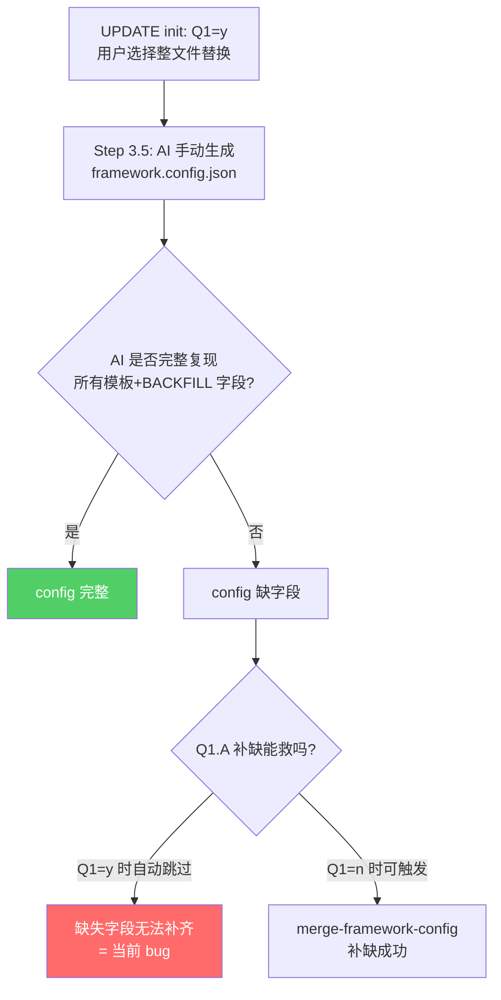

# 真实工程 init 后 framework.config.json 差异根因分析

## 核心结论（一句话）

**所有 4 个问题的根源都指向同一个设计缺陷**：当用户对 Q1 回答 `y`（整文件替换）时，`framework.config.json` 由 AI 在 Step 3.5 手动生成，但 **Q1.A 字段补缺合并机制被自动跳过**（SKILL.md 明文：「Q1=y 时本子问题自动跳过——整文件替换已涵盖」），而 AI 生成的 JSON **不可能完美覆盖所有模板/白名单字段**。adapter-update-policy 计划解决的是完全不同的问题（adapter 模板文件同步），与 config JSON 字段完整性无关。

---

## 逐项分析

### 1) `lifecycle_hooks_enabled`：真实工程 false vs 虚拟工程 true

**模板默认值**: `true`（[framework/templates/framework.config.template.json](framework/templates/framework.config.template.json) 第 51 行）

**BACKFILL 默认值**: `true`（[framework/harness/scripts/utils/config-field-merger.ts](framework/harness/scripts/utils/config-field-merger.ts) 第 63-66 行）

**根因**: AI 在 Step 3.5 生成整文件时，`lifecycle_hooks_enabled` **不在 Step 2 的交互问卷中**——Step 2 只有 `project_name`、`project_type`、`schema_version`、`paths.*`、`state_machine.*`、`docs_committed` 这些项。这意味着 AI 必须自行从模板 skeleton 中"记住"要包含 `lifecycle_hooks_enabled: true`。真实工程的 AI **写成了 `false`**（可能是因为 Cursor IDE adapter 没有物理 stop hook 支持，AI 错误推理为 `false`），而 Q1.A 补缺在 Q1=y 时被自动跳过，无法救场。

**虚拟工程为何正确**: 虚拟工程的 config 是在多次迭代中由开发者直接维护的，`true` 值是手动设定或被 Q1.A 补缺过的。

### 2) `paths` 区域问题

#### 2a) 缺少 `receipt_dir_pattern`

**模板 skeleton**: **不包含**此字段！

```json
// framework.config.template.json 的 paths 段
"paths": {
    "features_dir": "doc/features",
    "module_catalog": "doc/module-catalog.yaml",
    "glossary": "doc/glossary.yaml",
    "glossary_seed": "doc/glossary-seed.txt",
    "architecture_md": "doc/architecture.md",
    "extension_dir": "doc/extensions",
    "docs_committed": false
    // 没有 state_file、receipt_dir_pattern、reports_dir_pattern
}
```

**BACKFILL 白名单中有**: `receipt_dir_pattern`（[config-field-merger.ts](framework/harness/scripts/utils/config-field-merger.ts) 第 105-107 行，默认值 `doc/features/<feature>/<phase>`）

**根因**: 模板 skeleton **故意不写** `receipt_dir_pattern`（也不写 `state_file`），这些字段只存在于 `BACKFILL_FIELDS` 白名单和 `DEFAULT_PATHS` 中。当 Q1=y 时，AI 按模板生成 JSON，**模板里没有就不会写入**。而 Q1.A 补缺机制（本来会补上这个字段）又因 Q1=y 被自动跳过。

有趣的是，真实工程的 AI **确实添加了** `state_file` 和 `reports_dir_pattern`（超出模板范围），说明 AI 参考了 `DEFAULT_PATHS` 或其它文档，但**遗漏了** `receipt_dir_pattern`。这就是 AI 手动生成的不可靠性。

#### 2b) `docs_committed` 为 false vs 虚拟工程 true

**模板默认值**: `false`

**SKILL.md 原文**: 「默认 skeleton 中为 `false`，不单独追问。归档型演示仓可显式改为 `true`」

**根因**: 这是**符合预期的设计差异**，不是 bug。虚拟工程（SimulatedWalletForHmos）作为演示仓被**手动**设为 `true`（让 `doc/features/`** 入主仓）；真实工程按模板默认获得 `false`（业务过程产物不入主仓）。

### 3) `toolchain` 缺少 hvigor 部分

**模板 skeleton 中有**: `toolchain.hvigor`（daemon/parallel/incremental/analyze）

**BACKFILL 白名单中也有**: 4 条（[config-field-merger.ts](framework/harness/scripts/utils/config-field-merger.ts) 第 140-159 行）

**根因**: 两个因素叠加：

1. **Profile addendum 的 5.6.5 示例太窄**: [hmos-app profile-addendum.md](framework/profiles/hmos-app/skills/00-framework-init/profile-addendum.md) 第 100-112 行只展示了 `devEcoStudio` 段的落盘形态，**没有展示 `hvigor` 段**。AI 在 Step 3.5 / Step 5.6 写 toolchain 时，**只跟了 addendum 的窄示例**，没有回头参照完整模板。
2. **Q1.A 被跳过**: 本来 BACKFILL 会补上 `toolchain.hvigor.`* 四个字段，但 Q1=y 导致被跳过。

### 4) 缺少 `prd` 区域

**模板 skeleton**: **故意不写** `prd`

**SKILL.md 明文**: 「模板 skeleton 默认不写 `prd`。CREATE 模式按 skeleton 落盘；...若工程是 UI 形态且需要脚本级 Visual Handoff 守门，由维护者在 init 完成后按 [prompts/prd-harness-options.md](framework/skills/00-framework-init/prompts/prd-harness-options.md) 手工合并」

**BACKFILL 白名单**: **严禁补缺**（`prd.`* 是 opt-in，须维护者手工选档）

**根因**: 这是**设计意图**，不是 bug。`prd` 段是 opt-in 的，只有在需要脚本级 Visual Handoff 守门时才手工追加。虚拟工程有 `prd` 段是因为之前手动添加的。UPDATE 模式下若老 config **已含** `prd` 则原样保留，但真实工程的老 config 从未有过 `prd`，所以 init 后也没有。

---

## 为什么 adapter-update-policy 计划没解决问题

[adapter-update-policy_3b2e370d.plan.md](adapter-update-policy_3b2e370d.plan.md) 解决的问题是：

> adapter template 文件（hooks/.mjs、settings.json、verifier.md 等）在 UPDATE init 时因为被判为 POPULATED 而走 y/n，导致机制代码永远停在旧版

它引入了 `update_policy: auto_overwrite` 让这些 **adapter 模板文件**自动同步。但这和 `framework.config.json` 的 **JSON 字段完整性** 是两个完全不同的问题域：

- adapter-update-policy: 解决 `.claude/hooks/*.mjs` 等文件的同步
- 本次问题: 解决 `framework.config.json` 内部字段的缺失

该计划在第 4 节「不在本次范围」明确写道：「不引入 `framework.config.json` 顶层新字段」。

---

## 问题的系统性根因总结



**根本设计缺陷**: Step 3.5 + Q1=y 路径假定「AI 整文件替换已涵盖所有新字段」，但 AI 的 JSON 生成**本质上不可靠**——它依赖 AI 同时参照模板 skeleton、BACKFILL 白名单、profile config-defaults、addendum 示例等多个信息源并完美合并，这在实践中几乎不可能。

---

## 实施修复（精确到文件路径、行号、改动内容）

> **状态说明**：以下四项已在仓库 `framework/` 内落地；todos 已标为 `completed`。

### Todo 1: fix-q1a-bypass — SKILL.md Step 5.1 + Step 3.5 + Step 0.3.4 逻辑修正

**目标**: Q1=y / MISSING / EMPTY 路径下，Step 3.5 写入 JSON 后也**无条件**跑一轮 `merge-framework-config.mjs --apply` 补缺。该脚本「只补缺、不覆盖」，对已有字段完全安全。

**修改文件**: [framework/skills/00-framework-init/SKILL.md](framework/skills/00-framework-init/SKILL.md)

**要点**：

- Step **3.5** 分工表：**`5.1.B`** 在 MISSING/EMPTY / `Q1=y` 后跑 `merge-framework-config.mjs --apply`；**`POPULATED + Q1=n`** 走 **`5.1.A` / `Q1.A`**，不跑 **`5.1.B`**。
- 新增 **`#### 5.1.B 后置安全网补缺（v3.2 起）`**：`node framework/harness/scripts/merge-framework-config.mjs --apply`，BLOCKER 不再向用户征询。
- Step **0.3.4** 注：`Q1=y` 跳过交互 `Q1.A`，由 **`5.1.B`** 在 Step **3.5** 后补缺。
- **动机**文案须避免根目录 SKILL 的 [`root-zero-host-name`](framework/harness/tests/unit/root-zero-host-name.unit.test.ts) 闸门命中裸词 `hvigor`（已改为中性表述）。

### Todo 2: template-paths — 模板 skeleton 补全

**修改文件**: [framework/templates/framework.config.template.json](framework/templates/framework.config.template.json)

- `paths` 增加 **`state_file`**、**`receipt_dir_pattern`**（与 [framework/harness/config.ts](framework/harness/config.ts) `DEFAULT_PATHS` 对齐）。
- `$schema_docs.field_notes` 增加 **`paths.state_file`**、**`paths.receipt_dir_pattern`**。
- **不加** `reports_dir_pattern`（自动补缺会改变报告落点，属行为级变更）。

### Todo 3: addendum-hvigor — profile addendum 示例补全

**修改文件**: [framework/profiles/hmos-app/skills/00-framework-init/profile-addendum.md](framework/profiles/hmos-app/skills/00-framework-init/profile-addendum.md)

- **5.6.5** JSON 示例扩展为含 **`devEcoStudio`** + **`hvigor`** 块。
- 字段说明增加 **`hvigor`** 一条，链到全局模板与 profile 内 `hvigor-runner.ts`。

### Todo 4: schema-version-align — SKILL.md Step 2 文档对齐

**修改文件**: [framework/skills/00-framework-init/SKILL.md](framework/skills/00-framework-init/SKILL.md)

- Step 2 表格 **`schema_version`** 行：`"1.0"` → **`"1.1"`** 及 bump 说明。

---

## 实施注意事项（给执行 AI 的提醒）

1. **所有修改都在 `framework/` 目录下**，属于框架源头资产。
2. **不修改实例侧衍生物**（根 `framework.config.json`、`.cursor/rules/`、`AGENTS.md` 等）——由 init / render 流程生成。
3. 修改后应跑 `cd framework/harness && npm test`。
4. `merge-framework-config.mjs` 脚本本身无需改，仅 SKILL 中调用时机变更。
5. 通常**不需要**改 `config-field-merger.ts` 的 `BACKFILL_FIELDS`，除非新增白名单字段。
6. 模板补全后可保持 BACKFILL 作为最终安全网。
