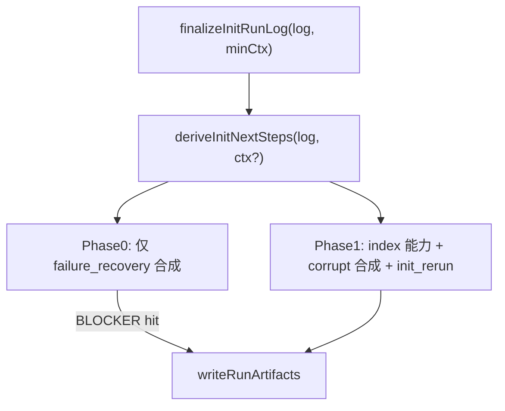

# Init S4 动态「可选下一步」优化（v6.1 · workflow_artifact 回归修复）

**版本窗口**：`2.4.0`（与根 `package.json.version` 一致）

## 问题根因

Harness `[buildRunSummary](harness/scripts/init-orchestrate.ts)` 无下一步；Agent 照抄 SKILL 静态列表（stale + 无意义团队提醒）。

---

## SSOT 分工（文字契约）


| 来源                      | 职责                                     | 示例                                                    |
| ----------------------- | -------------------------------------- | ----------------------------------------------------- |
| `**skills.index.yaml`** | **能力建议** SSOT（可选下一步）                   | catalog_empty、graph_gap、feature_ready、always_optional |
| **Harness 运行时合成**       | **recovery / corrupt**（按 log/磁盘错误动态生成） | failure_recovery、catalog_corrupt、glossary_corrupt     |


- recovery/corrupt **MUST NOT** 伪装成标准 Skill（无 enclosing skill_id、无 command_id、不进 adapter 附录）
- index **MUST NOT** 声明 `when: failure_recovery` / `init_rerun`（非能力建议）

---

## 目标数据流


| 路径                  | ctx 可用性                              |
| ------------------- | ------------------------------------ |
| `cross-check block` | **无** finalContext；仅 **MinContext**  |
| `preflight blocked` | MinContext（config 可能损坏）              |
| `executed log`      | MinContext + **Phase1Context**（可选扩展） |





### Context 契约

**三条路径 MUST 都能构造 `InitNextStepsMinContext`**（不依赖 finalContext）：

```typescript
interface InitNextStepsMinContext {
  projectRoot: string;
  harnessRoot: string;
  scope: TaskScope;
  materialized_adapters?: string[];  // 优先 log，其次 decision
}
```

**Phase 1 扩展**（execute 成功路径才需要）：

```typescript
interface InitNextStepsContext extends InitNextStepsMinContext {
  frameworkRoot?: string;
  // 其他读 catalog/workflow 所需；cross-check 路径不得传入
}
```

```typescript
deriveInitNextSteps(
  log: InitRunLog,
  ctx?: InitNextStepsContext,  // Phase 0 MUST NOT 解引用 ctx
): InitNextStep[]
```

- **Phase 0**：只读 `log`（+ `log.materialized_adapters`）；**禁止**访问 `ctx` 任意字段
- **Phase 1**：`ctx` 必填；缺则 skip Phase 1（仅输出 Phase 0 结果，若有）

### `InitNextStep` 结构

```typescript
interface InitNextStep {
  step_id: string;
  source: 'index' | 'harness';   // index=能力建议；harness=recovery/corrupt 合成
  when: string;
  kind: 'required' | 'optional';
  priority: number;
  message: string;               // 用户向主文案
  skill_id?: string;             // 仅 source=index；runtime 来自 enclosing id
  invoke?: { neutral: string; command_id: string; param_hint?: string | null };
  workflow_artifact?: string;    // 仅 source=index；映射 workflow artifact id → enclosing skill
  availability_note?: string;
}
```

`**workflow_artifact` 映射契约**（不可靠 skill id 猜 artifact 名）：

- workflow SSOT：`[workflows/spec-driven.workflow.yaml](workflows/spec-driven.workflow.yaml)` 的 `artifacts[].id`
- 典型错位：`module-graph`（artifact）≠ `code-graph`（skill id）；`catalog`/`glossary` artifact 均指向 `catalog-bootstrap` skill
- `**feature_ready`**：读 workflow 拓扑**首个可启动 feature phase** 的 artifact id，在 index 中查 `when: feature_ready` + 匹配 `workflow_artifact` 的 step → 得到 enclosing skill + invoke（**禁止**写死 `/spec`）

---

### `deriveInitNextSteps` — Phase 0 / Phase 1

**Phase 0 — BLOCKER（MUST 最先；仅 `failure_recovery`）**

若 log 含以下任一信号，**仅**合成 `**source: harness`, `when: failure_recovery`, `kind: required`** 条目（可多条问题 bullet，**一条**收口话术），**立即 return**：

- cross-check validate entry
- preflight blocked entry
- 任意 `status === 'failed'` entry

**Phase 0 禁止**：

- 读 ctx、config、workflow、catalog/glossary/graph
- 生成 `**init_rerun`**（与 failure_recovery 不并存；adapter 物化失败等 **rerun 文案写在 failure_recovery 条目内**：「修复后重新执行 `/framework-init`」）

**Phase 1 — 正常路径**（Phase 0 未命中且 `ctx` 存在）

1. catalog/glossary **corrupt** → harness 合成 required（抑制下游 index 能力）
2. index 驱动：catalog_empty、glossary_empty、graph_gap、feature_ready、always_optional
3. `**init_rerun`**（**仅 Phase 1**；execute 已完成、无 failed/blocked）：物化仍 needed / 清单不一致等可靠信号；**禁止** drift keep；文案含 rerun `/framework-init`
4. 全无 → 「init 已完成，暂无额外前置建议。」

---

### `finalizeInitRunLog` / `writeRunArtifacts`

- 三路径统一经 `finalizeInitRunLog(log, minCtx, phase1Ctx?)`
- `run-log.json` **仅**存 `next_steps[]`；禁止 `next_steps_markdown`
- `writeRunArtifacts` 返回同一 `summary`；stdout 与 summary.md 共用
- adapter 附录 **仅** `source=index` 且本轮已推荐的 step

---

## 能力元数据：`[skills/skills.index.yaml](skills/skills.index.yaml)`

### `init_next_steps[]` — 仅能力建议

```yaml
- id: catalog-bootstrap
  init_next_steps:
    - step_id: catalog-phase-a
      when: catalog_empty
      kind: optional
      priority: 10
      workflow_artifact: catalog
      invoke:
        neutral: "模块画像自举（Phase A）"
        command_id: catalog-bootstrap
    - step_id: glossary-phase-b
      when: glossary_empty
      kind: optional
      priority: 20
      workflow_artifact: glossary
      invoke:
        neutral: "术语表自举（Phase B）"
        command_id: glossary-bootstrap

- id: code-graph
  init_next_steps:
    - step_id: graph-first-gap
      when: graph_gap
      kind: optional
      priority: 30
      workflow_artifact: module-graph    # artifact id，非 skill id
      invoke:
        neutral: "Code Graph 建图"
        command_id: code-graph
        param_hint: "<ModuleName>"

- id: spec
  init_next_steps:
    - step_id: feature-first-phase
      when: feature_ready
      kind: optional
      priority: 40
      workflow_artifact: spec              # 默认 workflow 首 feature artifact；自定义 workflow 换 id 即可
      invoke:
        neutral: "Feature Spec"
        command_id: spec
```

- `**skill_id` 运行时 = enclosing entry `id**`；禁止在 step 重复写
- `**command_id` ≠ skill 目录名**（glossary-bootstrap → enclosing catalog-bootstrap）
- `**workflow_artifact`**：可选但 **when 为 graph_gap / feature_ready 时 MUST 填写**；catalog_empty / glossary_empty 亦 SHOULD 填写以便 lint 与文档一致

### Index lint（`workflow_artifact`）

1. 若填写 `workflow_artifact` → **MUST** 为 `[workflows/*.workflow.yaml](workflows/)` 中已声明的 `artifacts[].id`
2. 同一 `workflow_artifact` 在全局 index 中 **MUST NOT** 被多个 enclosing skill 的 step 同时声明（防歧义映射）
3. `when: graph_gap | feature_ready` 的 step **MUST** 带 `workflow_artifact`（禁止靠 phase/skill 名猜映射）

### Index `when` + `kind`（lint 仅校验 index 条目）


| when              | kind（固定） |
| ----------------- | -------- |
| `catalog_empty`   | optional |
| `glossary_empty`  | optional |
| `graph_gap`       | optional |
| `feature_ready`   | optional |
| `always_optional` | optional |


---

## Summary 分节

- 有 `kind: required` → `## 必须处理`（harness recovery/corrupt）
- 仅 optional → `## 可选下一步`（index 能力）
- framework-init SKILL **MUST verbatim**

---

## 实现文件


| 文件                                                                                     | 职责                                                               |
| -------------------------------------------------------------------------------------- | ---------------------------------------------------------------- |
| `[harness/scripts/utils/init-next-steps.ts](harness/scripts/utils/init-next-steps.ts)` | Phase0/1、source 区分、render                                        |
| `[harness/scripts/init-orchestrate.ts](harness/scripts/init-orchestrate.ts)`           | MinContext 构造；三路径 finalize                                       |
| lint skills index                                                                      | when+kind+workflow_artifact 合法性/唯一映射；禁止 failure_recovery 进 index |
| `[skills/project/framework-init/SKILL.md](skills/project/framework-init/SKILL.md)`     | verbatim                                                         |


---

## OpenSpec（MUST）

- `ctx?` 可空；Phase 0 **MUST NOT** 解引用 ctx
- index = 能力 SSOT；harness = recovery 合成；**MUST NOT** 伪装 Skill
- Phase 0 **仅** failure_recovery；**MUST NOT** 并列 init_rerun
- `graph_gap` / `feature_ready` **MUST** 经 `workflow_artifact` 查 index 映射 skill，**MUST NOT** 靠 id 猜名

---

## 测试


| 场景                               | 断言                                                                                               |
| -------------------------------- | ------------------------------------------------------------------------------------------------ |
| cross-check block                | Phase 0 only；ctx 未传入 Phase1 字段；不读 catalog                                                        |
| corrupt config + blocked         | 仍落盘 run-log + summary + required recovery                                                        |
| failed / preflight / cross-check | **仅** failure_recovery；**无** init_rerun 条目                                                       |
| failure_recovery 文案              | 含「修复后重新执行 `/framework-init`」                                                                     |
| execute 成功 + adapter needed      | Phase 1 可有 init_rerun（无 failure_recovery）                                                        |
| drift keep                       | 无 init_rerun                                                                                     |
| harness recovery                 | `source=harness`；无 skill appendix                                                                |
| index graph_gap                  | `source=index`；附录含跳板                                                                             |
| stdout === summary.md            | 同一 summary                                                                                       |
| lint                             | index 出现 failure_recovery → FAIL                                                                 |
| workflow_artifact                | `graph_gap` 推荐 code-graph skill（artifact=module-graph）                                           |
| 自定义 workflow 首 feature ≠ spec    | fixture workflow 首 feature artifact=`plan`（或任意非 spec id）→ `feature_ready` 仍映射到正确 enclosing skill |
| lint 歧义                          | 两 skill 同声明 `workflow_artifact: spec` → FAIL                                                     |
| lint graph_gap 缺 artifact        | index step `when: graph_gap` 无 `workflow_artifact` → lint FAIL                                   |


---

## 非目标

- 不自动启动下游 Skill；不 bump package.json。

---

## 验收

- 成功/失败/早退/损坏 config 均有正确 recovery 或能力建议。
- `npm test` + `release:verify` PASS。

