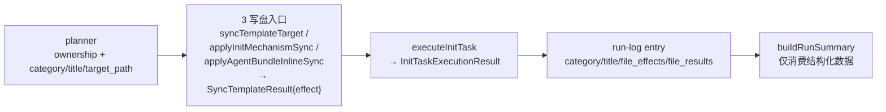

# Init 流程体验优化（v2.2.0）

## 背景

宿主工程 init 结果整体成功（8 executed / 7 skipped / 0 failed），不阻断消费者使用。经三轮分析/review，结论是：单纯「修日志体验点」不够，须补成机制级约束，否则实施后仍会退回「约定 + 文案兜底」与「executor 拼字符串、orchestrator 解析字符串」。

核心升级：

- P0 = **target_path 单一 ownership 不变量**，且必须同时覆盖 bundle 分支的 **三个写盘入口**：`syncTemplateTarget`、`applyInitMechanismSync`（auto_overwrite 路径）、`applyAgentBundleInlineSync`（generic inline skill 路径）。
- P2a / P3 = **执行 telemetry 结构化闭环**，关键缺口是 executor 必须有 **结构化返回契约**（不能继续返回裸 string），否则 telemetry 没有路径进入 run-log。

## 架构原则：init execution telemetry 闭环




不变量：**一次 init run 中，同一个 `target_path` 只能有一个写入 owner**。owner 可以是 per-file task（`materialize-*-file:`*）或 `sync-auto-overwrite:*` task；bundle 只负责未被任何 task owning 的剩余文件。所有写盘统一用 `effect ∈ {created, updated, unchanged, delegated}` 表达。

**telemetry denominator（口径定义）**：bundle entry 的 `file_results` 覆盖「bundle 本次纳入 telemetry 的全部 targets」= `entryFile` + `adapter.templateFiles`（含 auto_overwrite，以 `delegated` 计）+（generic inline 时）`applyAgentBundleInlineSync` 产出的 inline skill targets。`file_effects` 四项之和 == `file_results.length` == 该口径下 target 总数（**不是**简单的 entryFile + templateFiles）。

---

## P0 — target_path 单一 ownership 不变量（覆盖三个写盘入口）

**问题**：bundle 分支 `materialize-adapter:` 有 **三个写盘入口**，仅堵第一个不够：

1. `syncTemplateTarget`：对 `entryFile` + `adapter.templateFiles` `force=true` 全量写（[init-task-executor.ts](harness/scripts/utils/init-task-executor.ts) L429-441），覆盖 per-file 任务的 `keep` 决策。
2. `applyInitMechanismSync`（[init-task-executor.ts](harness/scripts/utils/init-task-executor.ts) L442 → [check-init.ts](harness/scripts/check-init.ts) L1844）：独立全量写所有 `auto_overwrite` 文件，这些文件已由 `sync-auto-overwrite:`* 任务 owning（[init-task-planner.ts](harness/scripts/utils/init-task-planner.ts) L159-176）。
3. `applyAgentBundleInlineSync`（[init-task-executor.ts](harness/scripts/utils/init-task-executor.ts) L443-449 → [check-init.ts](harness/scripts/check-init.ts) L807）：generic inline 模式写 inline skill 文件（真实产物，非 legacy 重复）。

若只堵入口 1，单一 owner 不变量仍会被入口 2 破坏；入口 3 的写盘也游离在 telemetry 之外。

**修复方案**：

1. `executeInitTask` 的 `materialize-adapter:` 分支从 `ctx.plan` 构建 `ownedByTask: Set<targetRel>`：收集所有 `materialize-entry-file` / `materialize-adapter-file:`* / `sync-auto-overwrite:*` 任务的 `target_path`。
2. 入口 1 遍历 `entryFile` + `templateFiles` 时，凡 `targetRel ∈ ownedByTask` 不写盘、产出 `effect: 'delegated'`；其余按内容差异产出 `created/updated/unchanged`。
3. 入口 2 `applyInitMechanismSync` 改造为同一套 `SyncTemplateResult` 管线（见 Telemetry-1）并接受 `ownedByTask` 过滤；bundle 分支**不得**绕过 ownership 全量写（`auto_overwrite` 文件在 bundle 里恒为 `delegated`，真正写盘由 `sync-auto-overwrite:`* 任务负责）。
4. 入口 3 `applyAgentBundleInlineSync` 同样纳入 `SyncTemplateResult` 管线（产出 created/updated/unchanged 进 `file_results`）；其 inline skill target 无对应 per-file task，bundle 是唯一 owner，不与 ownership 冲突但须计入 telemetry。
5. 三入口的结果统一聚合为 bundle entry 的 `file_effects` + `file_results`（见 Telemetry-2/3）。

---

## Telemetry-1 — `SyncTemplateResult` 统一写盘管线

**问题**：`syncTemplateTarget` 仅返回字符串，`force=true` 时不先 compare（[init-task-executor.ts](harness/scripts/utils/init-task-executor.ts) L114-157）；`applyInitMechanismSync` 是另一套独立写盘 + 计数逻辑。下游无法区分 created/updated/unchanged/delegated。

**修复方案**：

- 新增 `SyncTemplateResult { targetRel: string; effect: 'created' | 'updated' | 'unchanged' | 'delegated' }`。
- `syncTemplateTarget` 即使 `force=true` 也先 `compareTextArtifact`：相同 → `unchanged`（不写盘），不同/不存在 → `updated`/`created`；命中 `ownedByTask` → `delegated`。
- `applyInitMechanismSync` 重构为返回 `SyncTemplateResult[]`（保留 `syncedFiles`/`backupRelDir` 兼容字段或由调用方从结果聚合），与 `syncTemplateTarget` 共用 compare/写盘逻辑。
- `applyAgentBundleInlineSync` 同样改为返回 `SyncTemplateResult[]`（inline skill targets 的 created/updated/unchanged），供 bundle 聚合。三入口共用同一 compare/effect 判定。

---

## Telemetry-2 — executor 结构化返回契约（关键接口）

**问题**：`executeInitTask` 返回 `string`（[init-task-executor.ts](harness/scripts/utils/init-task-executor.ts) L263-267），`executeInitPlan` 直接把它当 `message` 写 entry（[init-orchestrate.ts](harness/scripts/init-orchestrate.ts) L948 起）。没有这层接口，telemetry 无法进入 run-log，实施时必然退回字符串解析。

**修复方案**：

- 新增 `InitTaskExecutionResult { message: string; file_effects?: FileEffects; file_results?: SyncTemplateResult[] }`，其中 `FileEffects = { created: number; updated: number; unchanged: number; delegated: number }`。
- `executeInitTask` 返回 `InitTaskExecutionResult`（标量任务仅填 `message`；bundle / sync 类任务填 `file_effects` + `file_results`）。
- `executeInitPlan` 解析该结构写入 run-log entry（见 Telemetry-3）。
- 兼容：内部调用点统一改读 `.message`。

---

## Telemetry-3 — `InitRunLogEntry` 数据模型扩展

**问题**：`InitRunLogEntry` 仅 `task_id/action/status/message`（[init-orchestrate.ts](harness/scripts/init-orchestrate.ts) L46-52），summary 只能靠 task_id 前缀分类。

**修复方案**（全部可选，向后兼容）：

- 增加 `category?` / `title?` / `target_path?`：`executeInitPlan` 写 entry 时从对应 `InitTask` 继承。
- 增加 `file_effects?: FileEffects`：聚合计数，供 summary 与快速判断。
- 增加 `file_results?: SyncTemplateResult[]`：bundle / sync 类任务的逐文件明细，供审计「具体哪个 target 被 delegated」（回应 review P2 粒度诉求）。

---

## P3 — S4 摘要消费结构化数据

**问题**：`buildRunSummary`（[init-orchestrate.ts](harness/scripts/init-orchestrate.ts) L840-871）平铺 task 表，Agent 自行重排导致漂移。

**修复方案**：基于 Telemetry-3 的 `category` / `file_effects` 做分组，新增「类别摘要」段（原始 task 表保留其后供审计）：

```markdown
## 类别摘要
- config: ensure-config overwrite, backfill-config run
- adapter: claude（created 2 / updated 5 / unchanged 4 / delegated 4）
- docs: 5 项保留磁盘（skip）
- mechanism: gitignore run, cleanup-deprecated run
- verify: run-global-phases run
```

Agent 直传 harness stdout 即可；`run_log` / `summary` 路径始终出现。

---

## P2a — adapter bundle 任务状态描述

**问题**：`materialize-adapter:claude/generic` 在 UPDATE 恒显 `status: needed / run`，用户误以为缺东西。

相关代码：[init-task-planner.ts](harness/scripts/utils/init-task-planner.ts) L369-390 (`buildMaterializeAdapterTasks`)

**修复方案**：planner title 改 `同步已选 adapter bundle: <name>（幂等）`；executor message 由 Telemetry-2 的 `file_effects` 聚合产出（如 `created 2 / updated 5 / unchanged 4 / delegated 4`），不再硬编码文案。

---

## P1a — `run-global-phases` skippable 契约对齐

**问题**：planner 标 `skippable: true` / `['run','skip']`（[init-task-planner.ts](harness/scripts/utils/init-task-planner.ts) L262-272），但 SKILL 说全局 phase 失败不得宣称完成（[SKILL.md](skills/00-framework-init/SKILL.md) L223）。

**修复方案**：改 `skippable: false` / `allowed_actions: ['run']`，使「不可跳过」有代码支撑。

---

## P1b — `init-readiness.mjs` 输出 cwd-safe 字段

**问题**：`recommended_command` 硬编码 `cd framework/harness && npm install`（[init-readiness.mjs](harness/scripts/init-readiness.mjs) L9），已在该 cwd 时再跑会拼双重路径。

**修复方案**（命名无歧义）：

```javascript
return {
  ok: missing.length === 0,
  missing,
  recommended_command: RECOMMENDED_COMMAND, // 保留向后兼容（人类字符串）
  recommended_cwd: harnessRoot,             // 绝对路径
  recommended_executable: 'npm',            // 可执行文件
  recommended_args: ['install'],            // 仅参数（不含可执行名）
  harness_root: harnessRoot,
};
```

---

## P2b — S2 两轮交互可合并

**问题**：S2 分两轮问 `init.task_plan` 与 `init.materialized_adapters`，多一次往返。

**修复方案**：SKILL S2.2 + interaction-renderer 增补指引——两 registry 无前后依赖时推荐一次 AskUserQuestion 同时发出；**两 registry 的 answer 仍各自独立记录**。涉及 [SKILL.md](skills/00-framework-init/SKILL.md) S2.2、[interaction-renderer.md](agents/claude/templates/rules/interaction-renderer.md)。

---

## 验收

- frontmatter `version: 2.2.0`：`node scripts/check-plan-version.mjs` PASS（已验证）。
- `cd harness && npm test` 全 PASS。
- **回归 A（prompt_if_changed manual keep）**：manual 模式对某 `prompt_if_changed` 的 `.claude/...` 文件选 `keep`，整轮 init 后该文件磁盘内容不变；run-log 对应 bundle entry 的 `file_results` 中该 `targetRel` 的 `effect` 为 `delegated`。
  - 说明：`sync-auto-overwrite:`* 是 `skippable:false`/`['run']`（[init-task-planner.ts](harness/scripts/utils/init-task-planner.ts) L161），manual **选不了** keep；`auto_overwrite` 文件整轮后磁盘可能被其 owner 任务更新，这是**正确行为**。
- **回归 B（isolated bundle executor · 三入口 ownership）**：单独执行 bundle task（不跑整轮），断言三入口下凡 `ownedByTask` 的 `targetRel`（含一个 `auto_overwrite` 样本）在 `file_results` 中均为 `delegated` 且磁盘不被 bundle 改写。
- **telemetry denominator**：CLI `--smart-auto` 后 bundle entry 的 `file_effects` 四项之和 == `file_results.length` == 「bundle 本次纳入 telemetry 的 targets」（entryFile + templateFiles + generic inline skill targets）；generic inline 场景须单独覆盖。
- `run-global-phases` 在 smart 模式不出现在「可跳过」列表。
- `init-readiness.mjs` 输出含 `recommended_cwd` / `recommended_executable` / `recommended_args`。
- `buildRunSummary` 含「类别摘要」段且数据来自 run-log `category` / `file_effects`。

