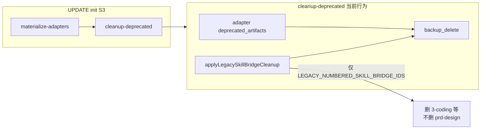

# framework-init UPDATE 清理语义旧跳板（prd-design / requirement-design）

## 问题现象

宿主工程在 **framework-init UPDATE** 后，`.cursor/skills/`（及 Claude / generic 等价路径）仍保留：

- `prd-design/`
- `requirement-design/`

同时新版 `spec/`、`plan/` 已物化，用户会误以为两套 phase skill 都有效。



## 根因（代码路径）

| 环节 | 文件 | 现状 |
|------|------|------|
| UPDATE 触发清理 | [`harness/scripts/utils/init-task-executor.ts`](harness/scripts/utils/init-task-executor.ts) | `cleanup-deprecated` 在 `mode === 'update'` 时调用 `applyLegacySkillBridgeCleanup` |
| 清理 SSOT | [`harness/scripts/utils/legacy-skill-bridge-cleanup.ts`](harness/scripts/utils/legacy-skill-bridge-cleanup.ts) | `LEGACY_NUMBERED_SKILL_BRIDGE_IDS` 仅含编号形态（`1-spec`、`2-plan`、`3-coding`…） |
| 路径映射 | 同上 `legacyRelPathForAdapter` | cursor → `.cursor/skills/{id}/`；claude → `.claude/commands/{id}.md`；generic → `{bundle.skillsDir}/{id}/` |
| S1 探测 | 同上 `detectLegacySkillBridgePresence` | 与清理列表同源；扩列表后任务标题会自动提示「含 N 处旧跳板」 |

**缺失 ID**（与 [`MIGRATION.md`](MIGRATION.md) v2.3 profile-skill-asset 表、[`scripts/phase-rename-inventory.json`](scripts/phase-rename-inventory.json) 一致）：

- `prd-design`
- `requirement-design`
- `1-prd-design`（更早编号形态，防漏网）
- `2-requirement-design`

用户截图中 `wallet-sdk-onboarding` 等为扩展 skill，**不在**清理列表，不会被误删。

**为何 CREATE 不删**：`applyLegacySkillBridgeCleanup` 在 `mode !== 'update'` 时直接 `skipped`——符合预期；本修复面向已接入旧版跳板的宿主 **UPDATE**。

## 修复方案（最小 diff）

### 1. 扩展 legacy 跳板 ID 列表 + 命名同步

修改 [`harness/scripts/utils/legacy-skill-bridge-cleanup.ts`](harness/scripts/utils/legacy-skill-bridge-cleanup.ts)：

- **常量**：`LEGACY_NUMBERED_SKILL_BRIDGE_IDS` → `LEGACY_SKILL_BRIDGE_IDS`（全仓引用仅本文件一处循环，改动面小）。
- **类型**：`LegacyNumberedSkillBridgeId` → `LegacySkillBridgeId`（L23，与常量同源推导）。
- 在现有编号列表基础上追加语义/过渡 ID：

```ts
// 语义旧名（v2.3 前）
'prd-design',
'requirement-design',
// 编号旧名（v2.3 前）
'1-prd-design',
'2-requirement-design',
```

- 列表内用注释分三组：`00/0 前缀`、`1–6 编号`、`语义 prd/requirement`，便于后续维护。
- **禁止**加入当前 canonical：`spec`、`plan`、`coding` 等。

无需改 `legacyRelPathForAdapter` / `applyLegacySkillBridgeCleanup` 逻辑——扩 ID 即生效。Claude 侧经 `legacyRelPathForAdapter`（L122）自动映射为 `.claude/commands/{id}.md`，四个新 ID 分别对应 `prd-design.md`、`requirement-design.md`、`1-prd-design.md`、`2-requirement-design.md`。

### 2. S1 任务标题文案（审查补强 #1）

[`harness/scripts/utils/init-task-planner.ts`](harness/scripts/utils/init-task-planner.ts) L508：

- 现：`deprecated + 遗留编号跳板 cleanup（发现 N 处…）`
- 改：`deprecated + 遗留 skill 跳板 cleanup（发现 N 处…）`

扩 ID 后 S1 会探测到 `prd-design/` 等非编号目录，标题须去掉「编号」限定，避免用户误解探测范围。

### 3. 单测（审查补强 #2、#3）

[`harness/tests/unit/legacy-skill-bridge-cleanup.unit.test.ts`](harness/tests/unit/legacy-skill-bridge-cleanup.unit.test.ts)：

| 用例 | 覆盖点 |
|------|--------|
| `collectLegacySkillBridgePaths` | cursor：`.cursor/skills/prd-design/`、`requirement-design/` |
| 同上 claude | `prd-design.md`、`requirement-design.md`、`1-prd-design.md`（至少一条编号语义） |
| `applyLegacySkillBridgeCleanup` | 并存 `prd-design` + `spec` 时只删前者并写入 `.framework-backup/` |
| **`detectLegacySkillBridgePresence`** | 存在 `.cursor/skills/prd-design/` 时 `count >= 1` 且 `samples` 含该路径（S1 count/sample 链路） |

[`harness/tests/unit/init-task-executor.unit.test.ts`](harness/tests/unit/init-task-executor.unit.test.ts)（仿现有 `3-coding` 用例）：

- `cleanup-deprecated UPDATE cursor`：删 `prd-design` / `requirement-design`，保留 `spec` / `plan`。
- `cleanup-deprecated UPDATE claude`：删 `prd-design.md` + `requirement-design.md`（+ 可选 `1-prd-design.md`），保留 `spec.md` / `plan.md`。

### 4. 文档（消费者向）

- [`MIGRATION.md`](MIGRATION.md) v2.3 迁移节：明确 **UPDATE framework-init** 会备份删除 `prd-design`、`requirement-design`（及编号旧跳板），与 `1-spec`/`2-plan` 清理并列说明。
- [`skills/project/framework-init/SKILL.md`](skills/project/framework-init/SKILL.md) UPDATE / cleanup 小节：一行说明语义旧跳板纳入 `cleanup-deprecated`（避免用户手动删）。
- [`agents/README.md`](agents/README.md) **「v2.3+ 扁平 skill-id」/ cleanup-deprecated 残留说明**段落（勿写死行号）：「遗留编号跳板」→「遗留 skill 跳板」，并点名 `prd-design` / `requirement-design` 语义旧名。

### 5. 不纳入本修复（审查认同的边界）

- **post-init 门禁**：在 `check-init` 对物化 adapter 扫描残留 `prd-design` 并 WARN——价值有限（UPDATE 已清）；若用户 **跳过** `cleanup-deprecated`（`skippable: true`）仍会残留，可在 SKILL 中注明「跳过清理则旧跳板保留」。
- **release:verify 新 gate**：不必；单测 + 现有 init harness 已足够。

## 宿主侧补救（修复发布后）

对已误留旧跳板的宿主工程：

1. 升级 framework 至含本修复的版本（当前窗口 **2.3.0**）。
2. 重跑 `/framework-init`，模式 **UPDATE**，**不要跳过** `cleanup-deprecated`。
3. 确认 `.framework-backup/<timestamp>/` 含 `prd-design`、`requirement-design` 备份，且 `.cursor/skills/` 仅剩 `spec`、`plan` 等现行跳板。

## 验收（含 doc freshness；多行命令，兼容 PowerShell 5.1 / bash）

```bash
cd harness
npm test
npm run check:docs   # MIGRATION / SKILL / agents/README 改动后必跑
cd ..
npm run release:verify   # 触及发布内容时（仓根执行）
```

手动：临时目录模拟 UPDATE init，`prd-design` 进 backup、`spec` 仍在；S1 任务标题含「遗留 skill 跳板」且 count 含语义目录。

## 风险与边界

| 风险 | 缓解 |
|------|------|
| 误删用户自定义同名 skill | ID 为框架历史约定名；扩展 skill 应使用非 phase 名（如 `wallet-sdk-onboarding`） |
| 用户跳过 cleanup 任务 | 文档说明；S1 标题仍提示旧跳板数量 |
| CREATE 新工程无旧跳板 | 清理逻辑仍 skipped，无影响 |
