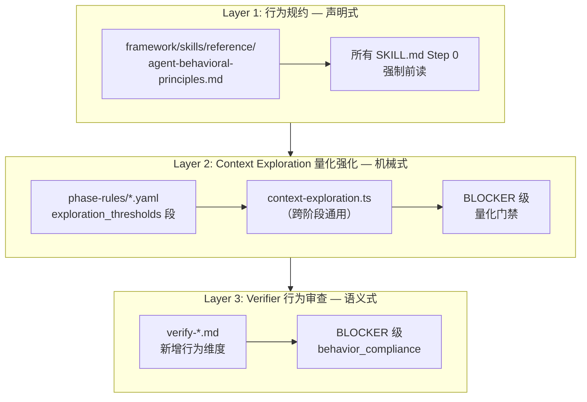

# Karpathy 四原则全生命周期引入方案

## 问题本质

当前 framework 架构完整地定义了**产出结构**（每个阶段该产出什么、格式、字段），但缺乏对 AI **行为方式**的约束。Karpathy 指出的四个系统性缺陷在当前 framework 中全部存在：


| Karpathy 缺陷    | 在 framework 中的表现                                       |
| -------------- | ------------------------------------------------------ |
| 做错误假设、不管理自己的困惑 | AI 不深入探索代码就直接产出（5 个阶段的 Context Exploration Gate 全是纸老虎） |
| 过度工程化、膨胀抽象     | PRD 臆造需求、design 多建模块、coding 写投机性代码                     |
| 顺手改不相关的代码      | coding 阶段超出 scope 改代码，review 看不出真正问题                   |
| 缺乏可验证的成功标准     | 每步的"做完了"靠 AI 自己说，中间步骤缺乏检验循环                            |


**关键发现**：Context Exploration Gate 在 prd/design/coding/review/ut 五个阶段都存在，但 harness 对它的校验全都只是 frontmatter 关键词匹配——AI 在任何阶段都能走形式通过。

---

## 架构设计：三层引入




### Layer 1：行为规约（新增全局 reference）

**新文件**：`framework/skills/reference/agent-behavioral-principles.md`

将 Karpathy 四原则翻译为 framework 上下文的行为规范，不是简单复制粘贴，而是**针对 AI coding agent 做全生命周期适配**：

#### 原则 1：Research First（先研究再产出）

原 Karpathy："Don't assume. Don't hide confusion. Surface tradeoffs."

Framework 适配：

- **每个阶段产出前，必须有可验证的研究证据**（不只是声称读了）
- 不确定时**停下来问**，不要猜测后继续
- 发现代码与文档不一致时，**以代码为准并显式标注**
- 涉及多模块/多文件时，**必须使用 explore subagents**（不是"建议"）

#### 原则 2：Minimum Viable Output（最小可行产出）

原 Karpathy："Minimum code that solves the problem. Nothing speculative."

Framework 适配：

- PRD：只写用户实际要求的功能，不臆造"顺便加上"的需求
- Design：只建 PRD 需要的模块，不为"架构美感"多加抽象
- Coding：只写 contracts 要求的代码，不写投机性"未来可能用"的逻辑
- UT：只覆盖 acceptance.yaml 声明的场景，不为"完整性"堆测试

#### 原则 3：Surgical Precision（精准手术）

原 Karpathy："Touch only what you must. Clean up only your own mess."

Framework 适配：

- Coding：git diff 必须只含 design scope 内的文件
- Review：只评审本次变更引入的问题，不"顺便改善"既有代码
- 改文档/代码时：不改相邻的注释、格式、命名（除非那是本次目标）

#### 原则 4：Verify Before Proceed（验证后再推进）

原 Karpathy："Define success criteria. Loop until verified."

Framework 适配：

- Context Exploration 完成后，自检：**列出的 source_code_paths 是否真实存在？Code Facts 是否支撑即将做的决策？**
- 每个 Step 内部：产出前停顿，对比输入（PRD/design/contracts）确认是否对齐
- 写完文件后立刻验证（lint/编译/harness 局部检查），不批量产出后统一验证

### Layer 2：Context Exploration Gate 量化强化（跨阶段）

**改动文件**：

- `[framework/harness/scripts/utils/context-exploration.ts](framework/harness/scripts/utils/context-exploration.ts)`
- `[framework/harness/templates/context-exploration.md](framework/harness/templates/context-exploration.md)`
- `[framework/specs/phase-rules/prd-rules.yaml](framework/specs/phase-rules/prd-rules.yaml)`
- `[framework/specs/phase-rules/design-rules.yaml](framework/specs/phase-rules/design-rules.yaml)`
- `[framework/specs/phase-rules/coding-rules.yaml](framework/specs/phase-rules/coding-rules.yaml)`
- `[framework/specs/phase-rules/review-rules.yaml](framework/specs/phase-rules/review-rules.yaml)`
- `[framework/specs/phase-rules/ut-rules.yaml](framework/specs/phase-rules/ut-rules.yaml)`

#### 2.1 模板升级（context-exploration.md）

新增 frontmatter 字段：

```yaml
source_code_paths: []   # 实际 Read/Grep 过的源码文件路径（harness 验证磁盘存在）
exploration_mode: ""    # "subagent" | "sequential" | "minimal"
decisions_unlocked: []  # 本次探索解锁了哪些设计/实现决策（1:1 对应后续产出）
```

新增正文必填段「Code Facts（代码事实）」：

```markdown
## Code Facts（代码事实，BLOCKER 级必填）

| 路径 | 发现的事实 | 对本阶段产出的影响 |
|------|-----------|------------------|
| src/module/xxx.ets | 已有 YYY 类，实现了 ZZZ | design 中复用此类，不新建 |
```

#### 2.2 harness 量化校验（context-exploration.ts）

为 **每个阶段** 新增 BLOCKER 级校验：


| 检查项                              | 说明                                                              |
| -------------------------------- | --------------------------------------------------------------- |
| `source_code_paths` 非空 + 磁盘验证    | 列出的文件必须在项目中真实存在                                                 |
| `source_code_paths.length` >= 阈值 | 阈值来自 phase-rules `exploration_thresholds.min_source_code_paths` |
| `files_inspected_count` >= 阈值    | 来自 `exploration_thresholds.min_files_inspected`                 |
| `exploration_mode` 合规            | 当 in_scope_modules >= N 时，不允许 "minimal"                         |
| `decisions_unlocked` 非空          | 探索必须显式解锁决策点                                                     |
| Code Facts 段非空                   | 正文解析，至少 M 条                                                     |


#### 2.3 各阶段阈值配置（phase-rules/*.yaml）

```yaml
# 示例：design-rules.yaml 新增段
exploration_thresholds:
  min_files_inspected: 8
  min_source_code_paths: 3      # 至少 3 个源码文件
  min_searches: 5
  min_code_facts: 3
  require_subagent_when_scope_gte: 2  # scope 模块 >= 2 时必须用子 agent
  exploration_mode_allowed: ["subagent", "sequential"]  # 不允许 "minimal"
```

各阶段差异化：


| 阶段     | min_source_code_paths | min_code_facts | require_subagent_when |
| ------ | --------------------- | -------------- | --------------------- |
| prd    | 2（读现有功能代码理解现状）        | 2              | scope >= 3            |
| design | 5（读模块结构/实现/配置）        | 5              | scope >= 2            |
| coding | 3（读 contracts 对应已有文件） | 3              | files > 5             |
| review | 等于待审文件数（必须全读）         | 3              | files > 8             |
| ut     | 3（读被测实现）              | 3              | use-cases > 2         |


### Layer 3：Verifier 行为审查维度（全阶段 verify-*.md）

**改动文件**：

- `[framework/harness/prompts/verify-prd.md](framework/harness/prompts/verify-prd.md)`
- `[framework/harness/prompts/verify-design.md](framework/harness/prompts/verify-design.md)`
- `[framework/harness/prompts/verify-coding.md](framework/harness/prompts/verify-coding.md)`
- `[framework/harness/prompts/verify-review.md](framework/harness/prompts/verify-review.md)`
- `[framework/harness/prompts/verify-ut.md](framework/harness/prompts/verify-ut.md)`

为所有 verify-*.md 新增统一的 **行为合规性检查维度**（BLOCKER 级）：

```yaml
# 新增到每个 verify-*.md 的检查列表
- id: behavior_research_grounded
  severity: BLOCKER
  description: |
    产出中的每个技术决策/结论是否都能在 context-exploration.md 的
    Code Facts 中找到事实依据？是否存在"凭空臆断"的内容？
    
- id: behavior_minimum_viable
  severity: MAJOR
  description: |
    产出是否超出了输入（PRD/design/contracts）的要求范围？
    是否存在"过度工程化"迹象（不必要的抽象、投机性功能）？

- id: behavior_scope_surgical
  severity: BLOCKER  # coding/review 阶段
  description: |
    变更是否精确对应输入契约？是否触碰了 scope 外的文件/逻辑？

- id: behavior_verify_loop
  severity: MAJOR
  description: |
    产出是否与上游输入（PRD↔design↔contracts↔code）可追溯对齐？
    是否存在断链（design 引用了 PRD 中不存在的需求、code 实现了
    contracts 中未声明的接口）？
```

**关键升级**：将现有 `context_exploration_sufficiency`（原 MAJOR）升级为 BLOCKER，并与新增的 `behavior_research_grounded` 交叉验证。

---

## 引入方式与时序

### Phase 1（核心：可立即执行）

1. **写 `agent-behavioral-principles.md`** — 声明式行为规约
2. **改 `context-exploration.ts`** — 新增量化校验逻辑
3. **改 `context-exploration.md` 模板** — 新增 source_code_paths / Code Facts
4. **改 5 个 phase-rules/*.yaml** — 各阶段 exploration_thresholds

### Phase 2（语义强化 + 流程结构化）

5. **改 5 个 verify-*.md** — 新增行为合规维度（BLOCKER）
6. **改 5 个 SKILL.md** — 将 Context Exploration Gate 从"段落"升级为**独立编号 Step（Research Sub-Phase）**，含：
   - 强制前读 `agent-behavioral-principles.md`
   - 明确的 explore subagent 启动要求（≥ 阈值时为 MUST）
   - 自检清单（source_code_paths 存在性、Code Facts 非空）
   - **禁止在 Research Sub-Phase 完成前进入后续 Step**（"Think Before Coding" 的结构化体现）
7. **为 hmos-app profile 新增 exploration-snippets overlay** — 将宿主路径（`build-profile.json5`、`.ets`、`module.json5` 等）注入 `CONTEXT_EXPLORATION_PHASE_INPUT_SNIPPETS` 的 profile 级扩展点，使脚本 harness 在 hmos 工程中自动要求这些路径出现在 `key_inputs_read`

### Phase 3（入口整合）

8. **改 AGENTS.md / CLAUDE.md** — SSOT 表新增行为规约引用 + 全局约束段引用
9. **改 framework.mdc** — Cursor rules 声明
10. **限制 backfill** — 不再允许 ready_to_produce=true 的零探索 stub

---

## 对"先有 plan 不修改现有产物"的影响

- `framework/skills/reference/` 下新增 1 个文件（行为规约）
- `context-exploration.ts` 改动（新增校验，但旧 frontmatter schema 1.0.0 不强制新字段 → 通过 schema_version bump 1.0.0 → 1.1.0 + 迁移窗口过渡）
- phase-rules yaml 新增 `exploration_thresholds` 段（现有段不动）
- verify-*.md 追加检查项（不改已有检查项的语义和 severity）
- **5 个 SKILL.md 的 Context Exploration Gate 升级为独立编号 Step**（Research Sub-Phase），将"段落"变为有编号的步骤，弱模型不会再跳过
- **hmos-app profile 新增 `exploration-snippets.yaml`**（或等价 overlay 机制），使 `build-profile.json5` / `.ets` / `module.json5` 成为脚本级必查路径
- AGENTS.md / CLAUDE.md / framework.mdc 新增行为规约 SSOT 引用

---

## 零回归保证

- `schema_version` 从 1.0.0 升到 1.1.0：旧版 `context-exploration.md` 仍可通过（新字段 optional + 有默认值）
- 新增 exploration_thresholds 在 yaml 中：harness 读取时 fallback 到宽松默认值（min=0）
- verify-*.md 新增检查项：不影响已有检查的 pass/fail 逻辑
- 通过 MIGRATION.md v2.9 节说明升级路径

---

## 与 andrej-karpathy-skills 项目的对应关系


| andrej-karpathy-skills                | 本方案引入方式                                                  |
| ------------------------------------- | -------------------------------------------------------- |
| CLAUDE.md（4 原则全文）                     | → `agent-behavioral-principles.md`（适配为 framework 生命周期语境） |
| .cursor/rules/karpathy-guidelines.mdc | → `framework.mdc` 中引用 + AGENTS.md SSOT 行                 |
| skills/karpathy-guidelines/SKILL.md   | 不作为独立 Skill 引入，而是融入现有 Skill 0-6 的 Step 0 前置              |
| EXAMPLES.md（反例/正例）                    | → 行为规约中每条原则附带 framework 场景反例/正例                          |


**设计理念**：andrej-karpathy-skills 是面向通用开发的行为指南；我们不是简单复制它，而是将其**精华（4 原则的认知框架）** 与 framework 已有的**强制机制（harness + verifier + Gate）** 结合，形成**可机械验证的行为约束**，而非仅靠 AI 自律。