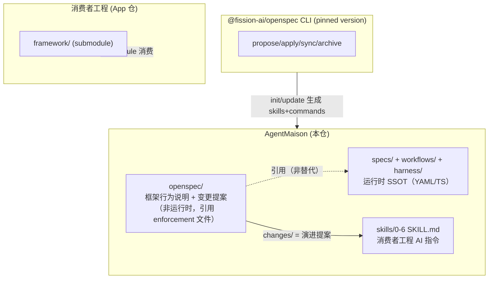

# OpenSpec 引入 AgentMaison 方案（v2 — 吸收审查意见）

## 背景与动机

AgentMaison 拆库后，`openspec/` 目录已预留（仅含 `.gitkeep`），且在拆分演进计划中明确列为"后续事项 #1"。目标是：**用 OpenSpec 管理 AgentMaison 框架自身的变更提案与行为说明**，而非消费者工程。

## 核心原则（审查加固）

1. **OpenSpec 不是运行时 SSOT** — 运行时真相源仍是 `specs/`（YAML phase-rules）、`workflows/`（DAG）、`harness/`（TS 脚本）。OpenSpec 是"变更提案与框架行为说明层"，每条 Requirement 必须引用实际 enforcement 文件。
2. **版本可复现** — CLI 安装固定版本号，不用 `latest`。
3. **探测优先** — 先跑 `--help` 确认命令实际参数，再执行。
4. **最小 patch** — 不手写覆盖 `config.yaml`，在 init 生成结果上做增量修改。
5. **验收含发布门禁** — `npm run release:verify` 是本次核心验收项（防泄漏比功能测试更关键）。

## 两者关系定位



**关键区分**：
- `openspec/specs/` = 框架行为的**可读说明**（Markdown Requirement + Scenario），每条 requirement 末尾引用 enforcement 文件
- `specs/` (仓根) = harness 运行时 SSOT（phase-rules YAML、JSON Schema）— 不替代
- `workflows/` = harness DAG — 不替代
- OpenSpec 的 `changes/` 驱动框架未来每次功能演进的提案与设计

## 执行步骤

### Phase 0: 探测 CLI 能力（不假设参数存在）

先用临时执行方式探测，避免全局安装污染本机：

```bash
# 1. 查询当前 latest 版本号并确认
npm view @fission-ai/openspec version

# 2. 用 npx 临时执行探测（不写入全局）
npx @fission-ai/openspec@1.3.1 --version
npx @fission-ai/openspec@1.3.1 --help
npx @fission-ai/openspec@1.3.1 init --help
npx @fission-ai/openspec@1.3.1 validate --help
npx @fission-ai/openspec@1.3.1 config --help
```

确认 1.3.1 可用后，再决定全局安装（后续步骤需要 `openspec init` 写文件，全局安装更方便）：

```bash
# 3. 确认后全局安装，锁死版本，执行期间不漂移
npm install -g @fission-ai/openspec@1.3.1
```

记录实际可用的 flags（`--tools`、`--profile`、`--schema` 等），确认后再执行 init。

### Phase 1: 初始化 OpenSpec 目录结构

根据 Phase 0 探测到的 `init --help` 实际输出执行（若 flag 名或工具枚举与下方预期不一致，以实际为准并更新命令）：

```bash
cd D:\1.code\agent-maison
openspec init --tools cursor,codex
```

观察生成物：
- `openspec/config.yaml` — 默认配置（保留原样，下一步 patch）
- `openspec/specs/` — 空目录
- `openspec/changes/` — 空目录
- `.cursor/skills/openspec-*/` — Cursor OPSX skills
- `.cursor/commands/opsx-*.md` — Cursor slash commands
- `.codex/skills/openspec-*/` — Codex OPSX skills

### Phase 2: 最小 patch `openspec/config.yaml`

**不手写覆盖**，在 init 生成的默认结构基础上追加 `context` 和 `rules` 字段：

```yaml
# init 生成的字段保持不动（schema、version 等）
# 仅追加/修改以下：

context: |
  Product: AgentMaison — spec-driven agentic workflow framework with harness gates
  Tech stack: TypeScript, Node.js (>=18), YAML schemas, Markdown templates
  Package manager: npm
  Architecture: skills/ + specs/ + harness/ + profiles/ + agents/ + workflows/
  This openspec/ manages the FRAMEWORK ITSELF, not consumer projects.
  Runtime SSOT remains in specs/, workflows/, harness/ — OpenSpec specs are
  the readable behavior-description layer that REFERENCES enforcement files.

rules:
  specs:
    - Every requirement MUST reference its enforcement file (e.g. specs/phase-rules/*.yaml, harness/scripts/check-*.ts)
    - Use SHALL for harness-enforced rules, MUST for blocking constraints
    - Each spec domain should map to a harness phase or cross-cutting concern
  proposal:
    - Reference affected phase(s) and MIGRATION.md implications
    - Flag breaking changes that require consumer migration
  design:
    - Consider backward compatibility with existing consumer instances
    - Document profile/adapter impact
  tasks:
    - Include npm run release:verify as mandatory verification step
    - Include harness test verification when touching runtime SSOT
    - Include MIGRATION.md update if breaking
```

### Phase 3: 种子 Specs（优先级调整）

首批 2-3 个 spec 选择：

| 优先级 | Spec 域 | 来源 | 为什么优先 |
|---|---|---|---|
| P0 | `release-boundary` | `AGENTS.md` + `scripts/release-excludes.json` + `.npmignore` | 仓库最硬的契约：什么进 zip，什么绝不进 zip |
| P1 | `harness-gates` | `harness/` + `specs/phase-rules/` | Maison 改发布内容后的验收条件 |
| P2 | `agent-adapters` 或 `phase-dag` | `agents/adapter-schema.yaml` 或 `workflows/` | 二选一，第一波不铺太大 |

每个 spec 中的 Requirement 末尾必须有 `Enforced by:` 引用：

```markdown
### Requirement: Development tools never enter release zip

The system SHALL exclude all directories listed in `scripts/release-excludes.json`
from the release zip artifact.

#### Scenario: openspec directory excluded
- **WHEN** `npm run release:pack` is executed
- **THEN** the output zip SHALL NOT contain any path starting with `openspec/`

> **Enforced by:** `scripts/release-excludes.json` line 2, `scripts/verify-release-pack.mjs`
```

### Phase 4: 验收（强化版）

验收分三层，按重要性排序：

1. **发布边界（必须）**：`npm run release:verify` — 确认 openspec/ 和生成的 AI 工具文件不混入 zip
2. **OpenSpec 自身**：`openspec validate` — 确认 specs 格式合规
3. **Harness（仅在动了运行时 SSOT 时）**：`cd harness && npm test`

本次只动开发工具层，所以 release:verify 是核心验收项。

### Phase 5: 处理全局副作用

| 生成物 | 位置 | 可版本控制 | 处理 |
|---|---|---|---|
| Cursor skills | `.cursor/skills/openspec-*/` | 是（仓内） | 跟随 `.cursor/` 排除规则 |
| Cursor commands | `.cursor/commands/opsx-*.md` | 是（仓内） | 跟随 `.cursor/` 排除规则 |
| Codex skills | `.codex/skills/openspec-*/` | 是（仓内） | 跟随 `.codex/` 排除规则 |
| Codex commands | `$CODEX_HOME/prompts/opsx-*.md` | **否（全局）** | 标记为"本机开发者安装副作用"，不作为仓库产出物 |

**Codex 全局 prompts 不可审查**，仓库只承诺版本控制 `.codex/skills/openspec-*` 等项目内文件。

## 两套体系共存策略

| 维度 | 运行时 SSOT (specs/ + workflows/ + harness/) | OpenSpec (openspec/) |
|---|---|---|
| 角色 | 框架运行时行为的**执行定义** | 框架行为的**可读说明与变更管理** |
| 格式 | YAML + JSON Schema + TypeScript | Markdown (Requirement + Scenario) |
| 消费者 | harness-runner、check-*.ts | 框架开发者 + AI agent |
| 变更驱动 | 直接编辑 + harness test 验证 | /opsx:propose → Delta spec → archive |
| 关系 | 被 OpenSpec specs 引用 | 引用运行时 SSOT 文件 |

**不存在双 SSOT**：OpenSpec specs 是"人/AI 可读的行为说明"，运行时 enforcement 仍由 YAML/TS 决定。二者关系类似"RFC 文档引用代码实现"。

## 日常使用模式（Phase 4 后）

```
/opsx:propose "add goal-mode phase transition"
  → openspec/changes/add-goal-mode-transition/
    ├── proposal.md  (为什么、影响哪些 phase、MIGRATION.md 需要改？)
    ├── specs/phase-dag/spec.md  (Delta: ADDED/MODIFIED requirements + Enforced by)
    ├── design.md  (技术方案、兼容性分析)
    └── tasks.md  (实现清单，末尾含 release:verify + harness test)

→ 编码实现（修改 workflows/、specs/、harness/ 等运行时 SSOT）
→ openspec validate + npm run release:verify + cd harness && npm test
→ /opsx:archive  (Delta 合入 openspec/specs/，change 归档)
```

## 风险与注意

- Node.js >= 20.19.0 已满足（当前环境 v24.15.0）
- CLI 版本固定，避免 `latest` 导致生成物结构漂移
- 种子 specs 不追求完美（iterative not waterfall），但必须有 `Enforced by` 引用
- 全局 Codex prompts 为不可审查副作用，文档标注但不强依赖

## 产出物清单

仓库内（可版本控制）：
- `openspec/config.yaml` — 项目配置（基于 init 生成 + 最小 patch）
- `openspec/specs/release-boundary/spec.md` — 发布边界规范
- `openspec/specs/harness-gates/spec.md` — 门禁验收规范
- `openspec/specs/<agent-adapters|phase-dag>/spec.md` — 第三个种子
- `.cursor/skills/openspec-*/SKILL.md` — Cursor OPSX skills
- `.cursor/commands/opsx-*.md` — Cursor slash commands
- `.codex/skills/openspec-*/SKILL.md` — Codex OPSX skills

本机副作用（不进仓库）：
- `$CODEX_HOME/prompts/opsx-*.md` — Codex 全局 commands
