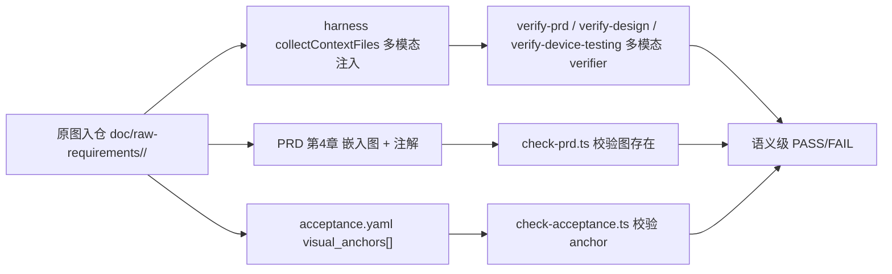

## 问题机理（一句话）

`原图 → PRD 文字表格 → acceptance.yaml/design.md → 下游所有阶段` 是一条**单向衰减、无任何反向校验**的链路：原图被 `.gitignore` 排除（[.gitignore:21](.gitignore)）、PRD 模板第 4 章只要求文字（[framework/skills/1-prd-design/templates/prd-template.md:111-144](framework/skills/1-prd-design/templates/prd-template.md)）、`harness-runner.collectContextFiles` 只喂文本（[framework/harness/harness-runner.ts:436-439](framework/harness/harness-runner.ts)）、Skill 2/6 输入清单不含原图、`acceptance.yaml` 无视觉锚点字段。

## 设计原则

1. **图是唯一视觉真相**：PRD 文字是图的"注解"，不是替代品。
2. **持久 + 可机器读**：图必须有稳定路径、被 git 跟踪、被 harness 注入 verifier 上下文。
3. **结构化锚点**：关键 UI 用 `visual_anchor` 把"必须像图里那样"的要求落到可校验字段。
4. **改造**门禁分层**：脚本检查"图存在"等确定性事实，AI verifier 检查"PRD 文字与图一致"等语义事实。
5. **向后兼容**：现有 `home-page` PRD 不被破坏，新规则只对新 feature 强制。

## 数据流目标



## 路径与命名约定（建议）

- 原始截图入仓目录：`doc/raw-requirements/<feature>/`（PascalCase 或 kebab-case 与 `feature` 名对齐）
- 兼容旧路径：保留 `doc/原始需求/` 软链或在 `framework.config.json` 里同时声明两个路径，迁移时一次性把旧目录搬过来。
- `framework.config.json` 新增字段：

```json
{
  "paths": {
    "raw_requirements_dir": "doc/raw-requirements"
  }
}
```

## 改造点清单（中等档，主线方案）

### A. 仓库基础设施

- 修改 [.gitignore](.gitignore)：移除 `/doc/原始需求`，新增允许 `doc/raw-requirements/`。
- 修改 [framework.config.json](framework.config.json)：在 `paths` 段加 `raw_requirements_dir`。
- 现有 feature 迁移：把 `doc/原始需求/1.首页/*` 软链或复制到 `doc/raw-requirements/home-page/`，一次性，不强制重写 PRD 旧引用。

### B. PRD 模板与规则改造

- 修改 [framework/skills/1-prd-design/templates/prd-template.md](framework/skills/1-prd-design/templates/prd-template.md) 第 4 章：
  - 每个区域子节**第一个元素必须是 markdown 图片**：``
  - 组件表新增列：`视觉锚点 ID`（指向 acceptance.yaml 的 `visual_anchors[].id`）
  - 在章节开头加 BLOCKER 提示："文字是图的注解，不是替代；任何文字描述与图冲突时以图为准"。
- 修改 [framework/specs/phase-rules/prd-rules.yaml](framework/specs/phase-rules/prd-rules.yaml) 的 `page_description_completeness`：
  - 新增 BLOCKER 子规则 `screenshot_embedded_per_subsection`：每个区域子节至少一张 markdown 图片，且图片相对路径必须解析到 `paths.raw_requirements_dir` 下的真实文件。
  - 新增 MINOR 子规则 `visual_anchor_id_referenced`：组件表"视觉锚点 ID"列允许为空，但若填写必须能在 acceptance.yaml 找到对应 `id`。

### C. acceptance.yaml 视觉锚点结构化

- 修改 [framework/skills/1-prd-design/SKILL.md](framework/skills/1-prd-design/SKILL.md) Step 6.1，在 `criteria[]` 上新增可选字段：

```yaml
visual_anchors:
  - id: "VA-1"
    screenshot_ref: "doc/raw-requirements/home-page/area-card.png"
    bbox: [120, 240, 720, 480]   # 可选裁剪框 [x1,y1,x2,y2]
    must_match:
      - "卡面渐变色与原图一致"
      - "底部主按钮文案: 添加/管理卡"
    linked_acs: ["AC-3", "AC-4"]
```

- 新增脚本 `framework/harness/scripts/check-acceptance.ts`（或在现有脚本扩展）：
  - BLOCKER：每个 P0/P1 AC 至少被一个 `visual_anchors[].linked_acs` 引用一次。
  - BLOCKER：`screenshot_ref` 文件必须存在。
- 修改 [framework/specs/phase-rules/prd-rules.yaml](framework/specs/phase-rules/prd-rules.yaml) 中的追溯校验，让 `visual_anchors` 与 `criteria` 互查。

### D. harness-runner 多模态注入

- 修改 [framework/harness/harness-runner.ts](framework/harness/harness-runner.ts) 的 `collectContextFiles`：
  - 对 `prd / design / device-testing` 三个阶段，扫描 `paths.raw_requirements_dir/<feature>/*.{png,jpg,jpeg,webp}`，作为附件加入 `files`（用 base64 或本地路径，看 verifier prompt 当前形态）。
  - 注意现有 `files` 是文本结构 `{label, content}`，可能需要新增 `files_binary[]` 字段并在 prompts 模板里区分。
- 修改 [framework/harness/prompts/verify-prd.md](framework/harness/prompts/verify-prd.md)：
  - 新增 Step "**视觉一致性核查**"（BLOCKER 级）：要求 verifier 同时阅读 PRD 文本与原始截图附件，逐区域核对："PRD 文字描述的组件、布局、状态是否与原图一致？若有偏差，列出具体偏差点。"
  - 文档化"verifier 必须是多模态模型"的运行时要求（在 Skill 1 文档加一句运行约束）。
- 同样改造 `verify-design.md` 与 `verify-device-testing.md`（在 design 阶段核对"页面组件树 vs 原图"、device-testing 阶段核对"真机截图 vs 原图"）。

### E. 下游 Skill 输入清单更新

- 修改 [framework/skills/2-requirement-design/SKILL.md](framework/skills/2-requirement-design/SKILL.md) Step 1：在输入清单里补一行"**必读：原始截图** `doc/raw-requirements/<feature>/`"，并在 Step 1 的"读 PRD"动作前加一步"先看原图，再读 PRD"。
- 修改 [framework/skills/6-device-testing/SKILL.md](framework/skills/6-device-testing/SKILL.md) Step 1：原图列为必读输入；新增 Step "**视觉对照**"——真机执行时把关键页面真机截图放到 `doc/features/<feature>/device-screenshots/`，并在 `test-report.md` 中**逐 visual_anchor** 给出"匹配 / 偏差 / 偏差说明"。
- 修改 [framework/specs/phase-rules/testing-rules.yaml](framework/specs/phase-rules/testing-rules.yaml)：新增 MAJOR `visual_anchor_coverage_in_report`，要求 test-report 覆盖每个 visual_anchor。

### F. CLAUDE.md 全局约束

- 修改 [CLAUDE.md](CLAUDE.md) 第 3.2 / 3.3 节后插入新小节 **3.6 视觉真相守门**：
  - "原图是视觉 SSOT；PRD 文字仅为注解。"
  - "PRD/design/device-testing 阶段的 verifier 必须是多模态模型；纯文本模型只能跑结构 BLOCKER，不能给语义 PASS。"

## 改造产物影响面（按文件）

- 修改：`.gitignore`、`framework.config.json`、`CLAUDE.md`、`framework/skills/1-prd-design/{SKILL.md,templates/prd-template.md}`、`framework/skills/2-requirement-design/SKILL.md`、`framework/skills/6-device-testing/SKILL.md`、`framework/specs/phase-rules/{prd-rules.yaml,testing-rules.yaml}`、`framework/harness/harness-runner.ts`、`framework/harness/prompts/{verify-prd.md,verify-design.md,verify-device-testing.md}`、`framework/harness/scripts/check-prd.ts`
- 新增：`framework/harness/scripts/check-acceptance.ts`（或在 `check-prd.ts` 内扩展，二选一）
- 数据迁移：`doc/raw-requirements/home-page/`（从 `doc/原始需求/1.首页/` 迁入）

## 力度可裁剪：备选档

**轻量档（如果你想小步走）**：只做 A + D + F 三块——图入仓 + harness 把图喂给 verifier + CLAUDE.md 立约束。**不**改 PRD 模板和 phase-rules，靠多模态 verifier 在语义层拦住"PRD 文字与图不符"。代价小，但**没有结构化字段，机器层校验不到**。

**重量档（彻底重构）**：在中等档之上：
- PRD 第 4 章"组件表"硬要求降级为可选，"页面组件树"SSOT 移交 design.md，Skill 2 强制"重新看图"产出结构。
- 新增跨阶段 BLOCKER `prd_text_image_consistency`：PRD 定稿后必须由独立多模态 verifier 出 PASS 才能进入 design 阶段。
- device-testing 报告强制"真机截图 vs 原图"的视觉差异说明（人工或 perceptual-diff 工具）。

## 风险与开放点

- **多模态 verifier 可用性**：verify-* 现在的 prompt 注入靠 runner 装配文本，喂图需要 verifier 端支持多模态输入。需要先确认本工程跑 verifier 的实际 agent（claude / minimax / glm / 内网弱模型）哪些支持图。**这点决定方向 D 是否能落地，建议在改 runner 前先验证一次。**
- **图片大小与仓库膨胀**：原始截图入仓会让仓库变重；建议同时引入 `doc/raw-requirements/README.md` 约定"单图 ≤ 2MB、必要时压缩、PNG 优先"，并考虑后续接入 git-lfs。
- **旧 PRD 兼容**：`home-page` 的 PRD 用了中文路径 `doc/原始需求/1.首页`，迁移时要回填到 `doc/raw-requirements/home-page/`，并在 PRD 第 4 章补图片嵌入；可作为"示范迁移"作为本方案的回归用例。
- **力度选择**：建议以**中等档**为目标，但顺序上先做轻量档的 A+D+F（短路径见效），再做 B+C+E 的结构化字段。

