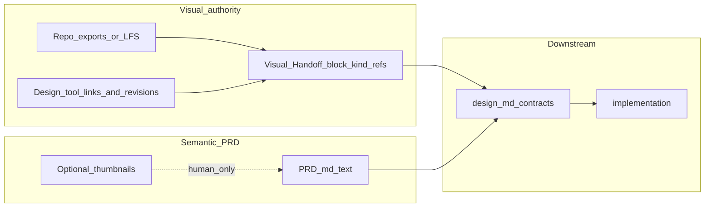

# PRD 到实现「图片精度丢失」的解决思路

## 实施状态（截至工程内已落地代码）

| Todo | 状态 | 落地位置（摘要） |
|------|------|------------------|
| visual-handoff-contract | 已完成 | [`framework/skills/1-prd-design/reference/visual-handoff.md`](e:/1.code/SimulatedWalletForHmos/framework/skills/1-prd-design/reference/visual-handoff.md) + `check-prd` 内建 kind 集合 |
| harness-handoff-adapters | 已完成 | [`framework/harness/scripts/check-prd.ts`](e:/1.code/SimulatedWalletForHmos/framework/harness/scripts/check-prd.ts) |
| prd-template-skill1 | 已完成 | [`prd-template.md`](e:/1.code/SimulatedWalletForHmos/framework/skills/1-prd-design/templates/prd-template.md)、[`SKILL.md`](e:/1.code/SimulatedWalletForHmos/framework/skills/1-prd-design/SKILL.md) |
| verify-prd-prompt | 已完成 | [`verify-prd.md`](e:/1.code/SimulatedWalletForHmos/framework/harness/prompts/verify-prd.md) |
| skill2-visual-parity | 已完成 | [`2-requirement-design/SKILL.md`](e:/1.code/SimulatedWalletForHmos/framework/skills/2-requirement-design/SKILL.md) Step 7 |
| pilot-home-page | **PRD 侧已完成** | 见下文「home-page 如何对接」；**未改** `design.md` / **未跑** verifier（若你要严格闭环可补） |
| prd-rules-yaml | 已完成 | [`prd-rules.yaml`](e:/1.code/SimulatedWalletForHmos/framework/specs/phase-rules/prd-rules.yaml) `visual_handoff` |
| handoff-escape-hatches | 已完成 | [`framework.config.json`](e:/1.code/SimulatedWalletForHmos/framework.config.json) `prd`；[`harness-runner.ts`](e:/1.code/SimulatedWalletForHmos/framework/harness/harness-runner.ts) `--skip-visual-handoff` |

---

## 执行清单（Todos）

与上方 frontmatter `todos` 一致（`status: completed` 表示已在仓库落地）：

1. ~~**visual-handoff-contract**~~ 已完成  
2. ~~**harness-handoff-adapters**~~ 已完成  
3. ~~**prd-template-skill1**~~ 已完成  
4. ~~**verify-prd-prompt**~~ 已完成  
5. ~~**skill2-visual-parity**~~ 已完成  
6. ~~**pilot-home-page**~~ PRD 试点已完成；design 增补与 verifier 按需补做  
7. ~~**prd-rules-yaml**~~ 已完成  
8. ~~**handoff-escape-hatches**~~ 已完成  

---

### `home-page` 与新框架是如何对接的？（读懂这条就够）

本轮**没有重写 ArkUI 首页代码**，做的是 **「PRD + 守门配置 + 可追溯真源占位」** 三件事，让 `check-prd` 在 **`strict`** 下能识别并接受本 feature 的 Visual Handoff：

1. **实例配置**  
   - [`framework.config.json`](e:/1.code/SimulatedWalletForHmos/framework.config.json) 增加 `"prd": { "visual_handoff_enforcement": "strict" }`。  
   - 含义：`ui_change: new_or_changed` 时，`authoritative_refs` 里的 **`path` 必须在仓库里真实存在**，否则 PRD 脚本阶段 **FAIL**。

2. **仓库内真源占位（满足 path 校验）**  
   - 新建 [`doc/features/home-page/ux-reference/README.md`](e:/1.code/SimulatedWalletForHmos/doc/features/home-page/ux-reference/README.md)。  
   - 作用：在还没有把 `doc/原始需求/1.首页` 整包入库前，仍有一条 **合法 `path`**；以后把高清截图放进同目录后，只要在 PRD 的 yaml 里 **增改 `authoritative_refs`** 即可。

3. **PRD 改造（与 Scope 分开的第二块 yaml）**  
   - 在 [`doc/features/home-page/PRD.md`](e:/1.code/SimulatedWalletForHmos/doc/features/home-page/PRD.md) 里，Scope 的 `yaml` **后面**追加**另一块** `yaml`，根上含 **`ui_change`**（脚本只认这种块），例如：`ui_change: new_or_changed` + `visual_handoff.kind: repo_assets` + 指向 `ux-reference/README.md` 的 `path`。  
   - **第 5 章措辞**：去掉「线框以当前实现为基线」，改为 **以归档原始截图与本目录导出为版面基线**，避免叙事上继续「默认跟已实现 UI 对齐」。

4. **尚未做的（计划中「试点」可增强项）**  
   - **`design.md`** 里尚未新增「Visual parity」对照段（Skill 2 已在 **方法论**里写好要求，可把同 feature 补一段）。  
   - **Verifier 子 agent** 跑的 `verify-prd.md` 检查 9 未在本轮会话里强制执行。

**一句话**：首页需求是用 **第二张 yaml 契约 + 仓内一个真实路径文件 + strict 配置** 接上新框架的；UI 代码未因本策略自动重构，视觉差量仍靠你后续按 `ux-reference` / 原始截图 **走查 + 改 presentation** 完成。

---

## 附录：模拟钱包既有 `home-page` 下一步怎么「重搞」

你现在的工程里已有完整链路产物（[`doc/features/home-page/`](e:/1.code/SimulatedWalletForHmos/doc/features/home-page/) 下的 `PRD.md`、`design.md`、`contracts.yaml`、`acceptance.yaml` 及测试/评审记录）。按计划推进时不必「从零开 feature」，而是用 **Visual Handoff（本例可用仓库内导出路径索引）+ PRD 基线纠错 + design/契约对齐 + 仅做差量编码** 把视觉与叙事拉回「原始需求优先」。

### 两条并进路线（推荐）

| 路线 | 内容 | 适合 |
|------|------|------|
| **框架线** | 按计划 Todos：Visual Handoff / `ui_change` 规范、`check-prd` 条件化、`verify-prd`、`Skill 2` 补充 | 长期所有 feature 受益 |
| **首页线（试点）** | 不待框架全开也可先做：在本 feature 写清 **Visual Handoff**（小规模工程可用 **`kind: repo_assets` + 路径列表**，不必单独 yaml 文件）、`PRD` 增 `ui_change`、改掉「以当前实现为基线」、补 design 对照与契约 | 尽快缩小与 `doc/原始需求/1.首页` 的差距 |

两条线可并行：首页试点先用手工/文档约定满足 handoff **语义**；等企业级分支校验合入后再由脚本按 `kind` 自动守门。

### 首页线建议顺序（可当作 checklist）

1. **原图真源可追溯**  
   确认归档 [`doc/原始需求/1.首页`](e:/1.code/SimulatedWalletForHmos/doc/原始需求/1.首页)（或等价路径）下 **原厂分辨率截图已进仓库**（普通提交或 Git LFS）。若仅在本地或未跟踪，clone 后必然断链，manifest 会做存在性检查时失败。  

2. **补 Visual Handoff 索引（本仓库推荐 `kind: repo_assets`）**  
   在 [`doc/features/home-page/`](e:/1.code/SimulatedWalletForHmos/doc/features/home-page/) 或 PRD 内嵌块列出：`logical_screen`/`region` → **仓库内**高清路径（可加 sha/设备备注）。文件名 **`visual-sources.yaml` 仅是载体之一**，也可 PRD fenced yaml。PRD 第 5 章各区域改为 **引用 handoff 条目 id**。Markdown 插图仅扫读。

3. **修订 [`PRD.md`](e:/1.code/SimulatedWalletForHmos/doc/features/home-page/PRD.md)**  
   - 增加：`ui_change: new_or_changed` + Handoff `kind`/`authoritative_refs`（与本工程一致）。  
   - **重写第 5 章基调**：以 Handoff 指向的真源（本例为归档截图像素）为版面基线；若与当前实现 intentionally 不同，归入「模拟工程偏差 / 占位数据」单列，而不要写「线框以当前实现为基线」。  
   - Scope 仍为 `WalletMain` 等与现 PRD 一致，除非你们要扩壳层（那走单独 scope 扩展）。

4. **修订 [`design.md`](e:/1.code/SimulatedWalletForHmos/doc/features/home-page/design.md) + [`contracts.yaml`](e:/1.code/SimulatedWalletForHmos/doc/features/home-page/contracts.yaml)**  
   增补短篇 **Visual parity**：分区对照 Handoff 条目、`允许偏差`（如营销图占位、文案假数据）、以及能写进契约的项（spacing、字号档位、资源 key 等）。原则是：**可测的写入 contracts / acceptance**，不可测的写明「主观走查对照 UX 真源」。  

5. **做一张「三方对照」差量表（内部用即可）**  
   列为：原始截图区 → PRD/desc → 当前实现 → 归类（Must fix / Accept as sim-wallet / Future）。编码只动 **Must fix**（仍遵守模块与现有架构）。

6. **按 Skill 流水线重跑来合法化（你们规范要求时）**  
   对已变更的 artifact 依序：`prd` harness + verifier → `design` → `coding`（仅改 `WalletMain` 内相关 `.ets`/资源）。历史阶段若已通过，这次是 **变更后重跑** 以满足「产物即契约」。  

7. **真机与设计走查**  
   用全屏原始图对照实现，必要时更新 [`device-testing-todo.md`](e:/1.code/SimulatedWalletForHmos/doc/features/home-page/device-testing-todo.md) / 测试报告中的截图证据。

**注意**：若目标仅是「逻辑/数据正确、UI 维持现状」，应把 `ui_change` 改为 `reuse_only` 并写清继承关系——那就不是这次「视觉重搞」，而是另一类迭代；本附录针对你前面反馈的 **与原始首页视觉差距大** 的情况。

---

## 问题本质（不仅是压缩）

1. **信息载体错了**：若团队或模型把「PRD 里的 Markdown 插图」当成唯一视觉 SSOT，一旦插图是缩略图、二次导出或聊天记录转存，版面细节（留白、图标层级、文案折行、弱对比元素）会在第一步就丢光，后续 design / coding / UT 再严谨也只能在错误画面上做正确工程。

2. **你仓库里已有正确方向，但容易被旁路掉**：[`doc/features/home-page/PRD.md`](doc/features/home-page/PRD.md) 已在术语表与第 5 章指向 `doc/原始需求/1.首页` 的截图路径，这是「视觉真源外置」的好实践。但若实际协作中仍主要看 PRD 内嵌图、或原始目录未入库/路径断裂，链路仍会失效。

3. **方法论风险（会单独放大落差）**：同一份 PRD 第 5 章写明「线框以当前实现为基线」（约第 111 行）。当**实现**而非**原始需求**成为版面基线时，PRD 在视觉上会系统性偏向「已实现长什么样」，评审方再对照原始截图就容易出现「越看越觉得实现是对的」的偏差，加剧与归档原始需求的体感差距。

---

## 推荐分层解法（从轻到重）

### A. 产物层：`visual-sources.yaml` 是啥？**不必**锁死 YAML

在此前讨论里用 **`visual-sources.yaml`** 这个名字，只是指「**把视觉真源从 PRD 嵌入式缩略图中剥离出来的索引**」，方便脚本做「路径存在性」检查；它**不是** Framework 的终极形态，也**不**应该成为所有真实业务的唯一载体。

更稳妥的抽象是：**Visual Handoff（视觉交接）契约** —— PRD 里一小块 **机器可读元数据**（或在 feature 目录中的 **任意命名** 索引文件），声明三件事即可：

1. **`ui_change`**：`none` / `reuse_only` / `impl_out_of_band`（可选显式名）/ `new_or_changed` / （可选）`copy_edits_only`。其中 `none` 与 `impl_out_of_band` 在 harness 侧均视为「**不**启用视觉 handoff BLOCKER」（见 C.2）。
2. **`kind`**：本需求视觉真源属于哪一类（决定 harness **验什么**，而不是验「有没有 yaml」）。  
3. **`authoritative_refs[]`**：**权威引用列表**（可多态）：仓库路径、设计工具链链接+版本锚点、内部门户文档 ID、导出包名等。

**载体格式**：同一套字段可以放在 **PRD 内 fenced yaml/json**、独立 **`visual-handoff.yml`**、或你们内部模板 **`ux-handoff.json`** —— Framework 只解析「契约块」，不强制文件名；模拟钱包试点用 **PRD 内嵌块** 就足够。

#### A.0 术语：`kind`、Figma、screenshot 各指啥

- **`kind`（枚举字段）**：表示「本条需求的**视觉权威**是以**哪种形态的交付物**为主」，用来让 **`check-prd` 选对校验分支**。它不是业务功能类型，也不是模块名；只是 **交接形态的标签**。同一项目可在 `framework.config.json`（或等价配置）里收窄 **允许的 `kind` 白名单**，避免堆砌过多字符串。

- **Figma**：业界常见的在线 UI 设计工具（可多人在线协作、切片与标注）。计划中说的 **「Figma」路线**泛指：**权威在矢量设计稿 + 网页链接**，并带 **版本/画板锚点**（以免「打开文件但不知道是某一帧」）。同类工具也可用同一 `kind` 族（如 MasterGo、即时设计），由实例配置别名或统一映射为 `design_tool_link`。

- **screenshot / `repo_assets`**：**screenshot（截图路径）**指以 **栅格图片**（png/jpg/webp 等）为对齐依据——通常是把原型或真机的**高清导出放进 Git 仓库**（可用 LFS），`authoritative_refs` 写这些路径。`repo_assets` 在计划里常与之同族，强调「**仓内文件即权威**」，未必叫「截图」（也可能是设计工具导出的 PNG），但 **校验逻辑相同**：验路径存在、可选 hash，不验 Figma URL。

#### A.1 两类真实工程的对接方式（扩展性）

| 工程形态 | UX 交付物（示例） | 推荐 `kind`（示例名） | Harness / 人工最小要求 |
|----------|------------------|----------------------|-------------------------|
| **有成体系的 UX / 高低保真** | Figma（含 dev mode）+ 标注；或内部设计系统站点；或 Zeplin / MasterGo 链接；附 PDF/PNG `@2x` 导出 | `design_tool_link` / `design_system_doc` / `figma_export_bundle` | **必须能定位到版本**：文件链接 + `frame/node id` 或 `snapshot_revision`；若有导出包，再加仓库路径做离线真源。脚本通常 **不**尝试访问 Figma API，只校验字段非空 + URL 域名白名单；离线 CI 以 **仓库导出** 为准。 |
| **仅有原型 / 业务截图** | Axure/墨刀链接、聊天里剥出来的高清 png、产品拍的竞品图 | `screenshot_pack` / `repo_assets` | **权威在像素文件**：要求 `authoritative_refs` 指向 **仓库内**不可降采样的路径（或 LFS），可选 sha256；PRD 内嵌图一律不当真。 |

**有 UX 团队 ≠ 不需要索引**：高保真常在 **站外**（Figma/门户），仍要在 PRD 写清 **哪一帧、哪一版、哪条链接是权威**；否则下游和 agent 仍会退化成「看 PRD 缩略图」。索引可以很短（甚至只有 Figma URL + node id），**不必**重复造 `yaml` 文件；但若团队希望批量脚本校验，**独立 yaml/json 更省事**。

#### A.2 与旧表述的对应关系

- 旧称「`visual-sources` manifest」→ 视为 **`kind: repo_assets` 的 Visual Handoff**（逐区 `logical_region` + `path`）。  
- 高保真工程 → 同一 manifest 可增列 `figma_frame` / `design_token_page` 等字段，**或**拆多条 `authoritative_refs`（链接一条、导出包一条）。

### A.3 双轨制「语义 PRD」+「Visual Handoff」

- **语义**：PRD 正文只承担信息架构、区域职责、交互、数据、优先级、术语与 Scope（与现行 [`framework/skills/1-prd-design/SKILL.md`](framework/skills/1-prd-design/SKILL.md) 的 Step 3 一致）。
- **视觉**：由 Handoff 指向 **权威真源**（设计工具 / 导出 / 仓库图）。Markdown 里允许放缩略图方便扫读，但 **harness / 下游 Skill 以 Handoff 声明的权威引用为准**，不得以「嵌入图清晰度」追责。

这样做的效果：**PRD 不再是「像素真相」的唯一容器**，且 Framework 对「Figma 工程」与「只有截图的包」都有同一套入口（`ui_change` + `kind` + `refs`）。

### B. 流程层：两道显式门禁

1. **PRD 定稿门禁**：作者在 Handoff 中声明「各区视觉权威 refs 齐备；Markdown 插图仅为辅助」。评审走查时打开链接或仓库原图全屏对照，不全靠 PRD 渲染。
2. **进入编码前对齐**： Skill 2（[`framework/skills/2-requirement-design/SKILL.md`](framework/skills/2-requirement-design/SKILL.md)）在设计里增加短篇 **Visual parity**：逐区说明「Handoff 真源（链接/导出/截图路径）+ 允许的偏差」（例如模拟工程可写明「占位图与营销文案可走假数据」），并把需要在验收里对齐的条目写入 [`contracts.yaml`](doc/features/home-page/contracts.yaml) 能承载的粒度（spacing、字号档位、图标资源 key 等），避免「只可意会」。

### C. Skill / Harness 可选增强（治本，需你愿意改框架源头）

遵守你们「优先改 `framework/` 源头」的约定（见 `.cursor/rules/framework.mdc`）：

- 在 **`1-prd-design` 模板**与 **`check-prd.ts`** 增加 **条件化** BLOCKER（见下方 **C.1 防误检**），避免「纯非 UI 需求」被错误要求视觉索引。
- 在 **`verify-prd.md`** 提示 verifier：仅当 `ui_change` 为 **`new_or_changed`（及需核对的变体如 `copy_edits_only`）** 时按 Handoff `kind` 抽样核对 refs；`none` / `reuse_only` / `impl_out_of_band` 等**视觉门关闭**取值仅审语义/Scope/术语。
- **禁止性说明**写清楚：不得以「仅在 PRD 内嵌分辨率不足的图」否定需求——应回到 Handoff 声明的权威引用（在适用时）。

#### C.1 防误检：Harness 必须跟「是否动 UI」挂钩

你的担心成立：**若把「某一种固定载体（例如独立 yaml）」写成无条件 BLOCKER**，确实会误伤「不涉及 UI」「只改逻辑/数据」「UI 100% 复用现有页面与资源」类需求。对策是 **把检查从「有没有某 yaml 文件」改成「对声明了的 `kind`，有没有满足该 kind 的最小 refs」**。

建议在 PRD 增加机器可读的一小段 Visual Handoff（可与现有 Scope 的 `yaml` 代码块并列或放在文首元数据），例如：

| 字段（示例名） | 取值 | Harness 行为（建议） |
|----------------|------|----------------------|
| `ui_change` | `none` | **不**要求 Handoff refs；不要求路径/Figma。 |
| `ui_change` | `reuse_only` | **不**要求新视觉交付物；要求写清复用对象（如：与 feature `home-page` 现有 `HomeTabPage` 一致），可选 `inherit_from`。 |
| `ui_change` | `impl_out_of_band`（或继续用 `reuse_only` + `rationale`） | **UI 已用其他路径写定**、本需求仅补 PRD/契约/测试时：声明为**不跑视觉 handoff BLOCKER**（与 `none` 同属「视觉门关闭」；区别在正文写清「实现对齐以代码/走查为准」）。 |
| `ui_change` | `new_or_changed` | **必须**有 Handoff 块且 `kind` 合法，`authoritative_refs` 满足该 kind：`repo_assets` / `screenshot_pack` → 仓库内路径存在并可选用 sha；`design_tool_link` → URL+锚点字段非空且（可选）域名白名单。**不**强制单独 `yaml` 文件。 |
| （可选）`ui_change` | `copy_edits_only` | 仅改文案/资源 key、不动布局——可归类为 `new_or_changed` 的轻量分支：标明「对齐区域列表 + 仍可继承上一版真源」即可，不按「每张导出重做」BLOCKER。 |

**实现要点（给未来改 `check-prd.ts` 的人）**：

- 默认值策略要明确：若无 `ui_change` 字段，是 **保守**（要求补字段）还是 **推断**（从是否出现「页面/界面描述」大块推断）——建议 **明示字段**，缺省时给 **WARN** 提示补全，而非直接 BLOCKER，避免一夜之间大量历史 PRD 红灯。
- 「存在第 5 章」不等于「有新 UI」：第 5 章可以写「本需求无界面变更，交互与编排同上一版」，此时应归入 `reuse_only`/`none`，harness **不得**照搬「有第 5 章就要独立 yaml」。

#### C.2 UI 已写好、或根本不打算用 Framework 串 UI：如何「关掉」与能否更智能

**目标**：视觉 handoff 守门是**可选工程能力**，不能绑架「代码已经写完」或「别家工作流」的团队。

| 手段 | 谁能用 | 说明 |
|------|--------|------|
| **`ui_change: none`（或等价 `impl_out_of_band`）** | Feature 作者 | PRD 明示：本需求**不要求**按 Visual Handoff 补齐设计真源；可与一句 `rationale`（如「界面已由主仓 MR #123 落地，本文档仅行为与验收」）留痕。Harness 对 `new_or_changed` 的 BLOCKER **不触发**。 |
| **实例级旋钮** | 工程维护者在 `framework.config.json`（或 harness 集中配置） | 例如 `prd.visual_handoff_enforcement: strict \| warn \| off`：`off` 时全仓 PRD 跳过 handoff 脚本分支；`warn` 只打报告不失败。适合 **整包不用** 这套 UX 交接能力的真实工程。 |
| **运行期逃生阀（慎用）** | CI / 本地跑 harness | 例如 `harness-runner` 增加 `--skip-visual-handoff` 且**要求**附带环境变量理由（写入 report/trace），避免「静默关规则」；仅在应急或迁移期使用。 |
| **Heuristic 智能（建议仅 WARN）** | 脚本 | 可检测「长篇幅界面描述但缺少 Handoff 块」发 **WARN**，**不**自动升格 BLOCKER——因为从 diff 无法可靠推断「作者是否故意不走 Framework UI」。智能应协助发现遗漏，而不是替作者改 `ui_change`。 |

**不推荐**：无声明地全局关闭术语/Scope 等其它 PRD BLOCKER；本节仅针对 **Visual Handoff** 这一枝。

这样改 harness **不会必然导致误检查**；误检来自「一刀切规则」，用 **`ui_change` / 实例 enforcement / 逃生阀** 分层即可消掉。

### D. Agent / 人因层：读图方式

在 Cursor / 自动化流程中，编码阶段应 **`Read` 仓库内原始图片文件路径**参与 UI 对齐，而非仅复读 PRD Markdown 缓存里的缩小图叙述。

---

## 与「首页归档」现象的对应关系（便于你复盘）

| 症状 | 可能原因 | 对策 |
|------|----------|------|
| 实现与 `doc/原始需求/1.首页` 差很多 | 开发/设计主要跟 PRD 文字 + 内嵌缩略图走 | Visual Handoff 指向全分辨率仓内图 + 评审全屏对照 |
| PRD 与原始需求叙述不一致 | 「以当前实现为基线」反客为主 | 改为「以原始截图为基线；与实现差异记为变更单」 |
| 原始目录在别的机器有、仓库没有 | 路径写了但 clone 后断链 | 原图必须 git 追踪或 LFS；按 `kind` 做路径存在性检查 |

---

## 建议的落地顺序（实施时）

1. 为每个 feature 补 **Visual Handoff（`ui_change` + `kind` + `authoritative_refs`）**；若走像素真源则 **原图/导出入库（或 LFS）**；PRD 第 5 章「区域说明 + 引用 handoff id」，内嵌图可选。
2. 复核现有首页 PRD：若目标是「贴近原始需求视觉」，**改写第 5 章基线表述**，把与实现有意的差异写进「范围/模拟说明」而非默认接受实现。
3. 再给 **Skill 1 / check-prd** 加 **按 kind 分支**的门禁，把习惯固化成失败可见，而不是靠自觉。

