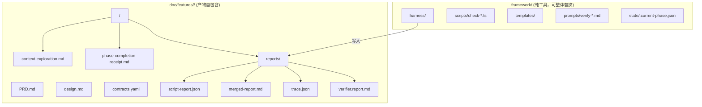

# Reports 目录解耦重构方案

## 问题诊断

当前 `framework/harness/reports/<feature>/<phase>/` 存放了大量 feature 维度的过程产物：

- `script-report.json` — harness 检查结果
- `merged-report.md` — 合并报告
- `ai-prompt.md` — 组装的 verifier prompt
- `summary.json` — 执行摘要
- `trace.json` — 交付凭证
- `verifier.report.md` — verifier 子代理输出
- 构建日志（`hvigor-app-build.log`, `hdc-app-install.log` 等）

这导致 **framework 无法被简单替换/升级** —— 删除 `framework/` 会连带丢失所有 feature 历史报告。这违反了 OpenSpec 的核心设计哲学：**工具与产物分离**。

## OpenSpec 的设计启示

OpenSpec 将关注点严格分为两层：

```
工具层（npm package）        产物层（项目内 openspec/ 目录）
├── src/                     ├── specs/          ← 源真相
├── schemas/                 └── changes/        ← 每个 change 自包含
└── bin/                         └── <name>/
                                     ├── proposal.md
                                     ├── design.md
                                     ├── tasks.md
                                     └── specs/   ← delta specs
```

关键原则：

- **工具可全量替换**（`npm update`），产物不受影响
- **每个 change 自包含**：所有相关产物住在一个目录
- **Archive 后整体移动**：不存在跨目录引用的脆弱链接

## 目标状态设计




### 目录映射（Before → After）

- `framework/harness/reports/<feature>/<phase>/script-report.json`
→ `doc/features/<feature>/<phase>/reports/script-report.json`
- `framework/harness/reports/<feature>/<phase>/trace.json`
→ `doc/features/<feature>/<phase>/reports/trace.json`
- `framework/harness/reports/<feature>/<phase>/verifier.report.md`
→ `doc/features/<feature>/<phase>/reports/verifier.report.md`
- `framework/harness/reports/_global/<phase>/...`
→ 保持不动或迁移到 `doc/.harness-reports/_global/<phase>/`（全局阶段不属于 feature，见下方讨论）

## 关键设计决策

### 1. 路径参数化（通过 `framework.config.json`）

新增 `paths.reports_dir_pattern` 字段：

```json
{
  "paths": {
    "reports_dir_pattern": "doc/features/<feature>/<phase>/reports"
  }
}
```

`config.ts` 中 `resolvePaths()` 的 `reportsDir` 从硬编码改为按模式解析，与现有 `receipt_dir_pattern` 对齐。

### 2. 全局阶段（`_global`）报告归属

`init` / `catalog` / `glossary` 三个全局阶段无 feature 维度。方案：

- 新增 `paths.global_reports_dir`，默认 `doc/.harness-reports/_global`
- 或直接保持在 `framework/harness/reports/_global/`（因为全局阶段本质是 framework 自检，跟着 framework 走合理）
- **推荐保持不动** —— 全局阶段确实是 framework 自身的体检报告，与 feature 无关

### 3. State 文件已解耦

`framework/harness/state/.current-phase.json` 已通过 `paths.state_file` 可配置，当前默认值仍在 framework 下。可视为后续独立 issue（因为 state 是临时运行态，不是历史产物；且已可配置）。

### 4. 向后兼容策略

- `config.ts` 中保留 `reportsDir` resolve 逻辑，但改为从 `paths.reports_dir_pattern` 推导
- 老配置（无该字段）回退到当前行为：`framework/harness/reports/<feature>/<phase>`
- MIGRATION.md 增加迁移说明

## 需要修改的文件清单

核心改动（framework 侧 ~8 个文件）：

- [framework/harness/config.ts](framework/harness/config.ts) — 新增 `reports_dir_pattern`，修改 `resolvePaths()` / 新增 `featureReportsDir()` 函数
- [framework/harness/harness-runner.ts](framework/harness/harness-runner.ts) — 报告写入路径改用新 resolver
- [framework/harness/scripts/utils/report-generator.ts](framework/harness/scripts/utils/report-generator.ts) — `ensureReportDir` 改用新路径
- [framework/harness/scripts/check-receipt.ts](framework/harness/scripts/check-receipt.ts) — trace.json 路径判定
- [framework/harness/scripts/check-ut.ts](framework/harness/scripts/check-ut.ts) — reports 扫描根
- [framework/templates/AGENTS.md.template](framework/templates/AGENTS.md.template) — 路径示例更新
- [framework/MIGRATION.md](framework/MIGRATION.md) — 迁移说明
- [framework/harness/templates/phase-completion-receipt.md](framework/harness/templates/phase-completion-receipt.md) — 模板中的路径引用

波及文档（需同步路径引用）：

- `framework/skills/*/SKILL.md` 中约 6-8 处硬编码路径
- `framework/agents/claude/templates/commands/*.md`
- `framework/docs/operations/harness-runbook.md`
- `.gitignore` 中的 reports ignore 规则

## 与 OpenSpec 规范的进一步对齐思考

OpenSpec 用 `openspec/changes/<name>/` 归拢 change 的全部产物，归档后整体搬到 `archive/`。我们的 `doc/features/<feature>/` 就是等价概念。重构后的结构将完全符合这一理念：

```
doc/features/<feature>/         ← 等价于 openspec/changes/<feature>/
├── PRD.md                      ← 等价于 proposal.md
├── design.md                   ← 等价于 design.md
├── contracts.yaml              ← 等价于 specs/ (delta specs)
├── prd/
│   ├── context-exploration.md
│   ├── phase-completion-receipt.md
│   └── reports/                ← NEW: harness 输出产物
├── coding/
│   ├── reports/
│   └── ...
└── testing/
    ├── reports/
    └── ...
```

## 风险与缓解

- **已有报告数据**：当前 `framework/harness/reports/home-page/` 已有数据（在 gitignore 中），需提供一次性迁移脚本
- **CI/CD 兼容**：如有外部系统读报告路径需同步更新
- **子代理（verifier）引用**：verifier 的 prompt 中有报告路径占位符，需同步更新

