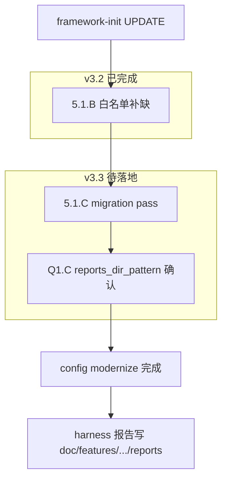

# Init config modernize + Reports 外置（合并计划）

> **合并来源**  
> - [init_config_未刷新根因_2ac2323e.plan.md](init_config_未刷新根因_2ac2323e.plan.md) — init 缺「迁移」档、project_type、Q1.C  
> - [reports_路径根因分析](reports_路径根因分析_5bcefdb6.plan.md) — legacy reports 根因与手动搬迁  
> - [init_config_差异根因分析_e0b0b4e1.plan.md](.cursor/plans/init_config_差异根因分析_e0b0b4e1.plan.md) — **v3.2 已落地**（5.1.B 等）

---

## 统一目标

> **config 漂移、弃用字段、feature 报告路径升级 — 永远通过 `/framework-init` UPDATE 解决**，不要求维护者手改 `framework.config.json`。

Legacy 磁盘上的旧报告：**init 不自动搬**；需要保留时按下文「Legacy 报告手动迁移」opt-in 处理。

---

## 问题全景（两条 symptom、一条根因）

| 现象 | 典型实例 | 直接原因 |
|------|----------|----------|
| 多次 init 后仍有 `project_type`、缺 `sub_variant` | WalletForHarmonyOS | init **无迁移 pass**，只补缺不改已有 key |
| harness 报告仍在 `framework/harness/reports/<feature>/<phase>/` | hwp-channel | 缺 `paths.reports_dir_pattern` → [`featurePhaseReportsDir()`](framework/harness/config.ts) legacy 回退 |
| init 体检 PASS 但字段仍缺 | 同上 | `reports_dir_pattern` 不在 BACKFILL；`check-init` 不报 |

**系统性根因**：init 只有两档 —— Step 3.5 AI 整文件 + §5.1.B **只补缺失 key** —— **没有第三档「迁移/modernize」**，也没有 reports 外置的 **init 内确认（Q1.C）**。



---

## v3.2 已完成（勿重复实施）

来源：[init_config_差异根因分析_e0b0b4e1.plan.md](.cursor/plans/init_config_差异根因分析_e0b0b4e1.plan.md)

| 项 | 状态 |
|----|------|
| §5.1.B：Q1=y / MISSING 后无条件 `merge-framework-config --apply` | done |
| 模板补 `state_file`、`receipt_dir_pattern` | done |
| hmos-app addendum 5.6.5 含 `toolchain.hvigor` | done |
| Skill 00 schema_version 1.1 对齐 | done |

**仍不够的原因**：5.1.B **不删** `project_type`、**不写** `reports_dir_pattern`（后者被标为严禁 silent 补缺）。

---

## v3.3 框架改造（待实施）

### 1. 迁移规则层 — `MIGRATION_RULES`

**文件**：[`framework/harness/scripts/utils/config-field-merger.ts`](framework/harness/scripts/utils/config-field-merger.ts)

与 `BACKFILL_FIELDS` 并列 SSOT：

| 规则 ID | 触发 | 动作 | 安全级别 |
|---------|------|------|----------|
| `project_type_to_sub_variant` | 存在顶层 `project_type` | 按 [`normalizeProjectProfile`](framework/harness/config.ts) 写 `project_profile.sub_variant`，**删** `project_type` | 安全（runtime 已等价） |
| `default_sub_variant_app` | 有 `project_profile.name`、无 `sub_variant`、无 legacy `project_type` | 补 `sub_variant: "app"` | 安全 |
| `atomic_service_legacy` | `project_type=atomic_service` 且无显式 sub_variant | `sub_variant: element-service`，删 `project_type` | 安全 |

**API**：`detectPendingMigrations(raw)`、`applyMigrations(raw)` → `{ merged, report }`

**文件**：[`merge-framework-config.ts`](framework/harness/scripts/merge-framework-config.ts) / `.mjs`

- `--apply`：**backfill → migrations**（stdout 分项）
- `--dry-run`：列出 missing backfill + pending migrations

### 2. `reports_dir_pattern`：init 内 Q1.C，**不进 silent BACKFILL**

与 [MIGRATION.md](framework/MIGRATION.md) 一致：silent 自动补会「搬家」报告目录，属行为级变更。

**Skill 00 §0.3.4 新增 `Q1.C`**（仅当缺 `paths.reports_dir_pattern`）：

> 是否启用 feature-phase 报告外置（`paths.reports_dir_pattern = doc/features/<feature>/<phase>/reports`）？  
> **默认推荐 y** / n 保持 legacy `framework/harness/reports/<feature>/<phase>/`

- 用户 **y** → migration/Q1.C 脚本写入字段（**非手改 JSON**）
- 用户 **n** → Step 7 明确「仍用 legacy」，不隐藏

**同时**：

- [`config.ts`](framework/harness/config.ts) `DEFAULT_PATHS.reports_dir_pattern` 作 SSOT 默认值
- [`framework.config.template.json`](framework/templates/framework.config.template.json) 写入该字段（减少 Q1=y 时 AI 漏写）
- Skill 00 **删除**「`paths.reports_dir_pattern` 严禁补缺」

### 3. Skill 00 流程补丁

**文件**：[`framework/skills/00-framework-init/SKILL.md`](framework/skills/00-framework-init/SKILL.md)

| 改动 | 内容 |
|------|------|
| **Step 2** | 停止向新 config 写入顶层 `project_type`；确认 `project_profile.sub_variant` |
| **§5.1.C（v3.3）** | 5.1.B 之后 BLOCKER 跑 `merge --apply`（含 migration）；AI 若又写回 `project_type`，migration 会删 |
| **§0.3.4 Q1.C** | reports 外置确认（上节） |
| **Step 7** | 汇报**已执行** migration + Q1.C 结果；**禁止**「请维护者手工改 config」 |

### 4. check-init + 文档

- [`check-init.ts`](framework/harness/scripts/check-init.ts)：`inspect01` 增加 `migration_keys`
- [`MIGRATION.md`](framework/MIGRATION.md)：§ v3.3 — init UPDATE 自动处理 `project_type` / `sub_variant` / `reports_dir_pattern`（经 Q1.C）
- Step 7 + RELEASE-NOTES 同步

### 5. 单测

- migration 规则 + Q1.C 写入路径
- init fixture `update_diff_detected`：INPUT 含 `project_type`、缺 `sub_variant` → `--apply` golden
- `cd framework/harness && npm test`

---

## Reports legacy 根因（技术 SSOT，不变）

[`featurePhaseReportsDir()`](framework/harness/config.ts)：

- 有 `reports_dir_pattern` → `doc/features/<feature>/<phase>/reports/`
- 无 → `framework/harness/reports/<feature>/<phase>/`
- `_global` → 永远在 `framework/harness/reports/_global/`（init 不改）

WalletForHarmonyOS 曾缺该字段 → `hwp-channel/prd|design|coding` 出现在 legacy — **init 契约不完整**，非 harness bug。

---

## Legacy 报告手动迁移（init + Q1.C=y 之后、opt-in）

> init **只 modernize config，不搬文件**。不迁也不影响新 harness。

### 路径对照

| Legacy | 新路径 |
|--------|--------|
| `framework/harness/reports/<feature>/<phase>/*` | `doc/features/<feature>/<phase>/reports/*` |

**不要搬**：`framework/harness/reports/_global/**`、`.gitkeep`

**回执**：若 `phase-completion-receipt.md` 的 `trace_json.path` 仍指 legacy，迁移后需改路径或重跑闭环。

### 整仓搬迁（PowerShell，工程根）

SSOT：[MIGRATION.md](framework/MIGRATION.md) §「一次性搬迁（PowerShell）」— 跳过 `_global`；同名目标 `skip` 不覆盖；搬空删空目录。

### 单 feature（hwp-channel）

```powershell
$feature = "hwp-channel"
$legacyRoot = "framework/harness/reports/$feature"
foreach ($phaseDir in Get-ChildItem -LiteralPath $legacyRoot -Directory -ErrorAction SilentlyContinue) {
  $phase = $phaseDir.Name
  $dest = "doc/features/$feature/$phase/reports"
  New-Item -ItemType Directory -Force -Path $dest | Out-Null
  Get-ChildItem -LiteralPath $phaseDir.FullName -Force | ForEach-Object {
    $target = Join-Path $dest $_.Name
    if (Test-Path $target) { Write-Host "skip: $target" }
    else { Move-Item $_.FullName $target }
  }
}
```

### 验证

1. 文件在 `doc/features/hwp-channel/coding/reports/summary.json` 等
2. 重跑 harness → 新产出只进 `doc/features/.../reports/`
3. 回执路径与新位置一致

---

## 实例操作路径（WalletForHarmonyOS）

**不手改** `framework.config.json`：

1. 升级 `framework/` submodule（含 v3.3）
2. `/framework-init` UPDATE — `Q1.C` 选 **y**（推荐）
3. 自动得到：无 `project_type`、`sub_variant: app`、`paths.reports_dir_pattern`、白名单完整
4. 重跑 `harness-runner --feature hwp-channel --phase coding --summary`
5. （可选）按上节搬迁 legacy 报告

---

## 验收标准

1. fixture config 含 `project_type`、缺 `sub_variant` → `merge --apply` 后 modernize
2. 缺 `reports_dir_pattern` + Q1.C=y → 字段写入默认值
3. Q1.C=n → 仍 legacy，Step 7 明示
4. `npm test` PASS
5. WalletForHarmonyOS init 后新 harness 报告不在 `framework/harness/reports/hwp-channel/` 增长
6. `_global` 路径不变

---

## 合并决策记录

| 议题 | reports 原计划 | init_config 未刷新 | **合并结论** |
|------|----------------|-------------------|--------------|
| `reports_dir_pattern` | silent BACKFILL | Q1.C 默认 y | **Q1.C + DEFAULT_PATHS/模板**；不进 BACKFILL |
| `project_type` | 未覆盖 | MIGRATION_RULES | **纳入 migration pass** |
| legacy 文件 | config_only | — | **保留 opt-in 搬迁专节** |
| v3.2 5.1.B | 依赖 | 已完成 | **标记 completed，不重复** |

---

##  superseded 计划

执行本 plan 后，以下计划视为归档/ superseded：

- `init_config_未刷新根因_2ac2323e.plan.md`（已并入本文）
- 独立 `reports_路径根因分析` 待办（已并入本文 v3.3 + 迁移专节）
