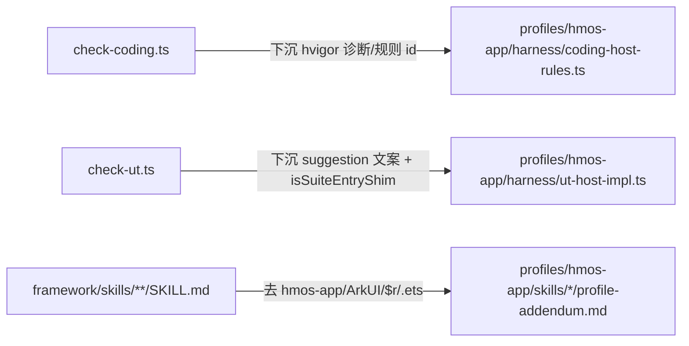

# 根 harness 与根 SKILL 最后一轮宿主收口

## 背景

经过对 4 份 plan 的核对，**真正还应该做** 的剩余工作集中在两点：

1. 根 harness 仍内嵌宿主诊断（check-coding 的 hvigor 失败分类、check-ut 的 hardcoded `framework/profiles/hmos-app/...` 路径与 Hypium 入口判定）
2. 根 `framework/skills/**/SKILL.md` 仍带较多 hmos-app / ArkUI / `$r` / `.ets` 例子

被旧 plan 写进却已被 `profile-skill-asset:` 协议替代的「12 份跳板 stub」**不重做**；profile-addendum 中已有等价资产清单段落，只做 **标题统一**，不重写正文。

## 改动总图




---

## P0：根 harness 诊断下沉

### 1. `check-coding.ts` 的 hvigor 失败分类下沉到 profile

文件：[framework/harness/scripts/check-coding.ts](framework/harness/scripts/check-coding.ts)（L450~L666 共约 220 行）

- 把以下三个函数的**业务/宿主分类逻辑** 整体迁到 [framework/profiles/hmos-app/harness/coding-host-rules.ts](framework/profiles/hmos-app/harness/coding-host-rules.ts)（或新增 `coding-host-impl.ts`，与 `ut-host-impl.ts` 对称）：
  - `checkCodingHvigorBuild`（L450~L575）
  - `classifyCodingHvigorBuildFailure`（L585~L649）
  - `formatDependencyIssue`（L651~L666）
- 根脚本只保留：
  - 调度入口 `codingHost.checkCodingCompile(ctx)` → 直接返回 `CheckResult[]`
  - SKIP 短路（`isCapabilitySkipped(ctx.resolvedProfile, 'coding.compile')`）
- 规则 id 改为：
  - 主 id：`CANONICAL_CODING_COMPILE_ID`（`coding_compile`）
  - 兼容别名：保留 `LEGACY_CODING_COMPILE_ID`（`coding_hvigor_build`）以不破坏历史报告
- 同步：[framework/specs/phase-rules/coding-rules.yaml](framework/specs/phase-rules/coding-rules.yaml) 内 `coding_hvigor_build` 描述若仍带 hvigor 字眼，改为「`coding_compile`：宿主编译闭环（hvigor 等具体工具链由 profile 决定）」。
- `**failure_kind` / `blocking_class` 同步重命名（本轮做）**：
  - `hvigor_timeout` → `compile_timeout`
  - `hvigor_incomplete_output` → `compile_incomplete_output`
  - `toolchain` / `env_skip` / `project_dependency_missing` / `project_build` 已中性，**保持不动**。
  - 风险评估：[framework/harness/schemas/summary.schema.json](framework/harness/schemas/summary.schema.json) L94 `blocking_class` 类型为 `{ "type": "string" }`（无 `enum`）；[framework/harness/scripts/utils/types.ts](framework/harness/scripts/utils/types.ts) L311/L313 同样只声明 `string`；全仓 grep 旧值仅 6 处全部位于 [check-coding.ts](framework/harness/scripts/check-coding.ts) 待迁函数内（L567/L568/L580/L581/L606/L620）；无 fixture / snapshot 锁字面 → **无下游断裂风险，不留兼容别名**。
- `**generic` profile fallback**：当 `tryLoadProfileCodingHost(profileDir)` 返回 null（如 `generic` 未提供 coding-host），check-coding 必须给出对称的 `coding_host_missing` BLOCKER 结果（参照现有 `ut_profile_host_missing` 形态），suggestion 给出「请实现 profile 的 harness/coding-host-rules.ts；hmos-app 可参考 framework/profiles/hmos-app/harness/coding-host-rules.ts」；不允许根脚本自带宿主默认实现。

### 2. `check-ut.ts` 中 hardcoded `framework/profiles/hmos-app/...` 文案下沉

文件：[framework/harness/scripts/check-ut.ts](framework/harness/scripts/check-ut.ts) 命中 6 行（916 / 1016 / 2041 / 2313 / 2466 / 2818）

- 改为通过 `utHost.getSuggestionPaths()` 暴露：
  - `useCasesSchemaTemplateRel`
  - `mockPlanSchemaTemplateRel`
  - `testabilityAuditTemplateRel`
  - `branchExampleTestRel`
  - `utHostImplRefRel`
- 根脚本里调用 `utHost.getSuggestionPaths().useCasesSchemaTemplateRel` 拼 suggestion；当 `utHost` 为 null（profile 未提供时）输出 `<project_profile addendum>` 占位提示，不再写死路径。
- L2818 的「请为宿主 profile 实现并导出 harness/ut-host-impl.ts；参考 framework/profiles/hmos-app/harness/ut-host-impl.ts」是 host 缺失分支，可保留**示例性**指向作为补救信息；其余 5 处必须下沉。

### 3. `check-ut.ts` 中 `isHypiumSuiteEntryShim` 去重

- 函数体（L763~L766）已与 `profiles/hmos-app/harness/ut-host-impl.ts` 中等价逻辑重复。改为 `utHost.isSuiteEntryShim(content)`，根文件删除该函数；调用点 5 处（L1423 / 1552 / 1610 / 1964 / 1974）替换为 `utHost.isSuiteEntryShim`。

---

## P1：根 SKILL.md 彻底去宿主名

策略：所有「hmos-app / ArkUI / `$r` / `.ets` / NavDestination / `@Entry` / `@Prop` / `main_pages.json` / `string.json`」例子，**正文只用** `<project_profile>` / `profile addendum 见 ...`；同等内容补到对应 `framework/profiles/hmos-app/skills/<skill>/profile-addendum.md`。

涉及文件与行：

- [framework/skills/00-framework-init/SKILL.md](framework/skills/00-framework-init/SKILL.md)
  - L289（`oh-package.json5 + build-profile.json5 → 推荐 hmos-app`）
  - L453（`缺失时视同 hmos-app`）
  - L771（`宿主工具链探测脚本（hmos-app 选用）`）
- [framework/skills/2-requirement-design/SKILL.md](framework/skills/2-requirement-design/SKILL.md)
  - L22（`未声明时运行时默认 hmos-app` —— 改为「按 [framework/harness/config.ts](framework/harness/config.ts) 中加载时的兼容默认」，不再点名）
  - L319（`ArkUI 的 @Prop / @Link / @ObjectLink`）
  - L326（`hmos-app：常见为 Navigation + NavDestination`）
- [framework/skills/3-coding/SKILL.md](framework/skills/3-coding/SKILL.md)
  - L22 / L128 / L214 / L258 / L272 / L398 / L456~L457 / L509 共 8 处
- [framework/skills/5-business-ut/SKILL.md](framework/skills/5-business-ut/SKILL.md)
  - L22 / L358（`*.test.ets` 例子）

替换样板：

```text
（旧）按宿主壳层与 Feature 页的分工实现（hmos-app：常见为壳入口 @Entry + Feature 侧路由页面；见 profile addendum）
（新）按宿主壳层与 Feature 页的分工实现（具体注解 / 入口 / 资源机制由 <project_profile> profile addendum 规定）
```

补到 addendum 的最小集合：上述被删的「hmos-app: …」例子全部以「示例（仅在 hmos-app 下）」段落保留在对应 `framework/profiles/hmos-app/skills/<skill>/profile-addendum.md` 末尾，**避免信息净损失**。

---

## P2：可选打磨

### 4. profile-addendum 章节标题统一

7 个 `framework/profiles/hmos-app/skills/<skill>/profile-addendum.md` 中：

- `3-coding` 用「权威资产路径（已迁入本 profile）」+「skill-assets.yaml 键」
- 其余用「权威模板与规则」+「skill-assets.yaml 键」

统一改为：**「权威资产清单」+「skill-assets.yaml 键」** 两段固定标题，便于 Plan 4 第 8 项的字面一致性检索。

### 5. 模板瘦身（仅调整一处）

[framework/profiles/hmos-app/skills/0-catalog-bootstrap/templates/module-card-template.yaml](framework/profiles/hmos-app/skills/0-catalog-bootstrap/templates/module-card-template.yaml) 当前 66 行，仅在 `easily_confused_with` 与 `key_exports` 处保留 1~2 行最小示例注释，其它说明并入 [framework/profiles/hmos-app/skills/0-catalog-bootstrap/profile-addendum.md](framework/profiles/hmos-app/skills/0-catalog-bootstrap/profile-addendum.md)。

---

## P3：工程保险（合并自旧 plan `root_checker_neutral_copy`）

### 6. `failure_kind` 新中性枚举集合的单测断言

- 重命名后稳定集合：`{ toolchain, env_skip, compile_timeout, compile_incomplete_output, project_dependency_missing, project_build }`。
- 新增 [framework/harness/tests/unit/coding-failure-kinds.unit.test.ts](framework/harness/tests/unit/coding-failure-kinds.unit.test.ts)：
  - 用 fixture 模拟 `toolMissing=true` / `skippedByEnv=true` / `timedOut=true` / `successMarkerFound=false` / `errors.length>0` / 依赖缺失 6 条路径；
  - 断言每条路径返回的 `failure_kind` 与 `blocking_class` ⊆ 上述新枚举集合；
  - 断言 **不再** 出现 `hvigor_timeout` / `hvigor_incomplete_output` 旧字面（防止后续 PR 误回退）。

### 7. `generic` profile 的 coding-host fallback

- 在 [framework/harness/scripts/check-coding.ts](framework/harness/scripts/check-coding.ts) 入口处做 host 探测：
  - 若 `tryLoadProfileCodingHost(ctx.resolvedProfile.profileDir)` 返回 null → 输出 `coding_host_missing` BLOCKER（与 [framework/harness/scripts/check-ut.ts](framework/harness/scripts/check-ut.ts) 的 `ut_profile_host_missing` 对称）。
  - **不允许** 根脚本自带 fallback 宿主实现；`generic` 工程若需要跑 coding 阶段，必须自行声明 host。
- 单测：在 `profile-routing` 套件追加用例 `tryLoadProfileCodingHost: generic 默认无 host → null` 与 `check-coding (generic) → coding_host_missing BLOCKER`。

### 8. `rg` 零专名回归断言（防回退闸门）

- 新增 [framework/harness/tests/unit/root-zero-host-name.unit.test.ts](framework/harness/tests/unit/root-zero-host-name.unit.test.ts)：
  - 扫描 `framework/harness/scripts/check-coding.ts`、`framework/harness/scripts/check-ut.ts`、`framework/skills/**/SKILL.md`；
  - 对宿主专名集合 `[hmos-app, ArkUI, hvigor, DevEco, ohpm, Hypium, .ets, $r, NavDestination, @Entry, @Prop, main_pages.json, build-profile.json5, oh-package.json5]` 做正则扫描；
  - **白名单**：
    - `LEGACY_CODING_COMPILE_ID` / `LEGACY_UT_COMPILE_ID` / `LEGACY_UT_RUN_ID` 等兼容别名定义行；
    - `coding_host_missing` / `ut_profile_host_missing` 分支里指向 `framework/profiles/hmos-app/harness/...` 的示例性补救信息；
    - 文件头注释中明确标注的「迁移说明」段落；
  - 命中非白名单匹配则单测 FAIL，prompt 维护者要么把字面下沉到 profile，要么把行号显式加入白名单（PR review checklist 项）。
- 在 [framework/harness/tests/run-unit.ts](framework/harness/tests/run-unit.ts) 的 `CORE_SUITES` 里登记本套件。

---

## 回归

完成后顺序执行：

1. `cd framework/harness && npx ts-node tests/run-unit.ts` —— 期望全绿，新增 / 修改的 host suite + `coding-failure-kinds` + `root-zero-host-name` 全部并入。
2. `npx ts-node harness-runner.ts --phase docs` —— 验证 `profile_skill_assets_resolvable` / `source_paths_resolvable` 仍 PASS。
3. `npx ts-node harness-runner.ts --phase catalog` / `glossary` / `init` —— 期望 PASS。
4. 选一个已有 feature，跑 `--phase coding --feature <name>` 与 `--phase ut --feature <name>`，确认：
  - ai-prompt.md 规则名出现 `coding_compile`（兼容别名 `coding_hvigor_build` 仍允许出现于历史报告兼容路径）；
  - suggestion 中不再有 `framework/profiles/hmos-app/...` 字面（host 缺失分支除外）；
  - `failure_kind` / `blocking_class` 全部为新中性枚举（`compile_timeout` / `compile_incomplete_output` 等），**不再含 `hvigor_`* 字面**。

---

## 不在本 plan 范围

- 12 份跳板 stub —— 已被 `profile-skill-asset:` 协议合理替代，不补写。
- `summary.schema.json $id` —— 已中性化。
- `check-testing.ts HarmonyOS 默认值` —— 已移除。
- 编辑 `.cursor/plans/*.plan.md` 历史文件正文。
- profile overlay 引入独立 `harness_user_messages` 子对象（旧 plan 1-A 路径）—— 不做。理由：旧 1-A 的目的是「让根脚本只通过 key 拿文案、不留专名」；本 plan 的「函数体整体迁移到 `coding-host-rules.ts`」**已让根脚本零专名（连诊断分支都不留）**，1-A 沦为冗余设计，再叠一层 YAML 消息合并器只增脏不增净。若未来 profile 数量增长到「每个 profile 重写函数体不划算」，再把公共 fallback 抽到 SSOT 也不晚。

