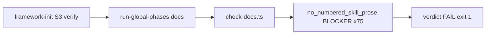
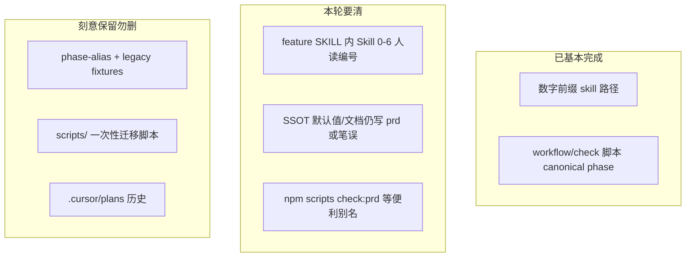

# Skill/Phase 改名残留清扫

## 版本绑定

`version: 2.3.0`（= 根 [`package.json`](package.json)，patch；不擅自 bump）。

## Plan 拆分（Codex 终审 — 结构性必修）

[`check-plan-version.mjs`](scripts/check-plan-version.mjs) L91：`--release` 模式下 **`version === 当前` 且 todo 未完成 → 禁止发版**。

若 P0/P1 共用一个 plan、绑 `2.3.0` 且含 10 个 pending todo，则 **P0 第 4 步「打包发布」会被本 plan 自挡**——与「P1 不挡 init」设计矛盾。

**修法（已执行）**：

| Plan | version | deferred_to | 范围 |
| --- | --- | --- | --- |
| **本文件**（P0 hotfix） | `2.3.0` | — | 仅 wave0 四 todo；发版前须全 completed |
| [`skill-phase_改名残留清扫_p1_收口.plan.md`](skill-phase_改名残留清扫_p1_收口.plan.md) | `2.4.0` | `2.4.0` | inventory / SSOT / prompt / allowlist；**不挡 2.3.0 发版** |

§0-pre 须同时处理：**所有**在研 plan 门禁（含 chrys_adapter + 本 plan 拆分），非仅「无关 plan」。

## 触发场景（消费者 init 失败，Codex + Claude 共识）

**现象**：宿主 `/framework-init` S3 中 materialize / config / adapter 均成功，**verify** 在 `run-global-phases` → **docs phase** 以 `exit 1` 失败。

**根因链**（已核实）：




- 扫描目标：`framework/skills/feature/*/SKILL.md`（**consumer layout**，`scanNoNumberedSkillProse(consumer)`）
- 命中模式：`Skill [0-6]` 人读编号（`[no-numbered-skill-scan.ts](harness/scripts/utils/no-numbered-skill-scan.ts)` L74）
- 同次报告中的 `doc_freshness`（9 份 MAJOR）**不卡 init**——`[resolveVerdictFromChecks](harness/scripts/utils/report-generator.ts)` 仅 BLOCKER 导致 FAIL

**为何 release 没拦住**：`no_numbered_skill_prose` 只在 `check:docs` 跑；默认 `npm test`（standalone 单测）与 `[release:verify](scripts/verify-release-pack.mjs)` **均未接入** prose/path scan，故坏 zip 已发布到宿主。

**禁止绕道**（Claude）：不得通过跳过 docs phase、关闭 `check-docs`、或改 init planner 绕过 verify——门禁是「防假 PASS」设计，应修源而非关闸。

## 交付策略（两阶段）


| 阶段            | 目标                  | 范围                                                                | 宿主可 unblock           |
| ------------- | ------------------- | ----------------------------------------------------------------- | --------------------- |
| **P0 hotfix**（本 plan） | 让消费者 init verify 通过 | 六份 feature SKILL 去编号 + MJS release 硬门禁 | **是**（更新 framework 后） |
| **P1 收口**（顺延 plan） | 无残留尾巴 + 防回归 | 见 [`skill-phase_改名残留清扫_p1_收口.plan.md`](skill-phase_改名残留清扫_p1_收口.plan.md) | 不阻塞 init / 不挡 2.3.0 发版 |


## 审计结论（已核实，非猜测）

两轮改名**路径/目录级**在发布内容里已基本收敛：


| 维度                                                            | 状态          | 依据                                                                                                                                                                                                                       |
| ------------------------------------------------------------- | ----------- | ------------------------------------------------------------------------------------------------------------------------------------------------------------------------------------------------------------------------ |
| 数字前缀 skill **路径**（`skills/3-coding`、`skills-bridge/1-spec` 等） | 发布树内**无残留** | `[skills/](skills/)` 目录已为扁平 id；`[no-numbered-skill-scan.ts](harness/scripts/utils/no-numbered-skill-scan.ts)` + `[check-docs.ts](harness/scripts/check-docs.ts)` 在 `check:docs` 阶段 BLOCKER                               |
| prd/design **phase id** 机械改名                                  | **已完成**     | 已完成 plan `[rename-and-enrich-spec-plan-phases_b8e21149](.cursor/plans/rename-and-enrich-spec-plan-phases_b8e21149.plan.md)`；workflow `[spec-driven.workflow.yaml](workflows/spec-driven.workflow.yaml)` 已为 `spec`/`plan` |
| **兼容层**（prd/design alias、dual-read 旧路径）                       | **有意保留**    | `[phase-alias.ts](harness/scripts/utils/phase-alias.ts)`、`[config.ts](harness/config.ts)` `PHASE_SCOPED_ARTIFACTS`、MIGRATION §v2.3                                                                                       |


**仍存在的「尾巴」分三类：**




### A. 明确错误 / SSOT 尾巴（Wave 1 必修）

**审查遗漏（Codex 1+2，已核实）— 优先级高于 §A 原 5 项：**


| 位置                                                                                                | 问题                                                                                              | 严重度        |
| ------------------------------------------------------------------------------------------------- | ----------------------------------------------------------------------------------------------- | ---------- |
| `[harness/schemas/summary.schema.json](harness/schemas/summary.schema.json)` L30                  | `phase` enum 仍为 `prd`/`design`；`harness-runner` 已 normalize 为 `spec`/`plan` → **schema 会拒合法输出** | **实质 bug** |
| `[skills/reference/confirmation-registry.yaml](skills/reference/confirmation-registry.yaml)` L464 | 用户可见速查仍写 `prd → plan 技术设计`、`design → coding`                                                    | P1         |
| `[specs/feature-compat.schema.yaml](specs/feature-compat.schema.yaml)` L15                        | `phases` 默认仍 `prd, design, coding, …`                                                           | P1         |
| `[skills/project/code-graph/SKILL.md](skills/project/code-graph/SKILL.md)` L33/139                | `PRD/plan/coding` 混写，应为 `spec/plan/coding`                                                      | P2         |


**原 §A 清单（仍做）：**


| 位置                                                                             | 问题                                         |
| ------------------------------------------------------------------------------ | ------------------------------------------ |
| `[skills/project/goal-mode/SKILL.md](skills/project/goal-mode/SKILL.md)`       | 默认仍写 `prd→testing`，应为 `spec→testing`       |
| `[docs/concepts/phase-terminology.md](docs/concepts/phase-terminology.md)` L7  | 表格首行笔误 `spec|spec`，应为 `prd|spec`（legacy 列） |
| `[harness/trace/gap-notes.template.md](harness/trace/gap-notes.template.md)`   | phase 列仍 `prd / design / …`                |
| `[docs/concepts/extensibility.md](docs/concepts/extensibility.md)`             | 仍写 `skills/00..6`                          |
| `[docs/evolution/compat-protocol-v1.md](docs/evolution/compat-protocol-v1.md)` | 示例命令仍 `--phases prd`（改 `spec` 或标 legacy）   |


**审查遗漏（Claude / 独立扫描，顺手改）：**


| 位置                                                                                 | 问题                                                     |
| ---------------------------------------------------------------------------------- | ------------------------------------------------------ |
| `[harness/tests/README.md](harness/tests/README.md)` L137                          | `Skill 5 阶段` → `ut` / `business-ut`                    |
| `[.gitignore](.gitignore)` L24                                                     | 注释 `# Skill 6 / Hylyre` → `testing` / `device-testing` |
| `[harness/trace/trace.schema.json](harness/trace/trace.schema.json)` L245          | 示例 `'design 阶段'` → `plan 阶段`                           |
| `[harness/scripts/check-spec.ts](harness/scripts/check-spec.ts)` / `check-plan.ts` | 内部变量/参数名仍 `prd`（~64 处，**行为无影响**）→ allowlist 或顺手重命名     |


### B. 大尾巴：「Skill N」人读编号文案（**P0 hotfix，卡死消费者 init**）

`[skills/feature/*/SKILL.md](skills/feature/)` 六份正文合计约 **92** 处 `Skill [0-6]`（开发仓 rg 计数）；宿主 consumer layout 实测 **75 BLOCKER**（每条命中一条 check，口径不同，**清零目标一致**）。  
`[no-numbered-skill-prose](harness/scripts/check-no-numbered-skill-prose.ts)` 门禁**已存在**且**已在消费者 init 关键路径上生效**：

- 消费者：`framework-init` S3 → `run-global-phases` → `check:docs` → **BLOCKER 即 init 失败**
- 开发仓：`npm run check:docs` 同样会 FAIL，但默认 `npm test` / `release:verify` **不跑**此检查 → 坏包可发布

**改写口径（Codex 必修：区分 `Skill 00` 与 `Skill 0`）**：


| 原文           | 语义                                       | 改为（示例）                           |
| ------------ | ---------------------------------------- | -------------------------------- |
| **Skill 00** | `framework-init`（Stop hook / adapter 下发） | `framework-init` /「初始化 Skill」    |
| **Skill 0**  | `catalog-bootstrap`                      | `catalog-bootstrap` / catalog 阶段 |
| Skill 3      | coding                                   | `coding` 阶段 / coding Skill       |
| Skill 4      | code-review                              | `code-review`                    |
| Skill 5      | business-ut                              | `ut` / `business-ut`             |
| Skill 6      | device-testing                           | `testing` / `device-testing`     |


**已核实**：六份 feature SKILL 均有「经 **Skill 00** 在实例根下发 Stop hook」段落（spec/coding/plan 等）；`plan/SKILL.md` L546 另有「**Skill 0** catalog-bootstrap」——二者**不可混写**。

**操作顺序**：先改 `Skill 00` → `framework-init`，再改 `Skill 0` → `catalog-bootstrap`，最后处理 3/4/5/6；**禁止** `replace_all`「Skill 0」以免把 `Skill 00` 误伤为 catalog。

**regex 对齐（P0 顺手，审查）**：`[no-numbered-skill-scan.ts](harness/scripts/utils/no-numbered-skill-scan.ts)` L74 现用 `/Skill\s*[0-6]/`，`Skill 00` 会被 `Skill 0` 前缀误匹配；改为显式分支 + 数字后 `(?!\d)`，例如 `/Skill\s*(?:00|0|[1-6])(?!\d)/`（范围写法 `Skill 3–6` 另保留）。MJS release scanner 用同一口径。

同文件内保持一种说法，避免混用「第 N 环」与目录名。

### C. harness prompt 中的 `design`（Claude 3+4，P1 Wave 1 — verifier 直接消费，不卡 init）

**已核实命中**（旧 phase 名 → 改 `plan`；普通名词保留）：


| 文件                                                                                                                              | 语境                                      |
| ------------------------------------------------------------------------------------------------------------------------------- | --------------------------------------- |
| `[harness/prompts/verify-plan.md](harness/prompts/verify-plan.md)` L171/181                                                     | 对照 `design` 中的 contracts → 应为 `plan.md` |
| `[harness/prompts/verify-coding.md](harness/prompts/verify-coding.md)` L167/188/357                                             | `design scope` / 对照 `design` → `plan`   |
| `[harness/prompts/verify-ut.md](harness/prompts/verify-ut.md)` L38                                                              | `spec/design 依据` → `spec/plan`          |
| `[profiles/hmos-app/harness/prompts/verify-coding.overlay.md](profiles/hmos-app/harness/prompts/verify-coding.overlay.md)` L5/6 | 与 `design` 组件树/路由章节一致 → `plan`          |


**判定规则**：`--phase design`、`design 阶段`、`design scope`、`design.md`（feature 产物语境）→ 改 `plan`；「UI design」「system design」等普通名词 → allowlist。

### D. 有意保留（本轮不删，写入 allowlist）


| 类别                            | 示例                                                                                                                                                         |
| ----------------------------- | ---------------------------------------------------------------------------------------------------------------------------------------------------------- |
| **兼容 alias 实现**               | `[phase-alias.ts](harness/scripts/utils/phase-alias.ts)`、`capability-alias.ts`、`context-exploration.ts` legacy key                                         |
| **npm script alias**          | `[harness/package.json](harness/package.json)` `check:prd` / `check:design`（**保留**；说明写 `[harness/README.md](harness/README.md)` 或 runbook，**勿**在 JSON 加注释） |
| **测试夹具**                      | `profiles/**/fixtures/**/prd`、`PRD.md`、单测断言中的 legacy phase                                                                                                 |
| **历史迁移脚本**                    | 根 `scripts/phase-rename-*.mjs`、`migrate-skill-*.mjs`（不进 zip）                                                                                               |
| **MIGRATION / RELEASE-NOTES** | 破坏性变更叙事中的 `prd`/`design`                                                                                                                                   |
| **报告生成物**                     | `harness/reports/`**（若存在）                                                                                                                                  |
| **OpenSpec 合法术语**             | `openspec/`** 中 `proposal/design/tasks` 三元组；`.codex/skills/openspec-`*、`.cursor/commands/opsx-*` 里的 `design.md`                                            |
| **历史 plan**                   | `.cursor/plans/` 正文                                                                                                                                        |
| **check 脚本内部标识**（可选）          | `check-spec.ts` 内 `prd` 变量名 — 若本轮不重命名则登记 allowlist                                                                                                         |


## 本轮要做

### 0-pre. P0 前置 — 外部门禁（Codex 终审）

`[verify-release-pack.mjs](scripts/verify-release-pack.mjs)` L190 会跑 `checkPlanVersions({ mode: 'release' })`。仓内无关在研 plan `[chrys_adapter_接入_91f6f0c8.plan.md](.cursor/plans/chrys_adapter_接入_91f6f0c8.plan.md)` **缺 `version`/`deferred_to`** → 即使本 plan 代码全对，`npm run release:verify` 也会假红。

**执行前**：

1. **本 plan 拆分**：P1 todo 已移至顺延 plan（见上表）；本文件 frontmatter **仅保留 P0 四 todo**
2. **chrys_adapter**（勿擅自改其正文 scope）：补 `version` / `deferred_to: 2.4.0`，或用户确认归档
3. 跑 `node scripts/check-plan-version.mjs --release` 确认 2.3.0 窗口无 open todo 挡发布

### 0. P0 hotfix — 先 unblock 消费者 init（Claude：Wave 2 提为 hotfix）

**0a. 清六份 feature SKILL 编号文案**（主工作量，必须先做）


| 文件                                                                                 | 约略命中 |
| ---------------------------------------------------------------------------------- | ---- |
| `[skills/feature/business-ut/SKILL.md](skills/feature/business-ut/SKILL.md)`       | 32   |
| `[skills/feature/code-review/SKILL.md](skills/feature/code-review/SKILL.md)`       | 16   |
| `[skills/feature/coding/SKILL.md](skills/feature/coding/SKILL.md)`                 | 15   |
| `[skills/feature/device-testing/SKILL.md](skills/feature/device-testing/SKILL.md)` | 11   |
| `[skills/feature/plan/SKILL.md](skills/feature/plan/SKILL.md)`                     | 10   |
| `[skills/feature/spec/SKILL.md](skills/feature/spec/SKILL.md)`                     | 8    |


按 §B 映射表人工校对：**先 00、后 0、再 3–6**（禁止 blind `replace_all`）。

**0b. hotfix 仓内验收**（模拟消费者，非仅 standalone）：

```bash
cd harness && npm run check:docs          # no_numbered_skill_prose 须 PASS（P0 主验收）
cd harness && npm test                    # standalone 回归，不破坏日常 loop
```

**consumer 完整烟测**（P0 **推荐**、非 `release:verify` 硬依赖 — Option B）：

```bash
cd harness && HARNESS_LAYOUT_SMOKE=1 npm test   # bash；勿写成 HARNESS_LAYOUT_SMOKE=1 cd harness && npm test
npm run release:smoke-consumer                  # 整包 check:global
```

**0c. 硬化 release 门禁**（与 hotfix 同批）

[`verify-release-pack.mjs`](scripts/verify-release-pack.mjs) 为 ESM `.mjs`，**不能**直接 `import` harness TS。新增纯 MJS [`check-no-numbered-skill-release.mjs`](scripts/check-no-numbered-skill-release.mjs)（仿 [`check-stale-init-refs.mjs`](scripts/check-stale-init-refs.mjs)）：

- 扫 staging / 解压后 `framework/` 的 numbered path + prose
- **prose 必须用 §B regex**：`/Skill\s*(?:00|0|[1-6])(?!\d)/`（**禁止**实施时写回 `Skill\s*[0-6]`）
- 同步 [`no-numbered-skill-scan.ts`](harness/scripts/utils/no-numbered-skill-scan.ts) + [`no-numbered-skill-scan.unit.test.ts`](harness/tests/unit/no-numbered-skill-scan.unit.test.ts)
- `release:verify` **硬门禁仅此 MJS scan**；不依赖 `npm install`、不跑 `doc_freshness`
- consumer e2e 走 `release:smoke-consumer` / 手工烟测（见上），**不**纳入 `release:verify` 失败条件

**0d. 宿主侧**（hotfix 发布后）：

1. 更新 submodule / 重 vendor `framework-2.3.0.zip`
2. 重跑 `/framework-init`（UPDATE）→ verify / `run-global-phases` docs 须 PASS

### P1 范围（已拆至顺延 plan）

inventory、SSOT、prompt、allowlist、扩展门禁等 **P1 全文**见 [`skill-phase_改名残留清扫_p1_收口.plan.md`](skill-phase_改名残留清扫_p1_收口.plan.md)（`version` + `deferred_to`: `2.4.0`）。下文 §1–§5 保留作交叉引用，**实施以 P1 plan 为准**。

### 1. P1 — 生成可机器复用的审计清单（加宽口径）

在 `[scripts/](scripts/)` 新增轻量 inventory（可扩展 `[phase-rename-inventory.json](scripts/phase-rename-inventory.json)` 思路），输出 JSON + 人类可读摘要：

1. **numbered-path hits** — 复用 `scanNoNumberedSkillPaths(dev)`，预期 0
2. **numbered-prose hits** — 复用 `scanNoNumberedSkillProse(dev)`，列出 file:line
3. **canonical-phase prose hits** — **加宽正则**（审查 §3 建议）：
  - `\bprd\b`（大小写不敏感）
  - design 语境：`--phase design`、`design stage`、`design scope`、`design 阶段`、`design.md`（feature 产物）
  - 窄路径模式仍保留：`skills/feature/prd-design`、`1-prd` 等
4. **allowlist 过滤** — 每条命中标注 `category`（alias / fixture / migration / MIGRATION / openspec / report / intentional）；**验收看「非 allowlist 命中数」**

**扫描根**：发布内容 + `docs/` + `harness/`（含 `harness/tests/README.md`）+ 根 `.gitignore`；**排除** `harness/reports/`**、`.cursor/`**、根 `scripts/migrate-*`（仅登记不 BLOCKER）。

**勿误杀**：OpenSpec `design.md` 三元组、`.codex/skills/openspec-*` 整目录。

验收：inventory 可 `node scripts/...` 一键跑；`--fail-on-non-allowlisted` 用于 CI。

### 2. P1 Wave 1 — SSOT / schema / prompt（小 diff，含实质 bug；不阻塞 init）

**必修（审查 §2 第 1 项）**：

- `[summary.schema.json](harness/schemas/summary.schema.json)`：`phase` enum 改为 `spec`/`plan`/…（保留 `prd`/`design` 为 legacy enum 值**或**仅 canonical — 与 runner 输出对齐，须加单测断言合法 summary 可通过）
- `[confirmation-registry.yaml](skills/reference/confirmation-registry.yaml)` L464：速查文案 `spec → plan`、`plan → coding`
- `[feature-compat.schema.yaml](specs/feature-compat.schema.yaml)` L15：**仅文档过时**（`[compat-loader.ts](harness/compat-loader.ts)` 已 `normalizePhaseId`，允许 `spec/plan` + alias `prd/design`）→ P1 改 schema 描述/缺省示例即可，**非逻辑 bug**
- `[code-graph/SKILL.md](skills/project/code-graph/SKILL.md)`：`spec/plan/coding`

**原 §A + prompt 语义审查（§C）**：

- 修 goal-mode、phase-terminology、gap-notes、extensibility、compat-protocol
- 改 `harness/prompts/`** 与 `profiles/**/harness/prompts/`** 中旧 phase `design` → `plan`
- `[harness/package.json](harness/package.json)`：确认 `check:spec`/`check:plan` 已存在；**legacy 说明写入 `[harness/README.md](harness/README.md)`**（JSON 不支持注释）
- 同步 `[verifier.md](agents/claude/templates/agents/verifier.md)`、`[harness-runner.ts](harness/harness-runner.ts)` 示例 phase 用 `spec`

### 3. P1 — 剩余 prose 与 profile 连带

六份 feature SKILL 已在 §0 完成；本节处理**不卡 init** 但应顺手清的项：

- `[harness/tests/README.md](harness/tests/README.md)`、`[.gitignore](.gitignore)`、`[trace.schema.json](harness/trace/trace.schema.json)`
- `[profiles/*/skills/](profiles/)` addendum / examples 中「Skill N」

### 4. P1 — 扩展门禁（hotfix 后持续防回归）

§0c 已覆盖 **prose/path release 硬门禁**（MJS staging scan，`release:verify` 必经）。**consumer docs e2e 为推荐 smoke**（`release:smoke-consumer` / 手工），**不作为 `release:verify` 硬失败条件**（Option B）。**P1 追加**：

- 可选：默认 `npm test` 纳入 standalone 全仓 prose/path scan 单测（轻量，非 consumer e2e）
- 可选：新增 `check-phase-canonical-prose.ts`，BLOCKER 扫 SSOT 默认链 `prd→`（比 phase-alias 源码更窄）
- **不**把 consumer docs e2e 并入日常 `npm test`（审查：避免拖慢开发 loop）
- 在 allowlist / runbook **文档化 Option B 权衡**：`release:verify` 硬拦 numbered-skill 类；未来影响 `consumer init` 的新 BLOCKER 须评估是否扩 MJS gate 或恢复 smoke 硬依赖

### 5. P1 — 文档与 allowlist

- 更新 [`docs/concepts/phase-terminology.md`](docs/concepts/phase-terminology.md)（含表格修正）
- allowlist **九类** SSOT 见 [P1 plan](skill-phase_改名残留清扫_p1_收口.plan.md) 与本文 §D（勿用旧「六类」简表）
- inventory 脚本读取同一份 allowlist（路径 glob + 行级 pattern），验收标准为 **非 allowlist 命中 = 0**

## 本轮不做

- **跳过 / 弱化 init verify 或 docs phase**（禁止绕道）
- 移除 `phase-alias` / dual-read / legacy receipt 回退（兼容窗口未到期，见 MIGRATION）
- 改 OpenSpec archive / `.cursor/plans` 历史正文
- 删根 `scripts/` 迁移脚本
- 改消费者实例 `doc/features/`** 存量目录（另提供 `migrate-feature-phase-paths` 指引即可）
- **native_goal / goal-runner 其它线**（与本轮无关）

## 验收

### P0 hotfix（必须先过，才能宣称 unblock 宿主）

1. §0-pre：`check-plan-version --release` 无挡发布项（chrys 已处理 + 本 plan 仅 P0 todo + P1 已顺延）
2. `cd harness && npm run check:docs` — `no_numbered_skill_prose` **0 BLOCKER**
3. `npm run release:verify` 全 PASS（**硬门禁仅 MJS prose/path scan**）
4. （推荐）`npm run release:smoke-consumer` 或 `HARNESS_LAYOUT_SMOKE=1 npm test` — 完整 consumer 烟测
5. 本 plan 四 todo 标 **completed** 后方可打 zip
6. 宿主更新 framework 后 `/framework-init` verify PASS

### P1 全量收口

见 [`skill-phase_改名残留清扫_p1_收口.plan.md`](skill-phase_改名残留清扫_p1_收口.plan.md)。

## 实施顺序建议

**P0（先发 unblock，5 步含前置）**

1. §0-pre 处理 chrys_adapter plan 版本门禁
2. §0a 六份 feature SKILL 去编号（+ regex L74 对齐）
3. §0b `check:docs` + `npm test` 仓内验收
4. §0c `release:verify`：仅 MJS 硬门禁；推荐另跑 `release:smoke-consumer`
5. 本 plan todo 全 completed → `check-plan-version --release` PASS → 打包 → §0d 宿主验证

**P1**（顺延 2.4.0，见独立 plan，5 步）

