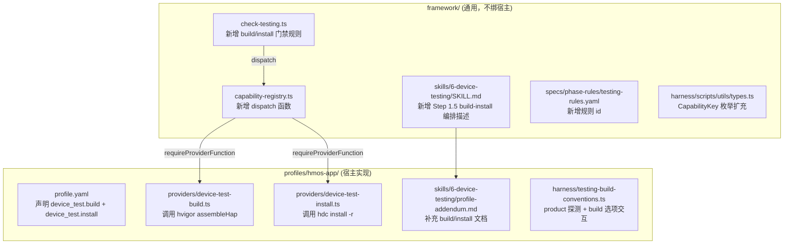
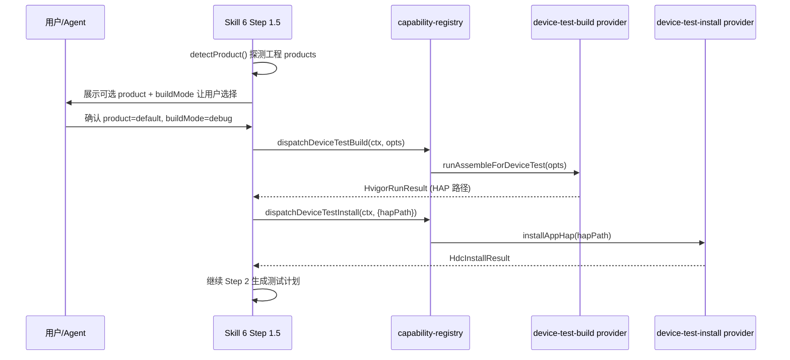

# Skill 6 自动打包 + 装机能力的架构方案

## 架构归属结论

### 打包与装机归 framework（hmos-app profile），不归 Hylyre

理由如下：

- **职责边界**：打包（hvigor assembleHap）和装机（hdc install）是 **toolchain 操作**，与工程结构、签名配置、product 选型深度绑定。framework 已在 coding（`coding.compile`）和 ut（`ut.compile` + `ut.run`）阶段封装了完整的 hvigor + hdc 链路，代码 90% 可复用。
- **Hylyre 的定位**：按 Hylyre `docs/plan.md` 自身设计——"与 framework 为**单向输出**关系，本仓不引用其代码"。Hylyre 是"包已装好后"的 **UI 自动化执行器 + Mock 编排器**，从 `hylyre run --plan ...` 到产出 `test-report.md` + `trace.json`。它 **假设 HAP 已部署**，不应反过来关心如何编译和签名。
- **已有模式**：framework 的 capability-provider 机制天然适合新增 `device_test.build` + `device_test.install` 两个能力键，与 `coding.compile` / `ut.compile` / `ut.run` / `device_test.run` 平行。

### 分层原则：framework 根 vs hmos-app profile

**归 framework 根（通用）**：

- `capability-registry.ts` — 新增 `dispatchDeviceTestBuild()` / `dispatchDeviceTestInstall()` dispatch 函数
- `harness/scripts/utils/types.ts` — `CapabilityKey` 扩充 `'device_test.build' | 'device_test.install'`
- `specs/phase-rules/testing-rules.yaml` — 新增 `device_test_build` / `device_test_install` 规则 id
- `check-testing.ts` — 新增编译/装机门禁检查逻辑（失败则 BLOCKER）
- `skills/6-device-testing/SKILL.md` — 新增 "Step 1.5: 打包与装机"（通用描述，不涉及 hvigor/hdc 细节）

**归 hmos-app profile（宿主实现）**：

- `profile.yaml` — 新增 `device_test.build` / `device_test.install` capability 声明
- `providers/device-test-build.ts` — 新 provider（id: `hvigor_app`），复用 `hvigor-runner.ts` 的 `runHvigorAssembleApp` / `buildCodingHvigorArgs` / `detectProduct`
- `providers/device-test-install.ts` — 新 provider（id: `hdc_app`），复用 `hdc-runner.ts` 的 `installHap` / `probeDevices`
- `providers/types.ts` — `CapabilityProviderId` 新增 `'hvigor_app' | 'hdc_app'`
- `harness/testing-build-conventions.ts` — 导出 product/buildMode 选项探测与用户交互建议
- `skills/6-device-testing/profile-addendum.md` — 补充 hmos-app 下的打包/装机细节

## 用户交互流程

## 复用策略

| 现有代码                      | 位置                 | Skill 6 复用方式                                                                                       |
| ------------------------- | ------------------ | -------------------------------------------------------------------------------------------------- |
| `detectProduct()`         | `hvigor-runner.ts` | 直接导入：探测 build-profile.json5 的 products 列表                                                          |
| `buildCodingHvigorArgs()` | `hvigor-runner.ts` | 参考但不直接用：Skill 6 需要产出可安装的 signed HAP，参数可能需要 `buildMode=debug` 或 `release`                           |
| `runHvigorAssembleApp()`  | `hvigor-runner.ts` | 直接导入并包装：Skill 6 的编译入口                                                                              |
| `installHap()`            | `hdc-runner.ts`    | 直接导入：`hdc install -r <hap>`                                                                        |
| `probeDevices()`          | `hdc-runner.ts`    | 直接导入：检测设备在线                                                                                        |
| `findOhosTestSignedHap()` | `hdc-runner.ts`    | **不复用**，需新写 `findAppSignedHap()`：主 HAP 路径约定不同（`outputs/default/*.hap` vs `outputs/ohosTest/*.hap`） |

## 关键设计点

### 1. product + buildMode 选择

- `detectProduct()` 已能从 `build-profile.json5` 探测可用 product 列表
- 新增 `listAvailableProducts()` 函数暴露完整列表（而非直接选一个），供 agent 展示给用户
- buildMode 默认 `debug`（与 coding 阶段一致，编译快），用户可选 `release`

### 2. HAP 路径定位

主 HAP（非 ohosTest）的路径约定：`<productModule>/build/<product>/outputs/default/<module>-<product>-signed.hap`。需新写一个 `findAppSignedHap()` 函数，扫描规则参考 `findOhosTestSignedHap()` 但目标目录从 `outputs/ohosTest` 改为 `outputs/default`。

### 3. 日志落盘

编译日志 → `framework/harness/reports/<feature>/testing/hvigor-app-build.log`  
装机日志 → `framework/harness/reports/<feature>/testing/hdc-app-install.log`  
元信息 → 对应 `.meta.json`

### 4. check-testing.ts 扩展

新增两条门禁规则：

- `device_test_build`: severity=BLOCKER, 编译是否成功
- `device_test_install`: severity=BLOCKER, 装机是否成功

这两条规则仅在 profile 声明了对应 capability 且非 SKIP 时执行。

### 5. 与 Hylyre 的衔接点（P6 预留）

Skill 6 的 Step 1.5 完成后，HAP 已安装到设备。后续 Hylyre 集成时：

- 由 Hylyre 的 `hylyre run --plan ... --feature ...` 接管 UI 测试执行
- framework 只需在 check-testing.ts 中调用 `hylyre report verify` 校验输出
- 两者通过 CLI 对接，零代码耦合

