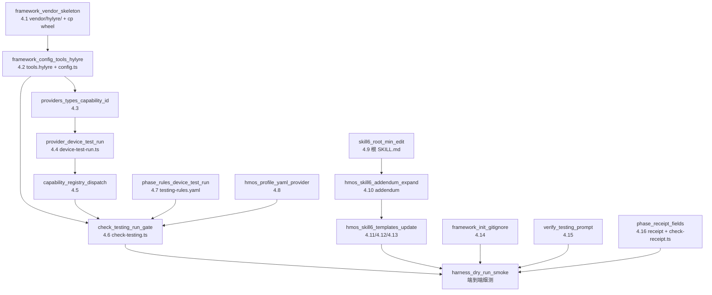

# Skill 6 真机测试 · Hylyre 集成方案（hmos-app only）

> **状态**：契约已锁定 + Hylyre 侧实现已完成 + hypium 拉取链路实测通过。Hylyre 仓 [add-vendor-bundle](D:/1.code/Hylyre/.cursor/plans/hylyre_vendor_bundle_23b6086f.plan.md) change 已全 done，发布件 [D:\1.code\Hylyre\dist\release\hylyre-0.1.0-py3-none-any.whl](D:/1.code/Hylyre/dist/release/hylyre-0.1.0-py3-none-any.whl) + [release.manifest.json](D:/1.code/Hylyre/dist/release/release.manifest.json) 已就位。**实测 2026-05-18**：用户真实工程环境从华为内部 PyPI 源可拉到 `hypium-6.0.7.210` + 传递依赖（含 `opencv-python` ~40 MB / `xdevice*` 等），整链路畅通。framework 这边可立即开干 17 个 todos。
>
> **范围红线**：所有改造严格限定在 `framework/profiles/hmos-app/` 全树与 hmos-app 相关的 capability / phase-rules 字段；根 `framework/skills/6-device-testing/SKILL.md` 只引用抽象 `device_test.run` capability，不写 hylyre / pip / wheel / venv 任何字样。其他 profile（generic / 后端等）的 `device_test.run` 默认 SKIP，零影响。

---

## 〇、Hylyre 集成契约（已确认，全部钉死）

### 0.1 发布件契约

| 字段 | 值 |
|------|----|
| 发布件最终形态 | **单文件 pure-python wheel**（`hylyre-0.1.0-py3-none-any.whl`，跨所有 OS / arch / Python 3.10+ 通用） |
| Hylyre 仓产物路径 | [D:\1.code\Hylyre\dist\release\\](D:/1.code/Hylyre/dist/release/) 下两个文件 |
| 实际 wheel size | 97 628 bytes（约 95 KB，整个 vendor 目录 <1 MB） |
| 实际 sha256 | `a4138fb8ea859d63ea6f76ac3dc5db9d5c4a27587886076c583e3fb9b06b8076`（仅作 v0.1.0 参考；framework 不写死该值，按 `release.manifest.json` 解析） |
| framework vendor 目录 | `framework/profiles/hmos-app/vendor/hylyre/` |
| vendor 目录布局 | **扁平化**：`hylyre-<ver>-py3-none-any.whl` + `release.manifest.json` + `README.md`（无平台子目录） |
| `release.manifest.json` schema v1 | `{ schema:1, hylyre_version, wheel:{filename,sha256,size_bytes}, generated_at, generator:{python,pip,platform}, note }`（实际样例见 [release.manifest.json](D:/1.code/Hylyre/dist/release/release.manifest.json)） |

### 0.2 调用命令契约

| 场景 | 命令模板 |
|------|--------|
| 安装 | `{python} -m pip install {vendor_dir}/hylyre-*.whl "hylyre[device,mcp]" [--extra-index-url {pypi_extra_index_url}]`<br>vendor 提供 hylyre 本体；传递依赖：<br>① hylyre 自身 base = typer / pydantic / httpx / rich / jsonschema / pyyaml（走 PyPI）<br>② `[device]` extras = `hypium`（**实测 2026-05-18** 在华为内部 PyPI 镜像可拉到 `hypium-6.0.7.210`），其传递链含 `xdevice` / `xdevice-ohos` / `xdevice-devicetest` / `opencv-python`（~40 MB）/ `paramiko` / `pyserial` / `psutil` / `sqlmodel` 等<br>③ `[mcp]` extras = `fastmcp>=2.0`<br>**重要**：用 `--extra-index-url` 是**追加**索引，不覆盖用户 `~/.pip/pip.conf` 已配的 `index-url`（如华为内部源）；用户已配内部源时本字段冗余无害 |
| 自检 | `{python} -m hylyre doctor` |
| 真机执行 | `{python} -m hylyre run --plan {planMd} --feature {feature} --report-out {reportMd} --trace-out {traceJson} --bundle {bundleName} [--device-sn {sn}] [--skip-assert-expected]` |
| App 知识查询（派生阶段，可选） | `{python} -m hylyre app find --bundle {bundleName} --by-text "{text}"`（写入由 `HYLYRE_APP_STORE_DIR` 环境变量控制） |

> **关键约束**：`hylyre run --plan` **不接受** `--store-dir`；App 快照缓存仅在 `hylyre app page save/load/find` / `hylyre find` 命令上才有 `--store-dir` 参数。framework 这边通过 spawn 时设 `HYLYRE_APP_STORE_DIR=<absolute path>` 环境变量统一传递，比每次加 `--store-dir` 干净（hylyre 自己的存储路径解析链优先级见 [app-knowledge.md](D:/1.code/Hylyre/docs/app-knowledge.md)）。
>
> **`hylyre run --plan` 内部自管 connect/disconnect**：framework **不需要外面套** `hylyre session start`。session daemon 仅在派生阶段（多次 dump-ui / app find / collect-list 串接）才考虑（见 §九后续演进）。

### 0.3 输出产物契约（framework 消费）

**hylyre 产出的 `test-report.md` 章节硬约束**（[report-sections.yaml](D:/1.code/Hylyre/hylyre/contracts/report-sections.yaml)）：

- **5 必填章节**：测试概览 / 测试执行结果 / 缺陷清单 / 通过率统计 / 结论
- **4 执行状态枚举**：通过 / 失败 / 阻塞 / 跳过
- **3 verdict 枚举**：达标 / 有条件达标 / 不达标
- **通过率分级**：P0 / P1 / P2 + 总体（非 P0/P1/P2 优先级并入 P2）

> **天然对齐**：framework 现有 [test-report-template.md](framework/profiles/hmos-app/skills/6-device-testing/templates/test-report-template.md) 的章节名、状态枚举、verdict 值、通过率分级**全部与 hylyre 契约一致**，本期模板**无须章节级改动**。

**hylyre 产出的 `trace.json` schema**（[output-schema.json](D:/1.code/Hylyre/hylyre/contracts/output-schema.json)）：

```jsonc
{
  "schema_version": "0.1-p0" | "0.2-p4",
  "feature": "<feature>",
  "phase": "testing",
  "outcome": "success" | "partial" | "failed" | "aborted",
  "cases": [
    { "id": "TC-001", "status": "通过", "priority": "P0", "ac_ref": "AC-001", "notes": "" },
    ...
  ],
  "artifacts": { ... },   // optional
  "retries": 0,           // optional
  "tool_calls": [ ... ]   // optional
}
```

> **与 framework 自身 trace.schema.json 的关系**：framework 自己 trace.json（phase 完成回执）schema 不同；hylyre trace.json 作为**独立产物文件**落在 hylyre 报告目录下，framework `phase-completion-receipt.md` 通过 `hylyre_trace_path` 字段引用它（不需要 schema 合并）。Hylyre 仓的 [check_framework_schema.py](D:/1.code/Hylyre/scripts/check_framework_schema.py) 做的是 `phase / outcome / schema_version` 三键软兼容性 check，framework 这三个字段已 ✅ 满足。

### 0.4 派生 plan 硬约束（核心）

派生 plan 必须严格遵循 [agent-plan-a.md](D:/1.code/Hylyre/docs/agent-plan-a.md)：

1. **anchor**：必须存在 `## 测试用例清单` 或 `### 测试用例清单` 标题（hylyre `plan_parse.parse_test_plan` 用此定位表格）
2. **表头 7 列固定顺序**：`用例编号 | 用例名称 | 前置条件 | 测试步骤 | 预期结果 | 优先级 | 关联 AC`
3. **表头下一行**：markdown 分隔符（`| --- | --- | ...`）
4. **「测试步骤」列**：每条逻辑步骤是**单行 JSON**；多条用 **`;` 或 `；`** 分隔；**不能用 `<br/>`**（解析器会替换成空格导致 JSON 粘连）；任何列**不能含未转义 `|`**
5. **JSON 5 根键**：`action` / `touch` / `input` / `swipe` / `scroll`（schema 见 agent-plan-a.md §2.1）
6. **`selector` 优先级**：`by_id` > `by_text` > 坐标
7. **最小骨架参考**：[tests/e2e/fixtures/json-steps-test-plan.md](D:/1.code/Hylyre/tests/e2e/fixtures/json-steps-test-plan.md)

### 0.5 环境变量契约（framework spawn 时设）

| 环境变量 | framework 设法 | 用途 |
|---------|------|------|
| `HYLYRE_APP_STORE_DIR` | spawn env 注入绝对路径 `<projectRoot>/doc/app-snapshot-cache` | hylyre `app page save/load/find` / `find` 命令的默认 store-dir |
| `HYLYRE_PYTHON` | 用户可选覆盖 | 直接指定 hylyre 安装的 python 路径（跳过 framework 自建 venv） |
| `HYLYRE_HOME` | 用户可选覆盖 | 直接指定已装好的 venv 目录 |
| `HYLYRE_SESSION_CONNECT_TIMEOUT` | framework **不主动设**（hylyre 默认 180s） | session daemon 首次连接设备超时；本期 framework 不用 session |
| `HARNESS_HDC_TARGET` | framework 透传给 `--device-sn` | 已有 framework 约定 |
| `HARNESS_HYLYRE_RUN_TIMEOUT_MS` | framework provider 默认 1 800 000 ms（30 分钟），可被用户覆盖 | runHylyreDeviceTest 总超时 |

---

## 一、整体架构

```mermaid
flowchart LR
  Skill5["Skill 5 产出<br/>device-testing-todo.md"] --> S6Step2["Skill 6 Step 2<br/>生成 test-plan.md<br/>(自然语言 + `&lt;br&gt;` 步骤, 给人审)"]
  S6Step2 --> UserConfirm["用户确认 plan"]
  UserConfirm --> S6Step4Derive["Skill 6 新增 Step 4.5<br/>派生 test-plan.hylyre.md<br/>(`## 测试用例清单` + 7 列 + 单行 JSON + `;`)"]
  AppCache[("doc/app-snapshot-cache/&lt;bundle&gt;/<br/>跨 feature 缓存<br/>(HYLYRE_APP_STORE_DIR 注入)")] -.可选辅助.-> S6Step4Derive
  S6Step4Derive --> Harness["check-testing.ts<br/>新增 checkDeviceTestRunGate"]
  Harness --> Reg["capability-registry<br/>dispatchDeviceTestEnsureReady<br/>+ dispatchDeviceTestRun"]
  Reg --> Provider["hmos-app providers/<br/>device-test-run.ts"]
  Provider --> Doctor["ensureHylyreReady<br/>(vendor wheel + PyPI 镜像<br/>→ .hylyre/venv → doctor)"]
  Doctor --> HylyreCLI["python -m hylyre run --plan ... --bundle ...<br/>(内部自管 connect/disconnect)"]
  HylyreCLI --> RawOut["doc/features/&lt;feature&gt;/testing/reports/&lt;ts&gt;/hylyre/<br/>test-report.md (5 章节) + trace.json (cases[])"]
  RawOut --> S6Step5Merge["Skill 6 Step 5<br/>合成顶层 test-report.md<br/>(直接复用 hylyre 4 状态: 通过/失败/阻塞/跳过)"]
  S6Step5Merge --> Closure["脚本 harness + verifier + receipt 闭环"]
```



---

## 二、关键设计决策（汇总）

- **依赖安装模式**：**vendored single-wheel + PyPI 镜像**。`framework/profiles/hmos-app/vendor/hylyre/hylyre-*.whl` 整个 vendor 目录入库（<1 MB），Skill 6 启动时 `pip install <wheel> "hylyre[device,mcp]" --extra-index-url <mirror>` 到 `<projectRoot>/.hylyre/venv/`（venv 进 `.gitignore`）。
- **顶层 test-plan.md 形态**：保持自然语言 + `<br>` 编号步骤（与现有 [test-plan-template.md](framework/profiles/hmos-app/skills/6-device-testing/templates/test-plan-template.md) **零 break**），给人审。
- **派生 test-plan.hylyre.md**：`doc/features/<feature>/testing/reports/<ts>/hylyre/test-plan.hylyre.md`，严格遵循 hylyre [agent-plan-a.md](D:/1.code/Hylyre/docs/agent-plan-a.md) 7 列 + 单行 JSON + `;` 分隔规则，agent 翻不出 selector 的用例**直接进顶层 test-report.md 标"跳过"**（不进派生 plan）。
- **App 快照缓存**：`doc/app-snapshot-cache/<bundle>/`（与 `doc/features/` 同级）。framework 通过 spawn 时设 `HYLYRE_APP_STORE_DIR=<abs path>` 环境变量传给 hylyre 子进程（覆盖 hylyre 自己的默认 `<cwd>/.hylyre/apps`）。`hylyre run --plan` 不消费该参数；仅 `hylyre app page save/load/find` / `hylyre find` 在派生阶段或 verifier 阶段使用。framework-init 自动在 `.gitignore` 追加该目录。
- **device_test.run capability**：复用 hmos-app `profile.yaml` 已声明位，provider 从 `hdc` 改为 `hylyre`，新增 `device-test-run.ts` provider；其他 profile 不挂该 provider，自动 SKIP。
- **报告合成**：hylyre 原始产物落 reports 子目录，agent **直接复用 hylyre 4 状态枚举**合并回顶层 `test-report.md`（**不另造"测不了"**）：
  - hylyre `cases[].status = "通过"` → 顶层"通过"
  - hylyre `cases[].status = "失败"` → 顶层"失败" + 缺陷清单条目
  - hylyre `cases[].status = "阻塞"` → 顶层"阻塞"（hylyre 自报，含设备断连 / app crash）
  - hylyre `cases[].status = "跳过"` → 顶层"跳过" + 备注（hylyre 自报跳过原因）
  - agent 派生时未进 hylyre plan 的 TC（缺 selector / 需人工） → 顶层"跳过" + 备注"缺少稳定 selector，需补 design.md / contracts.yaml"

---

## 三、运行时流程（用户视角，进 Skill 6 后）

1. 用户：「跑 Skill 6 真机测试，feature = wallet-recharge」
2. agent 进 Skill 6，按现 Step 1-3 生成顶层 `doc/features/wallet-recharge/test-plan.md`（自然语言，用户审）
3. **新增 Step 4.5**：agent 读 design.md / contracts.yaml 把每条 TC 的中文步骤翻译为符合 hylyre 7 列 JSON 硬约束的 markdown 表格，落 `doc/features/wallet-recharge/testing/reports/<ts>/hylyre/test-plan.hylyre.md`；翻不出的用例**不进派生 plan**（最后在顶层报告标"跳过"）
4. **Step 6 脚本 harness**：`harness-runner.ts --phase testing --feature wallet-recharge`
   - 跑 device_test.build → device_test.install → **device_test.run（新）**
   - 后者：`ensureHylyreReady`（若 `.hylyre/venv` 不存在或 import 失败 → `python -m venv` + `pip install <wheel> "hylyre[device,mcp]" --extra-index-url <mirror>` + `python -m hylyre doctor`）→ `python -m hylyre run --plan ...`（spawn env 含 `HYLYRE_APP_STORE_DIR`）
5. hylyre 在 `reports/<ts>/hylyre/` 产 `test-report.md`（5 章节）+ `trace.json`（cases[]）
6. agent 读 hylyre trace.json `cases[]` + 自己派生时记录的"未入派生 plan 的 TC 清单"，合成顶层 `test-report.md`（直接复用 hylyre 4 状态：通过 / 失败 / 阻塞 / 跳过 + 缺陷清单 + 通过率统计 + 结论 verdict）
7. verifier 子 agent 跑语义级 verify-testing.md（新增 device_test_run_consumption 项）
8. 完成回执 + 4 凭证齐全 → 阶段闭环

---

## 四、framework 侧改造（按文件，逐项可执行）

### 4.1 `framework/profiles/hmos-app/vendor/hylyre/` — vendor 目录骨架（**第一步**）

**操作清单**：

1. 创建目录 `framework/profiles/hmos-app/vendor/hylyre/`
2. cp 两个文件：
   ```powershell
   $src = "D:\1.code\Hylyre\dist\release"
   $dst = "D:\1.code\SimulatedWalletForHmos\framework\profiles\hmos-app\vendor\hylyre"
   New-Item -ItemType Directory -Force -Path $dst | Out-Null
   Copy-Item "$src\hylyre-0.1.0-py3-none-any.whl" $dst
   Copy-Item "$src\release.manifest.json" $dst
   # 校验
   python D:\1.code\Hylyre\scripts\build_wheel.py --verify $dst
   # 期望 exit 0
   ```
3. 新增 `README.md`（结构如下）

**`README.md` 必含章节**：

1. **目录是什么**：hmos-app profile 集成 Hylyre 真机自动化的 vendor 入口；整个目录入库（<1 MB pure-python wheel，零联网 + 零 GitHub 依赖）
2. **何时更新**：Hylyre 仓 `pyproject.toml.version` bump / framework doctor 报 hylyre 版本不一致 / 升级 framework 时
3. **三步同步流程**（与 [docs/framework-vendor-bundle.md](D:/1.code/Hylyre/docs/framework-vendor-bundle.md) 对齐）：
   ```powershell
   # ① 在 Hylyre 仓产出
   cd D:\1.code\Hylyre
   python scripts/build_wheel.py --clean

   # ② cp 到本目录（覆盖旧 wheel）
   $src = "D:\1.code\Hylyre\dist\release"
   $dst = "D:\1.code\SimulatedWalletForHmos\framework\profiles\hmos-app\vendor\hylyre"
   Remove-Item -Force "$dst\hylyre-*.whl","$dst\release.manifest.json" -ErrorAction Ignore
   Copy-Item "$src\hylyre-*.whl",$src\release.manifest.json $dst

   # ③ 校验
   python D:\1.code\Hylyre\scripts\build_wheel.py --verify $dst
   ```
4. **升级原则**：commit message 形如 `chore(vendor): hylyre 0.1.0 -> 0.2.0`；正文贴 `release.manifest.json` 关键字段（hylyre_version / wheel.sha256）
5. **故障排查**：sha256 mismatch / 旧 wheel 残留 / Python 版本不匹配（hylyre 需要 3.10+）/ framework doctor 报版本不一致 各自处置
6. **不要做**：本目录任何文件**不要手动修改**；只允许 cp 覆盖。`hylyre[device]` 的 `hypium` 等传递依赖**不在**本目录 vendor（走 PyPI 镜像现场拉）

> **本期决策**：vendor 目录**直接入库**（不进 `.gitignore`），整个目录 <1 MB。所有 framework 协作者 `git clone` 即可拿到 wheel，零联网 + 零 GitHub 依赖。

### 4.2 `framework.config.json` 与 `framework.config.template.json` — 新增 `tools.hylyre` 段

[framework.config.json](framework.config.json) 与同源模板（init 复制源）同步新增：

```json
"tools": {
  "devEcoStudio": { "...": "现有" },
  "hvigor": { "...": "现有" },
  "hylyre": {
    "vendor_dir": "framework/profiles/hmos-app/vendor/hylyre",
    "venv_dir": ".hylyre/venv",
    "app_snapshot_cache_dir": "doc/app-snapshot-cache",
    "pypi_extra_index_url": "https://pypi.tuna.tsinghua.edu.cn/simple",
    "auto_install": true,
    "doctor_first_run": true
  }
}
```

字段语义：

- `vendor_dir`：相对 projectRoot 的路径，`device-test-run.ts` 从此处找 wheel + manifest
- `venv_dir`：相对 projectRoot 的路径，framework 创建 / 复用的 Python 隔离环境
- `app_snapshot_cache_dir`：相对 projectRoot 的路径，**通过 `HYLYRE_APP_STORE_DIR` 环境变量传给 hylyre 子进程**；hylyre 自己在 `<store>/<bundle>/pages/<name>.json` 与 `<store>/<bundle>/index.json` 组织文件；`hylyre run --plan` 不消费它，仅 `app page save/load/find` / `find` 使用
- `pypi_extra_index_url`：默认清华镜像；可在 framework.config.json 改成公司内部 / CI 镜像；填空字符串 `""` 表示不附加 extra-index（用户 `~/.pip/pip.conf` 自行处理）
- `auto_install`：true 时第一次进 Skill 6 自动建 venv + 装 hylyre；false 时只检测、缺失则 fail-fast
- `doctor_first_run`：true 时第一次安装完跑 `python -m hylyre doctor` 自检

[framework/harness/config.ts](framework/harness/config.ts) 新增 `resolveHylyreToolConfig(projectRoot)` 函数（仿现有 `resolveDevEcoStudio` / `resolveHvigor` 风格），未声明 `tools.hylyre` 时取默认值。

### 4.3 `framework/profiles/hmos-app/harness/providers/types.ts` — CapabilityProviderId 新增 hylyre

```diff
 export type CapabilityProviderId =
   | 'hvigor'
   | 'hvigor_ohostest'
   | 'hvigor_hypium'
   | 'hvigor_app'
   | 'hdc'
   | 'hdc_app'
+  | 'hylyre'
   | 'script'
   | 'none';
```

### 4.4 `framework/profiles/hmos-app/harness/providers/device-test-run.ts` — 新建（核心实现）

**文件骨架**（实施者按此扩展）：

```ts
/**
 * device_test.run → provider `hylyre`
 *
 * 负责：
 *   1) ensureHylyreReady：探测 / 离线安装 hylyre 到 .hylyre/venv（vendor wheel + PyPI 镜像拉传递依赖）
 *   2) runHylyreDeviceTest：用 venv python 调 `python -m hylyre run --plan ...`
 *      （spawn env 注入 HYLYRE_APP_STORE_DIR=<abs path>）
 *   3) 产物落盘：reports/<feature>/testing/device-test-run.meta.json + hylyre-doctor.log
 *   4) 解析 hylyre trace.json 的 cases[]，给 verifier / 顶层报告合成提供数据源
 */
import * as fs from 'fs';
import * as path from 'path';
import * as os from 'os';
import { spawnSync, type SpawnSyncReturns } from 'child_process';
import { featurePhaseReportsDir, resolveHylyreToolConfig } from '../../../../harness/config';
import type { CapabilityProvider } from './types';

export const provider: CapabilityProvider = {
  id: 'hylyre',
  capability: 'device_test.run',
  exports: ['ensureHylyreReady', 'runHylyreDeviceTest', 'parseHylyreTrace'],
};

// -------- 公共类型 --------

export interface HylyreReleaseManifest {
  schema: 1;
  hylyre_version: string;
  wheel: { filename: string; sha256: string; size_bytes: number };
  generated_at: string;
  generator: { python: string; pip: string; platform: string };
  note?: string;
}

/** hylyre trace.json `cases[]` 子项；参照 D:/1.code/Hylyre/hylyre/contracts/output-schema.json */
export interface HylyreTraceCase {
  id: string;
  status: '通过' | '失败' | '阻塞' | '跳过';
  priority?: 'P0' | 'P1' | 'P2' | string;
  ac_ref?: string;
  notes?: string;
}

export interface HylyreTrace {
  schema_version: '0.1-p0' | '0.2-p4' | string;
  feature: string;
  phase: 'testing';
  outcome: 'success' | 'partial' | 'failed' | 'aborted';
  cases?: HylyreTraceCase[];
  artifacts?: Record<string, unknown>;
  retries?: number;
  tool_calls?: Array<Record<string, unknown>>;
}

export interface HylyreReadyOptions {
  projectRoot: string;
  harnessRoot: string;
  feature: string;
  phase: 'testing';
}

export interface HylyreReadyResult {
  ok: boolean;
  pythonPath: string;
  hylyreVersion: string;       // pip show hylyre 解析得到
  manifestVersion: string;     // release.manifest.json 中的 hylyre_version
  versionConsistent: boolean;  // 上两者比对
  source: 'env_override' | 'venv_existing' | 'venv_installed' | 'fail';
  doctorOk: boolean;
  errors: Array<{ message: string; kind?: string }>;
  logPath?: string;
}

export interface HylyreRunOptions {
  projectRoot: string;
  harnessRoot: string;
  feature: string;
  phase: 'testing';
  pythonPath: string;          // 来自 ensureHylyreReady
  derivedPlanPath: string;     // doc/features/<feature>/testing/reports/<ts>/hylyre/test-plan.hylyre.md
  reportOutPath: string;       // doc/features/<feature>/testing/reports/<ts>/hylyre/test-report.md
  traceOutPath: string;        // doc/features/<feature>/testing/reports/<ts>/hylyre/trace.json
  bundleName: string;          // 取自 AppScope/app.json5
  deviceSn?: string;           // 取自 process.env.HARNESS_HDC_TARGET
  skipAssertExpected?: boolean; // 默认 true（无 VLM）
  appSnapshotCacheAbs: string; // 注入 HYLYRE_APP_STORE_DIR
  timeoutMs?: number;          // 默认 1800000（30min），可被 HARNESS_HYLYRE_RUN_TIMEOUT_MS 覆盖
}

export interface HylyreRunResult {
  executed: boolean;
  exitCode: number | null;
  ok: boolean;                 // 见下方判定逻辑
  command: string;
  reportPath: string | null;
  tracePath: string | null;
  trace: HylyreTrace | null;   // 解析后的 trace（用于 verifier / 报告合成）
  logPath: string;
  errors: Array<{ message: string; kind?: string }>;
}

// -------- 平台 helper --------

function venvPython(venvDir: string): string {
  if (process.platform === 'win32') {
    return path.join(venvDir, 'Scripts', 'python.exe');
  }
  return path.join(venvDir, 'bin', 'python');
}

function readJsonSafe<T>(file: string): T | null {
  try {
    return JSON.parse(fs.readFileSync(file, 'utf-8')) as T;
  } catch {
    return null;
  }
}

// -------- ensureHylyreReady --------

export function ensureHylyreReady(opts: HylyreReadyOptions): HylyreReadyResult {
  // 1) 读 framework.config.json > tools.hylyre 配置
  // 2) 环境变量覆盖：HYLYRE_PYTHON 指向已装 hylyre 的 python / HYLYRE_HOME 指向已装的 venv
  // 3) 检查 venv 是否存在且能 `python -c "import hylyre"`
  // 4) 不能则：
  //    a) python -m venv <venv_dir>
  //    b) <venv>/python -m pip install \
  //         <projectRoot>/<vendor_dir>/hylyre-*.whl \
  //         "hylyre[device,mcp]" \
  //         [--extra-index-url <pypi_extra_index_url>]
  //    c) <venv>/python -m hylyre doctor
  // 5) 解析 <vendor_dir>/release.manifest.json 的 hylyre_version 与 `pip show hylyre` 比对
  //    不一致写 WARN（不阻断，但 errors 数组追加 kind=version_drift）
  // 6) 全部 stdio 落 reports/<feature>/testing/hylyre-doctor.log
  //    meta 落 reports/<feature>/testing/hylyre-ready.meta.json
}

// -------- runHylyreDeviceTest --------

export function runHylyreDeviceTest(opts: HylyreRunOptions): HylyreRunResult {
  // 1) 确保 derivedPlanPath / reportOutPath / traceOutPath 父目录存在
  // 2) 拼命令：
  //    <pythonPath> -m hylyre run \
  //      --plan <derivedPlanPath> \
  //      --feature <feature> \
  //      --report-out <reportOutPath> \
  //      --trace-out <traceOutPath> \
  //      --bundle <bundleName> \
  //      [--device-sn <deviceSn>] \
  //      [--skip-assert-expected]
  // 3) spawnSync({
  //      timeout: opts.timeoutMs ?? Number(process.env.HARNESS_HYLYRE_RUN_TIMEOUT_MS) || 1_800_000,
  //      env: { ...process.env, HYLYRE_APP_STORE_DIR: opts.appSnapshotCacheAbs },
  //      stdio: ['ignore', logFile, logFile]
  //    })
  // 4) 解析 exit code 与 trace.json：
  //    - exit=0 → ok=true
  //    - exit≠0 但 trace.json 存在且 parseTrace OK
  //         → ok=true（hylyre 自己写明哪些 case 失败/跳过/阻塞，由顶层 report 合成承载）
  //    - exit≠0 且 trace.json 缺失/无效 → ok=false（hylyre 自身崩溃）
  // 5) 写 reports/<feature>/testing/device-test-run.meta.json：
  //    { exit_code, ok, command, report_path, trace_path, log_path,
  //      bundleName, deviceSn, ran_at, trace_summary: { outcome, cases_count, failed_count, blocked_count, skipped_count } }
}

// -------- parseHylyreTrace --------

export function parseHylyreTrace(tracePath: string): HylyreTrace | null {
  // jsonschema 校验（可选；本期 best-effort：必填字段缺失记 WARN 但不抛）
  // 返回结构化对象供 verifier / check-testing.ts / 顶层报告合成消费
}
```

**实施约束**：

- 不引入任何新 npm 依赖（spawnSync / fs / path / os 都是 node 内置）
- 跨平台：`python` 命令名按平台选择（Windows 用 `py -3` 或显式找 `python.exe`；POSIX 用 `python3`）
- venv 创建失败 / pip 安装失败 / doctor 失败时，**每一步都要写日志**到 `reports/<feature>/testing/hylyre-doctor.log`，并把 errors 数组填充清晰（含 hypium 拉不到的友好提示，见 §七风险表）
- 默认 `--skip-assert-expected=true`（无 VLM 配置时避免对预期结果列做 AI 断言）
- **timeout**：
  - `pip install` 默认 **600 秒**（实测华为内部源下 `hypium` 拖 `opencv-python` ~40 MB + `xdevice*` 各几 MB，首次安装约 60-120 秒；600 秒是放宽阈值给慢网络），可由环境变量 `HARNESS_HYLYRE_PIP_TIMEOUT_MS` 覆盖
  - `hylyre run` 默认 1 800 000 ms（30 分钟），可由环境变量 `HARNESS_HYLYRE_RUN_TIMEOUT_MS` 覆盖
- **首次安装进度可见**：spawn 时把 pip stdout/stderr **同时**输出到 console（不仅 log file），让用户看到下载进度条；通过 `spawnSync({ stdio: ['ignore', 'inherit', 'inherit'] })` + 同步写 log 实现（或简单 `spawn` + 双管道转发）；安装完毕在 console 打印一行"hylyre 0.1.0 + 传递依赖安装完成（X 秒）"
- **pip cache 复用**：venv 内 `pip install` 默认走 pip 全局 cache（`%LOCALAPPDATA%\pip\Cache`），用户全局已装过 hypium 时，**第二次** ensureHylyreReady 速度可降到 ~10 秒
- **绝对路径传参**：`--plan` / `--report-out` / `--trace-out` 全部传绝对路径（避免 cwd 漂移导致 hylyre 找不到文件）

### 4.5 `framework/harness/capability-registry.ts` — 接入 hylyre provider

```diff
 const PROVIDER_MODULE_BY_ID: Record<string, string> = {
   hvigor: 'coding-compile',
   hvigor_ohostest: 'ut-compile',
   hvigor_hypium: 'ut-run',
   hvigor_app: 'device-test-build',
   hdc: 'device-test',
   hdc_app: 'device-test-install',
+  hylyre: 'device-test-run',
   script: 'prd-visual-handoff',
 };
```

在 `dispatchDeviceTestInstall` 之后追加两个分发函数（仿现有 dispatch* 风格）：

```ts
export function dispatchDeviceTestEnsureReady(
  ctx: CheckContext,
  options: Record<string, unknown>,
): unknown {
  const fn = requireProviderFunction(ctx.resolvedProfile, 'device_test.run', 'ensureHylyreReady');
  return fn(options);
}

export function dispatchDeviceTestRun(
  ctx: CheckContext,
  options: Record<string, unknown>,
): unknown {
  const fn = requireProviderFunction(ctx.resolvedProfile, 'device_test.run', 'runHylyreDeviceTest');
  return fn(options);
}
```

### 4.6 `framework/harness/scripts/check-testing.ts` — 新增 checkDeviceTestRunGate

**插入位置**：现有 `checkDeviceTestInstallGate` 函数之后；`check()` 主流程在 `results.push(...checkDeviceTestInstallGate(...))` 之后追加 `results.push(...checkDeviceTestRunGate(ctx, deviceTestHapHolder))`。

**函数骨架**：

```ts
import type { HylyreReadyResult, HylyreRunResult, HylyreTrace }
  from '../../profiles/hmos-app/harness/providers/device-test-run';
import { dispatchDeviceTestEnsureReady, dispatchDeviceTestRun } from '../capability-registry';

function checkDeviceTestRunGate(
  ctx: CheckContext,
  hapHolder: { hapPath: string | null },
): CheckResult[] {
  const id = 'device_test_run';
  const desc = ruleDesc(ctx, 'structure_checks', id);

  // 1) profile SKIP → SKIP
  if (isCapabilitySkipped(ctx.resolvedProfile, 'device_test.run')) {
    return [{ id, category: 'structure', description: desc, severity: 'BLOCKER', status: 'SKIP',
      details: 'project_profile 声明 device_test.run 为 SKIP，未执行真机自动化测试。' }];
  }

  // 2) 上游 SKIP / 无 hap → SKIP
  if (isCapabilitySkipped(ctx.resolvedProfile, 'device_test.install') || !hapHolder.hapPath) {
    return [{ id, category: 'structure', description: desc, severity: 'BLOCKER', status: 'SKIP',
      details: 'device_test.install 已 SKIP 或无可用 HAP，同步跳过真机自动化测试。' }];
  }

  // 3) 检查派生 plan 存在
  const derivedPlan = resolveDerivedHylyrePlan(ctx);
  if (!derivedPlan.exists) {
    return [{ id, category: 'structure', description: desc, severity: 'BLOCKER', status: 'FAIL',
      details: `未找到派生 hylyre plan（${derivedPlan.expectedDir}）。请按 Skill 6 Step 4.5 派生 test-plan.hylyre.md 后重试。` }];
  }

  // 4) TC 编号一致性校验
  //    （顶层 plan TC 集合 ⊇ 派生 plan TC 集合；派生 plan 缺 TC 不算 FAIL，由顶层报告合成时补"跳过"）
  const consistency = verifyDerivedPlanTcConsistency(ctx, derivedPlan.path);
  if (consistency.extra.length > 0) {
    return [{ id, category: 'structure', description: desc, severity: 'BLOCKER', status: 'FAIL',
      details: `派生 plan 包含顶层 plan 中未声明的 TC：${consistency.extra.join(', ')}` }];
  }

  // 5) ensureHylyreReady
  const ready = dispatchDeviceTestEnsureReady(ctx, {
    projectRoot: ctx.projectRoot, harnessRoot: TESTING_HARNESS_ROOT,
    feature: ctx.feature, phase: ctx.phase,
  }) as HylyreReadyResult;
  if (!ready.ok) {
    return [{ id, category: 'structure', description: desc, severity: 'BLOCKER', status: 'FAIL',
      details: ['hylyre 环境准备失败：', ...ready.errors.map(e => `  - ${e.message}`),
                ready.logPath ? `详细日志：${ready.logPath}` : ''].filter(Boolean).join('\n'),
      suggestion: '若 hypium 拉不到，请按 hmos-app addendum 故障转移指引配置 PyPI 镜像或华为内部源。' }];
  }

  // 6) runHylyreDeviceTest（spawn env 注入 HYLYRE_APP_STORE_DIR）
  const bundleName = readBundleNameFromAppScope(ctx.projectRoot);
  const reportsDir = featurePhaseReportsDir(ctx.projectRoot, ctx.feature, ctx.phase);
  const hylyreOutDir = path.dirname(derivedPlan.path);
  const hylyreCfg = resolveHylyreToolConfig(ctx.projectRoot);
  const appSnapshotCacheAbs = path.resolve(ctx.projectRoot, hylyreCfg.app_snapshot_cache_dir);

  const run = dispatchDeviceTestRun(ctx, {
    projectRoot: ctx.projectRoot, harnessRoot: TESTING_HARNESS_ROOT,
    feature: ctx.feature, phase: ctx.phase,
    pythonPath: ready.pythonPath,
    derivedPlanPath: path.resolve(derivedPlan.path),
    reportOutPath: path.resolve(path.join(hylyreOutDir, 'test-report.md')),
    traceOutPath: path.resolve(path.join(hylyreOutDir, 'trace.json')),
    bundleName,
    deviceSn: process.env.HARNESS_HDC_TARGET,
    skipAssertExpected: true,
    appSnapshotCacheAbs,
  }) as HylyreRunResult;

  if (!run.ok) {
    return [{ id, category: 'structure', description: desc, severity: 'BLOCKER', status: 'FAIL',
      details: [`hylyre run 失败：exit=${run.exitCode}`, `命令：${run.command}`,
                `日志：${run.logPath}`, ...run.errors.map(e => `  - ${e.message}`)].join('\n') }];
  }

  // 7) PASS：失败 / 阻塞 / 跳过 case 由顶层报告合成承载（hylyre trace.json 已含 cases[]）
  const summary = run.trace
    ? `outcome=${run.trace.outcome}, cases=${(run.trace.cases ?? []).length}`
    : '无 trace.json';
  return [{ id, category: 'structure', description: desc, severity: 'BLOCKER', status: 'PASS',
    details: [`hylyre run 完成：exit=${run.exitCode}, ${summary}`,
              `报告：${run.reportPath}`, `trace：${run.tracePath}`].join('\n'),
    suggestion: '失败 / 阻塞 / 跳过用例的具体分类由顶层 test-report.md 合成步骤承载；本检查只确认 hylyre 自身执行未崩溃。' }];
}

// 同文件新增 helper：resolveDerivedHylyrePlan / verifyDerivedPlanTcConsistency / readBundleNameFromAppScope
```

### 4.7 `framework/specs/phase-rules/testing-rules.yaml` — `structure_checks` 段新增

```yaml
  device_test_run:
    description: >
      当 project_profile 将 device_test.run 声明为 BLOCKER 且未 SKIP 时，
      harness 必须按 profile 指定的真机自动化能力消费派生测试用例并产出 report + trace；
      声明 SKIP 或上游 device_test.install SKIP 时本检查 SKIP。
    severity: BLOCKER
```

> profile-agnostic：不出现 hylyre / hypium 字样。

### 4.8 `framework/profiles/hmos-app/profile.yaml` — provider 改为 hylyre

```diff
 capabilities:
   coding.compile: { provider: hvigor, severity: BLOCKER }
   coding.lint: { provider: arkts_lint, severity: BLOCKER }
   ut.compile: { provider: hvigor_ohostest, severity: BLOCKER }
   ut.run: { provider: hvigor_hypium, severity: BLOCKER }
-  device_test.run: { provider: hdc, severity: BLOCKER }
+  device_test.run: { provider: hylyre, severity: BLOCKER }
   device_test.build: { provider: hvigor_app, severity: BLOCKER }
   device_test.install: { provider: hdc_app, severity: BLOCKER }
   prd.visual_handoff: { provider: script, severity: BLOCKER }
```

### 4.9 `framework/skills/6-device-testing/SKILL.md` — 最小化改动

**改动 1（在 Step 4 与 Step 5 之间插入 Step 4.5）**：

```markdown
### Step 4.5 真机自动化（profile capability）

若 `project_profile` 将 `device_test.run` 声明为 BLOCKER 且未 SKIP，本步骤由 profile addendum
指定的真机自动化能力消费 test-plan.md 派生可执行测试用例并执行；产物落 `doc/features/<feature>/testing/reports/<timestamp>/`。
其他 profile（如 generic / 后端类）声明 SKIP，跳过本步骤。

具体派生协议、命令、缓存目录、环境变量等以 profile addendum 为准（hmos-app 见 [profile-addendum.md](../../profiles/hmos-app/skills/6-device-testing/profile-addendum.md)）。
```

**改动 2（Step 7 device_test 表格新增 device_test.run 行）**：

```markdown
| 真机自动化（profile capability） | profile `device_test.run`：消费派生测试用例并产出原始 report + trace | BLOCKER / SKIP |
```

> 严格控制：根 SKILL.md **不出现** "hylyre" / "pip" / "wheel" / "venv" 等 hmos-app 专属术语。

### 4.10 `framework/profiles/hmos-app/skills/6-device-testing/profile-addendum.md` — 大幅扩展

在现有"Skill 6 · 主应用打包与装机（hmos-app）"章节**之后**新增完整章节 **「Skill 6 · 真机自动化（Hylyre · hmos-app）」**，包含：

1. **能力概述**：与 `device_test.run` capability 的对应；与 `device_test.build` / `device_test.install` 的串接顺序

2. **依赖准备（vendor wheel + .hylyre/venv）**：
   - `vendor_dir` 默认路径 + 入库说明（不在 .gitignore）
   - 首次进 Skill 6 时 `ensureHylyreReady` 流程图（探测 → 建 venv → pip install vendor wheel + 走 PyPI 拉传递依赖 → doctor）
   - `pypi_extra_index_url` 默认值（清华镜像）与企业内部镜像配置
   - 失败排查 5 项：PyPI 不可达 / vendor wheel 缺失 / Python 3.10+ 未装 / pip 旧版本 / **hypium 拉不到**（重点，见下方）

3. **App 快照缓存（`doc/app-snapshot-cache/`）**：
   - 路径默认 + 与 `doc/features/` 同级（跨 feature 共享）
   - **通过 `HYLYRE_APP_STORE_DIR` 环境变量传给 hylyre 子进程**（绝对路径）；不在命令行加 `--store-dir`
   - hylyre 自己在 `<store>/<bundleName>/pages/<name>.json` 与 `<store>/<bundleName>/index.json` 组织文件（schema 见 [app-knowledge.md](D:/1.code/Hylyre/docs/app-knowledge.md)）
   - **`hylyre run --plan` 不消费该缓存**；仅 `hylyre app page save/load/find` / `hylyre find` 在派生阶段或 verifier 阶段使用
   - `.gitignore` 规则（由 framework-init 自动追加）
   - 何时该 save 快照（首次跑某 feature 探索完成时）/ 何时该 load（回归测试）

4. **顶层 test-plan.md → hylyre plan 派生协议**：
   - 派生路径：`doc/features/<feature>/testing/reports/<timestamp>/hylyre/test-plan.hylyre.md`
   - **必须严格按 hylyre 7 列硬约束**（见 §0.4 钉死契约）：
     - anchor：`## 测试用例清单`（或 `### 测试用例清单`）
     - 表头：`用例编号 | 用例名称 | 前置条件 | 测试步骤 | 预期结果 | 优先级 | 关联 AC`
     - 「测试步骤」列：**单行 JSON** + **`;` / `；` 分隔**；**禁用 `<br/>`**；**任何列禁含未转义 `|`**
     - JSON 根键：`action` / `touch` / `input` / `swipe` / `scroll`
   - **selector 来源优先级（agent 派生时必须按此查找）**：
     1. `contracts.yaml` 的 components[].name / linked_functions / 资源 key
     2. `design.md` 的页面组件树 by_id / by_text
     3. `doc/app-snapshot-cache/<bundle>/` 里 `app find --by-text` 结果
     4. 仍找不到 → **该用例不进派生 plan，直接进顶层 test-report.md 标"跳过"**（理由：缺少稳定 selector）
   - 派生权威指南（**必读**）：[D:\1.code\Hylyre\docs\agent-plan-a.md](D:/1.code/Hylyre/docs/agent-plan-a.md)
   - 最小骨架参考：[D:\1.code\Hylyre\tests\e2e\fixtures\json-steps-test-plan.md](D:/1.code/Hylyre/tests/e2e/fixtures/json-steps-test-plan.md)（agent 可直接抄结构）

5. **报告合成协议**（agent 在 Step 5 做）：
   - 读 hylyre 产出的 `reports/<ts>/hylyre/test-report.md`、`trace.json`
   - 读自己派生时记录的"未入派生 plan 的 TC 清单"（agent 内部状态，可写在派生目录的 `derivation-notes.md` 里）
   - 合并到顶层 `doc/features/<feature>/test-report.md`：
     - 章节直接复用 hylyre 5 必填章节（测试概览 / 测试执行结果 / 缺陷清单 / 通过率统计 / 结论）—— framework 现有模板已对齐，无须章节级改动
     - 「测试执行结果」表格的"执行状态"列**直接复用 hylyre 4 状态**：通过 / 失败 / 阻塞 / 跳过
     - 未入派生 plan 的 TC → 加一行"执行状态=跳过 + 备注=缺少稳定 selector，需补 design.md / contracts.yaml"
     - 「缺陷清单」对所有"失败"用例补充缺陷条目；"阻塞" / "跳过"用例不进缺陷清单但在备注栏写原因
     - 「通过率统计」按 hylyre 已有计算填入 P0 / P1 / P2 + 总体
     - 「结论」verdict 取 hylyre 3 枚举：达标 / 有条件达标 / 不达标

6. **环境变量清单**（详见 §0.5 钉死契约）：
   - `HYLYRE_APP_STORE_DIR`：由 framework provider spawn 时设
   - `HYLYRE_PYTHON` / `HYLYRE_HOME`：用户可选覆盖
   - `HARNESS_HDC_TARGET`：透传给 hylyre `--device-sn`
   - `HARNESS_HYLYRE_RUN_TIMEOUT_MS`：覆盖 hylyre run 默认 30 分钟超时

7. **故障转移指引**：
   - **hypium 拉不到**（**实测华为内部源 2026-05-18 可拉到 `hypium-6.0.7.210`**，本项作为兜底）：
     - 诊断：`pip install` 报 `Could not find a version that satisfies the requirement hypium`
     - 处置 A（推荐）：用户在 `~/.pip/pip.conf` 配 `index-url = <华为内部源>`（如 `https://xxxxxxxx.xxx.com/pypi/simple`）；framework 默认 `pypi_extra_index_url`（清华镜像）作为 **`--extra-index-url`** 是**追加**而非覆盖，与用户内部源**不冲突**
     - 处置 B（fallback）：修改 `framework.config.json > tools.hylyre.pypi_extra_index_url` 直接指向内部源
     - 处置 C（极端 fallback）：用户手动 `pip download hypium -d <somewhere>` 拿到 wheel 后，手动 `<venv>/python -m pip install <wheel>` 装上；framework 后续演进可考虑在 `vendor/hypium/` 也 vendor 一份（见 §九）
   - **首次安装较慢**：`hypium` 拖 `opencv-python` ~40 MB + `xdevice*` 各几 MB，首次安装约 60-120 秒（慢网络可能到 5-10 分钟）；`ensureHylyreReady` 默认 600s 超时，可被 `HARNESS_HYLYRE_PIP_TIMEOUT_MS` 覆盖；第二次后走 pip 全局 cache 通常 ~10 秒
   - **PyPI 不可达**：改 `pypi_extra_index_url` 或 `~/.pip/pip.conf`
   - **hylyre import 失败**：检查 venv 状态 / 删除 `.hylyre/venv` 后重跑 ensureHylyreReady 强制重建
   - **真机断连**：`hdc list targets` + 重连
   - **selector 找不到**：用 `<venv>/python -m hylyre dump-ui` 探界面 → 补 design.md / contracts.yaml selector 字段

### 4.11 `framework/profiles/hmos-app/skills/6-device-testing/templates/test-plan-hylyre-template.md` — 新建派生模板

```markdown
# 测试计划（Hylyre 派生格式） — {module-name}

> 此文件由 agent 从顶层 `test-plan.md` 派生而来；hylyre 实际执行此文件。
> **不要手工编辑此文件**；要修改测试用例请改顶层 `test-plan.md` 后重新派生。
> 派生权威指南：[Hylyre agent-plan-a.md](file:///D:/1.code/Hylyre/docs/agent-plan-a.md)
> 最小骨架参考：[Hylyre tests/e2e/fixtures/json-steps-test-plan.md](file:///D:/1.code/Hylyre/tests/e2e/fixtures/json-steps-test-plan.md)
>
> 缺少稳定 selector 的用例**不出现在本文件**，直接在顶层 test-report.md 的"执行状态"列标"跳过"。

## 测试用例清单

<!-- ⚠️ 上方标题节是 hylyre `plan_parse.parse_test_plan` 解析锚点，禁止修改 -->
<!-- ⚠️ 表头 7 列固定顺序；「测试步骤」列单行 JSON + `;` 分隔；禁用 `<br/>` -->

| 用例编号 | 用例名称 | 前置条件 | 测试步骤 | 预期结果 | 优先级 | 关联 AC |
|----------|---------|---------|---------|---------|--------|---------|
| TC-001 | 卡片列表展示 | 已启动 app | `{"touch":{"by_text":"我的钱包"}}` ; `{"action":{"type":"swipe","direction":"UP","distance":50,"area":{"by_type":"Scroll"}}}` | 列表展示至少 1 张卡片 | P0 | AC-001 |
| TC-002 | 充值 100 元 | 在首页 | `{"touch":{"by_text":"充值"}}` ; `{"input":{"text":"100","by_id":"amount_input"}}` ; `{"touch":{"by_text":"确认"}}` | Toast 显示"充值成功" | P0 | AC-005 |
| TC-003 | 横向滚动一屏卡片 | 在卡片列表页 | `{"swipe":{"direction":"LEFT","distance":80,"area":{"by_id":"card_list"}}}` | 下一组卡片露出 | P1 | AC-002 |
| TC-004 | 滚轮翻页 | 在长内容页 | `{"scroll":{"direction":"down","steps":6,"at":{"by_type":"Scroll"}}}` | 滚动至下一屏 | P2 | AC-008 |

<!-- 不进派生 plan 的 TC（缺 selector / 需人工）由 agent 在顶层 test-report.md 标"跳过"，不在此处出现 -->
```

### 4.12 `framework/profiles/hmos-app/skills/6-device-testing/templates/test-plan-template.md` — 追加派生说明

在表格之后追加（≤6 行）：

```markdown
---

> **派生提示**：本计划由 agent 在 Skill 6 Step 4.5 派生为 hylyre 可执行格式 `test-plan.hylyre.md`，
> 落于 `doc/features/{module-name}/testing/reports/<timestamp>/hylyre/`。顶层 plan 是人审 SSOT，
> 派生 plan 由 agent 自动维护，请勿手工编辑后者。派生规则见
> [Hylyre agent-plan-a.md](file:///D:/1.code/Hylyre/docs/agent-plan-a.md)
> 与 [hmos-app addendum 「真机自动化（Hylyre）」](../profile-addendum.md)。
```

### 4.13 `framework/profiles/hmos-app/skills/6-device-testing/templates/test-report-template.md` — 微调备注列规则

**章节级改动：无**（现有模板与 hylyre `report-sections.yaml` 完全对齐：5 章节 / 4 状态 / 3 verdict / P0-P2 通过率分级）。

仅在「二、测试执行结果」表格之后追加一小段"备注列填写规则"（≤4 行）：

```markdown
> **备注列填写规则**（hylyre 集成）：
> - "失败" → 填关联缺陷编号（如 `DEF-001`）
> - "阻塞" → 填阻塞原因（hylyre 自报，如"依赖 TC-002 修复" / "真机断连" / "app crash"）
> - "跳过" → 填跳过原因（hylyre 自报，或 agent 派生时标"缺少稳定 selector，需补 design.md / contracts.yaml"）
```

### 4.14 `framework/skills/00-framework-init/SKILL.md` — hmos-app 分支自动追加 .gitignore

在 init Skill 的"hmos-app profile 分支"位置（通常在 Step 5.5 附近，profile addendum 已有的 .gitignore 联动段）追加：

```markdown
- 检测并自动追加 .gitignore 以下条目（若未存在）：

  ```
  # Hylyre 集成产物（hmos-app · Skill 6）
  /.hylyre/                          # framework 创建的隔离 Python venv
  /doc/app-snapshot-cache/           # hylyre app page 快照缓存（跨 feature）
  # 注意：framework/profiles/hmos-app/vendor/hylyre/ 整个目录入库，不在 gitignore
  ```
```

### 4.15 `framework/harness/prompts/verify-testing.md` — 新增检查项 device_test_run_consumption

在现有语义检查后追加：

```markdown
### 检查 N: 真机自动化消费 (device_test_run_consumption)

- **严重等级**: BLOCKER（profile 声明 BLOCKER 时） / SKIP（profile 声明 SKIP 时）
- **评估方法**:
  1. 若 profile `device_test.run` SKIP，整项 SKIP
  2. 检查派生 hylyre plan 是否存在：`doc/features/<feature>/testing/reports/<latest_ts>/hylyre/test-plan.hylyre.md`
  3. 检查派生 plan 是否含 `## 测试用例清单` 标题节 + 7 列表头固定顺序
  4. 检查顶层 test-report.md 是否含 hylyre 5 必填章节：测试概览 / 测试执行结果 / 缺陷清单 / 通过率统计 / 结论
  5. 检查「测试执行结果」表格的"执行状态"列只出现 hylyre 4 状态枚举：通过 / 失败 / 阻塞 / 跳过
  6. 检查「结论」verdict 在 hylyre 3 枚举内：达标 / 有条件达标 / 不达标
  7. 抽样 3-5 条"失败" / "阻塞" / "跳过"用例，验证 hylyre `trace.json` `cases[]` 中是否有对应记录（id / status 对账）
  8. TC 编号一致性：顶层 plan 的 TC 集合 ⊇ 派生 plan 的 TC + 顶层报告中"跳过"备注为"缺少稳定 selector"的 TC（不能有"凭空冒出来的"TC）
```

并在 YAML 输出格式段同步追加 `device_test_run_consumption` 项。

### 4.16 `framework/harness/templates/phase-completion-receipt.md` 与 `check-receipt.ts` — testing 区块字段新增

[phase-completion-receipt.md](framework/harness/templates/phase-completion-receipt.md) 在 testing 阶段相关字段附近新增（建议放在 `script_harness` 之后）：

```yaml
# ----------------------------------------------------------------------
# Testing 阶段专属凭证（仅 phase=testing 时必填；其他阶段忽略）
# ----------------------------------------------------------------------
testing_run_artifacts:
  hylyre_run_exit_code: 0                  # 真机自动化退出码；profile SKIP 时填 -1
  hylyre_report_path: "doc/features/<feature>/testing/reports/<ts>/hylyre/test-report.md"
  hylyre_trace_path:  "doc/features/<feature>/testing/reports/<ts>/hylyre/trace.json"
  app_snapshot_cache_dir: "doc/app-snapshot-cache"
```

[framework/harness/scripts/check-receipt.ts](framework/harness/scripts/check-receipt.ts) 同步：当 phase = `testing` 且 profile `device_test.run` 未 SKIP 时，校验上述 4 个字段非空 + `hylyre_report_path` / `hylyre_trace_path` 真实存在且 trace.json schema 字段齐全（按 [output-schema.json](D:/1.code/Hylyre/hylyre/contracts/output-schema.json) 软校验 `feature` / `phase` / `outcome`）。

---

## 五、执行顺序与依赖

> 17 个 todos 全部可在 framework 仓内独立完成；Hylyre 仓侧已完成（产物已在 `D:\1.code\Hylyre\dist\release` 就位），不再阻塞。



**推荐串行/并行顺序**（线性执行）：

1. `framework_vendor_skeleton`（cp wheel + 写 README）
2. `framework_config_tools_hylyre`（基础设施 + resolveHylyreToolConfig）
3. `providers_types_capability_id`（类型先行）
4. `provider_device_test_run`（核心实现）
5. `capability_registry_dispatch`
6. `phase_rules_device_test_run`
7. `hmos_profile_yaml_provider`
8. `check_testing_run_gate`（依赖前 7 步）
9. `skill6_root_min_edit`（文档）
10. `hmos_skill6_addendum_expand`
11. `hmos_skill6_templates_update`
12. `framework_init_gitignore`
13. `verify_testing_prompt`
14. `phase_receipt_fields`
15. `harness_dry_run_smoke`（端到端验证）

每一步完成后跑 `cd framework/harness && npx ts-node harness-runner.ts --phase testing --feature <某个现有 feature>`：
- 步骤 8 之前应该 PASS（device_test.run 不在 check 流程里）
- 步骤 8 之后会因为派生 plan 不存在而 BLOCKER FAIL（这是预期的）
- 步骤 15 真机端到端跑通 → 整链路 PASS

---

## 六、范围隔离自检（确保其他 profile 零影响）

- [framework/skills/6-device-testing/SKILL.md](framework/skills/6-device-testing/SKILL.md)：只引用 `device_test.run` 抽象 capability + addendum，**不**出现 hylyre / pip / wheel / venv 任何字样
- [framework/specs/phase-rules/testing-rules.yaml](framework/specs/phase-rules/testing-rules.yaml)：device_test_run 项 profile-agnostic
- [framework/harness/capability-registry.ts](framework/harness/capability-registry.ts) 的 dispatchDeviceTestRun：profile 声明 SKIP 时 throw "not executable"，由 check-testing.ts 转 SKIP
- [framework/harness/scripts/check-testing.ts](framework/harness/scripts/check-testing.ts) 的 checkDeviceTestRunGate：第一行就检测 `isCapabilitySkipped(ctx.resolvedProfile, 'device_test.run')` 直接 SKIP
- generic / 其他 profile 的 profile.yaml 若已声明 `device_test.run: SKIP` 则零变化；未声明的让 framework-init 升级时按 profile 默认补
- hmos-app 之外的 profile 完全不会触达 `framework/profiles/hmos-app/vendor/hylyre/`、`.hylyre/venv/`、`doc/app-snapshot-cache/`
- [framework/profiles/hmos-app/skills/6-device-testing/profile-addendum.md](framework/profiles/hmos-app/skills/6-device-testing/profile-addendum.md)：所有 hylyre 专属内容只出现在这里 + templates 目录 + vendor 目录 + providers/device-test-run.ts

---

## 七、风险与回退

| 风险 | 严重度 | 处置 |
|------|------|------|
| **首次安装较慢**（hypium 拖 opencv-python ~40 MB + xdevice* 几 MB） | NOTE | `ensureHylyreReady` 默认 `pip install` timeout 600s；spawn 时 stdout `'inherit'` 让用户看到进度条；第二次后 pip cache 命中通常 ~10s |
| **PyPI 镜像不可达** / 公司内部源变更 | MAJOR | `framework.config.json > tools.hylyre.pypi_extra_index_url` 可配置；doctor 失败时明确指引修改 `~/.pip/pip.conf` 或 framework.config.json |
| **hypium 拉不到**（公网清华源可能无此包；华为内部源**实测可拉**） | NOTE（已降级） | 用户内部环境**通常已配** `~/.pip/pip.conf` 指向华为内部源；framework 默认 `--extra-index-url` 是**追加**而非覆盖，不冲突；极端 fallback 见 §4.10.7 处置 C |
| Hylyre wheel 版本与 framework code 不匹配 | WARN | `release.manifest.json` 的 `hylyre_version` 由 framework doctor 与 `pip show hylyre` 比对，不一致 WARN（不阻断），并提示重 cp |
| 用户已有全局 hylyre 安装 | NOTE | `ensureHylyreReady` 优先 `HYLYRE_PYTHON` / `HYLYRE_HOME` 环境变量，命中即用；不命中才走 vendor 安装 |
| agent 翻译 selector 质量差 | MAJOR | 派生 plan 时优先从 design.md / contracts.yaml 拿 by_id；找不到的用例**不进派生 plan**，顶层报告标"跳过 + 原因"，**不"硬翻"误测** |
| 真机断连 | MAJOR | hylyre doctor + hylyre 自己在 trace.json 标"阻塞"；framework 顶层报告直接复用该状态 |
| 顶层 plan 与派生 plan TC 编号漂移 | BLOCKER | check-testing.ts 加 TC 编号一致性校验（4.6）；派生 plan 不允许有顶层 plan 没声明的 TC |
| 顶层 plan 表格用 `<br>` 步骤，agent 派生时遗漏 hylyre 单行 JSON 硬约束 | BLOCKER | 派生模板 4.11 把 `## 测试用例清单` 锚点 + 7 列表头硬约束写死；verifier 4.15 抽样校验 |
| 多人协作 vendor wheel 冲突 | NOTE | 整个 vendor/hylyre/ 入库，commit 时锁 hylyre_version；多人同时升级走"先 pull → 再 cp"规则（写进 vendor README） |
| hylyre run 超时 / app crash | MAJOR | provider 默认 30 分钟超时（可被 `HARNESS_HYLYRE_RUN_TIMEOUT_MS` 覆盖）；超时后 exit≠0 + 无 trace → BLOCKER FAIL；有 trace → PASS 让顶层报告承载 |
| **opencv-python / psutil 平台特定 wheel** 在用户镜像缺失 | NOTE | 实测华为内部源覆盖 win-amd64；其他平台用户首次进 Skill 6 时若安装失败，按 §4.10.7 hypium 拉不到指引同等处置 |

---

## 八、已确认的实施细节（用户拍板）

1. **vendor 目录路径**：`framework/profiles/hmos-app/vendor/hylyre/`（与 hmos-app profile 绑定，整个目录入库）
2. **venv 路径**：`<projectRoot>/.hylyre/venv/`（隔离，由 framework-init 自动写入 `.gitignore`）
3. **App 快照缓存路径**：`doc/app-snapshot-cache/<bundle>/`（与 `doc/features/` 同级，由 framework-init 自动写入 `.gitignore`；**通过 `HYLYRE_APP_STORE_DIR` 环境变量传给 hylyre 子进程**，不在命令行加 `--store-dir`）
4. **平台覆盖**：**全平台**（hylyre 是 `py3-none-any.whl`，单文件 wheel 通吃所有 OS / arch / Python 3.10+，无需分平台子目录）
5. **网络模型**：真实工程**可达 PyPI**（含国内镜像），不可达 GitHub。framework vendor hylyre 本体 wheel，传递依赖现场拉
6. **PyPI 镜像**：默认 `https://pypi.tuna.tsinghua.edu.cn/simple`，可在 framework.config.json 改成公司内部镜像
7. **hylyre run 不传 `--store-dir`**：`hylyre run --plan` CLI 本身不接受该参数；App 快照缓存仅在 `hylyre app page save/load/find` / `hylyre find` 命令时使用，且 framework 通过环境变量统一传递
8. **hylyre run 内部自管 connect/disconnect**：framework **不在外面套 `hylyre session start`**；session daemon 仅在派生阶段多次原子命令串接时考虑（见 §九后续演进）
9. **trace.json 独立文件**：hylyre 产出的 trace.json 作为**独立产物**落在 hylyre 报告目录，framework 自己 trace.json schema 不变；hylyre `check_framework_schema.py` 的软兼容性检查对 framework 永远 PASS（已确认 `phase / outcome / schema_version` 三键齐全）

---

## 九、后续演进 TODO（本期不做，仅预留）

- **Lyrebird 动态 mock 集成**：本期只接入 hypium 真机自动化，`hylyre mock …` 子链路另起 plan
- **hypium 离线 vendor（优先级低）**：实测华为内部源可拉到 `hypium-6.0.7.210`（2026-05-18），本期**不**预先 vendor；仅当首批用户反馈无法从任何 pip 源拉到时才考虑加 `vendor/hypium/` 目录。注意 hypium 传递依赖含 `opencv-python` ~40 MB，整套 vendor 会让 vendor 目录从 <1 MB 膨胀到 ~50 MB，**非必要不做**
- **session daemon 性能优化**：Skill 6 派生阶段如需多次 `hylyre dump-ui` / `hylyre app find` / `hylyre collect-list` 串接，启动 `hylyre session start --device-sn` daemon 复用 Hypium 连接（默认每条 CLI 10-12s 连接开销）；本期 framework `hylyre run --plan` 内部自管 connect/disconnect，不主动套 session
- **CI 自动化 vendor wheel 同步**：本期手动 cp；后续可在 Hylyre 仓打 tag 时自动产出 wheel 并触发 framework 仓的 PR
- **派生 plan AI 质量评估**：本期 agent 凭 design.md / contracts.yaml 派生 JSON 步骤；后续可加 LLM-based selector 质量评分，自动决定"是否进派生 plan"阈值
- **跨 feature app 快照自动 save**：本期 agent 显式调 `hylyre app page save`；后续可在派生 plan 跑完后自动 save 当前界面快照
- **多 device 并行**：本期一次跑一台设备（`HARNESS_HDC_TARGET`）；后续可支持矩阵
- **trace.json schema 同步监控**：hylyre output-schema 升级到 `0.2-p4` 后，framework `parseHylyreTrace` 可读更多字段（model_backend / tool_calls 等）做更细粒度的失败分析

---

## 十、与 Hylyre 仓已确定契约的对齐校验

> 本节是"长期对齐参考"：framework 这边任何改动若与下表中 Hylyre 仓权威文件不一致，应当先停下来核对。

| framework 侧 | 对齐到的 Hylyre 仓文件 | 对齐内容 |
|--------|---------|---------|
| `framework/profiles/hmos-app/vendor/hylyre/README.md` 同步流程 | [D:\1.code\Hylyre\docs\framework-vendor-bundle.md](D:/1.code/Hylyre/docs/framework-vendor-bundle.md) | 三步 cp + 校验命令 |
| device-test-run.ts 安装命令模板 | 同上 + [D:\1.code\Hylyre\pyproject.toml](D:/1.code/Hylyre/pyproject.toml) | `pip install <wheel> "hylyre[device,mcp]"` + extras 字段 |
| device-test-run.ts 真机命令模板 | [D:\1.code\Hylyre\docs\agent-plan-a.md](D:/1.code/Hylyre/docs/agent-plan-a.md) §4 | `hylyre run --plan ... --feature ... --report-out ... --trace-out ... --bundle ... [--device-sn] [--skip-assert-expected]` |
| test-plan-hylyre-template.md 7 列硬约束 | [D:\1.code\Hylyre\docs\agent-plan-a.md](D:/1.code/Hylyre/docs/agent-plan-a.md) §1-2 + [tests/e2e/fixtures/json-steps-test-plan.md](D:/1.code/Hylyre/tests/e2e/fixtures/json-steps-test-plan.md) | 锚点 + 7 列顺序 + 单行 JSON + `;` 分隔 + 5 根键 |
| test-report-template.md 章节 / 状态 / verdict | [D:\1.code\Hylyre\hylyre\contracts\report-sections.yaml](D:/1.code/Hylyre/hylyre/contracts/report-sections.yaml) | 5 必填章节 / 4 状态枚举 / 3 verdict 值 / P0-P2 通过率分级 |
| HylyreTrace TS 类型 | [D:\1.code\Hylyre\hylyre\contracts\output-schema.json](D:/1.code/Hylyre/hylyre/contracts/output-schema.json) | schema_version / feature / phase / outcome / cases[] |
| App 快照路径解析 | [D:\1.code\Hylyre\docs\app-knowledge.md](D:/1.code/Hylyre/docs/app-knowledge.md) §存储路径解析链 | `HYLYRE_APP_STORE_DIR` > `--store-dir` > `<cwd>/.hylyre/apps` |
| `hylyre run --plan` 内部不需要 session | [D:\1.code\Hylyre\docs\agent-loop.md](D:/1.code/Hylyre/docs/agent-loop.md) §CLI Session daemon | `session start` 仅在多原子命令串接时优化 |
| framework trace 软兼容性 | [D:\1.code\Hylyre\scripts\check_framework_schema.py](D:/1.code/Hylyre/scripts/check_framework_schema.py) | `phase` / `outcome` / `schema_version` 三键 framework 都有，PASS |

> 上表中**任何对齐项**变化（例如 hylyre 升级到 0.2.0 修改了 CLI 入参或新增了必填章节），framework 这边对应文件**必须**同步更新；建议在 Hylyre 仓打 tag 时由 framework 维护者跑一遍 §10 对账。
