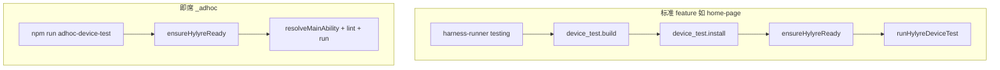
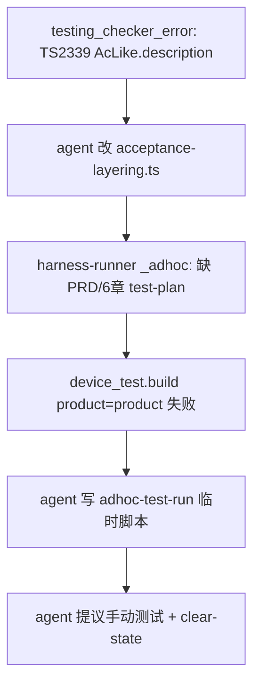

# Skill 6 真机测试：为何还要手动装 Hylyre + 单机失败链诊断

## 结论摘要

| 问题 | 结论 |
|------|------|
| **1. 为何还让我自己装？** | **不是** harness 设计如此。Hylyre 的 venv/pip/doctor 由 **`ensureHylyreReady`** 在 `device_test.run` 或 **`npm run adhoc-device-test`** 内自动执行。截图文案来自 **agent 未跑 ensure 就下结论**，且违反 [`.cursor/rules/framework-agent-execution.mdc`](.cursor/rules/framework-agent-execution.mdc)（禁止把 `pip install` / 删 venv 作为用户唯一出路）。 |
| **2. 为何有时成功有时一堆错？** | 你贴的日志是 **失败链叠加**，不是「Hylyre 随机坏」：先 **check-testing.ts 编译失败** → agent **误改 framework** → 又用 **`harness-runner --feature _adhoc`**（即席错误入口）→ 文档/构建门禁继续 FAIL → 最后 **降级成手动测试**。其它电脑成功，往往是因为走了正确入口、framework 版本较新、或没有 `HYLYRE_PYTHON`/脏 venv 等宿主因素。 |

---

## 1. Framework 设计的真实安装路径（SSOT）



**文档依据**（已实现于本仓库）：

- [framework/skills/6-device-testing/SKILL.md](framework/skills/6-device-testing/SKILL.md) Step 4.B：**即席禁止** `harness-runner --phase testing --feature _adhoc`；**首选** `npm run adhoc-device-test`（内部 `ensureHylyreReady`）。
- 同文件 Step 7 / profile addendum：**用户不直接执行** pip/删 venv；agent 自跑 testing harness 时 ensure 自动完成（`HYLYRE_PYTHON` / `auto_install=false` 除外）。
- [framework/profiles/hmos-app/skills/6-device-testing/profile-addendum.md](framework/profiles/hmos-app/skills/6-device-testing/profile-addendum.md) §Hylyre：vendor wheel → `.hylyre/venv` → pip → 可选 doctor。
- 实现：[framework/harness/scripts/adhoc-device-test.ts](framework/harness/scripts/adhoc-device-test.ts) L157–167 在 run 前调用 `ensureHylyreReady`；[device-test-run.ts](framework/profiles/hmos-app/harness/providers/device-test-run.ts) L408+ 为 ensure 实现。

**截图「Hylyre Python 模块未安装，无法直接跑自动化」**：在 framework 源码中 **无** 此固定话术（已检索）。属于 agent 在 **未执行 ensure** 或 **ensure 从未被调用**（前置 checker 崩溃）时的 **即兴 A/B 选项**，与 Skill / `framework-agent-execution` **冲突**。

**正确 agent 行为（即席）**：

1. 读 Skill 6 + hmos-app profile addendum。
2. 直接 Shell：`cd framework/harness && npm run adhoc-device-test -- --bundle com.huawei.hmos.wallet --steps "…"`（或先 `derive-adhoc-hylyre-hint`）。
3. ensure 失败时读 `doc/features/_adhoc/testing/reports/hylyre-doctor.log` / `hylyre-ready.meta.json`，**在本对话内修宿主因素并重跑**；仅物理前置（连设备、解锁）可请用户配合。
4. **不得**提供「选项 A 手动 / 选项 B 你去 pip install」作为唯一路径。

---

## 2. 你提供日志的失败链（按时间顺序）

日志来自 **`WalletForHarmonyOS`** 工程的一次会话；与本 workspace `SimulatedWalletForHmos` 的 framework **可能版本不一致**，但机理相同。



### 2.1 第一层：真实的 framework 缺陷（应修，但与「单机」无关）

- `check-testing.ts` L884 使用 `c.description`，但 [`acceptance-layering.ts`](framework/harness/scripts/utils/acceptance-layering.ts) 中 `AcLike` **未声明** `description`（而 `AcceptanceSpec` 的 criteria 在 [`types.ts`](framework/harness/scripts/utils/types.ts) 中有 `description?: string`）。
- harness-runner 在 `require(check-testing.ts)` 时抛错 → 包装为 **`testing_checker_error`**（见 [harness-runner.ts L782–791](framework/harness/harness-runner.ts)）。
- **后果**：**整段 testing 检查未运行**，`ensureHylyreReady` **根本不会执行**——agent 若此时用 `python -m hylyre` 探测，会得到「未安装」，**误以为要用户手装**。

**处理**：在 `AcLike` 增加 `description?: string`（与 agent 临时补丁一致），并跑 `npm run test:unit`；这是 **全仓库** 应修的 bug，不是「只坏一台电脑」。

### 2.2 第二层：即席误用 harness-runner（设计级误用）

Skill 6 明确规定即席 **不跑** `harness-runner --feature _adhoc`。该路径仍会：

- 要求 `doc/features/_adhoc/` 下 **PRD / design / acceptance / 6 章 test-plan.md** 等正式 feature 产物；
- 对 **外部 bundle**（`com.huawei.hmos.wallet`）尝试 **本仓库 hvigor 构建/装机**（日志里 `product=product` 来自 [`detectProduct`](framework/profiles/hmos-app/harness/hvigor-runner.ts)：若 `build-profile.json5` 的 products 里真有名为 `product` 的条目，则 **并非检测错误**，而是工程声明如此；构建失败则是 **宿主工程/路径** 问题，不是 Hylyre）。

日志中 agent 随后写 `adhoc-test-run.ts/.js`、补简陋 `test-plan.md`，均属 **绕过门禁的旁路**，易引入更多噪声。

### 2.3 第三层：单机/宿主环境因素（其它电脑没有 → 这台有）

在 **ensure 已被调用** 的前提下，以下会导致「有时成功有时失败」，且 **不应** 通过改 framework 业务逻辑「碰运气」：

| 因素 | 现象 | 建议排查 |
|------|------|----------|
| **`HYLYRE_PYTHON` 已设置** | 指向的解释器 **无 hylyre** 或版本与 vendor manifest 不一致 → ensure **BLOCKER**，且 **不会** 自动 pip 升级该环境（profile addendum L79） | `echo %HYLYRE_PYTHON%` / 临时 `set HYLYRE_PYTHON=` 后重跑 adhoc CLI |
| **`.hylyre/venv` 损坏或半安装** | pip 中断、缺 contracts | 删除工程根 `.hylyre/venv` 后由 ensure **重建**（agent 执行，不要求用户 pip） |
| **Python 不可用 / &lt;3.10** | ensure 报「未找到 Python 3.10+」 | 安装 Python 或设置可用的 `HYLYRE_PYTHON` |
| **pip 网络 / 索引** | 首次安装 hypium/opencv 超时（默认 600s） | 看 `hylyre-doctor.log`；`framework.config.json` 已配 tuna 镜像；公司代理需宿主配置 |
| **npm 全局 config 污染** | 日志中大量 `sass_binary_site` 等 deprecated warn | 检查用户/全局 `.npmrc`，与 harness 无关但干扰判断 |
| **framework 子模块版本不一** | `WalletForHarmonyOS` vs `SimulatedWalletForHmos` 的 harness 不同步 | 对齐 framework git 提交；避免只在一仓打了 AcLike 补丁 |
| **harness 未 `npm install`** | Tier_1 未就绪 | `framework/harness` 下安装依赖（Skill 00 / host-harness-readiness） |

### 2.4 为何「AI 改 framework」不合理

- **合理**：修复已确认的 **AcLike 类型缺陷**（全环境复现的 TS 编译错误）。
- **不合理**：因 **走错 _adhoc + harness-runner**、**HYLYRE_PYTHON**、**构建 product** 等宿主问题去改 provider/临时脚本；其它机器能跑说明 **默认路径可用**。

---

## 3. 建议改进（Framework + Agent 协议）

### 3.1 Framework 代码（小步、可验证）

1. **修复 `AcLike.description?`** — [`acceptance-layering.ts`](framework/harness/scripts/utils/acceptance-layering.ts)；跑 `cd framework/harness && npm run test:unit`。
2. **harness-runner 对 `_adhoc` 显式引导**（可选增强）：在 [harness-runner.ts](framework/harness/harness-runner.ts) 检测到 `feature === '_adhoc'` 时，在 Step 1 打印 **BLOCKER 级提示**：「即席请使用 `npm run adhoc-device-test`，勿走 testing 文档门禁」，避免 agent 反复误用。
3. **adhoc-device-test 失败时输出 SSOT 路径**：ensure 失败时打印 `hylyre-doctor.log` / `hylyre-ready.meta.json` 绝对路径（已有 meta，可增强 console 一行摘要）。

### 3.2 Agent 规则强化（实例已部分存在）

- 在 Skill 6 Step 4.B 或 `framework-agent-execution` 增加 **禁止话术**：不得出现「选项 A 手动 / 选项 B 你安装 Hylyre」；即席失败只能 **重跑 adhoc CLI** 或报 **物理阻塞**（无设备）。
- 即席 **禁止** 提议 `harness-runner --feature _adhoc` 作为自动化入口（与现有 SKILL 一致，需执行层遵守）。

### 3.3 单机诊断清单（给用户/ agent 一次跑通）

在问题机器上 **只跑即席入口**（确认 framework 已含 AcLike 修复后）：

```bash
cd framework/harness && npm run adhoc-device-test -- \
  --bundle com.huawei.hmos.wallet \
  --steps "打开应用->点击添加管理卡片->点击添加卡片->点击非本机卡片"
```

失败则 **按顺序** Read：

1. `doc/features/_adhoc/testing/reports/hylyre-doctor.log`
2. `doc/features/_adhoc/testing/reports/hylyre-ready.meta.json`
3. 同目录 `device-test-run.log`

根据 `errors[].kind`（`import` / `install` / `doctor` / `config`）对照上表处理 **环境**，而非改 framework。

---

## 4. 与你截图场景的对应关系

- 设备已连接（`0119182416001322`）✓  
- Agent 称「Hylyre 未安装」→ 应改为：**先跑 `adhoc-device-test`（内含 ensure）**；若此前只跑了失败的 `harness-runner`，则 **从未安装**。  
- **不应**让用户选手动验证作为「推荐默认」；手动仅可作为 **ensure 与 hdc 均不可用** 时的最后手段，且须说明原因（日志引用）。

---

## 5. 实施优先级

| 优先级 | 项 | 类型 |
|--------|-----|------|
| P0 | 修复 `AcLike.description?` + unit test | framework bug |
| P0 | 即席统一走 `adhoc-device-test`；禁止 A/B 手装话术 | agent 协议 |
| P1 | harness-runner `_adhoc` 误用提示 | framework UX |
| P2 | 单机环境：清 `HYLYRE_PYTHON`、重建 venv、对齐 framework 版本 | 宿主运维 |

确认计划后，可在 Agent 模式下：先合入 AcLike 修复并跑 unit test，再在你当前工程上用 `adhoc-device-test` 复现/验证 ensure 日志。
