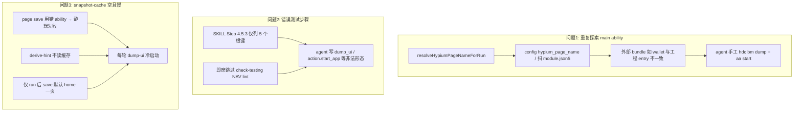
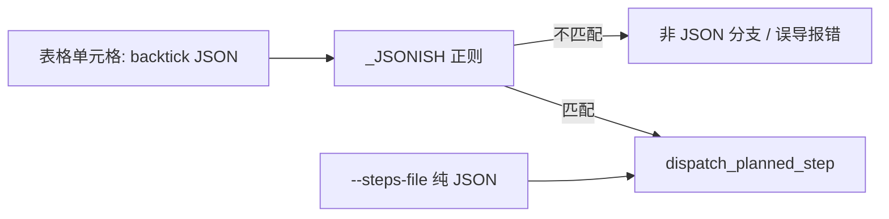
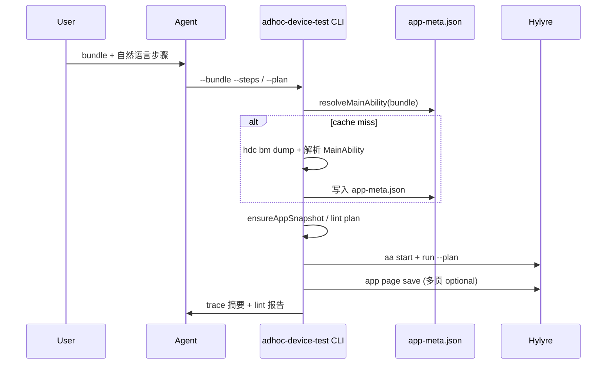

# Skill 6 即席真机测试优化方案

## 问题根因（与现有代码的对应关系）




| 现象                           | 根因                                                                                                                                                                                                                   | 现有代码位置                                                          |
| ---------------------------- | -------------------------------------------------------------------------------------------------------------------------------------------------------------------------------------------------------------------- | --------------------------------------------------------------- |
| 每次找不到 main ability           | 即席 bundle ≠ `AppScope` bundle 时，`[resolveHypiumPageNameForRun](framework/profiles/hmos-app/harness/providers/device-test-run.ts)` 仍读工程 `hypium_page_name` / 本地 `module.json5`                                        | L402–407                                                        |
| `start_app` / `dump_ui` 步骤报错 | agent 用 `{"action":{"type":"start_app"}}` 或把 CLI 命令当步骤键；SKILL 与 [profile-addendum](framework/profiles/hmos-app/skills/6-device-testing/profile-addendum.md) / wheel `planned_step_keys.py` 不一致                       | [SKILL.md L222–226](framework/skills/6-device-testing/SKILL.md) |
| `app-snapshot-cache` 始终空     | ability 错误导致 `[tryHylyreAppPageSaveAfterRun](framework/profiles/hmos-app/harness/providers/device-test-run.ts)` 非致命失败；派生管线 `[derive-hylyre-plan-hint.ts](framework/harness/scripts/derive-hylyre-plan-hint.ts)` 不读缓存 | 已有修复 CLI 形态，但未接 ability 发现                                      |


**关键联动**：问题 1 与问题 3 同源——`page save` 的 `--ability` 必须与目标 bundle 一致，否则缓存永远写不进去。

---

## 问题 4（新增）：同一用例第二次跑反而改半天 —— 原 plan **不能完整覆盖**，需补强

### 现象复盘（你提供的 transcript）


| 次序  | agent 行为                                                                                                       | 结果                               |
| --- | -------------------------------------------------------------------------------------------------------------- | -------------------------------- |
| 第一次 | 去掉 `start_app`；步骤用 `{"touch":{"by_text":"…"}}` / `{"scroll":…}`；手工 `aa start` 后跑 plan                          | **很快成功**                         |
| 第二次 | 误以为必须 `action` 包装 → 改成 `{"action":{"type":"touch","by_text":"…"}}`；按模板给 Markdown 单元格加 **反引号**；拆成 TC-001~006 多行 | plan 跑不通 → 改 `--steps` JSON 数组才通 |


### 技术根因（已读 Hylyre wheel 0.1.0 源码）

Hylyre `[scenario/runner.py](framework/profiles/hmos-app/vendor/hylyre/hylyre-0.1.0-py3-none-any.whl)` 内 `_execute_one_step` 逻辑：

1. 步骤字符串须匹配 `_JSONISH = /^\s*\{.*\}\s*$/` 才会 `json.loads` + `dispatch_planned_step`
2. **带反引号的单元格** `{"touch":…}` **不匹配** `_JSONISH` → 走「非 JSON」分支
3. 非 JSON 分支报错文案示例：`请使用 {"action":{"type":"touch","by_text":"…"}}` —— **这是误导**：该示例针对 NL/VLM 路径；只要 JSON 能 parse，**direct `touch` 与 `action` 包装均可**（`[step_dispatch.py](framework/profiles/hmos-app/vendor/hylyre/hylyre-0.1.0-py3-none-any.whl)` 分别 dispatch 到 `run_planned_tap` / `run_planned_action`）
4. `--steps` / `--steps-file` 走 `[steps_cmd.py](framework/profiles/hmos-app/vendor/hylyre/hylyre-0.1.0-py3-none-any.whl)`，**绕过** Markdown 表格解析 → 所以「JSON 文件能跑、md 表格不能跑」

Framework 侧同样未剥反引号：`[parsePlannedStepsFromCell](framework/harness/scripts/utils/derived-hylyre-plan.ts)` 直接 `JSON.parse(part)`；但即席**不跑** `check-testing`，lint 从未拦截。

模板 `[test-plan-hylyre-template.md](framework/profiles/hmos-app/skills/6-device-testing/templates/test-plan-hylyre-template.md)` **示例行仍用反引号**，且混用 `touch` 直写与 `action` 包装（L18 swipe），加剧 agent 格式漂移。




### 与原 plan 的覆盖关系


| 原 plan 项                 | 能否解决本问题    | 说明                                                                |
| ------------------------ | ---------- | ----------------------------------------------------------------- |
| STEP-001 根键校验            | 部分         | 两种 touch 形态 technically 都合法，无法阻止 agent 混用                         |
| STEP-003/004 禁 start_app | 无关         | 第二次失败主因不是 start_app                                               |
| adhoc CLI + lint         | **接近但不充分** | 若无 STEP-005 反引号门禁 + 模板去反引号，lint 仍可能漏过（agent 手写 plan 不经 normalize） |
| Skill 文档                 | 不足         | profile-addendum 已有「非 JSON 去反引号」文字，但模板反例与之矛盾，agent 仍跟模板           |


**结论**：原 plan 完成后，问题 1/2/3 会明显缓解，但 **「同一用例第二次反而失败」需新增轨道 2B（格式 canonical + 反引号）与 adhoc CLI 的 steps-file 兜底**，否则仍会复发。

---

## 目标架构




---

## 轨道 1：App 元数据与 Main Ability 自动发现（P0）

### 1.1 新增 `discoverMainAbilityFromBmDump`

**文件**：`[framework/profiles/hmos-app/harness/hdc-runner.ts](framework/profiles/hmos-app/harness/hdc-runner.ts)`（复用已有 `[runHdcShellBmDump](framework/profiles/hmos-app/harness/hdc-runner.ts)`）

解析策略（由严到宽）：

1. JSON 路径：`abilityInfos[]` 中 `launchType=standard` 且 `visible=true` 的 `name`
2. 文本 fallback：`"MainAbility"` / `"EntryAbility"` / 首个 `"*Ability"` 出现在 `abilityInfos` 块
3. 失败时返回 `null` + 原始 dump 节选（供 meta 日志）

### 1.2 分层解析 `resolveMainAbilityForBundle`

**新模块**：`framework/profiles/hmos-app/harness/resolve-main-ability.ts`

优先级：

1. 调用方显式 `hypiumPageName` / `--ability`
2. `framework.config.json` → `tools.hylyre.bundle_abilities[bundle]`（**新增可选 map**，适合 wallet 等已知包）
3. `doc/app-snapshot-cache/<bundle>/app-meta.json` → `mainAbility`
4. 若 `bundle === AppScope.bundleName`：现有 `hypium_page_name` → `discoverEntryMainElement`
5. **否则**：`bm dump` 在线发现 → 写回 `app-meta.json`

`app-meta.json` 形态（framework 契约，不入 Hylyre wheel）：

```json
{
  "bundleName": "com.huawei.hmos.wallet",
  "mainAbility": "MainAbility",
  "source": "bm_dump",
  "discoveredAt": "2026-05-20T12:00:00Z",
  "deviceSn": "025EYG..."
}
```

### 1.3 接入 `runHylyreDeviceTest`

修改 `[device-test-run.ts](framework/profiles/hmos-app/harness/providers/device-test-run.ts)`：

- 用 `resolveMainAbilityForBundle(opts.projectRoot, opts.bundleName, opts.hypiumPageName)` 替换直接调用 `resolveHypiumPageNameForRun`
- `tryHylyreAppPageSaveAfterRun` 传入同一 `abilityName`
- `device-test-run.meta.json` 增加 `main_ability_source` / `app_meta_path`

**配置模板**：`[framework/templates/framework.config.template.json](framework/templates/framework.config.template.json)` 增加 `tools.hylyre.bundle_abilities` 示例注释。

---

## 轨道 2：计划校验与步骤生成辅助（P0）

### 2.1 扩展 `lintDerivedHylyrePlanSteps`

**文件**：`[framework/harness/scripts/utils/derived-hylyre-plan.ts](framework/harness/scripts/utils/derived-hylyre-plan.ts)`

新增规则（与 wheel SSOT 对齐）：

- **STEP-001**：每步 JSON 根键 ∈ `PLANNED_STEP_ROOT_KEYS`（从 vendor wheel 同步常量表到 `framework/harness/scripts/utils/hylyre-planned-step-keys.ts`，避免 agent 幻觉）
- **STEP-002**：禁止 `dump_ui` / `dump-ui` / `page_save` 等 CLI 名作为根键
- **STEP-003**：当 harness 已做 `aa start` 预启时，步骤列禁止出现 `start_app`（防重复冷启；前置条件写「已启动 app」即可）
- **STEP-004**：禁止 `{"action":{"type":"start_app"}}` 等嵌套 start 形态（引导省略或 `{"start_app":{}}`）
- **STEP-005（新增 · 针对问题 4）**：步骤单元格禁止 Markdown 反引号包裹（检测 `{"touch":…}`）；`suggested_fix`: 去掉反引号
- **STEP-006（新增 · canonical 形态）**：即席/派生生成的 touch/input/swipe/scroll/back **优先且仅推荐** direct 根键形态，如 `{"touch":{"by_text":"添加管理卡片"}}`；`action` 包装降级为 WARN（不 BLOCKER），避免 agent 在两种合法形态间来回改

新增工具函数 `**normalizePlannedStepsCell(raw: string): string`**：

- 逐步 strip 首尾 ``` / 空白
- `；` → `;`
- 供 lint 与 adhoc CLI **写盘前** 自动 normalize（即使 agent 手写了反引号也能跑）

导出 `lintHylyrePlanMarkdown(planMd, opts?: { forbidStartApp?: boolean; canonicalTouch?: boolean })`，供标准 testing 与即席共用。

### 2.1.1 Hylyre 误导性报错 → Skill 固定解读（文档）

在 Skill 6 / profile-addendum 增加 **「报错对照表」**：


| Hylyre 报错关键词                    | 真实含义                        | agent 应先做                                      |
| ------------------------------- | --------------------------- | ---------------------------------------------- |
| 「非 JSON 的步骤需要连接 VLM」+ action 示例 | 步骤字符串未被识别为 JSON（**常见：反引号**） | 检查反引号 → 跑 `lintHylyrePlanMarkdown` → normalize |
| `start_app` 无效                  | 可能用了 `action.type` 嵌套或重复冷启  | 删步骤内 start_app；预启交给 harness                    |
| `--steps` 能跑、`--plan` 不能        | Markdown 表格解析问题             | 用 adhoc CLI 生成的 **无反引号** plan 或 `--steps-file` |


### 2.2 即席派生 hint CLI

**新脚本**：`framework/harness/scripts/derive-adhoc-hylyre-hint.ts`

输入：

```bash
npx ts-node scripts/derive-adhoc-hylyre-hint.ts \
  --bundle com.huawei.hmos.wallet \
  --steps "打开应用->点击添加管理卡片->..." \
  [--project-root ...] [--out ...]
```

输出 JSON（schema 4）：

- `natural_steps[]`：拆分后的 NL 步骤
- `navigation_hint`：复用 `[buildNavigationHintForCase](framework/harness/scripts/utils/test-plan-derive-hint.ts)`
- `snapshot_cache_empty: boolean`
- `selector_hints[]`：若 `doc/app-snapshot-cache/<bundle>/pages/*.json` 存在，扫描 JSON 内 text/id 与 NL 模糊匹配（轻量字符串匹配即可，不依赖 Hylyre runtime）
- `allowed_step_roots`：来自 STEP-001 表
- `forbidden_in_steps`：`["start_app", "dump_ui", ...]`

同步扩展 `[derive-hylyre-plan-hint.ts](framework/harness/scripts/derive-hylyre-plan-hint.ts)`：读取 `AppScope` bundle 对应 cache，输出 `snapshot_cache_empty` + `available_pages[]`（实现 [.cursor/plans/快照缓存与耗时报告_b774a610.plan.md](.cursor/plans/快照缓存与耗时报告_b774a610.plan.md) 中未完成项）。

---

## 轨道 3：即席编排 CLI（P0，用户选择「两者都要」）

### 3.1 新入口 `adhoc-device-test.ts`

**路径**：`framework/harness/scripts/adhoc-device-test.ts`  
**npm script**：`framework/harness/package.json` → `"adhoc-device-test": "ts-node scripts/adhoc-device-test.ts"`

```bash
cd framework/harness && npm run adhoc-device-test -- \
  --bundle com.huawei.hmos.wallet \
  --steps "打开应用->点击首页的添加管理卡片->..." \
  [--ability MainAbility] \
  [--plan path/to/test-plan.hylyre.md] \
  [--skip-explore]
```

固定流水线（agent **首选**此路径，不再手工拼 hdc/hylyre）：

1. `dispatchDeviceTestEnsureReady(feature=_adhoc)`
2. `resolveMainAbilityForBundle` + 写 `app-meta.json`
3. 若 cache 空且未 `--skip-explore`：`ensureAppSnapshotWarmup`（见轨道 4）
4. 若无 `--plan`：根据 `--steps` + hint 生成产物（**问题 4 关键变更**）：
  - **默认**：单 TC（`TC-001`）合并全部步骤到一行，避免多 TC 单会话 Nav 污染
  - 同步写 `**test-steps.json`**（Hylyre `--steps-file` 消费的纯 JSON 数组，canonical direct 根键）
  - 写 `**test-plan.hylyre.md`**（7 列表格，**禁止反引号**，经 `normalizePlannedStepsCell`）
5. `lintHylyrePlanMarkdown` → 失败则 exit 2 + 写 `plan-lint.json`（含 STEP-005 反引号命中）
6. `runHylyreDeviceTest`；内部优先 `hylyre run --plan`；若 plan lint 仅 STEP-005 且 normalize 后仍失败，**fallback** `hylyre run --steps-file test-steps.json`（同 trace/report 路径）
7. 打印 `trace.json` cases 摘要 + 使用的 plan/steps-file 路径

可选：在 `[harness-runner.ts](framework/harness/harness-runner.ts)` 增加 `--phase adhoc-testing` 薄封装，内部调用同一模块（**不写** `.current-phase.json` 闭环 state，保持即席旁路语义）。

---

## 轨道 4：Snapshot 缓存暖启动与可复用（P1）

### 4.1 `ensureAppSnapshotWarmup`

**新模块**：`framework/profiles/hmos-app/harness/app-snapshot-warmup.ts`

触发条件：`doc/app-snapshot-cache/<bundle>/pages/` 为空或 `app-meta.json` 刚新建。

动作：

1. `aa start`（已解析 ability）
2. `python -m hylyre dump-ui` → 写临时 ui tree
3. `python -m hylyre app page save <bundle> home [--ability ...]`
4. （可选 P2）按 NL 步骤中的关键词，执行 touch 链后逐页 `page save`（slug 来自步骤语义，如 `card-list`）

失败策略：

- warmup 失败 → adhoc CLI exit 1，**明确提示** ability / 设备 / 权限
- run 后 page save 失败 → 在 stdout/meta 标 **WARN**（比当前静默更可观测）

### 4.2 标准模式派生也读缓存

Skill 6 Step 4.5.2 第 3 步改为**机器可执行**：

- agent 跑 derive hint 时若 `snapshot_cache_empty: true`，必须先 warmup 或 dump-ui，再写派生 plan
- `[profile-addendum.md](framework/profiles/hmos-app/skills/6-device-testing/profile-addendum.md)` 补充「cache 命中则禁止重复 dump-ui」

### 4.3 跨会话复用边界（文档说明）

- 缓存仍在 `.gitignore`，**本机持久**、不入库（符合现有设计）
- 团队共享可选后续：导出 `app-meta.json` + 精选 pages 到 `doc/extensions/device-testing/fixtures/<bundle>/`（**本 plan 不实现**，仅在 MIGRATION 记 extension 钩子）

---

## 轨道 5：Skill / 文档对齐（P1）

更新 `[framework/skills/6-device-testing/SKILL.md](framework/skills/6-device-testing/SKILL.md)` Step 4.B：


| 现状                           | 改为                                                                  |
| ---------------------------- | ------------------------------------------------------------------- |
| agent 分步调 dispatch + 手写 plan | **首选** `npm run adhoc-device-test`；失败再看 lint 报告修 plan               |
| Step 4.5.3 仅 5 根键            | 与 profile-addendum + `hylyre-planned-step-keys.ts` 一致；显式列 **禁止** 项  |
| 未强调 start_app 纪律             | 「预启由 harness 完成；步骤列只写 touch/back/…；前置条件写已启动」                        |
| 探索顺序纯文字                      | 必须先读 `derive-adhoc-hylyre-hint` 输出；`snapshot_cache_empty` 时跑 warmup |


更新 `[profile-addendum.md](framework/profiles/hmos-app/skills/6-device-testing/profile-addendum.md)`「即席模式」节：CLI 用法、app-meta 路径、lint 规则 ID。

**重点修正模板（问题 4）**：`[test-plan-hylyre-template.md](framework/profiles/hmos-app/skills/6-device-testing/templates/test-plan-hylyre-template.md)`

- **删除所有步骤列反引号**（L18–23 每格改为裸 JSON）
- **统一 canonical 形态**：touch/scroll/swipe/back 全部用 direct 根键；移除 `{"action":{"type":"swipe",…}}` 混用示例
- 前置条件示例：「已启动 app（harness aa start 预启，步骤不含 start_app）」
- 注释：「Hylyre `_JSONISH` 不识别反引号；勿模仿带 backtick 的旧示例」

---

## 测试与验收


| 场景             | 验收标准                                                                                        |
| -------------- | ------------------------------------------------------------------------------------------- |
| 外部 bundle 首次即席 | 无手工 bm dump；生成 `app-meta.json`；`aa start` 成功                                                |
| 同 bundle 第二次   | 读 cache ability；跳过 bm dump；派生 hint 含 selector_hints                                         |
| 错误 plan        | `lintHylyrePlanMarkdown` 拦截 `dump_ui` / 嵌套 start_app / **反引号 STEP-005**；输出 `plan-lint.json` |
| **问题 4 回归**    | 同一 NL 步骤连续跑两次：第二次不因 agent 改 action 包装或加反引号而失败；adhoc CLI 产出 normalize 后的 plan + steps-file   |
| steps-file 兜底  | 故意写带反引号的 plan → CLI normalize 或 fallback `--steps-file` 仍 PASS                              |
| run 成功后        | `doc/app-snapshot-cache/<bundle>/pages/home.json` 非空；meta 中 `hylyre_page_save.exit_code: 0` |
| 单测             | `resolve-main-ability` bm dump 解析；STEP-001~004 lint；adhoc CLI argv 拼装                       |


单测落点：`framework/harness/tests/unit/`（与现有 `[derived-hylyre-plan.unit.test.ts](framework/harness/tests/unit/derived-hylyre-plan.unit.test.ts)` 同级）。

---

## 改动文件清单（Framework 优先）


| 文件                                                                                           | 动作                                         |
| -------------------------------------------------------------------------------------------- | ------------------------------------------ |
| `framework/profiles/hmos-app/harness/hdc-runner.ts`                                          | 扩展 bm dump 解析                              |
| `framework/profiles/hmos-app/harness/resolve-main-ability.ts`                                | **新增**                                     |
| `framework/profiles/hmos-app/harness/app-snapshot-warmup.ts`                                 | **新增**                                     |
| `framework/profiles/hmos-app/harness/providers/device-test-run.ts`                           | 接入 resolve + meta                          |
| `framework/harness/scripts/utils/hylyre-planned-step-keys.ts`                                | **新增**（同步 wheel）                           |
| `framework/harness/scripts/utils/derived-hylyre-plan.ts`                                     | STEP-001~006 + `normalizePlannedStepsCell` |
| `framework/profiles/hmos-app/skills/6-device-testing/templates/test-plan-hylyre-template.md` | **去反引号 + canonical 形态**                    |
| `framework/harness/scripts/derive-adhoc-hylyre-hint.ts`                                      | **新增**                                     |
| `framework/harness/scripts/adhoc-device-test.ts`                                             | **新增**                                     |
| `framework/harness/scripts/derive-hylyre-plan-hint.ts`                                       | snapshot_cache_empty                       |
| `framework/skills/6-device-testing/SKILL.md`                                                 | Step 4.B / 4.5.3                           |
| `framework/profiles/hmos-app/skills/6-device-testing/profile-addendum.md`                    | 即席 CLI 节                                   |
| `framework/templates/framework.config.template.json`                                         | bundle_abilities                           |
| `framework/harness/package.json`                                                             | npm script                                 |


**Hylyre vendor（可选 P2，非 MVP 阻塞）**：

- 在 Hylyre `_iter_steps` / `_execute_one_step` 入口 strip 首尾反引号（防御性，避免第三方 plan 带 backtick）
- 修正非 JSON 分支报错文案：先提示「检查反引号/JSON 语法」，不要把 `action` 包装写成唯一正解
- 需 Hylyre 仓库发新版 wheel 后同步 `framework/profiles/hmos-app/vendor/hylyre/`

---

## Hylyre 依赖边界（是否必须改 Hylyre 代码？）

**结论：MVP 不要求改 Hylyre 源码。** 当前 vendor wheel **0.1.0** 已具备 plan 所需的全部 CLI 能力；所有 P0 改动落在 **framework + Skill 文档**。

### 现有 Hylyre 能力（本 plan 直接消费，无需 fork）


| 能力            | CLI / 模块                                             | plan 用途                     |
| ------------- | ---------------------------------------------------- | --------------------------- |
| 跑 Markdown 计划 | `hylyre run --plan`                                  | 标准 / 即席主路径                  |
| 跑纯 JSON 步骤    | `hylyre run --steps` / `--steps-file`                | 即席兜底（绕过 md 表格反引号问题）         |
| UI 探索         | `hylyre dump-ui`                                     | snapshot warmup             |
| 页面快照          | `hylyre app page save <BUNDLE> <SLUG> [--ability …]` | app-snapshot-cache 写入       |
| 步骤 dispatch   | `planned_step_keys` + `step_dispatch`                | lint 常量 SSOT（只读 wheel，不改代码） |
| 设备预启          | harness 侧 `hdc aa start`（非 Hylyre）                   | main ability 对齐             |


### Framework 侧需补的 Hylyre 调用（不是改 Hylyre）

- `[device-test-run.ts](framework/profiles/hmos-app/harness/providers/device-test-run.ts)`  today 只拼 `run --plan`；adhoc fallback 需在 **framework** 增加 `--steps-file` 分支（Hylyre CLI 已支持，只是 harness 还没接）
- plan 写盘前 `normalizePlannedStepsCell`、lint STEP-005 —— 全在 framework

### 可选 Hylyre 改动（P2 · 体验增强，非阻塞）


| 改动                                      | 价值                        | 不做时的 framework 替代                            |
| --------------------------------------- | ------------------------- | -------------------------------------------- |
| runner 入口 strip 反引号                     | 第三方 plan 带 backtick 也能跑   | framework normalize + 模板去反引号                 |
| 非 JSON 报错改文案                            | 减少 agent 误判「必须 action 包装」 | Skill 报错对照表 + lint STEP-005                  |
| `run --steps-file` 也写完整 trace/report 契约 | 与 `--plan` 产物形态更一致        | adhoc CLI 侧分别调用现有 report 命令（若 0.1.0 已够用则不必改） |


### 版本与同步约定

- **MVP**：继续 pin `framework/profiles/hmos-app/vendor/hylyre/hylyre-0.1.0-py3-none-any.whl`，不升版
- **若做 P2**：在 Hylyre 仓库 PR → 发新 wheel → 更新 `release.manifest.json` + framework vendor 目录（走现有 vendor 同步流程，见 `vendor/hylyre/README.md`）
- **验收**：MVP 验收不依赖 Hylyre 新版本；P2 单独开 issue/PR 跟踪

> **完整 Hylyre 修改需求（可复制到 Hylyre 仓库）**见本文末尾 **「附录：Hylyre 侧修改需求全文」**。

---

## 实施顺序建议

1. **轨道 2B（问题 4 · 与轨道 2 并行 P0）**：STEP-005/006 + 模板去反引号 + `normalizePlannedStepsCell` —— **投入最小、直接阻止「第二次改半天」**
2. **轨道 1**（ability 发现 + app-meta）—  unblock page save，直接缓解问题 1 和 3
3. **轨道 2 + 3**（lint + adhoc CLI + steps-file 兜底）— 问题 2 + 稳定一键路径
4. **轨道 4**（warmup）— 首轮体验与速度
5. **轨道 5**（Skill 文档 + 报错对照表）— 与代码同步下发
6. **Hylyre vendor P2**（可选）— 根因层防御

预估：轨道 **2B+2+3** 为 MVP（约 1–2 天）；轨道 1/4 可并行；Hylyre vendor 独立排期。

---

## 附录：Hylyre 侧修改需求全文（可复制到 Hylyre 仓库）

> 基于 vendor wheel **0.1.0** 源码与 Framework Skill 6 即席真机集成现场问题整理。

### A. 背景与集成关系

Framework（Skill 6）通过子进程调用：

- `python -m hylyre run --plan <test-plan.hylyre.md> --feature … --report-out … --trace-out … [--bundle …]`
- `python -m hylyre run --steps-file <steps.json> [--bundle … --page-name …]`（即席兜底）
- `python -m hylyre dump-ui` / `app page save <BUNDLE> <SLUG> [--ability …]`

环境变量：`HYLYRE_APP_STORE_DIR=<project>/doc/app-snapshot-cache`。

Framework 可能在 `run --plan` 前已执行 `hdc shell aa start -a <MainAbility> -b <bundle>`，成功后省略 `--bundle`。

### B. 现场问题与前因后果

**B1. Markdown 反引号 → 步骤不被识别为 JSON（Hylyre P0）**

- 表格步骤列常见：`` `{"touch":{"by_text":"…"}}` ``
- `runner.py` 中 `_JSONISH = /^\s*\{.*\}\s*$/` 不匹配带反引号字符串 → 走「非 JSON」分支
- 无 VLM 时报错示例只给 `{"action":{"type":"touch",…}}` → agent 误判必须 action 包装；实际 direct `touch` 与 `action` 包装在 JSON 能 parse 时均合法（`step_dispatch.py`）

**B2. `run --plan` 不传 page_name（Hylyre P1）**

- `run_plan_on_agent` 调用 `start_app(bundle)` 无 `page_name`
- `run --steps-file` 已有 `--page-name` → 两路径不一致，Framework 需 hdc 预启 workaround

**B3. `--steps-file` 无 report/trace 契约（Hylyre P2）**

- `--plan` 要求 `--report-out` + `--trace-out`
- `--steps-file` 仅输出 batch results JSON，Framework 无法统一 Skill 6 报告合成

**B4. 文档示例混用 direct / action 形态（Hylyre P2 · 文档）**

### C. 优化原则

1. Plan 解析宽容（strip 反引号），执行严格（dispatch 不变）
2. 报错 actionable，列两种合法 touch 示例，不暗示 action 唯一
3. `--plan` 与 `--steps-file` 在 page_name、report/trace 上对齐
4. 文档 SSOT：推荐 direct 根键

### D. 具体修改项

| ID | 优先级 | 文件 | 改动摘要 |
|----|--------|------|----------|
| D1 | P0 | `scenario/runner.py`（+可选 `plan_parse._split_row`） | 新增 `normalize_planned_step_text()`，strip 首尾 `` ` ``；接入 `_iter_steps` / `_execute_one_step` |
| D2 | P0 | `scenario/runner.py` `_execute_one_step` | 非 JSON 报错：先提示反引号/语法；推荐 `{"touch":…}` + 兼容 `{"action":…}` |
| D3 | P1 | `cli/__main__.py`, `run_cmd.py`, `scenario/runner.py` | `run --plan` 增加 `--page-name`，传入 `start_app(..., page_name=)` |
| D4 | P2 | `cli/__main__.py` + 新 helper | `--steps-file` + `--report-out`/`--trace-out`/`--feature` 时合成与 plan 同 schema 报告 |
| D5 | P2 | `docs/agent-plan-a.md` 等 | Canonical direct 根键；禁 CLI 名作步骤键；表格勿用反引号 |
| D6 | P3 | `api/agent.py` | start_app 失败时提示 `--page-name` 或 hdc 预启 |

**D1 验收**：`` `{"touch":{"by_text":"OK"}}` `` 与无反引号行为等价；多步 `;` 分隔均 OK。

**D3 验收**：`hylyre run --plan … --bundle X --page-name MainAbility` 冷启成功。

**D4 验收**：steps-file 路径产出可被 Framework `trace.json` cases[] 消费。

### E. 非 Hylyre 职责

bm dump 发现 MainAbility、app-snapshot-cache 注入、plan lint、adhoc CLI、harness 文档门禁 → Framework。

### F. 发版建议

- **0.1.1**：D1 + D2 + D3
- **0.2.0**：D4 + D5

Framework 同步：更新 vendor wheel + `release.manifest.json` + 冒烟。
