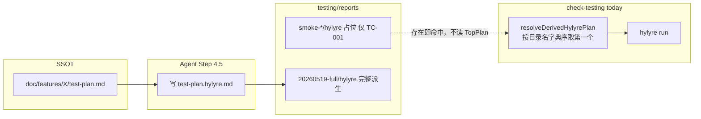

# Skill 6 派生计划应以 test-plan 为 SSOT（修正方案）

## 一、为什么「Skill 6 自己搞不定」——设计分层，不是能力缺失

当前架构是**刻意拆分**的两段式（见 [skill6 端到端自动派生 plan](.cursor/plans/skill6_端到端自动派生_0a3f4669.plan.md) 与 [SKILL.md Step 4.5](framework/skills/6-device-testing/SKILL.md)）：

| 角色 | 职责 | 能否把 15 条自然语言步骤自动变成 Hylyre JSON |
|------|------|---------------------------------------------|
| **Agent（Skill 6 Step 4.5）** | 读 `test-plan.md` → 查 contracts/design/快照 → 写 `test-plan.hylyre.md` | **可以**（需语义与 selector，非纯脚本） |
| **Harness（`check-testing.ts`）** | build/install → 找已有 `test-plan.hylyre.md` → `hylyre run` | **不能**（无 VLM/设计上下文，仅有解析表结构的 hint CLI） |

因此：**不是 Skill 6「应该全自动却坏了」**，而是 **文档/agent 流程要求 Step 4.5 先派生，harness 只消费产物**；你们遇到的痛点是 **harness 在「已有任意派生文件」时误以为任务已完成**，从未对照 `test-plan.md` 问「要不要补」。



**为何不能把 JSON 派生完全放进 harness（性能/正确性）**

- **正确性**：TC-003～015 依赖卡包/加号/飞行模式等，selector 来自 [contracts.yaml](doc/features/home-page/contracts.yaml) / [design.md](doc/features/home-page/design.md) 或 `dump-ui`，脚本无法可靠从自然语言 `<br/>` 步骤一键生成合法 Hylyre JSON。
- **性能**：全量自动派生若走 Hylyre/VLM 会极慢且不稳定；**确定性门禁**（对比 TC 集合 + mtime/hash）应为 O(读 2 个 md 文件 + 可选 stat)，不增加设备侧耗时。

---

## 二、根因：代码里具体怎么「变成只看 reports」

### 2.1 选派生文件：存在即用，与 test-plan 无关

[`resolveDerivedHylyrePlan`](framework/harness/scripts/check-testing.ts)（约 1461–1479 行）逻辑：

1. 扫描 `doc/features/<feature>/testing/reports/` 下**所有子目录**；
2. **按目录名字符串 `.sort().reverse()`**，取第一个含 `hylyre/test-plan.hylyre.md` 的目录；
3. **不读** `doc/features/<feature>/test-plan.md`；
4. **不比较** mtime、hash、TC 数量。

后果：

- [smoke-20260518/.../test-plan.hylyre.md](doc/features/home-page/testing/reports/smoke-20260518/hylyre/test-plan.hylyre.md) 写明「烟测占位」，但 harness **仍视为合法派生计划**；
- 目录名 `smoke-20260518` 在字典序上常**晚于** `20260519-...`（首字符 `s` > `2`），会**长期压过**按时间戳命名的新目录——「最新」启发式本身也有 bug。

### 2.2 一致性检查：只做单向子集

[`verifyDerivedPlanTcConsistency`](framework/harness/scripts/check-testing.ts)（约 1482–1492 行）仅检查：

- **派生 TC ⊆ 顶层 TC**（不能有凭空 TC-999）；
- **不检查** 顶层 TC ⊆ 派生（允许只派生 1 条而顶层 15 条）。

与 [verify-testing.md 检查 7](framework/harness/prompts/verify-testing.md) 文案「顶层 ⊇ 派生」一致，但**未要求**「该自动化的必须已派生」。

### 2.3 缺派生时的 hint：仅在「完全没有文件」时触发

[`writeDeriveHintFromPlanJson`](framework/harness/scripts/check-testing.ts) 仅在 `!derivedPlan.exists` 时写入 [derive-hint-from-plan.json](doc/features/home-page/testing/reports/derive-hint-from-plan.json)。

**有部分占位文件时不会 FAIL、不会写 hint**——这正是烟测占位「绑架」后续 Skill 6 的路径。

### 2.4 Agent 侧缺口

Step 4.5 写在 SKILL 里，但 **harness PASS 不强制 agent 已执行 Step 4.5**；agent 可直接 `harness-runner testing`，命中旧 smoke 即得到「自动化已跑」的错觉。

---

## 三、目标行为（你已选：BLOCKER）

以 **`doc/features/<feature>/test-plan.md` 为 SSOT**：

1. 解析顶层计划全部 `TC-xxx`；
2. 解析当前选中的派生计划全部 `TC-xxx`；
3. 若存在 **顶层有、派生无** 的 TC → **`device_test_run` BLOCKER FAIL**，并写出结构化 hint（含 `missing_tc_ids` / `derived_tc_ids` / `source_plan_mtime`）；
4. **烟测占位**（可检测 frontmatter/引用块关键词）→ 视为**无效派生**，等同不存在，走「缺派生」或「不完整」分支；
5. **选目录**：优先 **mtime 最新** 的有效派生，而非纯字典序；可选 **显式指针** 避免歧义。

「无法 JSON 化」的 TC 仍可在 Step 4.5 由 agent **显式跳过**（不写入 hylyre 表），但须在派生元数据或 hint 中登记，避免 harness 误以为「漏派生」——见下节「跳过登记」。

---

## 四、推荐实现（framework 源头，兼顾性能与正确性）

### 4.1 新增模块（小、可单测）

新建 [`framework/harness/scripts/utils/derived-hylyre-plan.ts`](framework/harness/scripts/utils/derived-hylyre-plan.ts)（名称可微调），导出：

| 函数 | 作用 |
|------|------|
| `extractTcIdsFromPlanTable` | 从现有 check-testing 抽出复用 |
| `isPlaceholderDerivedPlan(md)` | 检测 `烟测占位` / `placeholder` / `do not use for production` 等约定标记 |
| `listDerivedPlanCandidates(reportsBase)` | 枚举 `*/hylyre/test-plan.hylyre.md`，带 `mtimeMs` |
| `selectDerivedPlanCandidate(candidates, topPlanStat)` | 选最新有效候选；过滤 placeholder |
| `evaluateDerivedCoverage(topIds, derivedIds, skipRegistry?)` | 返回 `{ ok, missing, extra, stale? }` |

**性能**：单次 harness run 仅 **1 次 readdir** + **读 1～2 个 md**（顶层 plan + 选中派生）；hash 可选且默认用 **`fs.stat` mtime 比较**（顶层 plan 新于派生文件 → `stale` BLOCKER），避免每次 sha256 全文件。

### 4.2 改造 `resolveDerivedHylyrePlan` → `resolveDerivedHylyrePlanWithCoverage`

在 [`check-testing.ts`](framework/harness/scripts/check-testing.ts) `checkDeviceTestRunGate` 中：

```text
topPlan = featureFilePath(..., 'test-plan.md')
topIds = extractTcIds(topPlan)
candidates = listDerivedPlanCandidates(reportsBase)
pick = selectBest(candidates) // 排除 placeholder；按 mtime 降序
if (!pick) → FAIL + writeDeriveHintFromPlanJson (existing)
derivedIds = extractTcIds(pick.path)
missing = topIds - derivedIds - explicitSkipIds
if (missing.length) → BLOCKER FAIL + writeDeriveHint extended payload
if (pick.mtime < topPlan.mtime) → BLOCKER stale (optional, 可配置)
else → run hylyre with pick.path
```

**显式跳过登记**（避免误 BLOCKER 无法 JSON 的 TC）——二选一，推荐 A：

- **A（轻量）**：派生文件 frontmatter YAML：
  ```yaml
  ---
  source_plan: doc/features/home-page/test-plan.md
  source_plan_mtime: "2026-05-19T..."
  explicit_skip_tc_ids: [TC-010, TC-014, ...]
  ---
  ```
- **B**：同目录 `derive-manifest.json`（与 hylyre 表并列，agent 维护）

Harness 读取后：`missing = topIds - derivedIds - explicit_skip_tc_ids`；若仍有 missing → BLOCKER。

### 4.3 扩展 `derive-hint-from-plan.json` / CLI

扩展 [`writeDeriveHintFromPlanJson`](framework/harness/scripts/check-testing.ts) 与 [`derive-hylyre-plan-hint.ts`](framework/harness/scripts/derive-hylyre-plan-hint.ts) payload：

- `top_tc_ids`, `derived_tc_ids`, `missing_tc_ids`, `explicit_skip_tc_ids`
- `selected_derived_path`, `rejected_candidates`（含 placeholder 路径）
- `next_agent_step` 指向 Step 4.5 + 模板路径

Agent 在 Skill 6 会话中：harness FAIL → 读 hint → 写**新** `testing/reports/<timestamp>/hylyre/`（勿覆盖 smoke 占位，或删除/移走 `smoke-*`）→ 重跑 harness。

### 4.4 可选：显式指针（低优先级，减少扫描）

`doc/features/<feature>/testing/reports/.active-hylyre-plan.json`：

```json
{ "path": "20260519-full/hylyre/test-plan.hylyre.md", "source_plan_mtime": "..." }
```

存在则 **O(1) 打开**，否则回退 mtime 扫描。适合 reports 下历史目录很多的实例。

### 4.5 文档与规约同步

| 文件 | 变更 |
|------|------|
| [framework/skills/6-device-testing/SKILL.md](framework/skills/6-device-testing/SKILL.md) Step 4.5 / 7 | 写明：harness **会以 test-plan 为 SSOT 校验派生覆盖**；占位目录无效；agent 须在新 `<timestamp>` 落盘 |
| [profile-addendum.md](framework/profiles/hmos-app/skills/6-device-testing/profile-addendum.md) | 占位约定、frontmatter、`explicit_skip_tc_ids` |
| [testing-rules.yaml](framework/specs/phase-rules/testing-rules.yaml) | `device_test_run` 描述增加「派生覆盖顶层计划或登记跳过」 |
| [verify-testing.md](framework/harness/prompts/verify-testing.md) | 检查 7 增加：抽样核对 missing 与 skip 登记 |

### 4.6 单测（必须，防回归）

在 [`framework/harness/tests/unit/`](framework/harness/tests/unit/) 新增 `derived-hylyre-plan.unit.test.ts`：

- placeholder 被忽略；
- 顶层 15 / 派生 1 → missing 14；
- `explicit_skip` 扣减后 missing 为空 → ok；
- 字典序 smoke  vs mtime 更新的目录 → 选 mtime；
- extra TC in derived → 仍 FAIL（保留现有行为）。

### 4.7 本仓库 home-page 落地动作（实现后）

1. 删除或移走 `smoke-20260518`（或保留但不再被选中）；
2. Agent 按 hint 从 [test-plan.md](doc/features/home-page/test-plan.md) 派生完整/分批评 `test-plan.hylyre.md`；
3. 重跑 `harness-runner --phase testing --feature home-page`。

---

## 五、明确「不做」的范围（避免过度工程）

- **不在 harness 内用 LLM/VLM 自动生成全部 JSON 步骤**（正确性不足、性能差）。
- **不强制派生表行数 = 顶层行数**（允许 `explicit_skip_tc_ids`）。
- **不在每次 run 前全量 `dump-ui`**（留给 agent Step 4.5）。

---

## 六、验收标准

1. 仅存在烟测占位 + 顶层 15 TC → `device_test_run` **BLOCKER**，hint 列出 `missing_tc_ids`。
2. 新派生目录 mtime 最新且覆盖（或登记 skip）→ harness **PASS**，Hylyre 跑完整派生集。
3. `npm run test:unit` 新增用例全绿。
4. Skill 6 文档与 verify-testing 与行为一致。
