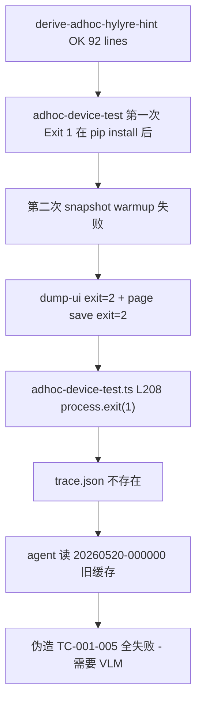

# Skill 6 真机自动化跨工程退化诊断与交付规约

> 本 plan 直接面向另一名实施 AI；现状分析在 §0–§1，落地细节在 §3–§10。每个 §3.x 都给出文件 / 行号 / 函数签名 / 关键代码骨架，最大化「拿来就能干」。

---

## 0. 现象与失败链

`WalletForHarmonyOS` 上同一 bundle/步骤，比 `SimulatedWalletForHmos` 表现差。Transcript 关键事实：



关键点：[adhoc-device-test.ts](framework/harness/scripts/adhoc-device-test.ts) L194–209 在 warmup 失败时直接 `process.exit(1)`，**`runHylyreDeviceTest` 从未执行，trace.json 从未写入**——agent 失去 SSOT，转去读 `20260520-000000`（看起来像凌晨 0 点的旧/占位目录）并捏造「需要 VLM」结论。

---

## 1. 根因分层

### 1.1 P0 · warmup 不健壮（直接命中本次失败）

[app-snapshot-warmup.ts](framework/profiles/hmos-app/harness/app-snapshot-warmup.ts) L67–123：

- `runAaStart` 完成后**立即** `python -m hylyre dump-ui`——钱包等大型 App 启动 1–3s 仍在 splash/loading，dump-ui 拿空 UI 或失败
- `runAaStart` 仅看 `r.status === 0`，**不验证 App 是否在前台**（锁屏 / 权限弹窗 / Ability 错 → aa start 返回 0 但 App 不在前台）
- `dump-ui` / `page save` 的 stderr 只追加到 `device-test-run.log`，**未结构化**为 `snapshot-warmup.meta.json`
- 失败统一回 `reason: 'page save did not populate cache'`——**掩盖**真实子原因

### 1.2 P0 · warmup 失败 = 整个 CLI 退出（架构问题）

```typescript
// framework/harness/scripts/adhoc-device-test.ts L205-209
if (!warm.ok && !warm.skipped) {
  console.error('snapshot warmup 失败:', warm.reason);
  console.error(warm.log);
  process.exit(1);   // ← 罪魁
}
```

- 即使 warmup 拿不到 home 页快照，**plan 本身 `touch by_text` 仍有机会成功**（Hypium 会在当前 UI 找文本）
- 但目前 CLI 直接退出，**`run --plan` 永远不被尝试**
- 没有 trace.json，agent 失去判定凭证

### 1.3 P0 · 无 anti-fabrication 契约

[adhoc-device-test.ts](framework/harness/scripts/adhoc-device-test.ts) L233–250 的 JSON 输出**只有成功路径**才会包含 `trace`。早期 exit 时：

- CLI 不写 `trace.json`
- 不打印 `ADHOC_TRACE_FILE=` 锚点
- 没有契约阻止 agent 去 glob `doc/features/_adhoc/testing/reports/*/hylyre/` 取「最近」目录

→ Transcript 中 agent 读 `20260520-000000` 当真，**完全在 framework 容忍范围内**。

### 1.4 P1 · 跨机差异的真正来源（非版本漂移）

> 已确认两边 framework 完全同步，排除版本因素。

| 维度 | SimulatedWalletForHmos | WalletForHarmonyOS |
|------|-------------------------|---------------------|
| 设备 SN | `3UJ0225327004147` | `025EYG238F174878` |
| `doc/app-snapshot-cache/<wallet>/` | 已有上次成功跑的 `app-meta.json`（`app_meta_cache` 命中） | 全新空目录 → 必须走 `bm dump` 推断（可能错 / 失败） |
| wallet App 状态 | 已通过隐私/登录、卡片已加载 | 可能首次启动、需手动通过弹窗 |
| 设备 API / Hypium agent | 6.0.2.3 + agent 1.2.2 | 未知，可能更老 / 锁屏 |
| 网络/pip 镜像 | tuna | 华为内部 `mirrors.tools.huawei.com` |

修复方向落在 §1.1 / §1.2 / §1.3 + 设备/App 状态可观测，不做 framework 版本对齐探测。

### 1.5 P1 · bootstrap pip install 与 agent shell 超时

Transcript 第一次 `Exit 1 + 57 lines`：

- 华为内部镜像，传递依赖（hypium / opencv / hypium-devicetest / fastmcp-slim…）首次 ≥ 1 分钟级
- pip 自身超时 600s（`HARNESS_HYLYRE_PIP_TIMEOUT_MS`），但 agent bash 工具通常 2–5 分钟就截
- ensure 看起来失败，其实 venv 已部分安装
- 第二次跑 ensure 复用——但**「上次中断本次复用」的语义从未给 agent**

### 1.6 P2 · `derive-adhoc-hylyre-hint` 信号被忽略

[derive-adhoc-hylyre-hint.ts](framework/harness/scripts/derive-adhoc-hylyre-hint.ts) L68–82 输出 `snapshot_cache_empty: true` / `available_pages: []` / `selector_hints: {...}`。Transcript 中 agent 跑了但没读这些字段就直调 `adhoc-device-test`。

### 1.7 P2 · 旧 `<timestamp>` 目录的危险

`doc/app-snapshot-cache/` 与 `doc/features/_adhoc/.../<timestamp>/` 在 canonical gitignore 中。跨工程移植 + 历史试跑会留下若干 `<timestamp>` 目录。**agent 无契约约束哪一个是本次产物**。

---

## 2. 现有代码索引（实施前必读）

| 用途 | 文件 | 关键位置 |
|------|------|----------|
| 即席 CLI 入口 | [framework/harness/scripts/adhoc-device-test.ts](framework/harness/scripts/adhoc-device-test.ts) | L194-209 warmup gate；L215-230 runHylyreDeviceTest；L232-252 JSON 输出 |
| Snapshot warmup | [framework/profiles/hmos-app/harness/app-snapshot-warmup.ts](framework/profiles/hmos-app/harness/app-snapshot-warmup.ts) | L51-65 `runAaStart`；L67-123 `ensureAppSnapshotWarmup` |
| Hylyre ensure + run | [framework/profiles/hmos-app/harness/providers/device-test-run.ts](framework/profiles/hmos-app/harness/providers/device-test-run.ts) | L385-404 `runAaStartPreflight`；L408+ `ensureHylyreReady`；L956-994 `tryHylyreAppPageSaveAfterRun`；L1056+ `runHylyreDeviceTest`；L1212-1218 `pythonInfraTraceback` |
| Main ability 解析 | [framework/profiles/hmos-app/harness/resolve-main-ability.ts](framework/profiles/hmos-app/harness/resolve-main-ability.ts) | L52-61 `writeAppMeta`；L105-166 `resolveMainAbilityForBundle` |
| hdc 包装 | [framework/profiles/hmos-app/harness/hdc-runner.ts](framework/profiles/hmos-app/harness/hdc-runner.ts) | `resolveHdcExecutableSync` / `hdcTargetPrefix`（已存在；poll 函数可复用） |
| Page save 命令拼装 | [framework/profiles/hmos-app/harness/device-test-page-save.ts](framework/profiles/hmos-app/harness/device-test-page-save.ts) | `buildHylyreAppPageSaveArgv` |
| Derive hint | [framework/harness/scripts/derive-adhoc-hylyre-hint.ts](framework/harness/scripts/derive-adhoc-hylyre-hint.ts) | L68-82 payload |
| Unit test runner | [framework/harness/tests/run-unit.ts](framework/harness/tests/run-unit.ts) | L47-76 CORE_SUITES；L26-45 自动扫 profile unit 测试 |
| Profile unit 测试样例 | [framework/profiles/hmos-app/harness/tests/unit/resolve-main-ability.unit.test.ts](framework/profiles/hmos-app/harness/tests/unit/resolve-main-ability.unit.test.ts) | export `runAll(): UnitCaseResult[]` |
| 即席 step 翻译 | [framework/harness/scripts/utils/adhoc-step-translate.ts](framework/harness/scripts/utils/adhoc-step-translate.ts) | `translateNaturalStepsToPlanned` / `plannedStepsToCellJson` |
| Canonical gitignore | [framework/harness/scripts/utils/canonical-gitignore.ts](framework/harness/scripts/utils/canonical-gitignore.ts) | `CANONICAL_IGNORE_PATTERNS`（含 `/doc/features/_adhoc/`，新增 meta 文件**无需**改 gitignore） |
| Skill 6 SSOT | [framework/skills/6-device-testing/SKILL.md](framework/skills/6-device-testing/SKILL.md) | Step 4.B（L244-275 即席模式） |
| Hylyre 宿主 SSOT | [framework/profiles/hmos-app/skills/6-device-testing/profile-addendum.md](framework/profiles/hmos-app/skills/6-device-testing/profile-addendum.md) | §Skill 6 真机自动化（Hylyre · hmos-app） |
| Agent 执行规则 | [framework/agents/shared/agent-bundle/templates/rules/framework-agent-execution.mdc](framework/agents/shared/agent-bundle/templates/rules/framework-agent-execution.mdc) + [.cursor/rules/framework-agent-execution.mdc](.cursor/rules/framework-agent-execution.mdc) | §1 禁止动作；§3 阻塞话术 |
| 单机诊断文档 | [framework/skills/6-device-testing/reference/hylyre-host-preflight.md](framework/skills/6-device-testing/reference/hylyre-host-preflight.md) | 已存在；本 plan 会追加冷启与 anti-fabrication 章节 |

---

## 3. 实施细节（按 Step 1–9）

### Step 1 · warmup 失败降为 WARN + 写 trace.json 占位 + 锚点（合并实施 P0）

**对应 todos**：`warmup-soft-fail` + `trace-always-written` + `trace-anchor-output`

**改动文件**：[framework/harness/scripts/adhoc-device-test.ts](framework/harness/scripts/adhoc-device-test.ts)

**新增模块**：`framework/harness/scripts/utils/adhoc-trace-placeholder.ts`

```typescript
// adhoc-trace-placeholder.ts
import * as fs from 'fs';
import * as path from 'path';

export type AdhocOutcome = 'success' | 'partial' | 'failed' | 'aborted';
export type AdhocErrorKind =
  | 'ensure_failed'
  | 'main_ability_unresolved'
  | 'warmup_failed'     // warmup 失败但已尝试 run；最终 outcome 由 run 决定
  | 'run_crashed'       // run 抛 Python Traceback 或 spawn error
  | 'plan_lint_blocker'
  | 'unknown';

export interface AdhocTracePlaceholder {
  schema_version: '0.2-p4';
  feature: string;
  phase: 'testing';
  outcome: AdhocOutcome;
  error_kind?: AdhocErrorKind;
  error_message?: string;
  generated_by: 'adhoc-device-test';
  generated_at: string;
  bundle: string;
  artifacts: {
    warmup_meta?: string;
    ensure_meta?: string;
    run_meta?: string;
    derived_plan?: string;
  };
  cases: never[];   // 早期 exit 时一律空，避免与真实 cases[] 混淆
}

export function writeAdhocTracePlaceholder(tracePath: string, payload: Omit<AdhocTracePlaceholder, 'schema_version' | 'generated_by' | 'generated_at' | 'cases'>): void {
  const full: AdhocTracePlaceholder = {
    schema_version: '0.2-p4',
    generated_by: 'adhoc-device-test',
    generated_at: new Date().toISOString(),
    cases: [],
    ...payload,
  };
  fs.mkdirSync(path.dirname(tracePath), { recursive: true });
  fs.writeFileSync(tracePath, `${JSON.stringify(full, null, 2)}\n`, 'utf-8');
}

export interface AdhocAnchors {
  trace: string;
  report: string;
  warmupMeta: string;
  ensureMeta: string;
  runMeta: string;
}

export function printAdhocAnchors(anchors: AdhocAnchors): void {
  // stderr 输出，避免污染 stdout 的主 JSON
  process.stderr.write([
    `ADHOC_TRACE_FILE=${anchors.trace}`,
    `ADHOC_REPORT_FILE=${anchors.report}`,
    `ADHOC_WARMUP_META=${anchors.warmupMeta}`,
    `ADHOC_ENSURE_META=${anchors.ensureMeta}`,
    `ADHOC_RUN_META=${anchors.runMeta}`,
  ].join('\n') + '\n');
}
```

**adhoc-device-test.ts 改造点**：

```typescript
// 1) 在文件顶部加 import
import { writeAdhocTracePlaceholder, printAdhocAnchors } from './utils/adhoc-trace-placeholder';

// 2) 在 hylyreDir 创建后立刻预备 anchors（路径已确定，写 placeholder 用）
const anchors = {
  trace: traceOutPath,
  report: reportOutPath,
  warmupMeta: path.join(reportsBase, 'snapshot-warmup.meta.json'),
  ensureMeta: path.join(reportsBase, 'hylyre-ready.meta.json'),
  runMeta: path.join(reportsBase, 'device-test-run.meta.json'),
};

// 3) 替换 L148-155 plan-lint blocker exit 分支：
if (blockers.length > 0 && !fs.existsSync(stepsFilePath)) {
  writeAdhocTracePlaceholder(traceOutPath, {
    feature: ADHOC_FEATURE, phase: 'testing', outcome: 'aborted',
    error_kind: 'plan_lint_blocker',
    error_message: blockers.map(v => `[${v.rule_id}] ${v.tc_id}: ${v.message}`).join(' | '),
    bundle, artifacts: { derived_plan: derivedPlanPath },
  });
  printAdhocAnchors(anchors);
  console.error('plan-lint BLOCKER:', lintReportPath);
  process.exit(2);
}

// 4) 替换 L163-175 ensure 失败分支：先写 placeholder
if (!ready.ok) {
  writeAdhocTracePlaceholder(traceOutPath, {
    feature: ADHOC_FEATURE, phase: 'testing', outcome: 'aborted',
    error_kind: 'ensure_failed',
    error_message: ready.errors.map(e => `[${e.kind ?? 'error'}] ${e.message}`).join(' | '),
    bundle, artifacts: { ensure_meta: anchors.ensureMeta },
  });
  printAdhocAnchors(anchors);
  // ... 保留原 console.error 提示 ...
  process.exit(1);
}

// 5) 替换 L185-189 main_ability 失败：
if (!ability.mainAbility) {
  writeAdhocTracePlaceholder(traceOutPath, {
    feature: ADHOC_FEATURE, phase: 'testing', outcome: 'aborted',
    error_kind: 'main_ability_unresolved',
    error_message: '无法解析 main ability（override / config map / app-meta / bm dump 均未命中）',
    bundle, artifacts: { warmup_meta: anchors.warmupMeta },
  });
  printAdhocAnchors(anchors);
  process.exit(1);
}

// 6) 关键：删除 L205-209 的 process.exit(1)，改为 WARN 后继续：
let warmupResult = null;
let warmupDegraded = false;
if (!skipExplore) {
  warmupResult = ensureAppSnapshotWarmup({ ... });   // 内部已写 snapshot-warmup.meta.json（见 Step 4）
  if (!warmupResult.ok && !warmupResult.skipped) {
    warmupDegraded = true;
    console.error('[WARN] snapshot warmup 失败:', warmupResult.reason, '— 仍尝试运行 plan');
  }
}

// 7) runHylyreDeviceTest 调用不变，但在 run 返回后处理 trace 缺失：
const trace = run.trace ?? parseHylyreTrace(traceOutPath);
if (!trace) {
  // 走 Step 5 的 fallback：runHylyreDeviceTest 应已在自身失败时写好 trace（见 Step 5）；
  // 如果仍空（极端 spawn error），兜底再写一份
  writeAdhocTracePlaceholder(traceOutPath, {
    feature: ADHOC_FEATURE, phase: 'testing', outcome: 'aborted',
    error_kind: 'run_crashed',
    error_message: run.errors.map(e => e.message).join(' | ') || 'unknown',
    bundle, artifacts: { run_meta: anchors.runMeta, warmup_meta: anchors.warmupMeta },
  });
}

// 8) 末尾 JSON 输出加 warmup 子段：
console.log(JSON.stringify({
  ok: run.ok && !warmupDegraded,
  warmup_degraded: warmupDegraded,
  warmup: warmupResult ? {
    ok: warmupResult.ok, skipped: warmupResult.skipped,
    reason_kind: warmupResult.reasonKind ?? null,
    meta: anchors.warmupMeta,
  } : null,
  ...其他字段
}, null, 2));

printAdhocAnchors(anchors);   // 末尾再次打印，方便 agent 抓
process.exit(run.ok ? 0 : 1);
```

**验收**：见 §6.1。

---

### Step 2 · warmup foreground poll + 结构化 meta + device_info（P0/P1 合并）

**对应 todos**：`warmup-foreground-poll` + `device-state-observable`

**改动文件**：[framework/profiles/hmos-app/harness/app-snapshot-warmup.ts](framework/profiles/hmos-app/harness/app-snapshot-warmup.ts)

**新增工具函数**（同文件内或拆 `hdc-foreground-probe.ts`）：

```typescript
export interface ForegroundProbeResult {
  ok: boolean;             // true 表示 bundle 在最近一次 dump 中出现于 focused / active ability
  tookMs: number;
  lastDumpExcerpt: string;
  attempts: number;
}

export function pollUntilForeground(
  bundleName: string,
  deviceSn: string | undefined,
  opts?: { intervalMs?: number; timeoutMs?: number },
): ForegroundProbeResult {
  const intervalMs = opts?.intervalMs ?? 500;
  const timeoutMs = opts?.timeoutMs ?? 5000;
  const t0 = Date.now();
  let attempts = 0;
  let lastOut = '';
  while (Date.now() - t0 < timeoutMs) {
    attempts += 1;
    // 优先 `aa dump -l`（OpenHarmony 通用），失败回退 `hidumper -s WindowManagerService -a -a`
    const args = [...hdcTargetPrefix(), 'shell', 'aa', 'dump', '-l'];
    const hdc = resolveHdcExecutableSync();
    const r = spawnSync(hdc, args, { encoding: 'utf-8', shell: process.platform === 'win32' && hdc === 'hdc', timeout: 4000 });
    lastOut = `${r.stdout ?? ''}${r.stderr ?? ''}`;
    if (r.status === 0 && new RegExp(`bundle name\\s*\\[?${bundleName.replace(/\./g, '\\.')}`).test(lastOut)) {
      return { ok: true, tookMs: Date.now() - t0, lastDumpExcerpt: lastOut.slice(0, 2000), attempts };
    }
    // 简单 sleep
    const wait = spawnSync(process.execPath, ['-e', `setTimeout(()=>{}, ${intervalMs})`], { timeout: intervalMs + 500 });
    void wait;
  }
  return { ok: false, tookMs: Date.now() - t0, lastDumpExcerpt: lastOut.slice(0, 2000), attempts };
}

export type WarmupReasonKind =
  | 'device_locked'
  | 'no_hdc_target'
  | 'aa_start_failed'
  | 'app_not_foreground'
  | 'ability_wrong'
  | 'dump_ui_failed'
  | 'page_save_failed'
  | 'unknown';

export interface DeviceInfo {
  sn?: string | null;
  model?: string;
  api_version?: string;
  hdc_version?: string;
}

export function collectDeviceInfo(deviceSn?: string): DeviceInfo { /* hdc shell param get + hdc -v；失败字段缺省 */ }

export function classifyWarmupFailure(
  aaStart: { ok: boolean; output: string },
  foreground: { ok: boolean; lastDumpExcerpt: string },
  dumpUi: { exitCode: number | null; stderr: string },
  pageSave: { exitCode: number | null; stderr: string },
): WarmupReasonKind {
  if (!aaStart.ok && /screen.*locked|need.*unlock|UserId.*not active/i.test(aaStart.output)) return 'device_locked';
  if (!aaStart.ok && /no targets|no device/i.test(aaStart.output)) return 'no_hdc_target';
  if (!aaStart.ok) return 'aa_start_failed';
  if (!foreground.ok) return 'app_not_foreground';
  if (dumpUi.exitCode !== 0 && /ability.*not.*found|page.*not.*registered/i.test(dumpUi.stderr)) return 'ability_wrong';
  if (dumpUi.exitCode !== 0) return 'dump_ui_failed';
  if (pageSave.exitCode !== 0) return 'page_save_failed';
  return 'unknown';
}
```

**`ensureAppSnapshotWarmup` 改造**：

```typescript
export interface SnapshotWarmupResult {
  ok: boolean;
  skipped: boolean;
  reason?: string;
  reasonKind?: WarmupReasonKind;  // 新增
  metaPath?: string;              // 新增 absolute path
  pageSaveExitCode?: number | null;
  log: string;
}

export function ensureAppSnapshotWarmup(opts: SnapshotWarmupOptions): SnapshotWarmupResult {
  const reportsBase = path.dirname(opts.logPath ?? '');
  const metaPath = path.join(reportsBase, 'snapshot-warmup.meta.json');

  if (!isAppSnapshotCacheEmpty(opts.appSnapshotCacheAbs, opts.bundleName)) {
    writeMeta(metaPath, { skipped: true, reason: 'cache_nonempty', device_info: collectDeviceInfo(opts.deviceSn) });
    return { ok: true, skipped: true, reason: 'cache_nonempty', metaPath, log: 'snapshot cache already has pages\n' };
  }

  const deviceInfo = collectDeviceInfo(opts.deviceSn);
  const aa = runAaStartWithCapture(opts.bundleName, opts.mainAbility, opts.deviceSn, opts.logPath);
  const fg = aa.ok ? pollUntilForeground(opts.bundleName, opts.deviceSn) : { ok: false, tookMs: 0, lastDumpExcerpt: '', attempts: 0 };
  const dump = runDumpUi(...);    // 捕获 stderr 独立返回
  const save = runPageSave(...);
  const stillEmpty = isAppSnapshotCacheEmpty(opts.appSnapshotCacheAbs, opts.bundleName);
  const reasonKind = stillEmpty ? classifyWarmupFailure(aa, fg, dump, save) : undefined;

  writeMeta(metaPath, {
    skipped: false,
    ok: !stillEmpty,
    reason_kind: reasonKind ?? null,
    bundle: opts.bundleName,
    main_ability: opts.mainAbility,
    device_info: deviceInfo,
    aa_start: { ok: aa.ok, exit_code: aa.exitCode, stderr_excerpt: aa.stderr.slice(0, 2000) },
    foreground_check: { ok: fg.ok, took_ms: fg.tookMs, attempts: fg.attempts, last_dump_excerpt: fg.lastDumpExcerpt },
    dump_ui: { exit_code: dump.exitCode, stderr_excerpt: dump.stderr.slice(0, 2000) },
    page_save: { exit_code: save.exitCode, stderr_excerpt: save.stderr.slice(0, 2000) },
    ran_at: new Date().toISOString(),
  });

  // app_meta_cache 自愈：如果上次 cache 命中但本次 app_not_foreground，标记下次失效
  if (reasonKind === 'app_not_foreground' || reasonKind === 'ability_wrong') {
    markAppMetaCacheStale(opts.projectRoot, opts.bundleName);
  }

  return { ok: !stillEmpty, skipped: false, reason: stillEmpty ? `warmup_failed:${reasonKind}` : undefined, reasonKind, metaPath, pageSaveExitCode: save.exitCode, log: ... };
}
```

**`markAppMetaCacheStale`** 实现在 [resolve-main-ability.ts](framework/profiles/hmos-app/harness/resolve-main-ability.ts)：在同目录写 `app-meta.stale` 哨兵；`readAppMeta` 检测到该哨兵即返回 null 并删除哨兵 + `app-meta.json`。

**验收**：见 §6.2。

---

### Step 3 · agent 协议更新（文档级 P0）

**对应 todo**：`agent-rules-update`

**改动文件**（3 处都改，保持同步）：

1. [framework/agents/shared/agent-bundle/templates/rules/framework-agent-execution.mdc](framework/agents/shared/agent-bundle/templates/rules/framework-agent-execution.mdc) §1 末尾追加：

```markdown
- 即席真机结果**只能**从 `adhoc-device-test` CLI 在 stderr 打印的 `ADHOC_TRACE_FILE=` 锚点读取 `trace.json`；**严禁** glob `doc/features/_adhoc/testing/reports/*/hylyre/` 取「最近 timestamp」目录当作本次执行结果（会读到旧/占位目录并捏造结论）。
- 若 trace `outcome=aborted`，必须按 `error_kind` + `artifacts.warmup_meta` / `ensure_meta` / `run_meta` 给用户**结构化诊断**，**禁止**回退「需要 VLM / 步骤改 JSON」之类无依据话术。
```

2. 同步写入 [.cursor/rules/framework-agent-execution.mdc](.cursor/rules/framework-agent-execution.mdc)

3. [framework/skills/6-device-testing/SKILL.md](framework/skills/6-device-testing/SKILL.md) Step 4.B 现 L264-268 附近加入：

```markdown
8. **本次结果 SSOT**：agent 只读 CLI stderr 打印的 `ADHOC_TRACE_FILE` 路径；**禁止 glob `<timestamp>` 目录**取最近作本次结果。
9. **诊断驱动**：`outcome=aborted` 时按 `error_kind` 与 `snapshot-warmup.meta.json` 的 `reason_kind` 给用户**有据**结论；跨机失败前先比对两端 `device_info`、`reason_kind`，不要先猜 framework 版本。
10. **冷启提示**：派生 `snapshot_cache_empty=true` 时 CLI 会自动在 plan 头加 `{"wait_for":{"duration":2000}}`；如确认 App 已在前台可加 `--accept-cold-start` 跳过注入。
```

**验收**：见 §6.3。

---

### Step 4 · ensure bootstrap 时长与复用语义（P1）

**对应 todo**：`bootstrap-hint`

**改动文件**：[framework/profiles/hmos-app/harness/providers/device-test-run.ts](framework/profiles/hmos-app/harness/providers/device-test-run.ts) `ensureHylyreReady`

```typescript
// 在 venv_install 分支前
const bootstrapT0 = Date.now();
const hadPriorInstall = fs.existsSync(path.join(venvRoot, 'Lib', 'site-packages', 'hylyre'));
console.log('[bootstrap] pip install start (may take 3-10 min on fresh machine; do not interrupt; log: ' + logPath + ')');
// ... 现有 pip install 逻辑 ...
const bootstrapElapsedMs = Date.now() - bootstrapT0;
console.log(`[bootstrap] pip install done in ${(bootstrapElapsedMs/1000).toFixed(1)}s`);

// hylyre-ready.meta.json 增字段：
writeReadyMeta({
  ...
  bootstrap_elapsed_ms: bootstrapElapsedMs,
  bootstrap_was_resumed: hadPriorInstall,   // true 表示「上次中断本次复用」
});
```

**验收**：见 §6.4。

---

### Step 5 · run 阶段诊断回吐（P0）

**对应 todo**：`run-failure-diagnostics`

**改动文件**：[framework/profiles/hmos-app/harness/providers/device-test-run.ts](framework/profiles/hmos-app/harness/providers/device-test-run.ts) `runHylyreDeviceTest`

```typescript
export type RunFailureKind =
  | 'python_traceback'
  | 'hypium_timeout'
  | 'step_unrecognized'
  | 'device_disconnect'
  | 'aa_start_preflight_failed'
  | 'unknown';

function classifyRunFailure(runOut: string, exitCode: number | null): RunFailureKind {
  if (/Traceback \(most recent call last\)/.test(runOut)) return 'python_traceback';
  if (/timeout|timed out/i.test(runOut)) return 'hypium_timeout';
  if (/unknown step|unsupported step|无法识别.*步骤/.test(runOut)) return 'step_unrecognized';
  if (/no devices|target not found/i.test(runOut)) return 'device_disconnect';
  return 'unknown';
}

// 现 L1212 附近 parseHylyreTrace 返回 null 时：
if (!trace && exitCode !== 0) {
  const kind = classifyRunFailure(runOut, exitCode);
  // 主动写一份诊断 trace
  fs.writeFileSync(tracePathResolved, JSON.stringify({
    schema_version: '0.2-p4',
    feature: opts.feature, phase: 'testing', outcome: 'failed',
    error_kind: 'run_crashed', run_failure_kind: kind,
    error_message: runOut.slice(-2000),
    cases: [],
  }, null, 2) + '\n');
}

// device-test-run.meta.json 现有结构基础上加：
{
  ...,
  run_failure_kind: kind ?? null,
  run_out_tail: runOut.slice(-1000),
}
```

**验收**：见 §6.5。

---

### Step 6 · 冷启自动 `wait_for` + `--accept-cold-start`（P2）

**对应 todo**：`cold-start-wait-for`

**改动文件**：
- [framework/harness/scripts/adhoc-device-test.ts](framework/harness/scripts/adhoc-device-test.ts)
- [framework/harness/scripts/utils/adhoc-step-translate.ts](framework/harness/scripts/utils/adhoc-step-translate.ts)（新增 helper）

```typescript
// adhoc-step-translate.ts
export function injectColdStartWaitFor(planned: Record<string, unknown>[], waitMs = 2000): Record<string, unknown>[] {
  return [{ wait_for: { duration: waitMs } }, ...planned];
}
```

**adhoc-device-test.ts**：

```typescript
// 1) argv 加 --accept-cold-start 布尔
const acceptColdStart = argv['accept-cold-start'] === true;

// 2) 在生成 planned 后、写 stepsFile 前
if (!planPathArg) {
  const natural = splitNaturalLanguageSteps(stepsRaw);
  let planned = translateNaturalStepsToPlanned(natural);
  const cacheEmpty = isAppSnapshotCacheEmpty(appSnapshotCacheAbs, bundle);
  if (cacheEmpty && !acceptColdStart) {
    planned = injectColdStartWaitFor(planned);
    console.error('[info] snapshot_cache_empty → auto-injected wait_for 2s（如不需可加 --accept-cold-start）');
  }
  // ... 后续写文件
}
```

**验收**：见 §6.6。

---

## 4. Schema 与对外契约

### 4.1 `snapshot-warmup.meta.json`

路径：`doc/features/_adhoc/testing/reports/snapshot-warmup.meta.json`（与 `device-test-run.log` 同目录）

```json
{
  "schema_version": "0.1",
  "skipped": false,
  "ok": false,
  "reason_kind": "app_not_foreground",
  "bundle": "com.huawei.hmos.wallet",
  "main_ability": "MainAbility",
  "device_info": {
    "sn": "025EYG238F174878",
    "model": "...", "api_version": "...", "hdc_version": "3.2.0d"
  },
  "aa_start":         { "ok": true,  "exit_code": 0, "stderr_excerpt": "" },
  "foreground_check": { "ok": false, "took_ms": 5012, "attempts": 10, "last_dump_excerpt": "..." },
  "dump_ui":          { "exit_code": 2, "stderr_excerpt": "..." },
  "page_save":        { "exit_code": 2, "stderr_excerpt": "..." },
  "ran_at": "2026-05-20T08:21:34.122Z"
}
```

`reason_kind ∈ { device_locked | no_hdc_target | aa_start_failed | app_not_foreground | ability_wrong | dump_ui_failed | page_save_failed | unknown }`

### 4.2 早期 exit 占位 `trace.json`

```json
{
  "schema_version": "0.2-p4",
  "feature": "_adhoc",
  "phase": "testing",
  "outcome": "aborted",
  "error_kind": "warmup_failed",
  "error_message": "...",
  "generated_by": "adhoc-device-test",
  "generated_at": "...",
  "bundle": "...",
  "artifacts": { "warmup_meta": "/abs/path", "ensure_meta": "/abs/path", "run_meta": "/abs/path" },
  "cases": []
}
```

`error_kind ∈ { ensure_failed | main_ability_unresolved | warmup_failed | run_crashed | plan_lint_blocker | unknown }`

### 4.3 ADHOC 锚点（stderr 输出，单行 KEY=value）

```
ADHOC_TRACE_FILE=<abs path to trace.json>
ADHOC_REPORT_FILE=<abs path to test-report.md>
ADHOC_WARMUP_META=<abs path to snapshot-warmup.meta.json>
ADHOC_ENSURE_META=<abs path to hylyre-ready.meta.json>
ADHOC_RUN_META=<abs path to device-test-run.meta.json>
```

**契约**：CLI 在**进程退出前最后**打印一次完整 5 行；agent 只信任本次 stderr 末尾的这 5 行；缺一行视为框架 bug 上报。

### 4.4 `hylyre-ready.meta.json` 新增字段

```json
{
  ...现有字段,
  "bootstrap_elapsed_ms": 134200,
  "bootstrap_was_resumed": false
}
```

### 4.5 `device-test-run.meta.json` 新增字段

```json
{
  ...现有字段,
  "run_failure_kind": "python_traceback" | null,
  "run_out_tail": "<最后 1000 字符>"
}
```

---

## 5. 测试方案

### 5.1 单元测试（新增 3 个 suite）

| Suite | 文件 | 用例 |
|-------|------|------|
| `adhoc-trace-placeholder` | `framework/harness/tests/unit/adhoc-trace-placeholder.unit.test.ts` | 1) 写入 trace 文件 schema 完整 2) outcome/error_kind 枚举值正确 3) cases 强制为空数组 4) printAdhocAnchors 输出 5 行 KEY=value |
| `warmup-classify` | `framework/profiles/hmos-app/harness/tests/unit/warmup-classify.unit.test.ts` | `classifyWarmupFailure` 在各错误组合下返回正确 kind：device_locked / no_hdc_target / aa_start_failed / app_not_foreground / ability_wrong / dump_ui_failed / page_save_failed |
| `cold-start-injection` | `framework/profiles/hmos-app/harness/tests/unit/cold-start-injection.unit.test.ts` | `injectColdStartWaitFor` 头部插入 wait_for；空 planned 也能注入；`--accept-cold-start` 时不注入（CLI 层验证） |

每个 suite 按现有约定 `export function runAll(): UnitCaseResult[]`，加入 [run-unit.ts](framework/harness/tests/run-unit.ts) `CORE_SUITES`（profile 测试自动扫描即可）。

`pollUntilForeground` 因依赖 hdc，单测改测**纯解析**：把「dump 输出 → ok 判定」抽成纯函数 `isBundleForegroundInAaDump(out, bundle): boolean`，对该函数做单测覆盖 3 类典型输出（active / inactive / 错误 stderr）。

### 5.2 Fixture 回归（沿用现有 [run-tests.ts](framework/harness/tests/run-tests.ts) 框架）

> Fixture 主要覆盖 phase harness；本 plan 的 adhoc CLI 不在标准 fixture 范畴，不强求新增 fixture，改以 §5.3 真机 / §5.4 mock-shell 端到端覆盖。

### 5.3 真机端到端验证（手动 / CI 半手动）

在已连接设备的本机 `SimulatedWalletForHmos` 上执行以下场景，每次都必须存在 `ADHOC_TRACE_FILE=` 锚点指向的 trace.json，且 `outcome` 与场景预期一致：

| 场景 | 准备 | 命令 | 期望 `outcome` | 期望 `error_kind` / `reason_kind` |
|------|------|------|---------------|------------------------------------|
| E1 正常通跑 | 设备已通过隐私 / 卡片已加 | `npm run adhoc-device-test -- --bundle com.huawei.hmos.wallet --steps "打开应用->点击添加管理卡片"` | `success` | n/a |
| E2 warmup 失败但 plan 仍能跑 | 删 `doc/app-snapshot-cache/com.huawei.hmos.wallet/`，App 已在前台 | 同上 | `success` 或 `partial`（取决 hylyre 实际） | `warmup.reason_kind = dump_ui_failed/page_save_failed` 但 `outcome != aborted` |
| E3 设备锁屏 | 锁屏后立即跑 | 同上 | `aborted` | `error_kind=warmup_failed` + `reason_kind=device_locked` |
| E4 设备掉线 | `hdc kill` 后跑 | 同上 | `aborted` | `error_kind=warmup_failed` + `reason_kind=no_hdc_target`；ensure 步骤前会失败 |
| E5 ensure 失败 | 临时 `set HYLYRE_PYTHON=C:\nonexistent.exe` | 同上 | `aborted` | `error_kind=ensure_failed` |
| E6 plan lint blocker | `--plan` 指向含反引号的 md | `... --plan bad.md` | `aborted` | `error_kind=plan_lint_blocker` |
| E7 冷启自动 wait_for | 删 cache | `... --steps "打开应用->点击添加管理卡片"` | `success` | stderr 含 `auto-injected wait_for` |
| E8 `--accept-cold-start` | 同 E7 但加 `--accept-cold-start` | 同上 | `success` | stderr 不含 `auto-injected wait_for` |
| E9 stale app_meta_cache 自愈 | 手工往 `app-meta.json` 写错的 ability | 跑一次后再跑第二次 | 第一次 `error_kind=warmup_failed reason_kind=ability_wrong`；第二次自动重新 bm dump，恢复 `success` | — |

每个场景执行后必读 3 件：
1. stderr 末尾是否 5 行 `ADHOC_*=`
2. `trace.json.outcome` 是否符合期望
3. `snapshot-warmup.meta.json.reason_kind`（场景 E2/E3/E4/E9）

### 5.4 Mock-shell 端到端（可选，提速回归）

对 `pollUntilForeground` 与 `runAaStart` 抽接口注入 mock `SpawnFn`；可在 CI 无设备时跑全链路验证 trace 写入 + 锚点输出。

---

## 6. 验收 Checklist（按 Step 独立勾选）

### 6.1 Step 1 验收

- [ ] `npm run test:unit` 含 `adhoc-trace-placeholder` suite 全 PASS
- [ ] 触发 plan-lint blocker / ensure 失败 / main_ability 失败 / warmup 失败 / run 失败五种早期路径，**每次都生成** `trace.json`，且 `outcome` ∈ `{aborted, failed}`；不再出现「无 trace.json」
- [ ] stderr 最后 5 行包含 `ADHOC_TRACE_FILE / ADHOC_REPORT_FILE / ADHOC_WARMUP_META / ADHOC_ENSURE_META / ADHOC_RUN_META`
- [ ] warmup 失败但 `runHylyreDeviceTest` 已执行（log 含 `python -m hylyre run --plan`）
- [ ] 末尾 JSON 输出含 `warmup_degraded` 与 `warmup` 子段
- [ ] E2 场景：warmup 失败时 plan 实际可跑通 → 顶层 `ok=false`（因 warmup_degraded）但 trace `outcome=success`

### 6.2 Step 2 验收

- [ ] `npm run test:unit` 含 `warmup-classify` suite 全 PASS
- [ ] `snapshot-warmup.meta.json` schema 与 §4.1 完全一致
- [ ] E3 场景：`reason_kind = device_locked`；E4：`no_hdc_target`；E2：`dump_ui_failed` 或 `page_save_failed`
- [ ] E9 场景：第一次跑后 `app-meta.stale` 哨兵存在；第二次跑前 `readAppMeta` 返回 null 并删除哨兵；trace `success`

### 6.3 Step 3 验收

- [ ] `framework-agent-execution.mdc`（template + .cursor）含「ADHOC_TRACE_FILE 唯一来源」「禁 glob latest timestamp」「outcome=aborted 必须按 error_kind 结构化诊断」
- [ ] Skill 6 Step 4.B 含本 plan §3 Step 3 给的 8/9/10 三条
- [ ] 在新会话中故意让 warmup 失败，agent 行为应给出 `reason_kind=device_locked` 类结构化诊断而非「需要 VLM」

### 6.4 Step 4 验收

- [ ] 删 `.hylyre/venv` 重跑：stderr 首行含 `[bootstrap] pip install start`；末尾含 `[bootstrap] pip install done in <N>s`
- [ ] `hylyre-ready.meta.json` 含 `bootstrap_elapsed_ms > 0`；同环境再跑一次 `bootstrap_was_resumed = false`（venv 已就绪不再走 install 分支）
- [ ] 手动 Ctrl+C 中断首次 pip install 后再跑，`bootstrap_was_resumed = true`

### 6.5 Step 5 验收

- [ ] `device-test-run.meta.json` 含 `run_failure_kind` / `run_out_tail`
- [ ] 模拟 Python Traceback（`HARNESS_FORCE_RUN_TRACEBACK=1` 测试钩子）→ `run_failure_kind = python_traceback`
- [ ] trace 缺失场景兜底写入：trace.json `outcome=failed error_kind=run_crashed run_failure_kind=…`

### 6.6 Step 6 验收

- [ ] `npm run test:unit` 含 `cold-start-injection` suite 全 PASS
- [ ] E7：stderr 包含 `auto-injected wait_for`；写出的 `test-plan.hylyre.md` 步骤单元首项是 `{"wait_for":{"duration":2000}}`
- [ ] E8：`--accept-cold-start` 时 stderr 不含 `auto-injected`，plan 不含 wait_for 注入

### 6.7 全量回归

- [ ] `cd framework/harness && npm run test` 273+ unit + 27 fixture 全 PASS
- [ ] 真机 E1 仍 100% 通过（无副作用）
- [ ] `git diff --stat` 与 §7 commit 拆分一致

---

## 7. Commit 拆分建议（按 Step 一对一）

| Commit | 标题（type(scope): summary） | 包含改动 |
|--------|-------------------------------|----------|
| C1 | `feat(harness): adhoc trace placeholder + anchors` | `adhoc-trace-placeholder.ts` 新增；`adhoc-device-test.ts` 加 placeholder + 锚点；warmup 失败降为 WARN；单测 |
| C2 | `feat(profile/hmos-app): warmup foreground poll + reason_kind + device_info` | `app-snapshot-warmup.ts` 重构；新 `pollUntilForeground` / `classifyWarmupFailure` / `collectDeviceInfo`；`resolve-main-ability.ts` 加 stale sentinel；单测 |
| C3 | `feat(harness): runHylyreDeviceTest fallback trace + run_failure_kind` | `device-test-run.ts` runHylyreDeviceTest 分类 + 兜底 trace |
| C4 | `feat(harness): hylyre ensure bootstrap timing` | `device-test-run.ts` ensureHylyreReady 提示 + meta 字段 |
| C5 | `feat(harness): adhoc cold-start wait_for injection` | `adhoc-step-translate.ts` + `adhoc-device-test.ts` + 单测 |
| C6 | `docs(framework): skill6/agent-execution adhoc SSOT 契约` | Skill 6 Step 4.B + 两份 framework-agent-execution.mdc + hylyre-host-preflight.md 章节 |
| C7（可选） | `chore(test): adhoc e2e scenarios checklist` | 在 `framework/skills/6-device-testing/reference/` 加一份 `adhoc-e2e-scenarios.md` 描述 E1–E9 |

**顺序约束**：C1 必须先 merge（其他都依赖 trace 占位 + 锚点）；C2–C5 之间可并行；C6 在 C1+C2+C5 之后。

---

## 8. 陷阱清单（实施时回头看）

1. **stderr vs stdout**：CLI 末尾的 JSON 是 stdout；`ADHOC_*=` 锚点必须走 stderr，否则 agent 在 JSON.parse 时炸
2. **trace.json 写入顺序**：placeholder 必须在 `process.exit` **之前**；否则 Node 在 spawn 中事件队列残留可能跳过 fs.writeFileSync（用 sync API 即可，但**禁止**用 async）
3. **Windows hdc 路径**：`resolveHdcExecutableSync` 已处理；新加的 `pollUntilForeground` 必须复用，不要直接 `spawnSync('hdc', ...)`，否则在没把 hdc 放 PATH 的机器上 silently 失败
4. **CRLF 输出**：`aa dump -l` 在 Windows 下可能含 `\r\n`；正则匹配 `bundle name` 时不要锚 `$`，用 `[\\s\\S]` 或 `m` flag
5. **app-meta.stale 哨兵**：必须在 `readAppMeta` 内**消费即删**，避免长期残留；写入时不要污染 `app-snapshot-cache/<bundle>/pages/` JSON 文件
6. **plan lint blocker 占位的退出码**：保持 `exit(2)` 与现状一致；不要改成 1，会破坏现有调用方
7. **`HYLYRE_PYTHON` 场景**：bootstrap 计时应只在走 venv_install 分支时记录；env_override 分支 `bootstrap_elapsed_ms` 应为 0 或 null
8. **canonical gitignore 不要动**：新增 meta 文件落在已忽略目录 `/doc/features/_adhoc/` 下，无需修改
9. **不要把诊断逻辑下沉进 Hylyre wheel**：vendor 文件是外部产物；所有诊断必须在 framework 侧实现
10. **app-snapshot-cache 写入对 `--ability` 的依赖**：`page save` 需要正确 ability，否则永远 exit=2；务必先做 §1.1 foreground poll 再 page save

---

## 9. 与历史两份 plan 的对照

| 议题 | 即席真机优化 (66bc068a) | Hylyre 安装与失败链 (ca2a669e) | 本轮新增 |
|------|--------------------------|--------------------------------|----------|
| Main ability 自动解析 | 已实现 | — | **stale 哨兵自愈** |
| plan lint + canonical | 已实现 | — | — |
| adhoc CLI 入口 | 已实现 | exit 提示 | **warmup 解耦 + anti-fabrication 契约** |
| snapshot warmup | 加 dump-ui + save | — | **foreground poll + 结构化 reason_kind + 失败 WARN** |
| ensure 失败诊断 | — | 打印 log 路径 | **bootstrap 时长 / 复用语义** |
| 设备/App 真实状态可观测 | — | — | **device_info + reason_kind + cache 自愈** |
| agent 不读旧目录 | — | — | **本轮关键缺口：ADHOC_TRACE_FILE SSOT + 拒读契约** |
| derive-hint 信号 | 输出字段 | — | **冷启自动注入 wait_for + `--accept-cold-start`** |

---

## 10. 非框架建议（给用户）

- 一次性手工 `cd framework/harness && npm install`（Tier_1）；fresh checkout 跑 ensure 时 npm + pip 双层串联易超时
- wallet 等真实 App 启动需手动通过隐私 / 登录弹窗后再让 agent 自动跑；这一步框架无法替代
- 跨设备首跑（`doc/app-snapshot-cache/<bundle>/` 空）建议先看一眼 `derive-adhoc-hylyre-hint` 输出的 `snapshot_cache_empty / available_pages / selector_hints` 再跑 `adhoc-device-test`

---

## 11. 实施 / 验收路径建议给开发 AI

1. 读完本文件 §0–§4（理解契约）
2. 按 §3 Step 1 完成第一个 commit，立刻跑 §5.1 + §6.1 验收；通过后**继续**，**不要**累积多步再验收
3. Step 2 → 验收 6.2 → Step 5 → 验收 6.5 → Step 4 → 验收 6.4 → Step 6 → 验收 6.6 → Step 3 文档（依赖前述 schema/CLI 行为已定）
4. 全部完成后跑 §6.7 全量回归 + 真机 E1–E9
5. 出现疑难时优先回到 §8 陷阱清单核对，再回到 §2 现有代码索引找对应实现

完成。
