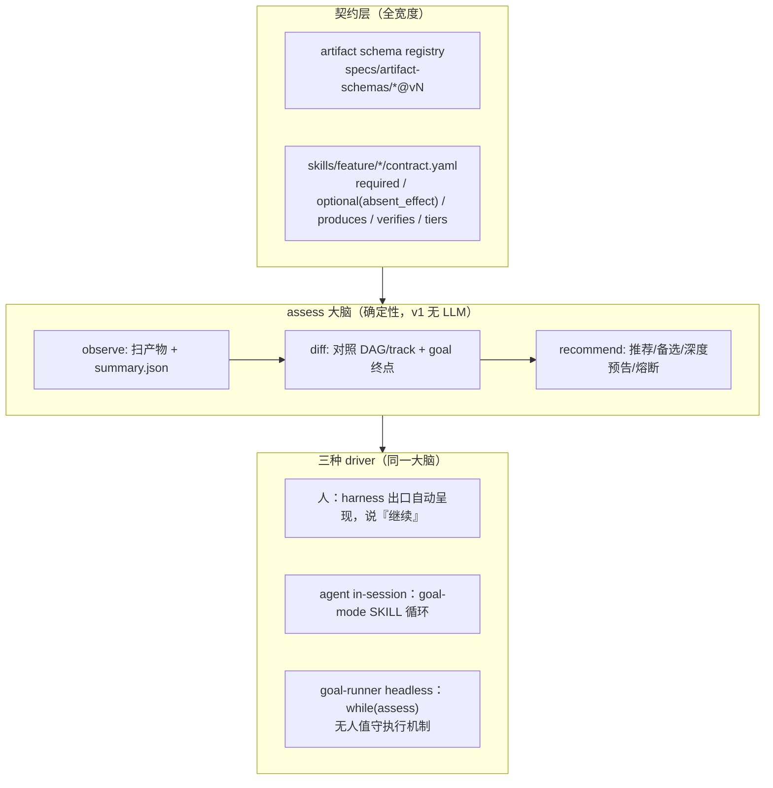
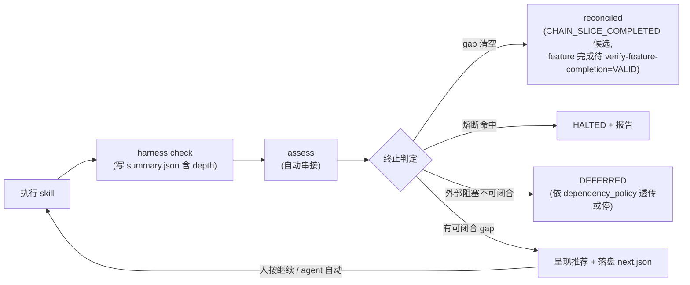

# Skill 契约化与调和循环（可分可合 + assess 大脑 + goal 循环化）

> 版本绑定：`version: 3.0.0`（读自根 `package.json`；2026-07-30 review 用户拍板保持 3.0.0——本 plan 由此进入 release:check-plans 的 3.0.0 发布门）。
> 流程：框架级行为变更，**先走 OpenSpec change**——拆两个：`skill-contracts-assess`（L1–L3，纯增量）与 `goal-reconcile-loop`（L4，两步走）；本 plan 作实施清单辅助。
> 本 plan 是 [工具无关_goal_全链路（2.3.0）](工具无关_goal_全链路_817d44d8.plan.md) 的继任演进：goal-runner 从「外部逐 phase 编排器」收敛为「调和循环的 headless driver」。

## 讨论收敛后的核心决策（SSOT）

1. **不走 Stop hook 路线**。hook 侵入宿主生命周期、按宿主分裂、闲聊也 fire。改为宿主无关的 assess CLI——宿主只需会跑一条命令。
2. **assess 没有独立人工入口**。它只有两个宿主：harness phase check 出口（自动串接，工具输出比 SKILL 指令可靠，弱模型只需转述）与 goal 循环（自动）。人工调用仅限调试。
3. **一循环 + 授权上下文**：`skill → check → assess → 呈现推荐 → [谁按继续键]`。推进逻辑只有一套；「谁按继续键」之外还有**授权范围**——transition_policy 三态（manual / batch_authorized / goal_mode，[phase-transition-policy.md](docs/concepts/phase-transition-policy.md) 既有 SSOT）保留在 driver：**assess 只判资格与推荐，driver 判是否已获授权执行**（transition_context: policy + through_phase）。assess 推荐永不构成授权：batch 只授权到 review 时，即便推荐 ut 也必须停等（进单测）。
4. **横向先行，纵向按需**：契约声明全宽度覆盖（纯描述、便宜、即审计）；降级阶梯只做有真实需求的 skill（coding 已由 lite track 覆盖，剩 ut / testing / review）。
5. **试点选第二难的**：business-ut（考验语义降级 + toolchain + 上游消费，且不卡真机迭代快）。review 最容易、最不考验内核，放最后。device-testing 的即席输入**设计**前置到契约声明阶段（纸面压力测试契约格式），实现第二。
6. **质量档位必须可见**：输入缺失 = 深度降档并写进报告头与 summary.json，绝不静默装作同一件事（compat「可过期降级」思想从版本兼容推广到输入兼容）。
7. **skill 间零耦合不存在，公共 API = 版本化 artifact schema**：实现独立演进，接口走 schema registry；破坏 schema = MIGRATION 事件。
8. **OpenSpec 拆两个 change**（2026-07-30 review 拍板）：`skill-contracts-assess`（L1–L3——诚实定性：L1 描述性增量 / L2 有 stdout+投影行为变化 / L3 是判定行为扩展，增量但非零行为变化）与 `goal-reconcile-loop`（L4 大手术，内部两步走：先抽边界后换内核）。`goal-reconcile-loop` **显式依赖** `skill-contracts-assess` 的 assess@1 与 contract schema 冻结——两 change 串行不并行。版本窗口保持 3.0.0（用户拍板）。
9. **熔断三层分界**（codex 核查后定稿，2026-07-30 二轮修订）：**monitor 熔断=宿主轮询预算**——命中只收轮询不杀 run（goal-monitor 是只读通知器，detached run 继续跑），留在 ops 文档，零代码强制为已知边界，不迁入 assess；**循环级 reconcile fuse=driver 判定、assess 只作投影**（2026-08-01 D2 修订，原文「assess=循环级 reconcile fuse——轮次无推进判定」作废）——无推进判定由 goal-runner 基于 events 回放的既有守卫得出，经 `ReconcileObservation@1.state='fused'` 注入，assess 原样透出到 `stop.fused`，不自行判定；「计活跃时间不计日历时间」（7c4f2e9b 教训）的责任方随之归 driver。**改这个方向而不是把判定搬进 assess 的理由**：goal-runner 已有一套跑通的 events 驱动守卫，搬进 assess 等于在 assess 内重建同一判定（且 assess 输入面不吃 events，只能靠 driver 注入 residual_fingerprints/repeated_rounds 再算一遍）——更多机器换同一结果。附带项：`ReconcileObservation@1` 的 `residual_fingerprints` / `repeated_rounds` 当前零消费，是否保留随下次触碰该接口时评估，不单独立项；**runner/executor=进程级守卫**——八套熔断+安全边界+设备门+快照+写保护不迁移。assess 只在 phase 边界运行，不承担运行中 phase 的终止。
10. **closure 感知与完成投影**（codex P0 采纳）：四件套关环是一等 gap——full 轨 PASS+closure=open 只推荐关环不推荐下游（资格≠授权语义不变）；gap 清空输出 reconciled + `run_status_candidate=CHAIN_SLICE_COMPLETED` + `feature_completion=REQUIRES_VALIDATION`，裸 COMPLETED / 绕过 verify-feature-completion 均为禁手。
11. **把简单留给用户**（2026-07-30 三轮收敛定稿）：用户面唯一概念=goal + 通俗二选一「**有人在场 / 无人值守**」。启动意图判定：触发语已明示（「遇到问题停下来问我」/「无人值守」/「我离开一会」）→ **免问**，NL 判定 + 一句话回显解读（Auto-match over fail 对齐）；意图不明 → 复用前置确认既有模式弹一次编号菜单（registry 新条目 `goal.run_mode`）；CLI `--detach` 直起=天然无人值守不问。运行中可 NL 切换（「我走了」→补授权 detach 交接；「我回来了」→接管回会话）。「后台」只作无人值守效果说明（关窗口也继续跑）；tier/in-session/headless/batch 仍为内部词汇禁入用户文案；确认语义统一为「要你的时候停下来等你」。

## 复用既有基础设施（不重造）

- 机器裁决真实面（2026-07-30 核查修正）：`summary.json` 顶层仅有 `verdict / next_action`；`blocking_class` 经 `blockers[]` 回落读取；`failure_kind` 不进 summary（check 层内部字段）——assess observe 按此真实 writer schema 消费；顺手清理 goal-runner `extractBlockingMeta` 读顶层字段的死分支
- [phase-transition-policy.ts](harness/scripts/utils/phase-transition-policy.ts)：`classifyPhaseVerdict` / `resolveAutoChain` 保持裁决 SSOT，assess 作为其上层消费者
- lite track（[feature-track.ts](harness/scripts/utils/feature-track.ts)、[spec-driven.workflow.yaml](workflows/spec-driven.workflow.yaml) `auto_chain_by_track`）：track 与 tier 正交——track 是路线预设，tier 是单 skill 输入深度
- [adhoc-device-test.ts](harness/scripts/adhoc-device-test.ts) 与即席系列：device-testing 即席档的既有实现，归一到契约而非新建
- goal-runs 运行证据层、goal-checkpoint / goal-phase-snapshot：headless driver continues to use
- [confirmation-registry.yaml](skills/reference/confirmation-registry.yaml) 编号菜单约定：「下一步」段的渲染格式
- 输出预算工具（[skill-body-budget.ts](harness/scripts/utils/skill-body-budget.ts) 同类）：约束「下一步」段体积

## 目标架构



调和循环（两模式共用）：



---

## Step 0 — OpenSpec change（先行）

`/opsx-propose` 开两个 change：`skill-contracts-assess`（L1–L3：可分可合动机 / 契约 schema / assess 语义 / 降级档位）与 `goal-reconcile-loop`（L4：循环化目标 / 循环终止 / 两步走边界抽取 / handoff 协议 / 817d44d8 决策反转记档），各产出 `proposal.md` / `design.md` / `tasks.md`；后者显式依赖前者的 assess@1 与 contract schema 冻结，**串行实施**。

## Layer 1 — 契约层（全宽度，纯描述，不改行为）

### 1.1 artifact schema registry（skill 叙述产物公共 API）

新增 `specs/artifact-schemas/`。**清单不凭印象列举**（codex P1 实锤：初版即漏 `change@1`（change-lite 唯一核心产物）/ `use-cases@1`（plan 产出、coding/ut/testing 消费）/ `ui-spec@1` / `visual-parity@1`）：冻结前先从 `REQUIRED/OPTIONAL_FEATURE_FILES_BY_PHASE`（spec-loader.ts）+ phase-evidence-manifest 产出表 + 7 个 SKILL 输出表生成全量 inventory。已知成员至少含：`spec@1` / `plan@1` / `contracts@1` / `acceptance@1` / `use-cases@1` / `change@1` / `review-report@1` / `test-plan@1` / `test-report@1` / `testability-audit@1` / `mock-plan@1` / `coverage-evidence@1` / `ui-spec@1` / `visual-parity@1`。每份 schema 带版本号；skill 演进只要不破坏所产/所消 schema 即自由，破坏即 MIGRATION 事件。现有校验逻辑（如 [ut-artifact-validate.ts](harness/scripts/utils/ut-artifact-validate.ts)、[check-acceptance.ts](harness/scripts/utils/check-acceptance.ts)）挂靠对应 schema，不另造平行真源。

**范围收窄（codex P1 采纳）**：registry 只覆盖 **skill 叙述产物**；控制面协议（`summary.schema.json`、assess@1、receipt、`feature.yaml`、goal-manifest 等）**保持既有 SSOT 位置，registry 引用不复制**——`summary.schema.json` 已存在且有 TS 镜像类型，再收编即第三真源。

### 1.2 skill 契约 schema

新增 `specs/skill-contract-schema.yaml`，每个 feature skill 一份 `skills/feature/<skill>/contract.yaml`（共 **7** 份——change/exit 不是独立 skill，是 change-lite 内两 phase；契约按 skill 落盘、按 phase 分段声明，assess 消费按 phase 索引）：

```yaml
schema_version: "1.0"
skill: business-ut
inputs:
  required:
    - id: code
      kind: source            # source | artifact | adhoc
    - id: acceptance
      artifact: acceptance@1   # ut_layer + 覆盖分母（acceptance_coverage BLOCKER），basic 档同样必需
  optional:
    - id: use_cases
      artifact: use-cases@1
      absent_effect: "复杂 feature 主规划来源缺失，按 diff-scope + module catalog 推导"
    - id: plan
      artifact: plan@1
      absent_effect: "测试对象改由 diff-scope + module catalog 推导；档位降 basic"
    - id: contracts
      artifact: contracts@1
      absent_effect: "跳过契约断言覆盖检查"
produces:                      # 修正（codex P1）：test-report@1 是 device-testing 的产物，不在此处
  - kind: source               # UT 源码 + DAG
  - artifact: testability-audit@1
  - artifact: mock-plan@1
  - artifact: coverage-evidence@1   # ut/reports/ac-coverage.json（非 SSOT）
verifies:
  check: check-ut.ts
  depth_field: summary.depth   # full | basic
tiers:                         # 开放命名 + 显式满足集（无全序，判定=actual.satisfies(required)，只在本契约内解释）
  full:  { when: "all(present(plan), present(contracts))", satisfies: [full, basic] }
  basic: { when: "otherwise",                              satisfies: [basic] }
```

**device-testing 契约在本阶段完成即席输入设计**（对契约格式最狠的压力测试，纸面验证）：

```yaml
inputs:
  required:
    - id: cases
      alternatives:            # 对等输入档，二选一
        - artifact: acceptance@1        # → 档位 full
        - kind: adhoc                    # 自然语言用例 → 档位 adhoc
          normalizer: adhoc-nl-split    # 复用既有即席解析
```

### 1.3 一致性门禁

新增 `check-contract-consistency`（进 framework 自身回归）。**公式修正（codex P1 采纳）**——原「requires ⊆ 契约 required∪optional」左右侧不同命名空间不可执行：`requires` 元素是 phase id（loader 强制 ∈ artifact id 集，workflow-loader.ts:186），契约输入是 artifact schema/kind（`coding≠code`、`ut≠cases`，对现有全部实例判假）。改为 **producer/consumer 图校验**：① 契约 `produces` 建 phase→artifact 映射作桥；② 每个契约 artifact 输入须有 DAG 可达的 producer phase，且位于 consumer 的 `effectiveRequires(track)` 传递闭包内（runtime-policy.ts:175 既有函数）；③ 不传产物的 workflow 边（如 coding→review 边：`review.requires=[coding]` 但 review 实际消费源码+plan.md+summary 机器裁决，coding 无 registry 产物）显式标 **control dependency**；④ artifact 输入无可达 producer → 报隐性依赖；⑤ 各契约 `tiers` 的 `when` 谓词须**互斥且穷尽**，且用 **v1 受限 DSL** 表达（codex P1 三/四轮冻结：仅 `present(id)` / `alternative(id,value)` / `all`/`any`/`not` / 唯一 `otherwise`；自由字符串无法机器证明）——门禁对声明输入的有限组合**穷举验证**，多 tier 命中或零命中皆报错；**v1 禁止重叠**，不引入 priority（后续版本再议）。另：`skill_doc` 与契约互指；track 成员的 `requires_by_track` 与契约不冲突。**契约写作过程即耦合审计**——每发现一处隐性依赖（正文引用了契约未声明的产物），先补进契约再谈拆除。前置补齐：workflow 中 change/exit 两个 artifact 目前**缺 `skill_doc` 字段**（lite 轨无机器可读 phase→skill 链），先补齐再上互指门禁。另需在 design.md 写明 artifact schema registry 与 `specs/phase-rules/*.yaml`（14 份）及命令式 check 脚本的权责关系，防第三真源。

## Layer 2 — assess 引擎 + harness 出口

### 2.1 assess.ts（确定性，v1 无 LLM）

新增 [harness/scripts/assess.ts](harness/scripts/assess.ts)：

- **observe**：扫 `<features_dir>/<feature>/` 产物存在性 + 各 phase `summary.json`（verdict / depth / next_action / **closure_status / receipt_status**；`blocking_class` 走 `blockers[]` 回落，`failure_kind` 不在 summary——按真实 writer schema 消费）。**closure 感知（codex P0 采纳，已核实）**：四件套（harness+verifier+receipt+trace）闭环=下游**资格**（[user-confirmation-ux.md](skills/reference/user-confirmation-ux.md) §资格≠授权）；full 轨首次 PASS 的**定稿值**是 `closure_status=open`+receipt 骨架 failed——此时唯一合法推荐是「完成当前 phase 关环（verifier/receipt）」，**绝不推荐下游**；full 轨 closed 判定按 commit marker 硬化三条件（`1.2 + closure_commit@1 + manifest 校验成功`，见 2.2；`legacy_unverified` 不荐下游）；lite 轨 PASS 即 closed，复用 `resolvePhaseClosureSource` 同源判定。循环/裁决上下文由 driver 从权威 events/进程状态派生后以**版本化 `ReconcileObservation@1` 接口注入**（见 L4.2 第一步；仅 attempt 计数+进展指纹装不下现有 testing→coding 回退与预算裁决），assess 本体不直读 events
- **diff**：对照 workflow DAG（含 track，经 `effectiveRequires(track)`）与 goal 终点（默认 workflow 尾；goal-manifest 可覆盖），产出 gap 清单（missing / FAIL / DEFERRED / stale / **unclosed** / **insufficient_depth**）；stale 只认 provenance 锚（coding_base_sha / HAP 指纹），**禁 mtime**（monitor stale 误报是活 bug 类，d6b1a8e3 t2 未结）；**depth 进完成判定（codex P0/P1 两轮收敛）**：goal/track 声明 **`minimum_depth_by_phase`**（**manifest 规范形态是 SSOT**；quality profile 只是创建 manifest 时的语法糖，不是第二真源；默认=track 标准档，full 轨→full，即席可显式 adhoc/basic——goal 级标量对开放命名不稳定，废除），档位判定用契约 tiers 的**显式满足集** `actual.satisfies(required)`，且 **satisfies 只在同一 skill contract 内解释**（跨 skill 的 tier 名互不可比，无全序、不做 `<` 比较）——不满足 → `insufficient_depth` gap，推荐「补齐上游输入后按 full 重跑」；basic PASS **不默认满足** full goal
- **recommend**：可闭合 gap 中按「requires 已满足 + DAG 序 + 深度预告」选推荐，其余列备选；FAIL → 建议同 phase 修复重跑（带 blockers 摘要）；DEFERRED → 按 dependency_policy 透传或建议 halt。**policy 语义边界（codex P1 采纳，已核实）**：dependency_policy 只覆盖「已运行且 INCOMPLETE+外部阻塞」的 DEFERRED 透传，**不授权跳过未运行的 required phase**（链构造层 validateFeatureChainDag 对缺席 required phase 直接 throw）；skip/waiver 授权面本版非目标
- **终止判定**：gap 空 → `stop.reconciled=true`，投影 `run_status_candidate=CHAIN_SLICE_COMPLETED` + `feature_completion=REQUIRES_VALIDATION`——**不输出裸 COMPLETED**（run 级成功态只有 CHAIN_SLICE_COMPLETED，feature 级完成只认 `verify-feature-completion=VALID`，phase-transition-policy.ts:42 既有禁令）；循环级熔断 → fuse（幂等：fuse 轮次从注入的权威证据指纹派生，不随调用自增——harness 出口与 driver 各调一次不双计；时长计**活跃时间**不计日历时间，7c4f2e9b 教训）。monitor 熔断（3 轮/30min/30min）=宿主轮询预算，命中只收轮询不杀 run，**不迁入 assess**，留在 ops 文档（headless tier UX）
- 复用 `resolveAutoChain`（标准链参照）与 `classifyPhaseVerdict`（裁决语义），**不新建第二裁决源**

输出 `assess@1`：

```json
{
  "schema": "assess@1",
  "mode": "feature",
  "feature": "<slug>",
  "goal": { "end": "testing", "source": "workflow-default" },
  "observed": [ { "phase": "coding", "verdict": "PASS", "depth": "full", "closure": "closed" } ],
  "observed_fingerprint": { "workflow": "<hash>", "track": "full", "goal_end": "testing", "run_attempt": "r1a2", "summaries": "<hash>" },
  "gaps": [ { "phase": "ut", "kind": "missing", "closable": true } ],
  "recommendation": { "action": "ut", "why": "coding PASS 且已关环，ut 为当前最大可闭合 gap", "depth_forecast": "full" },
  "alternatives": [ { "action": "pause", "note": "暂停推进（不代表 feature 已完成）" } ],
  "stop": { "reconciled": false, "run_status_candidate": null, "feature_completion": "REQUIRES_VALIDATION", "fuse": { "no_progress_rounds": 0 } }
}
```

### 2.2 harness 出口自动串接（关键 UX）

[harness-runner.ts](harness/harness-runner.ts) feature phase check 收尾自动跑 assess，verdict 之后追加：

```
── 下一步（assess）──
推荐: ut（coding PASS 且已关环，ut 为最大可闭合 gap，预告档位 full）
备选: ① 暂停推进 ② 其它（对话说明）
```

- **共享闭环事务 finalizePhaseClosure（codex P0 三轮采纳，已核实现状两路径不等价）**：现状——直跑 check-receipt **先写 closed 再生成闭环产物**（check-receipt.ts:1039 closure patch → :1056-1124 attestation/manifest/指针），manifest 失败只 `exit 1` 不回滚，盘上残留假 closed；`--sync-closure` 经 `--skip-state-sync`（phase-state.ts:248）把整段闭环产物生成跳过、外层只回写 closure——**closed 而无 manifest**。收敛为共享事务，**staged commit 序（六轮定稿：manifest 把 `summary.json` 纳入哈希保护面——`PHASE_REPORTS_OUTPUT_FILES`，phase-evidence-manifest.ts:138/:356——「先 manifest 后改 closed」会让 manifest 当场 stale；closure 落双文件无法跨文件原子；`.current-phase.json` 写失败现状只 WARN 放行，phase-state.ts:174）**：`① validate → ② 内存/临时文件构造最终 summary v1.2（depth + closure_status=closed + 版本化 closure_commit@1）→ ③ manifest builder 用 staged summary 的最终字节/hash 生成 attestation/manifest/pointer（给 resolvePhaseEvidenceManifest 增加 staged-output/precomputed-hash 输入缝）→ ④ 严格写 .current-phase.json（失败即停，废除 WARN 放行）→ ⑤ staged summary 原子 rename 到 canonical＝最终 commit → ⑥ commit 后跑 assess`。assess 失败**不回滚 closure**——返回「闭环已提交、推荐生成失败，可重跑 assess」；中途崩溃只会留下安全的假 open，**绝不产生假 closed**。**commit marker 硬化**：`closed` 字段单独不作数——存量 summary 1.1 已存在「closed 但无 manifest」（旧 `--sync-closure` 产物）：`summary.schema_version` 升 **1.2**，full 轨判 closed=「**1.2 + closure_commit@1 + manifest 校验成功**」三条件；旧 1.0/1.1 的 closed 一律视为 **`legacy_unverified`**（推荐重跑 `--sync-closure`，不得荐下游）；`depth` 随 1.2 迁移——旧 summary 缺 depth 判 **`unknown`** 不静默当 full，重跑 harness 或显式迁移校验补齐。**渲染与状态解耦（codex P1 四轮：落盘与 stdout 无法组成原子事务，不承诺跨崩溃 exactly-once）**——finalizer 只提交状态并返回 `{ transitioned, closure_fingerprint, assess }`，**最外层 CLI 每次 invocation 至多 render 一次**，嵌套 `--sync-closure → finalizer` 不重复 render，用户显式重跑允许重新展示同一 fingerprint。三条验收：① manifest 写失败绝不 closed、绝不推荐下游；② 直跑 check 与 `--sync-closure` 产出相同 evidence/fingerprint；③ 单次命令不双渲染（状态幂等 + 不承诺跨崩溃 exactly-once）
- **触发点共享化（准确表述：两个 render hook、三条入口路径）**：render hook 只有两个——harness phase check 出口、finalizePhaseClosure 出口；入口路径三条——直跑 harness / 直跑 check-receipt / `--sync-closure`（后者**复用 finalizer，不是独立 hook**）。assess 幂等故重复触发无害；full 轨 harness 出口只会产出「关环推荐」，真正的下游推荐产生于 finalizer 出口（closed 之后）——缺它则永远没有自动下游推荐
- 渲染复用编号菜单约定；「继续」= 执行推荐项；该段置于 `HARNESS_SUMMARY` 机器块之外（不动既有 stdout 消费契约）；段首带固定状态行「feature · phase · 第 N 轮 · 有人在场/无人值守」（治模式感知弱）
- **即席静默**（条件精确化，2026-07-30 核查）：非 feature-scope phase、feature 为 `_global` 哨兵、或 `--adhoc-correction` → 不输出该段。harness-runner 无其它即席入口：`_adhoc` 被显式拒收导流独立 CLI，adhoc-* 系列是平行脚本不经 runner
- 体积预算：该段计入 harness 输出预算约束，只给结论不给过程

### 2.3 next.json 落盘

assess 同步写 `<features_dir>/<feature>/next.json`——定位=**可丢弃投影/缓存，不是 SSOT**（codex P0 采纳；权威真值=产物 + summary + run events，与 progress.json「纯投影」定位同族。已核实：feature 根目录今天不存在任何无 run 身份的跨 run 状态文件，不开此先河）。文件带 observed 指纹（workflow / track / goal 终点 / run-attempt / summary+evidence hashes；字段级身份复用 goal-manifest `computeManifestIdentityFields` 先例）；丢失/损坏无害，重跑即重建。

**2026-08-01 修订（D1，删承诺不补接线）**：原文承诺「跨 session / 换 agent / 隔天恢复，『继续』读盘即得，不依赖对话上下文存活」**作废**。实况：`readFreshNextOrRecompute()`（assess.ts:760）零生产调用方，next.json 只写不读。定性=**next.json 是只写的审计投影**，不是恢复入口；任何时刻的「继续」都由**重跑 assess** 得到确定答案（assess 本身确定且幂等，重跑成本低于维护一条无人使用的读路径）。故不补读接线，也不再声称读盘恢复能力。`readFreshNextOrRecompute` 保留与否随下次触碰该文件时评估，不单独立项。

### 2.4 SKILL 收尾统一

各 feature SKILL.md 收尾改为一句：「呈现 harness 输出的『下一步』段落」。「下一步」既有事实共**四处**双源（2026-07-30 核查），一并收敛：① 各 SKILL 收尾/正文文案（删，含 device-testing 正文硬编码的重试链与各 skill 的下游消费者表）；② [confirmation-registry.yaml](skills/reference/confirmation-registry.yaml) `phase.next_step` 的 dynamic_label.lookup 硬编码链与 `nextSkillLabelForPhase` 硬编码表（改由 `resolveAutoChain` 派生或纳入一致性门禁）；③ skills.index 的 `init_next_steps`（限 init 域，不与 assess 抢跨 phase 推荐）；④ 文档化 `summary.next_action`（phase 内闭环动作）与 assess recommendation（跨 phase 推进）的高度边界。

## Layer 3 — 降级阶梯（按需清单，风险前置）

| 顺序 | skill | 理由 | 内容 |
|---|---|---|---|
| 1 | business-ut | 内核压力试点：语义降级最难（无 plan 推导测试对象）+ toolchain + 上游消费；迭代快 | basic 档：diff-scope + catalog 推导对象；跳过契约断言覆盖；`summary.depth` + 报告头标注 |
| 2 | device-testing | 输入模态替换 + 即席双轨归一 | `cases` alternatives 落地；[adhoc-device-test.ts](harness/scripts/adhoc-device-test.ts) 与 phase 轨共用契约与 check 内核；**device-policy 门保持 BLOCKER，不参与降级** |
| 3 | code-review | 最容易，顺手收尾 | basic 档：对照 catalog + glossary + 代码意图；报告头标注缺失输入 |

红线（全体适用）：输入缺失只降**深度**，never 降**判真标准**——反假 PASS 哲学不变；缺设备/toolchain 等外部条件仍走既有 FAIL/INCOMPLETE 语义，不借降级洗白。深度降档同时**进入完成判定**：不满足 goal/track 的 `minimum_depth_by_phase` 即 `insufficient_depth` gap（见 L2.1）——「只展示不判定」会让 basic PASS 静默顶替 full goal（codex P0 采纳）。

coding 无需新做：lite track（change → coding → exit）已是其降级形态，契约层为其补声明即可。spec / plan 自身是上游，无「无上游运行」需求，不做阶梯。

## Layer 4 — goal-mode 循环化

### 4.1 goal-mode SKILL 重写（薄 driver）

正文收敛为一页：

```
循环：跑 assess → 若 done/fuse → 汇报终态
     → 否则执行推荐 skill（含其 harness check）→ 回到 assess
```

- **运行模式判定（2026-07-30 三轮收敛定稿：把简单留给用户）**：用户面只有「goal」一个概念 + 两个通俗模式名「**有人在场 / 无人值守**」。启动意图判定优先级：① 触发语已明示（「遇到问题停下来问我/你看着办我盯着」→有人在场；「无人值守/我离开一会/自己跑完」→无人值守）→ **免问**，一句话回显解读（透明记录，Auto-match over fail 对齐）；② 意图不明 → 像 device-policy 一样弹一次前置编号菜单（confirmation-registry 新条目 `goal.run_mode`：1=有人在场（遇事直接问我） 2=无人值守（自动跑完，搞不定先停下记着；关窗口也继续跑））；③ CLI `--detach` 直起 runner=天然无人值守不问。**运行中切换=正式所有权交接协议（codex P0 三/四轮采纳）**：next.json/progress 都是投影，**不转移执行权**——执行权=feature/run 两把锁（headless runner 独占持有至退出，goal-runner.ts:3393）。**锁模型缺口（四轮核实）**：现有锁强绑定 pid、同机判活直接 `isPidAlive`（goal-run-lock.ts:16/:52），而会话 agent 跨多次 shell 调用没有持续存活的 owner PID——**不能直接复用现有锁**；仓内也没有向 detached owner 发「请在 phase 边界停下」的请求通道。方案定稿（二选一取推荐项；五轮补 **fencing 语义**防 split-brain——危险序列：A 获 lease→宿主卡住→lease 过期→B 自动回收开跑→A 恢复用旧上下文写文件→双写）：**`SessionLease@1` 版本化租约**——**process owner 保留现有 `pid + isPidAlive` 语义，不统一换 TTL**（同机活 pid 永不 stale 的既有保证不丢）；**session owner 用 `lease_epoch` / fencing token**；**epoch 持久化 SSOT=run 目录 `run-control@1`（六轮定稿：epoch 不能住在会被删除的 lock/lease 文件里，否则释锁即重置）**——`current_epoch` 原子 CAS 递增、**永不因释锁删除/重置**；process/session 两类 owner 都携带 epoch（区别只在 liveness 判据：pid 判活 vs 租约）；mailbox、events 与所有写入口绑定该 epoch；lock/lease 文件只是当前 owner 的**投影**，不是 epoch SSOT；run 目录增设**原子 handoff request mailbox**（条目绑定 `request_id + run_id + from_epoch + target_owner_kind`）——请求者只写 mailbox，当前 owner 消费后写权威 events → quiesce → 释锁；assess / harness / finalize / appendEvent 每个 driver 边界都**拒绝旧 epoch**；**过期 session lease 只进入 `orphaned_session` 态，绝不自动授权新 owner 执行**——只有显式 handoff 或用户明确 takeover/force-resume 才递增 epoch 并接管（拒绝备选方案「常驻 keeper 进程替会话持锁」：会把薄 driver 养肥）。协议序：同一 `run_id` 事件账本连续 → 当前 driver 在 **phase 边界 quiesce** → 记 `handoff_requested` → 原 owner 释锁 → 新 driver 获取**租约** → 记 `handoff_accepted` 后才继续。「我走了/下班了」方向：补齐预授权（写权限/预授权范围；device-policy 涉设备 phase 仍按既有语义前置）→ handoff → detached runner 接管，遇必须人的事 halt 排队；「我回来了/继续」方向：先让 detached runner 停在安全边界完成 handoff，**绝不只读投影就开始执行**（否则与后台进程双写同一 feature）。测试覆盖：交接中途崩溃 / 重复指令 / 双执行拒绝 / **epoch fencing**（过期旧 owner 被拒；未经显式 takeover 不启动；takeover 后旧 epoch 永拒）/ 陈旧 mailbox 条目 / 旧 owner 恢复后写入被拒。行为差异一句话：有人在场=遇事直接问你；无人值守=能自动的自动，搞不定的先停下记着等你回来。batch 授权（「做到 ut」）在**推进逻辑**上归并入同一循环（through_phase=授权边界），但 transition_policy 三态（manual/batch_authorized/goal_mode）作为**授权上下文**保留在 driver——推荐 SSOT 归 assess，授权判定 SSOT 留 driver（见核心决策 3；`parseBatchAuthorization` 为既有解析器）
- **感知增强（治「不知道自己在哪个模式」）**：循环每轮输出固定状态行「feature · phase · 第 N 轮 · 有人在场/无人值守 · 等待事项」；「下一步」段与 next.json 保证任何时刻说「继续」都有确定答案；in-session/headless/tier/batch 等词汇只许出现在代码与设计文档，**禁止出现在用户交互文案**
- in-session tier 两项**硬前提**（不满足即倒退，design.md 必须给出方案）：① **phase 级上下文对策**——headless 的 fresh-context-per-phase 是 817d44d8 的刻意设计（防长链上下文污染），in-session 不得默认累积（压缩/子代理/checkpoint 择一明确）；② **in-session 与 headless 使用完全相同的 manifest/events schema**（codex 四轮收紧：不是「等价账本」——schema 同构、同 `run_id` 才能真 `--resume`；events.jsonl 现状只有 runner 写，in-session 补同款写入，goal 可审计性不倒退）
- 循环级熔断由 **driver 判定、assess 只作投影**（2026-08-01 D2 修订，见核心决策 9；原文「由 assess 判定」作废）：无推进判定归 goal-runner 既有 events 驱动守卫，经 `ReconcileObservation@1.state` 注入，assess 透出 `stop.fused`；进程级守卫同样在 driver（见 4.2）。要点不变：**判定只有一套**，不得 driver 与 assess 各算一遍
- **决策反转显式记档**：本层取代 817d44d8 l3-skill「SKILL 收薄防双真源」决策（assess 单脑令其失效）；同步改写 goal-mode SKILL.md 的 BLOCKER 行（现写「裁决 SSOT = phase-transition-policy + goal-runner」）与 adapter `goal_capability` 语义；SKILL 与 operations.md 双写的 monitor 熔断数字一并消灭
- **adapter 能力路由（修正过度承诺，codex P1 三轮采纳）**：shell 够跑 assess ≠ 具备 in-session 留痕 / resume / 无人值守权限 / handoff 能力（各 adapter `goal_capability` 本就有差异）。内部按能力路由：不支持 in-session loop → 退化为人工 harness+assess 循环；无人值守 → 必过 external-runner/unattended preflight；运行中交接 → 须声明并验证 resume/handoff 能力。用户面仍只见「有人在场/无人值守」两个词，**内部不假装能力相同**

### 4.2 goal-runner 收敛（无人值守执行机制；独立 change，两步走）

> 实况修正（2026-07-30 review 核查）：main() 约 4190 行、`classifyPhaseVerdict` 取初值后约 25 处内联 action 覆盖、115 处 `appendEvent` 与裁决梯交织、`loadAuthoritativeEvents` 直接出现在决策条件里——「仅换编排内核、证据层不动」在当前代码形态下不成立，故拆两步。

- **第一步（l4-runner-boundary）**：抽「裁决梯 + 事件发射」的接口边界，并**定义版本化纯输入接口 `ReconcileObservation@1`**（codex P0 采纳）：phaseOutcome / failure_kind / blocker actionability / `deterministic_p0_defects` / retries·backtracks 已用预算 / 重复 round 指纹 / invalidatable phases 集合 / timeout·operator_interrupt·API 断流等执行信号——**driver 从 events/进程状态派生事实，assess 唯一决策**（testing→coding 回退依赖 actionable defects+回退指纹，goal-runner.ts:7442，仅 attempt 计数+进展指纹装不下）。fixtures 锁现有 events/verdict 序列做全量行为回归，**零语义变更**，独立可回退。没有这个接口，第二步只能在「跨 phase 逻辑留 runner（双脑）」与「assess 信息不足改错行为」间二选一
- **第二步（l4-runner-rewire）**：编排改写为 `while: assess → headless invoke 推荐项`；跨 phase 推进裁决统一走 assess（消灭 runner 与 assess 双脑）；**进程级守卫留在 driver**——超时四步分流 / 预算 / backoff / 信任账本 / 累计签名等八套熔断靠 events 回放驱动，assess 输入面不吃 events，装不下也不该装
- 既有 detach **启动与生存语义保持兼容**（codex 四轮修正「不动」表述：反向 handoff 要求 runner 轮询 control mailbox 并安全 quiesce——新增能力，非语义变更）；monitor / usage-capture 不动
- 定位：无人值守模式（关机器级续跑）与无 shell 循环能力宿主的**内部执行机制**——用户面只见「无人值守」模式名；3.1.0 liveness plan（supervisor auto-resume）继续在此机制上加注，基于 L4 改写后的 runner

> **薄壳化不在 3.0.0 范围（2026-08-01 L1 定稿）**
>
> 第一步的「裁决梯 + 事件发射完整模块化」与第二步的 `while(assess)` 薄壳**均未实施**，`goal-runner.ts` 仍约 8143 行、115 处 `appendEvent` 散布其中。两项 todo 已按各自实际交付范围降级记 completed（见 frontmatter 内注），**不留虚标**。
>
> **明确不在 3.0.0 内补做**，三条理由：① 本层要防的「双脑」主要收益已由**单一 `decideAndEmit` 决策边界 + `checkAssessDrivenRunnerSource()` 静态守卫**拿到——守卫断言 goal-runner 恰有一处决策边界、不得自行 `classifyPhaseVerdict`、不得内联 backtrack 选择，回潮会当场变红；② 8143 行 → 薄壳是大手术，换取的是形态改善而非行为改善，风险收益比在发布窗口内不成立；③ [a4f7e2b1 无人值守生存能力](无人值守生存能力_liveness与supervisor与声明式唤醒_a4f7e2b1.plan.md)（3.1.0 supervisor auto-resume）与 [d6b1a8e3](goal报告与监控真值_失败归因一致性与硬预算集成断言_d6b1a8e3.plan.md) t3/t4 的集成断言床都对准同一个 runner——**重构窗口应留给它们合并评估，避免同一手术做两遍**（本 plan「与并行 plan 的排序约束」节的原意）。

## Layer 5 — 测试 / 文档 / 发版

### 5.1 测试（BLOCKER：`cd harness && npm test` 全 PASS）

- 单测：契约加载 / 一致性门禁（producer-consumer 图 + control dependency）/ assess observe-diff-recommend 各分支（PASS+closure=open 只荐关环不荐下游、PASS+closed 推进、FAIL 重试建议、DEFERRED 透传、insufficient_depth、reconciled 投影不出裸 COMPLETED、fuse 幂等双调不双计、指纹失配拒「继续」、即席静默、lite track 路由、授权分层（batch through_phase=review 时荐 ut 必须停等）、finalizePhaseClosure 成功后第二触发产出下游推荐）/ 闭环事务验收（manifest 失败不 closed 不荐下游、直跑与 `--sync-closure` 双路径 evidence 等价、单次命令不双渲染、**staged summary 的 manifest freshness**（manifest hash 对齐 rename 后的 canonical summary）、**旧 1.1「closed 无 manifest」判 legacy_unverified 不荐下游** fixture、旧缺 depth 判 unknown）/ handoff（交接中途崩溃、重复指令、双执行拒绝、epoch fencing：过期旧 owner 被拒/未经显式 takeover 不启动/takeover 后旧 epoch 永拒、**epoch 释锁后不重置**、**并发 takeover 仅一个 CAS 成功**、陈旧 mailbox 条目、旧 owner 恢复写入被拒）/ tier when-DSL 穷举（多命中/零命中报错）/ per-phase `minimum_depth_by_phase` 判定 / adapter capability routing 退化路径 / next.json 投影恢复 / ut 双档位判据 / testing 即席输入归一 / l4 第一步边界抽取的行为回归（events/verdict 序列锁定）；**新套件注册 CORE_SUITES**（7c4f2e9b 教训：不注册=假绿）
- fixtures：full 链 happy path；无 plan 直跑 ut（basic 档 + 报告标注）；即席 review 静默；goal 循环 in-session 到 done；fuse 触发

### 5.2 文档

- 新增 `docs/concepts/skill-contracts.md`（契约 + schema registry + tier/track 正交）与 `docs/concepts/reconcile-loop.md`（一循环 + 授权上下文 + 三 driver）
- 更新 [phase-transition-policy.md](docs/concepts/phase-transition-policy.md)（assess 为推荐 SSOT）、[goal-mode-runbook.md](docs/operations/goal-mode-runbook.md)、[user-confirmation-ux.md](skills/reference/user-confirmation-ux.md)（下一步菜单）、[MIGRATION.md](MIGRATION.md) §v3.0
- v3.0 破坏面：harness feature check 输出新增「下一步」段（置于 HARNESS_SUMMARY 机器块之外，stdout 消费方需知）；`summary.schema_version` 升 **1.2**（新增 `depth` + `closure_commit@1`；旧 1.0/1.1 的 closed 判 `legacy_unverified`、缺 depth 判 `unknown`；`additionalProperties:false`，types.ts 与 goal-runner 侧 SummaryJson 同步）；goal-runner 编排语义变更；SKILL 收尾条款替换

### 5.3 发版门禁

本 plan 的责任边界止于 tests/docs 验收与两个 OpenSpec change **按依赖序 archive**（`skill-contracts-assess` 先、`goal-reconcile-loop` 后）。

窗口级 `release:check-plans` 与默认不跳 plan 门的 `release:verify`，由所有 3.0.0 plan terminal 后的最终发布流程统一执行：

- `release:all` 路径：执行完整 plan 门与 release verify；
- candidate 路径：`candidate:build` 仅显式跳过最终 plan 门（`--skip-plan-release-gate`），`candidate:promote` 再补跑该门并提升同一字节产物。

---

## 与并行 plan 的排序约束（2026-07-30 review 增补）

- [e3c7d95f 真机归因精度](spec锚点契约_uispec到uikit锚点派生与归因三态化_e3c7d95f.plan.md)（3.0.0 在修）会动 spec 锚点结构：**spec@1 schema 冻结排其落地之后**
- [a4f7e2b1 无人值守生存能力](无人值守生存能力_liveness与supervisor与声明式唤醒_a4f7e2b1.plan.md)（3.1.0）的 supervisor auto-resume 与 [d6b1a8e3](goal报告与监控真值_失败归因一致性与硬预算集成断言_d6b1a8e3.plan.md) t3/t4 的集成断言床都对准 runner 编排：**应基于 L4 改写后的 runner**，避免同一手术做两遍
- 既有小缺陷不混入本 plan：confirmation-registry `phase.next_step` 的 portable_menu 坏串（:540，缺 `2=` 段）已挂独立小修任务

## 明确非目标（本版不做）

- 不做 Stop hook / hooks 下发（决策 1；`hook_loop` 枚举值继续留空）
- 不改变 headless 既有 evidence 格式与可信语义（in-session 是**新增写入方**，走完全相同的 manifest/events schema，不触碰既有格式）；detach **启动与生存语义保持兼容**（新增 control mailbox 轮询与 quiesce 是能力扩展）；monitor 基建不动
- assess v1 不内嵌 LLM 判定（保持确定性与弱模型可依赖；「让模型挑备选」留待后续版本评估）
- 不为 spec / plan 做降级阶梯；不强推「所有 skill 必须有 basic 档」
- 不做 android profile（但 Layer 1 契约的 `verifies` 声明能力而非实现，profile 提供 check provider 的既有机制保证其未来零内核改动接入）

## 关键风险与取舍

- **双脑风险（最高优先防守）**：推荐/循环逻辑只许存在于 assess；goal-runner、goal-mode SKILL、各 feature SKILL 一律禁止内联「下一步该做什么」的独立判断。一致性门禁扫 SKILL 正文防回潮。
- **语义耦合不可消除，只可显性**：basic 档 review 弱于 full 档是事实，出口是报告头档位标注，不是伪装等价。
- **契约漂移**：contract.yaml 与 check 脚本判据不同步 → 一致性门禁 + fixture 双保险。
- **「下一步」段被宿主截断/忽略**：段落极简；兜底=**重跑 assess**（确定且幂等）。~~next.json 落盘兜底（丢了也能恢复）~~——2026-08-01 D1 修订：next.json 只写不读，不构成恢复路径。
- **爆炸半径**：Layer 1 描述性增量；Layer 2 有 stdout+投影+闭环事务行为变化；Layer 3 是判定行为扩展、逐 skill 独立可回退；Layer 4 独立 change 且内部两步走（第一步零语义变更可回退）。任一层可独立发布验证（与核心决策 8 的诚实定性同口径）。
## 实现偏差记录

### 一轮（2026-07-31 验收纠偏）——已作废，勿按此清单施工

> 保留原文备查，逐条标注真实状态。

1. ~~`assess` 未复用 `classifyPhaseVerdict`~~ **已修**（assess.ts:26/449/483 在用）
2. ~~`l2-skill-epilogue` 未清完 SKILL 正文与"下游消费者"表~~ **已修**（7 份 SKILL.md 收尾均只剩一句）
3. UT basic 只做档位披露，未按档位收敛 check-ut 判据 → **移交 d4f8b2a6 t5**
4. Review basic 未实际消费 catalog/glossary → **移交 d4f8b2a6 t5**
5. ~~in-session loop 无生产入口 wiring~~ **已修**（goal-mode-entry.ts host bridge + skills.index.yaml:61 + goal-mode/SKILL.md:42）
6. `l4-runner-boundary` 只抽取 observation，未完成"裁决梯＋事件发射"模块化 → 见二轮 L1
7. `l4-runner-rewire` 未形成 `while(assess)` 薄壳 → 见二轮 L1
8. ~~when 穷举落点在 contract loader 而非 check-contract-consistency~~ → d4f8b2a6 拆除 when，对象消失
9. OpenSpec tasks 勾选偏乐观 → 二轮 L1 处理

### 二轮（2026-08-01 代码级复核）

> 复核范围=753b2365 落地的 run-control / handoff / assess / assess-driver / closure-finalizer / contract-gate 六模块。
> **方法**：对代码取证 + 可复现探针，不采信 plan/OpenSpec 自评——一轮 9 条里 3 条"未完成"实为已完成，即自评偏差的直接证据。
> **范围纪律（简单是唯一王道）**：审计原始发现全部保留，但只有「必修 / 改文档 / 改台账」三档进施工范围，共 **5 条动作**；其余归入「已知边界——不排期」，记录在案但不派活。发现即施工＝plan 膨胀之源。

#### 必修（2 条）

**M1 — assess 的两条推荐路径合并（已实证的行为 bug）**

核心决策 10 / L2.1 明令「full 轨 PASS + closure=open，唯一合法推荐是补关环，**绝不推荐下游**」。同一份 observation 走两条路径得到互相矛盾的结论：

```
【无 driver / harness 出口】 {"action":"complete_closure","phase":"spec","reason":"unclosed: PASS 但 verified closure 尚未提交"}
【有 driver / goal 循环】   {"action":"run_phase","phase":"plan","reason":"phase_verdict:advance; from=spec"}
gaps: [{"phase":"spec","kind":"unclosed",...},{"phase":"plan","kind":"missing",...}]
```

- **根因不是"advance 分支漏了一个校验"，是 `recommendationForObservation()`（assess.ts 约 :587-686）维护了两条并行推荐路径**：driver 分支（`runner_action === 'advance'` → 直接取 `observation.phases[currentIndex + 1]`）与 gap 分支（`recommendationFor(gaps[0])`）。`unclosed` gap 已在 `gaps` 中，driver 分支不看它。
- **修法＝删重复，不是给第二条路补检查点**：driver 分支只保留它独有的信息（phase_outcome 的 retry/backtrack/defer 语义），推进决策统一回落 gap 路径。给第二条路补三个检查会让两条路继续并存并继续漂移。
- **单测盲区**：`assess.unit.test.ts` 的「PASS-open recommends closure before downstream work」用的 `observation()` helper 默认 `reconcile: null`，只覆盖人工路径——红线仅在无人跑的那条路上被测。合并后补一条对称用例：**同一 observation，reconcile 有无都必须同结论**。
- **复现（只读）**：

```
cd harness && NODE_PATH="$PWD/node_modules" node -e "require('ts-node').register({transpileOnly:true,compilerOptions:{module:'commonjs'}});const{assessObservation}=require('./scripts/utils/assess.ts');const H='0'.repeat(64);const ph=o=>Object.assign({phase:'spec',summary_state:'current',schema_version:'1.2',verdict:'PASS',closure:'closed',assurance:'full',required_assurance:null,assurance_satisfied:null,deferred:false,summary_fingerprint:H,evidence_fingerprint:H},o);const obs=(p,r)=>({schema_version:'1.0',feature:'demo',workflow:'spec-driven',track:'full',goal_end:'plan',phases:p,degradations:[],pruned_propagations:[],fingerprints:{workflow:H,track:H,goal:H,run_attempt:H,summaries:H,evidence:H,reconcile:H,observed:H},reconcile:r||null});const rec={schema_version:'1.0',state:'active',residual_fingerprints:[H],phase_outcome:{phase:'spec',verdict:'PASS',legacy_action:'advance'},blockers:[],deterministic_defects:[],budgets:{retries_used:0,max_retries_per_phase:2,backtracks_used:0},repeated_rounds:0,invalidatable_phases:[],signals:{}};const p=[ph({closure:'open'}),ph({phase:'plan',summary_state:'missing',schema_version:null,verdict:null,closure:'open',assurance:'unknown'})];console.log(JSON.stringify(assessObservation(obs(p)).recommendation));console.log(JSON.stringify(assessObservation(obs(p,rec)).recommendation))"
```

**M2 — mailbox 损坏不得抛异常**

- `goal-handoff.ts` 约 :43-51 `readHandoffRequest` 对形状不符**直接 throw**；
- 它在 goal-runner 约 :7363 于**每个 phase 边界**被调用，**无 try/catch**；
- `writeHandoffRequest`（约 :67）自身也先 `readHandoffRequest`，故连"写新请求覆盖"的自救路也被堵死。

触发面不限于人为改写：旧框架残留、未来 `goal-handoff-request@2`、外部工具写入皆可。后果=每次 resume 在同一点复现，无人值守 run 永久卡死。**修法**：坏 mailbox 重命名为 `handoff-request.invalid-<ts>.json`，返回 `none` 并落一条事件，绝不抛。

#### 改文档（2 条）——**已于 2026-08-01 落入本 plan 正文**

**D1 — 删「next.json 读盘即得」承诺**

`readFreshNextOrRecompute()`（assess.ts 约 :760）**零生产调用方**，全仓引用只在单测；`writeNextProjection` 到处在写，无人读。next.json 现为 write-only 产物。

**处置：删承诺，不补接线。** next.json 本就被定位为「可丢弃投影/缓存而非 SSOT」，保留其审计价值即可；L2.3 与 docs 里「跨 session / 换 agent / 隔天恢复，说『继续』读盘即得」的表述删除或改为「重跑 assess 即得」。补一条无人使用的读路径是给未来加维护面。

**D2 — 核心决策 9 改为「fuse 由 driver 判定、assess 只作投影」**

实况：`assess.ts` 约 :692 `const fused = observation.reconcile?.state === 'fused'`，完全等于 driver 送入的结论；该结论由 goal-runner 自算（约 :7282）；`residual_fingerprints` / `repeated_rounds` 传入 assess 后零消费。

**处置：改 plan 表述，不改代码。** 把无推进判定搬进 assess 意味着在 assess 内重建一套判定，而 goal-runner 已有一套由 events 回放驱动、跑通的守卫——搬家是更多机器换同一结果。同步修订 L4.1「循环级熔断由 assess 判定」与核心决策 9，并明确「fuse 时长计活跃时间不计日历时间」的责任方是 driver。若确认不搬，`ReconcileObservation@1` 里 `residual_fingerprints` / `repeated_rounds` 两字段应一并评估是否留（当前无消费方）。

#### 改台账（1 条）——**已于 2026-08-01 落入 frontmatter 与 L4.2**

**L1 — l4 两项状态诚实化，并明确不做 `while(assess)` 重写**

- 已解部分：`goal-assess-driver.ts` 的 `selectRunnerActionFromAssess()` 是唯一的 assess→执行动作转换边界，并配静态回归守卫 `checkAssessDrivenRunnerSource()`（断言 goal-runner 恰有一处 `.decideAndEmit(`、不得出现 `classifyPhaseVerdict(`、不得内联 `action = 'backtrack_to_coding'`）；进程级守卫先于 assess 生效符合 L4.2 分工。
- 未解部分：`goal-runner.ts` 仍 8143 行，无 `while(assess)` 薄壳，L4.2 第一步的「裁决梯＋事件发射模块化」只完成 observation 抽取。
- **处置：不重写。** 防双脑的主要收益已由「单一 decideAndEmit 边界 + 静态守卫」拿到；8143 行→薄壳是大手术换边际改善，且 a4f7e2b1 / d6b1a8e3 都排在此 runner 之后，重构窗口应留给它们合并评估。把 `l4-runner-boundary` / `l4-runner-rewire` 两个 todo 与 OpenSpec `2026-07-31-goal-reconcile-loop/tasks.md` 相应勾选改回诚实状态（partial），并在 L4.2 记一句「薄壳化不在 3.0.0 范围」。

#### 已知边界——记录在案，不排期

> 以下均为审计发现，但**无现实触发路径或收益低于维护成本**。列出是为了防止下轮复核重新"发现"一遍，不是待办。

1. `goal-run-control.ts` 约 :119 `isDeadLocalProcessOwner` 自行重写 pid 判活，未复用 `goal-run-lock.ts` 的 `isPidAlive`。当前语义一致，仅 `pid=0` 分叉，而 owner pid 恒为真实进程号。**属漂移风险不属缺陷**；若将来任一侧改判据，须同步。
2. `withControlMutex` 的 `finally` 无条件 unlink（约 :78）：需持锁超 5 分钟才可能删到接任者的锁，而其内操作均为毫秒级文件写。
3. `assertFencedOwner`（约 :208）不校验 lease 过期，只看 `state === 'active'`。与「拒绝常驻 keeper」的决策自洽——租约靠他人主动 `markExpiredSessionOrphaned` 生效。仅需在 reconcile-loop.md 提一句 `lease_ms` 不具自发效力，不改代码。
4. mailbox 读改写无互斥（run-control 有 `withControlMutex`，mailbox 没有），并发 requester 可互相覆盖。现实中两个并发 handoff 请求不存在（一个人不会同时从两处说"我走了"）。若将来出现多 requester 场景再复用现成 mutex。
5. `recommendationFor(gaps[0])`（assess.ts 约 :685）按数组下标 0 选推荐，`pruned_propagations` 无条件在队首。M1 合并路径时顺带评估是否需要 DAG 序；**不单独立项**。
6. 防回潮门 `checkAssessDrivenRunnerSource()` 与 `assess.unit.test.ts` 约 :477 的渲染唯一性断言**都是源码文本正则**，改写法即静默失效（本仓已有「must-review 正则-表格错配静默丢清单」同类教训）。理想是各配一条"故意改写法必须报错"的负例测试；成本低但非阻塞，随下次触碰这两处时顺手补。

#### 二轮定性

真正会产生错误行为的只有 **M1**（且发生在无人值守路径），会导致永久卡死的只有 **M2**。D1/D2 是承诺与实现不符——**修表述不修代码**，但不能两边都留着。L1 是诚实性，不是功能。

**进度（2026-08-01 收口）**

| 项 | 状态 | 落点 |
|---|---|---|
| M1 assess 两条推荐路径合并 | **已完成**（`8064f76a`） | `assess.ts` `recommendationForObservation()`：driver 分支不再直取 `phases[currentIndex + 1]`，推进决策统一回落 gap 路径；本条 M1 复现命令现两路同结论（均 `complete_closure`） |
| M2 mailbox 隔离+降级 | **已完成**（`8064f76a`） | `goal-handoff.ts` `readHandoffRequest()` 改为 `quarantineInvalidMailbox(invalid_json \| invalid_shape)` + 返回 `null`，不再 throw |
| D1 删 next.json「读盘即得」承诺 | **已完成** | L2.3 修订段 / `l2-next-json` todo 注 / 关键风险条 |
| D2 fuse 归 driver、assess 只投影 | **已完成** | 核心决策 9 / L4.1 循环级熔断条 / `l4-goal-skill-loop` todo 注 |
| L1 l4 两项降级范围记账 | **已完成** | `l4-runner-boundary` / `l4-runner-rewire` todo 注 + L4.2「薄壳化不在 3.0.0 范围」定稿块 + 归档 OpenSpec `2026-07-31-goal-reconcile-loop/tasks.md` 尾部更正说明 |

M1/M2 的收尾工单（**先把 8 个未提交文件 amend 进 e295d84b（属 d4f8b2a6，修坏 commit），再做 M1 → M2**）已执行：amend 后该 commit 重写为 `2cffe555`（`e295d84b` 已不在 main 上）；M1/M2 实际同落 `8064f76a`，未按工单「两者必须是不同 commit」拆分——如实记录，不追溯重写历史。

l5 已按 plan-local 责任边界完成；尚未执行的窗口级发布门不是本 plan 未完成项，继续由 `release:all` / `candidate:promote` 最终强制执行。

两个已归档 OpenSpec change 的 7.4（`openspec:validate` + `check-plan-version` + `release:verify`）保持历史未勾选，**不回写归档历史**——`2026-07-31-goal-reconcile-loop/tasks.md:59` 的「由 `l5-release-gate` 追踪」一并作为历史保留。该窗口级发布门的责任现由最终发布流程（`release:all` / `candidate:promote`）承接，**不代表门禁已经通过**。原 l5 验收把窗口级发布门写成自身完成条件，而该门必因 l5 未完成而失败（`release:verify` 内部亦调用同一门，见 [verify-release-pack.mjs](scripts/verify-release-pack.mjs) 的 `checkPlanVersions({ mode: 'release' })`）；现将其移出 plan-local todo，未降级、未绕过、未改门禁脚本。
